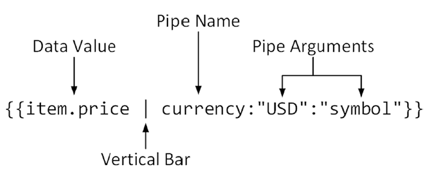

Angular 是一个开发平台。它能帮你更轻松的构建 Web 应用。Angular 集声明式模板、依赖注入、端到端工具和一些最佳实践于一身，为你解决开发方面的各种挑战。Angular 为开发者提升构建 Web、手机或桌面应用的能力。

# 准备开发环境

## 安装Node.js

下载安装Node.js v10.15.0 LTS

## 安装angular-cli

angular-cli是一个命令行工具，可用于创建和管理Angular项目。

安装：

```bash
$ npm install -g @angular/cli
```

查看版本：`ng version`。

查看帮助：`ng help`。

查看某个子命令的帮助：`ng new --help`或`ng help new`。

### 升级angular-cli

全局包升级：

```bash
$ npm uninstall -g @angular/cli
$ npm cache verify
# if npm version is < 5 then use `npm cache clean`
$ npm install -g @angular/cli@latest
```

本地项目升级：

```bash
$ rm -rf node_modules dist # use rmdir /S/Q node_modules dist in Windows Command Prompt; use rm -r -fo node_modules,dist in Windows PowerShell
$ npm install --save-dev @angular/cli@latest
$ npm install
```

## 安装Git

## 选择编辑器

推荐使用[Visual Studio Code](https://code.visualstudio.com/)。

安装如下VSCode扩展：

- Angular Language Service
- Angular 7 Snippets - TypeScript, Html, Angular Material, ngRx, RxJS & Flex Layout

## 选择浏览器

推荐使用Chrome。

<!--more-->

# 入门

## 创建工作空间和应用

Angular 工作空间就是你开发应用的上下文环境。 每个工作空间包含一些供一个或多个项目使用的文件。 每个项目都是一组由应用、库或端到端（e2e）测试构成的文件。

`ng new` 命令会创建一个包含项目的工作空间。而用来创建或操作应用和库的 `add` 和 `generate` 命令必须在工作空间目录下才能执行。

```bash
$ ng new my-app
```

上述命令将生成：

- 一个新的工作空间，根目录名叫 `my-app`
- 一个最初的骨架应用项目，也叫 `my-app`（但位于 `my-app/src` 子目录下，可以使用`--source-dir`指定自己的源码目录名，默认为`src`。）
- 一个端到端测试项目（位于 `my-app/e2e` 子目录下）
- 相关的配置文件

上面的命令执行时，会自动安装依赖，不需要再手动执行`npm install`。如果需要在创建项目时，略过安装依赖，则可以执行：`ng new my-app --skip-install`。

上面的命令执行时，会提示你是否需要使用Angular Routing，以及使用哪种样式格式。你也可以，直接在命令行上加上`--routing`选项和`--style`选项。例如：

```bash
$ ng new my-app --style=scss --routing
```

## 启动开发服务器

Angular 包含一个开发服务器，以便你能轻易地在本地构建应用和启动开发服务器。

```bash
$ cd my-app
$ ng serve --open
```

> 首先，要进入工作空间目录（`my-app`）。
>
> `ng serve` 命令会启动开发服务器，并监视项目中文件的变化，当你修改这些文件时，它就会重新构建应用。因此，新增或修改代码不需要手动重启开发服务器。
>
> 在运行复杂项目时，有时可能无法重新加载应用，这时只需单击浏览器的刷新按钮或导航到 <http://localhost:4200/>即可。
>
> `--open`或`-o`表示在服务器启动后，自动打开浏览器并访问 <http://localhost:4200/>。

默认的端口号是`4200`，要指定其他端口号，使用`--port`参数。另外，使用`--host`指定ip：

```bash
$ ng serve --open --port 3000 --host 0.0.0.0
```

## 开发应用

### 引导文件

Angular应用程序需要一个引导文件，其中包含启动应用程序和加载Angular模块所需要的代码，它是应用程序的入口。引导文件名为`src/main.ts`：

```typescript
import { enableProdMode } from '@angular/core';
import { platformBrowserDynamic } from '@angular/platform-browser-dynamic';

import { AppModule } from './app/app.module';
import { environment } from './environments/environment';

if (environment.production) {
  enableProdMode();
}

platformBrowserDynamic().bootstrapModule(AppModule)
  .catch(err => console.log(err));
```

如果Angular应用要在非浏览器环境（例如Ionic移动开发框架）中运行，则需要使用引导文件中的代码来选择要使用的平台，并加载**根模块**和启动应用程序。`platformBrowserDynamic().bootstrapModule()`是适合基于浏览器的应用的引导方法。

### 主页

主页默认是`src/index.html`，是别人访问你的网站是看到的主页面的 HTML 文件。

```html
<!doctype html>
<html lang="en">
<head>
  <meta charset="utf-8">
  <title>MyApp</title>
  <base href="/">

  <meta name="viewport" content="width=device-width, initial-scale=1">
  <link rel="icon" type="image/x-icon" href="favicon.ico">
</head>
<body>
  <app-root></app-root>
</body>
</html>
```

主页上通常会包含一个Angular根组件（例如`<app-root>`），它是Angular世界的入口。

在构建应用时，CLI 会自动把所有 `js` 和 `css` 等资源（包括第三方资源）添加进去，所以你不必在这里手动添加任何 `<script>` 或 `<link>` 标签。angular-cli使用了WebPack工具，会自动生成项目的css、javascript文件，并将它们自动注入HTTP开发服务器发送给浏览器的HTML文件中。

> 较早版本的Angular依赖于模块加载器，它将为应用程序所需的JavaScript文件发送单独的HTTP请求。开发工具的更改已经简化了此过程，并改用在构建过程中创建的bundle。

### 创建模板

模板是指包含由Angular执行的指令的HTML片段，它用于向用户展示模型中的数据值。

例如：`src/app/app.component.html`：

```html
<!--The content below is only a placeholder and can be replaced.-->
<div style="text-align:center">
  <h1>
    Welcome to {{ title }}!
  </h1>
  
</div>
<h2>Here are some links to help you start: </h2>
<ul>
  <li>
    <h2><a target="_blank" rel="noopener" href="https://angular.io/tutorial">Tour of Heroes</a></h2>
  </li>
  <li>
    <h2><a target="_blank" rel="noopener" href="https://angular.io/cli">CLI Documentation</a></h2>
  </li>
  <li>
    <h2><a target="_blank" rel="noopener" href="https://blog.angular.io/">Angular blog</a></h2>
  </li>
</ul>

<router-outlet></router-outlet>
```

`{{…}}`语法是 Angular 的*插值绑定*语法，Angular会对双花括号之间的内容（通常在组件中定义）进行求值，以获取要显示的值。 这里插值绑定的意思是把组件的 `title` 属性的值绑定到 HTML 中的 `h1` 标记中。

### 创建组件

Angular组件是一个带`@Component`装饰器的类。它负责管理模板，并为其提供所需的数据和逻辑。

> 装饰器用来附加一些元数据，来告诉Angular如何处理一个类。

例如：`src/app/app.component.ts`：

```typescript
import { Component } from '@angular/core';

@Component({
  selector: 'app-root',
  templateUrl: './app.component.html',
  styleUrls: ['./app.component.scss']
})
export class AppComponent {
  title = 'my-app';
}
```

`selector`告诉Angular如何匹配该组件所要应用的在HTML元素。（例如：`<app-root>…</app-root>`）

`templateUrl`或`template`定义了组件将显示的内容的模板。其中，前者在单独的文件中定义模板，后者直接定义内联模板（由一个字符串或模板字符串（使用 “`” 包围）表示的模板）。

`styleUrls`或`styles`则定义了一个或多个仅应用于本组件模板的样式。其中，前者指定一个或多个指向CSS样式表文件的 URL，后者指定一个或多个内联 CSS 样式。它们的作用域将仅限于该组件，而不会“泄露”到外部 HTML 中。

另外，还可设置`moduleId`属性。当`moduleId`属性设置为`module.id`时，则模板和样式表中的相对路径将相对于组件类文件的位置。

> 注意：要使用module.id，需要将tsconfig.json修改如下：
>
> ```json
> "compilerOptions": {
>   "module": "commonjs",
>   …
> }
> ```

如果没有设置`moduleId`，则可以使用相对当前文件的路径，或使用绝对路径（应用程序的根目录为基准。根目录就是index.html所在目录）。

要创建组件，可以使用命令：

```bash
$ cd my-app
$ ng generate component xxx
或者
$ ng g component xxx
```

> 上面代码将生成如下文件：
>
> - src/app/xxx/xxx.component.html
> - src/app/xxx/xxx.component.spec.ts
> - src/app/xxx/xxx.component.ts
> - src/app/xxx/xxx.component.scss
>
> 并且该组件将隶属于根模块。（如果没有显式指定隶属的模块，则默认隶属于根模块）
>
> 可以加上`-m`或`--module`参数来指定隶属的模块：
>
> ```bash
> $ cd my-app
> $ ng generate component xxx --module home
> ```
>
> 上面代码将生成如下文件：
>
> - src/app/xxx/xxx.component.html
> - src/app/xxx/xxx.component.spec.ts
> - src/app/xxx/xxx.component.ts
> - src/app/xxx/xxx.component.scss
>
> 并且该组件将隶属于`home`模块。注意：组件仍然生成在自己的目录中。
>
> 参数`--flat`指示是否创建自己的目录，默认是`false`，即创建自己的目录：
>
> ```bash
> $ cd my-app
> $ ng generate component xxx --module home --flat
> ```
>
> 生成如下文件：
>
> - src/app/xxx.component.html
> - src/app/xxx.component.spec.ts
> - src/app/xxx.component.ts
> - src/app/xxx.component.scss
>
> ```bash
> $ cd my-app/src/app/modx
> $ ng generate component xxx --module home --flat
> ```
>
> 生成如下文件：
>
> - src/app/home/xxx.component.html
> - src/app/home/xxx.component.spec.ts
> - src/app/home/xxx.component.ts
> - src/app/home/xxx.component.scss
>
> 如果组件名与模块名相同，则：
>
> ```bash
> $ cd my-app
> $ ng generate component home --module home
> ```
>
> 生成如下文件：
>
> - src/app/home/home.component.html
> - src/app/home/home.component.spec.ts
> - src/app/home/home.component.ts
> - src/app/home/home.component.scss

### 应用样式

Angular应用的全局样式放在`src/styles.scss`中。另外，每个组件可以有自己的私有样式，它们放在由`styleUrls`指定的样式文件中。

### 将应用程序组合起来

Angular模块将相关功能封装起来，每个应用都至少有一个根模块。

例如`src/app/app.module.ts`：

```typescript
import { BrowserModule } from '@angular/platform-browser';
import { NgModule } from '@angular/core';

import { AppRoutingModule } from './app-routing.module';
import { AppComponent } from './app.component';

@NgModule({
  declarations: [
    AppComponent
  ],
  imports: [
    BrowserModule,
    AppRoutingModule
  ],
  providers: [],
  bootstrap: [AppComponent]
})
export class AppModule { }
```

`declarations`属性指定了该模块包含哪些组件、指令和管道（统称可声明对象），即哪些可声明对象属于这个模块。每个可声明对象都必须声明在（且只能声明在）一个 [NgModule](https://angular.cn/guide/ngmodules) 中。

`bootstrap`属性指定了当该模块引导时需要进行引导的组件（根组件）。列在这里的所有组件都会自动添加到 `entryComponents` 属性中。只有根模块才能设置`bootstrap`属性。一个主页可以有多个根组件。

`import`属性导入其他Angular模块的可声明对象，使得它们在当前Angular模块的**模板**中可用。

`exports`属性导出本模块的可声明对象，它是declarations 的子集。只有声明导出的可声明对象，才能在其它模块中导入使用。通常，根模块不需要导出任何东西，因为其它组件不需要导入根模块。

`providers`属性指定了在当前模块的注入器中可用的一组可注入对象。

创建模块：

```bash
$ cd my-app
$ ng g module home
```

> 上面命令将生成：`src/app/home/home.module.ts`。

# 模块

Angular开发中使用了两种类型的模块：

- JavaScript模块：一个.js文件就是一个模块。通过`export`导出变量为公共的，通过`import`导入公共变量。
- Angular模块：用于描述应用或一组相关功能。每个应用都有一个根模块（Root module），它为Angular提供启动应用所需的信息。Angular模块通过`@NgModule`装饰器来声明。Angular模块的目的是通过`@NgModule`装饰器定义的属性来提供配置信息。

## Angular模块

Angular模块有两种类型：

- 根模块（root module）：用于向Angular描述应用程序，主要包括：运行应用程序所需的功能模块、应该加载哪些自定义功能以及根组件的名称。根模块在引导文件中加载。
- 功能模块（feature module）：用于把相关的应用程序功能归集起来，使应用程序更易于管理。

## 创建Angular模块

```bash
$ ng generate module foo --flat --module=app
```

> `--flat` 把这个文件放进了 `src/app` 中，而不是单独的目录中。
>
> `--module=app` 告诉 CLI 把它注册到 `AppModule` 的 `imports` 数组中。

## 根模块

每个应用都至少有一个 Angular 模块，也就是根模块，用来引导并启动应用。

## 惰性加载模块

# 组件

组件负责控制屏幕上的一小块区域，我们称之为视图。

组件由 HTML 模板和组件类组成，组件类控制视图。

当用户在这个应用中漫游时， Angular 会创建、更新和销毁组件。 

## 创建组件类

每个组件都以`@Component`装饰器标注：

```typescript
import { Component, OnInit } from '@angular/core';

@Component({
  selector: 'app-heros',
  templateUrl: './heros.component.html',
  styleUrls: ['./heros.component.scss']
})
export class HerosComponent implements OnInit {
  constructor() { }
  ngOnInit() {
  }
}
```

`ngOnInit` 是一个生命周期钩子，Angular 在创建完组件后很快就会调用 `ngOnInit`。这里是放置初始化逻辑的好地方。

## 根组件

根组件由根模块的`@Component`装饰器的`bootstrap`属性指定。每个Angular应用必须至少有一个根组件，它会把组件树和页面中的 DOM 连接起来。。

## 主从组件及其交互

把所有特性都放在同一个组件中，将会使应用“长大”后变得不可维护。 你要把大型组件拆分成小一点的子组件，每个子组件都要集中精力处理某个特定的任务或工作流。

### 通过输入属性把数据从父组件传到子组件

`HeroChildComponent` 有两个**输入型属性**：

```typescript
import { Component, Input } from '@angular/core';

import { Hero } from './hero';

@Component({
  selector: 'app-hero-child',
  template: `
    <h3>{{hero.name}} says:</h3>
    <p>I, {{hero.name}}, am at your service, {{masterName}}.</p>
  `
})
export class HeroChildComponent {
  @Input() hero: Hero;
  @Input('master') masterName: string;
}
```

父组件 `HeroParentComponent` 把子组件的 `HeroChildComponent` 放到 `*ngFor` 循环器中，把自己的 `master` 字符串属性绑定到子组件的 `master` 别名上，并把每个循环的 `hero` 实例绑定到子组件的 `hero` 属性：

```typescript
import { Component } from '@angular/core';

import { HEROES } from './hero';

@Component({
  selector: 'app-hero-parent',
  template: `
    <h2>{{master}} controls {{heroes.length}} heroes</h2>
    <app-hero-child *ngFor="let hero of heroes"
      [hero]="hero"
      [master]="master">
    </app-hero-child>
  `
})
export class HeroParentComponent {
  heroes = HEROES;
  master = 'Master';
}
```

### 通过 setter 截听输入属性值的变化

使用一个输入属性的 setter，以拦截父组件中值的变化，并采取行动。

子组件 `NameChildComponent` 的输入属性 `name` 上的这个 setter，会 trim 掉名字里的空格，并把空值替换成默认字符串。

```typescript
import { Component, Input } from '@angular/core';

@Component({
  selector: 'app-name-child',
  template: '<h3>"{{name}}"</h3>'
})
export class NameChildComponent {
  private _name = '';

  @Input()
  set name(name: string) {
    this._name = (name && name.trim()) || '<no name set>';
  }

  get name(): string { return this._name; }
}
```

下面的 `NameParentComponent` 展示了各种名字的处理方式，包括一个全是空格的名字。

```typescript
import { Component } from '@angular/core';

@Component({
  selector: 'app-name-parent',
  template: `
  <h2>Master controls {{names.length}} names</h2>
  <app-name-child *ngFor="let name of names" [name]="name"></app-name-child>
  `
})
export class NameParentComponent {
  // Displays 'Mr. IQ', '<no name set>', 'Bombasto'
  names = ['Mr. IQ', '   ', '  Bombasto  '];
}
```

### 通过ngOnChanges()来截听输入属性值的变化

使用 `OnChanges` 生命周期钩子接口的 `ngOnChanges()` 方法来监测输入属性值的变化并做出回应。

> 当需要监视多个、交互式输入属性的时候，本方法比用属性的 setter 更合适。

 下面 `VersionChildComponent` 会监测输入属性 `major` 和 `minor` 的变化，并把这些变化编写成日志以报告这些变化。

```typescript
import { Component, Input, OnChanges, SimpleChange } from '@angular/core';

@Component({
  selector: 'app-version-child',
  template: `
    <h3>Version {{major}}.{{minor}}</h3>
    <h4>Change log:</h4>
    <ul>
      <li *ngFor="let change of changeLog">{{change}}</li>
    </ul>
  `
})
export class VersionChildComponent implements OnChanges {
  @Input() major: number;
  @Input() minor: number;
  changeLog: string[] = [];

  ngOnChanges(changes: {[propKey: string]: SimpleChange}) {
    let log: string[] = [];
    for (let propName in changes) {
      let changedProp = changes[propName];
      let to = JSON.stringify(changedProp.currentValue);
      if (changedProp.isFirstChange()) {
        log.push(`Initial value of ${propName} set to ${to}`);
      } else {
        let from = JSON.stringify(changedProp.previousValue);
        log.push(`${propName} changed from ${from} to ${to}`);
      }
    }
    this.changeLog.push(log.join(', '));
  }
}
```

`VersionParentComponent` 提供 `minor` 和 `major` 值，把修改它们值的方法绑定到按钮上。

```typescript
import { Component } from '@angular/core';

@Component({
  selector: 'app-version-parent',
  template: `
    <h2>Source code version</h2>
    <button (click)="newMinor()">New minor version</button>
    <button (click)="newMajor()">New major version</button>
    <app-version-child [major]="major" [minor]="minor"></app-version-child>
  `
})
export class VersionParentComponent {
  major = 1;
  minor = 23;

  newMinor() {
    this.minor++;
  }

  newMajor() {
    this.major++;
    this.minor = 0;
  }
}
```

### 父组件监听子组件的事件

子组件暴露一个 `EventEmitter` 属性，当事件发生时，子组件利用该属性 `emits`(向上弹射)事件。父组件绑定到这个事件属性，并在事件发生时作出回应。

子组件的 `EventEmitter` 属性是一个**输出属性**，通常带有`@Output` 装饰器：

```typescript
import { Component, EventEmitter, Input, Output } from '@angular/core';

@Component({
  selector: 'app-voter',
  template: `
    <h4>{{name}}</h4>
    <button (click)="vote(true)"  [disabled]="didVote">Agree</button>
    <button (click)="vote(false)" [disabled]="didVote">Disagree</button>
  `
})
export class VoterComponent {
  @Input()  name: string;
  @Output() voted = new EventEmitter<boolean>();
  didVote = false;

  vote(agreed: boolean) {
    this.voted.emit(agreed);
    this.didVote = true;
  }
}
```

点击按钮会触发 `true` 或 `false`(布尔型*有效载荷*)的事件。

父组件 `VoteTakerComponent` 绑定了一个事件处理器(`onVoted()`)，用来响应子组件的事件(`$event`)并更新一个计数器。

```typescript
import { Component }      from '@angular/core';

@Component({
  selector: 'app-vote-taker',
  template: `
    <h2>Should mankind colonize the Universe?</h2>
    <h3>Agree: {{agreed}}, Disagree: {{disagreed}}</h3>
    <app-voter *ngFor="let voter of voters"
      [name]="voter"
      (voted)="onVoted($event)">
    </app-voter>
  `
})
export class VoteTakerComponent {
  agreed = 0;
  disagreed = 0;
  voters = ['Mr. IQ', 'Ms. Universe', 'Bombasto'];

  onVoted(agreed: boolean) {
    agreed ? this.agreed++ : this.disagreed++;
  }
}
```

### 父组件与子组件通过本地变量互动

父组件不能使用数据绑定来访问子组件的属性或调用子组件的方法。但可以在父组件模板里，新建一个本地变量来代表子组件，然后利用这个变量来读取子组件的属性和调用子组件的方法。例如：子组件 `CountdownTimerComponent` 进行倒计时，归零时发射一个导弹。`start` 和 `stop` 方法负责控制时钟并在模板里显示倒计时的状态信息。

```typescript
import { Component, OnDestroy, OnInit } from '@angular/core';

@Component({
  selector: 'app-countdown-timer',
  template: '<p>{{message}}</p>'
})
export class CountdownTimerComponent implements OnInit, OnDestroy {

  intervalId = 0;
  message = '';
  seconds = 11;

  clearTimer() { clearInterval(this.intervalId); }

  ngOnInit()    { this.start(); }
  ngOnDestroy() { this.clearTimer(); }

  start() { this.countDown(); }
  stop()  {
    this.clearTimer();
    this.message = `Holding at T-${this.seconds} seconds`;
  }

  private countDown() {
    this.clearTimer();
    this.intervalId = window.setInterval(() => {
      this.seconds -= 1;
      if (this.seconds === 0) {
        this.message = 'Blast off!';
      } else {
        if (this.seconds < 0) { this.seconds = 10; } // reset
        this.message = `T-${this.seconds} seconds and counting`;
      }
    }, 1000);
  }
}
```

计时器组件的宿主组件 `CountdownLocalVarParentComponent` 如下：

```typescript
import { Component }                from '@angular/core';
import { CountdownTimerComponent }  from './countdown-timer.component';

@Component({
  selector: 'app-countdown-parent-lv',
  template: `
  <h3>Countdown to Liftoff (via local variable)</h3>
  <button (click)="timer.start()">Start</button>
  <button (click)="timer.stop()">Stop</button>
  <div class="seconds">{{timer.seconds}}</div>
  <app-countdown-timer #timer></app-countdown-timer>
  `,
  styleUrls: ['../assets/demo.css']
})
export class CountdownLocalVarParentComponent { }
```

把本地变量(`#timer`)放到(`<countdown-timer>`)标签中，用来代表子组件。这样父组件的模板就得到了子组件的引用，于是可以在父组件的模板中访问子组件的所有属性和方法。

### @ViewChild

*本地变量*方法是个简单便利的方法，但是它也有局限性。因为父组件-子组件的连接必须全部在父组件的**模板**中进行，而父组件类本身的代码对子组件没有访问权。如果父组件的*类*需要读取子组件的属性值或调用子组件的方法，就不能使用*本地变量*方法，这时需要把子组件作为 *ViewChild*，**注入**到父组件里面。

`@ViewChild`装饰器告诉Angular在模板中查询与参数指定的类型或模板引用变量相匹配的第一个指令或组件对象，并将其指派给被装饰属性。参数可以有多个类或模板引用变量，它们之间使用逗号分隔。

```typescript
import { AfterViewInit, ViewChild } from '@angular/core';
import { Component }                from '@angular/core';
import { CountdownTimerComponent }  from './countdown-timer.component';

@Component({
  selector: 'app-countdown-parent-vc',
  template: `
  <h3>Countdown to Liftoff (via ViewChild)</h3>
  <button (click)="start()">Start</button>
  <button (click)="stop()">Stop</button>
  <div class="seconds">{{ seconds() }}</div>
  <app-countdown-timer></app-countdown-timer>
  `,
  styleUrls: ['../assets/demo.css']
})
export class CountdownViewChildParentComponent implements AfterViewInit {

  @ViewChild(CountdownTimerComponent)
  private timerComponent: CountdownTimerComponent;

  seconds() { return 0; }

  ngAfterViewInit() {
    // Redefine `seconds()` to get from the `CountdownTimerComponent.seconds` ...
    // but wait a tick first to avoid one-time devMode
    // unidirectional-data-flow-violation error
    setTimeout(() => this.seconds = () => this.timerComponent.seconds, 0);
  }

  start() { this.timerComponent.start(); }
  stop() { this.timerComponent.stop(); }
}
```

子组件`CountdownTimerComponent`和原来一样。

把子组件的视图插入到父组件类需要做一点额外的工作。

首先，你必须导入对装饰器 `@ViewChild` 以及生命周期钩子 `AfterViewInit` 的引用。

接着，通过 `@ViewChild` 属性装饰器，将子组件 `CountdownTimerComponent` 注入到私有属性 `timerComponent` 里面。

组件元数据里就不再需要 `#timer` 本地变量了。而是把按钮绑定到父组件自己的 `start` 和 `stop` 方法，使用父组件的 `seconds` 方法的插值表达式来展示秒数变化。

这些方法可以直接访问被注入的计时器组件。

`ngAfterViewInit()` 生命周期钩子是非常重要的一步。被注入的计时器组件只有在 Angular 显示了父组件视图之后才能访问，所以它先把秒数显示为 0.

然后 Angular 会调用 `ngAfterViewInit` 生命周期钩子，但这时候再更新父组件视图的倒计时就已经太晚了。Angular 的单向数据流规则会阻止在同一个周期内更新父组件视图。应用在显示秒数之前会被迫*再等一轮*。

使用 `setTimeout()` 来等下一轮，然后改写 `seconds()` 方法，这样它接下来就会从注入的这个计时器组件里获取秒数的值。

### @ViewChildren

`@ViewChildren`装饰器告诉Angular在模板中查询与参数指定的类型或模板引用变量相匹配的所有指令或组件对象，并将他们指派给被装饰属性。参数可以有多个类或模板引用变量，它们之间使用逗号分隔。

```typescript
import { Component, Input, ViewChildren, QueryList } from "@angular/core";
import { Model } from "./repository.model";
import { Product } from "./product.model";
import { PaCellColor } from "./cellColor.directive";

@Component({
  selector: "paProductTable",
  templateUrl: "productTable.component.html"
})
export class ProductTableComponent {
  @Input("model")
  dataModel: Model;
  getProduct(key: number): Product {
    return this.dataModel.getProduct(key);
  }
  getProducts(): Product[] {
    return this.dataModel.getProducts();
  }
  deleteProduct(key: number) {
    this.dataModel.deleteProduct(key);
  }
  showTable: boolean = true;
  @ViewChildren(PaCellColor)
  viewChildren: QueryList<PaCellColor>;
  ngAfterViewInit() {
    this.viewChildren.changes.subscribe(() => {
      this.updateViewChildren();
    });
    this.updateViewChildren();
  }
  private updateViewChildren() {
    setTimeout(() => {
      this.viewChildren.forEach((child, index) => {
        child.setColor(index % 2 ? true : false);
      })
    }, 0);
  }
}
```


### 内容投影

如果组件的宿主元素包含内容，那么可以使用特殊的`ng-content`元素将其包含在组件模板中，这称为内容投影（content projection）。也就是说，组件模板中的`ng-content`元素引用组件宿主元素的内容。

```typescript
import { Component } from "@angular/core";

@Component({
  selector: "paToggleView",
  templateUrl: "toggleView.component.html"
})
export class PaToggleView {
  showContent: boolean = true;
}
```

该组件定义了一个`showContent`属性，用于确定是否在模板中显示宿主元素内容。

toggleView.component.html：

```html
<div class="checkbox">
  <label>
    <input type="checkbox" [(ngModel)]="showContent" />
    Show Content
  </label>
</div>
<ng-content *ngIf="showContent"></ng-content>
```

应用这个组件：

```html
<div class="row m-2">
  <div class="col-4 p-2">
    <paProductForm (paNewProduct)="addProduct($event)"></paProductForm>
  </div>
  <div class="col-8 p-2">
    <paToggleView>
      <paProductTable [model]="model"></paProductTable>
    </paToggleView>
  </div>
</div>
```

`<paToggleView>`是`PaToggleView`组件的宿主元素，它的内容包含`<paProductTable>`元素。`PaToggleView`组件不知道它的宿主元素的内容，并且只能通过`<ng-content>`元素将其包含在模板中。

### 父组件和子组件通过服务来通讯

父组件和它的子组件共享同一个服务，利用该服务*在组件家族内部*实现双向通讯。该服务实例的作用域被限制在父组件和其子组件内。这个组件子树之外的组件将无法访问该服务或者与它们通讯。

```typescript
import { Injectable } from '@angular/core';
import { Subject }    from 'rxjs';

@Injectable()
export class MissionService {
  // Observable string sources
  private missionAnnouncedSource = new Subject<string>();
  private missionConfirmedSource = new Subject<string>();

  // Observable string streams
  missionAnnounced$ = this.missionAnnouncedSource.asObservable();
  missionConfirmed$ = this.missionConfirmedSource.asObservable();

  // Service message commands
  announceMission(mission: string) {
    this.missionAnnouncedSource.next(mission);
  }

  confirmMission(astronaut: string) {
    this.missionConfirmedSource.next(astronaut);
  }
}
```

`MissionControlComponent` 提供服务的实例，并将其共享给它的子组件(通过 `providers` 元数据数组)，子组件可以通过构造函数将该实例注入到自身。

```typescript
import { Component }          from '@angular/core';

import { MissionService }     from './mission.service';

@Component({
  selector: 'app-mission-control',
  template: `
    <h2>Mission Control</h2>
    <button (click)="announce()">Announce mission</button>
    <app-astronaut *ngFor="let astronaut of astronauts"
      [astronaut]="astronaut">
    </app-astronaut>
    <h3>History</h3>
    <ul>
      <li *ngFor="let event of history">{{event}}</li>
    </ul>
  `,
  providers: [MissionService]
})
export class MissionControlComponent {
  astronauts = ['Lovell', 'Swigert', 'Haise'];
  history: string[] = [];
  missions = ['Fly to the moon!',
              'Fly to mars!',
              'Fly to Vegas!'];
  nextMission = 0;

  constructor(private missionService: MissionService) {
    missionService.missionConfirmed$.subscribe(
      astronaut => {
        this.history.push(`${astronaut} confirmed the mission`);
      });
  }

  announce() {
    let mission = this.missions[this.nextMission++];
    this.missionService.announceMission(mission);
    this.history.push(`Mission "${mission}" announced`);
    if (this.nextMission >= this.missions.length) { this.nextMission = 0; }
  }
}
```

`AstronautComponent` 也通过自己的构造函数注入该服务。由于每个 `AstronautComponent` 都是 `MissionControlComponent` 的子组件，所以它们获取到的也是父组件的这个服务实例。

```typescript
import { Component, Input, OnDestroy } from '@angular/core';

import { MissionService } from './mission.service';
import { Subscription }   from 'rxjs';

@Component({
  selector: 'app-astronaut',
  template: `
    <p>
      {{astronaut}}: <strong>{{mission}}</strong>
      <button
        (click)="confirm()"
        [disabled]="!announced || confirmed">
        Confirm
      </button>
    </p>
  `
})
export class AstronautComponent implements OnDestroy {
  @Input() astronaut: string;
  mission = '<no mission announced>';
  confirmed = false;
  announced = false;
  subscription: Subscription;

  constructor(private missionService: MissionService) {
    this.subscription = missionService.missionAnnounced$.subscribe(
      mission => {
        this.mission = mission;
        this.announced = true;
        this.confirmed = false;
    });
  }

  confirm() {
    this.confirmed = true;
    this.missionService.confirmMission(this.astronaut);
  }

  ngOnDestroy() {
    // prevent memory leak when component destroyed
    this.subscription.unsubscribe();
  }
}
```

注意，这个例子保存了 `subscription` 变量，并在 `AstronautComponent` 被销毁时调用 `unsubscribe()`退订。 这是一个用于防止内存泄漏的保护措施。实际上，在这个应用程序中并没有这个风险，因为 `AstronautComponent` 的生命期和应用程序的生命期一样长。但在更复杂的应用程序环境中就不一定了。

不需要在 `MissionControlComponent` 中添加这个保护措施，因为它作为父组件，控制着 `MissionService` 的生命期。

## 模板

组件类和模板共同定义了 Angular 的视图。

### 定义模板

HTML 是 Angular 模板的语言，几乎所有的 HTML 语法都是有效的模板语法。但值得注意的例外是`<script>`元素，它被禁用了，以阻止脚本注入攻击的风险。

另外，`<html>`、`<body>`和`<base>`这些元素用在模板中是没有意义的。

模板除了可以使用像`<h2>`和`<p>`这样的典型的 HTML 元素，还可以通过组件、指令和插值表达式来扩展模板中的 HTML 词汇。它们看上去就是新元素和属性。 例如，`*ngFor`、`{{hero.name}}`、`(click)`、`[hero]`和`<hero-detail>`。

#### 模板引用变量

模板引用变量是模板中对 DOM 元素的引用，另外，它还可以引用 Angular 组件或指令或[Web Component](https://developer.mozilla.org/en-US/docs/Web/Web_Components)。当Angular在模板中遇到引用变量时，它将引用变量的值设置为引用变量所在的那个元素。

##### 定义模板引用变量

语法一：

`#模板引用变量`

例如：

```html
<input #phone placeholder="phone number">
<button (click)="callPhone(phone.value)">Call</button>
```

语法二：

`ref-模板引用变量`

例如：

```html
<input ref-fax placeholder="fax number">
<button (click)="callFax(fax.value)">Fax</button> 
```

##### 显式设置模板引用变量的值

模板引用变量的值默认是声明它的那个元素（即宿主元素），但也可以显式地给它设置其他值。例如，下面的示例将模板引用变量显式地设置为Angular的`ngForm`指令：

```html
<form (ngSubmit)="onSubmit(heroForm)" #heroForm="ngForm">
  <div class="form-group">
    <label for="name">Name
      <input class="form-control" name="name" required [(ngModel)]="hero.name">
    </label>
  </div>
  <button type="submit" [disabled]="!heroForm.form.valid">Submit</button>
</form>
<div [hidden]="!heroForm.form.valid">
  {{submitMessage}}
</div>
```

原生的 `<form>` 元素没有 `form` 属性，但 `NgForm` 指令有。这就解释了为何当 `heroForm.form.valid` 是无效时你可以禁用提交按钮， 并能把整个表单控件树传给父组件的 `onSubmit` 方法。

##### 导出指令用于模板引用变量

`@Directive`装饰器的`exportAs`属性指定了一个名称，在模板引用变量中将使用该名称来引用指令。上面的示例中，使用的`ngForm`就是在`NgForm`指令类中通过`exportsAs`属性指定的：

```typescript
@Directive({
  selector: 'form:not([ngNoForm]):not([formGroup]),ngForm,ng-form,[ngForm]',
  providers: [formDirectiveProvider],
  host: {'(submit)': 'onSubmit($event)', '(reset)': 'onReset()'},
  outputs: ['ngSubmit'],
  exportAs: 'ngForm'
})
export class NgForm extends ControlContainer implements Form, AfterViewInit {
  …
}
```

当使用`exportAs`装饰器属性时，在模板表达式和数据绑定中可以使用指定定义的所有方法和属性，包括那些名称以下划线为前缀或应用`private`关键字的方法和属性。

##### 引用模板引用变量

模板引用变量的作用范围是*整个模板*。

#### 模板表达式

大部分JavaScript表达式也是合法的模板表达式，但你不能使用那些具有或可能引发副作用的 JavaScript 表达式，包括：

1. 赋值 (`=`、`+=`、`-=`、 ...)
2. `new`、`typeof`、`instanceof` 等运算符
3. 使用`;`或`,`串联起来的表达式
4. 自增或自减运算符 `++`和`--`
5. 一些 ES2015+ 版本的操作符
6. 不支持位运算`|`和`&`

模板表达式中支持JavaScript中没有的*模板表达式运算符*：

1. 管道运算符`|`
2. 安全导航运算符`?.`
3. 非空断言运算符`!`

模板表达式不能引用全局命名空间中的任何东西， 不能引用`window`或`document`，不能调用`console.log`或`Math.max`。 它们被局限于只能访问来自表达式上下文中的成员。典型的表达式上下文就是这个组件实例，另外还有模板引用变量。

Angular 执行模板表达式，产生一个值，并把它赋值给绑定目标的属性。这个绑定目标可能是 HTML 元素、组件或指令。

> 由于模板表达式不会接受TypeScript编译器的检查，而且也不易于进行单元测试。因此，模板表达式应该尽可能保持简单，在理想情况下，仅用于从组件检索数据并进行格式化，然后用于显示。所有复杂的检索和处理逻辑都应该放在组件或模型中进行定义。

##### 管道运算符

管道是一个简单的函数，它接受一个输入值，并返回转换结果。

```html
<div>Title through uppercase pipe: {{title | uppercase}}</div>
```

管道操作符会把它左侧的表达式结果传给它右侧的管道函数。

还可以通过多个管道串联表达式：

```html
<!-- Pipe chaining: convert title to uppercase, then to lowercase -->
<div>
  Title through a pipe chain:
  {{title | uppercase | lowercase}}
</div>
```

还能对它们使用参数：
```html
<!-- pipe with configuration argument => "February 25, 1970" -->
<div>Birthdate: {{currentHero?.birthdate | date:'longDate'}}</div>
```

`json` 管道对调试绑定特别有用：

```html
<div>{{currentHero | json}}</div>
```

它生成的输出是这样的：

```json
{ "id": 0, "name": "Hercules", "emotion": "happy",
  "birthdate": "1970-02-25T08:00:00.000Z",
  "url": "http://www.imdb.com/title/tt0065832/",
  "rate": 325 }
```

##### 安全导航运算符

`?.` 与 `.` 一样用于属性的限定名中。

`?.` 会在它遇到第一个空值（ `null` 和 `undefined` ）的时候跳出，并显示是空的，而不会抛出异常。

```html
The null hero's name is {{nullHero?.firstName}}
```

等价于：

```html
The null hero's name is {{nullHero && nullHero.firstName}}
```

或

```html
The null hero's name is <span *ngIf="nullHero">{{nullHero.firstName}}</span>
```

Angular 安全导航操作符 (`?.`)，在像`a?.b?.c?.d`这样的长属性路径中，它工作得很完美。

##### 非空断言运算符

在 TypeScript 2.0 中，你可以使用 `--strictNullChecks` 标志强制开启[严格空值检查](http://www.typescriptlang.org/docs/handbook/release-notes/typescript-2-0.html)。TypeScript 就会确保不存在意料之外的 null 或 undefined。

在这种模式下，有类型的变量默认是不允许 null 或 undefined 值的，如果有未赋值的变量，或者试图把 null 或 undefined 赋值给不允许为空的变量，类型检查器就会抛出一个错误。

如果类型检查器在运行期间无法确定一个变量是 null 或 undefined，那么它也会抛出一个错误。 你自己可能知道它不会为空，但类型检查器不知道。 所以你要告诉类型检查器，它不会为空，这时就要用到[*非空断言操作符*](http://www.typescriptlang.org/docs/handbook/release-notes/typescript-2-0.html#non-null-assertion-operator)。

*Angular* 模板中的非空断言操作符（`!`）也是同样的用途。

例如，在用`*ngIf`来检查过 `hero` 是已定义的之后，就可以断言 `hero` 属性一定是已定义的：

```html
<!--No hero, no text -->
<div *ngIf="hero">
  The hero's name is {{hero!.name}}
</div>
```

在 Angular 编译器把你的模板转换成 TypeScript 代码时，这个操作符会防止 TypeScript 报告 "`hero.name` 可能为 null 或 undefined"的错误。

与[*安全导航操作符*](https://angular.cn/guide/template-syntax#safe-navigation-operator)不同的是，**非空断言操作符**不会防止出现 `null` 或 `undefined`。 它只是告诉 TypeScript 的类型检查器对特定的属性表达式，不做“严格空值检测”。

如果你打开了严格控制检测，那就要用到这个模板操作符，而其它情况下则是可选的。

##### 字符串字面量

在模板表达式中，字符串字面量要记得加上引号，特别是出现在属性绑定中时。

```html
<td [ngSwitch]="'Apples'">…</td>

<div [ngClass]="'p-a-1 ' + getClass()">
  …
</div> 
```

##### 类型转换函数`$any`

有时候，绑定表达式可能会报类型错误，并且它不能或很难指定类型。要消除这种报错，你可以使用 `$any` 转换函数来把表达式转换成 [`any` 类型](http://www.typescriptlang.org/docs/handbook/basic-types.html#any)。

```html
<!-- Accessing an undeclared member -->
<div>
  The hero's marker is {{$any(hero).marker}}
</div>
```

在这个例子中，当 Angular 编译器把模板转换成 TypeScript 代码时，`$any` 表达式可以防止 TypeScript 编译器报错说 `marker` 不是 `Hero` 接口的成员。

`$any` 转换函数可以和 `this` 联合使用，以便访问组件中未声明过的成员：

```html
<!-- Accessing an undeclared member -->
<div>
  Undeclared members is {{$any(this).member}}
</div>
```

`$any` 转换函数可以在绑定表达式中任何可以进行方法调用的地方使用。

##### 表达式上下文

当Angular对一个表达式进行求值时，它会在表达式的上下文中进行求值。

典型的表达式上下文就是这个组件实例。因此，模板能够访问组件的公共（public）方法和公共属性，而不需要带任何类型的前缀。

除了组件外，表达式上下文还可以包括组件之外的对象。 比如模板输入变量 (`let customer`)和模板引用变量(`#customerInput`)：

```html
<ul>
  <li *ngFor="let customer of customers">{{customer.name}}</li>
</ul>

<input #customerInput>{{customerInput.value}}</label>
```

表达式中的上下文变量是由*模板变量*、指令的*上下文对象*（如果有）和组件的*成员*叠加而成的。 如果你要引用的名字存在于以上多个命名空间中，那么，模板变量优先级最高，其次是指令的上下文对象，最后是组件的成员。

模板表达式不能引用全局命名空间中的任何东西，比如 `window` 或 `document`。它们也不能调用 `console.log` 或 `Math.max`。 它们只能引用表达式上下文中的成员。如果要访问全局命名空间中的功能，那么可以由组件提供，由它来代表模板进行访问。

组件：

```typescript
@Component({
  selector: "app",
  templateUrl: "template.html"
})
export class ProductComponent {
  model: Model = new Model();
  // ...constructor and methods omitted for brevity...
  counter: number = 1;
  get nextProduct(): Product {
    return this.model.getProducts().shift();
  }
  getProductPrice(index: number): number {
    return Math.floor(this.getProduct(index).price);
  }
}
```

模板：

```html
<div class="bg-info p-2 text-white">
  The rounded price is {{getProductPrice(1)}}
</div>
```

#### 模板语句

模板语句用来响应由绑定目标（如 HTML 元素、组件或指令）触发的事件。就像这样：`(event)="statement"`。

虽然模板表达式不应该有副作用，但是模板语句通常会有副作用。

和模板表达式一样，模板语句使用的语言也像 JavaScript。 模板语句解析器和模板表达式解析器有所不同，特别之处在于它支持基本赋值 (`=`) 和表达式链 (`;`和`,`)。

但下列 JavaScript 语法仍然是不允许的，包括：

1）`new`运算符

2）自增和自减运算符：`++`和`--`

3）操作并赋值，例如`+=`和`-=`

4）位运算符`|`和`&`

5）模板表达式运算符（即管道运算符、安全导航运算符、非空断言运算符）

##### 语句上下文

和模板表达式中一样，模板语句无法引用全局命名空间的任何东西。它们不能引用`window`或者`document`， 不能调用`console.log`或者`Math.max`。语句只能引用语句上下文中 —— 通常是正在绑定事件的那个组件实例或者是模板引用变量。

典型的*语句上下文*就是当前组件的实例。 `(click)="deleteHero()"` 中的 *deleteHero* 就是这个数据绑定组件上的一个方法。

```html
<button (click)="deleteHero()">Delete hero</button>
```

语句上下文可以引用模板自身上下文中的属性。 在下面的例子中，就把模板的 `$event` 对象、模板输入变量 (`let hero`)和模板引用变量 (`#heroForm`)传给了组件中的一个事件处理器方法。

```html
<button (click)="onSave($event)">Save</button>
<button *ngFor="let hero of heroes" (click)="deleteHero(hero)">{{hero.name}}</button>
<form #heroForm (ngSubmit)="onSubmit(heroForm)"> ... </form>
```

模板上下文中的变量名的优先级高于组件上下文中的变量名。在上面的 `deleteHero(hero)` 中，`hero` 是一个模板输入变量，而不是组件中的 `hero` 属性。

### 模板的应用方式

> 在浏览器（Chrome）上，点击查看网页源代码时，只会看到模板的静态内容。如果要查看最终生成的网页内容，可以通过右键单击浏览器窗口并从弹出菜单中选择Inspect，或者打开开发者工具查看。

#### 内联模板

在创建组件时，可以通过`template`属性直接指定内联模板。

内联模板是由一个字符串或模板字符串（使用 “`” 包围）表示的模板。

#### 模板文件

在创建组件时，也可以通过`templateUrl`属性来指定一个外部模板文件。

## 样式

Angular 应用使用标准的 CSS 来设置样式。另外，Angular 还能把组件样式捆绑在组件上，以实现比标准样式表更加模块化的设计。

### 全局样式

当使用 CLI 进行构建时，Angular应用的全局样式默认放在`src/styles.scss`中。也可以通过配置 `angular.json` 文件，自定义要包含的全局样式：

```json
"architect": {
  "build": {
    "builder": "@angular-devkit/build-angular:browser",
    "options": {
      "styles": [
        "src/styles.css",
        "src/more-styles.css",
        { "input": "src/lazy-style.scss", "lazy": true },  //懒加载
        { "input": "src/pre-rename-style.scss", "bundleName": "renamed-style" } //重命名
      ],
      ...
```

当使用`@import`导入样式时，可以从项目的任何位置导入，而无需相对路径：

```scss
// src/app/app.component.scss
// A relative path works, "src/style-paths/_variables.scss"
@import '../style-paths/variables';
// But now this works as well
@import 'variables';
```

另外，在HTML文档的`<head>`中定义的样式也适用于所有元素。

### 组件样式

有几种方式把样式加入组件：

- 设置`@Component`的 `styles` 或 `styleUrls` 元数据
- 内联在模板的 HTML 中
- 通过 CSS 文件导入

这些组件样式只会对该组件的模板生效。它们既不会被模板中嵌入的组件继承，也不会被通过内容投影（如 ng-content）嵌进来的组件继承。

这种范围限制就是所谓的**样式模块化**特性

- 可以使用对每个组件最有意义的 CSS 类名和选择器。
- 类名和选择器是局限于该组件的，它不会和应用中其它地方的类名和选择器冲突。
- 组件的样式*不会*因为别的地方修改了样式而被意外改变。
- 你可以让每个组件的 CSS 代码和它的 TypeScript、HTML 代码放在一起，这将促成清爽整洁的项目结构。
- 将来你可以修改或移除组件的 CSS 代码，而不用遍历整个应用来看它有没有在别处用到。

#### 元数据中的样式

你可以给 `@Component` 装饰器添加一个 `styles` 数组型属性，这个数组中的每一个字符串（通常也只有一个）定义一份 CSS。

```typescript
@Component({
  selector: 'app-root',
  template: `
    <h1>Tour of Heroes</h1>
    <app-hero-main [hero]="hero"></app-hero-main>
  `,
  styles: ['h1 { font-weight: normal; }']
})
export class HeroAppComponent {
/* . . . */
}
```

当使用 `--inline-styles` 标识创建组件时，Angular CLI 的 `ng generate component` 命令就会定义一个空的 `styles`数组：

```bash
$ ng generate component hero-app --inline-style
```

#### 元数据中的样式文件

你可以通过把外部 CSS 文件添加到 `@Component` 的 `styleUrls` 属性中来加载外部样式。

```typescript
@Component({
  selector: 'app-root',
  template: `
    <h1>Tour of Heroes</h1>
    <app-hero-main [hero]="hero"></app-hero-main>
  `,
  styleUrls: ['./hero-app.component.css']
})
export class HeroAppComponent {
/* . . . */
}
```

> 你可以指定多个样式文件，甚至可以组合使用 `style` 和 `styleUrls` 方式。

当你使用 Angular CLI 的 `ng generate component` 命令但不带 `--inline-style` 标志时，CLI 会为你创建一个空白的样式表文件，并且在所生成组件的 `styleUrls` 中引用该文件。

#### 模板内联样式

你也可以直接在组件的 HTML 模板中写 `<style>` 标签来内嵌 CSS 样式。

```typescript
@Component({
  selector: 'app-hero-controls',
  template: `
    <style>
      button {
        background-color: white;
        border: 1px solid #777;
      }
    </style>
    <h3>Controls</h3>
    <button (click)="activate()">Activate</button>
  `
})
```

#### 模板中的 `<link>` 标签

你也可以在组件的 HTML 模板中写 `<link>` 标签。

```typescript
@Component({
  selector: 'app-hero-team',
  template: `
    <!-- We must use a relative URL so that the AOT compiler can find the stylesheet -->
    <link rel="stylesheet" href="../assets/hero-team.component.css">
    <h3>Team</h3>
    <ul>
      <li *ngFor="let member of hero.team">
        {{member}}
      </li>
    </ul>`
})
```

#### CSS `@imports` 语法

你还可以利用标准的 CSS [`@import` 规则](https://developer.mozilla.org/en/docs/Web/CSS/@import)来把其它 CSS 文件导入到 CSS 文件中。

在这种情况下，URL 是相对于你正在导入的 CSS 文件的。

```typescript
/* The AOT compiler needs the `./` to show that this is local */
@import './hero-details-box.css';
```

#### 视图封装模式

默认情况下，组件的 CSS 样式被封装进了自己的视图中，而不会影响到应用程序的其它部分。这实际上是由*视图封装模式*控制的。

通过在组件的元数据上设置视图封装模式，你可以分别控制*每个组件*的封装模式。 可选的封装模式有：

- `ShadowDom` 模式使用浏览器原生的 Shadow DOM 实现（参见 [MDN](https://developer.mozilla.org/) 上的 [Shadow DOM](https://developer.mozilla.org/en-US/docs/Web/Web_Components/Shadow_DOM)）来为组件的宿主元素附加一个 Shadow DOM。组件的视图被附加到这个 Shadow DOM 中，组件的样式也被包含在这个 Shadow DOM 中。从而使得DOM的各个部分彼此隔离。
- `Native` 视图包装模式使用浏览器原生 Shadow DOM 的一个废弃实现。
- `Emulated` 模式（**默认值**）通过预处理（并改名）CSS 代码来模拟 Shadow DOM 的行为，以达到把 CSS 样式局限在组件视图中的目的。
- `None` 意味着 Angular 不使用视图封装。 Angular 会把 CSS 添加到全局样式中。而不会应用上前面讨论过的那些作用域规则、隔离和保护等。 从本质上来说，这跟把组件的样式直接放进 HTML的`<head>`中是一样的。

通过组件元数据中的 `encapsulation` 属性来设置组件封装模式：

```typescript
// warning: few browsers support shadow DOM encapsulation at this time
encapsulation: ViewEncapsulation.Native
```

> `ShadowDom` 模式只适用于提供了原生 Shadow DOM 支持的浏览器（参见 [Can I use](http://caniuse.com/) 上的 [Shadow DOM v1](https://caniuse.com/#feat=shadowdomv1) 部分）。 它仍然受到很多限制，这就是为什么仿真 (`Emulated`) 模式是默认选项，并建议将其用于大多数情况。

#### 特殊的选择器

组件样式中有一些从影子(Shadow) DOM 样式范围领域（记录在[W3C](https://www.w3.org/)的[CSS Scoping Module Level 1](https://www.w3.org/TR/css-scoping-1)中） 引入的特殊选择器。

##### :host

使用 `:host` 伪类选择器，用来选择组件的*宿主*元素。

```css
:host {
  display: block;
  border: 1px solid black;
}
```

`:host` 选择器是把宿主元素作为目标的*唯一*方式。除此之外，你将没办法指定它， 因为宿主元素不是组件自身模板的一部分，而是父组件模板的一部分。

以函数形式，即在`host`之后的括号内包含另一个选择器，就可以有条件地应用`:host`样式。

下面例子再次把宿主元素作为目标，但是只有当它同时带有 `active` CSS 类的时候才会生效。

```css
:host(.active) {
  border-width: 3px;
}
```

##### :host-context

 `:host-context()` 伪类选择器在当前组件宿主元素的*祖先节点*中查找 **CSS 类**（只支持CSS类选择器）， 直到文档的根节点为止。

在下面的例子中，只有当某个祖先元素有 CSS 类 `theme-light` 时，才会把 `background-color` 样式应用到组件*内部*的所有 `<h2>` 元素中：

```css
:host-context(.theme-light) h2 {
  background-color: #eef;
}
```

### 非CSS样式文件

如果使用 CLI 进行构建，那么你可以用 [sass](http://sass-lang.com/)、[less](http://lesscss.org/) 或 [stylus](http://stylus-lang.com/) 来编写样式，并使用相应的扩展名（`.scss`、`.less`、`.styl`）把它们指定到 `@Component.styleUrls` 元数据中。例子如下：

```scss
@Component({
  selector: 'app-root',
  templateUrl: './app.component.html',
  styleUrls: ['./app.component.scss']
})
...
```

CLI 的构建过程会运行相关的预处理器。

> 添加到 `@Component.styles` 数组中的样式字符串*必须写成 CSS语法*，因为 CLI 没法对这些内联的样式使用任何 CSS 预处理器。

## 动态组件

（核心知识.组件与模板.动态组件）

## Angular自定义元素*

*Angular 元素*就是打包成*自定义元素*的 Angular 组件。所谓自定义元素就是一套与具体框架无关的用于定义新 HTML 元素的 Web 标准。

自定义元素扩展了 HTML，它允许你定义一个由 JavaScript 代码创建和控制的标签。 浏览器会维护一个自定义元素（也叫 Web Components）的注册表 `CustomElementRegistry`，它把一个可实例化的 JavaScript 类映射到 HTML 标签上。

把组件转换成自定义元素可以让所有所需的 Angular 基础设施都在浏览器中可用。 创建自定义元素的方式简单直观，它会自动把你组件定义的视图连同变更检测与数据绑定等 Angular 的功能映射为相应的原生 HTML 等价物。

自定义元素会自举启动 —— 它们在添加到 DOM 中时就会自行启动自己，并在从 DOM 中移除时自行销毁自己。一旦自定义元素添加到了任何页面的 DOM 中，它的外观和行为就和其它的 HTML 元素一样了，不需要对 Angular 的术语或使用约定有任何特殊的了解。


### 把组件转换成自定义元素

Angular 提供了 `createCustomElement()` 函数，以支持把 Angular 组件及其依赖转换成自定义元素。该函数会收集该组件的 `Observable` 型属性，提供浏览器创建和销毁实例时所需的 Angular 功能，还会对变更进行检测并做出响应。

这个转换过程实现了 `NgElementConstructor` 接口，并创建了一个构造器类，用于生成该组件的一个自举型实例。

然后用 JavaScript 的 `customElements.define()` 函数把这个配置好的构造器和相关的自定义元素标签注册到浏览器的 `CustomElementRegistry` 中。 当浏览器遇到这个已注册元素的标签时，就会使用该构造器来创建一个自定义元素的实例。


使用 [Angular CLI](https://cli.angular.io/) 可以自动为你的项目添加正确的polyfill脚本：`ng add @angular/elements --name=*your_project_name*`。

### 为自定义元素添加类型支持

# 指令

指令是一个带有“指令元数据”的类。在 TypeScript 中，要通过`@Directive`装饰器把元数据附加到类上。

Angular支持三种类型的指令：

- 组件
- 结构型指令
- 属性型指令

> 组件是一个带模板的指令，它们不依赖其他地方提供的内容。`@Component`装饰器实际上就是一个`@Directive`装饰器，只是扩展了一些面向模板的特性。详见“组件”。

## 结构型指令

结构型指令通过在 DOM 中添加、移除和操纵它们所附加到的宿主元素来修改布局。例如：`*ngFor`。

结构型指令都以“\*”为前缀。赋值给结构型指令的字符串不是模板表达式，而是一个**微语法** —— 由 Angular 自己解释的小型语言。

只能往一个宿主元素上应用一个结构型指令。

### 内置结构型指令

#### ngIf指令

当`ngIf`指令为`false`时，Angular 从 DOM 中物理地移除了这个元素子树。 它销毁了子树中的组件及其状态，也潜在释放了可观的资源，最终让用户体验到更好的性能。

而通过属性绑定或样式绑定来显示和隐藏元素及其子元素（即通过将元素属性`hidden`设置为`true`或将样式属性`display`设置为`none`），这些元素仍然留在 DOM 中。 子树中的组件及其状态仍然保留着。 即使对于不可见属性，Angular 也会继续检查变更。 子树可能占用相当可观的内存和运算资源。

```html
<hero-detail *ngIf="isActive"></hero-detail>
```

#### ngSwitchCase、ngSwitchDefault指令

`ngSwitchCase`指令、`ngSwitchDefault`指令必须与`ngSwitch`指令一起使用。

当使用`ngSwitchCase`指令指定字面量字符串时，要注意使用双重引号：

```html
<div class="bg-info p-2 mt-1" [ngSwitch]="getProduct(1).name">
  <span *ngSwitchCase="targetName">Kayak</span>
  <span *ngSwitchCase="'Lifejacket'">Lifejacket</span>
  <span *ngSwitchDefault>Other Product</span>
</div>
```

#### ngFor指令

`ngFor`是一个重复器指令，它对对象集合中的每个对象重复生成一段内容。

`ngFor`指令既可以用在HTML元素上：

```html
<div *ngFor="let hero of heroes">{{hero.fullName}}</div>
```

也可以应用在一个组件元素上：

```html
<hero-detail *ngFor="let hero of heroes" [hero]="hero"></hero-detail>
```

赋值给`*ngFor`的字符串不是模板表达式，它是一个**微语法** 。在这个例子中，字符串"let hero of heroes"的含义是：

取出`heroes`数组中的每个英雄，把它存入局部变量`hero`中，并在每次迭代时对模板 HTML 可用。

`hero`前面的`let`关键字创建了名叫`hero`的局部**模板输入变量**，以便它可供嵌套元素使用。

```html
<table class="table table-sm table-bordered mt-1 text-dark">
  <tr><th>Name</th><th>Category</th><th>Price</th></tr>
  <tr *ngFor="let item of getProducts()">
    <td>{{item.name}}</td>
    <td>{{item.category}}</td>
    <td>{{item.price}}</td>
  </tr>
</table>
```

> 注意：模板输入变量和模板引用变量不是一回事！

##### 使用索引

`ngFor`指令内置了一些方便使用索引的局部模板变量：

| 模板变量 | 描述                                                       |
| -------- | ---------------------------------------------------------- |
| index    | 当前对象的索引。`index`的值从0开始。                       |
| odd      | 如果当前对象在数据源中的位置为奇数，则`odd`的值为`true`。  |
| even     | 如果当前对象在数据源中的位置为偶数，则`even`的值为`true`。 |
| first    | 如果当前对象是数据源的第一个对象，则`first`的值为`true`。  |
| last     | 如果当前对象是数据源的最后一个对象，则`last`的值为`true`。 |

> 注意：我们不能直接访问这些模板变量的值，而是必须将它们赋值给一个局部变量，即使名称相同。

###### 使用 `index` 

```html
<table class="table table-sm table-bordered mt-1 text-dark">
  <tr><th></th><th>Name</th><th>Category</th><th>Price</th></tr>
  <tr *ngFor="let item of getProducts(); let i = index">
    <td>{{i +1}}</td>
    <td>{{item.name}}</td>
    <td>{{item.category}}</td>
    <td>{{item.price}}</td>
  </tr>
</table>
```

###### 使用`odd`和`even`

```html
<table class="table table-sm table-bordered mt-1">
  <tr><th></th><th>Name</th><th>Category</th><th>Price</th></tr>
  <tr *ngFor="let item of getProducts(); let i = index; let odd = odd"
      [class.bg-primary]="odd" [class.bg-info]="!odd">
    <td>{{i + 1}}</td>
    <td>{{item.name}}</td>
    <td>{{item.category}}</td>
    <td>{{item.price}}</td>
  </tr>
</table>
```

> 注意：在一个元素上定义的局部模板变量，可以立即在同一个元素的表达式中使用，例如上例中`odd`局部变量。

###### 使用`first`和`last`

```html
<table class="table table-sm table-bordered mt-1">
  <tr class="text-dark">
    <th></th><th>Name</th><th>Category</th><th>Price</th>
  </tr>
  <tr *ngFor="let item of getProducts(); let i = index; let odd = odd;
              let first = first; let last = last"
      [class.bg-primary]="odd" [class.bg-info]="!odd"
      [class.bg-warning]="first || last">
    <td>{{i + 1}}</td>
    <td>{{item.name}}</td>
    <td>{{item.category}}</td>
    <td *ngIf="!last">{{item.price}}</td>
  </tr>
</table>
```

##### trackBy

`ngFor`指令有时候会性能较差，特别是在大型列表中。 对一个条目的一丁点改动、移除或添加，都会导致级联的 DOM 操作。

例如，我们可以通过重新从服务器查询来刷新英雄列表。 刷新后的列表可能包含很多（如果不是全部的话）以前显示过的英雄。

我们知道这一点，是因为每个英雄的id没有变化。 但在 Angular 看来，它只是一个由新的对象引用构成的新列表， 它没有选择，只能清理旧列表、舍弃那些 DOM 元素，并且用新的 DOM 元素来重建一个新列表。

如果给它一个追踪函数，Angular 就可以避免这种折腾。 追踪函数告诉 Angular：我们知道两个具有相同`hero.id`的对象其实是同一个英雄。 下面就是这样一个函数：

```typescript
trackByHeroes(index: number, hero: Hero) { return hero.id; }
```

追踪函数必须定义两个参数：对象在数据源中的位置以及数据对象。该函数的返回结果唯一地标识一个对象，而如果两个对象产生相同的结果，则认为这两个对象相等。

现在，把NgForTrackBy指令设置为那个追踪函数。

```html
<div *ngFor="let hero of heroes; trackBy:trackByHeroes">
  ({{hero.id}}) {{hero.fullName}}
</div>
```

追踪函数不会阻止所有 DOM 更改。 如果同一个英雄的属性变化了，Angular 就可能不得不更新DOM元素。 但是如果这个属性没有变化 —— 而且大多数时候它们不会变化 —— Angular 就能留下这些 DOM 元素。列表界面就会更加平滑，提供更好的响应。

### 微语法

在指令前加上`*`前缀表示它们依靠**微语法**来提供内容，它们会展开成`<ng-template>`元素，并用它来包裹宿主元素。这些使用微语法的指令就是结构型指令。

`*ngIf`的展开：

```html
<hero-detail *ngIf="currentHero" [hero]="currentHero"></hero-detail>
```

展开为：

```html
<ng-template [ngIf]="currentHero">
  <hero-detail [hero]="currentHero"></hero-detail>
</ng-template>
```

`*ngSwitch`的展开：

```html
<span [ngSwitch]="toeChoice">
  <span *ngSwitchCase="'Eenie'">Eenie</span>
  <span *ngSwitchCase="'Meanie'">Meanie</span>
  <span *ngSwitchCase="'Miney'">Miney</span>
  <span *ngSwitchCase="'Moe'">Moe</span>
  <span *ngSwitchDefault>other</span>
</span>
```

展开为：

```html
<span [ngSwitch]="toeChoice">
  <ng-template [ngSwitchCase]="'Eenie'"><span>Eenie</span></ng-template>
  <ng-template [ngSwitchCase]="'Meanie'"><span>Meanie</span></ng-template>
  <ng-template [ngSwitchCase]="'Miney'"><span>Miney</span></ng-template>
  <ng-template [ngSwitchCase]="'Moe'"><span>Moe</span></ng-template>
  <ng-template ngSwitchDefault><span>other</span></ng-template>
</span>
```

`*ngFor`的展开：

```html
<hero-detail *ngFor="let hero of heroes; let i = index; trackBy:trackByHeroes" [hero]="hero"></hero-detail>
```

展开为：

```html
<ng-template ngFor let-hero [ngForOf]="heroes" let-i="index" [ngForTrackBy]="trackByHeroes">
  <hero-detail [hero]="hero"></hero-detail>
</ng-template>
```

> `*ngFor` 属性之外的每一样东西都会留在宿主元素（`<hero-detail>`）上，也就是说它移到了 `<ng-template>` 内部。 在这个例子中，`[hero]="hero"` 留在了 `<hero-detail>` 上。

Angular 微语法能让你通过简短的、友好的字符串来配置一个指令。 微语法解析器把这个字符串翻译成 `<ng-template>` 上的属性：

- `let` 关键字声明一个[模板输入变量](https://angular.cn/guide/structural-directives#template-input-variable)，你会在模板中引用它。上面例子中，这个输入变量就是 `hero`和`i` 。 解析器会把 `let hero`和`let i`  翻译成命名变量 `let-hero`和`let-i` 。
- 微语法解析器接收 `of` 和 `trackby`，把它们首字母大写（`of` -> `Of`, `trackBy` -> `TrackBy`）， 并且给它们加上指令的属性名（`ngFor`）前缀，最终生成的名字是 `ngForOf` 和 `ngForTrackBy`。 还有两个 `NgFor` 的*输入属性*，指令据此了解到列表是 `heroes`，而 track-by 函数是 `trackByHeroes`。
- `NgFor` 指令在列表上循环，每个循环中都会设置和重置它自己的*上下文*对象上的属性。 这些属性包括 `index` 和 `odd` 以及一个特殊的属性名 `$implicit`（隐式变量）。
- `let-i` 变量是通过 `let i=index` 来定义的。 Angular 把它们设置为*上下文*对象中的 `index` 属性的当前值。
- 这里并没有指定 `let-hero` 的上下文属性。它的来源是隐式的。 Angular 将 `let-hero` 设置为此上下文中 `$implicit` 属性的值， 它是由 `NgFor` 用当前迭代中的英雄初始化的。
- [API 参考手册](https://angular.cn/api/common/NgForOf)中描述了 `NgFor` 指令的其它属性和上下文属性。
- `NgFor` 是由 `NgForOf` 指令来实现的。请参阅 [NgForOf API 参考手册](https://angular.cn/api/common/NgForOf)来了解 `NgForOf` 指令的更多属性及其上下文属性。

这些微语法机制在你写自己的结构型指令时也同样有效。

#### `<ng-template>`指令

`<ng-template>`是一个 Angular 元素，用来渲染 HTML。 它永远不会直接显示出来。 事实上，在渲染视图之前，Angular 会把 `<ng-template>` 及其内容*替换为*一个注释。

如果没有使用结构型指令，而仅仅把一些别的元素包装进 `<ng-template>` 中，那些元素就是不可见的。 在下面的这个短语"Hip! Hip! Hooray!"中，中间的这个 "Hip!"（欢呼声） 就是如此。

```html
<p>Hip!</p>
<ng-template>
  <p>Hip!</p>
</ng-template>
<p>Hooray!</p>
```

Angular 抹掉了中间的那个 "Hip!" ：

```html
<p _ngcontent-c0>Hip!</p>
<!---->
<p _ngcontent-c0>Hooray!</p>
```

结构型指令会让 `<ng-template>` 正常工作。

### 使用`<ng-container>`把一些兄弟元素归为一组

通常都需要一个*根*元素作为结构型指令的宿主。例如：`<li>`元素就是一个典型的供 `NgFor` 使用的宿主元素：

```html
<li *ngFor="let hero of heroes">{{hero.name}}</li>
```

当没有这样一个单一的宿主元素时，你可以把这些内容包裹在一个原生的 HTML 容器元素中，比如 `<div>`，并且把结构型指令附加到这个"包裹"上。

```html
<div *ngIf="hero" class="name">{{hero.name}}</div>
```

但引入另一个容器元素（通常是 `<span>` 或 `<div>`）来把一些元素归到一个单一的*根元素*下，通常也会带来问题。注意，是“通常”而不是“总会”。

这种用于分组的元素可能会破坏模板的外观表现，从而导致 CSS 的样式失效或以不期待的方式被应用。

另一个问题是：有些 HTML 元素需要所有的直属下级都具有特定的类型。 比如，`<select>` 元素要求直属下级必须为 `<option>`，那就没办法把这些选项包装进 `<div>` 或 `<span>` 中。

Angular 的 `<ng-container>` 是一个分组元素，但它不会污染样式或元素布局，因为 Angular *压根不会把它放进 DOM*中。

```html
<div>
  Pick your favorite hero
  (<label><input type="checkbox" checked (change)="showSad = !showSad">show sad</label>)
</div>
<select [(ngModel)]="hero">
  <ng-container *ngFor="let h of heroes">
    <ng-container *ngIf="showSad || h.emotion !== 'sad'">
      <option [ngValue]="h">{{h.name}} ({{h.emotion}})</option>
    </ng-container>
  </ng-container>
</select>
```

`<ng-container>` 是一个由 Angular 解析器负责识别处理的语法元素。 它不是一个指令、组件、类或接口，更像是 JavaScript 中 `if` 块中的*花括号*。没有这些花括号，JavaScript 只会执行第一句，而你原本的意图是把其中的所有语句都视为一体来根据条件执行。 而 `<ng-container>` 满足了 Angular 模板中类似的需求。

### 创建结构型指令

创建指令很像创建组件。

- 导入 `Directive` 装饰器（而不再是 `Component`）。
- 导入符号 `Input`、`TemplateRef` 和 `ViewContainerRef`，你在*任何*结构型指令中都会需要它们。
- 给指令类添加装饰器。
- 设置 CSS *属性选择器* ，以便在模板中标识出这个指令该应用于哪个元素。

例如：我们写一个名叫 `UnlessDirective` 的结构型指令，它是 `NgIf` 的反义词。 `NgIf` 在条件为 `true` 的时候显示模板内容，而 `UnlessDirective` 则会在条件为 `false` 时显示模板内容。

```html
<p *appUnless="condition">Show this sentence unless the condition is true.</p>
```

指令类：

```typescript
import { Directive, Input, TemplateRef, ViewContainerRef } from '@angular/core';

/**
 * Add the template content to the DOM unless the condition is true.
 */
@Directive({ selector: '[appUnless]'})
export class UnlessDirective {
  private hasView = false;

  constructor(
    private templateRef: TemplateRef<any>,
    private viewContainer: ViewContainerRef) { }

  @Input() set appUnless(condition: boolean) {
    if (!condition && !this.hasView) {
      this.viewContainer.createEmbeddedView(this.templateRef);
      this.hasView = true;
    } else if (condition && this.hasView) {
      this.viewContainer.clear();
      this.hasView = false;
    }
  }
}
```

指令的*选择器*通常是把指令的属性名括在方括号中，如 `[appUnless]`。 这个方括号定义了一个 CSS [属性选择器](https://developer.mozilla.org/en-US/docs/Web/CSS/Attribute_selectors)。

指令的*属性名*应该拼写成*小驼峰*形式，并且带有一个前缀。在这个例子中，前缀是 `app`。

> 前缀`Ng`或`ng`被保留用于内置的Angular功能，因此自定义指令不应该使用这些前缀。

指令的*类名*用 `Directive` 结尾，参见[风格指南](https://angular.cn/guide/styleguide#02-03)。 但 Angular 自己的指令例外。

指令创建好后，还需要将它添加到所属模块（例如`AppModule`）的 `declarations` 数组中，这样才可以在其他模板中使用。

```typescript
import { NgModule }      from '@angular/core';
import { FormsModule }   from '@angular/forms';
import { BrowserModule } from '@angular/platform-browser';

import { AppComponent }         from './app.component';
import { heroSwitchComponents } from './hero-switch.components';
import { UnlessDirective }    from './unless.directive';

@NgModule({
  imports: [ BrowserModule, FormsModule ],
  declarations: [
    AppComponent,
    heroSwitchComponents,
    UnlessDirective
  ],
  bootstrap: [ AppComponent ]
})
export class AppModule { }
```

#### TemplateRef 和 ViewContainerRef

像上面例子一样的简单结构型指令会从 Angular 生成的 `<ng-template>` 元素中创建一个[*内嵌的视图*](https://angular.cn/api/core/EmbeddedViewRef)，并把这个视图插入到一个[*视图容器*](https://angular.cn/api/core/ViewContainerRef)中，紧挨着本指令原来的宿主元素 `<p>`（译注：注意不是子节点，而是兄弟节点）。

你可以使用[`TemplateRef`](https://angular.cn/api/core/TemplateRef)取得 `<ng-template>` 的内容，并通过[`ViewContainerRef`](https://angular.cn/api/core/ViewContainerRef)来访问这个*视图容器*。

你可以把它们都注入到指令的构造函数中，作为该类的私有属性。

```typescript
constructor(
  private templateRef: TemplateRef<any>,
  private viewContainer: ViewContainerRef) { }
```

#### appUnless 属性

该指令的使用者会把一个 true/false 条件绑定到 `[appUnless]` 属性上。 也就是说，该指令需要一个带有 `@Input` 的 `appUnless` 属性。

```typescript
@Input() set appUnless(condition: boolean) {
  if (!condition && !this.hasView) {
    this.viewContainer.createEmbeddedView(this.templateRef);
    this.hasView = true;
  } else if (condition && this.hasView) {
    this.viewContainer.clear();
    this.hasView = false;
  }
}
```

一旦该值的条件发生了变化，Angular 就会去设置 `appUnless` 属性。

- 如果条件为假，并且以前尚未创建过该视图，就告诉*视图容器（ViewContainer）*根据模板创建一个*内嵌视图*。
- 如果条件为真，并且视图已经显示出来了，就会清除该容器，并销毁该视图。

没有人会读取 `appUnless` 属性，因此它不需要定义 getter。

### 创建迭代结构型指令

Angular为需要遍历数据源的指令提供特殊的支持。

示例：创建一个类似`ngFor`指令的`paFor`指令。

`paFor`指令的应用：

```html
<div class="m-2">
  <div class="checkbox">
    <label>
      <input type="checkbox" [(ngModel)]="showTable" />
      Show Table
    </label>
  </div>
  <table *paIf="showTable"
         class="table table-sm table-bordered table-striped">
    <tr><th></th><th>Name</th><th>Category</th><th>Price</th></tr>
    <ng-template [paForOf]="getProducts()" let-item>
      <tr><td colspan="4">{{item.name}}</td></tr>
    </ng-template>
  </table>
</div>
```

`paFor`指令类：

```typescript
import { Directive, ViewContainerRef, TemplateRef,
         Input, SimpleChange } from "@angular/core";
@Directive({
  selector: "[paForOf]"
})
export class PaIteratorDirective {
  constructor(private container: ViewContainerRef,
              private template: TemplateRef<Object>) {}
  @Input("paForOf")
  dataSource: any;
  ngOnInit() {
    this.container.clear(); //清空视图容器
    for (let i = 0; i < this.dataSource.length; i++) {
      this.container.createEmbeddedView(this.template,
                                        new PaIteratorContext(this.dataSource[i]));
    }
  }
}

class PaIteratorContext {
  constructor(public $implicit: any) {}
}
```

`@Directive`装饰器中的`selector`属性匹配那些具有`paForOf`属性的元素，`paForOf`属性也是`dataSource`输入属性的数据来源，并提供待迭代的对象源，它的名称必须以`Of`结尾，以便支持简洁语法。

`let-item`属性，它没有赋值，用于告诉Angular，想要把隐式值（implicit value，即`$implicit`）赋给一个名为`item`的模板引用变量。在本例中，`$implicit`被赋予了数据源中当前处理的对象。

`createEmbeddedView`方法为数据源中每次迭代的对象添加一个新的视图到视图容器中。该方法提供了两个参数：

- `TemplateRef`对象：提供了要插入视图容器中的内容；
- 上下文对象：为`$implicit`提供数据。本示例中，就是通过`PaIteratorContext`的构造器给`$implicit`设置值。另外，在下面例子可以看到，这个对象的属性可以在模板中被赋给模板引用变量。

#### 提供额外的上下文数据

除了隐式值外，结构型指令还可以为模板提供任意的额外值，以赋给模板引用变量并用于绑定。例如，我们这里为`paFor`指令提供`odd`、`even`、`first`和`last`值：

```typescript
import { Directive, ViewContainerRef, TemplateRef,
         Input, SimpleChange } from "@angular/core";
@Directive({
  selector: "[paForOf]"
})
export class PaIteratorDirective {
  constructor(private container: ViewContainerRef,
              private template: TemplateRef<Object>) {}
  @Input("paForOf")
  dataSource: any;
  ngOnInit() {
    this.container.clear();
    for (let i = 0; i < this.dataSource.length; i++) {
      this.container.createEmbeddedView(this.template,
                                        new PaIteratorContext(this.dataSource[i],
                                                              i, this.dataSource.length));
    }
  }
}
class PaIteratorContext {
  odd: boolean; even: boolean;
  first: boolean; last: boolean;
  constructor(public $implicit: any,
              public index: number, total: number ) {
    this.odd = index % 2 == 1;
    this.even = !this.odd;
    this.first = index == 0;
    this.last = index == total - 1;
  }
}
```

这样，在模板上就可以创建模板引用变量来接收这些上下文属性。

```html
<div class="m-2">
  <div class="checkbox">
    <label>
      <input type="checkbox" [(ngModel)]="showTable" />
      Show Table
    </label>
  </div>
  <table *paIf="showTable"
         class="table table-sm table-bordered table-striped">
    <tr><th></th><th>Name</th><th>Category</th><th>Price</th></tr>
    <ng-template [paForOf]="getProducts()" let-item let-i="index"
                 let-odd="odd" let-even="even">
      <tr [class.bg-info]="odd" [class.bg-warning]="even">
        <td>{{i + 1}}</td>
        <td>{{item.name}}</td>
        <td>{{item.category}}</td>
        <td>{{item.price}}</td>
      </tr>
    </ng-template>
  </table>
</div>
```

迭代结构指令支持简洁语法，并且省略了`ng-template`元素。当使用简洁语法时，属性的`Of`后缀将被省略，在名称前加上一个星号，并且省略括号。

另一处变化是将所有上下文值并入指令的表达式中，将所有的“let-”属性替换掉。主数据值成为初始表达式的一部分，而其他上下文值以分号进行分隔。

```html
<div class="m-2">
  <div class="checkbox">
    <label>
      <input type="checkbox" [(ngModel)]="showTable" />
      Show Table
    </label>
  </div>
  <table *paI
         <td>{{item.category}}</td>
<td>{{item.price}}</td>
</tr>
</table>
</div>f="showTable"
class="table table-sm table-bordered table-striped">
<tr><th></th><th>Name</th><th>Category</th><th>Price</th></tr>
<tr *paFor="let item of getProducts(); let i = index; let odd = odd;
            let even = even" [class.bg-info]="odd" [class.bg-warning]="even">
  <td>{{i + 1}}</td>
  <td>{{item.name}}</td>
  <td>{{item.category}}</td>
  <td>{{item.price}}</td>
</tr>
</table>
</div>
```

#### 处理数据源变量

迭代结构型指令使用的数据源可能发生两种变更：属性级数据变更和集合级数据变更。

属性级数据变更是指数据源中的单个对象的属性发生改变。Angular会自动处理这种变更，在那些依赖上下文数据的绑定中反映上下文数据出现的任何变化。

集合级数据变更是指，向数据源集合中添加、删除或替换对象。Angular不会自动检测到这种变更，因此迭代指令的`ngOnChanges`方法将没机会得到调用。要接收关于集合级数据变更的通知，必须实现`ngDoCheck`方法：无论哪里发生变更或发生什么样的变更，在应用程序中检测到数据变更时都会调用这个方法。`ngDoCheck`方法可以让指令响应变更，即使Angular没有自动检测到这些变更。然而，实现`ngDoCheck`方法需要谨慎，这是因为它可能会破坏Web应用程序的性能。这是因为，每当Angular在应用程序中的任何地方检测到变更时，都会调用`ngDoCheck`方法，并且这些变更发生的频率要比预期的更快。鉴于此，Angular提供了一些能更加有效管理更新的工具，使得只有在需要时才更新内容。

##### 差异器

```typescript
import { Directive, ViewContainerRef, TemplateRef,
         Input, SimpleChange, IterableDiffer, IterableDiffers,
         ChangeDetectorRef, CollectionChangeRecord, DefaultIterableDiffer
       } from "@angular/core";
@Directive({
  selector: "[paForOf]"
})
export class PaIteratorDirective {
  private differ: DefaultIterableDiffer<any>;
  constructor(private container: ViewContainerRef,
              private template: TemplateRef<Object>,
              private differs: IterableDiffers,
              private changeDetector: ChangeDetectorRef) {
  }
  @Input("paForOf")
  dataSource: any;
  ngOnInit() {
    this.differ =
      <DefaultIterableDiffer<any>> this.differs.find(this.dataSource).create();
  }
  ngDoCheck() {
    let changes = this.differ.diff(this.dataSource);
    if (changes != null) {
      console.log("ngDoCheck called, changes detected");
      changes.forEachAddedItem(addition => {
        this.container.createEmbeddedView(this.template,
                                          new PaIteratorContext(addition.item,
                                                                addition.currentIndex, changes.length));
      });
    }
  }
}
class PaIteratorContext {
  odd: boolean; even: boolean;
  first: boolean; last: boolean;
  constructor(public $implicit: any,
              public index: number, total: number ) {
    this.odd = index % 2 == 1;
    this.even = !this.odd;
    this.first = index == 0;
    this.last = index == total - 1;
  }
}
```

Angular内置了一些叫做差异器（differ）的类，可以检测不同类型对象中发生的变更。`IterableDiffers.find`方法接受一个对象并返回一个能够为该对象创建差异器的`IterableDifferFactory`对象。`IterableDifferFactory`类定义了一个`create`方法，该方法返回一个`IterableDiffer`对象，该对象将执行实际的变更检测。

`IterableDifferFactory.create`方法接受一个可选参数，该参数指定变更跟踪函数，这正是`ngFor`指令实现其`trackBy`功能的方式。

`IterableDiffer.diff`方法接受一个对象进行比较，并返回变更列表（`IterableChanges`）。如果没有变更，则返回`null`。当应用程序的其他地方发生变更而调用`ngDoCheck`方法时，检查变更列表是否为`null`可以让该指令避免不必要的工作。

变更列表（默认实现：`DefaultIterableDiffer`）的方法和属性：

| 名称                        | 描述                                               |
| --------------------------- | -------------------------------------------------- |
| collection                  | 返回发生过变更的对象集合。                         |
| length                      | 返回发生过变更的对象个数。                         |
| forEachItem(func)           | 对变更集合中的每个对象调用`func`函数。             |
| forEachPreviousItem(func)   | 对先前版本的集合中的每个对象调用`func`函数。       |
| forEachAddedItem(func)      | 对变更集合中的每个**新**对象调用`func`函数。       |
| forEachMovedItem(func)      | 对变更集合中位置发生变更的每个对象调用`func`函数。 |
| forEachRemovedItem(func)    | 对变更集合中删除的每个对象调用`func`函数。         |
| forEachIdentityChange(func) | 对变更集合中标识发生变更的每个对象调用`func`函数。 |

上表中的函数参数都接收一个`IterableChangeRecord`对象，该对象使用下表中的属性来描述数据项以及数据如何变更：

| 名称          | 描述                                          |
| ------------- | --------------------------------------------- |
| item          | 返回数据项。                                  |
| trackById     | 如果使用`trackBy`函数，则这个属性返回标识值。 |
| currentIndex  | 返回集合中数据项的当前索引。                  |
| previousIndex | 返回集合中数据项的之前索引。                  |

使用差异器检查变更后，虽然减少了许多不必要的更新，但`ngDoCheck`方法仍然会被调用，并且该指令每次都必须检查数据变更，因此仍然有不必要的工作要做。

> Angular还提供了键/值对的变更跟踪，这样就可以监测`Map`对象以及使用属性作为映射键的对象。

##### 跟踪视图

上一节在处理新增数据项的创建时，数据变更检测的处理非常简单。这一节介绍的删除或修改的处理则更复杂，这要求指令跟踪哪个视图与哪个数据对象相关联。

示例：

首先，在component.ts中添加一个从数据模型中删除Product对象的方法：

```typescript
import { ApplicationRef, Component } from "@angular/core";
import { NgForm } from "@angular/forms";
import { Model } from "./repository.model";
import { Product } from "./product.model";
import { ProductFormGroup } from "./form.model";
@Component({
  selector: "app",
  templateUrl: "template.html"
})
export class ProductComponent {
  model: Model = new Model();
  form: ProductFormGroup = new ProductFormGroup();
  getProduct(key: number): Product {
    return this.model.getProduct(key);
  }
  getProducts(): Product[] {
    return this.model.getProducts();
  }
  newProduct: Product = new Product();
  addProduct(p: Product) {
    this.model.saveProduct(p);
  }
  deleteProduct(key: number) { //根据产品键值，从数据模型中删除产品
    this.model.deleteProduct(key);
  }
  formSubmitted: boolean = false;
  submitForm(form: NgForm) {
    this.formSubmitted = true;
    if (form.valid) {
      this.addProduct(this.newProduct);
      this.newProduct = new Product();
      form.reset();
      this.formSubmitted = false;
    }
  }
  showTable: boolean = true;
}
```

template.html：

```html
...
<table *paIf="showTable"
       class="table table-sm table-bordered table-striped">
  <tr><th></th><th>Name</th><th>Category</th><th>Price</th><th></th></tr>
  <tr *paFor="let item of getProducts(); let i = index; let odd = odd;
              let even = even" [class.bg-info]="odd" [class.bg-warning]="even">
    <td style="vertical-align:middle">{{i + 1}}</td>
    <td style="vertical-align:middle">{{item.name}}</td>
    <td style="vertical-align:middle">{{item.category}}</td>
    <td style="vertical-align:middle">{{item.price}}</td>
    <td class="text-center">
      <button class="btn btn-danger btn-sm" (click)="deleteProduct(item.id)">
        Delete
      </button>
    </td>
  </tr>
</table>
...
```

然后，要在结构型指令`paFor`中处理数据变更，即当从数据源删除对象时进行响应：

```typescript
import {
  Directive, ViewContainerRef, TemplateRef,
  Input, SimpleChange, IterableDiffer, IterableDiffers,
  ChangeDetectorRef, CollectionChangeRecord, DefaultIterableDiffer, ViewRef
} from "@angular/core";

@Directive({
  selector: "[paForOf]"
})
export class PaIteratorDirective {
  private differ: DefaultIterableDiffer<any>;
  //使用一个Map对象来收集数据对象与其视图之间的映射
  private views: Map<any, PaIteratorContext> = new Map<any, PaIteratorContext>();
  constructor(private container: ViewContainerRef,
               private template: TemplateRef<Object>,
               private differs: IterableDiffers,
               private changeDetector: ChangeDetectorRef) {
  }
  @Input("paForOf")
  dataSource: any;
  ngOnInit() {
    this.differ =
      <DefaultIterableDiffer<any>>this.differs.find(this.dataSource).create();
  }
  ngDoCheck() {
    let changes = this.differ.diff(this.dataSource);
    if (changes != null) {
      changes.forEachAddedItem(addition => {
        let context = new PaIteratorContext(addition.item,
                                            addition.currentIndex, changes.length);
        context.view = this.container.createEmbeddedView(this.template,
                                                         context);
        this.views.set(addition.trackById, context);
      });
      let removals = false;
      changes.forEachRemovedItem(removal => {
        removals = true;
        let context = this.views.get(removal.trackById);
        if (context != null) {
          this.container.remove(this.container.indexOf(context.view));
          this.views.delete(removal.trackById);
        }
      });
      if (removals) {
        let index = 0;
        //更新后续的索引和数据总数
        this.views.forEach(context =>
                           context.setData(index++, this.views.size));
      }
    }
  }
}

class PaIteratorContext {
  index: number;
  odd: boolean; even: boolean;
  first: boolean; last: boolean;
  view: ViewRef;
  constructor(public $implicit: any,
               public position: number, total: number ) {
    this.setData(position, total);
  }
  setData(index: number, total: number) {
    this.index = index;
    this.odd = index % 2 == 1;
    this.even = !this.odd;
    this.first = index == 0;
    this.last = index == total - 1;
  }
}
```


### 启用结构型指令

即将指令类添加到所属模块的`declarations`属性中。

### `@ContentChild`

`@ContentChild`装饰器的参数是一个或多个指令类，也可以是一个或多个模板引用变量的名称（例如：`@ContentChild("myVariable")`），它们之间使用逗号分隔。它指示Angular在宿主元素的内容中查找与参数匹配的指令，并将其赋给被装饰的属性。

父指令：

```typescript
import { Directive, Input, Output, EventEmitter,
        SimpleChange, ContentChild } from "@angular/core";
import { PaCellColor } from "./cellColor.directive";

@Directive({
  selector: "table"
})
export class PaCellColorSwitcher {
  @Input("paCellDarkColor")
  modelProperty: Boolean;
  @ContentChild(PaCellColor)
  contentChild: PaCellColor;
  ngOnChanges(changes: { [property: string]: SimpleChange }) {
    if (this.contentChild != null) {
      //调用子指令的方法
      this.contentChild.setColor(changes["modelProperty"].currentValue);
    }
  }
}
```

子指令：

```typescript
import { Directive, HostBinding } from "@angular/core";
@Directive({
  selector: "td"
})
export class PaCellColor {
  @HostBinding("class")
  bgClass: string = "";
  setColor(dark: Boolean) {
    this.bgClass = dark ? "bg-dark" : "";
  }
}
```

模板：

```html
...
<div class="col-8">
  <div class="checkbox">
    <label>
      <input type="checkbox" [(ngModel)]="showTable" />
      Show Table
    </label>
  </div>
  <div class="checkbox">
    <label>
      <input type="checkbox" [(ngModel)]="darkColor" />
      Dark Cell Color
    </label>
  </div>
  <table *paIf="showTable" [paCellDarkColor]="darkColor"
         class="table table-sm table-bordered table-striped">
    <tr><th></th><th>Name</th><th>Category</th><th>Price</th><th></th></tr>
    <tr *paFor="let item of getProducts(); let i = index; let odd = odd;
                let even = even" [class.bg-info]="odd" [class.bg-warning]="even">
      <td style="vertical-align:middle">{{i + 1}}</td>
      <td style="vertical-align:middle">{{item.name}}</td>
      <td style="vertical-align:middle">{{item.category}}</td>
      <td style="vertical-align:middle">{{item.price}}</td>
      <td class="text-xs-center">
        <button class="btn btn-danger btn-sm" (click)="deleteProduct(i)">
          Delete
        </button>
      </td>
    </tr>
  </table>
</div>
...
```

如果要在结果中包含子内容的后代，则使用`@ContentChild(PaCellColor, {descendants: true})`。

### `@ContentChildren`

`@ContentChild`装饰器只接收第一个与参数匹配的指令对象，而`@ContentChildren`接收所有与参数匹配的指令对象。

```typescript
import { Directive, Input, Output, EventEmitter,
        SimpleChange, ContentChildren, QueryList } from "@angular/core";
import { PaCellColor } from "./cellColor.directive";

@Directive({
  selector: "table"
})
export class PaCellColorSwitcher {
  @Input("paCellDarkColor")
  modelProperty: Boolean;
  @ContentChildren(PaCellColor)
  contentChildren: QueryList<PaCellColor>;
  ngOnChanges(changes: { [property: string]: SimpleChange }) {
    this.updateContentChildren(changes["modelProperty"].currentValue);
  }
  private updateContentChildren(dark: Boolean) {
    if (this.contentChildren != null && dark != undefined) {
      this.contentChildren.forEach((child, index) => {
        child.setColor(index % 2 ? dark : !dark);
      });
    }
  }
}
```

`QueryList的成员：`

| 成员          | 描述                                                         |
| ------------- | ------------------------------------------------------------ |
| length        | 匹配的指令对象个数。                                         |
| first         | 第一个匹配的指令对象。                                       |
| last          | 最后一个匹配的指令对象。                                     |
| map(func)     | 对每个匹配的指令对象调用`func`函数，以创建一个与`Array.map`方法相同的新数组。 |
| filter(func)  | 对每个匹配的指令对象调用`func`函数，以创建一个数组，该数组包含`func`函数返回`true`的对象。等同于`Array.filter`方法。 |
| reduce(func)  | 对每个匹配的指令对象调用`func`函数，以创建等价于`Array.reduce`方法的单个值。 |
| forEach(func) | 对每个匹配的指令对象调用`func`函数，相当于`Array.forEach`方法。 |
| some(func)    | 对每个匹配的指令对象调用`func`函数，如果`func`函数至少返回`true`一次，则返回`true`。相当于`Array.some`方法。 |
| changes       | 用于监视子内容集合（即`QueryList`）变更的结果。              |

### 接收子内容查询变更通知

`@ContentChild`和`@ContentChildren`对内容查询的结果是实时的，这意味着它们会自动更新，以反映宿主元素内容中的添加、更改或删除变化。要想在查询结果发生变更时接收通知，就需要使用`Observable`接口，该接口是Reactive Extensions程序包提供的。

```typescript
import { Directive, Input, Output, EventEmitter,
        SimpleChange, ContentChildren, QueryList } from "@angular/core";
import { PaCellColor } from "./cellColor.directive";

@Directive({
  selector: "table"
})
export class PaCellColorSwitcher {
  @Input("paCellDarkColor")
  modelProperty: Boolean;
  @ContentChildren(PaCellColor)
  contentChildren: QueryList<PaCellColor>;
  ngOnChanges(changes: { [property: string]: SimpleChange }) {
    this.updateContentChildren(changes["modelProperty"].currentValue);
  }
  ngAfterContentInit() {
    this.contentChildren.changes.subscribe(() => {
      setTimeout(() => this.updateContentChildren(this.modelProperty), 0);
    });
  }
  private updateContentChildren(dark: Boolean) {
    if (this.contentChildren != null && dark != undefined) {
      this.contentChildren.forEach((child, index) => {
        child.setColor(index % 2 ? dark : !dark);
      });
    }
  }
}
```

`QueryList`类定义了一个`changes`方法，该方法返回一个Reactive Extensions Observable对象，该对象定义了一个`subscribe`方法，该方法接受一个函数参数，当`QueryList`的内容改变（这意味着`@ContentChildren`的实参所匹配的指令集合发生了一些变化）时调用该函数。

这里使用`setTimeout`函数来延迟`updateContentChildren`方法调用，直到`subscribe`回调函数完成。如果没有调用`setTimeout`，那么Angular将报告一个错误，这是因为该指令尝试在当前更新尚未完成的情况下开始新的内容更新。

## 属性型指令

属性型指令会监听和修改宿主 HTML 元素、元素属性（Attribute）、DOM 属性（Property）或组件的行为和外观。 它们通常会作为 HTML 属性的名称而应用在元素上。 例如：`ngModel`。

可以在一个宿主元素上应用多个*属性型*指令。

### 内置属性型指令

#### ngClass指令

`ngClass`指令支持的表达式结果类型：

| 结果类型 | 描述                                                         |
| -------- | ------------------------------------------------------------ |
| 字符串   | 为宿主元素添加字符串指定的CSS类。多个CSS类之间用空格分隔。   |
| 数组     | 数组中的每个对象都是宿主元素要加入的CSS类的名称。            |
| 对象     | 对象的每个属性均是一个或多个CSS类的名称（用空格分隔）。如果属性的值为真值，则宿主元素将加入该CSS类。 |

例如：

```html
<div class="text-white m-2">
  <div class="p-2" [ngClass]="getClassMap(1)">
    The first product is {{model.getProduct(1).name}}.
  </div>
  <div class="p-2" [ngClass]="getClassMap(2)">
    The second product is {{model.getProduct(2).name}}.
  </div>
  <div class="p-2" [ngClass]="{'bg-success': model.getProduct(3).price < 50,
                              'bg-info': model.getProduct(3).price >= 50}">
    The third product is {{model.getProduct(3).name}}
  </div>
</div>
```

TypeScript代码如下：

```typescript
@Component({
  selector: "app",
  templateUrl: "template.html"
})
export class ProductComponent {
  model: Model = new Model();
  getClasses(key: number): string {
    let product = this.model.getProduct(key);
    return "p-2 " + (product.price < 50 ? "bg-info" : "bg-warning");
  }
  getClassMap(key: number): Object {
    let product = this.model.getProduct(key);
    return {
      "text-center bg-danger": product.name == "Kayak",
      "bg-info": product.price < 50
    };
  }
}
```

注意：class绑定是添加或删除单个类的最佳途径，而`ngClass`指令是同时添加或移除多个 CSS 类的更好选择。

#### ngStyle指令

注意：style绑定是添加或删除单个内联样式的最佳途径，而`ngStyle`指令是同时添加或移除多个内联样式的更好选择。

```typescript
…
getStyles() {
  let styles = {
    // CSS property names
    'font-style':  this.canSave     ? 'italic' : 'normal',  // italic
    'font-weight': !this.isUnchanged ? 'bold'   : 'normal',  // normal
    'font-size':   this.isSpecial    ? '24px'   : '8px',     // 24px
  };
  return styles;
}
```
```html
<div [ngStyle]="getStyles()">
  This div is italic, normal weight, and extra large (24px).
</div>
```

`ngStyle`指令能够支持两种属性绑定格式：在值中包含单位或在属性名称中包含单位：

```javascript
{
  "fontSize": "30px",
  "margin.px": 100
}
```


#### ngSwitch指令

```html
<div [ngSwitch]="toeChoice">
  <span *ngSwitchCase="'Eenie'">Eenie</span>
  <span *ngSwitchCase="'Meanie'">Meanie</span>
  <span *ngSwitchCase="'Miney'">Miney</span>
  <span *ngSwitchCase="'Moe'">Moe</span>
  <span *ngSwitchDefault>other</span>
</div>
```

`ngSwitchCase`的值可以是任何类型值。

只有选中的元素才放进 DOM 中。任何时候，上例中的这些 `<span>` 中最多只有一个会出现在 DOM 中。而应用了`ngSwitch`指令的`<div>`元素始终出现在HTML文档中。

#### ngTemplateOutlet指令

`ngTemplateOutlet`指令用于在指定的位置重复一个内容块，当需要在不同地方生成相同内容并且希望避免重复操作时，这个指令可能很有用。

```html
<!--定义模板-->
<ng-template #titleTemplate>
  <h4 class="p-2 bg-success text-white">Repeated Content</h4>
</ng-template>

<!--应用模板-->
<ng-template [ngTemplateOutlet]="titleTemplate"></ng-template>
<div class="bg-info p-2 m-2 text-white">
  There are {{getProductCount()}} products.
</div>
<ng-template [ngTemplateOutlet]="titleTemplate"></ng-template>
```

第一步是定义模板，其中包含欲借助该指令进行重复的内容。具体做法是使用`<ng-template>`元素并使用引用变量（reference variable）为其赋予一个名称。

当Angular遇到一个引用变量时，会将该变量的值设置为定义它的元素（在这里是`<ng-template>`元素）。

第二步是使用`ngTemplateOutlet`指令将内容插入到HTML文档中。这个指令将宿主元素替换为指定的`<ng-template>`元素的内容。无论是包含重复内容的`<ng-template>`元素，还是绑定所在的宿主元素，都不包含在HTML文档中。

##### 提供上下文数据

`ngTemplateOutlet`指令可用于为重复内容提供上下文对象，该对象可供`<ng-template>`元素内部定义的数据绑定使用。

```html
<!--定义模板-->
<ng-template #titleTemplate let-text="title">
  <h4 class="p-2 bg-success text-white">{{text}}</h4>
</ng-template>

<!--应用模板-->
<ng-template [ngTemplateOutlet]="titleTemplate"
             [ngTemplateOutletContext]="{title: 'Header'}">
</ng-template>
<div class="bg-info p-2 m-2 text-white">
  There are {{getProductCount()}} products.
</div>
<ng-template [ngTemplateOutlet]="titleTemplate"
             [ngTemplateOutletContext]="{title: 'Footer'}">
</ng-template>
```

为了接收上下文数据，在包含重复内容的`<ng-template>`元素中定义一个`let-变量名`属性，用于指定变量名称，类似于`ngFor`指令的扩展语法。在这里，`let-`属性创建一个名为`text`的变量，并通过对表达式`title`进行求值为其赋值。为了提供表达式求值所需要的数据，`ngTemplateOutlet`指令所在的`<ng-template>`宿主元素提供了一个映射对象。这个新绑定目标是`ngOutletContext`，它看起来像另一个指令，但实际上是一个**输入属性**的例子（有些指令使用输入属性来接收数据值）。这个绑定表达式是一个映射对象，它的属性名对应于定义模板的`<ng-template>`元素上的`let-`属性。

### 创建属性指令

attr.directive.ts：

```typescript
import { Directive, ElementRef } from "@angular/core";

@Directive({
  selector: "[pa-attr]",
})
export class PaAttrDirective {
  constructor(private element: ElementRef) {
    element.nativeElement.classList.add("bg-success", "text-white");
  }
}
```

> 可以使用 CLI 命令 ng generate directive 创建指令类文件：
>
> ```bash
> $ ng generate directive paAttr --selector pa-attr
> ```
>
> 上面的 CLI 命令会创建 `src/app/paAttr.directive.ts` 及相应的测试文件（`.../spec.ts`），并且在根模块 `AppModule` 中声明这个指令类。

首先，指令是一个带有`@Directive`装饰器的类。装饰器的`selector`属性值是一个CSS样式选择器，它指定了任何具有“pa-attr”属性的元素都将应用该指令。这里的方括号(`[]`)表示它是CSS属性选择器。

其次，指令构造器有一个`ElementRef`参数，它表示宿主元素（就是包含`pa-attr`属性的那个元素），它的唯一属性`nativeElement`，返回浏览器用来表示DOM元素的对象。该对象提供的方法和属性可用于操纵DOM元素及其内容。例如，下面的指令响应宿主元素上的DOM事件并生成自己的自定义事件：

```typescript
import { Directive, ElementRef, Attribute, Input,
        SimpleChange, Output, EventEmitter } from "@angular/core";
import { Product } from "./product.model";
@Directive({
  selector: "[pa-attr]"
})
export class PaAttrDirective {
  constructor(private element: ElementRef) {
    this.element.nativeElement.addEventListener("click", e => {
      if (this.product != null) {
        this.click.emit(this.product.category); //发送自定义事件
      }
    });
  }
  @Input("pa-attr")
  bgClass: string;
  @Input("pa-product")
  product: Product;
  @Output("pa-category")
  click = new EventEmitter<string>();
  ngOnChanges(changes: {[property: string]: SimpleChange }) {
    let change = changes["bgClass"];
    let classList = this.element.nativeElement.classList;
    if (!change.isFirstChange() && classList.contains(change.previousValue)) {
      classList.remove(change.previousValue);
    }
    if (!classList.contains(change.currentValue)) {
      classList.add(change.currentValue);
    }
  }
}
```

> 注意：该指令在构造器上能够引用输入属性（`this.product`）的值，这是因为Angular在调用负责处理DOM事件的函数（这里是匿名函数）之前已经设置该属性的值。

### 启用属性指令

修改Angular模块的配置：

```typescript
import { NgModule } from "@angular/core";
import { BrowserModule } from "@angular/platform-browser";
import { ProductComponent } from "./component";
import { FormsModule, ReactiveFormsModule } from "@angular/forms";
import { PaAttrDirective } from "./attr.directive";
@NgModule({
  imports: [BrowserModule, FormsModule, ReactiveFormsModule],
  declarations: [ProductComponent, PaAttrDirective],
  bootstrap: [ProductComponent]
})
export class AppModule { }
```

`declarations`属性声明了`PaAttrDirective`指令属于`AppModule`模块。这样，`PaAttrDirective`指令就可以在`AppModule`模块，以及所有导入`AppModule`模块的Angular模块中使用。

### 应用属性指令

应用自定义的属性指令，让一个或多个元素与指令所用的选择器相匹配。对于示例指令而言，这意味着将`pa-attr`属性添加到一个元素中：

```html
...
<table class="table table-sm table-bordered table-striped">
  <tr><th></th><th>Name</th><th>Category</th><th>Price</th></tr>
  <tr *ngFor="let item of getProducts(); let i = index" pa-attr>
    <td>{{i + 1}}</td>
    <td>{{item.name}}</td>
    <td>{{item.category}}</td>
    <td>{{item.price}}</td>
  </tr>
</table>
...
```

该指令的选择器匹配任何具有`pa-attr`属性的元素，而不管该属性是否被赋值以及赋的是什么值。

### 在指令中访问应用程序数据

#### 读取宿主元素属性

下面代码将`pa-attr`指令应用于模板中的某些`td`元素上，并为宿主元素`td`添加了一个`pa-attr-class`属性以指定要加入的CSS类：

```html
...
<table class="table table-sm table-bordered table-striped">
  <tr><th></th><th>Name</th><th>Category</th><th>Price</th></tr>
  <tr *ngFor="let item of getProducts(); let i = index" pa-attr>
    <td>{{i + 1}}</td>
    <td>{{item.name}}</td>
    <td pa-attr pa-attr-class="bg-warning">{{item.category}}</td>
    <td pa-attr pa-attr-class="bg-info">{{item.price}}</td>
  </tr>
</table>
...
```

接下来显示如何修改指令来获取`pa-attr-class`属性的值，并使用该值来改变宿主元素：

```typescript
import { Directive, ElementRef, Attribute } from "@angular/core";
@Directive({
  selector: "[pa-attr]",
})
export class PaAttrDirective {
  constructor(element: ElementRef, @Attribute("pa-attr-class") bgClass: string) {
    element.nativeElement.classList.add(bgClass || "bg-success", "text-white");
  }
}
```

为了接收`pa-attr-class`属性的值，这里添加了一个新的名为`bgClass`的构造器参数，并为其应用了`@Attribute`装饰器。Angular为每个与指令选择器匹配的元素分别创建一个新的装饰器实例，并使用这些元素的属性为指令构造器中那些带有`@Attribute`装饰器的参数提供值。

##### 使用单个宿主元素属性

使用一个属性来应用指令，再使用另一个属性进行配置，这种做法显然是多余的，使用单个属性执行双重任务显然更加合理。

```typescript
import { Directive, ElementRef, Attribute } from "@angular/core";
@Directive({
  selector: "[pa-attr]",
})
export class PaAttrDirective {
  constructor(element: ElementRef, @Attribute("pa-attr") bgClass: string) {
    element.nativeElement.classList.add(bgClass || "bg-success", "text-white");
  }
}
```

现在，`@Attribute`装饰器将`pa-attr`属性指定为`bgClass`参数值的来源。

```html
...
<table class="table table-sm table-bordered table-striped">
  <tr><th></th><th>Name</th><th>Category</th><th>Price</th></tr>
  <tr *ngFor="let item of getProducts(); let i = index" pa-attr>
    <td>{{i + 1}}</td>
    <td>{{item.name}}</td>
    <td pa-attr="bg-warning">{{item.category}}</td>
    <td pa-attr="bg-info">{{item.price}}</td>
  </tr>
</table>
...
```

#### 通过输入属性接收表达式

采用`@Attribute`读取属性的主要限制是元素属性值是静态的，而使用输入属性则可以接收表达式。

有关输入属性用法，详见“输入输出属性”。

### 宿主元素的属性绑定

前面的例子中，通过`pa-attr`属性接收样式信息，并在指令构造器中通过DOM API将样式应用到宿主元素上。而通过`@HostBinding`装饰器，可以将输入属性与HTML属性直接绑定起来。这样，就不需要直接使用DOM  API来操纵宿主元素了：

```typescript
import { Directive, ElementRef, Attribute, Input,
        SimpleChange, Output, EventEmitter, HostListener, HostBinding }
from "@angular/core";
import { Product } from "./product.model";
@Directive({
  selector: "[pa-attr]"
})
export class PaAttrDirective {
  @Input("pa-attr")
  @HostBinding("class")
  bgClass: string;
  @Input("pa-product")
  product: Product;
  …
}
```

上面代码将宿主元素上的`class`属性和装饰器的`bgClass`属性绑定在一起。

> 如果要管理宿主元素的内容，那么可以使用`@HostBinding`装饰器绑定到`textContent`属性。

### 响应用户引发的事件

`@HostListener` 装饰器可以让你订阅某个属性型指令所在的宿主 DOM 元素的事件。这样，我们就不需要在指令构造器中通过`ElementRef.nativeElement.addEventListener()`来为宿主元素添加事件监听器了：

```typescript
import { Directive, ElementRef, Attribute, Input,
        SimpleChange, Output, EventEmitter, HostListener, HostBinding }
from "@angular/core";
import { Product } from "./product.model";
@Directive({
  selector: "[pa-attr]"
})
export class PaAttrDirective {
  @Input("pa-attr")
  @HostBinding("class")
  bgClass: string;
  @Input("pa-product")
  product: Product;
  @Output("pa-category")
  click = new EventEmitter<string>();
  @HostListener("click")
  triggerCustomEvent() {
    if (this.product != null) {
      this.click.emit(this.product.category);
    }
  }
}
```

这段代码为`click`事件创建了一个事件绑定，当按下并释放鼠标按键时调用`triggerCustomEvent`方法。

> 当然，你可以通过标准的 JavaScript 方式手动给宿主 DOM 元素附加一个事件监听器。 但这种方法至少有三个问题：
>
> 1. 必须正确的书写事件监听器。
> 2. 当指令被销毁的时候，必须*拆卸*事件监听器，否则会导致内存泄露。
> 3. 必须直接和 DOM API 打交道，应该避免这样做。

### 创建双向绑定

Angular为创建支持双向绑定的指令提供了特殊的支持，因此可以采用`ngModel`使用的“[()]”括号样式，并可以双向绑定到模型属性。

双向绑定功能依赖命名约定，参见“数据绑定·双向绑定”部分。

```typescript
import { Input, Output, EventEmitter, Directive,
        HostBinding, HostListener, SimpleChange } from "@angular/core";

@Directive({
  selector: "input[paModel]"
})
export class PaModel {
  @Input("paModel")
  modelProperty: string;
  @HostBinding("value")
  fieldValue: string = "";
  ngOnChanges(changes: { [property: string]: SimpleChange }) {
    let change = changes["modelProperty"];
    if (change.currentValue != this.fieldValue) {
      this.fieldValue = changes["modelProperty"].currentValue || "";
    }
  }
  @Output("paModelChange")
  update = new EventEmitter<string>();
  @HostListener("input", ["$event.target.value"])
  updateValue(newValue: string) {
    this.fieldValue = newValue;
    this.update.emit(newValue);
  }
}
```

这个指令的`selector`属性指定它将匹配所有具有`paModel`属性的`<input>`元素。

`paModel`绑定的实现使用输入属性和`ngOnChanges`方法，该方法响应表达式值的变化：通过`input`元素的`value`属性的宿主绑定来更新`input`元素的内容。

`paModelChange`事件使用`input`事件的宿主监听器实现，然后通过输出属性发送更新。

`@HostListener`装饰器的第一个参数指定将由侦听器处理的事件的名称；第二个参数是一个数组，将用于为被装饰的方法（这里即`updateValue`方法）提供实参。在这个示例中，`input`事件将由侦听器处理，并且在调用`updateValue`方法时，其`newValue`参数将被设置为`Event`对象（即`$event`引用的对象）的`targer.value`属性。

为了启用该指令，将其添加到Angular模块中：

```typescript
import { NgModule } from "@angular/core";
import { BrowserModule } from "@angular/platform-browser";
import { ProductComponent } from "./component";
import { FormsModule, ReactiveFormsModule } from "@angular/forms";
import { PaAttrDirective } from "./attr.directive";
import { PaModel } from "./twoway.directive";
@NgModule({
  imports: [BrowserModule, FormsModule, ReactiveFormsModule],
  declarations: [ProductComponent, PaAttrDirective, PaModel],
  bootstrap: [ProductComponent]
})
export class AppModule { }
```

这样，就可以使用该双向绑定的指令了：

```html
...
<div class="col-6">
  <div class="form-group bg-info text-white p-2">
    <label>Name:</label>
    <input class="bg-primary text-white" [(paModel)]="newProduct.name" />
  </div>
  <table class="table table-sm table-bordered table-striped">
    <tr><th></th><th>Name</th><th>Category</th><th>Price</th></tr>
    <tr *ngFor="let item of getProducts(); let i = index"
        [pa-attr]="getProducts().length < 6 ? 'bg-success' : 'bg-warning'"
        [pa-product]="item" (pa-category)="newProduct.category=$event">
      <td>{{i + 1}}</td>
      <td>{{item.name}}</td>
      <td [pa-attr]="item.category == 'Soccer' ? 'bg-info' : null">
        {{item.category}}
      </td>
      <td [pa-attr]="'bg-info'">{{item.price}}</td>
    </tr>
  </table>
</div>
...
```

## 输入输出属性

模板输入属性是一个带有 `@Input` 装饰器的可设置属性。当它通过property绑定的形式被绑定时，值会“流入”这个属性。

模板输出属性是一个带有 `@Output` 装饰器的可观察对象型的属性。 这个属性几乎总是返回 Angular 的`EventEmitter`。 当它通过事件绑定的形式被绑定时，值会“流出”这个属性。

输入属性通常接收数据值， 输出属性暴露事件生产者。

输入属性通常是由方括号包围，而输出属性通常由圆括号包围。

*输入*和*输出*这两个词是从目标指令的角度来说的：


从 `HeroDetailComponent` 角度来看，`HeroDetailComponent.hero` 是个**输入**属性， 因为数据流从模板绑定表达式流*入*那个属性。

从 `HeroDetailComponent` 角度来看，`HeroDetailComponent.deleteRequest` 是个**输出**属性， 因为事件从那个属性流*出*，流向模板绑定语句中的处理器。

> 注意：Angular是在指令的构造器执行完毕且已经生成新的指令对象之后，才设置输入输出属性的。这意味着指令构造器无法访问输入输出属性的值。为了解决这个问题，指令可以实现生命周期钩子方法。

### 绑定目标和绑定源

在绑定声明中，`=`号左侧部分是绑定目标，右侧部分是绑定源。

指令中任何成员均可以出现在绑定源处，但只有显式标记为输入或输出属性的指令属性才能出现在绑定目标中。

### 声明输入和输出属性

方法一、使用装饰器`@Input`和`@Output`声明：

```typescript
@Input()  hero: Hero;
@Output() deleteRequest = new EventEmitter<Hero>();
```

方法二、在`@Component`中的`inputs`和`outputs`中列出：

```typescript
@Component({
  inputs: ['hero'],
  outputs: ['deleteRequest'],
})
```

对同一属性只能使用一种方法进行声明，不能同时使用两种方法。

### 输入和输出属性别名

有时需要让输入/输出属性的公开名字不同于内部名字。

把别名传进`@Input`/`@Output`装饰器，就可以为属性指定别名，就像这样：

```typescript
@Output('myClick') clicks = new EventEmitter<string>(); //  @Output(alias) propertyName = ...
```

也可在`inputs`和`outputs`数组中为属性指定别名。 可以写一个冒号 (`:`) 分隔的字符串，左侧是指令中的属性名，右侧则是公开的别名。

```typescript
@Directive({
  outputs: ['clicks:myClick']  // propertyName:alias
})
```

这样，就可以通过别名使用输入输出属性：

```html
<div (myClick)="clickMessage=$event" clickable>click with myClick</div>
```

### 模板输入输出变量的作用域

模板输入输出变量的作用范围被限制在所重复模板的*单一实例*上。 事实上，你可以在其它结构型指令中使用同样的变量名。

> 模板输入变量和模板引用变量是不同的，它们具有各自独立的命名空间。

## 生命周期钩子

指令和组件的实例有一个生命周期：当 Angular 新建、更新和销毁它们时触发。 通过实现一个或多个 Angular `core` 库里定义的*生命周期钩子*接口，开发者可以介入该生命周期中的这些关键时刻。

每个接口都有唯一的一个钩子方法，它们的名字是由接口名再加上 `ng` 前缀构成的。比如，`OnInit` 接口的钩子方法叫做 `ngOnInit`， Angular 在创建组件后立刻调用它，：

```typescript
export class PeekABoo implements OnInit {
  constructor(private logger: LoggerService) { }

  // implement OnInit's `ngOnInit` method
  ngOnInit() { this.logIt(`OnInit`); }

  logIt(msg: string) {
    this.logger.log(`#${nextId++} ${msg}`);
  }
}
```

> 有些钩子只对组件有意义。

### 钩子方法

| 钩子方法              | 用途及时机                                                   |
| --------------------- | ------------------------------------------------------------ |
| ngOnChanges           | 当 Angular（重新）设置数据绑定输入属性时响应（不包括输入属性的属性的变化）。 该方法接受 `SimpleChanges` 对象，该对象包含了每个发生变化的输入属性，并且包含了属性的当前值和前一个值。此方法的调用发生在`ngOnInit()` 之前以及所绑定的一个或多个输入属性的值发生变化时。 |
| ngOnInit              | 在 Angular 第一次显示数据绑定和设置指令/组件的输入属性之后，用于初始化指令/组件。此方法的调用发生在第一轮 `ngOnChanges()` 完成之后，只调用一次。另外还要记住，在指令的构造器完成之前，那些被绑定的输入属性还都没有值。 如果你需要基于这些属性的值来初始化这个指令，就需要使用`ngOnInit()`。 因为，当 `ngOnInit()` 执行的时候，这些属性都已经被正确的赋值过了。 |
| ngDoCheck             | 在每个变更检测周期中，紧跟在 `ngOnChanges()` 和 `ngOnInit()` 后面调用。用于检测那些 Angular 自身无法捕获的变更并采取行动，以便指令有机会更新与输入属性不直接关联的任何状态。（例如可以检测输入属性的属性变化） |
| ngAfterContentInit    | 每当 Angular 把外部内容投影进组件/指令的视图之后调用。第一次 `ngDoCheck()` 之后调用，只调用一次。 |
| ngAfterContentChecked | 每当 Angular 完成被投影组件内容的变更检测之后调用。`ngAfterContentInit()` 和每次 `ngDoCheck()` 之后调用。 |
| ngAfterViewInit       | 每当 Angular 初始化完组件视图及其子视图之后调用。第一次 `ngAfterContentChecked()` 之后调用，只调用一次。 |
| ngAfterViewChecked    | 每当 Angular 做完组件视图和子视图的变更检测之后调用。`ngAfterViewInit()` 和每次 `ngAfterContentChecked()` 之后调用。 |
| ngOnDestroy           | 每当 Angular 每次销毁指令/组件之前调用并清扫。 这里是用来释放那些不会被垃圾收集器自动回收的各类资源的地方：取消那些对可观察对象和 DOM 事件的订阅、停止定时器、注销该指令曾注册到全局服务或应用级服务中的各种回调函数。如果不这么做，就会有导致内存泄露的风险。 |

> Angular 的其它子系统除了有这些组件钩子外，还可能有它们自己的生命周期钩子。
>
> 第三方库也可能会实现它们自己的钩子，以便让这些开发者在使用时能做更多的控制。

### 接口是可选的

从纯技术的角度讲，接口对 JavaScript 和 TypeScript 的开发者都是可选的。Angular 会去检测这些指令和组件的类，一旦发现钩子方法被定义了，就调用它们。 Angular 会找到并调用像 `ngOnInit()` 这样的钩子方法，有没有接口无所谓。

虽然如此，在 TypeScript 指令类中添加接口是一项最佳实践，它可以获得强类型和 IDE 等编辑器带来的好处。

### 遵循单向数据流规则

Angular 的“单向数据流”规则禁止在同一个周期内，一个视图已经被组合好之后再更新视图。 而`ngAfterViewInit`和`ngAfterViewChecked`这两个钩子都是在组件的视图已经被组合好之后触发的。为了在这些钩子方法中更新视图，可以采用“延迟一拍（tick）”的技巧，即把更新的操作延迟到下一个周期。例如：

```typescript
export class AfterViewComponent implements  AfterViewChecked, AfterViewInit {
  private prevHero = '';

  // Query for a VIEW child of type `ChildViewComponent`
  @ViewChild(ChildViewComponent) viewChild: ChildViewComponent;

  ngAfterViewInit() {
    // viewChild is set after the view has been initialized
    this.logIt('AfterViewInit');
    this.doSomething();
  }

  ngAfterViewChecked() {
    // viewChild is updated after the view has been checked
    if (this.prevHero === this.viewChild.hero) {
      this.logIt('AfterViewChecked (no change)');
    } else {
      this.prevHero = this.viewChild.hero;
      this.logIt('AfterViewChecked');
      this.doSomething();
    }
  }
  
  // This surrogate for real business logic sets the `comment`
  private doSomething() {
    let c = this.viewChild.hero.length > 10 ? `That's a long name` : '';
    if (c !== this.comment) {
      // Wait a tick because the component's view has already been checked
      this.logger.tick_then(() => this.comment = c);
    }
  }
  // ...
}
```

`ngAfterContentInit`和`ngAfterContentChecked`钩子方法则无需担心单向数据流规则，它是在视图完成之前被调用。

### 响应输入属性变化

输入属性发生变化后，只是触发了生命周期钩子方法，至于指令应该做出什么样的响应（例如，更新模型），则要通过实现钩子方法，自己处理。通常，可以通过实现`ngOnChanges`钩子方法来处理输入属性的变化。

```typescript
ngOnChanges(changes: {[property: string]: SimpleChange })
```

SimpleChange类定义了如下成员：

| 成员            | 描述                                                         |
| --------------- | ------------------------------------------------------------ |
| previousValue   | 输入属性的原值。                                             |
| currentValue    | 输入属性的新值。                                             |
| isFirstChange() | 如果`ngOnChanges`调用发生在`ngOnInit`之前，即首次调用，则这个方法返回`true`；否则，返回`false`。 |


# 数据绑定

数据绑定是一种让模板的各部分与组件的各部分相互合作的机制。 我们往模板 HTML 中添加绑定标记，来告诉 Angular 如何把二者联系起来。

当绑定表达式所依赖的数据发生变化时，绑定表达式会重新求值。

Angular 在每个 JavaScript 事件循环中处理所有的数据绑定，它会从组件树的根部开始，递归处理全部子组件。

## 从数据源到视图的绑定

### property绑定

标准属性绑定的语法：

```
{{模板表达式}}

[目标] = "模板表达式"

bind-目标 = "模板表达式"
```

注意：这里的“目标”是DOM 元素的property，或者是组件和指令的**输入**property（即组件或指令的`inputs`数组中所列的名字，或者是带有`@Input()`装饰器的property。 这些输入property被映射为组件或指令自己的property），而不是HTML的attribute。

在 Angular 的世界中，HTML attribute 唯一的作用是用来初始化DOM 元素、组件和指令的 property。当进行数据绑定时，只是在与元素和指令的 property 和事件打交道，而 attribute 就完全靠边站了。即HTML attribute指定了初始值；DOM property 是当前值。

property 的值可以改变，attribute 的值不能改变。

例1：`<image>` 元素的`src`属性 (property)会被绑定到组件的`heroImageUrl`属性上

```html

```

例2：设置指令的属性

```html
<div [ngClass]="classes">[ngClass] binding to the classes property</div>
```

例3：设置自定义组件的模型属性（这是父子组件之间通讯的重要途径）

```html
<hero-detail [hero]="currentHero"></hero-detail>
```

如果只是想给target设置一个字符串值，而不是表达式，则可以省略包围target的方括号：

```html
<hero-detail prefix="You are my" [hero]="currentHero"></hero-detail>
```

另外，下列绑定是等价的：

```html
<p> is the <i>interpolated</i> image.</p>

<p> is the <i>property bound</i> image.</p>
```

#### 插值绑定

插值形如 `{{…}}` ，双花括号之间是**模板表达式**。

插件绑定将表达式的结果包含在宿主元素的文本内容中，它是一种特殊的property绑定。实际上，在渲染视图之前，Angular 把这些插值表达式翻译成相应的标准属性绑定，即利用`textContent`属性设置HTML元素的内容。

```html
<div [ngClass]="'text-white m-2 p-2 ' + getClasses()">
  Name: {{ model.getProduct(1)?.name || 'None' }}
</div>
```

等价于：

```html
<div [ngClass]="'text-white m-2 p-2 ' + getClasses()"
     [textContent]="'Name: ' + (model.getProduct(1)?.name || 'None')">
</div>
```

单个元素中可以包含多个字符串插值绑定。

> `textContent`属性和`innerHTML`属性都可以用来设置或返回元素的内容。前者设置或者返回指定元素的**文本**内容，后者设置或返回指定元素从开始标签到结束标签之间的 **HTML**。

Angular 数据绑定对危险 HTML 有防备。 在显示它们之前，它对内容先进行消毒。 不管是插值表达式还是属性绑定，都不会允许带有 script 标签的 HTML 泄漏到浏览器中。例如：

```typescript
evilTitle = 'Template <script>alert("evil never sleeps")</script>Syntax';
```

```html
<!--
  Angular generates warnings for these two lines as it sanitizes them
  WARNING: sanitizing HTML stripped some content (see http://g.co/ng/security#xss).
 -->
<p><span>"{{evilTitle}}" is the <i>interpolated</i> evil title.</span></p>
<p>"<span [innerHTML]="evilTitle"></span>" is the <i>property bound</i> evil title.</p>
```

### attribute绑定

attribute绑定（元素属性绑定）的目标是HTML attribute，这是唯一的能创建和设置 attribute 的绑定形式。

之所以需要attribute绑定，是因为有些HTML attribute，例如 ARIA（Accessible Rich Internet Application）， SVG 和 `<table>` 中的 `colspan`和`rowspan` 等HTML attribute，它们是纯粹的HTML attribute，没有对应的DOM property可供绑定。

attribute绑定的目标都要以“attr.”为前缀：

```html
<td [attr.colspan]="1 + 1">One-Two</td>
```

而不能：

```html
<td colspan="{{1 + 1}}">Three-Four</td>
```

### class绑定

借助 CSS 类属性绑定，可以从元素的`class` attribute 上添加和移除 CSS 类名。

CSS 类绑定绑定的语法与标准属性绑定类似。 但方括号中的部分不是元素的属性名，而是由`class`前缀，一个点 (`.`)和 CSS 类的名字组成， 其中后两部分是可选的（省略时，即`[class]`，这实际上就是标准属性绑定）。形如：`[class.类名]`。

```html
<div [class.special]="isSpecial">The class binding is special</div>
```

当`isSpecial`为`true`时，Angular 会添加`special`这个类，反之则移除它。

```html
<div class="p-a-1 special"
     [class.special]="!isSpecial">This one is not so special</div>
```

同时存在**同效的**HTML attribute和attribute绑定时，attribute绑定将覆盖HTML attribute。因此，上例中，当`isSpecial`为`true`时，最终`class="p-a-1"`。

管理元素的CSS类，也可以使用标准属性绑定，即直接将模板表达式绑定到`class`属性上：

```html
<div class="bad curly special" 
     [class]="badCurly">Bad curly</div>
```

当 `badCurly` 有值时，假设为`foo bar`，则 `class` 这个 attribute 设置的内容会被**整个替换**为该值，即最终`class="foo bar"`；如果`badCurly`没有值时 ，则`class="bad curly special"` 。

另外，还可以使用`ngClass`指令来管理多个CSS类，详见“NgClass指令”。

### style绑定

style绑定（样式属性绑定）可以设置内联样式。

样式绑定的语法与标准属性绑定类似。 但方括号中的部分不是元素的属性名，而由`style`前缀，一个点 (`.`)和 CSS 样式的属性名组成。 形如：`[style.样式属性]`。这里，CSS样式属性名可以用中线命名法（如`font-size`），也可以用驼峰式命名法（如`fontSize`）。

```html
<button [style.background-color]="canSave ? 'cyan': 'grey'">Save</button>
```

有些样式绑定中的样式带有单位，例如用 “em” 和 “%” 来设置字体大小的单位：

```html
<button [style.font-size.em]="isSpecial ? 3 : 1">Big</button>
<button [style.font-size.%]="!isSpecial ? 150 : 50">Small</button>
相当于：
<button [style.font-size]="isSpecial ? '3em' : '1em'">Big</button>
<button [style.font-size]="!isSpecial ? '150%' : '50%'">Small</button>
```

style绑定一次只能为设置单个样式属性。如果要设置多个样式属性，就要为每个样式属性创建一个绑定。

NgStyle指令也可以用来管理内联样式，而且可以一次设置多个样式属性。详见“NgStyle指令”。

> 注意：不要直接以`style`属性为绑定目标来设置样式值。因为表示DOM宿主元素的JavaScript对象的`style`属性所返回的对象是只读的。一些浏览器忽略这一点，并允许进行更改，但结果是不可预测的，开发应用程序时不能依赖特殊情况。

## 从视图到数据源的绑定：事件绑定

事件绑定（event binding）用于响应宿主元素发送的事件。

事件绑定的语法：

```
(目标) = "模板语句"

on-目标 = "模板语句"
```

事件绑定由4个部分组成：

- 宿主元素：绑定的事件源。
- 圆括号：告诉Angular这是一个事件绑定，且是一种单向绑定——数据从元素流向应用程序的其余部分。
- 目标事件：要绑定的事件。它可以是DOM元素的事件或指令的**输出**property。
- 模块语句（可多条）：在事件触发时执行。

```html
<button (click)="onClickMe()">Click me!</button>
```

或者

```html
<button on-click="onSave()">On Save</button>
```

出现在模板语句中的每个标识符都属于特定的上下文对象。 这个对象通常都是控制此模板的 Angular 组件。

```typescript
@Component({
  selector: 'click-me',
  template: `
    <button (click)="onClickMe()">Click me!</button>
    {{clickMessage}}`
})
export class ClickMeComponent {
  clickMessage = '';
  onClickMe() {
    this.clickMessage = 'You are my hero!';
  }
}
```

### 获取用户输入

#### 通过`$event`对象

绑定会通过名叫`$event`的事件对象（也称事件荷载）传递关于此事件的信息（包括数据值）。

事件对象的形态取决于目标事件。如果目标事件是原生 DOM 元素事件，`$event`就是 DOM事件对象，它有像`target`和`target.value`这样的属性。如果目标事件属于指令（注意，组件也是指令的一种），那么 `$event` 具体是什么由指令决定。

```typescript
template: `
  <input (keyup)="onKey($event)">
  <p>{{values}}</p>`
```

当用户按下并释放一个按键时，触发`keyup`事件，Angular 将一个相应的 DOM 事件对象提供给`$event`变量，并将它作为参数传递给`onKey()`方法的`event`参数。

```typescript
export class KeyUpComponent_v1 {
  values = '';
  onKey(event:any) { // without type info
    this.values += event.target.value + ' | ';
  }
}
```

所有标准 DOM 事件对象都有一个`target`属性， 引用触发该事件的元素。 在本例中，`target`是`<input>`元素， `event.target.value`返回该元素的当前内容。

上例将`$event`转换为`any`类型。 这样简化了代码，但是有成本。 没有任何类型信息能够揭示事件对象的属性，防止简单的错误。

下面的例子，使用了带类型方法：

```typescript
export class KeyUpComponent_v1 {
  values = '';
  onKey(event: KeyboardEvent) { // with type info
    this.values += (<HTMLInputElement>event.target).value + ' | ';
  }
}
```

#### 通过模板引用变量

通过`$event`对象会获取整个 DOM 事件信息，这需要我们过多地了解HTML的实现细节。而通过模板引用变量则不需要我们了解HTML实现细节。

下面的例子使用了局部模板变量，在一个超简单的模板中实现按键反馈功能。

```typescript
@Component({
  selector: 'loop-back',
  template: `
    <input #box (keyup)="0">
    <p>{{box.value}}</p>
  `
})
export class LoopbackComponent { }
```

在标识符前加上井号 (`#`) 就能声明一个模板引用变量。上例中，在`<input>`元素声明了一个box的模板引用变量，它引用`<input>`元素本身。 可以在`<input>`元素的兄弟或子级元素中引用`box`。

代码使用`box`获得输入元素的`value`值，并通过插值表达式把它显示在`<p>`元素中。

这个模板完全是完全自包含的。它没有绑定到组件，组件也没做任何事情。

> 注意：只有在应用做了些异步事件（如击键），Angular 才更新绑定（并最终影响到屏幕）。因此，必须绑定一个事件，否则将完全无法工作。本例代码将`keyup`事件绑定到了数字0，这是可能是最短的模板语句。 虽然这个语句不做什么，但它满足 Angular 的要求，所以 Angular 将更新屏幕。

下面的代码重写了之前keyup示例，它使用变量来获得用户输入。

```typescript
@Component({
  selector: 'key-up2',
  template: `
    <input #box (keyup)="onKey(box.value)">
    <p>{{values}}</p>
  `
})
export class KeyUpComponent_v2 {
  values = '';
  onKey(value: string) {
    this.values += value + ' | ';
  }
}
```

这个方法最漂亮的一点是：组件代码从视图中获得了干净的数据值。再也不用了解`$event`变量及其结构了。（注意，最好传递给组件的是输入值，而不要直接传递元素`box`给组件。尽量将DOM相关的东西限制在模板中）

### 自定义事件绑定

通常，指令使用 Angular `EventEmitter` 来触发自定义事件（实际上是响应DOM事件并生成自己的自定义事件）。 指令创建一个`EventEmitter`实例，并且把它作为属性暴露出来。 指令调用`EventEmitter.emit(payload)`来触发事件，可以传入任何东西作为消息载荷（payload）。 父指令通过绑定到这个属性来监听事件，并通过`$event`对象来访问载荷。

假设`HeroDetailComponent`用于显示英雄的信息，并响应用户的动作。 虽然`HeroDetailComponent`包含删除按钮，但它自己并不知道该如何删除这个英雄。 最好的做法是触发事件来报告“删除用户”的请求。

HeroDetailComponent.ts（模板）：

```typescript
template: `
<div>
  
  <span [style.text-decoration]="lineThrough">
    {{prefix}} {{hero?.fullName}}
  </span>
  <button (click)="delete()">Delete</button>
</div>`
```

HeroDetailComponent.ts (删除逻辑)：

```typescript
// This component make a request but it can't actually delete a hero.
@Output() deleteRequest = new EventEmitter<Hero>();
delete() {
  this.deleteRequest.emit(this.hero);
}
```

现在，假设有个宿主的父组件，它绑定了`HeroDetailComponent`的`deleteRequest`事件。

```html
<hero-detail (deleteRequest)="deleteHero($event)" [hero]="currentHero"></hero-detail>
```

当`deleteRequest`事件触发时，Angular 调用父组件的`deleteHero`方法（侦听器）， 在`$event`变量中传入要删除的英雄（来自`HeroDetail`）。 

### 常用事件监听器

#### keyup.enter

这不是DOM事件，而是一个Angular的模拟事件。只有当用户敲**回车键**时，Angular 才会调用事件处理器。

```typescript
@Component({
  selector: 'app-key-up3',
  template: `
    <input #box (keyup.enter)="onEnter(box.value)">
    <p>{{value}}</p>
  `
})
export class KeyUpComponent_v3 {
  value = '';
  onEnter(value: string) { this.value = value; }
}
```

> 按键事件过滤的通用方法是：绑定`keyup`事件监听器，然后检查每个 `$event.keyCode`，以确定按键类型。

#### blur

blur事件在元素失去焦点时触发。

```typescript
@Component({
  selector: 'key-up4',
  template: `
    <input #box
      (keyup.enter)="update(box.value)"
      (blur)="update(box.value)">
    <p>{{value}}</p>
  `
})
export class KeyUpComponent_v4 {
  value = '';
  update(value: string) { this.value = value; }
}
```

上例在输入框失去焦点或按下回车键后都会更新组件的`value`值。（这种技术用于解决：用户没有先按回车键，而是移开了鼠标，点击了页面中其它地方，导致输入框的当前值丢失。 因为，只有当用户按下了回车键候，组件的 `values` 属性才能更新。）

## 单向绑定的限制

单向绑定必须是幂等的，这意味着它们可以重复进行求值，而不会更改应用程序的状态。

如果单向数据绑定表达式中包含可用于更新数据的操作符，例如`=`、`+=`、`-=`、`++`和`--`，那么Angular将报告错误消息。

另外，当Angular在开发模式下运行时，它会执行额外的检查，以确保在执行表达式求值之后，单向数据绑定未被修改。

## 双向绑定

双向绑定的语法：

```
[(目标)] = "模板表达式"

bindon-目标 = "模板表达式"
```

双向绑定语法实际上是*property绑定*和*事件绑定*的语法糖，都可拆分成两个独立的单向绑定。

当 Angular 在表单中看到`[(x)]`的绑定目标时， 它会期待这个`x`指令有一个名为`x`的输入属性，和一个名为`xChange`的输出属性。而`$event` 变量是`xChange`事件的荷载（即指令通过调用`EventEmitter.emit(payload)`发出的`payload`）。

例如，下面的 `SizerComponent`，它有 `size` 属性和配套的 `sizeChange` 事件：

```html
import { Component, EventEmitter, Input, Output } from '@angular/core';

@Component({
  selector: 'app-sizer',
  template: `
  <div>
    <button (click)="dec()" title="smaller">-</button>
    <button (click)="inc()" title="bigger">+</button>
    <label [style.font-size.px]="size">FontSize: {{size}}px</label>
  </div>`
})
export class SizerComponent {
  @Input()  size: number | string;
  @Output() sizeChange = new EventEmitter<number>();

  dec() { this.resize(-1); }
  inc() { this.resize(+1); }

  resize(delta: number) {
    this.size = Math.min(40, Math.max(8, +this.size + delta));
    this.sizeChange.emit(this.size); //触发sizeChange事件
  }
}
```

`size` 的初始值是一个输入值（注意 `size` 前面的 `@Input`），来自属性绑定。 点击按钮，在最小/最大值范围内增加或者减少 `size`。 然后用调整后的 `size` 触发 `sizeChange` 事件。

下面的例子中，`AppComponent.fontSize` 被双向绑定到 `SizerComponent`：（app.component.html）

```html
<app-sizer [(size)]="fontSizePx"></app-sizer>
<div [style.font-size.px]="fontSizePx">Resizable Text</div>
```

`SizerComponent.size` 初始值是 `AppComponent.fontSizePx`。 点击按钮时，通过双向绑定更新 `AppComponent.fontSizePx`。 被修改的 `AppComponent.fontSizePx` 通过*style*绑定，改变文本的显示大小。

这里，Angular将 `SizerComponent` 的绑定分解成这样：

```html
<app-sizer [size]="fontSizePx" (sizeChange)="fontSizePx=$event"></app-sizer>
```

`$event` 变量是 `SizerComponent.sizeChange` 事件的荷载（即`this.sizeChange.emit(this.size)`中的`this.size`）。 当用户点击按钮时，Angular 将 `$event` 赋值给 `AppComponent.fontSizePx`。

虽然双向数据绑定语法显得非常方便，但是`[(x)]`语法只能设置一个数据绑定属性。 如果需要做更多或做点不一样的事情，就得自己用它的拆分形式。例如：

```html
<input
  [ngModel]="currentHero.firstName"
  (ngModelChange)="setUpperCaseFirstName($event)">
```

> 如果能在像 `<input>` 和 `<select>` 这样的 HTML 元素上使用双向数据绑定就更好了。 可惜，原生 HTML 元素不遵循 `x`值和 `xChange` 事件的模式。
>
> 幸运的是，Angular 以 *NgModel* 指令为桥梁，允许在表单元素上使用双向数据绑定。

### NgModel指令

像`<input>`和`<select>`这样的 HTML 元素，`value`接收输入，而`oninput`处理事件，不遵循`x`值和`xChange`事件的模式。因此，Angular 另以 NgModel 指令为桥梁，允许在表单元素上使用双向数据绑定。

`<input>`元素如果不使用NgModel指令来实现双向绑定，则就必须使用下面的形式：

```html
<input [value]="currentHero.firstName"
       (input)="currentHero.firstName=$event.target.value" >
```

> 上面的`$event`是原生的DOM事件对象。

而使用NgModel指令，则为：

```html
<input
  [ngModel]="currentHero.firstName"
  (ngModelChange)="currentHero.firstName=$event">
```

> 上面的`$event`是`ngModel`指令发出的荷载，即input表单元素的`value`属性值。

或者

```html
<input [(ngModel)]="currentHero.firstName">
```

每种元素的特点各不相同，所以NgModel指令只能在基础的HTML表单元素上使用，例如输入文本框，因为它们支持 `ControlValueAccessor`。

除非写一个合适的值访问器，否则不能把`[(ngModel)]`用在非表单类的原生元素或自定义组件上。（通常自定义组件的双向绑定也不需要通过NgModel指令，因为你可以让值和事件的属性名符合 Angular 的双向绑定语法（例如：x和xChange），而不使用 NgModel。）

注：在使用NgModel做双向数据绑定之前，得先导入`FormsModule`，即把它加入 Angular 模块的`imports`列表。

## 绑定目标

目标指定数据绑定将执行的操作，它是 DOM 中的某些东西。

这个目标可能是（元素、组件、指令的）property、（元素、组件、指令的）事件，或(极少数情况下) attribute 名。

| 绑定类型  | 目标                           |
| --------- | ------------------------------ |
| 属性      | （元素、组件、指令的）property |
| 事件      | （元素、组件、指令的）事件     |
| 双向      | 事件或property                 |
| attribute | attribute                      |
| CSS类     | class property                 |
| 样式      | style property                 |


## 宿主元素

宿主元素是将要受到绑定影响（通过改变元素的外观、内容或行为）的HTML元素。数据绑定可以应用于模板中的任何HTML元素，一个元素可以有多个绑定，每个绑定可以分别管理该元素的外观或行为的不同方面。

## 理解括号

数据绑定中的括号（包括方括号、圆括号）告诉Angular，这是一个具有待求值表达式的单向数据绑定。如果省略括号并且目标是一条**指令**，那么Angular仍然会处理绑定，但不会对表达式进行求值，而只是把引号之间的内容作为字面值传递给该指令。

```html
<div ngClass="'p-a-1 ' + getClasses()">
  Hello, world.
</div>
```

结果为：

```html
<div class="'p-a-1 ' + getClasses()">
  Hello, world.
</div>
```

## 脏值检测

# 管道

管道把数据作为输入，然后转换它，给出期望的输出。



管道的参数以`:`开头。

## 使用内置管道

参见[pipe API 参考手册](https://angular.cn/api?type=pipe)。

## 组合管道

通过使用竖线字符，可以将多个管道串联起来，数据从左到右依次流动到各管道，每个管道处理完后再将结果交给下一个管道继续处理。

```html
...
<td style="vertical-align:middle">
  {{item.price | addTax:(taxRate || 0) | currency:"USD":"symbol" }}
</td>
..
```

## 自定义管道

### 创建管道类

```typescript
import { Pipe } from "@angular/core";
@Pipe({
  name: "addTax"
})
export class PaAddTaxPipe {
  defaultRate: number = 10;
  transform(value: any, rate?: any): number {
    let valueNumber = Number.parseFloat(value);
    let rateNumber = rate == undefined ?
        this.defaultRate : Number.parseInt(rate);
    return valueNumber + (valueNumber * (rateNumber / 100));
  }
}
```

管道类是一个应用了`@Pipe`装饰器的类，这个类实现了一个名为`transform`的方法。当然，管道类也可以显式实现`PipeTransform`接口。

`transform`方法必须至少传入一个参数，该参数就是管道要处理的数据值。除了这个必须参数（方法的第一个参数）外，`transform`方法还可定义任意多个额外参数，它们就是那些以“:”开头的管道参数。

`@Pipe`装饰器的属性：

| 属性 | 描述                                                         |
| ---- | ------------------------------------------------------------ |
| name | 管道在模板上使用时的名称。                                   |
| pure | 值为`true`（默认值）时表示：仅当这个管道的输入值（即模板中竖线前面的数据值）或参数发生变化时，管道才会重新使用`transform`方法产生一个新值。这种管道称为纯管道。 |

### 注册管道

管道使用Angular模块的`declarations`属性注册：

```typescript
…
import { PaAddTaxPipe } from "./addTax.pipe";

@NgModule({
  imports: [BrowserModule, FormsModule, ReactiveFormsModule],
  declarations: [ProductComponent, PaAttrDirective, PaModel,
                 PaStructureDirective, PaIteratorDirective,
                 PaCellColor, PaCellColorSwitcher, ProductTableComponent,
                 ProductFormComponent, PaToggleView, PaAddTaxPipe],
  bootstrap: [ProductComponent]
})
export class AppModule { }
```

### 应用自定义管道

一旦成功注册了自定义管道，就可以在数据绑定表达式中使用这个管道了。

```html
<div>
  <label>Tax Rate:</label>
  <select [value]="taxRate || 0" (change)="taxRate=$event.target.value">
    <option value="0">None</option>
    <option value="10">10%</option>
    <option value="20">20%</option>
    <option value="50">50%</option>
  </select>
</div>
<table class="table table-sm table-bordered table-striped">
  <tr><th></th><th>Name</th><th>Category</th><th>Price</th><th></th></tr>
  <tr *paFor="let item of getProducts(); let i = index; let odd = odd;
              let even = even" [class.bg-info]="odd" [class.bg-warning]="even">
    <td style="vertical-align:middle">{{i + 1}}</td>
    <td style="vertical-align:middle">{{item.name}}</td>
    <td style="vertical-align:middle">{{item.category}}</td>
    <td style="vertical-align:middle">
      {{item.price | addTax:(taxRate || 0) }}
    </td>
    <td class="text-center">
      <button class="btn btn-danger btn-sm" (click)="deleteProduct(item.id)">
        Delete
      </button>
    </td>
  </tr>
</table>
```

管道的参数值可以是任何有效的模板表达式。

## 非纯管道

有两类管道：**纯**的与**非纯**的。

Angular 只有在它检测到输入值发生了*纯变更*时才会执行*纯管道*。 **纯变更**是指对原始类型值(`String`、`Number`、`Boolean`、`Symbol`)的更改， 或者对对象引用(`Date`、`Array`、`Function`、`Object`)的更改。

Angular 会忽略(复合)对象*内部*的更改。 如果你更改了输入日期(`Date`)中的月份、往一个输入数组(`Array`)中添加新值或者更新了一个输入对象(`Object`)的属性，它都不会调用纯管道。

将`pure`装饰器属性设置为`false`会产生一种非纯（impure）管道，此时Angular会让管道拥有自己的状态数据，或者让Angular知道管道依赖这样的数据（当这些数据产生新值时，Angular变更检测过程无法检出这些变更）。

Angular 会在每个组件的变更检测周期中执行*非纯管道*（即调用它的`transform`方法），即使数据值或参数没有发生变更。

非纯管道最常见的用法是处理元素发生变更的数组内容。

应节制使用非纯管道，即使使用非纯管道，也应尽可能地简化这个管道，否则会严重影响Angular应用程序的性能。

categoryFilter.pipe.ts：

```typescript
import { Pipe } from "@angular/core";
import { Product } from "./product.model";
@Pipe({
  name: "filter",
  pure: false
})
export class PaCategoryFilterPipe {
  transform(products: Product[], category: string): Product[] {
    return category == undefined ?
      products : products.filter(p => p.category == category);
  }
}
```

productTable.component.html：

```html
<div>
  <label>Tax Rate:</label>
  <select [value]="taxRate || 0" (change)="taxRate=$event.target.value">
    <option value="0">None</option>
    <option value="10">10%</option>
    <option value="20">20%</option>
    <option value="50">50%</option>
  </select>
</div>
<div>
  <label>Category Filter:</label>
  <select [(ngModel)]="categoryFilter">
    <option>Watersports</option>
    <option>Soccer</option>
    <option>Chess</option>
  </select>
</div>
<table class="table table-sm table-bordered table-striped">
  <tr><th></th><th>Name</th><th>Category</th><th>Price</th><th></th></tr>
  <tr *paFor="let item of getProducts() | filter:categoryFilter;
              let i = index; let odd = odd; let even = even"
      [class.bg-info]="odd" [class.bg-warning]="even">
    <td style="vertical-align:middle">{{i + 1}}</td>
    <td style="vertical-align:middle">{{item.name}}</td>
    <td style="vertical-align:middle">{{item.category}}</td>
    <td style="vertical-align:middle">
      {{item.price | addTax:(taxRate || 0) | currency:"USD":"symbol" }}
    </td>
    <td class="text-center">
      <button class="btn btn-danger btn-sm" (click)="deleteProduct(item.id)">
        Delete
      </button>
    </td>
  </tr>
</table>
```


# 表单

Angular 提供了两种不同的方法来通过表单处理用户输入：响应式表单（模型驱动）和模板驱动表单。 两者都从视图中捕获用户输入事件、验证用户输入、创建表单模型、修改数据模型，并提供跟踪这些更改的途径。

## 导入表单模块

### 导入响应式表单模块

要使用响应式表单，就要从 `@angular/forms` 包中导入 `ReactiveFormsModule` ，并把它添加到你的 NgModule 的 `imports` 数组中。

```typescript
import { ReactiveFormsModule } from '@angular/forms';

@NgModule({
  imports: [
    // other imports ...
    ReactiveFormsModule
  ],
})
export class AppModule { }
```

### 导入模板驱动表单模块

要使用模板驱动表单，就要从`@angular/forms`包中导入`FormsModule`，并把它添加到你的 NgModule 的 `imports` 数组中。

```typescript
import { FormsModule } from "@angular/forms";

@NgModule({
declarations: [ProductComponent],
imports: [BrowserModule, FormsModule],
providers: [],
bootstrap: [ProductComponent]
})
export class AppModule { }
```

> 如果你没有导入过 `FormsModule`，Angular 就不会控制`<form>`元素，那么对`<form>`元素的模板引用变量就是一个[HTMLFormElement](https://developer.mozilla.org/en-US/docs/Web/API/HTMLFormElement)实例。如果有导入`FormsModule`，则<form>`元素的模板引用变量就是一个对 Angular NgForm 指令的引用。
>
> 注意：原生的 `<form>` 元素没有 `form` 属性，但 `NgForm` 指令有。

## 建立表单模型

响应式表单和模板驱动表单都是用表单模型来跟踪 Angular 表单和表单输入元素之间值的变化。

### 在响应式表单中建立

在响应式表单中，表单模式充当事实上的数据源，并且表单模型是显式定义在组件类中的，即 FormControl 的实例。接着，响应式表单指令（这里是 FormControlDirective）会把这个现有的表单控件实例通过数据访问器（ControlValueAccessor 的实例）来指派给视图中的表单元素。

```typescript
import { Component } from '@angular/core';
import { FormControl } from '@angular/forms';

@Component({
  selector: 'app-reactive-favorite-color',
  template: `
    Favorite Color: <input type="text" [formControl]="favoriteColorControl">
  `
})
export class FavoriteColorComponent {
  favoriteColorControl = new FormControl('');
}
```

1. 在组件中导入 `FormControl`类，并创建一个 `FormControl` 的新实例，把它保存在类的某个属性中。
2. 使用模板绑定语法，把该表单控件注册给了模板中名为 `favoriteColorControl` 的输入元素。这样，表单控件和 DOM 元素就可以互相通讯了：视图会反映模型的变化，模型也会反映视图中的变化。


### 在模板驱动表单中建立

在模板驱动表单中，事实上的数据源是模板。模板驱动表单的 NgModel 指令负责创建和管理指定表单元素上的表单控件实例，你不必再直接操纵表单模型了。

```typescript
import { Component } from '@angular/core';

@Component({
  selector: 'app-template-favorite-color',
  template: `
    Favorite Color: <input type="text" [(ngModel)]="favoriteColor">
  `
})
export class FavoriteColorComponent {
  favoriteColor = '';
}
```


## 表单中的数据流

### 响应式表单中的数据流

在响应式表单中，视图中的每个表单元素都直接链接到一个表单模型（`FormControl` 实例）。 从视图到模型的修改以及从模型到视图的修改都是同步的，不依赖于所呈现的 UI。

####  从视图到模型数据流


1. 最终用户在输入框元素中键入了一个值，这里是 "Blue"。
2. 这个输入框元素会发出一个带有最新值的 "input" 事件。
3. 这个控件值访问器 `ControlValueAccessor` 会监听表单输入框元素上的事件，并立即把新值传给 `FormControl`实例。
4. `FormControl` 实例会通过 `valueChanges` 这个可观察对象发出这个新值。
5. `valueChanges` 的任何一个订阅者都会收到这个新值。

#### 从模型到视图的数据流


1. `favoriteColorControl.setValue()` 方法被调用，它会更新这个 `FormControl` 的值。
2. `FormControl` 实例会通过 `valueChanges` 这个可观察对象发出新值。
3. `valueChanges` 的任何订阅者都会收到这个新值。
4. 该表单输入框元素上的控件值访问器会把控件更新为这个新值。

### 模板驱动表单中的数据流

在模板驱动表单中，每个表单元素都链接到一个指令上，该指令负责管理其内部表单模型。

#### 从视图到模型的数据流


1. 最终用户在输入框元素中敲 "Blue"。
2. 该输入框元素会发出一个 "input" 事件，带着值 "Blue"。
3. 附着在该输入框上的控件值访问器会触发 `FormControl` 实例上的 `setValue()` 方法。
4. `FormControl` 实例通过 `valueChanges` 这个可观察对象发出新值。
5. `valueChanges` 的任何订阅者都会收到新值。
6. 控件值访问器 `ControlValueAccessory` 还会调用 `NgModel.viewToModelUpdate()` 方法，它会发出一个 `ngModelChange` 事件。
7. 由于该组件模板双向数据绑定到了 `favoriteColor`，组件中的 `favoriteColor` 属性就会修改为 `ngModelChange` 事件所发出的值（"Blue"）。

#### 从模型到视图的数据流


1. 组件中修改了 `favoriteColor` 的值。
2. 变更检测开始。
3. 在变更检测期间，由于这些输入框之一的值发生了变化，Angular 就会调用 `NgModel` 指令上的 `ngOnChanges` 生命周期钩子。
4. `ngOnChanges()` 方法会把一个异步任务排入队列，以设置内部 `FormControl` 实例的值。
5. 变更检测完成。
6. 在下一个检测周期，用来为 `FormControl` 实例赋值的任务就会执行。
7. `FormControl` 实例通过可观察对象 `valueChanges` 发出最新值。
8. `valueChanges` 的任何订阅者都会收到这个新值。
9. 控件值访问器 `ControlValueAccessor` 会使用 `favoriteColor` 的最新值来修改表单的输入框元素。

## 使用表单

### 使用响应式表单

### 使用模板驱动表单

## 表单验证

响应式表单把自定义验证器定义成函数，它以要验证的控件作为参数。

模板驱动表单和模板指令紧密相关，并且必须提供包装了验证函数的自定义验证器指令。

## 测试表单

测试响应式表单和模板驱动表单的差别之一在于它们是否需要渲染 UI 才能基于表单控件和表单字段变化来执行断言。

### 测试响应式表单

响应式表单提供了相对简单的测试策略，因为它们能提供对表单和数据模型的同步访问，而且不必渲染 UI 就能测试它们。在这些测试中，控件和数据是通过控件进行查询和操纵的，不需要和变更检测周期打交道。

#### 测试从视图到模型的数据流

```typescript
it('should update the value of the input field', () => {
  const input = fixture.nativeElement.querySelector('input');
  const event = createNewEvent('input');

  input.value = 'Red';
  input.dispatchEvent(event);

  expect(fixture.componentInstance.favoriteColorControl.value).toEqual('Red');
});
```

1. 查询表单输入框元素的视图，并为测试创建自定义的 "input" 事件
2. 把输入的新值设置为 *Red*，并在表单输入元素上调度 "input" 事件。
3. 断言该组件的 `favoriteColorControl` 的值与来自输入框的值是匹配的。

#### 测试从模型到视图的数据流

```typescript
it('should update the value in the control', () => {
  component.favoriteColorControl.setValue('Blue');

  const input = fixture.nativeElement.querySelector('input');

  expect(input.value).toBe('Blue');
});
```

1. 使用 `favoriteColorControl` 这个 `FormControl` 实例来设置新值。
2. 查询表单中输入框的视图。
3. 断言控件上设置的新值与输入中的值是匹配的。

### 测试模板驱动表单

使用模板驱动表单编写测试就需要详细了解变更检测过程，以及指令在每个变更检测周期中如何运行，以确保在正确的时间查询、测试或更改元素。

#### 测试从视图到模型的数据流

```typescript
it('should update the favorite color in the component', fakeAsync(() => {
  const input = fixture.nativeElement.querySelector('input');
  const event = createNewEvent('input');

  input.value = 'Red';
  input.dispatchEvent(event);

  fixture.detectChanges();

  expect(component.favoriteColor).toEqual('Red');
}));
```

1. 查询表单输入元素中的视图，并为测试创建自定义 "input" 事件。
2. 把输入框的新值设置为 *Red*，并在表单输入框元素上派发 "input" 事件。
3. 通过测试夹具（Fixture）来运行变更检测。
4. 断言该组件 `favoriteColor` 属性的值与来自输入框的值是匹配的。

#### 测试从模型到视图的数据流

```typescript
it('should update the favorite color on the input field', fakeAsync(() => {
  component.favoriteColor = 'Blue';

  fixture.detectChanges();

  tick();

  const input = fixture.nativeElement.querySelector('input');

  expect(input.value).toBe('Blue');
}));
```

1. 使用组件实例来设置 `favoriteColor` 的值。
2. 通过测试夹具（Fixture）来运行变更检测。
3. 在 `fakeAsync()` 任务中使用 `tick()` 方法来模拟时间的流逝。
4. 查询表单输入框元素的视图。
5. 断言输入框的值与该组件实例的 `favoriteColor` 属性值是匹配的。

## 可变性

追踪变更的方法对于应用的运行效率有着重要作用。

- **响应式表单**通过将数据模型提供为不可变数据结构来保持数据模型的纯粹性。每当在数据模型上触发更改时，`FormControl` 实例都会返回一个新的数据模型，而不是直接修改原来的。这样能让你通过该控件的可观察对象来跟踪那些具有唯一性的变更。这种方式可以让变更检测更高效，因为它只需要在发生了唯一性变更的时候进行更新。它还遵循与操作符相结合使用的 "响应式" 模式来转换数据。
- **模板驱动表单**依赖于可变性，它使用双向数据绑定，以便在模板中发生变更时修改数据模型。因为在使用双向数据绑定时无法在数据模型中跟踪具有唯一性的变更，因此变更检测机制在要确定何时需要更新时效率较低。

## 可伸缩性

- **响应式表单**通过提供对底层 API 的访问和对表单模型的同步访问，让创建大型表单更轻松。
- **模板驱动表单**专注于简单的场景，它不可重用、对底层 API 进行抽象，而且对表单模型的访问是异步的。 在测试过程中，模板驱动表单的抽象也会参与测试。而测试响应式表单需要更少的准备代码，并且当测试期间修改和验证表单模型与数据模型时，不依赖变更检测周期。

# 路由

告诉Angular每个URL映射到组件的映射称为URL路由，简称路由。

## `<base href>` 元素

Angular路由功能要求HTML文档（`index.html`）中有一个`<base>`元素，由其提供路由的基本URL。

## 定义路由

最简单的创建路由的方式就是在根模块的`@NgModule`装饰器中定义路由：

```typescript
@NgModule({
  declarations: [
    AppComponent
  ],
  imports: [
    BrowserModule,
    RoutingModule.forRoot([
      {path: 'store', component: StoreComponent},
      {path: 'cart', component: CartDetailComponent},
      {path: 'checkout', component: CheckoutComponent},
      {path: '**', redirectTo: '/store'}
    ])
  ],
  providers: [],
  bootstrap: [AppComponent]
})
export class AppModule { }
```

## `<router-outlet>`元素

当使用路由功能时，Angular会查找`<router-outlet>`元素，它相当于一个占位符，它指定了应该在什么位置显示当前URL对应的组件。

## 应用程序导航

URL路由功能依赖浏览器提供的JavaScript API，因此用户无法简单地将目标URL输入到浏览器地址栏中进行导航。相反，导航必须由应用程序执行，具体的实现方法是在组件或其他构造块中编写JavaScript代码，或者向模板中的HTML元素添加属性。

> 实际上，直接将目标URL输入浏览器地址栏中，是能跳转到目标页面，但无法保持目标页面的原有状态。特别是，如果目标页面是一个表单，则原先输入内容将丢失。但是，如果应用程序希望能从不同的URL开始导航，则这种直接通过浏览器地址栏导航是有意义的。

在代码中导航，可以使用`Router`的`navigateByUrl()`方法：

```typescript
export class StoreComponent {
  …
  constructor(private router: Router) {}
  …
  addProductToCart(product: Product) {
    …
    this.router.navigateByUrl('/cart');
  }
}
```

在模板中，可通过向元素添加`routerLink`属性来实现导航：

```html
<button [disabled]='cart.itemCount == 0' routerLink='/cart'>购物车</button>
```

要在模板中使用`routerLink`属性，必须将`RouterModule`导入所在模块：

```typescript
import {RouterModule} from "@angular/router";

@NgModule({
  imports: [RouterModule, …],
  …
})
```

路由器会根据你应用中的导航规则和数据状态来拦截 URL。 当用户点击按钮、选择下拉框或收到其它任何来源的输入时，你可以导航到一个新视图。 路由器会在浏览器的历史日志中记录这个动作，所以前进和后退按钮也能正常工作。

## 守卫路由

守卫路由可以实现，只有当某些条件满足时，该路由才会被激活。

# UI

## Angular Material

### 安装

#### 安装 Angular Material和Angular CDK

```bash
$ npm install --save @angular/material @angular/cdk
```

然后，按需将Material中的组件导入需要的模块：

```typescript
import {MatButtonModule, MatCheckboxModule} from '@angular/material';

@NgModule({
  ...
  imports: [MatButtonModule, MatCheckboxModule],
  ...
})
export class PizzaPartyAppModule { }
```

> 注意：Material模块的导入要放在BrowerModule模块导入之后。

#### 安装 Animations

某些Material组件依赖于 Angular animations。（使用angular-cli，默认已经安装。）

```bash
$ npm install --save @angular/animations
```

>  `@angular/animations` 使用了仍未被所有浏览器支持的 WebAnimation API，如果想在这些浏览器上支持Material组件的动画，需要包含一个[ployfill](https://github.com/web-animations/web-animations-js)：（新版本好像不需要了）
>
>  ```html
>  <script src="web-animations.min.js"></script>
>  ```
>
>  如果是使用angular-cli，则首先运行下列命令安装web-animations-js：
>
>  ```bash
>  $ npm install --save web-animations-js
>  ```
>
>  然后，打开`src/polyfills.ts`，添加如下代码：
>
>  ```typescript
>  import 'web-animations-js';
>  ```

然后，将Animations导入需要的模块：

```typescript
import {BrowserAnimationsModule} from '@angular/platform-browser/animations';

@NgModule({
  ...
  imports: [BrowserAnimationsModule],
  ...
})
export class PizzaPartyAppModule { }
```

如果不希望将依赖加入项目，则使用 `NoopAnimationsModule`：

```typescript
import {NoopAnimationsModule} from '@angular/platform-browser/animations';

@NgModule({
  ...
  imports: [NoopAnimationsModule],
  ...
})
export class PizzaPartyAppModule { }
```

#### 导入主题

打开`src/styles.scss`，添加如下代码：

```scss
@import "~@angular/material/prebuilt-themes/indigo-pink.css";
```

如果没使用angular-cli，则需要在`index.html`中使用`<link>`来加载上面的CSS文件：

```html
<link href="node_modules/@angular/material/prebuilt-themes/indigo-pink.css" rel="stylesheet">
```


#### 添加手势支持

```bash
$ npm install --save hammerjs
```

然后，在应用程序入口点（即`src/main.ts`）中，添加如下代码：

```typescript
import 'hammerjs';
```

#### 添加Material图标支持（可选）

为了让`mat-icon`组件使用上 [Material Design Icons](https://material.io/icons/)，可以添加Material图标支持。

> 注意：`mat-icon`可以支持任意字体或svg图标，Material Icons只是它的一个选项之一。

##### 方法一：

打开`index.html`，添加：

```html
<link href="https://fonts.googleapis.com/icon?family=Material+Icons" rel="stylesheet">
```

##### 方法二：

安装Material Icon：

```bash
npm install material-design-icons --save
```

在`src/styles.scss`中加入：

```scss
@import '~material-design-icons/iconfont/material-icons.css';
```

##### 使用Material图标

```html
<i class="material-icons">face<i>
```

> `<i>`标签体的内容就是图标的名称

如果浏览器不支持 [ligatures](http://alistapart.com/article/the-era-of-symbol-fonts)，则使用数字字符引用来指定图标：

```html
<i class="material-icons">&#xE87C;</i>
```

##### 使用其他图标集

例如，

1. 可以在<http://www.iconfont.cn/>上新建一个项目。然后，找到自己想要的图标加入该项目，下载项目，重命名为`iconfont`。

2. 将`iconfont`文件夹复制到项目的`assets`文件夹下。

3. 在`src/styles.scss`中导入自定义图标：

   ```scss
    @import 'assets/iconfont/iconfont.css';
   ```

   

## 使用Bootstrap

### 安装Bootstrap

```bash
$ npm install bootstrap --save
```

> Bootstrap 4之后，不管是使用css还是使用scss，都是这样安装bootstrap。
>
> 本文使用Bootstrap 4.1.0

### 配置

#### 使用CSS

修改`angular.json`文件中的`apps`下的`styles`：

```json
"styles": [
  "../node_modules/bootstrap/dist/css/bootstrap.min.css",
  "styles.css"
],
```

它使得，外部的全局样式能够应用到项目中。

> 修改了`angular.json`文件后，必须重启项目（`ng serve`）。

#### 使用SCSS

在`src/`目录下创建一个`_variables.scss`文件。

在`styles.scss`中添加如下代码：

```scss
@import 'variables';
@import '../node_modules/bootstrap/scss/bootstrap';
```

# 动画

# 服务

## 创建服务

使用 Angular CLI 创建一个名叫 `hero` 的服务：

```bash
$ cd my-app
$ ng generate service hero
```

上面的命令将在`my-app/src/app/`目录下直接生成下面两个文件：

- `hero.service.ts`
- `hero.service.spec.ts`

```typescript
import { Injectable } from '@angular/core';

@Injectable({
  providedIn: 'root'
})
export class HeroService {
  constructor() { }
}
```

如果上面的命令不是在项目根目录下执行，例如在`my-app/src/app/service/`下执行，则会在该目录下生成上述两个文件。

如果希望在单独的目录中生成上述两个文件，则可以加上`--flat=false`选项：

```bash
$ ng g service hero --flat=false
```

如果在项目根目录下执行上面命令，则会在`my-app/src/app/hero/`目录下生成源文件；如果上面的命令不是在项目根目录下执行，例如在`my-app/src/app/service/`下执行，则会在`my-app/src/app/service/hero/`目录下生成源文件。

## 将服务注册为提供者

在Angular 6+中，创建服务时，可以通过`providedIn`属性指定使用什么注入器将服务注册为提供者。例如，本例中的`providedIn: root`表示用*根注入器*将服务注册成为提供商。

在Angular 6之前，创建服务时，没有`providedIn`属性：

```typescript
import { Injectable } from '@angular/core';

@Injectable()
export class HeroService {
  constructor() { }
}
```

这时，注册提供商要通过`@NgModule`或`@Component`的`providers`属性来设置（在`@Component`中注册的提供者，只在当前组件及它的子组件中可见。）：

```typescript
@NgModule({
  declarations: [
    AppComponent
  ],
  imports: [
    BrowserModule,
    FormsModule,
    AppRoutingModule
  ],
  providers: [HeroService],
  bootstrap: [AppComponent]
})
export class AppModule { }
```

当你在顶层提供该服务时，Angular 就会为 `HeroService` 创建一个单一的、共享的实例，并把它注入到任何想要它的类上。 另外，在 `@Injectable` 元数据中注册该提供商，还能允许 Angular 通过移除那些完全没有用过的服务来进行优化。

## 使用json-server+faker+jsonwebtoken模拟后端服务

json-server可以利用JSON数据或JavaScript代码快速创建Web服务。

faker用于帮助生成各种JSON数据。

jsonwebtoken是JWT的一个实现。

### 安装

```bash
$ npm install --save-dev json-server
$ npm install --save-dev jsonwebtoken
$ npm install --save-dev faker
```

### 添加启动脚本

package.json：

```json
{
  …
  "scripts": {
  	…
    "json": "json-server data.js -p 3500 -m authMiddleware.js"
  },
  …
}
```

### 准备静态数据

#### 通过JSON提供静态数据

#### 通过JavaScript代码提供静态数据

data.js：

```javascript
module.exports = function () {
  return {
    products: [
      { id: 1, name: "Kayak", category: "Watersports",
        description: "A boat for one person", price: 275 },
      { id: 2, name: "Lifejacket", category: "Watersports",
        description: "Protective and fashionable", price: 48.95 },
      …
    ],
    orders: […]
  }
}
```

### 提供身份验证和授权过程

authMiddleware.js：

```javascript
const jwt = require("jsonwebtoken");
const APP_SECRET = "myappsecret";
const USERNAME = "admin";
const PASSWORD = "secret";
module.exports = function (req, res, next) {
  if ((req.url == "/api/login" || req.url == "/login") && req.method == "POST") {
    if (req.body != null && req.body.name == USERNAME
        && req.body.password == PASSWORD) {
      let token = jwt.sign({ data: USERNAME, expiresIn: "1h" }, APP_SECRET);
      res.json({ success: true, token: token });
    } else {
      res.json({ success: false });
    }
    res.end();
    return;
  } else if (
    ((
      (req.url.startsWith("/api/products") || req.url.startsWith("/products"))
      || (req.url.startsWith("/api/categories") || req.url.startsWith("/categories"))
    ) && req.method != "GET")
    || ((req.url.startsWith("/api/orders") || req.url.startsWith("/orders")) 
        && req.method != "POST")) {
    let token = req.headers["authorization"];
    if (token != null && token.startsWith("Bearer<")) {
      token = token.substring(7, token.length - 1);
      try {
        jwt.verify(token, APP_SECRET);
        next();
        return;
      } catch (err) { }
    }
    res.statusCode = 401;
    res.end();
    return;
  }
  next();
}
```

### 启动json-server

```bash
$ npm run json
```


# Reactive Extensions

# 异步HTTP请求

# 测试

# Linter

linter是一种检查源代码的工具，以确保它符合一组编码约定和规则。使用ng new命令创建的项目包括一个名为TSLint的TypeScript linter，它支持的规则在https://github.com/palantir/tslint中描述，涵盖了可能导致意外结果的常见错误以及样式。您可以在`tslint.json`文件中启用和禁用linting规则。

可以通过运行下列命令，来使用TSLint对源代码进行检查：

```bash
$ ng lint
```

如果要对某行代码禁用linter检查，则只需要在该行代码的上一行插入如下注释：

```typescript
// tslint:disable-next-line
```

如果要对整个文件禁用linter检查，则在文件的开头加上如下注释：

```typescript
/* tslint:disable */
```

# 构建

Angular有一种生产模式，可以禁用在开发过程中执行的一些有用的检查。启用生产模式意味着提高性能，通过调用`enableProdMode`函数启用生产模式。

# 部署