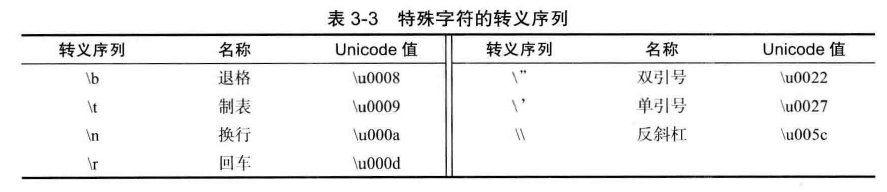
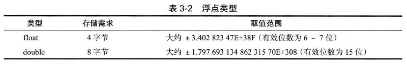
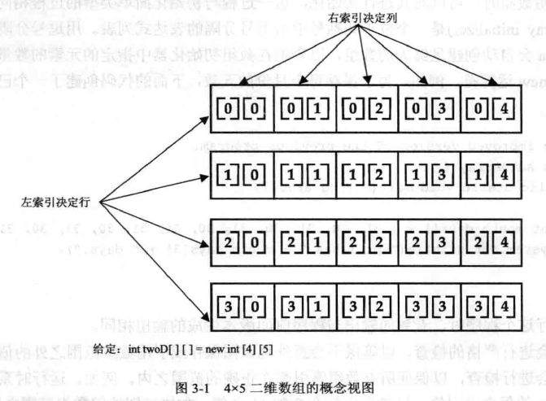
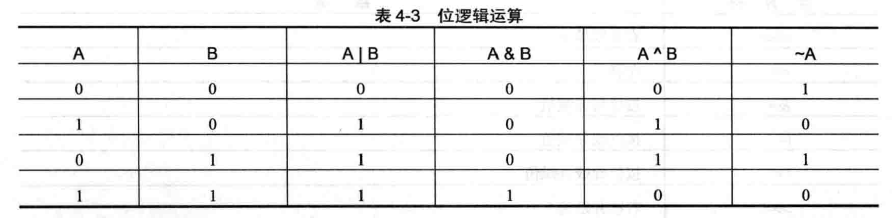
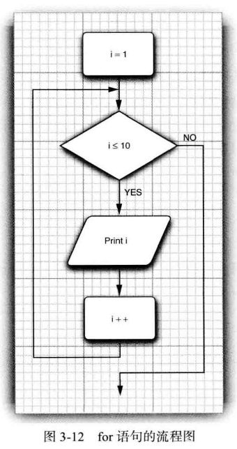
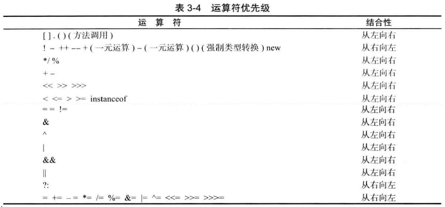
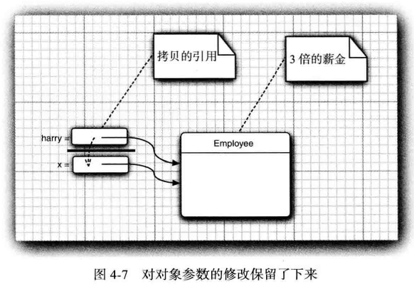
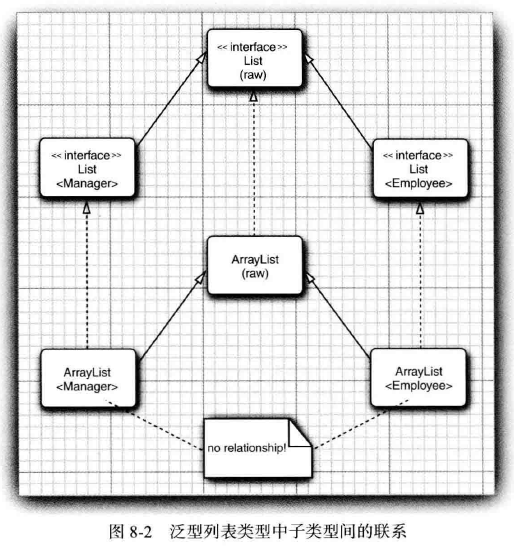
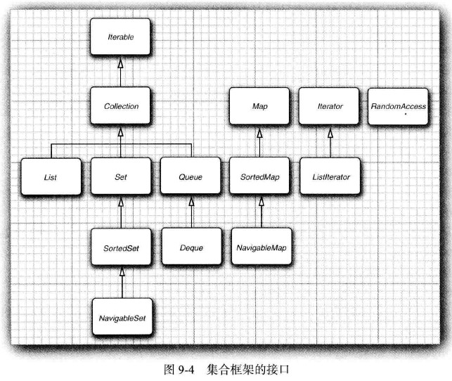
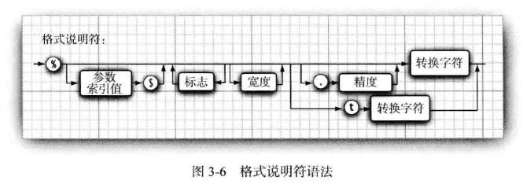

# 简介

Java是一个静态类型的面向对象编程语言，发布于1996年。

JDK：Java Development Kit，编写Java程序的开发套件。

JRE：Java Runtime Environment，运行Java程序的软件。

Java SE：Java Standard Edition。

Java EE：Java Enterprise Edition。

Java ME：Java Micro Edition。

<!--more-->

# 开发环境

## 核心套件——JDK

### 安装

1. 下载JDK，并安装；
2. 设置环境变量`JAVA_HOME`指向JDK安装目录；（可选）
3. 将`$JAVA_HOME/bin`设置到环境变量`PATH`中；（可选）
4. 设置类搜索路径：（可选）
   - 通过环境变量`CLASSPATH`全局设置；
   - 通过`java`命令的`-classpath`或`-cp`参数设置。（推荐）

> 由于运行时库文件（`rt.jar`和在`jre/lib`与`jre/lib/ext`目录下的一些其他的JAR文件）会被自动地搜索，所以不必将它们显式地列在类路径中。
>
> 类路径中`.`表示包含当前目录。
>
> 如果没有显式提供类路径，则会自动提供一个含`.`目录的默认类路径。

### 交互式环境——JShell

JShell是Java 9中的新特性，它是Java的REPL（Read-Eval-Print Loop）工具。

执行`jshell`命令就可以进入Java的交互式环境。

按下`Ctrl-D`或输入`/exit`并回车退出JShell。

## 其他常用工具

IDE：VSCode、Eclipse

静态代码分析工具：Coverity、Checkstyle、FindBugs

# 入门

## 编码

### 第一个程序——Hello world

Hello.java：

```java
public class Hello {
  public static void main(String[] args) {
    System.out.println("Hello world!");
  }
}
```


### 源文件

Java程序的源代码保存在**源文件**中，扩展名通常是`.java`。

一个源文件中可以包含一个或多个类定义，但是至多只能有一个类是`public`的。

源文件中如果包含`public`类定义，则源文件名必须与`public`类名相同。如果源文件中没有包含`public`类定义，则源文件名可以任意。

### 字符集

Java采用Unicode字符集。

Java代码是区分大小写的。

### 转义序列

- 八进制表示的转义序列：`\ddd`。例如：`\237`。

- Unicode转义序列：`\uxxxx`。例如：`\u03C0`，表示希腊字母`π`。

- 特殊字符的转义序列：



> Java中没有续行的转义序列。

所有转义序列均可以出现在字符或字符串字面量中，而只有Unicode转义序列才能出现在字符或字符串之外。例如：

```java
public static void main(String\u005B\u00SD args) {} //\u005B 和\u005D 是[ 和] 的编码。
```

Unicode转义序列会在解析代码之前得到处理。例如，`"\u0022+\u0022"` 并不是一个由引号（U+0022) 包围加号构成的字符串。实际上， `\u0022` 会在解析之前转换为`"`， 这会得到`""+""`， 也就是一个空串。

注释中的Unicode转义序列也会被解析：

```java
// Look inside c:\users
```

上面的代码会产生一个语法错误， 因为`\u` 后面并未跟着4 个十六进制数。

### 保留字

### 编码规范

Java语言采用自由的编码格式，没有换行或缩排规则。

## 构建

### 编译

```bash
$ javac Hello.java
```

Java源文件编译后，会生成字节码文件：`Hello.class`。

> 注意：如果JDK使用的编码（默认与操作系统编码一致）与源文件使用的编码不一致，在编译时会报错。这时，应该在javac后加“-encoding 源文件使用的编码”命令行参数进行编译。例如：
>
> ```bash
> $ javac -encoding utf-8 D:/com/ghoolooloo/java/Welcome.java
> ```

> javac在编译一个类时，也会自动编译该类依赖的类。而且，已编译的依赖的源文件有更新，则会自动重新编译这个依赖。
>
> 另外，javac一次可以编译多个源文件，例如：
>
> ```bash
> $ javac A.java B.java *Test.java
> ```

### 链接

## 运行

`java`命令启动虚拟机，虚拟机加载类文件并执行字节码。

运行程序：

```bash
$ java -cp . Hello
```

> 注意：`java`运行的是带有`main()`方法的公有类，而不是字节码文件，因此不要添加`.class`扩展名。
>
> 如果该类属于某个包时，类名要用完整限定名，且该包也要在类路径中。

在指定类路径时，Windows平台使用分号分隔路径，而Linux/Unix中使用冒号分隔路径：

```bash
Windows平台：
$ java -cp .;..\libs\lib1.jar;..\libs\lib2.jar com.mycompany.MainClass

Linux/Unix平台：
$ java -cp .:..\libs\lib1.jar:..\libs\lib2.jar com.mycompany.MainClass
```


### 命令行参数

在运行程序时，可以将命令行参数直接跟在程序后面（注意是在运行的类名之后，而不是直接跟在`java`之后，否则会被当作`java`命令的参数）就可以了，如果有多个命令行参数，则使用空格分隔。如：

```bash
$ java com.ghoolooloo.java.CommandLineParameters -h these are parameters
```

应用程序的命令行参数会传递到`main`方法的字符串数组`args`中。`arg[0]`存放第一个参数（即`"these"`），以此类推。如果没有命令行参数，则`args`的长度为`0`，而不是`null`。

## 调试

## 打包

将多个class文件打包到一个JAR归档文件中：

```bash
$ jar --create --verbose --file foo.jar com/abc/*.class
或者
$ jar -c -v -f foo.jar com/abc/*.class
或者
$ jar cvf foo.jar com/abc/*.class
```

> 注意：在UNIX中，禁止使用`*`以防止shell命令进一步扩展。因此，要对上面的`*`进行转义：
>
> ```bash
> $ $ jar cvf foo.jar com/abc/\*.class
> ```

如果程序是可执行的，即包含主类，则使用下列命令打包成一个可执行JAR：

```bash
$ jar -c -f foo.jar -e com.abc.MainClass com/abc/*.class
运行可执行JAR：
$ java -jar foo.jar
```


# 程序结构

Java程序是由类组成的。

## 注释

| 注释     | 说明                                                      |
| -------- | --------------------------------------------------------- |
| // …     | 单行注释。可嵌套。                                        |
| /* … */  | 块注释。可跨多行，但不可以嵌套。                          |
| /** … */ | 文档注释。类似块注释，但可借助`javadoc.exe`工具生成文档。 |

### 文档注释

在源代码中添加形如`/** … */`的注释，则很容易通过javadoc工具来生成专业的文档。

javadoc通常提取下列文档注释来生成文档：

- 公有类和接口；
- 公有和保护的构造器、方法和字段；
- 包和模块。

#### 编写文档注释

在文档注释中，可以包含受限制的HTML。

如果在文档注释中需要包含对其他文件（例如图片）的链接，则将这些文件放在包含源文件的目录下的`doc-files`子目录中。这样，就可以在路径中使用这些图片了，例如：``。javadoc会将`doc-files`目录和它们的内容从源代码目录复制到文档目录。

可以使用`@see`和`@link`给Javadoc文档添加超链接。`@see`必须顶头写且单独一行，而`@link`可以放在任意方。

如果一个功能有多个`@see`，则要放在一起，不能分散开。

`@see`语法：`@see 引用`。

`@link`语法：`{@link 引用}`。

“引用”部分可以是下列三种形式之一：

- `包.类名#成员 标签`：“#成员”和“标签”都是可以省略的。
- `<a href ="…">标签</a>`
- `"文本"`

如果要为包产生注释，则需要在该包中提供一个`package-info.java`的文件。该文件中包含包的文档注释，其后紧跟包声明，除此之外不应该包含更多的代码或注释。

模块的文档注释放在`module-info.java`文件中。你可以通过`@moduleGraph`指令来包含模块依赖图。

最后，还可以为所有源文件提供一个概述注释，它放在`overview.html`文件中。该文件位于包含所有源文件的父目录中。所有在标签`<body>…</body>`之间的文本都会被提取来生成文档。当用户从导航栏选择“Overview”时，就会显示这些注释。

#### 生成文档

要生成文档注释，首先，切换到包含所有源文件的目录（即包含`overview.html`文件的目录）；然后，运行命令：

```bash
$ javadoc -d 文档的生成目录 包1 包2 …
```

如果省略`-d`选项，则生成的文档会被提取到当前目录下。

可以使用`-author`和`-version`选项在文档中包含`@author`和`@version`标记（默认情况下，这些标记会被省略）。

`-link`选项可以将文档中引用的标准库中的类添加超链接，例如：

```bash
$ javadoc -link http://docs.oracle.com/javase/9/docs/api *.java
```

为所有的标准类库自动地链接到Oracle公司网站上的文档。

如果使用`-linksource`选项，则每个源文件被转换为HTML，并且每个类名和方法名将链接到相应源代码转换的HTML。

## 程序入口

Java程序的入口是如下的`main`方法：

```java
public static void main(String[] args) {
  …
}
```

或者：

```java
public static int main(String[] args) {
  …
}
```

它必须位于`public`或包可见的类中。

如果`main`方法正常退出，则退出代码为`0`，表示成功地运行了程序。如果希望在终止程序时返回其他的代码， 那就需要调用`System.exit`方法。

通常，能够直接运行的类都必须包含`main`方法，否则只能作为库使用。

有些情况下，可以不需要`main`方法也能运行类，例如Applet。因为Web浏览器使用一种不同的方法启动Applet的执行。

# 基本类型

## 数值类型

在Java 中， 所有的数值类型所占据的字节数量与平台无关。

从Java 7 开始，还可以为数值字面量加下划线， 例如：

```java
1_000_000
0b1111_0100_0010_0100_0000
9_432_894.09_78
```

这些下划线只是为了让人更易读，Java 编译器会去除这些下划线。

下面是非法的下划线使用方式：

```java
float pi1 = 3_.1415F; //小数点左右两边都不能使用下划线。
long socialSecurityNumber1 = 999_99_9999_L; //数值后缀前面不能使用下划线。
int x3 = 52_; //下划线不能位于数值的末尾。
int x5 = 0_x52; //下划线不能位于进制前缀的中间。
int x6 = 0x_52; //下划线不能紧跟在进制前缀之后。

//以下划线开头的是标识符，而不是数值。
int x1 = _52;
```

### 整数类型


`long`类型数值要带一个后缀`L` 或`l` ( 例如`4000000000L`)。没有后缀的整数字面量默认是`int`类型。

 整数字面量可以表示成十进制、十六进制、八进制和二进制。十六进制数值有一个前缀`Ox` 或`0X` (例如`OxCAFEL`）；八进制有一个前缀`0`（例如， `010`）；从Java 7 开始， 加上前缀`0b`或`0B`就可以写二进制数（例如`0b100`）。

> 注意， Java 的整数类型总是有符号的，没有无符号（unsigned ) 形式的int、long、short 或byte 类型。

### 浮点类型



`float` 类型的数值有一个后缀`F` 或`f` ( 例如， `3.14F`)。没有后缀的浮点数值（如`3.14` ) 默认为`double` 类型。`double` 类型字面量也可以在后面添加后缀D 或d ( 例如，`3.14D`)。

浮点字面量可以表示成十进制和十六进制。十六进制浮点数值有一个前缀`Ox` 或`0X` (例如`Ox1.0p-3`）。

在十六进制表示法中， 使用`p` 表示指数， 而不是`e`。注意： 尾数采用十六进制， 指数采用十进制。指数的基数是`2`， 而不是`10`。

在十进制表示法中，使用`e`表示指数，尾数和指数都采用十进制，指数的基数是`10`。（例如：`0.88e-03`）

所有的浮点数值计算都遵循IEEE 754 规范。具体来说，下面是用于表示溢出和出错情况的三个特殊的浮点数值：

| 特殊浮点值                                               | 说明                                                         |
| -------------------------------------------------------- | ------------------------------------------------------------ |
| `Double.POSITIVE_INFINITY`,  `Float.POSITIVE_INFINITY  ` | 正无穷大                                                     |
| `Double.NEGATIVE_INFINITY `,  `Float.NEGATIVE_INFINITY`  | 负无穷大                                                     |
| `Double.NaN`,  `Float.NaN`                               | 非数值（计算`0/0`或者负数的平方根时）。所有“非数值”的值都被认为是彼此不同的，因而不能使用`==`来检测是否是`NaN`，但可以使用`Double.isNaN()`方法来检测。 |

浮点数不适合做金融计算，而要使用`BigDecimal`这种无舍入误差的数值计算。

## 字符类型

`char` 类型的字面量值要用单引号括起来。例如：`W` 是编码值为`65` 所对应的字符常量。

Java使用Unicode表示字符。码点（ code point ) 是指与一个编码表中的某个字符对应的代码值。Unicode 的
码点可以分成17 个编码级别（codeplane)。第一个编码级别称为基本的多语言级别（ basic multilingual plane ), 码点从`U+0000` 到`U+FFFF`, 其中包括经典的Unicode 编码；其余的16个级别码点从`U+10000` 到`U+10FFFF` , 其中包括一些辅助字符（supplementary character)。

Java字符使用UTF-16 编码，它采用不同长度的编码表示所有Unicode 码点。在基本的多语言级别中， 每个字符用16 位表示，通常被称为编码单元（ code unit ) ; 而辅助字符采用一对连续的编码单元进行编码。这样构成的编码值落入基本的多语言级别中空闲的2048 字节内， 通常被称为替代区域（surrogate area) [ `U+D800` ~ `U+DBFF` 用于第一个编码单元，`U+DC00` ~ `U+DFFF` 用于第二个代码单元]。这样设计十分巧妙， 我们可以从中迅速地知道一个编码单元是一个字符的编码， 还是一个辅助字符的第一或第二部分。例如，`⑪`是八元数集（ http://math.ucr.edu/home/baez/octonions ) 的一个数学符号， 码点为`U+1D546`, 编码为两个代码单元`U+D835` 和`U+DD46`。

在Java 中，`char` 类型描述了UTF-16 编码中的一个编码单元，因此是16位的。强烈建议不要在程序中使用`char` 类型， 除非确实需要处理UTF-16 编码单元，它们太底层了。最好将字符串作为抽象数据类型处理。要将码点转换成字符串，可使用`new String(Character.toChars(codePoint))`。

> 平台的字符编码可以通过调用静态方法`Charset.defaultCharset`获得。静态方法`Charset.availableCharsets`返回所有可用的字符集`Charset`实例。

`char`类型可以用作整数类型，可以执行算术运算。`char`可以看作是无符号的整数类型。

## 布尔类型

`boolean` ( 布尔）类型有两个值： `false` 和`true`, 用来判定逻辑条件整型值和布尔值之间不能进行相互转换。

> 在Java中，布尔类型不是数值类型。布尔值与整数0和1没有关系。

## 空类型

Java语言中空类型使用`void`表示。

`void`类型只用于方法的返回值，表示方法没有返回值。

# 声明

声明属于语句。

> 这里的声明主要是指块作用域中的声明，类作用域中的声明参见“字段声明”。

## 变量声明

在Java程序中，变量是基本存储单元。所有变量在使用之前必须声明。在Java 中， 不区分变量的声明与定义：

```java
boolean done;  //未初始化
byte z = 22;  //静态初始化
double a = 3.0, b, c = 5.0;  //同时声明多个变量
double d = Math.sqrt(a * a + c * c);  //动态初始化
```

> 未初始化的局部变量是不会自动初始化的，这与字段或集合的元素不同。例如，数组在实例化之后，如果没有显式初始化，则会将所有数组元素自动初始化为`0` （数值类型、字符类型）、`false` （布尔类型）或`null` （引用类型）。

初始化表达式的结果类型必须与变量的类型相同或兼容，且可以是任意表达式。

> 尽管`$` 是一个合法的Java 变量名字符， 但不要在你自己的代码中使用这个字符。它只用在Java 编译器或其他工具生成的名字中。

## 常量声明

在Java 中， 利用关键字`final` 指示常量。例如：

```java
final double CM_PER_INCH = 2.54;
```

关键字`final` 表示这个变量只能被赋值一次。一旦被赋值之后， 就不能够再更改了。因此，常量通常在声明时就初始化。但允许延迟常量的初始化（只要它在首次使用前被恰好初始化了一次）：

```java
final int DAYS_IN_FEBRUARY;
if (leapYear) {
  DAYS_IN_FEBRUARY = 29;
} else {
  DAYS_IN_FEBRUARY = 28;
}
```

初始化表达式的结果类型必须与常量的类型相同或兼容，且可以是任意表达式。

> `const` 是 Java 保留的关键字， 但目前并没有使用。在 Java 中， 必须使用`final`定义常量。

## 命名规范

常量名使用全大写。

# 数组

数组是一种数据结构，用来存储同一类型值的集合。它本质上，是一组连续存储、类型相同的变量。

在Java中，数组是作为类的对象实现的，它是引用类型。

## 一维数组

### 创建数组

#### 数组变量声明

一维数组变量声明的一般形式：

```java
类型[] 数组变量;
类型 数组变量[];
```

> 声明数组变量时，`[]`可以放在类型之后，也可以放在数组变量之后。

例如：

```java
int[] nums, nums2, nums3;
int nums4[], nums5[];
```


#### 数组实例化

声明了数组变量后，实际上该数组对象并不存在。还需要使用`new`运算符为该数组分配内存空间，并赋值给该数组变量：

```java
数组变量 = new 类型[元素数量];
```

`元素数量`不要求是常量，可以是任何整型表达式。并且，它必须是大于或等于 `0`的整数。

> 空数组：`new int[0]`或者`new int[] {}`。
>
> 注意：数组长度为`0` 与`null` 不同。

在Java中，所有数组都是动态分配的。

数组变量声明和实例化可以同时进行——数组变量初始化：

```java
类型[] 数组变量 = new 类型[元素数量];
类型 数组变量[] = new 类型[元素数量];
```

一旦实例化了数组，就不能再改变它的大小（即数组元素数量），但可以改变每个数组元素。如果经常需要在运行过程中扩展数组的大小， 就应该使用另一种数据结构——数组列表（`ArrayList` )。

> Java 数组与C++ 数组在栈上有很大不同， 但基本上与分配在堆（heap) 上的数组指针一样。也就是说，
>
> ```java
> int[] a = new int[100]; // Java
> ```
>
> 不同于
>
> ```c++
> int a[100]; // C++，在栈上
> ```
>
> 而等同于
>
> ```c++
> int* a = new int[100]; // C++
> ```
>
> Java 中的`[ ]` 运算符被预定义为检查数组边界， 而且没有指针运算， 即不能通过`a` 加 `1` 得到数组的下一个元素。

##### 数组初始化器

数组在使用`new`实例化过程中，会将所有数组元素自动初始化为`0` （数值类型、字符类型）、`false` （布尔类型）或`null` （引用类型）。

也可以**在声明时**，使用数组初始化器显式将数组元素初始化为特定值：

```java
类型[] 数组变量 = {元素1, 元素2, …, 元素N};
```

> 使用数组初始化器，不需要调用`new`。而且数组初始化器只能出现在声明语句的初始化部分中。
>
> 注意：数组初始化器中最后一个元素（即“元素N”）的后面可以跟个逗号，这样方便随时向数组添加元素，当然也可以省略。

例如：

```java
int smallPrimes[] = {2, 3, 5, 7, 11, 13,};
```

数组初始化器中可以使用表达式：

```java
double[] d = {0*0, 1*0, 2*0, 3*0};
```

#### 匿名数组

```java
new 类型[] {元素1, 元素2, …, 元素N}
```

不象数组初始化器只能出现在声明语句的初始化部分中，匿名数组可以出现在表达式可以出现的任何地方。匿名数组常用于为已有的数组变量赋新值：

```java
smallPrimes = new int[] {17, 19, 23, 29, 31, 37};
```

### 使用数组

#### 访问数组元素

通过整型下标可以访问数组中的每个值。

数组的下标总是从 0 开始的。

Java运行时会进行严格的检查，以确保所有数组下标都在正确的范围（下标大于或等于0，且小于数组元素数量）之内，而不会意外地试图保存或访问数组范围之外的值。

#### 获得数组容量

要想获得数组容量（也称数组长度），可以使用数组的`length`属性。

注意：`length`的值只是反映数组的总容量，而不是数组当前实际上包含的（非空）元素个数。

#### 遍历数组

```java
for (int prime : smallPrimes)
  System.out.println(prime);
```

#### 复制数组

由于数组是引用类型，将一个数组赋值给另一个数组，实际上只是复制引用，结果是两个数组变量引用同一个数组对象：

```java
int[] luckyNumbers = smallPrimes;
luckyNumbers[5] = 12; // now smallPrimes[5] is also 12
```


如果希望将一个数组的所有值复制到一个新的数组中去，就要使用`java.util.Arrays.copyof()`方法：

```java
int[] copiedLuckyNumbers = Arrays.copyOf(luckyNumbers, luckyNumbers.length);
```

新增加的元素自动初始化为`0` （数值类型、字符类型）、`false` （布尔类型）或`null` （引用类型）。相反，如果数组长度小于原始数组的长度，则只复制最前面的数组元素。

可以用这个方法来“改变”数组的大小：

```java
luckyNumbers = Arrays.copyOf(luckyNumbers, 2 * luckyNumbers.length) ;
```

另外，复制数组还可以使用`System.arraycopy()`：

#### 打印数组

```java
int[] a = {1, 2, 3, 4, 5, 6, 7};
System.out.println(Arrays.toString(a));  //[1, 2, 3, 4, 5, 6, 7]
```

#### 数组排序

```java
int[] a = new int[10000];
…
Arrays.sort(a);  // 现在数组a是排好序的了。
```

`Arrays.sort()`使用优化的快速排序算法。

## 多维数组

在Java中，多维数组实际上是数组的数组。


### 创建数组

#### 数组变量声明

多维数组变量声明的一般形式：

```java
类型[]…[] 数组变量;
类型 数组变量[]…[];
```

#### 数组实例化

数组实例化的一般形式：

```java
数组变量 = new 类型[元素数量1]…[元素数量N];
```

数组变量声明和实例化可以同时进行——数组变量初始化：

```java
类型[]…[] 数组变量 = new 类型[元素数量1]…[元素数量N];
类型 数组变量[]…[] = new 类型[元素数量1]…[元素数量N];
```

>  Java 声明
>
> ```java
> double[][] balances = new double[10][6]; //Java
> ```
>
> 不同于C++
>
> ```c++
> double balances[10][6] ; // C++，在栈上
> ```
>
> 也不同于
>
> ```c++
> double (*balances)[6] = new double[10][6] ; // C++
> ```
>
> 而是分配了一个包含10 个指针的数组：
>
> ```c++
> double** balances = new double*[10]; // C++
> ```
>
> 然后， 指针数组的每一个元素被填充了一个包含6 个数字的数组：
>
> ```c++
> for (i = 0; i < 10; i++)
>   balances[i] = new double[6] ;
> ```
>
> 庆幸的是， 在Java中，当创建`new double[10][6]` 时， 这个循环将自动地执行。 当需要不规则的
> 数组时， 只能单独地创建行数组。

##### 数组初始化器

二维数组初始化例子：

```java
int[][] magicSquare =
  {
    {16, 3, 2, 13}，
    {5, 10, 11, 8},
    {9, 6, 7, 12},
    {4, 15, 14, 1}
  }；
```

#### 匿名数组

匿名二维数组例子：

```java
int[][] anonymous = new int[][] {
  {16, 3, 2, 13},
  {5, 10, 11, 8},
  {9, 6, 7, 12},
  {4, 15, 14, 1}
}
```

### 使用数组

#### 遍历数组

使用for循环：

```java
int twoD[][] = new int[4][5];

for (int i=0, k=0; i < twoD.length; i++)
  for (int j=0; j < twoD[i].length; j++)
    twoD[i][j] = k++;
```

使用“for-each”循环：

```java
for (int[] row : towD)
  for (int value : row)
    …
```



#### 打印数组

```java
System.out.println(Arrays.deepToString(twoD)); //输出[[16, B, 2, 13], [5, 10, 11, 8] , [9, 6, 7, 12], [4, 15, 14, 1]]
```

### 不规则数组

Java的多维数组实际上是一个数组的数组，因此，它并不要求每一维元素的长度要相同。

这种每一维元素长度不相同的多维数组，就是不规则数组。

```java
int twoD[][] = new int[4][];
twoD[0] = new int[1];
twoD[1] = new int[2];
twoD[2] = new int[3];
twoD[3] = new int[4];

int k = 0;

for (int[] row : twoD)
  for (int i=0; i<row.length; i++)
    row[i] = k++;

System.out.println(Arrays.deepToString(twoD));  //[[0], [1, 2], [3, 4, 5], [6, 7, 8, 9]]
```


不规则数组也可以使用数组初始化器：

```java
int[][] twoD =
  {
    {0}，
    {1, 2},
    {3, 4, 5},
    {6, 7, 8, 9}
  }；
```

## 数组的协变性

Java的数组具有协变性（covariance）。例如：如果`Manager`类是`Employee`的子类，则`Manager[]`也是`Employee[]`的子类型。

## Arrays类

`Arrays.fill()`：填充数组。

`Arrays.sort()`：数组排序。

`Arrays.parallelSort()`：数组较大时，该方法会将排序工作分布到多个处理器上运行。

`Arrays.toString()`：产生一个数组的字符串表示。

# 字符串

在很多语言中，包括C/C++，字符串是作为字符数组实现的。然而，在Java中不是如此。在Java中，字符串实际上是一个对象（`String`类的实例）。

`String`类型的对象是不可变的，一旦创建一个`String`对象，其内容就不能再改变。

不可变字符串有一个优点：编译器可以让字符串共享。

> 这里是`String`对象不可变，不是指引用它的`String`变量不可变。

## 构造字符串

```java
String myString = "This is a string";

char[] chars = {'a', 'b', 'c'};
String s = new String(chars);
```

### 空串与`null`串

空串是长度为0的字符串：

```java
String emptyString = new String();  //空串
String emptyString2 = "";  //空串字面量
```

可以调用以下代码检查一个字符串是否为空：

```java
if (str.length() == 0) …
//或者
if (str.equals("")) …
```

`String` 变量还可以存放一个特殊的值， 名为`null` , 这表示目前没有任何对象与该变量关联。要检查一个字符串是否为`null` , 要使用以下条件：

```java
if (str == null)
```

有时要检查一个字符串既不是`null` 也不为空串，这种情况下就需要使用以下条件：

```java
if (str != null && str.length() != 0)  //首先要检查str不为null。
```

## 使用字符串

### 字符串的长度

字符串的长度是指字符串所包含字符的数量。在Java中，可以通过调用`length()`方法来获得字符串中编码单元的数量，而调用`codePointCount()`则获得码点的数量：

```java
String greeting = "Hello";
int n = greeting.length();  //n=5
int cpCount = greeting.codePointCount(0, greeting.length());  //cpCount=5
```

### 拼接

Java 语言允许使用`+` 号连接（拼接）两个字符串：

```java
int age = 9;
String s = "He is " + age + " years old.";
```

当将一个字符串与一个非字符串的值进行拼接时，后者被转换成字符串。

如果需要使用一个分隔符将多个字符串拼接在一起，可以使用静态的`join`方法：

```java
String all = String.join(" / ", "S", "M", "L", "XL");  //all = "S / M / L / XL"
```

另外，`concat`方法与`+`执行相同的功能。

### 提取字符

调用`charAt(n)`将返回位置`n`的代码单元，而调用`codePointAt()`将获得指定位置的码点：

```java
String greeting = "Hello";

//获取第一个代码单元
char first = greeting.charAt(0);

//获得第i个码点
int index = greeting.offsetByCodePoints(0, i);
int cp = greeting.codePointAt(index);
```

如果想要遍历一个字符串，并且依次査看每一个码点，可以使用下列语句：

```java
int cp = sentence.codePointAt(i);
if (Character.isSupplementaryCodePoint(cp)) i += 2;
else i++;
```

可以使用下列语句实现回退操作：

```java
i--；
if (Character.isSurrogate(sentence.charAt(i))) i--;
int cp = sentence.codePointAt(i);
```

### 比较字符串

```  java
"Hello".equals("hello")  //比较两个字符串的内容是否相等，区分大小写
"Hello".equalsIgnoreCase("hello")  //比较两个字符串的内容是否相等，不区分大小写
 "Hello" == "hello"  //比较两个字符串是否放置在相同位置上
```

在Java虚拟机中，每个字符串字面量只有一个实例，因此`"World" == "World"`为真。

> C++的`==`与Java的`equals`方法类似。C使用`strcmp`函数比较字符串，它与Java的`compareTo`方法类似。

`regionMatches`方法可以比较字符串中的某个特定部分与另一个字符串中的某个特定部分。

`startsWith`方法确定给定的String对象是否以指定的字符串开始，`endsWith`方法确定String对象是否以指定的字符串结尾：

```java
"Foobar".startsWith("Foo")    //true
"Foobar".startsWith("bar", 3) //true
"Foobar".endsWith("bar")      //true
```

`compareTo`方法会根据字典顺序（依赖于Unicode值）比较两个字符串的排序。例如：`str1.compareTo(str2)`。如果`str1`按字典顺序位于`str2`之前，则结果小于0；如果`str1`位于`str2`之后，则结果大于0；如果两个字符串相等，则结果等于0。

`compareTo`是考虑大小写的，如果希望忽略大小写区别，可以使用`compareToIgnoreCase`方法。

如果要基于特定语言的排序规则，则可以使用`Collator`对象。

### 查找字符串

`indexOf`方法查找字符或子串第一次出现时的索引；`lastIndexOf`方法查找字符或子串最后一次出现的索引。

### 修改字符串

`String`对象是不可改变的，这里的修改字符串，实现上是将修改的结果作为一个新字符串返回。

#### 子串

`substring`方法可以提取子串。

#### 替换

`replace`方法可以将字符串的一个字符全部用另一个字符替换，也可以将字符串的一个字符序列全部使用另一个字符序列替换：

```java
String s = "Hello".replace('l', 'w');  //s="Hewwo"
```

`replaceAll`方法可以将字符串中匹配指定正则表达式的子串全部替换为另一个子串，`replaceFirst`方法可以将字符串中第一个匹配指定正则表达式的子串替换为另一个子串。

#### 移除开头和结尾的空白字符

可以使用`trim`方法移除字符串开头和结尾的空白字符：

```java
String s = "   Hello world    ".trim();   //s="Hello world"
```

#### 大小写转换

方法`toLowerCase`将字符串中所有字符从大写改为小写，方法`toUpperCase`将字符串中所有字符从小写改为大写。非字母字符不受影响。

### 转换数据

#### `toString()`和`valueOf()`

`toString()`方法定义在`Object`类中，各子类可以重写它，以实现将各自类型对象转换成字符串。

`print()`和`println()`在打印对象时，实际上是打印它们调用`toString()`后的结果。

`valueOf`方法是静态方法，实际上调用`toString`方法。

要将包含整数的字符串转换为数值，则使用`Integer.parseInt()`、`Double.parseDouble()`等方法。

#### 字符串与数组

下面的代码将字符串转换为一个码点数组（每个`int`值对应一个码点）：

```java
int[] codePoints = str.codePoints().toArray()；
```

反之， 要把一个码点数组转换为一个字符串， 可以使用构造器：

```java
String str = new String(codePoints, 0, codePoints.length);
```

要将字符串转换为一个代码单元数组（每个`char`值对应一个代码单元）：

```java
char[] chars = str.toCharArray();
```

另外，有一个`getChars`方法可以提取一个子串中的代码单元到一个数组中：

```java
String s = "This is a demo of the getChars method.";
int start = 10;
int end = 14;
char buf[] = new char[end - start];
s.getChars(start, end, buf, 0);
```

还可以将字符串转换为一个字节数组，使用`getBytes`方法。当将`String`值导出到不支持16位Unicode字符的环境中时，最常用`getBytes`方法。

要将字节数组转换成一个字符串，则使用：

```java
String str = new String(bytes, StandardCharsets.UTF_8);
```

### 格式化字符串

`String.format()`

## 其他字符串类型

### StringBuffer

`StringBuffer`支持可变的字符串，并且，它可以应用在多线程环境中。

在构造`StringBuffer`时，通常会预先分配比实际需要更多的空间，以减少再次分配空间的次数。因为，再次分配空间是很耗时的操作。而且，频繁分配空间容易产生内存碎片。

可以通过`ensureCapacity`方法，在创建`StringBuffer`对象后，显式预先分配指定空间。

可以通过`length`方法来获得`StringBuffer`对象当前包含的代码单元数量，而通过`capacity`方法来获得已分配的容量。

可以使用`setLength(len)`强制将`StringBuffer`对象的长度设置为`len`，并且`len`必须是非负。如果`len`比原字符串长度大，则会向末尾添加`null`；如果`len`比原字符串长度小，则超出新长度的字符将丢失。

使用`setCharAt`方法可以设置`StringBuffer`对象中某个字符的值。

`append`方法将各种其他类型数据的字符串表示形式添加到`StringBuffer`对象的末尾。

`insert`方法将一个字符串插入到另一个字符串指定偏移量之后：

```java
StringBuffer sb = new StringBuffer("I Java!");
sb.insert(2, "like ");  //sb="I like Java!"
```

`reverse`方法颠倒`StringBuffer`对象中的字符。

`delete`方法删除指定索引范围内的字符，`deleteCharAt`方法删除指定索引的一个字符：

```java
StringBuffer sb = new StringBuffer("This is a test.");
sb.delete(4, 7);    //"This a test."
sb.deleteCharAt(0); //"his a test."
```

`replace`方法将`StringBuffer`对象中的一个子串替换为另一个子串：

```java
StringBuffer sb = new StringBuffer("This is a test.");
sb.replace(5, 7, "was");  //"This was a test."
```

### StringBuilder

`StringBuilder`是由JDK 5引入的，它也支持可变的字符串，但是，它不是同步的，适合在单线程环境中。它的效率比`StringBuffer`高一些。

其他参见`StringBuffer`。

# 枚举类型

Java中枚举是一种类类型。所有枚举类型都是`Enum<E>`类的子类。

## 定义枚举

```java
enum Size { SMALL, MEDIUM, LARGE, EXTRA_LARCE };
```

枚举类型可以作为嵌套类（总是静态的），但是不能作为局部类。

## 枚举变量声明

```java
Size s;
s = Size.MEDIUM;
```

尽管枚举是类类型，但不能使用`new`来实例化。实际上，枚举量就是枚举的所有实例。枚举变量只能存储这些枚举量或者`null`值。

枚举变量声明和初始化可以同时进行：

```java
Size s = Size.MEDIUM;
```

枚举量也支持静态导入：

```java
import static com.foo.Size.*;

Size s = MEDIUM;
```

## 使用枚举

由于枚举类型`E`继承了`Enum<E>`类，因此可以访问`Enum<E>`的方法。

### 比较枚举值

比较两个枚举类型的值的相等性时，可直接使用`==`，而不需要使用`equals`方法。

### 类型转换

`toString`和`name`方法会返回枚举量的字符串名。

`valueOf`静态方法会将字符串的枚举量名转换为枚举类型的枚举量：

```java
Size sz = Enum.valueOf(Size.class, "SMALL"); 
Size sz2 = Size.valueOf("SMALL"); 
```

`values`静态方法返回一个按照其声明次序排列的包含全部枚举量的数组：

```java
Size[] values = Size.values();
```

`ordinal`方法返回枚举量的序数，位置从0开始计数。例如：`Size.MEDIUM.ordinal()`返回1。

`compareTo`方法（来自`Comparable<E>`接口）比较相同类型的两个枚举量的序数值。

## 高级枚举

可以为枚举提供构造器、实例字段和字例方法，甚至可以实现接口。当然，构造器只是在构造枚举量时被调用。

```java
public enum Size {
  SMALL("S"), MEDIUM("M"), LARGE, EXTRA_LARGE("XL");
  private String abbreviation;
  private Size() { this.abbreviation = "L"; }
  private Size(String abbreviation) { this.abbreviation = abbreviation; }
  public String getAbbreviation() { return abbreviation; }
}
…
Size s = Size.MEDIUM;  //不需要带参数
```

枚举类型的构造器总是私有的，你可以省略`private`修饰符。另外，枚举类型的构造器不能声明为`public`或`protected`。

甚至可以为每个枚举量定义各自的方法。从技术上讲，每个枚举量都是属于枚举类型的一个匿名子类。

```java
public enum Operation {
  ADD {
    public int eval(int arg1, int arg2) {return arg1 + arg2;}
  },
  SUBTRACT {
    public int eval(int arg1, int arg2) {return arg1 - arg2;}
  },
  MULTIPLY {
    public int eval(int arg1, int arg2) {return arg1 * arg2;}
  },
  DIVIDE {
    public int eval(int arg1, int arg2) {return arg1 / arg2;}
  };
  
  public abstract int eval(int arg1, int arg2);
}

…

Operation op = Operation.ADD;
int result = op.eval(first, second);
```

枚举不能继承其他类，也不是作为超类。

枚举类型可以嵌套在一个类中，嵌套的枚举类属于隐式的静态嵌套类，它的方法不能引用外部类的实例变量。

# 表达式

| 运算符                                                       | 结合性 |
| ------------------------------------------------------------ | ------ |
| `[]`  `.`  `()`（方法调用）                                  | 左     |
| `!`  `~`  `++`  `--`  `+`（正号） `-`（负号） `()`（强制类型转换）  `new` | 右     |
| `*`  `/`  `%`（模）                                          | 左     |
| `+`  `-`                                                     | 左     |
| `>>`  `<<`  `>>>`（算术移位）                                | 左     |
| `<`  `>`  `<=`  `>=`  `instanceof`                           | 左     |
| `==`  `!=`                                                   | 左     |
| `&`                                                          | 左     |
| `^`（按位异或）                                              | 左     |
| `|`                                                          | 左     |
| `&&`                                                         | 左     |
| `||`                                                         | 左     |
| `? :`（条件表达式）                                          | 左     |
| `->`                                                         |        |
| `=`  `+=`  `-=`  `*=`  `/=`  `%=`  `<<=`  `>>=`  `>>>=`  `&=`  `^=`  `|=` | 右     |

## 算术表达式

算术运算符的操作数必须是数值类型或`char`类型。

### 除法

除法运算符根据操作数类型分为浮点数除法（至少一个操作数是浮点型）和整数除法（两个操作数均为整型）。

```java
6 / 4  //1。整数除法，对结果取整。
10 / -3  //-3。负整数相除，Java采取向零取整策略（即截断取整）。
-10 / 3  //-3
6.0 / 4  //1.5。浮点数除法
```

整数除以0将会产生一个异常， 而浮点数除以0将会得到无穷大或NaN（0 / 0） 结果。

#### 取整

除法的取整分为三类：向上取整、向下取整、向零取整。

1. 向上取整：向+∞方向取最接近精确值的整数。在这种取整方式下，5 / 3 = 2， -5 / -3 = 2， -5 / 3 = -1， 5 / -3 = -1 。
2. 向下取整：向-∞方向取最接近精确值的整数。在这种取整方式下，5 / 3 = 1， -5 / -3 = 1， -5 / 3 = -2， 5 / -3 = -2 。（Python、Java的Math.floorDiv()）
3. 向零取整：向0方向取最接近精确值的整数，换言之就是舍去小数部分，因此又称截断取整。在这种取整方式下，5 / 3 = 1， -5 / -3 = 1， -5 / 3 = -1， 5 / -3 = -1。（Java、C、C++）

另外，`Math.floor()`直接对浮点数向下取整，`Math.ceil()`向上取整，`Math.round()`四舍五入取整。

#### 舍入

而`BigDecimal`实现了七种舍入方式（定义在枚举类型`RoundingMode`中）：

| 方式                    | 1.40 | 1.60 | 1.50 | 2.50 | -1.50 |
| ----------------------- | ---- | ---- | ---- | ---- | ----- |
| 向偶数舍入（HALF_EVEN） | 1    | 2    | 2    | 2    | -2    |
| 向零舍入（DOWN）        | 1    | 1    | 1    | 2    | -1    |
| 向下舍入（FLOOR）       | 1    | 1    | 1    | 2    | -2    |
| 向上舍入（CEILING）     | 2    | 2    | 2    | 3    | -1    |
| 四舍五入（HALF_UP）     | 1    | 2    | 2    | 3    | -1    |
| 远离零舍入（UP）        | 2    | 2    | 2    | 3    | -2    |
| 五舍六入（HALF-DOWN）   | 1    | 2    | 1    | 2    | -1    |

### 求模

`x%y=x-(x/y)*y`，`x`与`y`都是正整数；当`x`和`y`中至少有一个是负整数时，按正整数计算，结果符号同`x`符号。
`f%d=f-[f/d]*d`，`[f/d]`表示不大于`f/d`的最大可能整数。当`f`和`d`中至少有一个是负浮点数，按正浮点数计算，结果符号同`f`符号。
`-0%3`值为`0`（因为在补码中`+0`和`-0`是一样的），`-0.0%3`值为`-0.0`。

### 自增、自减

自增、自减运算符，分为前缀式（位于操作数之前，例如：`++i`）与后缀式（紧随在操作数的后面，例如：`i--`）两种形式。

单独使用自增和自减运算符时，采用哪种形式没有区别。但是，当自增和自减运算符是更大表达式的一部分时，对于前缀式，操作数先自增一或自减一，然后表达式使用自增或自减之后的值进行计算；对于后缀式，表达式先使用操作数原来的值进行计算，然后操作数再自增一或自减一。例如：

```java
x = 42;
y = ++x;  //y=43，x=43。相当于：x = x + 1; y = x;
z = x++;  //z=43, x=44。相当于：z = x; x = x + 1;
```

### 常用数学函数

在`java.lang.Math`类中，包含了各种各样的数学函数。另外，如果得到一个完全可预测的结果比运行速度更重要的话，那么应该使用`java.lang.StrictMath`类。它使用“ 自由发布的Math 库”（fdlibm) 实现算法， 以确保在所有平台上得到相同的结果。

### 严格浮点计算

`strictfp`关键字可用于标记方法和类，用于指示方法和类必须使用严格的浮点计算（即不允许对中间计算结果采用扩展精度）来生成可再现的结果：

```java
public static strictfp void main(String[] args)
```

### 大数值

如果基本的整数和浮点数精度不能够满足需求， 那么可以使用`java.math` 包中的两个很有用的类： `Biglnteger` 和`BigDecimaL` 这两个类可以处理包含任意长度数字序列的数值。`Biglnteger` 类实现了任意精度的整数运算， `BigDecimal` 实现了任意精度的浮点数运算。

使用静态的`valueOf` 方法可以将普通的数值转换为大数值：

```java
BigInteger a = BigInteger.valueOf(100);
BigInteger b = BigInteger.valueOf(15, 6);  //b = 15*(10^6)
```

也可以用数字字符串构造大数值：

```java
BigInteger k = new BigInteger("34893439020483900224776611");
```

Java不允许对象使用运算符，因此操作大数时，必须使用方法调用。

## 关系表达式

关系运算的结果为布尔类型，但只有`==`和`!=`可操作布尔型操作数。

`==`和`!=`在比较对象时，只是比较对象的引用，而不是对象本身。要比较对象本身要用`equals()`（注：从`Object`对象继承下来的`equals`方法默认也是比较对象引用的，需要重载它才能使它比较对象的本身。它在一些预定义的类中已被重载为比较对象的本身，如`Integer`、`String`等。

### 对象的比较

#### Comparable接口

#### Comparator接口

`Comparable`接口只能为对象提供一个比较方式，当需要为对象提供多种比较方式，就必须使用`Comparator`接口：

```java
class LengthComparator implements Comparator<String> {
  public int compare(String first, String second) {
  	return first.length() - second.length()；
  }
}

String[] friends = { "Peter", "Paul", "Mary" };
Arrays.sort(friends, new LengthComparator());
```

`Comparator`接口还提供了许多有用的产生比较器的高阶函数：

- `comparing`方法：接受一个函数，该函数从类型`T`中提取一个`Comparable`排序键，并返回一个`Comparator<T>`。

  ```java
  Arrays.sort(people, Comparator.comparing(Person::getLastName)); //按lastName排序
  Arrays.sort(people, Comparator.comparing(Person::getLastName,
    (s, t) -> s.length() - t.length())); //按lastName的长度排序
  Arrays.sort(people, Comparator.comparing(Person::getMiddleName,
    nullsFirst(naturalOrder()))); //当middleName出现null时，不会抛出异常，而是将null当作最小值处理
  ```

- `thenComparing`方法：将比较器链接起来。

  ```java
  Arrays.sort(people, Comparator
  	.comparing(Person::getLastName)
    .thenComparing(Person::getFirstName)); //先按lastName排序，再按firstName排序
  ```

#### 包装器类的`compare`静态方法

包装器类都有实现`Comparable`接口，比较两个包装器对象可以直接使用`compareTo`方法。另外，如果是比较两个原语类型，还可以使用静态的`compare`方法。例如下列两个表达式是等价的：

```java
int a = 1, b = 2;

Integer.compare(a, b)
等价于：
Integer.valueOf(a).compareTo(Integer.valueOf(b))
```


## 逻辑表达式


### “短路”逻辑运算

“短路”（short-circuit）逻辑运算是指：对于`A && B`，只要`A`为`false`，则表达式结果就为`false`，而不会对`B`进行多余求值；对于`A || B`，只要`A`为`true`，则表达式结果就为`true`，而不会对`B`进行多余求值。

下面的代码是合法的，并不会由于变量`denom`为0时而出现运行时异常：

```java
if (denom != 0 && num / denom > 10) …
```

### 非“短路”逻辑运算

`&`、`|`、`&=`和`|=`也可以用于处理布尔型操作数（Java将`true`和`false`作为单比特来对待，而不管它在具体实现中的长度），并且结果为布尔型。这些运算符与`&&`和`||`运算符很类似，不过`&`和`|`运算符不采用“短路”方式来求值。也就是说，得到计算结果之前两个操作数都需要计算。

> `&`、`|`、 `&=`和`|=`也是位运算符。

## 赋值表达式

```java
int x, y, z;
x = y = z = 100;  //set x, y, and z to 100
```

### 复合赋值运算符

形如`var op= expression;`的复合赋值表达式都可以改写成：`var = var op expression;`。

复合赋值运算符具有两个优点：

1. 便于输入；
2. 比等价的长格式版本的效率更高。

### 交换值

#### 利用一个临时变量交换数值

```java
int x =5, y=10;  //定义两个变量
        　
int temp = x;    //定义第三临时变量temp并提取x值
x = y;           //把y的值赋给x
y = temp;        //然后把临时变量temp值赋给y
```

#### 利用两个数求和然后相减的方式进行数据交换

```java
int x =5, y=10;   //定义两个变量
         
x = x + y;        //x(15) = 5 + 10；
y = x - y;        //y(5) = x(15) - 10;        
x = x - y;        //x(10) = x(15) - y(5)
```

弊端在于如果 x 和 y 的数值过大的话，超出 int 的值会损失精度。

#### 利用位运算进行数据交换

```java
int x =5, y=10; //定义两个变量
         
x = x^y;
y = x^y;       //y=(x^y)^y
x = x^y;       //x=(x^y)^x
```

## 位运算表达式

### 位逻辑运算



> 利用`&` 并结合使用适当的`2` 的幂， 可以把其他位掩掉， 而只保留其中的某一位。例如， 如果`n` 是一个整数变量， 而且用二进制表示的`n` 从右边数第4 位为`1`，则
>
> ```java
> int fourthBitFromRight = (n & 0b1000) / 0b1000;
> ```
>
> 会返回`1`， 否则返回`0`。

### 移位运算

#### 左移

左移运算符`<<`可以将数值中的所有二进制位向左移动指定位数，每左移一位相当于将原始值乘以`2`：

```java
被操作数<<位数
```

计算结果为：被操作数 * 2^位数%模^

> 被操作数为`int`时，模为`32`；被操作数为`long`时，模为`64`。因此，`x >>> 32`（x为int类型）的值不会变，因为`32 % 32`为`0`。

```java
//a=00000000 00000000 00000000 00000001
//b=11111111 11111111 11111111 11111111
int a = 1, b = -1;

a << 35  //相当于：a << 3。a=8 （00000000 00000000 00000000 00001000）
b << 35  //相当于：b << 3。b=-8（11111111 11111111 11111111 11111000）
```

#### 有符号右移

有符号右移运算符`>>`可以将数值中的所有二进制位向右移动指定位数，并且用*符号位*填充高位。每右移一位相当于将原始值除以`2`：

```java
被操作数 >> 位数
```

计算结果为：被操作数 / 2^位数%模^

```java
int a = 64;  //a=00000000 00000000 00000000 01000000
int b = -64; //b=11111111 11111111 11111111 11000000

a >> 35  //相当于：a >> 3。 a=8 （00000000 00000000 00000000 00001000）
b >> 35  //相当于：b >> 3。 b=-8（11111111 11111111 11111111 11111000）
```

> 有趣的是，如果对`-1`进行有符号右移，结果总是`-1`。 

#### 无符号右移

无符号右移运算符和`>>>`可以将数值中的所有二进制位向右移动指定位数，并且用`0`填充高位。被操作数为非负数时，每右移一位相当于将原始值除以`2`：

```java
被操作数 >>> 位数
```

被操作数为非负数时计算结果为：被操作数 / 2^位数%模^

```java
int a = 64;  //a=00000000 00000000 00000000 01000000
int b = -64; //b=11111111 11111111 11111111 11000000

a >>> 35 //相当于：a >>> 3。a=8 （00000000 00000000 00000000 00001000）
b >>> 35 //相当于：b >>> 3。b=536870904（00011111 11111111 11111111 11111000）
```

> Java没有`<<<`运算符。

####移位`byte`、`short`或`char`类型数值

当移位`byte`、`short`或`char`类型数值时，Java会先进行整型提升，再进行移位运算，移位运算的结果为`int`类型。此外，当将负的`byte`、`short`或`char`类型数值提升为`int`类型时，会进行符号扩展，高阶位将使用`1`填充。所以，对`byte`、`short`或`char`类型数值进行左移操作时，必须抛弃`int`类型结果的高阶字节。完成这个任务最容易的方法是，简单地将结果强制转换为`byte`、`short`或`char`类型：

```java
byte a = 64, b;  //a=0100 0000
int i;

i = a << 2;  //i=256（1 0000 0000）
b = (byte) (a << 2);  //b=0
```

## 条件表达式

```java
布尔表达式 ? 表达式1 : 表达式2
```

`布尔表达式`如果为`true`，就对`表达式1`进行求值；否则对`表达式2`进行求值。条件表达式的结果是对其进行求值的表达式的值。

注意：`表达式1`与`表达式2`的类型要相同或兼容，并且不能为`void`。

## 逗号表达式

Java中没有逗号表达式，for循环的`初始化`和`迭代`中出现的逗号只是一个分隔符，而不是运算符。

## Lambda表达式

Lambda表达式是一块代码，可以把它理解为一个匿名的函数。

```java
(String first, String second)
	-> Integer.compare(first.length(), second.length())
```

lambda表达式不允许声明返回类型，它会自动通过上下文推导出。

箭头右边也可以是一个语句块：

```java
(String first, String second) -> {
  if (first.length() < second.length()) return -1;
  else if (first.length() > second.length()) return 1;
  else return 0;
}
```

如果lambda表达式没有参数，则仍需要提供一个空括号：

```java
() -> {for (int i=0; i<1000; i++) dowork();}
```

如果lambda表达式的参数类型可以通过上下文推导出，则可以省略参数类型：

```java
(first, second) -> Integer.compare(first.length(), second.length())
```

如果lambda表达式只有一个参数，且参数类型可以通过上下文推导出，则可以省略包围参数的括号：

```java
EventHandler<ActionEvent> listener = event ->
  System.out.println("Thanks for clicking!");
```

另外，可以像对待方法参数一样，可以向lambda表达式参数添加注解或final修饰符。

### 函数式接口

对于只包含一个*抽象方法*的接口（在java8中，接口可以声明非抽象方法），你可以通过lambda表达式来创建该接口的对象，这种接口也称为**函数式接口**。例如：`Arrays.sort`方法的第二个参数要求是一个`Comparator`接口（该接口只有一个方法）的实例，可以直接给它提供一个lambda表达式：

```java
Arrays.sort( words,
            (first, second) -> Integer.compare(first.length(), second.length()));
```

函数式编程语言中有函数类型，但在Java中仍然不能使用函数类型，只能使用函数式接口。因此，在Java中，你只能将lambda表达式赋值给（或传递给）类型为函数式接口的变量（或参数）。

注意：不能将lambda表达式赋给一个Object类型的变量，因为Object是类，不是函数式接口。

#### 标准函数式接口

JDK中提供了许多通用的函数式接口，应该尽量重用这些标准函数式接口。（详见：`java.util.function`包）

例如：

```java
Predicate.isEqual(a).or(Predicate.isEqual(b))
等价于：
x -> a.equals(x) || b.equals(x)
```

注：`Predicate.isEqual(a)`与`a::equals`相同，但是前者在`a`为`null`时仍能工作。

#### 创建自己的函数式接口

当标准函数式接口不能满足自己的需求时，就需要创建自己的函数式接口。

```java
@FunctionalInterface
public interface PixelFunction {
  Color apply(int x, int y);
}
```

在函数式接口上可以标注`@FunctionalInterface`注解，虽然不是强制的（所有只包含一个抽象方法的接口都是函数式接口），但标注这样的注解编译器会提供一些函数式接口的合法性检查，并且javadoc上也会说明这个接口是函数式接口。

### 实现延迟执行

使用lambda表达式就在于延迟执行。毕竟，如果你想立即执行一段代码，则无须将代码封装进lambda，你可以直接调用。

```java
public interface IntConsumer {
  void accept(int value);
}

public static void repeat(int n, IntConsumer action) {
  for (int i = 0; i<n; i++) action.accept(i); //当action.accept(i)被调用时，lambda表达式体才会被执行
}

…

repeat(10, i -> System.out.println("Countdown: " + (9 - i)));
```

### Lambda表达式与作用域

Lambda表达式与嵌套代码块有着相同的作用域规则。

在lambda表达式中不允许声明一个与局部变量同名的参数或局部变量：

```java
int first = 0;
Comparator<String> comp = (first, second) -> first.length() - second.length(); //错误：参数first与局部变量first同名
```

lambda表达式中出现的`this`关键字总是代表创建该lambda表达式的方法的`this`参数：

```java
public class Application {
  public void doWork() {
    Runnable runner = () -> {…; System.out.println(this.toString());}
    …
  }
  …
}
```

这里，表达式`this.toString()`调用的是`Application`对象的`toString`方法，而不是`Runnable`实例的`toString`方法。

### 高阶函数

Java虽然不是一个完全的函数式编程语言，但它可以通过函数式接口来实现高阶函数功能。

```java
public static Comparator<String> reverse(Comparator<String> comp) {
  return (x, y) -> comp.compare(y, x); //返回函数
}
…
reverse(String::compareToIgnoreCase); //传递函数
```


# 语句

## 语句结束符

在Java中，语句结束符是`;`。除了块语句外，其他语句均需要以语句结束符结尾。

## 表达式语句

## 块语句

块（即复合语句）是指由一对大括号括起来的0条或任意多条的Java 语句。

```java
{…}
```

块语句可以出现任何单条语句能出现的地方。

### 初始化块

## 空语句

空语句就是只包含一个`;`的语句：

```java
;
```

例如：

```java
while (++i < --j);  //这个循环不需要循环体
```

## 选择语句

### 条件语句

```java
if (条件表达式) 语句
if (条件表达式) 语句1 else 语句2
```

例如：

```java
if (yourSales >= target) {
  performance = "Satisfactory";
  bonus = 100;
}

if (yourSales >= target) {
  performance = "Satisfactory";
  bonus = 100 + 0.01 * (yourSales - target) ;
} else {
  performance = "Unsatisfactory";
  bonus = 0;
}
```


> 注意：`if(…) int i = 1;`是非法的，而要使用：
>
> ```java
> if (…) {
>   	int i =1;
> }
> ```
>
> if语句和循环语句不能只带单条声明语句，但可以将单条声明语句放在块中。这可能是因为声明语句必须与作用域关联，而作用域是由块创建的。

#### 嵌套的if语句

当if语句出现嵌套时，要记住：`else`语句总是与位于同一代码块中最邻近的`if`配对。

形如`if…else if…`结构的嵌套if语句，可以实现类似多分支语句的效果：

```java
if (yourSales >= 2 * target) {
  performance = "Excellent";
  bonus = 1000;
} else if (yourSales >= 1.5 * target) {
  performance = "Fine";
  bonus = 500;
} else if (yourSales >= target) {
  performance = "Satisfactory";
  bonus = 100;
} else {
  System.out.println("You're fired") ;
}
```


### 多分支语句

相对于一母猪嵌套的`if`语句，`switch`语句通常效率更高。因为，当编译`switch`语句时，Java编译器会检查每个`case`分支的`选项`，并创建一个“跳转表”，该跳转表用于根据`开关表达式`的值选择执行路径。

多分支语句`switch`的一般形式：

```java
switch (开关表达式) {
  case 选项1: 语句1
  case 选项2: 语句2
  …
  case 选项N: 语句N
  default: 默认语句
}
```

`开关表达式`和`选项`的类型：

- `byte`、`short`、`int`、`char`，以及它们的包装类
- 枚举类型
- 从JDK 7 开始，还可以是`String`类型。

> 注意：`开关表达式`不能是`long`类型。

`选项`必须是与`开关表达式`类型兼容的**常量表达式**，并且在当前`switch`中不允许重复。

`switch`语句的工作方式：将`开关表达式`的值与`case`语句中的每个`选项`的值依次进行**相等性**比较。如果发现一个匹配，则从相匹配的`case`标签处开始执行代码，直到遇到`break`语句，或者直到`switch`语句结束处为止。如果没有发现相匹配的分支，则执行`default`子句。

```java
Scanner in = new Scanner(System.in);
System.out.print("Select an option (1, 2, 3, 4) ");
int choice = in.nextlnt();
switch (choice) {
  case 1:
    …
    break;
  case 2:
    …
    break;
  case 3:
    …
    break;
  case 4:
    …
    break;
  default:
    // bad input
    …
    break;
}
```


> 如果在`case` 分支语句的末尾没有`break` 语句， 那么就会接着执行下一个`case` 分支语句。
>
> 如果希望在编译时，对`case`分支缺少`break`语句的情况进行警告，可以在编译命令上加上`-Xlint:fallthrough`选项：
>
> ```bash
> $ javac-Xlint:fallthrough Test.java
> ```
>
> 如果在某些情况下确实需要要使用这种“直通式”（fallthrough）行为，可以在其所在方法上加一个标注`@SuppressWarnings("fallthrough")`。这样就不会对这个方法生成警告了。

#### 嵌套的switch语句

```java
switch (count) {
  case 1:
    switch (target) { //嵌套的switch
      case 0:
        …
        break;
      case 1:
        …
        break;
      …
    }
    break;
  case 2:
    …
}
```

在此，内层switch语句的`target`只与内层的case选项匹配，而外层switch语句的`count`只与外层的case选项匹配，它们不会冲突。

#### 在switch语句中使用枚举

当在switch 语句中使用枚举常量时，不允许在每个case选项中为枚举量加上枚举名限定。因为，可以由switch 的表达式值确定。例如：

```java
enum Size { SMALL, MEDIUM, LARGE, EXTRA_LARCE };

Size sz = Size.MEDIUM;
switch (sz) {
  case SMALL: // no need to use Size.SMALL
    …
    break;
  …
}
```

## 循环语句

### while循环

while循环的一般形式：

```java
while (条件表达式) 语句
```


> 如果循环条件的值一开始就为`false`, 则while 循环体一次也不执行。

### do-while循环

有时希望至少执行一次循环体，即使条件表达式最初就为`false`。这时可以使用do-while循环，它的一般形式：

```java
do 语句 while(条件表达式);
```

例如：

```java
do {
  balance += payment;
  double interest = balance * interestRate / 100;
  balance += interest;
  year++;
  // print current balance
  …
  // ask if ready to retire and get input
  …
} while (input.equals("N"))；
```


### for循环

while循环和do-while循环都是不确定次数循环，即循环次数是由`条件表达式`控制，无法事先预测。而for循环则是确定次数循环，它的一般形式：

```java
for (初始化 迭代条件 迭代) 语句
```

`初始化`和`迭代`部分可以是单条语句，也可以是逗号分隔的多条语句；而`迭代条件`部分只能是单条语句。它们均不能是块语句。另外，`初始化`、`迭代条件`和`迭代`三个部分都可以省略，但是分隔它们的`;`不能省略。`迭代条件`省略时，默认为`true`：

```java
for (; ;) {
  …
}
```

for循环的执行过程：

1. 当首次开始循环时，执行循环的`初始化`部分。通常该部分用于初始化循环控制变量（计数器）。`初始化`部分只会执行一次。
2. 接着开始迭代：每次迭代，首先对`迭代条件`部分进行求值。如果`迭代条件`的值为`true`，就执行循环体；否则，就终止循环。然后执行`迭代`部分，该部分通常是一个自增或自减表达式。迭代过程一直重复，直到`迭代条件`为false。

在`初始化`部分声明的变量的作用域为该for循环。如果希望该变量在for循环外可用，则要确保该变量是在for循环外，且位于for循环之前声明的。

例如：

```java
for (int i = 1; i <= 10; i++)
  System.out.println(i);
```



> 在循环中，检测两个浮点数是否相等需要格外小心。下面的for 循环：
>
> ```java
> for (double x = 0; x != 10; x += 0.1) …
> ```
>
> 可能永远不会结束。由于舍入的误差， 最终可能得不到精确值。例如， 在上面的循环中， 因为`0.1` 无法精确地用二进制表示， 所以，`x` 将从`9.999 999 999 999 98` 跳到`10.099 999 999 999 98`。

#### 使用逗号

Java允许在for循环的`初始化`和`迭代`部分包含多条语句，每条语句之间使用逗号分隔：

```java
int a, b;

for (a=1, b=4; a<b; a++, b--) {
  …
}
```

### “for-each”循环

“for-each”循环（开始于JDK 5）的一般形式：

```java
for (类型 迭代变量 : 集合) 语句
```

`集合`必须是一个实现了`Iterable`接口的类对象（例如，`ArrayList`等集合类）或数组，且不能是`null`，但长度可以为`0`。`迭代变量`的类型必须与`集合`的元素类型兼容。

“for-each”循环每次迭代开始时，从`集合`中检索出下一个元素，并保存到`迭代变量`中，接着执行循环体。依次遍历`集合`中的每个元素，直到遍历结束。

尽管“fot-each”循环会对`集合`一直进行迭代，直到`集合`中所有元素都被遍历过。但是，可以使用`break`语名提前终止循环：

```java
int sum =0;
int nums[] = {1, 2, 3, 4, 5, 6, 7};

for (int x : nums) {
  System.out.println("Value is: " + x);
  sum += x;
  if (x == 5) break;
}
```

尽管“for-each”循环比for循环更加简洁，而且也更不易出错（不必为下标的起始值和终止值而操作），但是，在很多场合下，还是需要使用传统的for循环。例如：如果不希望遍历集合中的每个元素，或者在循环内部需要使用下标值等。

## 跳转语句

> `goto`虽然是Java的保留字，但并没有打算使用。

### break语句

break语句用于退出循环语句和switch语句。

当执行完break语句后，控制流将跳出break语句所在的循环或switch语句，并从紧跟该循环或switch语句的第一条语句处开始执行。

如果在一系列嵌套的循环或switch语句中使用break语句，那么break语句只会中断**break语句所在层**的循环或switch语句，不会中断任何外层的循环或switch语句。

```java
for (int i=0; i<3; i++) {
  System.out.print("Pass " + i + ": ");
  for (int j=0; j<100; j++) {
    if (j == 10) break; //只会中断当前所在循环，对外层循环没有影响。
    System.out.print(j + " ");
  }
  System.out.println();
}
```

> 记住：break语句的设计初衷并不是提供一种终止循环的正常手段，终止循环是条件表达式的目标。只有当发生某些特殊情况时，才应当使用break语句取消循环。

### 带标签的break语句

Java还提供了一种带标签的break语句，用于跳出多重嵌套块。

与break语句不同，带标签的break语句不仅可以中断循环和switch语句，而且还可以中断其他块语句，只要它们是命名块（即在块之前带一个标签）。

命名块的一般形式：

```java
标签: 语句
```

带标签的break语句的一般形式：

```java
break 标签;
```

当执行完带标签的break语句之后，控制流将跳出break语句的标签所指定的命名块，并从紧跟该命名块的第一条语句处开始执行。

```java
boolean t = true;

first: {
  second: {
    third: {
      System.out.println("Before the break.");
      if (t) break second; //中断second块
      System.out.println("This won't execute.");
    }
    System.out.println("This won't execute.");
  }
  System.out.println("This is after second block."); //中断后，跳到这里开始执行。
}
```

带标签的break语句也必须包含在所中断的命名块中，既可以是直接包含在所中断命名块中，也可以是在所中断命名块的任意深度的嵌套块中。带标签的break语句不能中断不包含它的命名块。

带标签的break语句最常见用途之一是退出嵌套的循环：

```java
outer: for (int i=0; i<3; i++) {
  System.out.print("Pass " + i + ": ");
  for (int j=0; j<100; j++) {
    if (j == 10) break outer;
    System.out.print(j + " ");
  }
  System.out.println("This will not print.");
}
System.out.println("Loops complete.");  //中断后，跳到这里开始执行。
```

### continue语句

continue语句只用于循环语句中。

当执行完continue语句后，控制流将提前终止本次迭代，并开始执行下一次迭代。在while和do-while循环中，continue语句导致程序执行控制被直接跳转到控制循环的`条件表达式`处。在for循环中，程序的执行控制首先进入for语句的`迭代`部分，然后到达`迭代条件`处。

```java
for (int i=0; i<10; i++) {
  System.out.print(i + " ");
  if (i%2 == 0) continue;
  System.out.println("");
}
```

如果在一系列嵌套的循环语句中使用continue语句，那么continue语句只会中断**continue语句所在层**的循环的本次迭代，不会中断任何外层的循环的迭代。

### 带标签的continue语句

与带标签的break语句不同，带标签的continue语句仍只能用于带标签的循环语句中，不能用于其他命名块。

带标签的continue语句会提前终止指定标签的循环语句的本次迭代，并开始执行下一次迭代。

```java
outer: for (int i=0; i<10; i++) {
  for (int j=0; j<10; j++) {
    if (j > i) {
      System.out.println();
      continue outer;
    }
    System.out.print(" " + (i * j));
  }
}
System.out.println();
```


### return语句

return语句只出现在方法中，表示要显式地从方法返回。也就是说，return语句导致程序的执行控制转移到方法的调用者。

return语句的一般形式：

```java
return;  //用于返回类型是void的方法中
return 返回表达式;
```

### throw语句

详见”异常处理“。

# 子程序

## 函数

Java中没有全局的函数，只有定义在类中的方法。（参见“方法”）

## 运算符

Java的运算符都是内置的，不能自定义新的运算符，也不能重载已有的运算符。

大部分运算符只能操作基本类型，但`=`、`==`和`!=`能操作所有对象。此外，`String`类还支持`+`和`+=`。

### 优先级



> JDK 8 中添加的箭头运算符（`->`），它的优先级高于赋值运算符，但低于条件运算符。

### 结合性


# 面向对象编程

面向对象程序设计（简称OOP）是当今主流的程序设计范型。

面向对象的程序是由对象组成的， 每个对象包含对用户公开的特定功能部分和隐藏的实现部分。在OOP 中， 不必关心对象的具体实现， 只要能够满足用户的需求即可。

## 对象

在OOP中，对象是人们要进行研究的任何事物，它有三个主要特性：

- 对象的行为（behaviror）：可以对对象施加的操作；
- 对象的状态（state）：保存着描述当前特征的信息；
- 对象的标识（identity）：用于辨别具有相同行为与状态的不同对象。

对象的状态可能会随着时间而发生改变， 但这种改变不会是自发的。对象状态的改变必须通过调用方法来实现，如果不经过方法调用就可以改变对象状态， 只能说明封装性（encapsulation）遭到了破坏。

对象的这些关键特性在彼此之间相互影响着：对象的状态影响它的行为，而行为决定了状态的使用方式。

## 类

类定义了一种新的数据类型，它是Java面向对象的基础。

类抽象了具有相同数据（即状态）和行为的对象。因此，类是对象的模板，对象是类的实例（instance）。对象的状态抽象为类的实例字段（instance field），对象的行为是由类的可调用的方法定义的。

> 在Java中，并不是所有类都具有面向对象特征。例如，`Math`类只封装了功能，没有状态。

### 定义类

类定义的一般形式：

```java
类修饰符 class 类名 extends 基类 implements 接口列表 {
  初始化块
  构造器定义
  字段声明
  方法定义
  嵌套类定义
  嵌套接口定义
}
```

其中，字段、方法、嵌套类、嵌套接口统称为类的成员。

类定义示例：

```java
class Employee {
  // 实例字段
  private String name;
  private double salary;
  private LocalDate hireDay;

  // 构造器
  public Employee (String n, double s, int year, int month, int day) {
    name = n;
    salary = s;
    hireDay = LocalDate.of(year, month, day);
  }

  // 实例方法
  
  public String getName() {
    return name;
  }

  public double getSalary() {
    return salary;
  }
  
  public LocalDate getHireDay() {
    return hireDay;
  }

  public void raiseSalary(double byPercent) {
    double raise = salary * byPercent / 100;
    salary += raise;
  }
}
```

#### 类的访问控制

对类进行访问控制的修饰符有两个：

- `public`：公有类，在任何代码都可以访问该类。一个源文件中最多只能有一个公有类或公有接口。
- 包可访问：默认访问级别。与该类在同一个包下的代码才可以访问它。

### 对象变量声明

由于类定义了一种新的数据类型，因此，可以使用类声明该类型的变量。

对象变量声明的一般形式：

```java
类 对象变量;
```

对象变量只是对象的一个引用，不是对象本身，在没有将对象赋值或初始化给它之前，是不能将该对象的任何方法应用于这个变量上的。

允许有多个对象变量引用同一个对象。例如：

```java
Date deadline;  //deadline是局部变量，不会自动初始化为null。
deadline = new Date();
Date birthday = deadline; //现在birthday和deadline都引用同一个Date对象。
…
deadline = null; //这时，deadline与原来的Date对象“脱钩”，但birthday仍然引用着这个Date对象。
```


> 当将一个对象变量赋值给另一个对象变量时，不是创建对象的副本，而是创建引用的副本。

另外，对象变量与它引用的对象的生存期也可能是不一致的。对象变量通常存储在栈中，而对象总是存储在堆中。

可以显式地将对象变量设置为`null`， 表明这个对象变量目前没有引用任何对象：

```java
deadline = null;
…
if (deadline != null)
  System.out.println(deadline) ;
```

如果将一个方法应用于一个值为`null` 的对象上，那么就会产生运行时错误。

局部变量不会自动地初始化为`null`，而必须通过调用`new` 或将它们设置为`null` 进行初始化。

> 很多人错误地认为Java 对象引用与C++ 的引用类似。然而， 在C++ 中没有空引用， 并且引用不能被赋值。可以将Java 的对象引用看作C++ 的对象指针。例如，
>
> ```java
> Date birthday; // Java
> ```
>
> 实际上， 等同于
>
> ```c++
> Date* birthday; // C++
> ```
>
> 在Java 中的null 引用对应C++ 中的NULL 指针。
>
> Java的对象引用与C++的对象指针的主要区别：不能像操作真实的指针那样操作对象引用，不能将对象引用指向任意内存位置，也不能像操作整数那样操作对象引用。
>
> 在C++ 中，指针十分令人头疼，并常常导致程序错误。稍不小心就会创建一个错误的指针， 或者造成内存溢出。在Java 语言中，这些问题都不复存在。如果使用一个没有初始化的指针，运行系统将会产生一个运行时错误，而不是生成一个随机的结果。同时，不必担心内存管理问题，垃圾收集器将会处理相关的事宜。

### 类实例化——构造对象

一旦定义了一个类，就可以使用这种新的类型创建该类型的对象。

在Java中，使用构造器（constructor）构造**新**实例。

类实例化的一般形式：

```java
new 构造器名(参数列表);
new 构造器名();  //使用默认构造器构造实例
```

> `new`运算符动态地（在运行时）为对象分配内存，并返回指向对象的引用。因此，在Java中，所有类对象都必须动态分配，总是在**堆**中构造的。

对象变量声明和类实例化可以同时进行——对象变量初始化：

```java
类 对象变量 = new 构造器名(参数列表);
类 对象变量 = new 构造器名();
```

> 在Java中，除了基本类型外，其他类型都是作为对象实现的。基本类型不使用对象实现是为了提高效率。

#### 构造器

构造器定义了当创建类的对象时发生的操作，通常的任务是初始人对象的内部状态。

##### 构造器定义

构造器定义：

```java
构造器修饰符 构造器名(可选的参数列表) {
  构造器体
}
```

构造器与类同名，每个类可以有一个以上的构造器。

构造器与方法有一个重要的不同：构造器没有返回值，连`void`返回类型都不能有，因此不能使用`return`语句。否则，如果意外地指定了一个返回类型（例如`void`），则它只是一个普通方法，而不是构造器。

##### 调用构造器

在构造类的对象时，构造器会运行，以便将实例字段初始化为所希望的状态。

构造器总是伴随着`new` 操作符的执行被调用，而不能对一个已经存在的对象调用构造器来达到重新设置实例域的目的。例如：

```java
janes.Employee("James Bond", 250000, 1950, 1, 1) // ERROR
```

这也是构造器与方法的另一个重要的不同。

##### （无参的）默认构造器

如果没有显式地为类定义构造器，则Java也会自动为该类隐式提供一个无参的默认构造器。但只要显式定义了一个自己的构造器，则Java就不再自动提供任何默认构造器了。

默认构造器自动地将所有实例字段初始化为`0` （数值类型、字符类型）、`false` （布尔类型）或`null` （引用类型）。

##### 构造器的访问控制

##### 构造器引用

构造器引用与方法引用类似，不同的是构造器引用中的方法名都是`new`。如果一个类有多个构造器，则选择哪个构造器取决于上下文。（其他规则参见“方法引用”）

```java
List<String> names = …;
Stream<Employee> stream = names.stream().map(Employee::new);
```

你可以使用数组类型来编写构造器引用：

`int[]::new` 等同于 `x -> new int[x]`。

数组构造器引用可以用来绕过Java中的一个限制：在Java中，无法构造一个泛型数组。因此，诸如`Stream.toArray`方法返回一个`Object`数组，而不是一组元素类型的数组。而通过数组构造器引用，则可以解决这个问题：

```java
// Object[] employees = stream.toArray();
Employee[] employees = stream.toArray(Employee[]::new);
```

#### 初始化块

初始化块（initialization block）是Java中，除了构造器和声明中初始化表达式之外，第三种初始化机制。

在一个类中，可以包含任意多个初始化块。只要构造类的对象，这些初始化块就会被执行。

##### 实例初始化块

实例初始化块可以初始化实例字段和静态字段，可以访问实例方法和静态方法。

```java
class Employee {
  private static int nextld;

  private int id;
  private String name;
  private double salary;

  // object initialization block
  {
    id = nextld;
    nextld++;
  }

  public Employee(String n, double s) {
    name = n;
    salary = s;
  }
  
  public Employee() {
    name = "";
    salary = 0;
  }
  
  …
}
```

在这个示例中，无论使用哪个构造器构造对象，`id` 字段都在实例初始化块中被初始化。首先运行初始化块，然后才运行构造器。

> 有一个称为“双括号初始化” （double brace initialization）的技巧，利用了匿名类和初始化块。下面的代码：
>
> ```java
> ArrayList<String> friends = new ArrayList<>()；
> friends,add("Harry")；
> friends,add("Tony") ;
> invite(friends);
> ```
>
> 可以简化为：
>
> ```java
> invite(new ArrayList<String>() {{ add("Harry"); add("Tony"); }});
> ```
>
> 这里外花括号创建了`ArrayList`的一个匿名子类，而内层花括号则是一个实例初始化块。

##### 静态初始化块

静态初始化块只可以初始化静态字段，只可以访问静态方法。静态初始化块当第一次加载类时执行，并且只执行一次。

```java
private static int nextId = 1;
…
// static initialization block
static {
  Random generator = new Random()；
  nextId = generator.nextInt(lOOOO);
}
```

> 在JDK7之前，可以使用静态初始块化写一个没有`main`方法的“Hello world”程序。而在JDK7开始，Java程序运行时首先会检查是否有一个`main`方法。没有`main`方法时，在使用`java`运行程序时就会报错。

#### 对象初始化

##### 初始化顺序

1. 首先访问`A.main`方法并加载`A`类；
2. 如果`A`有基类`B`，则加载`B`，并使用声明的初始化部分和静态初始化块，初始化基类`B`的静态字段；
3. 按照在类`A`中声明出现的次序依次执行所有静态字段的声明初始化部分和静态初始化块。只在使用时进行初始化，并且只在第一次使用时进行，以后使用时不进行初始化。在同一静态声明中的静态字段，只要有一个被使用，就都要进行初始化，而不管其它静态字段是否被使用。如果在静态声明语句中没有初始化部分，则系统自动将这些静态字段初始化为默认值（即`0` （数值类型、字符类型）、`false` （布尔类型）或`null` （引用类型））；
4. 依次执行`A.main`方法中的语句；
5. 如果遇到创建`A`类的对象时，则首先将`A`的基类`B`以及`A`类本身中的所有实例字段初始化为默认值，而不管其声明语句中是否有初始化部分；
6. 然后按照在类`B`中声明出现的次序依次执行`B`的所有实例域的声明初始化部分和实例初始化块。最后再执行`B`的相应构造器；
7. 然后按照在类`A`中声明出现的次序依次执行所有实例域的声明初始化部分和实例初始化块。最后再执行`A`的相应构造器；
8. 如果遇到创建其它类型对象，依此类推；
9. 继续执行`A.main`方法中的其余语句。

> 在同一层次中按声明的先后顺序进行初始化。

示例：

```java
import java.util.*;

/**
    * This program demonstrates object construction,
    * Aversion 1.01 2004-02-19
    * ©author Cay Horstmann
    */
public class ConstructorTest {
  public static void main(String[] args) {
    // fill the staff array with three Employee objects
    Employee[] staff = new Employee[3]:
    staff[0] = new Employee("Harry", 40000);
    staff[1] = new Employee(60000) ;
    staff[2] = new Employee() ;
    // print out information about all Employee objects
    for (Employee e : staff)
      System,out.println("name=" + e.getName() + ", id=" + e.getId() + ", salary=" + e.getSalary());
  }
}

class Employee {
  private static int nextId;

  private int id;
  private String name = "";  // instance field initialization
  private double salary;

  // static initialization block
  static {
    Random generator = new Random();
    // set nextld to a random number between 0 and 9999
    nextId = generator.nextInt(10000);
  }

  // object initialization block
  {
    id = nextId;
    nextId++;
  }

  // three overloaded constructors
  public Employee(String n, double s) {
    name = n;
    salary = s;
  }

  public Employee(double s) {
    // calls the Employee(String, double) constructor
    this("Employee #" + nextId, s);
  }

  // the default constructor
  public Employee() {
    // name initialized to "" -- see above
    // salary not explicitly set -- initialized to 0
    // id initialized in initialization block
  }

  public String getName() {
    return name;
  }

  public double getSalary() {
    return salary;
  }

  public int getId() {
    return id;
  }
}
```


##### 初始化的选择

如果字段的值是固定的，则选择在声明时初始化；

如果字段的值是固定的，且初始化过程比较复杂，则选择在初始化块中初始化；

如果字段的值是不固定的，则选择在不同的构造器中初始化。

### 字段

#### 实例字段

##### 实例字段声明

实例字段声明与局部变量或常量声明类似，只不过实例字段声明时可以带上一些修饰符。

```java
private String name;  //私有变量实例字段
public final int ID = 1;  //公有常量实例字段。参见“final字段”。
```

实例变量字段在没有显式初始化时，会被自动初始化为`0` （数值类型、字符类型）、`false` （布尔类型）或`null` （引用类型）。而局部变量不会被自动初始化。

实例常量字段要么在声明时初始化，要么在构造器或实例初始化块中初始化。

字段在声明时初始化时，它是在对象分配内存之后，构造器运行之前初始化的。因此，初始值在所有构造器中都是可见的。

初始化表达式的结果类型必须与实例字段的类型相同或兼容，且可以是任意表达式。

> 在C++ 中， 不能直接初始化类的实例字段，所有的字段必须在构造器中设置。但是， 有一个特殊的初始化器列表语法， 如下所示：
>
> ```c++
> Employee::Employee(String n，double s, int y, int m, int d) // C++
>   : name(n),
>     salary(s),
>     hireDay(yf nt d) {
>
> }
> ```
>
> C++ 使用这种特殊的语法来调用字段构造器。在Java 中没有这种必要，因为对象没有子对象，只有指向其他对象的指针。

##### 访问实例字段

在类外面可以使用`.`分隔符来访问对象中有权限访问的实例字段：

```java
对象.实例字段
```

#### 类字段（静态字段）

在声明字段时，如果加上`static`修饰符，则该字段就变成了静态字段。

同一个类的每个对象都有自己的一份实例字段的副本，但它们共享同一个静态字段。

##### 静态字段声明

```java
class Employee {
  private static int nextld = 1;
  private int id;
  …
}
```

每个雇员对象都有一个自己的`id`字段，但这个类的所有实例将共享同一个`nextId`字段。即使没有一个雇员对象，静态域`nextId`也是存在的，它属于类，而不属于任何实例。

比静态变量字段更常用的是静态常量字段：

```java
public static final double PI = 3.14159265358979323846;  //参见“final字段”。
```

通常静态常量字段都是设计成`public`的。

静态常量字段要么在声明时初始化，要么在静态初始化块中初始化。

初始化表达式的结果类型必须与静态字段的类型相同或兼容，且可以是任意表达式。

##### 访问静态字段

静态字段可以看成是类本身的成员，而且本质上是全局的。

在类外面访问静态字段可使用如下两种方式：

```java
类.静态字段   //推荐。不需要构造任何对象，就可以访问静态字段
对象.静态字段
```

#### 字段的访问控制

字段有四种访问控制的修饰符：

- `public`：公有字段，在任何代码都可以访问该字段。
- `protected`：保护字段，在所属类、子类以及与它在同一个包下的代码可以访问该字段。
- 包可访问：默认访问级别。与该字段在同一个包下的代码可以访问它。
- `private`：私有字段，只有所属类中的代码可以访问该字段。

> 可以用`public` 标记实例字段， 但这是一种极为不提倡的做法。`public` 字段允许程序中的任何方法对其进行读取和修改，这就完全破坏了封装。因此，这里强烈建议将实例字段标记为`private`。

### 方法

#### 实例方法

##### 实例方法定义

方法定义的一般形式：

```java
方法修饰符 返回值类型 方法名(可选的参数列表) {
  方法体
}
```

方法如果不返回值，则它的返回类型就必须是`void`。

方法定义不能嵌套。

在实例方法内部可以直接访问实例或静态成员，而不需要使用`对象.`形式来访问。

> 在C++ 中， 通常在类的外面定义方法：
>
> ```c++
> void Employee::raiseSalary(double byPercent) // C++, not Java
> {
>   …
> }
> ```
>
> 如果在类的内部定义方法， 这个方法将自动地成为内联（ inline ) 方法：
>
> ```c++
> class Employee {
>   int getNameQ { return name; } // inline in C++
> }
> ```
>
> 在Java 中， 所有的方法都必须在类的内部定义， 但并不表示它们是内联方法。是否将某个方法设置为内联方法是Java 虚拟机的任务。即时编译器会监视调用那些简洁、经常被调用、没有被重载以及可优化的方法。

##### 调用实例方法

在类外面可以使用`.`分隔符来调用对象中有权限访问的实例方法：

```java
对象.实例方法(可选的实参列表);
```

#### 类方法（静态方法）

静态方法是一种不能向对象实施操作的方法。

##### 静态方法定义

在方法定义时，加上`static`修饰符，就变成了静态方法。

静态方法不能直接访问实例成员，但可以直接访问静态成员。如果要访问实例成员，需要先创建一个对象。

静态方法不能以任何方式引用`this`和`super`。

> 在静态方法中，不能直接使用`getClass()`来获得当前类的类名。因为，调用`getClass` 时调用的是`this.getClass()`, 而静态方法没有`this`。所以应该使用以下表达式：
>
> ```java
> new Object(){}.getClass().getEnclosingClass() // gets class of static method
> ```
>
> 在这里，`newObject(){}` 会建立`Object` 的一个匿名子类的一个匿名对象，`getEnclosingClass`则得到其外围类， 也就是包含这个静态方法的类。

##### 调用静态方法

静态方法可以看成是类本身的成员，而且本质上是全局的。

在类外面调用静态方法可以使用如下方式：

```java
类.静态方法(可选的实参列表);
对象.静态方法(可选的实参列表);
```

##### 工厂方法

静态方法常见的使用就是工厂方法，也就是返回一个类的新实例的静态方法。

之所以使用工厂方法而不是使用构造器的原因有：

1. 区分两个构造器的唯一方法是它们的参数类型。因此，没办法有两个无参构造器；
2. 工厂方法能返回一个子类的对象；
3. 工厂方法能返回共享对象，而无须每次构建一个新对象。

#### 方法参数

##### 参数传递

**形参**是由方法定义的、当调用方法时用于接收数据的变量。

**实参**是当调用方法时传递给方法的数据。

Java语言总是采用**按值调用**（call by value）。也就是说，方法得到的是所有参数值的一个拷贝。

值类型参数传递示例：

```java
public static void tripleValue(double x) {
  x = 3 * x;
}
…
double percent = 10;
tripleValue(percent);  //percent 的值还是10
```


引用类型参数传递示例：

```java
public static void tripleSalary(Employee x) {
  x.raiseSa1ary(200) ;
}
…
harry = new Employee(…) ;
tripleSalary(harry) ;  //现在该雇员工资提升了3倍
```



##### 实例方法的隐式参数

在方法定义中，出现在参数列表中的参数实际上是显式参数。每个**实例方法**除了显式参数外，还有一个隐式参数，它就是方法调用的目标或接收者对象（即关键字`this`所表示的对象）。

注意：静态方法没有隐式参数。

##### 可变长度参数

从JDK 5开始，Java提供了一种可以使用数量可变的参数的方法，称为可变参数方法（varargs，variable-arity method）。

可变长度参数的一般形式：

```java
类型 ... 参数名
```

可变参数方法可以接受零个或任意多个参数。可变长度参数被隐式地声明为一个数组，因此，在可变参数方法的内部，可以使用常规的数组语法来访问可变长度参数。对于没有参数的情况，数组的长度为0。

```java
void vaTest(int... v) {
  System.out.print("Number of args: " + v.length + " Contents: ");
  for (int x : v)
    System.out.print(x + " ");
  System.out.println();
}
…
vaTest(10);
vaTest(1, 2, 3);
vaTest();
```

可变长度参数必须是方法的最后一个参数：

```java
int doIt(int a, int b, double c, int... vals) {}
```

可将最后一个参数是数组的方法重新定义为可变长度参数方法，而不会破坏任何已经存在的代码。因为，可变长度参数也可以直接接受一个数组。

此外，一个方法最多只能有一个可变长度参数。

可变长度参数方法也可以重载：

```java
void vaTest(int... v) {}
void vaTest(boolean... v) {}
void vaTest(String msg, int... v) {}
void vaTest(int v) {}  //只提供一个int参数时，匹配这个方法
```

> 上面的方法，如果以无参方法调用——`vaTest()`，将报错。因为，第一个重载版本和第二个重载版本都会匹配。

#### 返回值

方法是通过`return`语句来返回值的。

方法返回值的类型必须和方法定义时声明的返回类型兼容。

#### 递归

Java支持递归，递归是一个允许方法调用自身的特性。

```java
class Factorial {
  int fact(int n) {
    if (n==1) return 1;
    return fact(n-1) * n;
  }
}
```

当方法调用自身时，在堆栈上为新的局部变量和参数分配内存，并使用这些新的变量从头开始执行方法的代码。当每次递归调用返回时，将旧的局部变量和参数从堆栈中移除，并将执行控制恢复到方法内部的调用点。

许多例程的递归版本的执行速度比与之等价的迭代版本要更慢一些，因为增加了额外的函数调用负担。对方法进行大量的递归调用可能会导致堆栈溢出。因为参数和局部变量存储在堆栈中，并且每次新的调用都会创建这些变量新的副本，所以可能会耗尽堆栈。

递归的主要优点是，对于某些算法，使用递归可以创建出比迭代版本更清晰并且更简单的版本。

#### 方法的访问控制

方法有四种访问控制的修饰符：

- `public`：公有方法，在任何代码都可以访问该方法。
- `protected`：保护方法，在所属类、子类以及与它在同一个包下的代码可以访问该方法。
- 包可访问：默认访问级别。与该方法在同一个包下的代码可以访问它。
- `private`：私有方法，只有所属类中的代码可以访问该方法。

```java
class Test {
  int a;  //包可访问
  public int b;  //公有字段
  private int c; //私有字段
  
  void setC(int i) {
    c = i;  //设置私有字段
  }
}

public class AccessTest {
  public static void main(String[] args) {
    Test obj = new Test();
    
    obj.a = 10;
    obj.b = 20;
    // obj.c = 100;  //Error!
    
    obj.setC(100);  //OK
  }
}
```


#### 访问器和更改器

会改变对象状态的方法称为**更改器**（mutator method）；而只是访问对象，不会修改对象状态的方法称为**访问器**（accessor method）。

> 在C++ 中， 带有`const` 后缀的方法是访问器方法，除此之外默认为更改器方法。但是，在Java 语言中，访问器方法与更改器方法在语法上没有明显的区别。

通常，应该将实例字段设置成`private`，而不是`public`。并且，实例字段的访问和更改只能通过公有的字段访问器和字段更改器来进行。这样做有如下好处：

1. 可以容易地改变对象的内部实现，除了该类的方法之外，不会影响其他代码；
2. 更改器可以执行错误检查，避免对字段的错误赋值。

注意：在访问器中，应该避免返回可变对象。例如：

```java
class Employee {
  private Date hireDay;
  …
  public Date getHireDay() {
    return hireDay;  //Bad
  }
  …
}
```

Date类有一个更改器`setTime`，可以设置毫秒数。因此，Date对象是可变的，这就破坏了封装性。例如：

```java
Employee harry = …;
Date d = harry.getHireDay();
double tenYearsInMilliSeconds = 10 * 365.25 * 24 * 60 * 60 * 1000;
d.setTime(d.getTime() - (long) tenYearsInMilliSeconds);
// let's give Harry ten years of added seniority
```

如果确实需要返回一个可变对象的引用，应该首先对它进行克隆（ clone )。例如：

```java
class Employee {
  …
  public Date getHireDay() {
    return (Date) hireDay.clone(); // Ok
  }
  …
}
```

#### 方法引用

有时，你想要传递给函数式接口的代码已经有实现的方法了。这时，使用一种特殊的语法：方法引用，它甚至比lambda表达式更简短。

方法引用主要有下列三种形式：

- `类::静态方法`：

  ```java
  list.removeIf(x -> x == null);
  等价于：
  list.removeIf(Objects::isNull);
  ```

- `类::实例方法`：

  ```java
  Arrays.sort(strings, (x, y) -> x.compareToIgnoreCase(y));
  等价于：
  Arrays.sort(strings, String::compareToIgnoreCase);
  ```

- `对象::实例方法`：

  ```java
  list.forEach(x -> System.out.println(x));
  等价于：
  list.forEach(System.out::println);
  ```
  
  可以在方法引用中捕获`this`和`super`。例如：`this::equals`等同于`x -> this.equals(x)`。
  在内部类中，可以通过`外部类.this::方法名`来捕获外部类的`this`方法引用。

当有多个同名的重载方法时，编译器会试图从上下文中找到匹配的那个方法。例如，有多个版本的`println`方法。当传递给`ArrayList<String>`的`forEach`方法时，编译器会选择`println(String)`方法。

  

### 重载

如果在同一个类中有多个方法或构造器有相同的名字、不同的参数（参数类型、参数个数或参数次序的不同），便产生了**重载**（overloaded）。方法重载是Java支持多态性的方式之一。

当调用重载方法或构造器时，Java通过用各个方法或构造器给出的形参类型与特定调用所使用的实参类型进行匹配来挑选出相匹配的方法或构造器。

方法或构造器的返回类型不作为判断重载的依据。重载方法或构造器返回类型可以相同，也可以不同。

### `this`关键字

#### 引用当前对象

可以在构造器或实例方法中，使用`this`来引用当前对象。在静态方法中不能访问`this`。 （也见“实例方法的隐式参数”）

#### 调用其他构造器

可以通过下面语句调用同一个类中的另一个构造器：

```java
this(可选的实参列表);
```

调用其他构造器的语句必须是构造器体中执行的第一条语句。

与`super`不同，构造器不会自动调用无参的默认构造器。因为，类可以没有无参的默认构造器。

> 在Java 中， `this` 引用等价于C++ 的`this` 指针。但是， 在C++ 中， 一个构造器不能调用另一个构造器。在C++ 中， 必须将抽取出的公共初始化代码编写成一个独立的方法。

### 嵌套类

嵌套类是定义在另一个类中的类。

使用嵌套类的主要原因：

- 命名控制：嵌套类会引入新的类作用域（与包类似）。
- 访问控制：嵌套类可以访问外围类中的任何成员，包括私有成员。
- 当想要定义一个回调函数且不想编写大量代码时，使用匿名类比较便捷。

嵌套是一种类之间的关系，而不是对象之间的关系。外围类的对象并不包含嵌套类的对象。

嵌套类只是一种编译器现象，与虚拟机无关。编译器会将嵌套类翻译成名为`外围类名$嵌套类名`的类，而虚拟机对此一无所知。

#### 内部类——非静态嵌套类

内部类的对象有一个隐式引用，它引用了实例化该内部类对象的外围类对象。通过这个指针， 可以访问外围类对象的所有成员（包括私有成员）。反之，外围类（也可能是一个嵌套类）不能访问嵌套类的成员。

> 编译器会自动修改所有内部类的构造器，添加一个接收外围类对象的引用的参数。

```java
class Outer {
  int outerX = 100;
  
  void test() {
    Inner inner = new Inner();
    inner.display();
  }
  
  // 内部类
  class Inner {
    void display() {
      System.out.println("display: outerX = " + outerX);  //可以直接访问外围类的成员
    }
  }
}
```

可以使用如下形式显式使用外围类对象的引用：

```java
外围类.this
```

例如：

```java
void display() {
  System.out.println("display: outerX = " + Outer.this.outerX);
}
```

只能使用`外围类对象.new`来创建内部类的实例。并且当`外围类对象`就是当前的`this`时，`外围类对象.`可以省略。上面代码：

```java
Inner inner = new Inner();
```

实际上，是如下代码的简写：

```java
Inner inner = this.new Inner();
```

如果`外围类对象`不是当前的`this`，而是另一个外围类实例时，则不能省略`外围类对象.`。

如果内部类对外围类的外部可见，则在外围类的外部，就必须使用`外围类对象.new`来创建内部类的实例。并且，在外围类外部，必须使用`外围类.内部类`形式来引用内部类：

```java
Outer outer = new Outer();
Outer.Inner inner = outer.new Inner();
```

内部类中声明的所有静态字段都必须是`final`。因为，我们希望一个静态字段只有一个实例， 不过对于每个外围类对象，会分别有一个单独的内部类实例。如果这个字段不是`final` , 它可能就不是唯一的。

同样道理，内部类不能有静态方法。

#### 静态嵌套类

只有嵌套类才能使用`static`修饰符，普通类不可以。

静态嵌套类没有引用外围类对象的指针。

静态嵌套类只能直接访问外围类的静态成员，而不能直接访问外围类的实例成员。要访问外围类的实例成员，必须要先获得外围类的实例。外围类也可以通过`静态嵌套类.静态成员`的方式来访问静态嵌套类的静态成员。

> C++中也有嵌套类，它类似于Java的静态嵌套类。

如果静态嵌套类对外围类的外部可见，则在外围类的外部，就必须使用`new 外围类.静态嵌套类(可选的实参列表)`来创建静态嵌套类的实例。并且，在外围类外部，必须使用`外围类.静态嵌套类`形式来引用静态嵌套类：

```java
Outer.Inner inner = new Outer.Inner();
```

声明在接口中的嵌套类自动成为`static` 和`public` 。

#### 局部类

前面的内部类和静态嵌套类都是定义在类作用域中的。其实，嵌套类还可以定义在块作用域中，例如方法体或块语句中，这称为局部类。

局部类只在所在的块作用域中可见，因此不能加访问控制修饰符。

```java
class Outer {
  int outerX = 100;
  
  void test() {
    for (int i=0; i<10; i++) {
      class Inner {
        void display() {
          System.out.println("display: outerX = " + outerX);
        }
      }
      Inner inner = new Inner();
      inner.display();
    }
  }
}
```

与其他内部类相比较，局部类还有一个优点。它们不仅能够访问包含它们的外围类， 还可以访问局部变量。在Java 8之前，局部类只允许访问`final`的局部变量。为了与lambda表达式保持一致，现在局部内部类可以访问任何被初始化后，就不会再被重新赋予新值的局部变量（effectively final）。

```java
public void start(int interval, boolean beep) {
  class TimePrinter implements ActionListener {
    public void actionPerformed(ActionEvent event) {
      System.out.println("At the tone, the time is " + new Date())；
        if (beep) Toolkit.getDefaultToolkit().beep();
    }
  }
  ActionListener listener = new TimePrinter();
  Timer t = new Timer(interval, listener);
  t.start();
}
```

如果确实需要改变局部变量，则该局部变量可以声明为一个长度为1的数组：

```java
int[] counter = new int[1];
for (int i=0; i<dates.length; i++) {
  dates[i] = new Date() {  //匿名类实际上也是局部类
    public int compareTo(Date other) {
      counter[0]++;
      return super.compareTo(other);
    }
  };
}
```

> 局部类既可以用于函数式接口，也可用于非函数式接口。但自从引用lambda表达式后，函数式接口更推荐使用lambda表达式。

#### 匿名类

匿名类实际上也是局部类，而且只能创建匿名类的一个实例。

匿名类的一般形式：

```java
new 超类(可选的超类构造器实参列表) {
  …
}
//或者
new 接口() {
  …
}
```

匿名类不能有构造器。取而代之的是，将构造器参数传递给超类（superclass) 构造器。特别地，在局部类实现接口的时候， 不能有任何构造参数。

示例：

```java
public void start(int interval, boolean beep) {
  ActionListener listener = new ActionListener() {
    public void actionPerformed(ActionEvent event) {
      System.out.println("At the tone, the time is " + new Date())；
        if (beep) Toolkit.getDefaultToolkit().beep();
    }
  }；
    Timer t = new Timer(interval, listener);
  t.start()；
}
```

> 之前，匿名类常用来实现事件监听器和其他回调，但如今最好使用lambda表达式，会简洁得多：
>
> ```java
> public void start (int interval , boolean beep) {
>     Timer t = new Timer(interval , event -> {
>        System.out.println("At the tone, the time is " + new Date());
>        if (beep) Toolkit.getDefaultToolkit().beep();
>     })；
>       t.start();
> }
> ```

在创建匿名类时，对于`equals`方法的重写要特别当心。因为，下列测试对匿名类是会失败的：

```java
if (getClass() != other.getClass()) return false;
```

匿名类没有名称，只能创建单个实例。

可以使用内部类语法来实现所谓的“双花括号初始化”（double brace initialization）的鬼把戏：

```java
invite(new ArrayList<String>() {
  { //利用初始化块来给创建的列表添加元素
    add("Harry");
    add("Sally");
  }
});
```

不推荐使用这种小技巧。因为它除了语法令人疑惑外，还比较低效。并且被构造的对象在相等测试中会出现奇怪的行为（这取决于`equals`方法是如何实现的）。

#### 嵌套类的访问控制

局部内部类不能使用访问控制修饰符。

### 对象析构——`finalize()`方法

有些面向对象的程序设计语言，特别是C++，有显式的析构器方法，其中放置一些当对象不再使用时需要执行的清理代码。在析构器中，最常见的操作是回收分配给对象的存储空间。由于Java 有自动的垃圾回收器，不需要人工回收内存，所以Java 不支持析构器。

当然，某些对象使用了内存之外的其他资源，例如，文件或使用了系统资源的另一个对象的句柄。在这种情况下， 当资源不再需要时，将其回收和再利用将显得十分重要。

可以为任何一个类添加`finalize` 方法。`finalize`方法将在垃圾回收器清除对象之前调用。

```java
protected void finalize() {
  //finalization code here
}
```

在实际应用中，不要依赖于使用`finalize` 方法回收任何短缺的资源，这是因为很难知道这个方法什么时候才能够调用，甚至也不知道是否会执行。

> 有个名为`System.runFinalizersOnExit(true)` 的方法能够确保finalizer 方法在Java 关闭前被调用。不过， 这个方法并不安全，也不鼓励大家使用。有一种代替的方法是使用方法`Runtime.addShutdownHook` 添加“ 关闭钓” （shutdown hook）。

如果某个资源需要在使用完毕后立刻被关闭， 那么就需要由人工来管理。对象用完时，可以应用一个类似`close`、`dispose`等方法来完成相应的清理操作。

## 继承

继承（inheritance）是面向对象编程的基石之一。利用继承，人们可以基于已存在的类构造一个新类。

被继承的类被称为超类（superclass）、基类（base class）或父类（parent class），进行继承的类被称为子类（subclass）、派生类（derived class）或孩子类（child class）。子类是超类的特殊化版本，子类会继承超类的所有成员，并可以添加自己特有的成员。

```java
public class Manager extends Employee {
  …
}
```

> Java 与C++ 定义继承类的方式十分相似。Java 用关键字`extends` 代替了C++中的冒号`:`。在Java 中，所有的继承都是公有继承，而没有C++ 中的私有继承和保护继承。

一个类最多只能继承一个超类——单继承，Java不支持一个类同时继承多个超类——多继承。并且，类不能继承自身。

尽管子类包含了超类的所有成员，但是子类不能访问超类中被声明为`private`的那些成员。

### `super`关键字

> `this`是一个引用，可以赋给一个变量。而`super`不是一个对象的引用，不能将它赋给变量，它只是一个指示编译器访问超类成员的特殊关键字。

#### 访问超类成员

`super`可用于访问**直接**超类中被子类成员屏蔽的成员。

```java
class A {
  int i;
  void doIt() {…}
}

class B extends A {
  int i;  //这个i将屏蔽超类A中的i
  B(int a, int b) {
    super.i = a;  //给超类A中的i赋值
    i = b;  //给B类中的i赋值
  }
  void doIt() {
    super.doIt();  //调用超类中的doIt方法
  }
}
```

> 在Java 中使用关键字`super` 访问超类的成员， 而在C++ 中则采用超类名加上`::`操作符的形式。例如，`Employee::getSalary()`。

#### 调用超类构造器

由于子类无法访问父类的私有成员，因此，在构造子类对象时，必须在子类构造器中调用父类构造器来完成对父类私有变量的初始化。

可以通过下面语句调用**直接**超类中定义的构造器：

```java
super(可选的实参列表);
```

调用超类构造器的语句必须是子类构造器体中执行的第一条语句。如果是调用超类的无参默认构造器，则`super();`可以省略。即如果子类的构造器没有显式地调用超类的构造器， 则将自动地调用超类默认（没有参数)
的构造器。如果超类没有不带参数的构造器， 并且在子类的构造器中又没有显式地调用超类的其他构造器，则Java 编译器将报告错误。

> 在C++的构造器中，使用初始化列表语法调用超类的构造器，而不是调用super：
>
> ```c++
> Manager::Manager(Stri ng name, double salary, int year, int month, int day) // C++
>     : Employee(name, salary, year, month, day) {
>   bonus = 0;
> }
> ```

### 方法重写和多态

在类层次中，如果子类的一个方法和超类的某个方法具有相同的方法签名，那么称子类中的这个方法重写了超类中相应的那个方法。

重写与重载的区别：

- 重写只能发生在有继承关系的类中，子类方法重写超类方法。而重载则不限；
- 重写的两个方法的方法签名要完全相，而重载除了方法名要相同外，参数的个数、类型、顺序不能完全相同；
- 在发生重写时，子类的方法会屏蔽超类中被重写的方法。而重载方法之间不会互相屏蔽。

在Java语言中，对象变量是多态的（polymorphism）。一个超类变量既可以引用一个超类对象， 也可以引用一个它的任何一个子孙类的对象，这也称为“向上转型”（这个子孙类对象只能调用属于父类的方法。如果要调用子孙类的方法，则需要强制类型转换为子孙类）。然而，不能将一个超类对象赋给子类变量。

> 在Java 中， 子类数组的引用可以转换成超类数组的引用， 而不需要采用强制类型转换：（说明在技术上，Java数组是协变的）
>
> ```java
> Manager[] managers = new Manager[10];
> Employee[] staff = managers; // OK
> staff[0] = new Employee();  //编译时能通过，但运行时报ArrayStoreException异常。这是因为，managers与staff是引用相同的数组，因而staff[0]==managers[0]。而managers[0]只能装Manager实例，而没办法装Employee实例。
> ```

当通过超类变量调用重写方法时，Java运行时将根据当前引用的对象的类型（不是变量的类型）来决定将要执行哪个重写方法。

```java
class A {
  void callme() {…}
}

class B extends A {
  @Override void callme() {…}  //为了避免意外重写，最好在重写方法时，加上@Override标注
}

class C extends B {
  void callme() {…}
}

class Dispatch {
  public static void main(String[] args) {
    A a = new A();
    B b = new B();
    C c = new C();
    A aa;  //aa是一个A类的变量
    
    aa = a;
    aa.callme();  //调用A类的callme方法
    
    aa = b;  //a现在引用了B的实例
    aa.callme();  //调用B类的callme方法
    
    aa = c;  //a现在引用了C的实例
    aa.callme();  //调用C类的callme方法
  }
}
```

在**运行时**能够自动地选择调用哪个方法的现象称为动态绑定（dynamic binding）或动态方法调度（dynamic method dispatch）。在Java中，动态绑定是默认的处理方式。但是，`private`方法、`static`方法、`final`方法或者构造器是采用静态绑定的（在**编译时**绑定），它们没有多态行为。

> Java中的重写方法类似于C++的虚函数。

在重写方法时，子类重写方法的返回类型既可以与超类方法返回类型相同，也可以是超类方法返回类型的子类型（从技术上来讲，协变返回类型是允许的）。

在重写方法，子类方法的可见性不能低于超类方法。特别是，如果超类方法是`public`, 子类方法一定要声明为`public`。

### `final`修饰符

#### `final`字段、方法参数和局部常量

在声明字段、方法参数或局部常量时，如果加上`final`修饰符，则该字段、方法参数或局部常量在初始化之后，就不能再对它进行修改。

`final`字段必须初始化，它要么在声明时初始化，要么在构造器或初始化块中初始化。

```java
class Employee {
  private final StringBuilder evaluations;
  public Employee() {
    evaluations = new StringBuilder();
  }
  …
}
```

注意：`final`修饰符只是表示 `evaluations` 变量不会再引用其他`StringBuilder`对象，但是，它当前引用的`StringBuilder`对象的状态是可以更改的：

```java
public void giveGoldStar() {
  evaluations.append(LocalDate.now() + ": Gold star!\n");
}
```

`final`方法的形参由实参初始化，`final`局部常量可以在声明时初始化，还可以在延迟初始化，即在首次访问之前恰好初始化一次。

#### `final`方法

使用`final`声明的方法不能被重写。

```java
public cl ass Employee {
  public final String getName() {
    …
  }
  …
}
```

将方法声明为`final`，有时可以提高性能：编译器可以自由地内联对这类方法的调用，因为编译器知道这些方法不能被子类重写。编译器也会对那么短小、被频繁调用且没有被重写的非`final`方法进行内联处理。但是，如果虚拟机加载了另外一个子类，而在这个子类中包含了对内联方法的重写，则优化器将取消对重写方法的内联。这个过程很慢，但却很少发生。

#### `final`类

使用`final`声明的类，将不能被继承。`final`类会隐式地将类的所有方法声明为`final`，但不包括字段。

不能将类同时声明为`abstract`和`final`。

```java
public final class Executive extends Manager {
  …
}
```

### 继承与组合

## 抽象类和抽象方法

使用`abstract`声明的类称为抽象类，它不能被实例化（即使抽象类有构造器），只能被其他类继承。

在抽象类的定义中可以包含抽象方法和具体方法，还可以包含实例变量和构造器。

抽象方法通过修饰符`abstract`声明，它没有方法体，只能由子类来实现。

构造器、静态方法、`final`方法不能声明为`abstract`。

抽象方法只能存在于抽象类中，但抽象类可以不包含任何抽象方法。

```java
public abstract class Person {
  private String name;
  public Person(String name) {
    this.name = name;
  }
  public abstract String getDescription()；
  public String getName() {
    return name;
  }
}

public class Student extends Person {
  private String major;
  public Student(String name, String major) {
    super(name);
    this.major = major;
  }
  public String getDescription() {
    return "a student majoring in " + major;
  }
}
```

子类继承抽象类后，要么实现超类中的所有抽象方法，要么自己也声明为抽象的。

尽管抽象类不能用于实例化对象，但是可以使用它们创建对象引用，并且只能引用具体子类的实例：

```java
Person p = new Student("Vinee Vu", "Economics");
```

> 在C++中，有一种在尾部用`=0` 标记的抽象方法，称为纯虚函数，例如：
>
> ```c++
> class Person {  // C++
>   public:
>     virtual string getDescription() = 0;
>   …
> };
> ```
>
> 只要有一个纯虚函数，这个类就是抽象类。在C++ 中，没有提供用于表示抽象类的特殊关键字。

## `Object`类

`Object`类是Java中所有类的超类。一个类定义，如果没有显式指出超类，则超类默认是`Object`。

在Java中，只有基本类型（primitive types）不是对象。数组也是类，包括基本类型的数组，可以将它赋值给`Object`变量。

可以使用`Object`类的变量引用任何类的对象。

> 在C++ 中没有所有类的根类，不过，每个指针都可以转换成`void*` 指针。

警告：在一个接口中，你绝不能将从`Object`继承下来的方法重写为默认方法。特别是，接口绝不能为`toString`、`hasCode`和`equals`方法定义默认方法。由于“类比接口优先”原则，这些重写的默认方法永远不会被使用。

### `equals`方法

在`Object`类中，`equals`方法与`==`是一样的，都是比较两个对象是否具有相同的引用。对于很多类来说，默认的`equals`方法已经够了。只有在基于状态的相等性测试中，才有必要重写这个方法，让它比较两个对象的状态是否相同：

```java
public class Employee {
  …
  public boolean equals(Object that) {
    // a quick test to see if the objects are identical
    if (this == that) return true;
    // must return false if the explicit parameter is null
    if (that == null ) return false;
    // if the classes don't match, they can't be equal
    if (getClass() != that.getClass())
      return false;
    // now we know that is a non-null Employee
    Employee other = (Employee) that;
    // test whether the fields have identical values
    return Objects.equals(name, other.name)  //对于对象字段使用Objects.equals()比较，它允许它的参数为null
      && salary == other.salary //对于原语类型字段使用“==”比较。但对于double类型值，如果担心正负无穷大或NaN，则使用Double.equals()方法
      && Objects.equals(hireDay, other.hireDay);
  }
}
```

> 无论何时重写`equals`方法，均须同时提供一个兼容的`hashCode`方法。如果不那样做，则当你的类插入hash set或者hash map时，它们可能会丢失。

如果`equals`的语义在每个子类中有所改变，则像上面一样使用`getClass`来检测它们是否属于同一个类；如果所有的子类都拥有统一的语义，就使用`instanceof`来检测，这时比较的两个对象可以一个是父类，另一个是子类，类型不需要完全相同（在这种情况下，通常可将`equals`方法声明为`final`）：

```java
if (!(that instanceof ClassName)) return false;
```

对于数组类型的字段，可以使用静态的`Arrays.equals`方法检测相应的数组元素是否相等。

在子类中定义`equals` 方法时，首先调用超类的`equals`。如果检测失败，对象就不可能相等。如果超类中的字段都相等，就需要比较子类中的实例字段：

```java
public class Manager extends Employee {
  public boolean equals(Object that) {
    if (!super.equals(that)) return false;
    // super.equals checked that this and otherObject belong to the same class
    Manager other = (Manager) that;
    return bonus == other.bonus;
  }
}
```

另外，Apache Common Lang的`EqualsBuilder`类提供了方便的方法来实现`equals`方法：

```java
public boolean equals(Object that) {
  return EqualsBuilder.reflectionEquals(this, that, "name", "salary", "hireDay");
}
```

### `hashCode`方法

`hashCode`方法和`equals`方法必须是兼容的：如果`x.equals(y)`为真，则`x.hashCode() == y.hashCode()`也应该为真。

`Objects.hash`方法可以用来方便我们生成自己类的哈希码，它的参数是一个可变参数，该方法会计算每个参数的哈希码，并将它们组合起来，这个方法是空指针安全的。

```java
class Item {
  …
  public int hashCode() {
    return Objects.hash(desc, price);
  }
}
```

如果你的类有数组类型的实例变量，那么比较它们的哈希码时，首先使用静态方法`Arrays.hashCode`（该方法会计算出一个由数组元素哈希码组成的哈希码）计算它们的哈希码。然后将结果传给`Objects.hash`方法，与其他字段的哈希码组合在一起。

Apache Common Lang的`HashCodeBuilder`类提供了方便的方法来实现`hashCOde`方法：

```java
public int hashCode() { 
  return HashCodeBuilder.reflectionHashCode(this, "name", "salary", "hireDay");
}
```

### `toString`方法

无论何时，当一个对象与一个字符串连接时，Java编译器自动调用该对象的`toString`方法。

要将一个对象`x`转换成字符串，除了写成`x.toString()`外，还可以直接写`"" + x`。后者即使`x`为`null`或原语类型，这个表达式照样能工作。

默认的`toString`方法（在`Object`类中定义），只返回类名和哈希码。自己创建的类可以重写这个方法，以实现个性化的结果。

数组没有重写`toString`方法，对于一维数组要产生字符串最好使用`Arrays.toString()`方法，而多维数组则可以使用`Arrays.deepToString()`方法。

### `clone`方法

`clone`方法的目的是要创建一个“克隆”对象——拥有与原对象相同的状态的不同对象。如果你改变了其中一个对象，则另一外对象不会改变。

`Object.clone`方法只是做了一个浅拷贝，而且是`protected`的，要实现深拷贝请参见“对象克隆”。

### `Objects`工具类

`java.util.Objects`类提供了许多静态方法，用来操作对象。

## 对象包装器

对象包装器是不可变的，即一旦构造了包装器，就不允许更改包装在其中的值。

对象包装器类还是final的，因此不能定义它们的子类。

### 自动打包与拆包

将一个基本类型值赋给对象包装器变量时，将执行自动打包。

将一个对象包装器赋给基本类型变量时，将执行自动拆包。

```java
Integer i1 =1;
Integer i2=1;
System.out.println(i1== i2); // 输出“true”

Integer i3 =128;
Integeri4 =128;
System.out.println(i3== i4); // 输出“false”。-128到127，Java会进行池操作，因此使用“==”比较时是相等的，大于127或小于-128时，就不会进行池操作。

Integer i5 =new Integer(1);
Integer i6 =new Integer(1);
System.out.println(i5== i6); //输出“false”
```

## 闭包

lambda表达式与内部类类似，可以访问外围变量。这些变量在lambda表达式中实际上是自由变量。含有自由变量的代码块称为闭包（closure）。因此，Java中的闭包有lambda表达式和内部类。

```java
public static void repeatMessage(String text, int count) {
  Runnable r = () -> {
    for (int i=0; i<count; i++) {
      System.out.println(text);
    }
  };
  new Thread(r).start();
}
```

注意：lambda表达式的代码可能会在`repeatMessage`方法返回之后很久才会运行，因此，代表lambda表达式的数据结构必须存储（有时也叫捕获）它访问的两个自由变量——`text`和`count`。

lambda表达式只能捕获那些值不会改变的变量。

```java
for (int i=0; i<n; i++) {
  new Thread(() -> System.out.println(i)).start(); //错误：不能捕获i。因为变量i作用域是整个循环，且在循环中变量i的值是不断变化的。
}

for (String arg : args) {
  new Thread(() -> System.out.println(arg)).start();  //可以捕获arg。因为每次迭代会创建新的arg变量，并且arg变量始终没有被修改。
}
```

在lambda表达式中不能改变任何捕获的变量：

```java
public static void repeatMessage(String text, int count, int threads) {
  Runnable r = () -> {
    while (count>0) {
      count--; //错误：不能改变捕获的变量
      System.out.println(text);
    }
  };
  for (int i=0; i<threads; i++) new Thread(r).start();
}
```

注意：禁止修改变量只是针对局部变量。如果`count`是实例变量或外部类的静态变量，那么即使结果是不确定的，也不会报错。

有时需要绕过禁止修改自由变量的限制，这可以通过使用长度为1的数组绕过限制：

```java
int[] counter = new int[1];
button.setOnAction(event -> counter[0]++); //被改变的是数组counter的元素，而counter一直引用同一个数组。
```

在Java 8之前，内部类只允许访问final的局部变量。为了适应lambda表达式，现在内部类可以访问任何被初始化后，就不会再被重新赋予新值的变量。

在lambda表达式中使用this时，this将引用创建该lambda表达式的方法的this参数。

```java
public class Application {
  public void doWork() {
    Runnable runner = () -> {…; System.out.println(this.toString()); …};
    …
  }
}
```

这里this引用Application对象。

# 接口

接口（interface）这种技术主要用来描述类具有什么功能，而并不指定每个功能的具体实现。

## 定义接口

接口定义的一般形式：

```java
接口修饰符 interface 接口名 extends 基接口列表 {
  抽象实例方法声明
  默认方法定义
  静态方法定义
  私有方法定义
  接口字段声明
}
```

接口不能有实例变量，也不能有构造器。

### 接口的访问控制

与类相同。

## 实现接口

要将类声明为实现某个接口， 需要使用关键字`implements`：

```java
class Employee implements Comparable<Employee>, Cloneable {
  public int compareTo(Employee other) {
    return Double.compare(salary, other.salary);
  }
}
```

一个类可以实现（implement）—个或多个接口，多个接口之间使用逗号分隔。

当一个类实现了某个接口时，它必须实现这个接口中的所有抽象方法。否则，这个类就必须声明为抽象类。

## 扩展接口

接口可以扩展其他接口：

```java
public interface Moveable {
	void move(double x, double y);
}

public interface Powered extends Moveable {
	double milesPerGallon();
  double SPEED.LIHIT = 95; // a public static final constant
}
```

## 接口方法

接口中的所有方法自动地属于`public`。因此，在接口中声明方法时，不必提供关键字`public`。不过，在实现接口的类中，必须把重写的方法显式声明为`public`; 否则，编译器将认为这个方法的访问属性是包可见性。

早期版本的Java中，接口方法必须是抽象的。但是现在，你可以添加3种有具体实现的方法：静态方法、默认方法和私有方法。

### 静态方法

在Java SE 8 中，允许在接口中增加静态方法。

在JDK8之前，通常是在接口中声明抽象方法，而将静态方法放到伴随类中。例如标准库中：

- Collection（接口）和Collections（实用工具类）
- Path（接口）和Paths（实用工具类）

在JDK8中，伴随类将不再需要。特别是，工厂方法现在通常放在接口中定义。

### 默认方法

在JDK8之前，接口是不能定义任何方法实现的。从JDK8开始，可以在接口实例方法中添加默认实现，即默认方法。当然，这些默认方法无法引用实例字段——接口没有实例。默认方法可以调用任何其他方法。

默认方法必须用`default` 修饰符标记：

```java
public interface MouseListener {
  default void mousedieked(MouseEvent event) {}
  default void mousePressed(MouseEvent event) {}
  default void mouseReleased(MouseEvent event) {}
  default void mouseEntered(MouseEvent event) {}
  default void mouseExited(MouseEvent event) {}
}
```

> 在JDK8之前，很多接口都有相应的伴随类，这个伴随类中实现了相应接口的部分或所有方法， 如`Collection`/`AbstractCollection` 或`MouseListener`/`MouseAdapter`。在JavaSE 8 中， 这个技术已经过时。现在可以直接在接口中实现方法。

#### 接口演化

默认方法的一个重要用法是**接口演化**（interface evolution）。

假设很久以前你提供了这样一个类：

```java
public class Bag implements Collection {…}
```

后来， 在JavaSE 8 中， `Collection`接口增加了一个`stream` 方法。假设`stream` 方法不是一个默认方法。那么`Bag` 类将不能编译， 因为它没有实现这个新方法。将`stream`方法实现为一个默认方法就可以解决这两个问题，甚至都不需要重新编译。因此，添加默认方法不会破坏现有代码。

#### 解决默认方法冲突

如果一个类实现了两个接口，其中一个接口有个默认方法，并且另一个接口也有名称和参数类型均相同的方法（默认方法或非默认方法），则实现类就**必须显式重写**这个方法来解决二义性。例如：

```java
interface Named {
	default String getName() { return getClass().getName() + "_" + hashCode(); }
}

interface Person {
  String getName();
  …
}

class Student implements Person, Named {
	public String getName() { 
    return Person.super.getName();  //使用Person的默认实现
  }
}
```

但是，如果两个父接口都没有为名称和参数类型均相同的方法提供默认实现，则不存在冲突。这时，实现类要么实现方法，要么不实现方法并将该类声明为抽象类。

如果一个类继承了一个父类且实现了一个接口，而且父类和接口存在同名且参数类型相同的方法，则实现类自动选择父类的方法继承，而忽略来自接口的默认方法。“类比接口优先”原则是为保证与Java 7的兼容性。

### 私有方法

从Java 9开始，接口中的方法可以是私有的。

私有方法可以是`static`方法或者实例方法，但不能是默认方法。

私有方法只能用于接口自身的方法中，它主要用于为接口的其他方法提供辅助。

## 接口字段

在接口中声明的字段，隐式地被标识为`public`、`final`和`static`。因此，接口中不可能出现实例字段。

## 标记接口

标记接口（tagging interface）是不包含任何方法的接口，它唯一的作用就是允许在类型检查中使用`instanceof`。

## 接口的向上转型

接口不是类，尤其不能使用`new` 运算符实例化一个接口。

然而，尽管不能构造接口的对象，却能声明接口的变量：

```java
Comparable x;
```

接口变量必须引用实现了该接口的类对象：

```java
x = new Employee(…); // OK provided Employee implements Comparable
```

可以使用`instance` 检查一个对象是否实现了某个特定的接口：

```java
if (anObject instanceof Comparable) { … }
```

## 接口与回调

```java
class TinePrinter implements ActionListener {
  public void actionPerformed(ActionEvent event) {
    System.out.println("At the tone, the time is " + new Date())；
    Toolkit.getDefaultToolkit().beep();
  }
}

ActionListener listener = new TimePrinter();
Timer t = new Timer(10000, listener);
t.start();
```

## 对象克隆

`Object`中的`clone`方法默认是浅克隆且是`protected`，要实现深克隆，需要实现`Cloneable`接口（一个没有任何方法的标记接口），并将`clone`重写为`public`。

```java
class Employee implements Cloneable {
	// raise visibility level to public, change return type
	public Employee clone() throws CloneNotSupportedException {
		// call Object, clone0
    Employee cloned = (Employee) super.clone();
    // clone mutable fields
    cloned.hireDay = (Date) hireDay.clone() ;
    return cloned;
  }
  …
}
```

> 所有数组类型都有一个`public` 的`clone` 方法， 而不是`protected`。 可以用这个方法建立一个新数组， 它包含原数组所有元素的副本。例如：
>
> ```java
> int[] luckyNumbers = { 2, 3, 5, 7, 11, 13 };
> int[] cloned = luckyNumbers.clone();
> cloned[5] = 12; // doesn't change luckyNumbers[5]
> ```

另一种克隆对象的机制是对象串行化。它很容易实现，而且也很安全，但效率不高。

## 嵌套接口

可以将接口定义在类或另一个接口中，这种接口称为嵌套接口。

嵌套接口可以被声明为`public`、`private`或`protected`。

```java
class A {
  // 嵌套接口
  public interface NestedIF {
    boolean isNotNegative(int x);
  }
}

class B implements A.NestedIF {
  public boolean isNotNegative(int x) {
    return x < 0 ? false : true;
  }
}

class NestedIFDemo {
  public static void main(String[] args) {
    A.NestedIF nif = new B();
    if (nif.isNotNegative(10)) …
  }
}
```


## 接口与多重继承

一个类至多只能继承一个抽象类，但可以实现多个接口。

Java不支持多重继承，而接口可以提供多重继承的大多数好处，同时还能避免多重继承的复杂性和低效性。


# 泛型

## 泛型类

泛型类是有一个或多个类型参数的类。

泛型类（或接口）可以扩展或实现其他泛型类（或接口）。

### 实例化

通过将类型参数替换为具体类型，你可以实例化泛型类。

类型参数不能用原语类型实例化。

在构造泛型类对象时，如果构造器的类型参数可以推断出来，则可以省略构造器的类型参数，但一对尖括号不可省略：

```java
Entry<String, Integer> entry = new Entry<>("Fred", 42);
```

## 泛型方法

泛型方法是带类型参数的方法，它可以是普通类或泛型类的方法。

```java
public class Arrays {
  public static <T> void swap(T[] array, int i, int j) {
    T temp = array[i];
    array[i] = array[j];
    array[j] = temp;
  }
}
```

当你声明一个泛型方法时，类型参数要放在修饰符之后，返回类型之前。

当你调用泛型方法时，可以不指定类型参数，它可以从方法的实际参数和返回类型中推断出来：

```java
String[] friends = …;
Arrays.swap(friends, 0, 1); //等价于：Arrays.<String>swap(friends, 0, 1);
```

## 类型限定

可以对类型参数做出限定，要求该类型参数继承某些类或实现某些接口。

```java
public static <T extends AutoCloseable> void closeAll(ArrayList<T> elems)
  	throws Exception {
  for (T elem : elems) elem.close();
}
```

类型参数可以有多个限定：

```java
T extends Runnable & AutoCloseable
```

可以有多个接口限定，但最多只能有一个类限定。如果有一个限定是类，则它必须放在限定列表的第一位。

## 类型变异

与数组的协变性不同，Java的泛型都是不变的，`Pair<Employee>`与`Pair<Manager>`之间不存在继承关系。另外，同一个泛型类搭配不同的类型参数复合而成的类属于同一个类，但却是不同的类型。


一个更复杂的例子：



但是，Java可以使用通配符来实现使用时协变（use-site variance）的机制。

> 一些编程语言（比如`C#`和`Scala`）使用声明时协变（declaration-site variance），十分方便。但是，它没有Java通配符的使用时协变强大。

### 子类型通配符

子类型通配符`? extends T`表示T类以及它的任意某个子类型。

```java
public static void printBuddies(Pair<? extends Employee> p) {
  Employee first = p.getFirst();
  Employee second = p.getSecond();
  System.out.println(first.getName() + " and " + second.getName() + " are buddies.");
}
```

可以将`Pair<Employee>`、`Pair<Manager>`对象传递给`printBuddies`方法。因为，它们都是`Pair<? extends Employee>`的子类型。


子类型通配符通常只能作函数的返回类型，而不能是函数参数的类型。因此，只能对带子类型通配符的泛型对象做读操作，而不能做写操作。上例中，`p.getFirst`就是做读操作，这是允许 的。但如果是`p.setFirst`这样的写操作，则是不允许的。因为`setFirst`方法的形参是`? extends Employee`类型，它可能是任一一个`Employee`的子类型，但不知道具体是哪个子类型（例如有可能是`Janitor`），因而不能保证一定能接收随意某个具体的子类型（例如`Manager`）实参。而`getFirst`方法返回`? extends Employee`类型，总能使用`Employee`类型或它的任意父类型的变量来接收。换句话说，你总能将`? extends Employee`类型对象隐式转换成`Employee`或它的任意父类型，但不能将**任何对象**（`null`可以，但那不是一个对象）隐式转换成`? extends Employee`类型。

### 父类型通配符

父类型通配符`? super T`表示`T`类以及它的任意某个父类型。

父类型通配符用于读操作时，只能赋值给`Object`变量：

```java
? super Manager getFirst()
```

只有`Object`才能接收`Manager`及其任意父类型。

父类型通配符用于写操作时，例如：

```java
void setFirst(? super Manager)
```

只能传递给`setFirst`方法`Manager`以及它的任意子类型对象，而不能传递`Employee` 或`Object` 的参数。（类似于逆变）


### 带类型变量的通配符

例如：

```java
public static <T> void printAll(T[] elements, Predicate<? super T> filter);
public static <T extends Comparable<? super T>> void sort(List<T> list);
```

### 无限定的通配符

无限定的通符只能用于读操作，不能用于写操作（除了写入`null`外），且只能赋给一个`Object`变量。

```java
public static boolean hasNulls(Pair<?> p) {
	return p.getFirst() = null || p.getSecond() =null;
}
```

上面这个方法将用来测试一个`Pair` 是否包含一个`null` 引用，它不需要实际的类型。

通过将`hasNulls` 转换成泛型方法，可以避免使用通配符类型：

```java
public static <T> boolean hasNulls(Pair<T> p)
```

但是，带有通配符的版本可读性更强。

### 通配符捕获

让我们试着用通配符定义一个交换元素方法：

```java
public static void swap(ArrayList<?> elements, int i, int j) {
  ? temp = elements.get(i);  //行不通。“?”可以用作类型参数，但不能用作一个类型
  elements.set(i, elements.get(i));
  elements.set(j, temp);
}
```

通过添加一个帮助方法可以绕开这个限制：

```java
public static void swap(ArrayList<?> elements, int i, int j) {
  swapHelper(elements, i, j);
}

private static <T> void swapHelper(ArrayList<T> elements, int i, int j) {
  T temp = elements.get(i);
  elements.set(i, elements.get(i));
  elements.set(j, temp);
}
```

这里方法`swapHelper`的类型参数`T`“捕获了”通配符类型。

## Java泛型的局限

Java为了保持兼容性，泛型在虚拟机中是不存在的，类型参数将被擦除。像下面这样的语句在编译时会报错：

```java
a instanceof ArrayList<String>
T.class
T[].class
ArrayList<String>.class
new T(…)
new T[…]
new Entry<String, Integer>(…) //合法的
new Entry<String, Integer>[…] //非法的。不能构造参数化类型的数组
```

如果真的需要构造泛型数组，可以使用下面代码：

```java
@SuppressWarnings("unchecked")
Entry<String, Integer>[] entries = (Entry<String, Integer>[]) new Entry<?, ?>[100];
//或者，直接使用一个数组列表替代：
ArrayList<Entry<String, Integer>> entries = new ArrayList<>(100);
```

类型参数不能是原语类型。

不能在静态变量或者静态方法中使用类型变量。

你不能抛出或捕获一个泛型类对象：

```java
try {
  …
} catch (T ex) { //错误——不能捕获类型变量
  …
}
```

但是在`throws`声明中，可以使用类型变量：

```java
public static <V, T extends Throwable> V doWork(Callable<V> c, T ex)
  	throws T {
  
}
```

不能定义一个`Throwable`的泛型子类：

```java
public class Problem<T> extends Exception
```


# 容器类型



`List`接口提供了访问列表中第n个元素的方法（即`get`方法），但是并非所有`List`的实现都能支持快速随机访问。如果一个`List`实现支持快速随机访问，则它应该实现`RandomAccess`这个标志接口。例如，`ArrayList`实现了`RandomAccess`接口，表明它支持快速随机访问。而`LinkedList`没有实现这个接口，因此，使用`get`方法进行随机访问将是低效的。另外，实现了`RandomAccess`接口的`List`，使用for循环的方式获取数据会优于用迭代器获取数据。

## 列表

## 映射/字典

`HashMap`

`TreeMap`

要迭代映射可以使用`forEach`方法：

```java
Map<String, Integer> counts = new HashMap<>();
…
counts.forEach((k, v) -> {
  …
});
```

### Properties

`Properties`很容易保存和加载属性文件：

```java
Properties settings = new Properties();
settings.put("width", "200");
settings.put("title", "Hello, World!");
try (OutputStream out = Files.newOutputStream(path)) {
  settings.store(out, "Program Properties");
}
…
try (InputStream in = Files.newInputStream(path)) {
  settings.load(in);
}
String title = settings.getProperty("title", "New Document");
```

从Java 9开始，属性文件的编码格式更改为UTF-8（原来为ASCII）。

`System.getProperties`方法将返回含有系统属性的`Properties`对象。

常用的系统属性：

| 属性的键        | 描述                                            |
| --------------- | ----------------------------------------------- |
| user.dir        | 虚拟机的“当前工作目录”                          |
| user.home       | 用户的主目录                                    |
| user.name       | 用户的帐户名                                    |
| java.version    | 该虚拟机上的Java运行版本                        |
| java.home       | Java安装目录                                    |
| java.class.path | 虚拟机启动的类路径                              |
| java.io.tmpdir  | 临时文件的存放目录（例如`/tmp`）                |
| os.name         | 操作系统的名称（例如`Linux`）                   |
| os.arch         | 操作系统的体系结构（例如`amd64`）               |
| os.version      | 操作系统的版本                                  |
| file.separator  | 文件分隔符（Unix中使用`/`，Windows中使用`\`）   |
| path.separator  | 路径分隔符（Unix中使用`:`，Windows中使用`;`）   |
| line.separator  | 行分隔符（Unix中使用`\n`，Windows中使用`\r\n`） |

### EnumMap

`EnumMap`是枚举值的映射。

```java
EnumMap<Weekday, String> personInCharge = new EnumMap<>(Weekday.class);
personInCharge.put(Weekday.MONDAY, "Fred");
```

### WeakHashMap

当`WeakHashMap`的一个值所对应的键没有被引用时，垃圾回收器将回收该键值对。

## 集

`HashSet`

`TreeSet`

### EnumSet

`EnumSet`是枚举值的集。由`iterator`方法返回迭代器以其自然顺序（声明枚举量的顺序）遍历元素。空元素是不允许的。

```java
enum Weekday {MONDAY, TUESDAY, WEDNESDAY, THURSDAY, FRIDAY, SATURDAY, SUNDAY};
Set<Weekday> always = EnumSet.allOf(Weekday.class); //包含所有枚举量的集
Set<Weekday> never = EnumSet.noneOf(Weekday.class); //空集
Set<Weekday> workday = EnumSet.range(Weekday.MONDAY, Weekday.FRIDAY); //工作日集
Set<Weekday> mwf = EnumSet.of(Weekday.MONDAY, Weekday.WEDNESDAY, Weekday.FRIDAY);
```

## 迭代器

`Iterable<T>`接口定义了一个`iterator`方法，该方法会生成一个迭代器对象（`Iterator<T>`），你可以用它来访问所有元素。

```java
Collection<String> coll = …;
Iterator<String> iter = coll.iterator();
while (iter.hasNext()) {
  String element = iter.next();
  if (element满足某个条件)
    iter.remove();
}
```

注意：`remove`方法移除迭代器最近一次返回的元素，并不是迭代器指向的元素。因此，一次调用`next`或`previous`方法之后，不能连续两次调用`remove`方法。

根据指定条件删除集合中元素的更好方法是使用`removeIf`方法：

```java
coll.removeIf(e -> e满足某个条件);
```

如果你使用多个迭代器访问一个数据结构，并且其中一个迭代器使数据结构发生改变，那么其他的迭代器可能会失效。如果继续使用其他迭代器的话，无效迭代器就可能抛出`ConcurrentModificationException`异常。

## BitSet

`BitSet`用来存储一系列比特，它将比特塞进一个`long`类型的数组里。

> 注意：`BitSet`不是一个集合类，它没有实现`Collection<Integer>`接口。

## 栈和队列

`ArrayDeque`可用于表示栈、队列、双端队列。

> 应避免使用早期遗留下来的`Stack`类。

`PriorityQueue`表示优先级队列。

```java
public class Job implements Comparable<Job> {
  …
}
…
PriorityQueue<Job> jobs = new PriorityQueue<>();
jobs.add(new Job(4, "Collect garbage"));
jobs.add(new Job(9, "Match braces"));
jobs.add(new Job(1, "Fix memory leak"));
…
while (jobs.size() > 0) {
  Job job = jobs.remove(); //首先移除最紧急的作业
  execute(job);
}
```

> 注意：与`TreeSet`不同，优先级队列不一定按照排序顺序迭代元素。优先级队列用来添加和删除元素的算法导致最小值元素总是在根部，而不会浪费时间对所有元素排序。

## Collections类

`Collections`工具类包含很多额外的可在集合上操作的算法。

`Collections.fill()`：填充列表。

`Collections.sort()`：列表排序。

`列表对象.toString()`：产生一个列表的字符串表示。

`Collections.reverse()`：反转列表元素。

`Collections.shuffle()`：随机打乱列表元素。

## 视图

集合视图（view）是一个实现了集合接口的轻量级对象，但是它不存储元素。

### 构建不可修改的视图

根据给定元素或键值对产生集、列表以及映射的视图：

```java
List<String> names = List.of("Peter", "Paul", "Mary");
Set<Integer> numbers = Set.of(2, 3, 5);
Map<String, Integer> scores = Map.of("Peter", 2, "Paul", 3, "Mary", 5);
Map<String, Integer> scores = Map.ofEntries(
	Map.entry("Peter", 2),
	Map.entry("Paul", 3),
	Map.entry("Mary", 5));
```

上面创建的视图是不可修改的。如果你想要一个可变集合，则可以给集合构造器传递一个视图：

```java
List<String> names = new ArrayList<>(List.of("Peter", "Paul", "Mary"));
```

### 子集合视图

对于列表、有序集和映射来说，可以通过下界（包含）和上界（不包含）来构建一个指定范围的子集合视图。

```java
List<String> sentence = …;
List<String> nextFive = sentence.subList(5, 10); //如果要省略下界，请用headList方法；要省略上界，则用tailList方法

TreeSet<String> words = …;
SortedSet<String> asOnly = words.subSet("a", "b");
```

对于`NavigableSet`和`NavigableMap`还提供了省略下界的`headSet`（）、`headMap`，省略上界的`tailSet`、`tailMap`。

这样创建的子集合视图是可修改的，任何子集合视图的变化（例如设置、添加、删除元素）将会影响原先的集合。

### 转换成不可修改视图

要将一个集合转换成一个不可修改的视图，可以使用`unmodifiableList`方法：

```java
private ArrayList<Person> friends;
public List<Person> getFriends() {
  return Collections.unmodifiableList(friends);
}
```

### 检查视图

将错误类型元素偷偷插入泛型集合中是可能的，并且当这个不合适的元素被检索时（不是插入时），会报运行时错误。可以使用检查视图来监视插入集合的所有元素，当添加一个错误类型的对象时会抛出异常。

```java
List<String> strings = Collections.checkedList(new ArrayList<>(), String.class);
```

### 同步视图

`Collections`类提供了许多构建同步视图的方法（例如`synchronizedList`方法）。同步视图可以确保安全地并发访问数据结构，但它们不如`java.util.concurrent`包中的数据结构（参见“线程安全的数据结构”）有用。`java.util.concurrent`包中的数据结构是针对并发访问而专门设计的，建议使用这些类，而避免使用同步视图。

## Optional类型

`Optional<T>`类（`java.util.Optional`）是一个容器类，代表一个值（类型为`T`）存在或不存在。

在你的代码中始终如一地使用`Optional`，能非常清晰地界定出变量值的缺失是结构上的问题，还是你算法上的缺陷，抑或是你数据中的问题。另外，我们还想特别强调，引入`Optional`类的意图并非要消除每一个`null`引用。与此相反，它的目标是帮助你更好地设计出普适的API，让程序员看到方法签名，就能了解它是否接受一个`Optional`的值。这种强制会让你更积极地将变量从`Optional`中解包出来，直面缺失的变量值。

### 创建Optional对象

创建一个空的`Optional`对象：

```java
Optional<Car> optCar = Optional.empty();
```

依据一个非空值创建一个`Optional`对象：

```java
Optional<Car> optCar = Optional.of(car);
```

如果`car`是一个`null`，这段代码会立即抛出一个`NullPointerException`，而不是等到你试图访问`car`的属性值时才返回一个错误。

创建一个允许`null`值的`Optional`对象：

```java
Optional<Car> optCar = Optional.ofNullable(car);
```

如果`car`是`null`，那么得到的`Optional`对象就是个空对象（即`Optional.empty()`，它不是`null`）。

### 提取Optional对象中封装的值

#### 使用map提取

你可以把`Optional`对象看成一种特殊的集合数据，它至多包含一个元素。因此，也可以使用`map`方法来提取并转换值：如果`Optional`包含一个值，那函数就将该值作为参数传递给map，对该值进行转换，并返回转换结果；如果`Optional`为空，就什么也不做，并返回一个空的`Optional`对象。

```java
Optional<Insurance> optInsurance = Optional.ofNullable(insurance);
Optional<String> name = optInsurance.map(Insurance::getName);
```

这相当于：

```java
String name = null;
if(insurance != null){
	name = insurance.getName();
}
```

使用`map`来提取`Optional`对象中封装的值的好处是，不需要显式检测和处理`null`值。

#### 指定默认值的提取

`orElse`方法：如果`Optional`对象中封装的值存在，则提取出该值；否则，返回`orElse`方法的参数作为默认值。

```java
String result = optionalString.orElse(""); //空串作为默认值
```

`orElseGet`方法：如果`Optional`对象中封装的值存在，则提取出该值；否则，调用`orElseGet`方法的参数指定的方法来计算一个默认值。

```java
String result = optionalString.orElseGet(() -> System.getProperty("myapp.default"));
```

`or`方法：`orElseGet`方法假设计算默认值的方法总是会返回一个非空的默认值。如果计算有可能失败，则应该使用`or`方法：

```java
Optional<String> result = optionalString.or(() ->
  Optional.ofNullable(System.getProperty("myapp.default")));
```

如果`optionalString`中封装的值存在，则返回`optionalString`；如果`optionalString`没有值并且`System.getProperty("myapp.default")`返回非`null`值，则将该非`null`值封装进`Optional`并返回；否则，结果为空的`Optional`对象。

#### 没有值时抛出异常

`get`方法：如果`Optional`对象中封装的值存在，则提取出该值；否则，抛出`NoSuchElementException`异常。

```java
optionalValue.get().someMethod();
```

通常不推荐使用`get`方法来提取`Optional`封装的值，因为，它与原来不使用`Optional`来封装值时一样不安全。即不会比下面的方式更安全：

```java
value.someMethod();
```

`orElseThrow`方法：如果`Optional`对象中封装的值存在，则提取出该值；否则，抛出参数指定的异常。

```java
String result = optionalString.orElseThrow(IllegalStateException::new);
```

### 处理Optional对象中封装的值

`ifPresent`方法接受一个函数。如果`Optional`对象封装的值存在的话，则它会被传递给函数；否则，不进行任何处理。

```java
optionalValue.ifPresent(v -> 处理v);
```

例如，当值存在时将其添加到一个集合中：

```java
optionalValue.ifPresent(results::add);
```

如果你想在`Optional`有值时执行某个任务，而在`Optional`没值时执行另一个任务，则应该使用`ifPresentOrElse`方法：

```java
optionalValue.ifPresentOrElse(
	v -> 处理v值,
	() -> 执行其他任务);
```

### 使用flatMap方法来链接Optional对象

假设你有一个会返回`Optional<T>`的方法`f`，并且目标类型`T`有一个会返回`Optional<U>`的方法`g`。如果你希望像`s.f().g()`这样组合起来调用，那是行不通的。因为`s.f()`方法返回的是`Optional<T>`，而不是`T`。但是，我们可以调用：

```java
Optional<U> result = s.f().flatMap(T::g);
```

这样，如果`s.f()`存在，会继续调用`g`；否则，返回空的`Optional<U>`。

### 原语类型的Optional类型

对于原语类型，有三个专用的Optional类型：`OptionalInt`、`OptionalDouble`和`OptionalLong`。

```java
OptionalInt maxCalories = menu.stream()
  .mapToInt(Dish::getCalories)
  .max();

int max = maxCalories.orElse(1);
```

### 将Optional转变为流

`stream`方法可以将`Optional<T>`放入拥有0个或1个元素的`Steam<T>`。

例如：

```java
Optional<User> lookup(String id) {…} //Users的一个方法
…
Stream<String> ids = …;
Stream<User> users = ids.map(Users::lookup)
  .flatMap(Optional::stream);
```

每次调用`stream`都返回一个拥有0个或1个元素的流，`flatMap`方法将这些流合并起来。这意味着不存在的用户直接被丢弃。

### Optional与序列化

由于`Optional`类设计时就没特别考虑将其作为类的字段使用，而是作为方法返回值使用，所以它也并未实现`Serializable`接口。由于这个原因，如果你的应用使用了某些要求序列化的库或者框架，在域模型中使用`Optional`，有可能引发应用程序故障。

如果你一定要实现序列化的域模型，作为替代方案，我们建议你像下面这个例子那样，提供一个能访问声明为`Optional`、变量值可能缺失的接口，代码清单如下：

```java
public class Person {
  private Car car;
  public Optional<Car> getCarAsOptional() {
    return Optional.ofNullable(car);
  }
}
```

# 流式编程

流（Stream）是Java API（Java 8引入，位于`java.util.stream`包）的新成员，它允许你以声明性方式处理数据集合。你可以把它们看成遍历数据集的高级迭代器。此外，流还可以透明地并行处理，你无需写任何多线程代码了！

下面两段代码都是用来返回低热量的菜肴名称的，并按照卡路里排序，一个是用迭代方式写的，另一个是用Java 8的流写的。

迭代版：

```java
//筛选
List<Dish> lowCaloricDishes = new ArrayList<>();
for(Dish d: menu){
  if(d.getCalories() < 400){
    lowCaloricDishes.add(d);
 }
}
//对菜肴排序
Collections.sort(lowCaloricDishes, new Comparator<Dish>() {
  public int compare(Dish d1, Dish d2){
    return Integer.compare(d1.getCalories(), d2.getCalories());
  }
});
//处理排序后的菜名列表
List<String> lowCaloricDishesName = new ArrayList<>();
for(Dish d: lowCaloricDishes){
  lowCaloricDishesName.add(d.getName());
}
```

流版：

```java
import static java.util.Comparator.comparing;
import static java.util.stream.Collectors.toList;

List<String> lowCaloricDishesName =
  menu.stream()
    .filter(d -> d.getCalories() < 400)   //选出400卡路里以下的菜肴
    .sorted(comparing(Dish::getCalories)) //按照卡路里排序
    .map(Dish::getName)  //提取菜肴的名称
    .collect(toList());  //将所有名称保存在List中
```

为了利用多核架构并行执行这段代码，你只需要把stream()换成parallelStream()：

```java
List<String> lowCaloricDishesName =
  menu.parallelStream()  //并行流
    .filter(d -> d.getCalories() < 400)
    .sorted(comparing(Dishes::getCalories))
    .map(Dish::getName)
    .collect(toList());
```

因为filter、sorted、map和collect等操作是与具体线程模型无关的高层次构件，所以它们的内部实现可以是单线程的，也可能透明地充分利用你的多核架构！（这些都可由Stream API在背后进行多种优化）在实践中，这意味着你用不着为了让某些数据处理任务并行而去操心线程和锁了，Stream API都替你做好了！而显式使用迭代，则必须由开发人员自己来处理这些优化。

使用流的典型工作流：

1. 创建一个`Stream`；
2. 处理流：通过**中间操作**链，形成一条流的流水线；
3. 应用**终结操作**产生结果（即归约），并关闭流。


## 流的特点

流不存储元素，元素存储在底层的集合或者按需生成。

流操作不改变它们的源数据。例如，`filter`方法不会从流中删除元素，而是生成一个不包含特定元素的新流。

流操作是延迟执行的，直到需要结果时，方法才会执行。因此，你甚至可以拥有一个无穷流。

和迭代器类似，流只能遍历一次。遍历完之后，我们就说这个流已经被消费掉了。

## 构建流

### 由集合构建流

可以使用`Collection`接口的`stream`方法或`parallelStream`方法将任何集合转化成`Stream`。

### 由值构建流

可以使用静态方法`Stream.of`，通过显式值创建一个流。它可以接受任意数量的参数。

```java
Stream<String> stream = Stream.of("Java 8 ", "Lambdas ", "In ", "Action");
stream.map(String::toUpperCase).forEach(System.out::println);
```

### 构建空流

```java
Stream<String> emptyStream = Stream.empty();
```

### 由数组构建流

可以使用静态方法`Stream.of`，通过数组来创建一个流。

```java
Stream<String> stream = Stream.of(contents.split("\\PL+"));
```

使用`Arrays.stream`方法可以将数组或数组的一部分转换成`Stream`。

```java
int[] numbers = {2, 3, 5, 7, 11, 13};
int sum = Arrays.stream(numbers).sum(); //总和是41
```

### 由文件构建流

Java中用于处理文件等I/O操作的NIO API（非阻塞 I/O）已更新，以便利用Stream API。

```java
long uniqueWords = 0;
try(Stream<String> lines = Files.lines(Paths.get("data.txt"), Charset.defaultCharset())) {
  uniqueWords = lines.flatMap(line -> Arrays.stream(line.split(" "))) //生成单词流
                     .distinct()  //删除重复项
                     .count();  //数一数有多少各不相同的单词
}
catch(IOException e) {
  //如果打开文件时出现异常则加以处理
}
```

### 由函数构建流：构建无限流

Stream API提供了两个静态方法来从函数生成流：`Stream.iterate`和`Stream.generate`。这两个操作可以创建所谓的无限流。

一般来说，在需要依次生成一系列值的时候应该使用`iterate`方法：

```java
Stream.iterate(0, n -> n + 2)
      .limit(10) //通常，对于无限流应该使用limit操作来显式限制它的大小
      .forEach(System.out::println);
```

`iterate`方法接受一个初始值（在这里是0），还有一个依次应用在每个产生的新值上的Lambda（`UnaryOperator<t>`类型）。

要产生有限流，可以添加一个用来指定什么时候迭代应该完成的谓词参数。一旦谓词拒绝了迭代产生的值，流就结束：

```java
BigInteger limit = new BigInteger("10000000");
Stream<BigInteger> integers 
  = Stream.iterate(BigInteger.ZERO, 
                  n -> n.compareTo(limit) < 0, //谓词
                  n -> n.add(BigInteger.ONE));
```

`generate`方法接受一个无参数的Lambda（`Supplier<T>`类型）。当需要一个流中的值时，会调用该Lambda产生一个值。

```java
Stream.generate(Math::random)
      .limit(5)
      .forEach(System.out::println);
```

如果希望参数是有状态的，则可以使用匿名类，而不是Lambda：

```java
IntSupplier fib = new IntSupplier(){
  private int previous = 0;
  private int current = 1;
  public int getAsInt(){
    int oldPrevious = this.previous;
    int nextValue = this.previous + this.current;
    this.previous = this.current;
    this.current = nextValue;
    return oldPrevious;
  }
};
IntStream.generate(fib).limit(10).forEach(System.out::println);
```

### 其他构建方法

Java API中拥有多个可生成`Stream`的方法。例如，`Pattern`类有一个方法`splitAsStream`，能够按照正则表达式对charSequence进行分隔。

```java
Stream<String> words = Pattern.compile("\\PL+").splitAsStream(contents);
```

`Scanner.tokens`方法产生scanner的token流：

```java
Stream<String> words = new Scanner(contents).tokens();
```

## 处理流

### 筛选

`Streams`接口提供了`filter`方法，该操作会接受一个谓词（一个返回`boolean`的函数）作为参数，并返回一个包括所有符合谓词的元素的新流。

```java
List<String> words = …;
Stream<String> longWords = words.stream().filter(w -> w.length() > 12);
```

`distinct`方法会根据源流中的元素返回一个具有相同顺序、剔除了重复元素的新流。

```java
Stream<String> uniqueWords = Stream.of("merrily", "merrily", "gently").distinct(); //只获取了一个"merrily"
```

`limit(n)`方法会返回一个包含n个元素的新流（如果源流的长度小于n，则会返回源流）。

```java
Stream<Double> randoms = Stream.generate(Math::random).limit(100);
```

`skip(n)`方法，返回一个扔掉了前n个元素的流。如果流中元素不足n个，则返回一个空流。请注意，`limit(n)`和`skip(n)`是互补的！

```java
Stream<String> words = Stream.of(contents.split("\\PL+")).skip(1);
```

`takeWhile`方法接受一个谓词作为参数，它会从源流中接收所有元素，直到当谓词为`true`时，停止接收。

```java
Stream<String> initialDigits = codePoints(str).takeWhile(
  s -> "0123456789".contains(s));
```

`dropWhile`方法接受一个谓词作为参数。当谓词为`true`时丢弃元素。该方法生成一个包含所有谓词为`false`的元素组成的流。

```java
Stream<String> withoutInitialWhiteSpace = codePoints(str).dropWhile(
	s -> s.trim().length() == 0);
```

### 映射

`map`方法接受一个函数作为参数。这个函数会被应用到源流中的每个元素上，并将其映射成一个新的元素。最后返回这些新元素组成的新流。

```java
Stream<String> lowercaseWords = words.stream().map(String::toLowerCase);
```

`flatmap`方法把一个流中的每个值都转换成另一个流，然后把所有的流连接起来成为一个流（即扁平化）。

```java
List<String> uniqueCharacters =
  words.stream()
       .map(w -> w.split(""))    //将每个单词转换为由其字母构成的流
       .flatMap(Arrays::stream)  //将各个生成流扁平化为单个流
       .distinct()
       .collect(Collectors.toList());
```

### 拼接

`concat`方法将两个流连接起来。

```java
Stream<String> combined = Stream.concat(
	codePoints("Hello"), codePoints("World"));
// 生成流["H", "e", "l", "l", "o", "W", "o", "r", "l", "d"]
```

### 排序

Java提供了多个`sorted`方法来对流进行排序。

```java
Stream<String> longestFirst 
  = words.stream().sorted(Comparator.comparing(String::length).reversed());
```

## 终结流

### 匹配

`anyMatch`方法可以回答“流中是否有一个元素能匹配给定的谓词”：

```java
if(menu.stream().anyMatch(Dish::isVegetarian)){
  System.out.println("The menu is (somewhat) vegetarian friendly!!");
}
```

`anyMatch`方法返回一个`boolean`，因此是一个终结操作。

`allMatch`方法会看看流中的元素是否都能匹配给定的谓词。

```java
boolean isHealthy = menu.stream()
  .allMatch(d -> d.getCalories() < 1000);
```

`noneMatch`方法可以确保流中没有任何元素与给定的谓词匹配（即没有元素匹配时返回`true`）。

```java
boolean isHealthy = menu.stream()
  .noneMatch(d -> d.getCalories() >= 1000);
```

### 查找

`findFirst`方法返回当前流中的第一个元素，它通常与其他流操作结合使用。

```java
List<Integer> someNumbers = Arrays.asList(1, 2, 3, 4, 5);
Optional<Integer> firstSquareDivisibleByThree =
  someNumbers.stream()
             .map(x -> x * x)
             .filter(x -> x % 3 == 0)
             .findFirst(); // 9
```

`findAny`方法将返回当前流中的任意一个元素，而不必是第一个。

```java
Optional<Dish> dish =
  menu.stream()
      .filter(Dish::isVegetarian)
      .findAny();
```

`findAny`方法在对流进行并行执行时非常有效，但对同一源的多次调用可能会返回不同结果，这是为了在并行操作中获得最佳性能。如果需要稳定的结果，请改用`findFirst`方法。

`max`和`min`方法分别返回流中的最大值和最小值。

```java
Optional<String> largest = words.max(String::compareToIgnoreCase);
```

> 这里介绍的查找方法都是终结操作。

### 归约

`count`方法返回流中元素的数目。也可理解为将流归约为一个`long`。

`reduce`方法使用一个累加器对此流的元素进行归约，并返回结果。

```java
List<Integer> values = …;
Optional<Integer> sum = values.stream().reduce((x, y) -> x + y);
//x是部分结果，y是流中下一个元素
```

可以显式给`reduce`方法传递一个初始值（而前一例子中的`reduce`方法的初始值可看作是流中第一个元素），这样就不需要返回`Optional`：

```java
Integer sum = values.stream().reduce(0, (x, y) -> x + y);
```

还可以给`reduce`方法传递一个组合器，在并行计算时，它会将多个累加值再累加起来：

```java
int result = words.reduce(0,
                          (total, word) -> total + word.length(), //累加器
                          (total1, total2) -> total1 + total2);   //组合器
```

### 收集

#### 收集到另一容器

`toArray`方法将流转换为一个数组。

```java
String[] result = stream.toArray(String[]::new);
```

> 无参的`toArray`方法将返回`Object[]`。

`toList`方法将流转换为一个列表：

```java
List<String> result = stream.collect(Collectors.toList());
```

`toSet`方法将流转换为一个集：

```java
Set<String> result = stream.collect(Collectors.toSet());
```

如果想要得到某个具体实现的容器类，则使用以下调用：

```java
TreeSet<String> result = stream.collect(Collectors.toCollection(TreeSet::new));
```

`toMap`方法将流转换为一个映射：

```java
Map<Integer, String> idToName = people.collect(
	Collectors.toMap(Person::getId, Person::getName)); //ID为键，名称为值
```

如果希望以流中的元素作为值，则第二个函数参数应使用`Function.identity()`：

```java
Map<Integer, Person> idToPerson = people.collect(
	Collectors.toMap(Person::getId, Function.identity()));
```

如果有多个元素拥有相同的键，则`collect`方法将会抛出`IllegalStateException`异常。这时，你可以将一个合并函数传给`toMap`的第三个参数，来解决冲突：

```java
Stream<Locale> locales = Stream.of(Locale.getAvailableLocales());
Map<String, String> languageNames = locales.collect(
	Collectors.toMap(
  	Locale::getDisplayLanguage,
  	loc -> loc.getDisplayLanguage(loc), //将根据loc指定的语言环境本地化后的名字作为值
  	(existingValue, newValue) -> existingValue)); //当出现键冲突时，选择旧值
    //(existingValue, newValue) -> existingValue + ", " + newValue)); //将冲突的值拼接成一个字符串 
```

如果想使用某个具体实现的`Map`，则将其构造器作为`toMap`方法的第四个参数：

```java
Map<Integer, Person> idToPerson = people.collect(
	Collectors.toMap(
  	Person::getId,
  	Function.identity(),
  	(existingValue, newValue) -> {throw new IllegalStateException();},
  	TreeMap::new));
```

如果需要使用并发的映射收集器，则应使用`toConcurrentMap`方法。

#### 统计数量

`Collectors.counting`工厂方法返回的收集器可以统计流中的元素数量：

```java
long howManyDishes = menu.stream().collect(Collectors.counting());
//还可以写得更为直接：long howManyDishes = menu.stream().count();
```

#### 获取最值

`Collectors.maxBy`和`Collectors.minBy`收集器用来计算流中的最大或最小值。这两个收集器接收一个`Comparator`参数来比较流中的元素。

```java
Comparator<Dish> dishCaloriesComparator = Comparator.comparingInt(Dish::getCalories);
Optional<Dish> mostCalorieDish = 
  menu.stream().collect(Collectors.maxBy(dishCaloriesComparator));
```

#### 求和

`Collectors.summingInt`、`Collectors.summingLong`和`Collectors.summingDouble`收集器可以计算流中元素的总和。

```java
int totalCalories = menu.stream()
  .collect(Collectors.summingInt(Dish::getCalories));
```

#### 求平均值

`Collectors.averagingInt`、`averagingLong`和`averagingDouble`可以计算流中元素的平均数：

```java
double avgCalories = 
  menu.stream().collect(Collectors.averagingInt(Dish::getCalories));
```

`summarizingInt`、`summarizingLong`和`summarizingDouble`收集器可以一次性得到总和、平均值、最大值和最小值：

```java
IntSummaryStatistics summary = 
  stream.collect(Collectors.summarizingInt(String::length));
double averageWordLength = summary.getAverage();
double maxWordLength = summary.getMax();
```

#### 拼接成字符串

`Collectors.joining`收集器会把对流中每一个对象应用`toString`方法得到的所有字符串连接成一个字符串。

```java
String result = stream.collect(Collectors.joining());
```

如果流中元素是一个对象，且希望按自己的规则转换成字符串，则可以先通过`map`方法映射，再拼接：

```java
String shortMenu = menu.stream().map(Dish::getName).collect(joining());
```

如果你想在拼接字符中时，在元素之间插入分隔符，则可将分隔符传入`joining`方法：

```java
String result = stream.collect(Collectors.joining(", "));
```

#### 归集

`Collectors.reducing`是一个通用的收集器。实际上，前面讨论过的所有收集器，都是它的特殊情况。例如，可以用`reducing`方法创建的收集器来计算菜单的总热量：

```java
int totalCalories = menu.stream().collect(Collectors.reducing(
  0, 
  Dish::getCalories, 
  (i,j) -> i+j));
```

它需要三个参数：

- 第一个参数是起始值，也是流中没有元素时的返回值。
- 第二个参数是一个转换函数（累加器），应用于流中的每个元素。
- 第三个参数是一个`BinaryOperator`流操作（组合器），将两个项目累积成一个同类型的值。

> 上面的例子只是为了说明`collect`的使用，其实要实现相同的功能，有更简洁的方法：
>
> ```java
> int totalCalories = menu.stream().mapToInt(Dish::getCalories).sum();
> ```
>
> 或者：
>
> ```java
> int totalCalories = menu.stream().map(Dish::getCalories).reduce(Integer::sum).get();
> ```

`reducing`方法还有一个只接受单个`BinaryOperator`参数的版本。例如：找到热量最高的菜：

```java
Optional<Dish> mostCalorieDish = menu.stream().collect(Collectors.reducing(
	(d1, d2) -> d1.getCalories() > d2.getCalories() ? d1 :d2));
```

它相当于使用第一个元素作为起始值，以恒等函数（即一个函数仅仅是返回其输入参数）作为一个转换函数。

> 收集与归约
>
> 两种方法通常可以实现相同的功能。但`collect`方法特别适合表达可变容器上的归约，而`reduce`方法是一个不可变的归约。滥用这两种方法会造成线程不安全。例如，下面例子滥用`reduce`方法来实现`toListCollector`所做的工作：
>
> ```java
> Stream<Integer> stream = Arrays.asList(1, 2, 3, 4, 5, 6).stream();
> List<Integer> numbers = stream.reduce(
> 	new ArrayList<Integer>(),
> 	(List<Integer> 1, Integer e) -> {
>     l.add(e);
>     return l;
>   },
> 	(List<Integer> l1, List<Integer> l2) -> {
>     l1.addAll(l2);
>     return l1;
>   });
> ```
>
> 这里，`reduce`方法在原地改变了作为累加器的`List`，导致这个归约过程不能并行工作，因为由多个线程并发修改同一个数据结构可能会破坏`List`本身。在这种情况下，如果想要线程安全，就需要每次分配一个新的`List`，而对象分配又会影响性能。这就是`collect`方法特别适合表达可变容器上的归约的原因，更关键的是它适合并行操作。

#### 分组

一个常见的数据库操作是根据一个或多个属性对集合中的项目进行分组，用`Collectors.groupingBy`工厂方法返回的收集器就可以轻松地完成这项任务。例如，把菜单中的菜按照类型进行分类：

```java
Map<Dish.Type, List<Dish>> dishesByType =
  menu.stream().collect(Collectors.groupingBy(Dish::getType));
```


一个更复杂的例子：把热量不到400卡路里的菜划分为“低热量”（diet），热量400到700卡路里的菜划为“普通”（normal），高于700卡路里的划为“高热量”（fat）：

```java
public enum CaloricLevel {DIET, NORMAL, FAT};

Map<CaloricLevel, List<Dish>> dishesByCaloricLevel = menu.stream().collect(
	Collectors.groupingBy(dish -> {
    if (dish.getCalories() <= 400) return CaloricLevel.DIET;
    else if (dish.getCalories() <= 700) return CaloricLevel.NORMAL;
    else return CaloricLevel.FAT;
  }));
```

##### 多级分组

`Collectors.groupingBy`方法有个双参数版本可以实现多级分组。例如：

```java
Map<Dish.Type, Map<CaloricLevel, List<Dish>>> dishesByTypeCaloricLevel =
	menu.stream().collect(
    groupingBy(Dish::getType,  //一级分类函数
               groupingBy(dish -> {  //二级分类函数
                 if (dish.getCalories() <= 400) return CaloricLevel.DIET;
                 else if (dish.getCalories() <= 700) return CaloricLevel.NORMAL;
                 else return CaloricLevel.FAT;
               })
    )
	);
```

结果为：

```
{
	MEAT={DIET=[chicken], NORMAL=[beef], FAT=[pork]},
	FISH={DIET=[prawns], NORMAL=[salmon]},
	OTHER={DIET=[rice, seasonal fruit], NORMAL=[french fries, pizza]}
}
```

##### 按子组收集

上一节中，`groupingBy`的第二个参数是另一个`groupingBy`收集器。其实，传递给`groupingBy`的第二个参数的可以是任何收集器，而不一定是另一个`groupingBy`收集器。例如，要数一数菜单中每类菜有多少个，可以传递`counting`收集器作为`groupingBy`收集器的第二个参数：

```java
Map<Dish.Type, Long> typesCount = menu.stream().collect(
  groupingBy(Dish::getType, counting()));
```

结果为：`{MEAT=3, FISH=2, OTHER=4}`。

一般来说，通过`groupingBy`工厂方法的第二个参数传递的收集器将会对分到同一组中的所有流元素执行进一步归约操作。

还要注意，普通的单参数`groupingBy(f)`（其中`f`是分类函数）实际上是`groupingBy(f,toList())`的简便写法。

##### 并发分组

调用`groupingByConcurrent`方法，将会得到一个并发分组。当与并行流一起使用时，可以并发地插入值。这与`toConcurrentMap`方法完全类似。

#### 分片

分片是分组的特殊情况：由一个谓词（返回一个布尔值的函数）作为分类函数，它称分片函数。分片函数返回一个布尔值，这意味着得到的分组`Map`的键类型是`Boolean`，于是它最多可以分为两组——`true`是一组，`false`是一组。例如，要把菜单按照素食和非素食分开：

```java
Map<Boolean, List<Dish>> partitionedMenu =
	menu.stream().collect(partitioningBy(Dish::isVegetarian));
```

结果为：

```
{
	false=[pork, beef, chicken, prawns, salmon],
	true=[french fries, rice, season fruit, pizza]
}
```

那么通过`Map`中键为`true`的值，就可以找出所有的素食菜肴了：

```java
List<Dish> vegetarianDishes = partitionedMenu.get(true);
```

请注意，用同样的分片谓词，对菜单`List`创建的流作筛选，然后把结果收集到另外一个`List`中也可以获得相同的素食菜肴结果：

```java
List<Dish> vegetarianDishes =
	menu.stream().filter(Dish::isVegetarian).collect(toList());
```

但是，分片的好处在于保留了分片函数返回`true`或`false`的两套流元素列表。

另外，`partitioningBy`工厂方法有一个重载版本，可以给它传递第二个收集器：

```java
Map<Boolean, Map<Dish.Type, List<Dish>>> vegetarianDishesByType =
  menu.stream().collect(
    partitioningBy(Dish::isVegetarian, //分片函数
                   groupingBy(Dish::getType)));  //第二个收集器
```

结果为：

```
{
	false={
		FISH=[prawns, salmon], 
		MEAT=[pork, beef, chicken]
	},
	true={
		OTHER=[french fries, rice, season fruit, pizza]
	}
}
```


#### 把收集器的结果转换为另一种类型

下面的例子将菜单中热量最高的菜肴，按照菜的类型分类：

```java
Map<Dish.Type, Optional<Dish>> mostCaloricByType =
  menu.stream()
    .collect(groupingBy(Dish::getType,
                        maxBy(comparingInt(Dish::getCalories))));
```

结果为：`{FISH=Optional[salmon], OTHER=Optional[pizza], MEAT=Optional[pork]}`。

这个`Map`中的值是`Optional`，因为这是`maxBy`工厂方法生成的收集器的类型，但实际上，如果菜单中没有某一类型的`Dish`，这个类型就不会对应一个`Optional. empty()`值，而且根本不会出现在`Map`的键中。`groupingBy`收集器只有在应用分组条件后，第一次在流中找到某个键对应的元素时才会把键加入分组`Map`中。这意味着`Optional`包装器在这里不是很有用，因为它不会仅仅因为它是归约收集器的返回类型而表达一个最终可能不存在却意外存在的值。

因为分组操作的`Map`结果中的每个值上包装的`Optional`没什么用，所以你可能想要把它们去掉。要做到这一点，或者更一般地来说，把收集器返回的结果转换为另一种类型，你可以使用`Collectors.collectingAndThen`工厂方法返回的收集器，如下所示。

```java
Map<Dish.Type, Dish> mostCaloricByType =
  menu.stream()
    .collect(groupingBy(Dish::getType,  //分类函数
                        collectingAndThen(
                          maxBy(comparingInt(Dish::getCalories)), //要转换的收集器
                          Optional::get)));  //转换函数
```

结果：`{FISH=salmon, OTHER=pizza, MEAT=pork}`。

`Collectors.collectingAndThen`工厂方法接受两个参数——要转换的收集器以及转换函数，并返回另一个收集器。这个收集器相当于对要转换的收集器的一个包装，`collect`操作的最后一步就是将返回值用转换函数做一个映射。

#### 映射

常常和`groupingBy`或`partitioningBy`联合使用的收集器是`mapping`方法生成的。这个方法接受两个参数：一个函数对流中的元素做变换，另一个则将变换的结果对象收集起来。其目的是在累加之前对每个输入元素应用一个映射函数，这样就可以让接受特定类型元素的收集器适应不同类型的对象。例如，对于每种类型的`Dish`，找出菜单中都有哪些`CaloricLevel`：

```java
Map<Dish.Type, Set<CaloricLevel>> caloricLevelsByType =
  menu.stream().collect(
    groupingBy(Dish::getType, mapping(
      dish -> {if (dish.getCalories() <= 400) return CaloricLevel.DIET;
               else if (dish.getCalories() <= 700) return CaloricLevel.NORMAL;
               else return CaloricLevel.FAT;},
      toSet() )));
```

结果为：`{OTHER=[DIET, NORMAL], MEAT=[DIET, NORMAL, FAT], FISH=[DIET, NORMAL]}`。

再例如，找到素食和非素食中热量最高的菜：

```java
Map<Boolean, Dish> mostCaloricPartitionedByVegetarian =
  menu.stream().collect(
    partitioningBy(Dish::isVegetarian,
                   collectingAndThen(
                     maxBy(comparingInt(Dish::getCalories)),
                     Optional::get)));
```

结果为：`{false=pork, true=pizza}`。

#### 实现自己的收集器

要实现自己的收集器，只需要实现`Collector`接口。

```java
public interface Collector<T, A, R> {
  Supplier<A> supplier();
  BiConsumer<A, T> accumulator();
  Function<A, R> finisher();
  BinaryOperator<A> combiner();
  Set<Characteristics> characteristics();
}
```

该接口中：

- `T`是流中要收集的元素的类型。
- `A`是累加器类型，累加器是在收集过程中用于累积部分结果的对象。
- `R`是收集操作得到的对象（通常但并不一定是集合）的类型。
- `supplier`方法用于建立新的结果容器。
- `accumulator`方法返回执行归约操作的函数，将元素添加到结果容器。
- `finisher`方法将结果容器应用最终转换。
- `combiner`方法用于合并两个结果容器。
- `characteristics`方法返回一个不可变的Characteristics集合，它定义了收集器的行为——尤其是关于流是否可以并行归约，以及可以使用哪些优化的提示。

例如：将前n个自然数划分为质数和非质数：

```java
public class PrimeNumbersCollector 
    implements Collector<Integer,
               Map<Boolean, List<Integer>>,
               Map<Boolean, List<Integer>>> {
  @Override
  public Supplier<Map<Boolean, List<Integer>>> supplier() {
    //从一个有两个空List的Map开始收集过程
    return () -> new HashMap<Boolean, List<Integer>>() {{
      put(true, new ArrayList<Integer>());
      put(false, new ArrayList<Integer>());
    }};
  }
                 
  @Override
  public BiConsumer<Map<Boolean, List<Integer>>, Integer> accumulator() {
    //将已经找到的质数列表传递给isPrime方法
    return (Map<Boolean, List<Integer>> acc, Integer candidate) -> {
      acc.get( isPrime( acc.get(true),
                       candidate) )
        .add(candidate); //根据isPrime方法的返回值，从Map中取质数或非质数列表，把当前的被测数加进去
    };
  }
                 
  @Override
  public BinaryOperator<Map<Boolean, List<Integer>>> combiner() {
    //将第二个Map合并到第一个
    return (Map<Boolean, List<Integer>> map1,
            Map<Boolean, List<Integer>> map2) -> {
      map1.get(true).addAll(map2.get(true));
      map1.get(false).addAll(map2.get(false));
      return map1;
    };
  }
                 
  @Override
  public Function<Map<Boolean, List<Integer>>,
  Map<Boolean, List<Integer>>> finisher() {
    //收集过程最后无需转换，因此用 identity 函数收尾
    return Function.identity();
  }
                 
  @Override
  public Set<Characteristics> characteristics() {
    //这个收集器是IDENTITY_FINISH，但既不是UNORDERED也不是CONCURRENT，因为质数是按顺序发现的
    return Collections.unmodifiableSet(EnumSet.of(IDENTITY_FINISH));
  }
}
```

> 如果只是想提供自己的供应源（supplier）、累加器（accumulator）和组合器（combiner），则不需要实现自己的收集器，可以使用`collect`方法的三个参数版本：
>
> ```java
> public Map<Boolean, List<Integer>> partitionPrimesWithCustomCollector(int n) {
>   IntStream.rangeClosed(2, n).boxed()
>     .collect(
>       () -> new HashMap<Boolean, List<Integer>>() {{
>         put(true, new ArrayList<Integer>());
>         put(false, new ArrayList<Integer>());
>       }},  //供应源
>       (acc, candidate) -> {
>         acc.get( isPrime(acc.get(true), candidate) )
>           .add(candidate);
>       },  //累加器
>       (map1, map2) -> {
>         map1.get(true).addAll(map2.get(true));
>         map1.get(false).addAll(map2.get(false));
>       });  //组合器
> }
> ```

### 迭代

`forEach`方法将函数作用于流中的每个元素：

```java
stream.forEach(System.out::println);
```

在并行流上，`forEach`方法可以以任意顺序遍历元素。如果你想要按照流的顺序处理元素，可调用`forEachOrdered`方法。当然，这样做，你可能会放弃并行计算所能带来的好处。

`forEach`和`forEachOrdered`方法都返回`void`，也就是说归约为`void`。

`peek`方法生成一个与原先流一样有着相同元素的新流，但是每当提取一个元素时，参数指定的函数就会调用一次。这对调试来说非常方便。

```java
Object[] powers = Stream.iterate(1.0, p -> p * 2)
  .peek(e -> System.out.println("Fetching " + e))
  .limit(20)
  .toArray();
```

## 原语类型流

由于`Stream`是个泛型，原语类型必须先包装成相应的包装对象才能获得流支持。这种方式比较低效，流的类库提供了`IntStream`、`LongStream`和`DoubleStream`类专门用来直接存储原语类型，而不用进行包装。

想要存储`short`、`byte`、`char`、`boolean`使用`IntStream`，对于`float`使用`DoubleStream`。

要创建一个`IntStream`，可以调用`IntStream.of`和`Arrays.stream`方法：

```java
IntStream stream = IntStream.of(1, 1, 2, 3, 5);
stream = Arrays.stream(values, from, to); //values是一个int数组
```

此外，`IntStream`和`LongStream`拥有静态方法`range`和`rangeClosed`，可用来产生步长为1的一个整数范围：

```java
IntStream zeroToNinetyNine = IntStream.range(0, 100); //不包含上界
IntStream zeroToHundred = IntStream.rangeClosed(0, 100); //包含上界
```

`CharSequence`接口有两个方法`codePoints`和`chars`，可以生成包含字符Unicode代码或者UTF-16编码的编码单元的`IntStream`。

当你有一个对象流时，可以使用`mapToInt`、`mapToLong`或`mapToDouble`方法将其他转换成原语类型流。

```java
Stream<String> words = …;
IntStream lengths = words.mapToInt(String::length);
```

要将一个原语类型流转换为一个对象流，可以使用`boxed`方法：

```java
Stream<Integer> integers = IntStream.range(0, 100).boxed();
```

> `Random`类提供了`ints`、`longs`、`doubles`方法，用来返回包含随机数的原语类型流。

## 并行流

### 获取并行流

`parallelStream`方法可以从任何集合获得一个并行流：

```java
Stream<String> parallelWords = words.parallelStream();
```

此外，`parallel`方法可以将串行流转化为并行流：

```java
Stream<String> parallelWords = Stream.of(wordArray).parallel();
```

另外要注意，一个流要可以并行运行，它的操作必须是无状态的，并且可以以任意顺序执行。

只要在终结方法执行时，流处于并行模式，那么所有延迟执行的流操作就会被并行执行。

> 对顺序流调用`parallel`方法并不意味着流本身有任何实际的变化。它在内部实际上就是设了一个`boolean`标志，表示你想让调用`parallel`之后进行的所有操作都并行执行。相应地，你只需要对并行流调用`sequential`方法就可以把它变成顺序流。
>
> 请注意，你可能以为把这两个方法结合起来，就可以更细化地控制在遍历流时哪些操作要并行执行，哪些要
> 顺序执行。例如，你可以这样做：
>
> ```java
> stream.parallel()
>   .filter(...)
>   .sequential()
>   .map(...)
>   .parallel()
>   .reduce();
> ```
>
> 但最后一次`parallel`或`sequential`调用会影响整个流水线。在本例中，流水线会并行执行，因为最后调用的是它。

### 高效使用并行流

并行流并不总是比顺序流快。此外，并行流有时候会和你的直觉不一致，所以在考虑选择顺序流还是并行流时，第一个也是最重要的建议就是用适当的基准来测量其性能。

自动装箱和拆箱操作会大大降低性能。Java 8中有原始类型流（`IntStream`、`LongStream`、`DoubleStream`）来避免这种操作，但凡有可能都应该用这些流。

有些操作本身在并行流上的性能就比顺序流差。特别是`limit`和`findFirst`等依赖于元素顺序的操作，它们在并行流上执行的代价非常大。例如，`findAny`会比`findFirst`性能好，因为它不一定要按顺序来执行。**你总是可以调用`unordered`方法来把有序流变成无序流**。那么，如果你需要流中的n个元素而不是专门要前n个的话，对无序并行流调用`limit`可能会比单个有序流（比如数据源是一个`List`）更高效。

还要考虑流的操作流水线的总计算成本。设N是要处理的元素的总数，Q是一个元素通过流水线的大致处理成本，则N*Q就是这个对成本的一个粗略的定性估计。Q值较高就意味着使用并行流时性能好的可能性比较大。

对于较小的数据量，选择并行流几乎从来都不是一个好的决定。并行处理少数几个元素的好处还抵不上并行化造成的额外开销。

要考虑流背后的数据结构是否易于分解。例如，`ArrayList`的拆分效率比`LinkedList`高得多，因为前者用不着遍历就可以平均拆分，而后者则必须遍历。另外，用`range`工厂方法创建的原始类型流也可以快速分解。最后，你可以自己实现`Spliterator`来完全掌控分解过程。

流自身的特点，以及流水线中的中间操作修改流的方式，都可能会改变分解过程的性能。例如，一个`SIZED`流可以分成大小相等的两部分，这样每个部分都可以比较高效地并行处理，但筛选操作可能丢弃的元素个数却无法预测，导致流本身的大小未知。

还要考虑终端操作中合并步骤的代价是大是小（例如`Collector`中的`combiner`方法）。如果这一步代价很大，那么组合每个子流产生的部分结果所付出的代价就可能会超出通过并行流得到的性能提升。

流的数据源和可分解性：

| 源              | 可分解性 |
| --------------- | -------- |
| ArrayList       | 极佳     |
| LinkedList      | 差       |
| IntStream.range | 极佳     |
| Stream.iterate  | 差       |
| HashSet         | 好       |
| TreeSet         | 好       |

## 分支/合并框架

分支/合并框架（Java 7引入，位于`java.util.concurrent`包）的目的是以递归方式将可以并行的任务拆分成更小的任务，然后将每个子任务的结果合并起来生成整体结果。它是`ExecutorService`接口的一个实现，它把子任务分配给线程池（称为`ForkJoinPool`）中的工作线程。


### 定义任务

如果任务会产生一个结果，则通过`RecursiveTask<R>`类来定义，其中`R`就是产生的结果的类型。如果任务不返回结果，则使用`RecursiveAction`类来定义。并且要实现它唯一的抽象方法`compute`：

```java
protected abstract R compute();
```

该方法通常可以参考如下伪代码来实现：

```
if (任务足够小或不可分) {
	顺序计算该任务
} else {
  将任务分成两个子任务
  递归调用本方法，拆分每个子任务，等待所有子任务完成
  合并每个子任务的结果
}
```

例如：为一个数字范围（这里用一个`long[]`数组表示）求和：

```java
public class ForkJoinSumCalculator
  	extends java.util.concurrent.RecursiveTask<Long> { //继承RecursiveTask来创建可以用于分支/合并框架的任务
  private final long[] numbers; //要求和的数组
  //子任务处理的数组的起始和终止位置
  private final int start;
  private final int end;
  //不再将任务分解为子任务的数组大小
  public static final long THRESHOLD = 10_000;
  
  //公共构造函数用于创建主任务
  public ForkJoinSumCalculator(long[] numbers) {
    this(numbers, 0, numbers.length);
  }
  
  //私有构造函数用于以递归方式为主任务创建子任务
  private ForkJoinSumCalculator(long[] numbers, int start, int end) {
    this.numbers = numbers;
    this.start = start;
    this.end = end;
  }
  
  @Override
  protected Long compute() {
    int length = end - start; //该任务负责求和的部分的大小
    if (length <= THRESHOLD) { //如果大小小于或等于阈值，顺序计算结果
      return computeSequentially();
    }
    //创建一个子任务来为数组的前一半求和
    ForkJoinSumCalculator leftTask =
      new ForkJoinSumCalculator(numbers, start, start + length/2);
    //利用另一个ForkJoinPool线程异步执行新创建的子任务
    leftTask.fork();
    //创建一个任务为数组的后一半求和
    ForkJoinSumCalculator rightTask =
      new ForkJoinSumCalculator(numbers, start + length/2, end);
    Long rightResult = rightTask.compute(); //同步执行第二个子任务，有可能允许进一步递归划分
    Long leftResult = leftTask.join(); //读取第一个子任务的结果，如果尚未完成就等待
    return leftResult + rightResult; //该任务的结果是两个子任务结果的组合
  }
  
  //在子任务不再可分时计算结果的简单算法
  private long computeSequentially() {
    long sum = 0;
    for (int i = start; i < end; i++) {
      sum += numbers[i];
    }
    return sum;
  }
}
```

### 执行任务

现在编写一个方法来并行对前n个自然数求和就很简单了。你只需把想要的数字数组传给`ForkJoinSumCalculator`的构造函数：

```java
public static long forkJoinSum(long n) {
  long[] numbers = LongStream.rangeClosed(1, n).toArray(); //要求和的数组
  ForkJoinTask<Long> task = new ForkJoinSumCalculator(numbers); //创建并行任务
  return new ForkJoinPool().invoke(task); //放入线程池中并行执行，最后一个任务返回的值就是整个任务的结果
}
```

当把`ForkJoinSumCalculator`任务传给`ForkJoinPool`时，这个任务就由池中的一个线程执行，这个线程会调用任务的`compute`方法。该方法会检查任务是否小到足以顺序执行，如果不够小则会把要求和的数组分成两半，分给两个新的`ForkJoinSumCalculator`，而它们也由`ForkJoinPool`安排执行。因此，这一过程可以递归重复，把原任务分为更小的任务，直到满足不方便或不可能再进一步拆分的条件（本例中是求和的项目数小于等于10 000）。这时会顺序计算每个任务的结果，然后由分支过程创建的（隐含的）任务二叉树遍历回到它的根。接下来会合并每个子任务的部分结果，从而得到总任务的结果。

> 通常，`ForkJoinPool`在应用中可以重用，只需要实例化一次，让它成为单例。

## Spliterator

`Spliterator`是Java 8中加入的另一个新接口；这个名字代表“可分迭代器”（splitable iterator）。和`Iterator`一样，`Spliterator`也用于遍历数据源中的元素，但它是为了并行执行而设计的。

```java
public interface Spliterator<T> { //T是Spliterator遍历的元素的类型
  //tryAdvance方法的行为类似于普通的Iterator，它会按顺序一个一个使用Spliterator中的元素，并且如果还有其他元素要遍历就返回true
  boolean tryAdvance(Consumer<? super T> action);
  //trySplit可以把一些元素划出去分给第二个Spliterator（由该方法返回），让它们两个并行处理
  Spliterator<T> trySplit();
  //estimateSize方法可以估计还剩下多少元素要遍历
  long estimateSize();
  //代表Spliterator本身特性集的编码。使用Spliterator的客户可以用这些特性来更好地控制和优化它的使用
  int characteristics();
}
```


`Spliterator`的特性：

| 特性       | 含义                                                         |
| ---------- | ------------------------------------------------------------ |
| ORDERED    | 元素有既定的顺序（例如`List`），因此`Spliterator`在遍历和划分时也会遵循这一顺序 |
| DISTINCT   | 对于任意一对遍历过的元素x和y，`x.equals(y)`返回false         |
| SORTED     | 遍历的元素按照一个预定义的顺序排序                           |
| SIZED      | 该Spliterator由一个已知大小的源建立（例如Set），因此estimatedSize()返回的是准确值 |
| NONNULL    | 保证遍历的元素不会为null                                     |
| IMMUTABLE  | Spliterator的数据源不能修改。这意味着在遍历时不能添加、删除或修改任何元素 |
| CONCURRENT | 该Spliterator的数据源可以被其他线程同时修改而无需同步        |
| SUBSIZED   | 该Spliterator和所有从它拆分出来的Spliterator都是SIZED        |

Java 8已经为集合框架中包含的所有数据结构提供了一个默认的`Spliterator`实现，通过`spliterator`方法可得到。

# 命名空间——包

Java的包（package）既是一种命名机制，也是一种可见性控制机制。

## 定义包

创建包只需要将`package`命令作为Java源文件中的第一条语句，则该文件中声明的所有类都属于指定的包。例如，下面代码创建了一个名为`foo`的包：

```java
package foo;
```

如果一个源文件中没有显式的`package`语句，则该文件中声明的所有类都属于**默认包**。默认包没有名称。

Java使用文件系统目录来存储包。例如，对于所有声明为属于`foo`包的类来说，它们的`.class`文件必须存储在类路径下的`foo`目录中。

多个源文件可以包含相同的`package`语句，这样它们都属于相同的包。

可以创建层次化的包。为此，简单地使用句点分隔每个包的名称：

```java
package foo.bar;
```

这些层次化的包，在文件系统中表现为嵌套的目录（例如：`foo/bar/`）。

从编译器的角度来看， 嵌套的包之间是互相独立的。例如，`java.util` 包与`java.util.jar` 包毫无关系。每一个都拥有独立的类集合。

## 包的定位——CLASSPATH

Java运行时是通过CLASSPATH来在文件系统中定位包的。也就是说，存储包的完整目录结构要位于CLASSPATH指定的目录或路径中（也称为基目录）。

CLASSPATH包括：

- 当前工作目录（没有显式设置CLASSPATH下）；

- 通过`CLASSPATH`环境变量指定的目录或路径；例如：（等号右边的`.`表示当前工作目录）

  ```
  CLASSPATH=.:$JAVA_HOME/lib:$JAVA_HOME/lib/tools.jar
  ```

  注意：在Windows下使用`;`分隔多个路径，而在Linux下使用`:`分隔。

- 通过`java`和`javac`的`-classpath`或`-cp`选项指定的目录或路径。（推荐方式）例如：

  ```bash
  $ java -cp /home/i/ws foo.bar.Hello
  ```

  上面`java`命令指定了CLASSPATH，可以在任何路径处执行。

  ```bash
  $ cd /home/i/ws
  $ java -cp . foo.bar.Hello
  ```

  上面的`java`命令必须是在`/home/i/ws`路径处执行，且该目录中包含`foo/bar/Hello.class`字节码文件。如果没有显式设置任何CLASSPATH，上面命令中的`-cp`选项可以省略，默认就表示当前工作目录。

  与`java`不同，`javac`在编译源文件时，不检查目录结构：

  ```bash
  $ javac -cp .:/mylib /home/i/ws/foo/bar/Hello.java  （可在任何位置执行）
  $ javac /home/i/ws/foo/bar/Hello.java  （如果Hello.java不依赖其他包，甚至可以不用指定CLASSPATH）

  $ cd /home/i
  $ javac Hello.java  （甚至Hello.java可以不放在包对应的foo/bar目录中）
  ```

  从Java SE 6 开始，可以在类路径中使用通配符：

  ```
  .:/home/user/foo/'*'   （Linux）
  .:c:\foo\*   （Windows）
  ```

  另外，由于运行时库文件（ `rt.jar` 和在`jre/lib` 与`jre/lib/ext`目录下的一些其他的JAR 文件） 会被自动地搜索， 所以不必将它们显式地列在类路径中。

## 导入包

Java采用两种方式访问另一个包中的公有类：

- 在每个类名之前添加完整的包名。例如，

  ```java
  java.time.LocalDate today = java.time.LocalDate.now();
  ```

- 使用`import`语句导入公有类，被导入的公有类只需要使用简单名，而不需要写出完整的限定名。

`import` 语句可以导入一个特定的类或者整个包。`import` 语句应该位于源文件的顶部（但位于`package`语句的后面）。

> 在C++ 中，必须使用`#include` 将外部特性的声明加载进来， 这是因为C++ 编译器无法查看任何文件的内部， 除了正在编译的文件以及在头文件中明确包含的文件。
>
> 而Java编译器可以查看其他文件的内部， 只要告诉它到哪里去查看就可以了。另外，Java中`import`不是必须的，只要显式给出限定名。
>
> 在Java中， `package`与`import` 语句更类似于C++ 中的`namespace` 和`using` 指令。

### 导入整个包

```java
import java.time.*;  //星号只能位于最后一个点号之后
//import java.time*; //错误
//import java.*.*;   //错误

LocalDate today = LocalDate.now()；
```

导入包有可能会引起名字冲突。例如，

```java
import java.util.*;
import java.sql.*;
```

这两个包都有一个`Date`类，如果使用简单名访问`Date`类就会报错。这种情况应该使用导入类语法或者使用完全限定名。

### 默认导入的包

Java隐式地为所有程序导入`java.lang`包。这相当于在所有程序 的开头添加下面代码：

```java
import java.lang.*;
```

另外，JShell还会默认导入如下包：

- java.io
- java.math
- java.net
- java.nio.file
- java.util
- java.util.concurrent
- java.util.function
- java.util.prefs
- java.util.regex
- java.util.stream

### 导入一个类

```java
import java.time.LocalDate;

LocalDate today = LocalDate.now()；
```

### 导入静态成员

```java
import static java.time.LocalDate.*;   //导入LocalDate的所有静态成员
import static java.time.LocalDate.now; //只导入now静态方法

LocalDate today = now();
```


# 作用域和可见性

作用域决定了对象对程序其他部分的可见性，并且也决定了这些对象的生存期。在作用域中声明的变量或常量，对于作用域之外定义的代码是不可见的（即不可访问）。实际上，作用域规则为封装提供了基础。

Java的作用域分为块作用域和类作用域。

## 块作用域

Java的**块**（以花括号包围，即复合语句）定义了块作用域，每当开始一个新的块时就创建了一个新的块作用域。

块作用域是可以嵌套的。在外层作用域中声明的对象对于内层作用域中的代码是可见的，然而，在内层作用域中声明的对象，在内层作用域之外是不可见的。

在块中，可以在任意位置声明变量或常量，但是只有在声明之后才是有效的。

在块作用域中声明的变量或常量，在声明时创建变量或常量，在离开块作用域时销毁它们。变量或常量的生存期被限制在作用域之内。因此，对于在方法中声明的变量来说，在两次调用该方法之间，变量不会保持它们的值。如果 变量声明包含初始化器，那么每当进入声明变量的块时都会重新初始化变量。

尽管可以嵌套块，但是在内层块中不能声明与外层块具有相同名称的变量或常量：

```java
class ScopeErr {
  public static void main(String[] args) {
    int bar = 1;
    {  //开启一个新的块作用域
      int bar = 2;  //报编译时错误
    }
  }
}
```

## 类作用域


虽然在同一个块作用域中声明两个同名的变量或常量是非法的，但是局部变量或常量（包括参数）可以和类的字段重名，并且它们会屏蔽同名的字段。这时，如果要访问字段，则该字段要加`this.`前缀以示区别。

```java
public Employee (String name, double salary, int year, int month, int day) {
  this.name = name;
  this.salary = salary;
  hireDay = LocalDate.of(year, month, day);
}
```

另外 ，字段之间可以互相屏蔽。例如：子类字段屏蔽从父类继承来的同名字段。这时，要访问这些从父类继承来的同名字段，可在这些字段前加上`super.`前缀。

# 类型系统

## 类型检测

`instanceof`运算符可以检测一个对象是否是某个类型的实例。例如：`x instanceof T`，如果`T`是`x`对象所属类或父类时则返回`true`。这里`x`可以为`null`，不会产生异常，只是返回`false`。

## 类型兼容

## 类型转换

Java的`boolean`类型不能与任何其他类型进行自动或强制转换。极少数的情况确实需要将布尔类型转换为数值类型时，可以使用条件表达式`b ? 1:0`。 

### 自动类型转换

#### 整型提升

在表达式中，中间值要求的精度有时会超出操作数的范围。例如：

```java
byte a = 40;
byte b = 50;
int c = a * b / c;
b = b * 2;  //报错！不能将右侧的int类型结果赋值给左侧的byte类型变量。
```

子表达式`a * b`的结果很容易超出`byte`操作数的范围。为了解决这类问题，当对表达式求值时，Java自动将所有`byte`、`short`或`char`类型的操作都提升为`int`类型，这称为**整型提升**。

例外的情况有：

1. 在声明语句初始化时，右边的数值不自动提升为`int`类型，而是跟左边的类型相同；
2. 在赋值时，右边的值会先自动进行整型提升。但是，在复合赋值中，右侧表达式的值会自动转换为左侧变量的类型。例如：
   `short s = 1; s = s + 1;` 是错误的，而`short s = 1; s += 1;` 则是允许的。
3. 以上1和2两点只是针对整型提升而言。其它情况，则必需强制转换。如：`int i = 0.123`是不合法的；
2. 在方法重载中，在没有与`byte`类型匹配时，则先尝试找是否有`short`类型与之相匹配，如果还没有，再匹配`int`类型。

#### 宽化转换

在表达式中，所有操作数自动转换为它们之中精度最大的类型。


实线箭头表示无精度损失的自动转换。虚线箭头表示可能有精度损失的转换，即需要强制转换。

#### 向上转型

必须是有继承关系的类之间才能进行向上转型。

- 子类型对象可以自动转换为父类型对象。
- 基类的引用可以指向其子类的对象。
- 基类的引用不可以访问其子类对象新增加的成员。
- 在方法参数传递中，可以将子类的对象传递给基类参数。

#### 自动装箱和拆箱

只适用于基本类型与它们对应的包装类之间。

自动装箱和拆箱规范要求boolean、byte、char<=127、介于-128~127之间的short和int被装箱到固定的对象中。因此，这些范围的对象包装器类可以使用 `==` 直接比较。其他范围的对象包装器要使用`equals`方法比较。

### 强制类型转换

强制类型转换的语法格式是在圆括号中给出想要转换的目标类型，后面紧跟待转换的表达式：

```java
(目标类型) 待转换的表达式
```

> Java的强制类型转换语法有些像C++的`dynamic_cast`。例如：
>
> ```java
> Manager boss = (Manager) staff[1]; // Java
> ```
>
> 等价于
>
> ```c++
> Manager* boss = dynamic_cast<Manager*>(staff[1]); // C++
> ```
>
> 它们之间只有一点重要的区别： 当类型转换失败时， Java 不会生成一个null 对象，而是抛出一个异常。从这个意义上讲， 有点像C++ 中的引用（ reference ) 转换。而`dynamic_cast`在转换失败时，会生成`NULL`值，从而可以在一个操作中完成类型测试和类型转换：
>
> ```c++
> Manager* boss = dynamic_cast<Manager*>(staff[1]); // C++
> if (boss != NULL) …
> ```

#### 窄化转换

容量大的数值类型转换为容量小的数值类型，必须显式转换。因为这种转换可能会丢失精度。

整数之间的窄化转换：

```java
int a = 257;
byte b;
b = (byte) a;  //b：1
```

上例中，`a`的值超出了`byte`类型的范围，结果将为`a`除以`byte`类型的范围后的余数。

将浮点值强制转移为整数值时，会发生另一种不同类型的转换——截尾（truncation，即截断小数部分）。如果截尾后的整数部分仍然太大，则参考上例处理：

```java
double d = 323.124;
int i;
byte b;
i = (int) d;  //截尾，i：323
b = (byte) d; //截尾并取模，b：67
```

`Math.toIntExact()`可以将`long`值转换为`int`值，并且当发生溢出时抛出异常。

####向下转型

必须是有继承关系的类之间才能进行向下转型。

通常超类对象不能显式地转换为子类对象。只有当超类变量原来就是存放子类对象时，才能显式转换为相应的子类对象。例如，`Student`继承于`Person`： 

```java
Person p1 = new Person();
Student s1 = (Student)p1; // 错误，不能转换

Person p2 = new Student();
Student s2 = (Student) p2; //可以转换，因为p2里实际放的是一个Student实例。
```

因此，在向下转型之前，可先查看一下是否能够成功地转换：

```java
Student s2 = null;
if (p2 instanceof Student) {
  s2 = (Student) p2;
}
```


## 类型推断

# 别名

## 类型别名

# 输入和输出

## 输入/输出流

在Java API中，输入的源头（可以来自文件、网络连接或内存中的数组）称为输入流，而输出的目的地称为输出流。

> 注意：这里讨论的流与流式编程中讲的流没有关系，它们是不同的概念。

### 字节流


#### 获取流

从文件中获取流：

```java
InputStream in = Files.newInputStream(path);
OutputStream out = Files.newOutputStream(path);
```

从URL中获取流：

```java
URL url = new URL("http://horstmann.com/index.html");
InputStream in = url.openStream();
```

从字节数组获取流：

```java
byte[] bytes = …;
InputStream in = new ByteArrayInputStream(bytes);

ByteArrayOutputStream out = new ByteArrayOutputStream();
byte[] bytes = out.toByteArray();
```

标准流：

`System.in`（`InputStream`）：标准输入流。

`System.out`（`PrintStream`）：标准输出流。

`System.err`（`PrintStream`）：标准错误输出流。

#### 读字节

读取单个字节：

```java
InputStream in = …;
int b = in.read();
```

这个无参的`read`方法返回字节对应的整数，范围是0~255，也可能由于到达输入源的末尾而返回-1。

批量读取字节：

```java
byte[] bytes = new byte[len];

int actualBytesRead = in.read(bytes);
actualBytesRead = in.read(bytes, start, n);

bytes = in.readNBytes(len);
actualBytesRead = in.readNBytes(bytes, start, n);
```

这些方法读取数据，直到该数组已满或没有更多的输入。除了`readNBytes(len)`直接返回读取到的字节数组外，其他方法返回实际读取的字节数量，如果一个字节都没有读取，则返回-1。

`read`与`readNBytes`的区别在于，`read`方法只试图读取字节，如果失败了，就立刻返回一个实际读取的字节数；而`readNBytes`方法一直调用`read`方法，直到所有请求的字节都获取了或者`read`方法返回-1。

Java 9增加了从流中读取所有字节的方法：

```java
byte[] bytes = in.readAllBytes();
```

如果想读取一个文件的所有字节，可以使用下面的简便方法：

```java
byte[] bytes = Files.readAllBytes(path);
```

读取一行：

```java
Scanner in = new Scanner(System.in);
System.out.println("What is your name?");
String name = in.nextLine();  //从输入中读取一行
```

读取单词：

```java
Scanner in = new Scanner(System.in);
String firstName = in.next(); //读取以空格分隔单个单词
```

`Scanner`默认以空格来分隔单词，可以通过`useDelimiter`方法使用正则表达式来指定分隔符的模式。

要读取数值，使用`nextInt()`、`nextDouble()`等方法。另外，还可以使用`hasNextLine()`、`hasNext()`、`hasNextInt()`、`hasNextDouble()`方法检查是否还有一行、一个单词、一个整数或一个浮点数可以读取。

```java
if (in.hasNextInt()) {
  int age = in.nextInt();
  …
}
```

要读取密码时，可以使用`Console`，因为`Scanner`的终端输入是可见的。

```java
Console terminal = System.console();
String username = terminal.readLine("User name: ");
char[] passwd = terminal.readPassword("Password: ");
```


#### 写字节

写单个字节：

```java
OutputStream out = …;
int b = …;
out.write(b);
```

批量写到字节数组：

```java
byte[] bytes = …;
out.write(bytes);
out.write(bytes, start, length);
```

当完成写输出流的操作后，一定要关闭该输出流以确保提交了所有的缓存输出。最好使用try-with-resources语句：

```java
try (OutputStream out = …) {
  out.write(bytes);
}
```

将输入流复制到输出流：

```java
try (InputStream in = …; OutputStream out = …) {
  in.transferTo(out);
}
```

将输入流保存到文件：

```java
Files.copy(in, path, StandardCopyOption.REPLACE_EXISTING);
```

将文件内容写入输出流：

```java
Files.copy(path, out);
```

标准输出：

`System.out.println()`：输出发送到“标准输出流”，并且结尾自动带上换行符。

`System.out.print()`：输出发送到“标准输出流”。

##### 格式化输出

Java中使用`System.out.printf()`方法来进行格式化输出。该方法可接受任意多个参数，其中第一个参数是格式字符串，它是一个输出的模板。格式字符串中，以`%`字符开始的是**格式说明符**（format specifier），它们会依次被`printf()`的第二个参数、第三个参数、……所替换。

```java
System.out.printf("Hello, %s. Next year, you'll be %d.\n", name, age);
```



格式化输出的**转换字符**：

| 转换字符 | 用途                                                      | 例子                                             |
| -------- | --------------------------------------------------------- | ------------------------------------------------ |
| d        | 十进制整数                                                | `159`                                            |
| x 或 X   | 十六进制整数                                              | `9f`或`9F`                                       |
| o        | 八进制整数                                                | `237`                                            |
| f        | 定点浮点数                                                | `15.9`                                           |
| e 或 E   | 指数型浮点数                                              | `1.59e+01` 或 `1.59E+01`                         |
| g 或 G   | 浮点数。如果指数大于精度或小于`-4`则为“e 或 E”，否则为“f” | 默认精度为6的`15.9000`<br />默认精度为1的`2e+01` |
| a 或 A   | 十六进制浮点数                                            | `0x1.fccdp3`或`0X1.FCCDP3`                       |
| s 或 S   | 字符串                                                    | `Java`或`JAVA`                                   |
| c 或 C   | 字符                                                      | `j`或`J`                                         |
| b 或 B   | 布尔值                                                    | `false`或`FALSE`                                 |
| h 或 H   | 哈希值                                                    | `42628b2`或`42628B2`                             |
| t 或 T   | 日期和时间（已废弃）                                      | —                                                |
| %        | 百分号符号                                                | `%`                                              |
| n        | 平台相关的行分隔符                                        | —                                                |

格式化输出的**标志**：

| 标志 | 用途                                                         | 例子         |
| ---- | ------------------------------------------------------------ | ------------ |
| +    | 为正数或负数打印符号                                         | `+3333.33`   |
| 空格 | 在正数前加上一个空格                                         | `_3333.33`   |
| -    | 左对齐                                                       | `3333.33___` |
| 0    | 开头加上0                                                    | `003333.33`  |
| (    | 将负值放在圆括号中                                           | `(3333.33)`  |
| ,    | 进行分组                                                     | `3,333.33`   |
| #    | 用在`f`格式中，表示总是包含十进制的小数点                    | `3333.`      |
| #    | 用在`x`或`o`格式中，表示添加`0x`或`0`进制前缀                | `0xcafe`     |
| $    | 指定要格式化的参数索引。例如：`%1$d %1$x`以十进制和十六进制打印同样的值 | `159 9f`     |
| <    | 格式化前一个格式说明符说明的参数。例如：`%d %<x`以十进制和十六进制打印同样的值 | `159 9f`     |

示例：

```java
System.out.printf("%,+.2f", 100000.0 /3.0);  //输出：+33,333.33
```

#### 读/写二进制数据

`DataInput`接口和`DataOutput`接口提供了方便读写数值、字符、布尔值、二进制格式字符串的方法。

> 这些方法都是以big-endian格式读/写数字的。
>
> 注意：`readUTF`和`writeUTF`方法使用的是修改过的UTF-8格式，它和标准UTF-8格式不兼容，只在JVM内部有用。

使用二进制输入和输出的好处是长度固定并且效率高，其缺点就是二进制文件不能轻松地用文本编辑器来阅读。

```java
DataInput in = new DataInputStream(Files.newInputStream(path));
DataOutput out = new DataOutputStream(Files.newOutputStream(path));
```

#### 随机存取文件

`RandomAccessFile`类支持对一个文件进行随机的读/写操作。你可以通过将构造器的第二个参数设置为`"r"`选项以只读方式打开一个随机存取文件，或设置为`"rw"`选项以读/写方式打开一个随机存取文件。例如：

```java
RandomAccessFile file = new RandomAccessFile(path.toString(), "rw");
```

一个随机存取文件打开时就有一个*文件指针*指向下一个读/写字节的位置。利用`seek`方法可以将文件指针移动到指定的字节位置。`seek`的参数是一个`long`类型数值，范围为0到该文件的长度（调用`length`方法可获得该文件的长度）。`getFilePointer`方法返回文件指针的当前位置。

`RandomAccessFile`类实现了`DataInput`和`DataOutput`接口，可以使用`readInt`、`writeInt`等方法对一个随机存取文件进行读/写：

```java
int value = file.readInt();
file.seek(file.getFilePointer() - 4);
file.writeInt(value + 1);
```

#### 内存映射文件

内存映射文件提供了另外一种有效读/写随机存取大文件的方式。

首先，获得一个到文件的通道（channel）：

```java
FileChannel channel = FileChannel.open(
  path,
  StandardOpenOption.READ,
  StandardOpenOption.WRITE);
```

然后，将文件的一部分（如果文件不是特别大，映射全部内容）内容映射到内存中：

```java
ByteBuffer buffer = channel.map(FileChannel.MapMode.READ_WRITE, 0, channel.size());
```

再用`get`、`getInt`等方法读取数据，或相应地使用`put`方法写数据：

```java
int offset = …;
int value = buffer.getInt(offset);
buffer.put(offset, value + 1);
```

当通道关闭时，对映射文件的改变会写回对应的文件。

> 默认情况下，读/写数值的方法都是按照big-endian字节顺序时，你可以通过下面方法改变字节顺序：
>
> ```java
> buffer.order(ByteOrder.LITTLE_ENDIAN);
> ```

### 字符流


#### 获取流

从字节流获取一个字符流：

```java
InputStream inStream = …;
Reader in = new InputStreamReader(inStream, charset);

OutputStream outStream = …;
Writer out = new OutputStreamWriter(outStream, charset);
out.write(str);
```

获取缓冲流（按块读取）：

```java
try(BufferedReader reader
    = new BufferedReader(new InputStreamReader(url.openStream()))) {
  Stream<String> lines = reader.lines();
  …
}
```

直接从文件获取缓冲流：

```java
BufferedReader reader = Files.newBufferedReader(path, charset);
BufferedWriter writer = Files.newBufferedWriter(path, charset);
```


#### 读文本

每次读一个输入的UTF-16编码单元：

```java
Reader in = …;
int ch = in.read();
```

这个方法会返回一个范围在0~65536之间的编码单元，但也有可能由于到达输入源的末尾而返回-1。

将整个文件读取到一个字符串（适合比较短的文本文件）：

```java
String content = new String(Files.readAllBytes(path), charset);
```

按行读取文件：

```java
List<String> lines = Files.readAllLines(path, charset);
```

按流处理文件：

```java
try (Stream<String> lines = Files.lines(path, charset)) {
  …
}
```

从文件中读取数值：

```java
Scanner in = new Scanner(path, "UTF-8");
while (in.hasNextDouble()) {
  double value = in.nextDouble();
  …
}
```

从文件中读取单词：

```java
in.useDelimiter("\\PL+"); //使用正则表达式设置单词之间的分隔符为非字母序列
Stream<String> words = in.tokens(); //获得所有单词的流
```

将字符串转换成流，可以使用`StringReader`：

```java
String src = "从明天起，做一个幸福的人，\n喂马，劈材，周游世界，\n从明天起，关心粮食和蔬菜，\n我有一所房子，面朝大海，春暖花开，\n从明天起，和每一个人通信，告诉他们我的幸福\n";  

char[] buffer = new char[32];  
int hasRead = 0;  

try (StringReader sr = new StringReader(src)) {  
  //采用循环读取的方式，读取字符串  
  while ((hasRead  = sr.read(buffer)) > 0 ) {  
    System.out.println(new String(buffer, 0, hasRead));  
  }  
} catch (IOException ioe) {  
  ioe.printStackTrace();  
}  
```

#### 写文本

输出字符串：

```java
Writer out = …;
out.write(str);
```

格式化输出文本可以使用`PrintWriter`，它与`PrintStream`具有相同的API，可以使用`println`、`printf`等方法。

写入文件：

```java
PrintWriter out = new PrintWriter(Files.newBufferedWriter(path, charset));
```

更简单的写入文件方法：

```java
String content = …;
Files.write(path, content.getBytes(charset));
```

`write`方法除了可以将`byte[]`写入文件，还可以将`Iterable<? extends CharSequence>`写入文件。

```java
Files.write(path, lines, charset);
```

要将字符串写入文件，还可以直接使用`writeString`方法。

要向文件追加内容，可以使用：

```java
Files.write(path, content.getBytes(charset), StandardOpenOption.APPEND);
Files.write(path, lines, charset, StandardOpenOption.APPEND);
```

> 当使用不完整的字符集例如ISO 8859-1写文本时，超出这个字符集范围之外的字符会被“替换”——通常会被替换成`?`字符或Unicode替换字符`U+FFFD`。

写入另一个输出流：

```java
PrintWriter out = new PrintWriter(new OutputStreamWriter(outStream, charset));
```

`StringWriter`是一个字符流，它将其输出收集在字符串缓冲区中，然后可用于构造字符串。

```java
StringWriter writer = new StringWriter();
throwable.printStackTrace(new PrintWriter(writer));
String stackTrace = writer.toString();
```

关闭StringWriter是没有效果的，可以在关闭流之后仍可调用此类中的方法，而不会生成`IOException`。

### 重定向

在命令行中，可以使用系统中Shell的重定向语法，将文件中的数据输入到我们的程序，或者将我们程序的输出写入到文件中：

```bash
$ java mypackage.MainClass < input.txt > output.txt
```

这样，在`mypackage.MainClass`中就可以使用标准输入和输出方法处理这些数据了。

## 文件

### 路径

Java中使用`Path`对象来表示一个路径，它是一组目录名称的序列，后面可以跟文件名。

以根路径开始的路径称为绝对路径，否则就是相对路径。根路径由文件系统来决定，例如：`/`或`C:\`。

#### 构造路径

可以使用`Paths.get`方法来构造一个`Path`对象：

```java
Path absolute = Paths.get("/", "home", "cay");
Path relative = Paths.get("myapp", "conf", "user.properties");
```

`Paths.get`方法可以接收一个或多个字符串参数，这些参数会被默认的文件系统路径分隔符（UNIX是`/`，Windows是`\`）合并在一起。然后解析合并后的结果，如果结果不是该文件系统上一个有效的路径，就会抛出`InvalidPathException`异常。解析成功，则返回一个`Path`对象。

`Paths.get`方法还可以直接接受一个字符串表示的路径：

```java
Path homeDirectory = Paths.get("/home/cay");
```

> 注意：`Path`对象不一定要对应实际存在的文件，它只是一个一组名称的抽象序列。要创建一个文件，先创建必要的路径，然后再调用相应方法创建文件。

```java
Path p = Paths.get("/home", "cay", "myapp.properties");
Path parent = p.getParent(); // 路径 /home/cay
Path file = p.getFileName(); // 最后一个元素 myapp.properties
Path root = p.getRoot(); // 根路径 /，相对路径则返回null
Path first = p.getName(0); // 第一个元素
Path dir = p.subPath(1, p.getNameCount()); // 除了第一个元素之外的所有元素 cay/myapp.properties
```

`Path`接口扩展了`Iterable<Path>`元素，所以你可以使用for循环来迭代路径：

```java
for (Path component : path) {
  …
}
```

#### 路径组合和拆分

```java
// 返回：/home/cay/myapp/work
Path workPath = homeDirectory.resolve("myapp/work");
```

如果`resolve`方法的参数是一个绝对路径，则返回结果就是该参数表示的`Path`对象。

```java
// 返回：/home/cay/myapp/temp
Path tempPath = workPath.resolveSibling("temp");
```

`p.relativize(r)`返回`r`相对于`p`的相对路径：

```java
// 返回：../fred/myapp
Paths.get("/home/cay").relativize(Paths.get("/home/fred/myapp"));
```

`normalize`方法可以去除任何冗余的`.`和`..`路径（或者任何文件系统认定的冗余路径）。

`toAbsolutePath`方法返回指定路径的绝对路径。如果参数不是绝对路径，就会被解析为“用户路径”（即JVM调用的目录）下路径：

```java
// 假设从 /home/cay/myapp 目录下执行下列代码，则返回：/home/cay/myapp/config
Paths.get("config").toAbsolutePath()
```

### 创建文件和目录

创建新目录：

```java
Files.createDirectory(path);
```

要求`path`中除了最后一个目录外都必须已经存在。要创建中间目录可以使用：

```java
Files.createDirectories(path);
```

创建空文件：

```java
Files.createFile(path);
```

如果该文件已经存在，则会抛出异常。检查文件是否存在和创建文件都是原子操作。如果文件不存在，在任何其他人创建文件之前会创建该文件。

`Files.exists(path)`检查指定的文件或目录是否存在。

`Files.isDirectory`方法检查指定路径是否是目录，`Files.isRegularFile`方法检查指定路径是否是普通文件（即非目录或符号链接）。

创建临时文件或目录：

```java
Path tempFile = Files.createTempFile(dir, prefix, suffix);
Path tempFile = Files.createTempFile(prefix, suffix);
Path tempDir = Files.createTempDirectory(dir, prefix);
Path tempDir = Files.createTempDirectory(prefix);
```

### 复制、移动和删除文件

复制文件：

```java
Files.copy(fromPath, toPath)
```

移动文件或空目录：

```java
Files.move(fromPath, toPath)
```

如果目标已经存在，则上述操作就会失败。如果你想覆盖已经存在的文件或目录，则可以指定`REPLACE_EXISTING`选项。如果你想复制所有的文件属性，则可以使用`COPY_ATTRIBUTES`选项：

```java
Files.copy(fromPath, toPath, StandardCopyOption.REPLACE_EXISTING, StandardCopyOption.COPY_ATTRIBUTES);
```

删除文件或空目录：

```java
Files.delete(path)
```

如果指定文件或目录不存在，`delete`方法会抛出异常。可以使用下面方法代替：

```java
boolean deleted = Files.deleteIfExists(path);
```

### 访问目录内容

`Files.list`方法可以目录中的内容，但它不会访问子目录中的内容：

```java
try (Stream<Path> entries = Files.list(pathToDirectory)) {
  …
}
```

要遍历目录及其所有子目录的内容，可以使用`Files.walk`方法：

```java
Files.walk(source).forEach(p -> {
  try {
    Path q = target.resolve(source.relativize(p));
    if (Files.isDirectory(p))
      Files.createDirectory(q);
    else
      Files.copy(p, q);
  } catch (IOException ex) {
    throw new UncheckedIOException(ex);
  }
});
```

`walk`方法默认采用深度优先次序，可以使用`walk(pathToRoot, depth)`来限定访问的递归深度。

如果希望在遍历时，能够得到通知的时机，则要使用`walkFileTree`方法，它授受一个`FileVisitor`接口的实例：删除一个可能非空的目录

```java
Files.walkFileTree(root, new SimpleFileVisitor<Path>() {
  public FileVisitResult visitFile(Path file, BasicFileAttributes attrs) throws IOException {
    Files.delete(file);
    return FileVisitResult.CONTINUE;
  }
  public FileVisitResult postVisitDirectory(Path dir, IOException ex) throws IOException {
    if (ex != null) throw ex;
    Files.delete(dir);
    return FileVisitResult.CONTINUE;
  }
});
```

如果要对返回的目录进行过滤，那么要使用`find`方法。

### ZIP文件系统

`Paths`类只处理默认文件系统中的路径——即在用户本地磁盘上的文件。如果要访问其他文件系统的内容，例如ZIP文件系统，则可以这么调用：

```java
FileSystem zipfs = FileSystems.newFileSystem(Paths.get(zipname), null);
```

复制压缩包中的文件：

```java
Files. copy(zipfs.getPath(sourceName), targetPath);
```

列出ZIP包中的所有文件：

```java
Files.walk(zipfs.getPath("/")).forEach(p -> {
  …
})
```

创建一个新的ZIP包：

```java
Path zipPath = Paths.get("myfile.zip");
URI uri = new URI("jar", zipPath.toUri().toString(), null);
// 构造一个URI jar:file://myfile.zip
try (FileSystem zipfs = FileSystems.newFileSystem(uri, Collections.singletonMap("create", "true"))) {
  // 添加文件，复制到ZIP文件系统
  Files.copy(sourcePath, zipfs.getPath("/").resolve(targetPath));
}
```

### 文件锁

文件锁机制可解决多个同时执行的程序对同一个文件进行修改所造成的并发问题。

可以调用`FileChannel`类的`lock`或`tryLock`方法来锁住一个文件：

```java
FileChannel channel = FileChannel.open(path);
try (FileLock lock = channel.lock()) {
  …
}
```

如果文件已经被锁，则调用`lock`会被阻塞，直到锁被解除。而调用`tryLock`则会立刻返回文件锁（如果文件已被之前程序解锁），或者返回`null`（如果文件仍被锁）。

已锁定的文件会一直保持在被锁住状态，直到对应的锁或通道关闭。

## 序列化

# 异常处理

异常是**运行时**错误。

异常类似于处理流程中的例外流程。

## 异常类型


Java中所有异常类型都是内置类`Throwable`的子类。

`Exception`表示应当由应用程序捕获的异常。其中`RuntimeException`表示由程序错误导致的异常（例如：访问空指针、数组访问越界等）；其他的异常则表示程序本身没有问题，而是由外部环境（通常是不可预测的原因）导致的异常（例如：打开一个不存在的文件等）。

`Error`类表示在常规环境下不希望由应用程序捕获的异常。它是由Java运行时系统使用，以指示运行时环境本身出现了某些错误。例如：堆栈溢出。

Java 语言规范将派生于`Error` 类或`RuntimeException` 类的所有异常称为免检（unchecked）异常，所有其他的异常称为受检（checked）异常。

> C++ 有两个基本的异常类， 一个是`runtime_error` ，另一个是`logic_error`。`logic_error` 类相当于Java 中的`RuntimeException`，它表示程今中的逻辑错误；`runtime_error` 类是所有由于不可预测的原因所引发的异常的基类。它相当于Java 中的非`RuntimeException` 异常。

## 声明受检异常

方法必须在其首部，通过`throws`关键字声明所有可能抛出并且不在当前方法中捕获的**受检异常**。否则，会产生编译时错误。例如：

```java
public Image loadlmage(String s) throws FileNotFoundException, EOFException {…}
```

而抛出免检异常，不管在当前方法是否捕获，都不需要使用`throws`声明（虽然声明了也不会报错）。

如果在子类中重写了超类的一个方法，子类重写方法中声明的受检异常不能比超类方法中声明的异常更多或更通用（也就是说，子类重写方法中可以抛出更特定的异常，或者根本不抛出任何异常）。特别地，如果超类方法没有`throws`语句，则重写后的方法也不能声明抛出任何受检异常。

> Java 中的`throws` 说明符与C++ 中的`throw` 说明符基本类似，但有一点重要的区别。在C++ 中，`throw` 说明符在运行时执行， 而不是在编译时执行。也就是说， C++编译器将不处理任何异常声明。但是，如果函数抛出的异常没有出现在`throw`列表中，就会调用`unexpected` 函数， 这个函数的默认处理方式是终止程序的执行。
> 另外，在C++ 中，如果没有给出`throw` 说明， 函数可能会抛出任何异常。而在Java中， 没有`throws` 说明符的方法将不能抛出任何受检异常。

你不能为lambda表达式声明抛出异常。但是，如果lambda表达式会抛出一个受检异常，则你只能将它传给一个其方法声明了该异常的函数式接口。例如，如下调用有错误：

```java
list.forEach(obj -> write(obj, "output.dat"));
```

因为`forEach`方法的参数是下面的函数式接口：

```java
public interface Consumer<T> {
  void accept(T t);
}
```

该函数式接口的`accept`方法没有声明抛出任何受检异常。

## 抛出异常

如果遇到了无法处理的情况， 那么Java 的方法可以通过`throw`语句抛出一个异常。

```java
String readData(Scanner in) throws EOFException {
  …
  while (…）{
    if (Mn.hasNext()) { // EOF encountered
      if (n < len)
        throw new EOFException();
    }
    …
  }
  return s;
}
```

一个方法抛出的受检异常，可以是throws声明的异常类实例，也可以是其子孙类的实例。

一旦方法抛出了异常，这个方法就不可能返回值给调用者。它会将异常抛给调用者，由调用者决定是继续抛出，还是捕获处理。

> 在C++ 与Java 中， 抛出异常的过程基本相同， 只有一点微小的差别。在Java 中， 只能抛出`Throwable` 子类的对象， 而在C++ 中， 却可以抛出任何类型的值。

## 监视异常

为了防止并处理异常，首先，应该将可能会抛出异常的代码放入`try`块中监视起来：

```java
try {
  受监视的代码
}
```

一旦受监视的代码中抛出异常，程序控制就会从`try`块中转移出来，并被`catch`块捕获并处理。

> `try`块的花括号是必须的，即使只包含一条语句。
>
> `try`块不能单独使用，总是与`catch`块或`finally`块一起出现。一个`try`语句后可跟零个或多个`catch`块及零个或一个`finally`块，但`catch`块与`finally`块不能同时省略。

## 捕获异常

当`try`块监视到有异常发生时，将由`catch`块负责捕获异常并处理。`catch`块必须紧跟在`try`块后面。

```java
public void read(String filename) {
  try {
    InputStream in = new FileInputStream(filename);
    int b;
    while ((b = in.read()) != -1) {
    	…
    }
  }
  catch (IOException exception) {
  	exception.printStackTrace();
  }
}
```

如果受检异常已被捕获并处理掉，就不能再用`throws`声明它了。

> 通常，应该捕获那些知道如何处理的异常，而将那些不知道怎样处理的异常继续进行传递。

### 异常对象

异常对象可能包含与异常本身有关的信息，可以使用`e.getMessage()`得到详细的错误信息（如果有的话)。

使用`e.getClass().getName()`得到异常对象的实际类型。

### 捕获多个异常

在一个try 语句块中可以捕获多个异常类型，并对不同类型的异常做出不同的处理。例如：

```java
try {
	//code that might throw exceptions
} catch (FileNotFoundException e) {
	//emergencyactionfor missingfiles
} catch (UnknownHostException e) {
	//emergency actionfor unknown hosts
} catch (IOException e) {
	//emergencyactionfor all other I/O problems
}
```

当抛出异常时，按顺序检查每条`catch`语句，并执行类型和异常能够匹配的第一条`catch`子句。执行了一条`catch`语句之后，会忽略其他`catch`语句，并继续执行try-catch语句之后的代码。

当使用多条`catch`语句时，捕获异常子类的`catch`语句必须位于所有捕获超类的`catch`语句之前，也就是说，越具体的异常类顺序要越靠前。因为使用了某个超类的`catch`语句会捕获这个超类及其所有子类的异常。这样，位于超类之后的子类异常`catch`语句，永远也不会到达。而在Java中，不可到达的代码被认为是错误。

从JDK 7开始，同一条`catch`子句可以捕获多个异常类型（称为多重捕获，multi-catch）：

```java
try {
  //code that might throw exceptions
} catch (FileNotFoundException | UnknownHostException e) {
  //emergency action for missing files and unknown hosts
} catch (IOException e) {
  //emergency action for all other I/O problems
}
```

只有当捕获的异常类型彼此之间不存在子类关系时才需要这个特性。并且异常变量`e`只能调用这些异常类的共有方法。

每个多重捕获异常参数都被隐含声明为`final` （如果愿意，也可以显式指定`final`，但这不是必需的）。因此，在`catch`块中不能为它们赋予新值。

### 默认的未捕获异常处理器

如果某个异常发生的时候没有在任何地方进行捕获，那该异常会由Java运行时系统提供的默认处理程序捕获并处理。默认处理程序会显示一个描述异常的字符串，输出异常发生点的堆栈踪迹并终止程序。如果你想在其他地方保存异常，则需要显式设置默认的未捕获异常处理器：

```java
Thread.setDefaultUncaughtExceptionHandler((thread, ex) -> {
  … //记录异常
});
```

> 未捕获异常会终止其所在的线程。如果你的应用程序只有一个线程，则在调用未捕获异常处理器之后，程序会退出。

如果想存储异常的堆栈踪迹，你可以像下面这样把它放进一个字符串中：

```java
ByteArrayOutputStream out = new ByteArrayOutputStream();
ex.printStackTrace(out);
String desc = out.toString();
```

## 嵌套的try-catch语句

try-catch或try-catch-finally语句是可以互相嵌套的。内层的`try`块抛出异常时，先与内层的`catch`块匹配。如果没有找到匹配的`catch`块，则再到外层try-catch中查找。这个过程会一直继续下去，直到找到一条匹配的`catch`语句。如果没有打到任何匹配的`catch`语句，则Java运行时系统会交由默认处理程序捕获并处理。

```java
class NestTry {
  public static void main(String[] args) {
    try {
      int a = args.length;
      //如果没有提供命令行参数，那么下面语句将产生除0异常。
      int b = 42 / a;
      System.out.println("a = " + a);
      try {
        //如果提供了一个命令行参数，那么下面语句将产生除0异常。
        if (a==1) a = a/(a-a);
        //如果提供了二个命令行参数，那么下面语句将产生数组越界异常。
        if (a==2) {
          int[] c = {1};
          c[42] = 99;
        }
      } catch (ArrayIndexOutOfBoundsException e) {
        System.out.println("Array index out-of-bounds: " + e);
      }
    } catch (ArithmeticException e) {
      System.out.println("Divide by 0: " + e);
    }
  }
}
```

当在一个方法的try-catch语句中，调用另一个包含try-catch语句的方法时，也属于try-catch嵌套。

## 异常链

在`catch`子句中可以主动抛出异常，这样做的目的通常是改变异常的类型。

```java
try {
  //access the database
} catch (SQLException e) {
  Throwable se = new ServletException ("database error")；
  se.initCause(e);
  throw se;
}
```

在后果新抛出异常时，可以使用`initCause`方法将原始异常保存在新异常中。对于每个异常对象至多只能调用一次`initCause`方法。另外，有些异常的构造器可以接收并设置原始异常，则通过构造器设置了原始异常后，就不能再使用`initCause`方法进行设置。

当捕获到异常时，可以使用下面语句重新得到它包含的原始异常：

```java
Throwable e = se.getCause();
```

在一个方法中发生了受检异常，但不允许抛出它（例如子类重写超类，但超类方法没有声明可抛出的受检异常）。这时，我们就可以利用异常链技术，将这个受检异常包装成一个免检异常，再抛出。

下面的代码在JDK7之前存在一个问题：

```java
public void updateRecordO throws SQLException {
  try {
    //access the database
  } catch (Exception e) {
    logger.log(level, message, e);
    throw e;
  }
}
```

Java 编译器查看`catch` 块中的`throw` 语句，然后查看`e` 的类型，会指出这个方法可以抛出任何`Exception` 而不只是`SQLException`。现在这个问题已经有所改进。编译器会跟踪到`e`来自`try` 块。假设这个`try` 块中仅有的已检査异常是`SQLException` 实例。另外，假设`e` 在`catch` 块中未改变， 将外围方法声明为`throws SQLException` 就是合法的。

## `finally`子句

try-catch可以带一个`finally`子句，组成try-catch-finally语句。`finally`块必须紧跟在最后一个`catch`块（如果有）或`try`块（如果没有`catch`块）之后。

不管`try`块或`catch`块中是否有异常抛出，`finally`子句都会执行。例如：

```java
try {
  //1
  //可能抛出异常的代码
  //2
} catch (IOException e) {
  //3
  //可能抛出异常的代码
  //4
} finally {
  //5
}
//6
```

1. 代码没有抛出异常的执行流：1、2、5、6。
2. try块中抛出异常，而catch块中没有抛出异常：1、3、4、5、6。
3. try块中抛出异常，且catch块中也抛出异常：1、3、5、返回到调用者。
4. try块中抛出异常，但没有找到匹配的catch块：1、5、返回到调用者。

`finally`子句总是在方法返回之前执行。如果`finally`子句中也有一个`return`语句，则这个返回值将会覆盖原来的返回值：

```java
public static int f(int n) {
  try {
    int r = n * n;
    return r;
  } finally {
    if (n == 2) return 0;
  }
}

//这个方法最终返回0。
```


`try` 语句可以只跟有`finally` 子句，而没有`catch` 子句，即try-finally语句。实际上，`catch`子句和`finally`子句都是可选的。但是，每条`try`语句至少需要一条`catch`子句或`finally`子句。

事实上，将try-catch-finally拆分为嵌套的try-catch和try-finally，可以提高代码的清晰度：

```java
InputStream in = …;
try {
  try {
    //code that might throw exceptions
  } finally {
    in.close();
  }
} catch (IOException e) {
  //show error message
}
```

内层的`try` 语句块只有一个职责，就是确保关闭输入流。外层的`try` 语句块也只有一个职责， 就是确保报告出现的错误。这种设计方式不仅清楚，而且还具有一个功能，就是将会报告`finally` 子句中出现的错误。

`finally`子句中也会抛出异常，这时，在`try`块或`catch`块中抛出的异常将会丢失，只会抛出`finally`子句中抛出的异常。可以使用如下代码，避免丢失`try`块或`catch`块中抛出的异常：

```java
InputStream in = …;
Exception ex = null ;
try {
  try {
    //code that might throw exceptions
  } catch (Exception e) {
    ex = e;
    throw e;
  }
} finally {
  try {
    in.close()；
  } catch (Exception e) {
    if (ex = null) throw e;
  }
}
```

幸运的是，JDK 7中提供了带资源的try语句，使得关闭资源的处理容易多了。

> 注意：异常抑制机制（参见“带资源的try语句”）只适用于try-with-resources语句。

## 带资源的try语句

对于以下代码模式，假设资源实现了`AutoCloseable`接口：

```java
//open a resource
try {
  //work with the resource
} finally {
  //close the resource
}
```

现在可以使用更简单的带资源的try语句来替换：

```java
try (/*open a resource*/) {
	//work with the resource
}
```

在`try` 块退出时，会自动调用资源的`close()`方法（来自`AutoCloseable`接口）释放资源。

> 因此，没有实现`AutoCloseable`接口的资源是不能使用try-with-resources语句的，只能使用传统的try-finally语句来释放资源。

如果`try` 块抛出异常， 而且`close` 方法也抛出异常，带资源的`try` 语句可以很好地处理这种情况。原来的异常会重新抛出，而`close`方法抛出的异常，会通过`try` 块抛出的异常的`addSuppressed` 方法增加到“被抑制”异常列表中。后续可以通过调用`getSuppressed` 方法，获得从`close` 方法抛出并“被抑制”的异常列表。

例如：

```java
try (Scanner in = new Scanner(new FileInputStream("/usr/share/dict/words"), "UTF-8")) {
  while (in.hasNext())
  	System.out.println(in.next());
}
```

如果`in`变量是在`try`之前声明的，则它必须是有效的`final`变量（既可以是`final`变量，也可以是从声明之后就没被修改过的非`final`变量。这是Java 9改进的特性）：

```java
Scanner in = new Scanner(new FileInputStream("/usr/share/dict/words"), "UTF-8");
try (in) {
  while (in.hasNext())
  	System.out.println(in.next());
}
```

还可以指定多个资源，用分号隔开。例如：

```java
try (Scanner in = new Scanner(new FileInputStream("/usr/share/dict/words"), "UTF-8");
     PrintWriter out = new PrintWriter("out.txt")) {
  while (in.hasNext())
  	out.println(in.next().toUpperCase());
}
```

多个资源将按照初始化的相反顺序关闭——即`out`等于`in`关闭。

假设`PrintWriter`的构造函数抛出一个异常。现在`in`已经初始化了，但`out`还没有。则会先调用`in.close()`，然后传播一个异常。

如果`try`块正常执行完成，但某些资源的`close`方法抛出了异常，则这些异常将会运行时捕获并重新抛出给调用者。如果`try`块和`close`方法均抛出了异常，则`try`块的异常将被重新抛出给调用者，而`close`的异常将被作为“被抑制的（suppressed）”异常附加到被重新抛出的`try`块异常上。当调用者捕获`try`块异常时，他可以通过调用`getSuppressed`方法来获得`close`的异常：

```java
try {
  …
} catch (IOException ex) {
  Throwable[] secondaryExceptions = ex.getSuppressed();
  …
}
```

带资源的try 语句自身也可以有`catch` 子句和一个`finally` 子句。这些子句会在关闭资源之后执行。

## 创建自己的异常类

当内置的异常类没法满足需要时，创建自己的异常类就是一件顺理成章的事情了。我们需要做的只是定义一个派生于`Throwable` 的类或者它的子孙类， 最常见的是派生于`Exception` 类。

习惯上，定义的异常类应该包含两个构造器，一个是默认的构造器，另一个是带有详细描述信息的构造器。

```java
class FileFormatException extends IOException {
  public FileFormatException() {}
  public FileFormatException(String gripe) {
    super(gripe);
  }
}
```

## 异常的最佳实践

异常处理不能代替简单的测试。因为与执行简单测试相比，捕获异常所花费的时间大大超过了前者。

不要压制异常。

不要羞于传递异常。

# 断言

断言是防御性编程中一种常见的用法，它主要用于调试目的以验证内部假设，它不是一种强制合约。断言失败是致命的、不可恢复的错误，不能用来代替异常。

断言的一般形式：

```java
assert 条件;

assert 条件 : 表达式;
```

当`条件`的结果为`false`时，抛出`AssertionError`异常。

`表达式`部分被传递给`AssertionError`的构造器，这个值 被转换成相应的字符串格式。并且如果断言失败，将会显示该字符串。`AssertionError` 对象并不存储`表达式`的值。因此，不可能在以后得到它。

> C 语言中的`assert` 宏将断言中的条件转换成一个字符串。当断言失败时，这个字符串将会被打印出来。例如，若`assert(x>=0)` 失败，那么将打印出失败条件`x>=0`。在Java 中，条件并不会自动地成为错误报告中的一部分。如果希望看到这个条件，就必须将它以字符串的形式传递给`AssertionError` 对象：`assert x >= 0 :"x >= 0" `。

## 启用和禁用断言

断言与异常不一样的地方是，断言可以通过运行参数启用和禁用。例如，在测试阶段启用断言，在正式发布时禁用断言，从而不会增加程序的负担。

在默认情况下， 断言是被禁用的。可以在运行程序时用`-enableassertions` 或`-ea` 选项启用：

```bash
$ java -enableassertions MyApp
```

在启用或禁用断言时不必重新编译程序。启用或禁用断言是类加载器（class loader）的功能。当断言被禁用时，类加载器将跳过断言代码，因此，不会降低程序运行的速度。

也可以在某个类或整个包中启用断言， 例如：

```java
$ java -ea:MyClass -ea:com.mycompany.mylib... MyApp
```

> 注意：三个点是代码的组成部分，表示指定包及其子孙包。特别是，`-ea...`会启用默认包中所有类的断言。

这条命令将开启`MyClass` 类以及在`com.mycompany.mylib` 包和它的子孙包中的所有类的断言。

也可以用选项`-disableassertions` 或`-da` 禁用某个特定类和包的断言：

```bash
$ java -ea:... -da:MyClass MyApp
```

然而， 启用和禁用所有断言的`-ea` 和`-da` 开关不能应用到那些不是通过类加载器加载的“系统类”上。对于这些系统类来说， 需要使用`-enablesystemassertions`或`-esa` 选项启用断言，使用`-disablesystemassertions`或`-dsa`禁用系统类的断言。

通过下面的方法，你也可以用编程的方式控制类加载器的断言状态：

```java
void ClassLoader.setDefaultAssertionStatus(boolean enabled);
void ClassLoader.setClassAssertionStatus(String className, boolean enabled);
void ClassLoader.setPackageAssertionStatus(String className, boolean enabled);
```

# 日志

# 正则表达式

# 并发编程

# 网络编程

# 国际化和本地化

## 日期和时间

《核心》P98-103

# 元编程

## Class类

对象的类型信息在运行时使用`Class`对象表示。

虚拟机为每种类型管理唯一的`Class`对象，因此你可以用`==`来比较`Class`对象。

### 获取Class对象

如果你有一个对象的引用，则可以通过`getClass`方法来获取该对象所属类的`Class`对象：（原语类型不能通过这种方式来获取`Class`对象）

```java
Object obj = …;
Class<?> cl = obj.getClass();
```

也可以通过类型加`.class`后缀来获取该类型的`Class`对象：

```java
Class<?> cl = java.util.Scanner.class;
Class<?> cl2 = String[].class;
Class<?> cl3 = Runnable.class; //接口的Class对象
Class<?> cl4 = int.class; //原语类型也有Class对象
Class<?> cl5 = void.class;
```

如果只知道类名，则可以使用`Class.forName`方法来获取该类的`Class`对象：（数组、原语类型不能通过这种方式来获取`Class`对象）

```java
Class<?> cl = Class.forName("java.util.Scanner");
```

### 资源加载

`Class`类的一个有用服务就是定位应用程序可能需要的资源，比如配置文件或者图片。如果你将资源与类文件放在同一位置，则可以像这样给文件打开一个输入流：

```java
InputStream stream = MyClass.class.getResourceAsStream("config.txt"); //相对路径
InputStream stream2 = MyClass.class.getResourceAsStream("/config/menus.txt"); //绝对路径。这里会到MyClass所在包的根目录下找到config/menus.txt文件
```

## 反射

反射机制允许程序在运行时检查任意对象的内容，并调用它们的任意方法。

Java的反射机制主要是`java.lang.reflect`包中的三个类：`Field`类、`Method`类和`Constructor`类，分别描述了一个类的字段、方法和构造器。

例如，下面是个如何打印一个类的所有方法的示例：

```java
Class<?> cl = Class.forName(className);
while (cl != null) {
  for (Method m : cl.getDeclaredMethods()) {
    System.out.println(
    	Modifier.toString(m.getModifiers()) + " " +
      m.getReturnType().getCanonicalName() + " " +
      m.getName() + Arrays.toString(m.getParameters()));
  }
  cl = cl.getSuperclass();
}
```

Java平台模块系统对反射访问实行严格限制。默认情况下，只有同一个模块的类能通过反射进行分析。如果你没有声明模块，则你的所有类都属于一个单独的模块，并且它们彼此可以通过反射访问。但是，Java类库类属于不同的模块，对这些类的非公有成员的反射访问是被限制的。

### 反射与访问控制

反射可以绕开访问控制的限制，但在使用私有的`Field`和`Method`对象之前，你必须先调用`setAccessible(true)`方法为反射“解锁”字段或方法的访问限制。不过，模块系统或安全管理器仍可以阻止请求，以保护对象不被访问。在这种情况下，`setAccessible`方法抛出`InaccessibleObjectException`或`SecurityException`异常。另外，你可以调用`trySetAccessible`方法，如果字段或方法不可访问，该方法只返回`false`，而不抛出异常。

```java
Field f = obj.getDeclaredField("salary");
f.setAccessible(true);
double value = f.getDouble(obj);
f.setDouble(obj, value * 1.1);
```

### 构造对象

可以使用`Constructor`对象的`newInstance`方法来构造对象：

```java
Constructor constr = cl.getConstructor(int.class);
Object obj = constr.newInstance(42);
```

注意：`Class`类也有一个`newInstance`方法，可以构造无参构造器的类对象，但该方法已经被废弃，不应该使用它。

### 调用方法

```java
Person p = …;
Method m = p.getClass().getMethod("setName", String.class);
m.invoke(p, "**********"); //调用p对象的setName方法
```

如果方法是静态的，则传给`invoke`方法的第一个参数`null`。

### JavaBeans

通过`java.desktop.Introspector`，可以获取JavaBean的属性：

```java
Class<?> cla = obj.getClass();
BeanInfo bean = Introspector.getBeanInfo(cla);
PropertyDescriptor[] props = bean.getPropertyDescriptors();
for (PropertyDescriptor prop: props) {
  if (prop.getName().equals(…))
    Object propertyValue = prop.getReadMethod().invoke(obj); //调用getter方法
  …
}
```

### 使用数组

`Class`对象的`isArray`方法用来检查给定`Class`对象是否是数组。如果是，则通过`getComponentType`方法返回描述数组元素类型的`Class`。为了进一步分析或动态创建数组，可使用`java.lang.reflect.Array`类。

例如，下面实现了一个复制数组的方法：

```java
public static Object copyOf(Object array, int newLength) {
  Class<?> cl = array.getClass();
  if (!cl.isArray()) return null;
  Class<?> componentType = cl.getComponentType();
  int length = Array.getLength(array);
  Object newArray = Array.newInstance(componentType, newLength);
  for (int i=0; i<Math.min(length, newLength); i++) {
    Array.set(newArray, i, Array.get(array, i));
  }
  return newArray;
}
```


### 代理

利用代理（proxy）可以在运行时创建一个实现了一组给定接口的新类，这种功能只有在编译时无法确定需要实现哪个接口时才有必要使用。

通过反射机制，调用`newInstance`方法也可以构造一个类的实例，但不能实例化一个接口。

所有的代理类都扩展于`Proxy` 类。一个代理类只有一个实例域——调用处理器（`InvocationHandler`），它定义在`Proxy` 的超类中。

#### 调用处理器

代理类是通过调用处理器（invocation handler）来间接实现给定接口的方法的。无论何时调用代理对象的方法（包括代理类所实现的接口的全部方法，以及Object类中的全部方法），都会转为对调用处理器的invoke 方法的调用。

调用处理器是实现了`InvocationHandler` 接口的类对象。在这个接口中只有一个方法：

```java
Object invoke(Object proxy, Method method, Object[] args);
```

proxy：代理对象；

method：被调用的代理对象方法；

args：原始的调用参数。

```java
class TraceHandler implements InvocationHandler {
  private Object target ; //被代理的对象
  public TraceHandler (Object t) {
    target = t;
  }
  public Object invoke(Object proxy, Method m, Object[] args)
    throws Throwable {
    … //可以做一些额外的处理
    // invoke actual method
    return m.invoke(target, args);
  }
}
```

所有的代理类都重写了`Object` 类中的方法`toString`、`equals` 和`hashCode`。如同所有的代理方法一样， 这些方法仅仅调用了调用处理器的`invoke`。`Object` 类中的其他方法（如`clone`和`getClass` ）没有被重新定义。

#### 创建代理对象

要想创建一个代理对象， 需要使用`Proxy` 类的`newProxylnstance` 方法。这个方法有三个参数：

- 一个类加栽器（ class loader)。`null` 表示使用默认的类加载器。
- 一个Class 对象数组， 每个元素都是代理类要实现的接口。
- 一个调用处理器。

```java
Object value = …;
// construct wrapper
InvocationHandler handler = new TraceHandler(value);
// construct proxy for one or more interfaces
Class[] interfaces = new Class[] {Comparable.class};
Object proxy = Proxy.newProxylnstance(null, interfaces, handler);
```

Java虚拟机将为代理类生成一个以`$Proxy`开头的类名。

对于特定的类加载器和给定的一组接口来说，只能有一个代理类。也就是说，如果使用同一个类加载器和接口数组调用两次`newProxylustance` 方法的话，那么只能够得到同一个类的两个对象，也可以利用`getProxyClass` 方法获得这个类：

```java
Class proxyClass = Proxy.getProxyClass(null, interfaces);
```

代理类一定是`public` 和`final`。

代理类所要实现的接口如果不是`public`的，则代理类与这些接口要属于同一个包。

可以通过调用`Proxy` 类中的`isProxyClass` 方法检测一个特定的`Class` 对象是否代表一个代理类。

## 标注

# 模块

Java的模块系统是从Java 9开始引入的。

模块化（Modularization）是指将系统分解成独立且相互连接的模块的行为。

模块（Module）是包含代码的可识别工件，使用了元数据来描述模块及其与其他模块的关系。一个应用程序由多个模块协作组成。

> 可以通过运行`java --list-modules`来获取JDK平台模块的完整列表。

## 模块描述符

模块使用模块描述符进行描述，模块描述符保存在一个名为`module-info.java`的文件中。

例如，module-info.java：

```java
module java.prefs {
  requires java.xml;  //声明依赖的模块
  exports java.util.prefs;  //导出需要公开的包
}
```

> `module`、`requires`等关键字只在`module-info.java`中被视为关键字，在其他源文件中它们只是普通标识符。
>
> 可以通过命令`java --describe-module 模块名`来获取指定模块的依赖和导出信息。

模块都位于一个全局命名空间中，因此，模块名称必须是唯一的。在多模块模式下，模块名称必须与包含该模块描述符的模块目录名称相匹配。而在单模块模式中，则不需要匹配。

模块名称的命名空间与Java中其他命名空间是分开的，模块名称可以与类、接口或包的名称相同。

模块描述符必须位于模块目录的根目录中：

```
src
└── helloworld    （模块目录）
    ├── com
    │   └── javamodularity
    │       └── helloworld
    │           └── HelloWorld.java
    └── module-info.java  （模块描述符）
```

多模块模式：

```
src
└── easytext.analysis
│   ├── javamodularity
│   │   └── easytext
│   │       └── analysis
│   │           └── FleschKincaid.java
│   └── module-info.java
└── easytext.cli
    ├── javamodularity
    │   └── easytext
    │       └── cli
    │           └── Main.java
    └── module-info.java
```

## 编译模块

```bash
$ javac -d out/helloworld \
        src/helloworld/com/javamodularity/helloworld/HelloWorld.java \
        src/helloworld/module-info.java
```

上述编译方式需要列出模块包含的所有源文件。

或者：（更适合多模块模式）

```bash
$ javac -d out --module-source-path src -m helloworld
```

编译后的结果（也称为Exploded Module格式）如下 ：

```
out
└── helloworld
    ├── com
    │   └── javamodularity
    │       └── helloworld
    │           └── HelloWorld.class
    └── module-info.class
```

当在编译多模块模式时，例如模块A依赖于模块B，则`-m`参数只需要指定A，编译器会自动编译所有被依赖模块。

## 打包成JAR

```bash
$ jar -cfe mods/helloworld.jar com.javamodularity.helloworld.HelloWorld \
      -C out/helloworld .
```

- `-c`：创建新JAR文件。JAR文件名可以随意。
- `-f`：指定JAR文件名和路径。
- `-e`：指定应用程序入口点。
- `-C`：将指定目录中的所有已编译文件放在JAR文件中。

打包生成的模块化JAR：

```
helloworld
├── META-INFO
│   └── MANIFEST.MF
├── com
│   └── javamodularity
│       └── helloworld
│           └── HelloWorld.class
└── module-info.class
```

## 运行模块

Exploded Module格式和模块化JAR都可以运行。可以使用下面的命令运行Exploded Module格式：

```bash
$ java --module-path out \
       --module helloworld/com.javamodularity.helloworld.HelloWorld
```

运行模块化JAR：

```bash
$ java --module-path mods --module helloworld
```

> `--module`（或`-m`）参数应该放在`java`命令的所有参数之后。因为，在`--module`之后的参数都是传递给`--module`指定模块启动的主类。
>
> 模块路径（`--module-path`或`-p`）可以是包含模块的目录、Exploded Module格式的模块目录或模块化JAR文件。可以指定多个条目，条目之间使用平台分隔符分隔，即Linux/macOS上分隔符是冒号，Windows上是分号。例如：`out/:myexplodedmodule/:mypackagedmodule.jar`。
>
> 当模块路径上同一个目录中具有相同名称的多个模块时，解析器就会显示错误，并且不会启动应用程序。而具有相同名称的多个模块位于模块路径上的不同目录中时，则不会产生错误，只是选择第一个模块，并忽略具有相同名称的后续模块。

## 链接模块

前面使用`java`运行的模块都是基于JRE的，而使用`jlink`可以将应用程序所需要的最小运行时一同构建到应用程序中，生成自定义运行时映像（Custom Runtime Image）。在运行时，不再需要JRE。

```bash
$ jlink --module-path mods/:$JAVA_HOME/jmods \
        --add-modules helloworld \
        --launcher hello=helloworld \
        --output helloworld-image
```

- `--module-path`除了包含`mods`目录（`helloworld`模块所在位置）外，还要显式包含要链接到映像中的平台模块的JDK安装目录，这点与`javac`和`java`不同。
- `--add-modules`表示 `helloworld`是需要在运行时映像中运行的根模块。
- `--launcher`定义了一个入口点来直接运行映像中的模块。
- `--output`表示运行时映像的目录名称。

运行上述命令将生成一个自定义运行时映像：

```
helloworld-image
├── bin
│   ├── hello  （可执行脚本）
│   ├── java   （最小运行时）
│   └── keytool
├── conf
│   └── …
├── include
│   └── …
├── legal
│   └── …
├── lib
│   └── …
└── release
```

虽然链接是可选的，但它生成的运行时映像比完整JDK小得多，可以大大减少应用程序的占用空间。适用于在资源 受限的设备上使用，或者将其作为在云中运行应用程序的容器映像的基础。

## 模块依赖

所有的模块都自动依赖`java.base`模块。

默认情况下，`requires`是不可传递的。也就是说，模块A `requires` 模块B，模块B `requires` 模块C，则模块A不会自动 `requires` 模块C。而`requires transitive`则是可传递的。

## 导出

模块导出一个包并不意味着其他模块可以访问该导出包中的所有内容。导出包中的内容的可访问性仍由Java可访问性规则（即访问修饰符）决定。未被导出的包，不能从其他模块中访问。也就是说，在其他模块中，只能访问导出包中的`public`成员。

限制导出只将包暴露给特定的某些模块。

```java
exports 包 to 模块;
exports 包 to 模块1, …,模块N;
```

## 未命名模块

为了兼容以前的代码，未显式模块化的代码最终都放在未命名模块（Unnamed Module）。

未命名模块自动`requires`所有其他模块。

## 服务

Java模块系统提供的服务机制，允许一个模块将服务实现暴露给另一个模块，而又不需要导出该实现类。

### 提供服务

```java
module easytext.analysis.coleman {
  requires easytext.analysis.api;
  provides javamodularity.easytext.analysis.api.Analyzer
    with javamodularity.easytext.analysis.coleman.ColemanAnalyzer;
}
```

`provides-with`语法声明该模块提供了`Analyzer`接口的一个实现（`ColemanAnalyzer`）。通常，该实现类是提供者模块的一部分。最重要的是，包含实现类`ColemanAnalyzer`的包并不需要从提供者模块中导出。

### 消费服务

首先，消费模块在module-info.java中添加uses子句，告知ServiceLoader该模块想要消费某个服务的实现。这样ServiceLoader使指定服务的实例可用于该模块。

```java
module easytext.cli {
  requires easytext.analysis.api;
  uses javamodularity.easytext.analysis.api.Analyzer;
}
```

uses子句并不要求Analyzer实现在编译期间可用，因为服务提供者和服务消费者仅在运行时才被绑定在一起。即使没有找到服务提供者，编译也不会失败。

uses子句同样无法保证在运行时存在提供者，即使没有任何服务提供者，应用程序也会成功启动。这意味着在运行时可能会提供零个或多个提供者，因此代码必须能够处理相应的情况。

接着，只需要向模块路径添加新的提供者模块，就可在代码中通过ServiceLoader API来消费服务。

```java
package javamodularity.providers.main;

import java.util.List;
import javamodularity.easytext.analysis.api.Analyzer;
import java.util.ServiceLoader;

public class Main {
    public static void main(String[] args) {
        Iterable<Analyzer> analyzers = ServiceLoader.load(Analyzer.class);

        for (Analyzer analyzer : analyzers) {
            System.out.println(analyzer.getName());
        }
    }
}

```

服务消费者可以使用服务实现类的实例，而无须直接访问该实现类。服务消费者也不需要知道哪个模块提供了所需要的实现。

由这些提供者模块所提供的任何服务都将通过ServiceLoader服务发现程序自动获取，无须更改代码或重新编译。

每次调用`ServiceLoader::load`时，都会实例化一个新的`ServiceLoader`实例。多次请求同一个`ServiceLoader` 实例的同一服务，将获得相同的服务实例。因此，使用相同服务的不同模块都拥有自己的服务实例。在使用包含状态的服务时，需要铭记这一点。与依赖注入框架中的典型情况不同，没有单粒的服务实例。

```java
Iterable<Analyzer> first = ServiceLoader.load(Analyzer.class);
System.out.println("Using the first analyzers");
for (Analyzer analyzer : first) {
  System.out.println(analyzer.hashCode());
}

Iterable<Analyzer> second = ServiceLoader.load(Analyzer.class); //不同与first的实例
System.out.println("Using the second analyzers");
for (Analyzer analyzer : second) {
  System.out.println(analyzer.hashCode());
}

System.out.println("Using the first analyzers again, hashCode is the same");
for (Analyzer analyzer : first) {
  System.out.println(analyzer.hashCode());
}

first.reload(); //重载后，first是新的实例
System.out.println("Reloading the first analyzers, hashCode is different");
for (Analyzer analyzer : first) {
  System.out.println(analyzer.hashCode());
}
```

# 虚拟机

## 类加载器

类加载器负责加载字节流，并且在虚拟机中将它们转化成一个类或接口。

当执行Java程序时，至少会涉及3个类加载器：

- 引导（bootstrap）类加载器：负责加载Java核心类库，它是虚拟机的一部分，开发者无法直接获取到引导类加载器。
- 平台类加载器：负责加载其他类库。平台类权限可以通过安全策略进行配置。
- 系统类加载器：负责加载应用程序类。它会从类路径、模块路径中的目录以及JAR文件中寻找类。

### URLClassLoader

通过`URLClassLoader`实例，你可以从类路径以外的目录或JAR文件中加载类。这常用来加载插件。

```java
URL[] urls = {
  new URL("file://path/to/directory/");
  new URL("file://path/to/jarfile.jar");
}
String className = "com.mycompany.plugins.Entry";
try (URLClassLoader loader = new URLClassLoader(urls)) {
  Class<?> cl = Class.forName(className, true, loader);
  …
}
```

`Class.forName`的第二个参数确保类的静态初始化块发生在加载之后。不要使用`ClassLoader.loadClass`方法，它不会执行静态初始化块。

### 编写自己的类加载器

`URLClassLoader`从文件系统中加载类。如果想要从其他地方加载类，就需要编写自己的类加载器。你需要实现的唯一方法是`findClass`，例如：

```java
public class MyClassLoader extends ClassLoader {
  …
  @Override public Class<?> findClass(String name)
    	throws ClassNotFoundException {
    byte[] bytes = the bytes of the class file
    return defineClass(name, bytes, 0, bytes.length);
  }
}
```

### 上下文类加载器*

大部分时候，你不必关心类加载进程。当一个类被其他类需要时，它会被透明地加载。但是，如果某个方法动态地加载类，并且调用该方法的类又是被另一个类加载器加载的，那么就有可能出现问题。

例如，你提供了一个工具类，它由系统类加载器加载：

```java
public class Util {
  Object createInstance(String className) {
    Class<?> cl = Class.forName(className);
    …
  }
}
```

同时，你用另一个类加载器加载了一个插件，该插件调用`Util.createInstance("com.mycompany.plugins.MyClass")`方法来实例化插件JAR中的一个类。但是，问题是负责加载工具类和插件的不是同一个类加载器。而工具类的`createInstance`方法中的`Class.forName`方法默认使用工具类的类加载器，该类加载器对插件一无所知，因而无法通过`Class.forName`方法来实例化插件的`MyClass`类。

解决方案一是将插件的类加载器传递给`createInstance`方法，然后用这个类加载器来实例化`MyClass`：

```java
public class Util {
  Object createInstance(String className, ClassLoader loader) {
    Class<?> cl = Class.forName(className, true, loader);
    …
  }
}
```

另一种解决方案是使用当前线程的上下文类加载器。主线程的上下文类加载器是系统类加载器。当一个新线程被创建时，它的上下文类加载器默认与创建它的父线程一样，即默认上下文类加载器设置为系统类加载器。但是，你也可以调用下列方法，显式设置线程的上下文类加载器：

```java
Thread t = Thread.currentThread();
t.setContextClassLoader(loader);
```

将`createInstance`方法改成使用上下文类加载器来实例化类：

```java
public class Util {
  Object createInstance(String className) {
    Thread t = Thread.currentThread();
    ClassLoader loader = t.getContextClassLoader();
    Class<?> cl = Class.forName(className, true, loader);
    …
  }
}
```

这样，当调用插件类的方法时，应用程序应该将上下文类加载器设置为插件的类加载器。在那之后，应该恢复到之前的设置。

### 服务加载器

当组装或部署程序时，某些服务需要是可配置的。一种方法是提供服务的不同实现，让程序选择其中最恰当的。`ServiceLoader`类使得加载那些遵从共同接口的插件变得更容易。

例如，定义一个接口（或者超类)， 其中包含服务的各个实例应当提供的方法：

```java
package com.corejava.crypt;

public interface Cipher {
  byte[] encrypt (byte[] source, byte[] key) ;
  byte[] decrypt (byte[] source, byte[] key) ;
  int strength();
}
```

服务提供者可以提供一个或多个实现这个服务的类， 例如：

```java
package com.corejava.crypt.impl;

public class CaesarCipher implements Cipher {
  public byte[] encrypt (byte[] source, byte[] key) {
    byte[] result = new byte[source.length];
    for (int i = 0; i < source.length; i++)
      result[i] = (byte) (source[i] + key[0]);
    return result ;
  }
  public byte[] decrypt (byte[] source, byte[] key) {
    return encrypt(source, new byte[] { (byte) -key[0] }) ;
  }
  public int strength(){ return 1; }
}
```

实现类可以放在任意包中，而不一定是服务接口所在的包。每个实现类必须有一个无参数构造器。
现在把这些类的类名增加到`META-INF/services` 目录下的一个UTF-8 编码文本文件中，文件名必须与完全限定类名一致。在我们的例子中，文件META-INF/services/com.corejava.crypt.Cipher 必须包含这样一行：

```
com.corejava.crypt.impl.CaesarCipher
```

完成这个准备工作之后，程序可以如下初始化一个服务加载器：

```java
public static ServiceLoader<Cipher> cipherLoader = ServiceLoader.1oad(Cipher.class);
```

这个初始化工作只在程序中完成一次。

服务加载器的`iterator` 方法会对服务提供的所有实现返冋一个迭代器。在循环中， 选择一个适当的对象来完成服务。

```java
public static Cipher getCipher(int minStrength) {
  for (Cipher cipher : cipherLoader) {
    if (cipher.strength() >= minStrength) return cipher;
  }
  return null ;
}
```

也可以使用流来选择期望的服务：

```java
public static Optional<Cipher> getCipher(int minStrength) {
  return cipherLoader.stream()
    .map(ServiceLoader.Provider::get)
    .filter(c -> c.strength() >= minStrength)
    .findFirst();
}
```

这个初始化工作只在程序中完成一次。

## 垃圾回收

在有些语言中，例如C++，动态分配的对象必须通过`delete`运算符手动释放。Java采用一种不同的方法——自动解除分配的内存。完成该工作的技术被称为垃圾回收（garbage collection）。

# 测试

# 构建

# 部署

