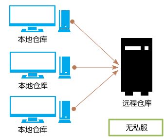
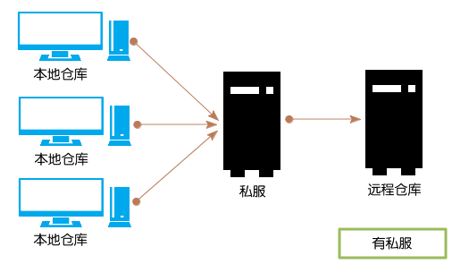
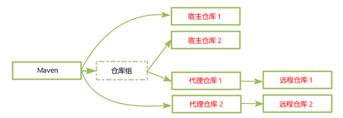
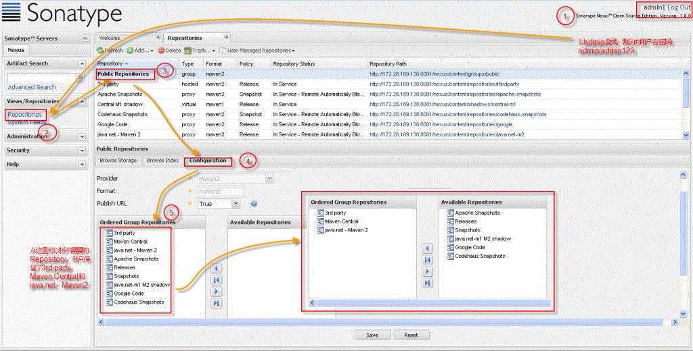

# 简介

Maven是一个项目管理工具。

当执行Maven构建时，Maven会根据POM中的定义，自动下载相关依赖和插件。

<!--more-->

# 安装和配置

## 安装

1. 安装JDK；
2. 下载并解压Maven；
3. 将环境变量`M2_HOME`设置为Maven的安装目录；
4. 将`M2_HOME/bin`目录添加到`Path`环境变量中。

### maven-wrapper

如果你的项目没有mvnw文件，需要先下载maven，并把[mvn](https://repo.maven.apache.org/maven2/org/apache/maven/apache-maven/3.5.4/apache-maven-3.5.4-bin.zip)可执行文件路径需加入的PATH中。然后执行以下命令，就会自动生成mvnw相关一系列文件：

```bash
$ mvn -N io.takari:maven:wrapper
```

> 使用`https://start.spring.io/`生成Spring Boot初始项目已经包含了mvnw，不需要另外安装。因此，也不需要自己安装maven。

## 配置

### 全局配置

全局配置可以在两个地方：

+ 环境变量`MAVEN_OPTS` ；
+ 配置文件`M2_HOME/conf/settings.xml`。

环境变量`MAVEN_OPTS`通常用于设置一些用于启动JVM的参数，例如：`-Xms256m -Xmx1024m`（用于避免在较大项目中，需要大量内存，而造成的`java.lang.OutOfMemeoryError`错误）。例如：

```bash
$ export MAVEN_OPTS=-Xmx1024m
```


具体的配置参见：[Maven Local Settings Model Website](http://maven.apache.org/maven-settings/settings.html)

<https://maven.apache.org/xsd/settings-1.0.0.xsd>：

```xml
<settings xmlns="http://maven.apache.org/SETTINGS/1.1.0" 
          xmlns:xsi="http://www.w3.org/2001/XMLSchema-instance"
          xsi:schemaLocation="http://maven.apache.org/SETTINGS/1.1.0 http://maven.apache.org/xsd/settings-1.1.0.xsd">
  <localRepository/>
  <interactiveMode/>
  <usePluginRegistry/>
  <offline/>

  <proxies>
    <proxy>
      <active/>
      <protocol/>
      <username/>
      <password/>
      <port/>
      <host/>
      <nonProxyHosts/>
      <id/>
    </proxy>
  </proxies>

  <servers>
    <server>
      <username/>
      <password/>
      <privateKey/>
      <passphrase/>
      <filePermissions/>
      <directoryPermissions/>
      <configuration/>
      <id/>
    </server>
  </servers>

  <mirrors>
    <mirror>
      <mirrorOf/>
      <name/>
      <url/>
      <layout/>
      <mirrorOfLayouts/>
      <id/>
    </mirror>
  </mirrors>

  <profiles>
    <profile>
      <activation>
        <activeByDefault/>
        <jdk/>
        <os>
          <name/>
          <family/>
          <arch/>
          <version/>
        </os>
        <property>
          <name/>
          <value/>
        </property>
        <file>
          <missing/>
          <exists/>
        </file>
      </activation>
      <properties>
        <key>value</key>
      </properties>

      <repositories>
        <repository>
          <releases>
            <enabled/>
            <updatePolicy/>
            <checksumPolicy/>
          </releases>
          <snapshots>
            <enabled/>
            <updatePolicy/>
            <checksumPolicy/>
          </snapshots>
          <id/>
          <name/>
          <url/>
          <layout/>
        </repository>
      </repositories>
      <pluginRepositories>
        <pluginRepository>
          <releases>
            <enabled/>
            <updatePolicy/>
            <checksumPolicy/>
          </releases>
          <snapshots>
            <enabled/>
            <updatePolicy/>
            <checksumPolicy/>
          </snapshots>
          <id/>
          <name/>
          <url/>
          <layout/>
        </pluginRepository>
      </pluginRepositories>
      <id/>
    </profile>
  </profiles>

  <activeProfiles/>
  <pluginGroups/>
</settings>
```


### 用户级的配置

用户级的配置文件位于：`~/.m2/settings.xml`，它只对当前用户有效果。它的配置内容与全局配置相同。

### 项目级的配置

项目级的配置文件位于项目根目录下的`.mvn`目录中的`maven.config`和`extensions.xml`。


# 入门

## 生成项目

在Maven中，可以使用Archetype来生成项目的骨架：

```bash
$ mvn archetype:generate -DgroupId=com.mycompany.app -DartifactId=my-app -DarchetypeArtifactId=maven-archetype-quickstart -DinteractiveMode=false
```

如果是使用Powershell，要记得给形如“-Dxxx”的参数加上引号：

```powershell
> mvn archetype:generate '-DgroupId=com.mycompany.app' '-DartifactId=my-app2' '-DarchetypeArtifactId=maven-archetype-quickstart' '-DinteractiveMode=false'
```

上面命令，将自动创建一个`my-app`目录，并将它作为项目的根目录。

`archetype`是Maven的**插件**，`generate`是该插件的一个**目标（goal）**。

### Maven标准项目结构

```
my-app
|-- pom.xml
|-- LICENSE  （Project's license）
|-- NOTICE  (Notices and attributions required by libraries that the project depends on)
|-- README.md  （Project's readme）
|-- src
|   |-- main
|   |   |-- java  （Application/Library sources）
|   |   |   `-- com
|   |   |       `-- mycompany
|   |   |           `-- app
|   |   |               `-- App.java
|   |   |-- resources  （Application/Library resources） 
|   |   |-- filters  （Resource filter files）
|   |   |-- webapp  （Web application sources）
|   |-- test
|   |   |-- java  （Test sources）
|   |   |   `-- com
|   |   |       `-- mycompany
|   |   |           `-- app
|   |   |               `-- AppTest.java
|   |   |-- resources  （Test resources）
|   |   |-- filters  （Test resource filter files）
|   |-- it （Integration Tests (primarily for plugins)）
|   |-- assembly  （Assembly descriptors）
|   |-- site  （Site）
|-- target  （Output of the build）
```

在一个Maven项目，只有`pom.xml`是必须的，其他内容都是可选的。

## 配置POM

pom.xml：

```xml
<project xmlns="http://maven.apache.org/POM/4.0.0" xmlns:xsi="http://www.w3.org/2001/XMLSchema-instance"
  xsi:schemaLocation="http://maven.apache.org/POM/4.0.0 http://maven.apache.org/xsd/maven-4.0.0.xsd">
  <modelVersion>4.0.0</modelVersion>
 
  <groupId>com.mycompany.app</groupId>
  <artifactId>my-app</artifactId>
  <version>1.0-SNAPSHOT</version>
  <packaging>jar</packaging>
 
  <name>Maven Quick Start Archetype</name>
  <url>http://maven.apache.org</url>
 
  <dependencies>
    <dependency>
      <groupId>junit</groupId>
      <artifactId>junit</artifactId>
      <version>4.12</version>
      <scope>test</scope>
    </dependency>
  </dependencies>
</project>
```

## 编写代码

略。

## 构建项目

```bash
cd my-app
mvn clean package
```

这里`clean`和`package`都是Maven的**构建阶段（phase）**。构建阶段是**构建生成周期（build lifecycle）**的一个步骤，而构建生命周期则是多个构建阶段组成的有序序列。

使用Maven构建项目时，既可以执行一个或多个构建阶段，也可以执行一个或多个插件目标，还可以混合使用。Maven支持直接执行插件目标是因为有些任务不适合绑定在生命周期上，例如：`maven-help-plugin:describe`。

在同一条mvn命令中，可以同时包含多个插件目标和构建阶段：

```bash
mvn clean dependency:copy-dependencies package
```

当执行一个构建阶段时，Maven将依次执行该构建阶段之前的所有构建阶段（在同一个构建生命周期中），然后再执行该构建阶段。而执行一个插件目标，则只会执行该插件目标 ，而不会执行其他插件目标 。

> 在`mvn`命令之后，形如“xxx:xxx”的是插件目标，而只有一个单词的是构建阶段。

常用构建命令：

+ `mvn compile`：仅编译项目，但不打包；
+ `mvn test`：运行单元测试；
+ `mvn test-compile`：仅编译单元测试代码；
+ `mvn package`：编译、测试并打包项目；
+ `mvn install`：打包项目并将它安装到本地仓库；
+ `mvn clean`：清理构建，即删除`target`目录。

## 运行应用

```bash
java -cp target/my-app-1.0-SNAPSHOT.jar com.mycompany.app.App
```

## 生成项目站点

```bash
mvn site
```

生成的项目站点在`target/site`目录下。

# 项目对象模型（POM）

POM定义了项目的基本信息，它描述项目是如何构建，声明了项目依赖等等。

POM通常定义在项目根目录下的`pom.xml`文件中。

## POM的结构

参见：[Technical Project Descriptor](http://maven.apache.org/ref/current/maven-model/maven.html)

```xml
<project xmlns="http://maven.apache.org/POM/4.0.0" 
         xmlns:xsi="http://www.w3.org/2001/XMLSchema-instance"
         xsi:schemaLocation="http://maven.apache.org/POM/4.0.0 http://maven.apache.org/xsd/maven-4.0.0.xsd">
  <modelVersion/>

  <parent>
    <groupId/>
    <artifactId/>
    <version/>
    <relativePath/>
  </parent>

  <groupId/>
  <artifactId/>
  <version/>
  <packaging/>

  <name/>
  <description/>
  <url/>
  <inceptionYear/>
  <organization>
    <name/>
    <url/>
  </organization>
  <licenses>
    <license>
      <name/>
      <url/>
      <distribution/>
      <comments/>
    </license>
  </licenses>

  <developers>
    <developer>
      <id/>
      <name/>
      <email/>
      <url/>
      <organization/>
      <organizationUrl/>
      <roles/>
      <timezone/>
      <properties>
        <key>value</key>
      </properties>
    </developer>
  </developers>
  <contributors>
    <contributor>
      <name/>
      <email/>
      <url/>
      <organization/>
      <organizationUrl/>
      <roles/>
      <timezone/>
      <properties>
        <key>value</key>
      </properties>
    </contributor>
  </contributors>

  <mailingLists>
    <mailingList>
      <name/>
      <subscribe/>
      <unsubscribe/>
      <post/>
      <archive/>
      <otherArchives/>
    </mailingList>
  </mailingLists>

  <prerequisites>
    <maven/>
  </prerequisites>

  <modules/>

  <scm>
    <connection/>
    <developerConnection/>
    <tag/>
    <url/>
  </scm>
  <issueManagement>
    <system/>
    <url/>
  </issueManagement>
  <ciManagement>
    <system/>
    <url/>
    <notifiers>
      <notifier>
        <type/>
        <sendOnError/>
        <sendOnFailure/>
        <sendOnSuccess/>
        <sendOnWarning/>
        <address/>
        <configuration>
          <key>value</key>
        </configuration>
      </notifier>
    </notifiers>
  </ciManagement>

  <distributionManagement>
    <repository>
      <uniqueVersion/>
      <releases>
        <enabled/>
        <updatePolicy/>
        <checksumPolicy/>
      </releases>
      <snapshots>
        <enabled/>
        <updatePolicy/>
        <checksumPolicy/>
      </snapshots>
      <id/>
      <name/>
      <url/>
      <layout/>
    </repository>
    <snapshotRepository>
      <uniqueVersion/>
      <releases>
        <enabled/>
        <updatePolicy/>
        <checksumPolicy/>
      </releases>
      <snapshots>
        <enabled/>
        <updatePolicy/>
        <checksumPolicy/>
      </snapshots>
      <id/>
      <name/>
      <url/>
      <layout/>
    </snapshotRepository>
    <site>
      <id/>
      <name/>
      <url/>
    </site>
    <downloadUrl/>
    <relocation>
      <groupId/>
      <artifactId/>
      <version/>
      <message/>
    </relocation>
    <status/>
  </distributionManagement>

  <properties>
    <key>value</key>
  </properties>

  <dependencyManagement>
    <dependencies>
      <dependency>
        <groupId/>
        <artifactId/>
        <version/>
        <type/>
        <classifier/>
        <scope/>
        <systemPath/>
        <exclusions>
          <exclusion>
            <artifactId/>
            <groupId/>
          </exclusion>
        </exclusions>
        <optional/>
      </dependency>
    </dependencies>
  </dependencyManagement>
  <dependencies>
    <dependency>
      <groupId/>
      <artifactId/>
      <version/>
      <type/>
      <classifier/>
      <scope/>
      <systemPath/>
      <exclusions>
        <exclusion>
          <artifactId/>
          <groupId/>
        </exclusion>
      </exclusions>
      <optional/>
    </dependency>
  </dependencies>

  <repositories>
    <repository>
      <releases>
        <enabled/>
        <updatePolicy/>
        <checksumPolicy/>
      </releases>
      <snapshots>
        <enabled/>
        <updatePolicy/>
        <checksumPolicy/>
      </snapshots>
      <id/>
      <name/>
      <url/>
      <layout/>
    </repository>
  </repositories>
  <pluginRepositories>
    <pluginRepository>
      <releases>
        <enabled/>
        <updatePolicy/>
        <checksumPolicy/>
      </releases>
      <snapshots>
        <enabled/>
        <updatePolicy/>
        <checksumPolicy/>
      </snapshots>
      <id/>
      <name/>
      <url/>
      <layout/>
    </pluginRepository>
  </pluginRepositories>

  <build>
    <sourceDirectory/>
    <scriptSourceDirectory/>
    <testSourceDirectory/>
    <outputDirectory/>
    <testOutputDirectory/>
    <extensions>
      <extension>
        <groupId/>
        <artifactId/>
        <version/>
      </extension>
    </extensions>
    <defaultGoal/>
    <resources>
      <resource>
        <targetPath/>
        <filtering/>
        <directory/>
        <includes/>
        <excludes/>
      </resource>
    </resources>
    <testResources>
      <testResource>
        <targetPath/>
        <filtering/>
        <directory/>
        <includes/>
        <excludes/>
      </testResource>
    </testResources>
    <directory/>
    <finalName/>
    <filters/>
    <pluginManagement>
      <plugins>
        <plugin>
          <groupId/>
          <artifactId/>
          <version/>
          <extensions/>
          <executions>
            <execution>
              <id/>
              <phase/>
              <goals/>
              <inherited/>
              <configuration/>
            </execution>
          </executions>
          <dependencies>
            <dependency>
              <groupId/>
              <artifactId/>
              <version/>
              <type/>
              <classifier/>
              <scope/>
              <systemPath/>
              <exclusions>
                <exclusion>
                  <artifactId/>
                  <groupId/>
                </exclusion>
              </exclusions>
              <optional/>
            </dependency>
          </dependencies>
          <goals/>
          <inherited/>
          <configuration/>
        </plugin>
      </plugins>
    </pluginManagement>
    <plugins>
      <plugin>
        <groupId/>
        <artifactId/>
        <version/>
        <extensions/>
        <executions>
          <execution>
            <id/>
            <phase/>
            <goals/>
            <inherited/>
            <configuration/>
          </execution>
        </executions>
        <dependencies>
          <dependency>
            <groupId/>
            <artifactId/>
            <version/>
            <type/>
            <classifier/>
            <scope/>
            <systemPath/>
            <exclusions>
              <exclusion>
                <artifactId/>
                <groupId/>
              </exclusion>
            </exclusions>
            <optional/>
          </dependency>
        </dependencies>
        <goals/>
        <inherited/>
        <configuration/>
      </plugin>
    </plugins>
  </build>

  <reports/>
  <reporting>
    <excludeDefaults/>
    <outputDirectory/>
    <plugins>
      <plugin>
        <groupId/>
        <artifactId/>
        <version/>
        <reportSets>
          <reportSet>
            <id/>
            <reports/>
            <inherited/>
            <configuration/>
          </reportSet>
        </reportSets>
        <inherited/>
        <configuration/>
      </plugin>
    </plugins>
  </reporting>

  <profiles>
    <profile>
      <id/>
      <activation>
        <activeByDefault/>
        <jdk/>
        <os>
          <name/>
          <family/>
          <arch/>
          <version/>
        </os>
        <property>
          <name/>
          <value/>
        </property>
        <file>
          <missing/>
          <exists/>
        </file>
      </activation>
      <build>
        <defaultGoal/>
        <resources>
          <resource>
            <targetPath/>
            <filtering/>
            <directory/>
            <includes/>
            <excludes/>
          </resource>
        </resources>
        <testResources>
          <testResource>
            <targetPath/>
            <filtering/>
            <directory/>
            <includes/>
            <excludes/>
          </testResource>
        </testResources>
        <directory/>
        <finalName/>
        <filters/>
        <pluginManagement>
          <plugins>
            <plugin>
              <groupId/>
              <artifactId/>
              <version/>
              <extensions/>
              <executions>
                <execution>
                  <id/>
                  <phase/>
                  <goals/>
                  <inherited/>
                  <configuration/>
                </execution>
              </executions>
              <dependencies>
                <dependency>
                  <groupId/>
                  <artifactId/>
                  <version/>
                  <type/>
                  <classifier/>
                  <scope/>
                  <systemPath/>
                  <exclusions>
                    <exclusion>
                      <artifactId/>
                      <groupId/>
                    </exclusion>
                  </exclusions>
                  <optional/>
                </dependency>
              </dependencies>
              <goals/>
              <inherited/>
              <configuration/>
            </plugin>
          </plugins>
        </pluginManagement>
        <plugins>
          <plugin>
            <groupId/>
            <artifactId/>
            <version/>
            <extensions/>
            <executions>
              <execution>
                <id/>
                <phase/>
                <goals/>
                <inherited/>
                <configuration/>
              </execution>
            </executions>
            <dependencies>
              <dependency>
                <groupId/>
                <artifactId/>
                <version/>
                <type/>
                <classifier/>
                <scope/>
                <systemPath/>
                <exclusions>
                  <exclusion>
                    <artifactId/>
                    <groupId/>
                  </exclusion>
                </exclusions>
                <optional/>
              </dependency>
            </dependencies>
            <goals/>
            <inherited/>
            <configuration/>
          </plugin>
        </plugins>
      </build>

      <modules/>

      <distributionManagement>
        <repository>
          <uniqueVersion/>
          <releases>
            <enabled/>
            <updatePolicy/>
            <checksumPolicy/>
          </releases>
          <snapshots>
            <enabled/>
            <updatePolicy/>
            <checksumPolicy/>
          </snapshots>
          <id/>
          <name/>
          <url/>
          <layout/>
        </repository>
        <snapshotRepository>
          <uniqueVersion/>
          <releases>
            <enabled/>
            <updatePolicy/>
            <checksumPolicy/>
          </releases>
          <snapshots>
            <enabled/>
            <updatePolicy/>
            <checksumPolicy/>
          </snapshots>
          <id/>
          <name/>
          <url/>
          <layout/>
        </snapshotRepository>
        <site>
          <id/>
          <name/>
          <url/>
        </site>
        <downloadUrl/>
        <relocation>
          <groupId/>
          <artifactId/>
          <version/>
          <message/>
        </relocation>
        <status/>
      </distributionManagement>

      <properties>
        <key>value</key>
      </properties>

      <dependencyManagement>
        <dependencies>
          <dependency>
            <groupId/>
            <artifactId/>
            <version/>
            <type/>
            <classifier/>
            <scope/>
            <systemPath/>
            <exclusions>
              <exclusion>
                <artifactId/>
                <groupId/>
              </exclusion>
            </exclusions>
            <optional/>
          </dependency>
        </dependencies>
      </dependencyManagement>
      <dependencies>
        <dependency>
          <groupId/>
          <artifactId/>
          <version/>
          <type/>
          <classifier/>
          <scope/>
          <systemPath/>
          <exclusions>
            <exclusion>
              <artifactId/>
              <groupId/>
            </exclusion>
          </exclusions>
          <optional/>
        </dependency>
      </dependencies>

      <repositories>
        <repository>
          <releases>
            <enabled/>
            <updatePolicy/>
            <checksumPolicy/>
          </releases>
          <snapshots>
            <enabled/>
            <updatePolicy/>
            <checksumPolicy/>
          </snapshots>
          <id/>
          <name/>
          <url/>
          <layout/>
        </repository>
      </repositories>
      <pluginRepositories>
        <pluginRepository>
          <releases>
            <enabled/>
            <updatePolicy/>
            <checksumPolicy/>
          </releases>
          <snapshots>
            <enabled/>
            <updatePolicy/>
            <checksumPolicy/>
          </snapshots>
          <id/>
          <name/>
          <url/>
          <layout/>
        </pluginRepository>
      </pluginRepositories>

      <reports/>
      <reporting>
        <excludeDefaults/>
        <outputDirectory/>
        <plugins>
          <plugin>
            <groupId/>
            <artifactId/>
            <version/>
            <reportSets>
              <reportSet>
                <id/>
                <reports/>
                <inherited/>
                <configuration/>
              </reportSet>
            </reportSets>
            <inherited/>
            <configuration/>
          </plugin>
        </plugins>
      </reporting>
    </profile>
  </profiles>
</project>
```

> POM的详细说明参见官网的 [POM Reference](http://maven.apache.org/pom.html) 。

## Super POM

*Super POM*是Maven的默认POM。所有POM都自动继承自Super POM，除非显式指定父POM。

每个版本的Maven的Super POM可能都有点不一样，具体参见官网。例如：[Maven 3.5.2 的Super POM](http://maven.apache.org/ref/3-LATEST/maven-model-builder/super-pom.html#)：

```xml
<project>
  <modelVersion>4.0.0</modelVersion>

  <repositories>
    <repository>
      <id>central</id>
      <name>Central Repository</name>
      <url>https://repo.maven.apache.org/maven2</url>
      <layout>default</layout>
      <snapshots>
        <enabled>false</enabled>
      </snapshots>
    </repository>
  </repositories>

  <pluginRepositories>
    <pluginRepository>
      <id>central</id>
      <name>Central Repository</name>
      <url>https://repo.maven.apache.org/maven2</url>
      <layout>default</layout>
      <snapshots>
        <enabled>false</enabled>
      </snapshots>
      <releases>
        <updatePolicy>never</updatePolicy>
      </releases>
    </pluginRepository>
  </pluginRepositories>

  <build>
    <directory>${project.basedir}/target</directory>
    <outputDirectory>${project.build.directory}/classes</outputDirectory>
    <finalName>${project.artifactId}-${project.version}</finalName>
    <testOutputDirectory>${project.build.directory}/test-classes</testOutputDirectory>
    <sourceDirectory>${project.basedir}/src/main/java</sourceDirectory>
    <scriptSourceDirectory>${project.basedir}/src/main/scripts</scriptSourceDirectory>
    <testSourceDirectory>${project.basedir}/src/test/java</testSourceDirectory>
    <resources>
      <resource>
        <directory>${project.basedir}/src/main/resources</directory>
      </resource>
    </resources>
    <testResources>
      <testResource>
        <directory>${project.basedir}/src/test/resources</directory>
      </testResource>
    </testResources>
    <pluginManagement>
      <!-- NOTE: These plugins will be removed from future versions of the super POM -->
      <!-- They are kept for the moment as they are very unlikely to conflict with lifecycle mappings (MNG-4453) -->
      <plugins>
        <plugin>
          <artifactId>maven-antrun-plugin</artifactId>
          <version>1.3</version>
        </plugin>
        <plugin>
          <artifactId>maven-assembly-plugin</artifactId>
          <version>2.2-beta-5</version>
        </plugin>
        <plugin>
          <artifactId>maven-dependency-plugin</artifactId>
          <version>2.8</version>
        </plugin>
        <plugin>
          <artifactId>maven-release-plugin</artifactId>
          <version>2.3.2</version>
        </plugin>
      </plugins>
    </pluginManagement>
  </build>

  <reporting>
    <outputDirectory>${project.build.directory}/site</outputDirectory>
  </reporting>

  <profiles>
    <!-- NOTE: The release profile will be removed from future versions of the super POM -->
    <profile>
      <id>release-profile</id>

      <activation>
        <property>
          <name>performRelease</name>
          <value>true</value>
        </property>
      </activation>

      <build>
        <plugins>
          <plugin>
            <inherited>true</inherited>
            <artifactId>maven-source-plugin</artifactId>
            <executions>
              <execution>
                <id>attach-sources</id>
                <goals>
                  <goal>jar</goal>
                </goals>
              </execution>
            </executions>
          </plugin>
          <plugin>
            <inherited>true</inherited>
            <artifactId>maven-javadoc-plugin</artifactId>
            <executions>
              <execution>
                <id>attach-javadocs</id>
                <goals>
                  <goal>jar</goal>
                </goals>
              </execution>
            </executions>
          </plugin>
          <plugin>
            <inherited>true</inherited>
            <artifactId>maven-deploy-plugin</artifactId>
            <configuration>
              <updateReleaseInfo>true</updateReleaseInfo>
            </configuration>
          </plugin>
        </plugins>
      </build>
    </profile>
  </profiles>
</project>
```

> Super POM包含在`$M2_HOME/lib/maven-model-builder-x.x.jar`的`org/apache/maven/model/pom-4.0.0.xml`中。

## 最小的POM

```xml
<project xmlns="http://maven.apache.org/POM/4.0.0"
  xmlns:xsi="http://www.w3.org/2001/XMLSchema-instance"
  xsi:schemaLocation="http://maven.apache.org/POM/4.0.0
                      http://maven.apache.org/xsd/maven-4.0.0.xsd">
  <modelVersion>4.0.0</modelVersion>
 
  <groupId>org.codehaus.mojo</groupId>
  <artifactId>my-project</artifactId>
  <version>1.0</version>
</project>
```

## Maven坐标

POM中的`groupId`、`artifactId`、`version`、`packaging`（可选）和`classifier`（可选）五个元素构成了所谓的**Maven坐标**——它唯一定位一个Maven工件（依赖和插件）。

Maven坐标在控制台输出时，常写作如下形式：

+ groupId:artifactId:version
+ groupId:artifactId:packaging:version
+ groupId:artifactId:packaging:classifier:version


`classifier`：用来区分那些由相同POM构建，但生成的内容不相同的工件。默认值为空。

例如：`foo`这个项目，使用不同插件可以生成`foo-1.0.jar`、`foo-1.0-jdk14.jar`、`foo-1.0-javadoc.jar`、`foo-1.0-sources.jar`等等工件。则`jdk14`、`javadoc`和`sources`就是这个项目的`classifier`，可以使用这些`classifier`直接定位到相应工件。

注意：与`packaging`不同，`classifier`不是在项目中直接定义的，而是由插件生成的。

> 实际上，`version`也是可以缺省的，这时默认为最新release版本。

## 查看生效的POM

例如，查看Profile为`appserverConfig-dev`的生效POM：

```bash
$ mvn help:effective-pom -P appserverConfig-dev
```

# 项目依赖

## 配置依赖

在`pom.xml`的`dependencies`元素中可以定义项目需要的所有依赖。当Maven开始构建时，它会自动安装这些依赖。Maven首先会去本地仓库中查找这些依赖并构建到项目中，如果本地仓库中没有找到，则会从配置的远程仓库中下载到本地仓库，然后再构建到项目中。

另外，依赖具有传递性。依赖的依赖也会被自动下载。


```xml
<project xmlns="http://maven.apache.org/POM/4.0.0"
  xmlns:xsi="http://www.w3.org/2001/XMLSchema-instance"
  xsi:schemaLocation="http://maven.apache.org/POM/4.0.0
                      https://maven.apache.org/xsd/maven-4.0.0.xsd">
  ...
  <dependencies>
    <dependency>
      <groupId>junit</groupId>
      <artifactId>junit</artifactId>
      <version>4.0</version>
      <type>jar</type>
      <scope>test</scope>
      <optional>true</optional>
      <exclusions>
      	<exclusion>...</exclusion>
      </exclusions>
    </dependency>
    ...
  </dependencies>
  ...
</project>
```

`type`：依赖类型，对应于Maven坐标中的`packaging`。默认值为`jar`。

## 依赖范围

依赖范围是用于限制依赖的传递范围，从而影响构建任务的`classpath`。

- `compile`：这是默认的依赖范围。`compile`依赖在一个项目的所有classpaths上均可用。

- `provided`：这种依赖只在编译和测试的classpaths上可用。在运行时，则期望由JDK或容器来提供这些依赖。例如：Servlet API。

- `runtime`：运行时依赖只在运行和测试的classpaths上可用，在编译时上是不可用的。例如：JDBC驱动。

- `test`：测试时依赖只在测试的classpaths上可用。例如：JUnit。

- `system`：（已废弃）与`provided`类似，但是，在运行时，必须使用`<systemPath>`来显式指定依赖的文件路径。

  ```xml
  <dependency>
    <groupId>javax.sql</groupId>
    <artifactId>jdbc-stdext</artifactId>
    <version>2.0</version>
    <scope>system</scope>
    <systemPath>${java.home}/lib/rt.jar</systemPath>  <!--可以使用插值来访问环境变量
  --></dependency>
  ```

- `import`：只能出现在`<dependencyManagement>`中的依赖配置中。这种依赖将被它自己POM的`<dependencyManagement>`中的依赖替换。

## 依赖调解

依赖调解用于解决依赖树中，同一工件存在多个版本的冲突。

第一原则：离当前项目路径最近者优先。

例如：存在 A -> B -> C -> D:2.0 和 A -> E -> D:1.0 两种依赖关系，则在构建 A 时 D:1.0 优先。

第二原则：当路径距离相同时，依赖声明的顺序靠前者优先。

## 可选依赖

可选依赖不具有传递性。

假设有：A -> B，B -> X（可选），B -> Y（可选）。则 A 的 classpath 中将不会包含 X 和 Y。如果希望在 A 的 classpath 中包含 X 或 Y，则需要在 A 的`pom.xml`中显式对 X 或 Y 进行依赖配置。

```xml
<project>
  ...
  <dependencies>
    <!-- declare the dependency to be set as optional -->
    <dependency>
      <groupId>sample.ProjectX</groupId>
      <artifactId>Project-X</artifactId>
      <version>1.0</version>
      <scope>compile</scope>
      <optional>true</optional> <!-- value will be true or false only -->
    </dependency>
  </dependencies>
  ...
</project>
```

## 排除依赖

排除依赖将不会包含在 classpath 中。

```xml
<project>
  ...
  <dependencies>
    <dependency>
      <groupId>sample.ProjectA</groupId>
      <artifactId>Project-A</artifactId>
      <version>1.0</version>
      <scope>compile</scope>
      <exclusions>
        <exclusion>  <!-- declare the exclusion here -->
          <groupId>sample.ProjectB</groupId>
          <artifactId>Project-B</artifactId>
        </exclusion>
      </exclusions> 
    </dependency>
  </dependencies>
  ...
</project>
```


## 依赖管理

项目X：

```xml
<project>
 <modelVersion>4.0.0</modelVersion>
 <groupId>maven</groupId>
 <artifactId>X</artifactId>
 <packaging>pom</packaging>
 <name>X</name>
 <version>1.0</version>
 <dependencyManagement>
   <dependencies>
     <dependency>
       <groupId>test</groupId>
       <artifactId>a</artifactId>
       <version>1.2</version>
     </dependency>
     <dependency>
       <groupId>test</groupId>
       <artifactId>b</artifactId>
       <version>1.0</version>
       <scope>compile</scope>
     </dependency>
     <dependency>
       <groupId>test</groupId>
       <artifactId>c</artifactId>
       <version>1.0</version>
       <scope>compile</scope>
     </dependency>
     <dependency>
       <groupId>test</groupId>
       <artifactId>d</artifactId>
       <version>1.2</version>
       <scope>test</scope>
     </dependency>
   </dependencies>
 </dependencyManagement>
</project>
```

项目Y：

```xml
<project>
  <modelVersion>4.0.0</modelVersion>
  <parent>
    <artifactId>X</artifactId>
    <groupId>maven</groupId>
    <version>1.0</version>
  </parent>
  <groupId>maven</groupId>
  <artifactId>Y</artifactId>
  <packaging>pom</packaging>
  <name>Y</name>
  <version>1.0</version>
  <dependencyManagement>
    <dependencies>
      <dependency><!--改变了version，但保留了scope-->
        <groupId>test</groupId>
        <artifactId>d</artifactId>
        <version>1.0</version>
      </dependency>
    </dependencies>
  </dependencyManagement>
  <dependencies>
    <dependency><!--改变了version和scope-->
      <groupId>test</groupId>
      <artifactId>a</artifactId>
      <version>1.0</version>
      <scope>runtime</scope>
    </dependency>
    <dependency><!--保留了version和scope-->
      <groupId>test</groupId>
      <artifactId>b</artifactId>
    </dependency>
    <dependency><!--改变了scope，但保留了version-->
      <groupId>test</groupId>
      <artifactId>c</artifactId>
      <scope>runtime</scope>
    </dependency>
  </dependencies>
</project>
```

## 导入依赖

项目Z：

```xml
<project>
  <modelVersion>4.0.0</modelVersion>
  <groupId>maven</groupId>
  <artifactId>Z</artifactId>
  <packaging>pom</packaging>
  <name>Z</name>
  <version>1.0</version>
  <dependencyManagement>
    <dependencies>
      <dependency><!--导入依赖-->
        <groupId>maven</groupId>
        <artifactId>X</artifactId>
        <version>1.0</version>
        <type>pom</type>
        <scope>import</scope>
      </dependency>
      <dependency>
        <groupId>test</groupId>
        <artifactId>d</artifactId>
        <version>1.0</version>
      </dependency>
    </dependencies>
  </dependencyManagement>
  <dependencies>
    <dependency>
      <groupId>test</groupId>
      <artifactId>a</artifactId>
      <version>1.0</version>
      <scope>runtime</scope>
    </dependency>
    <dependency>
      <groupId>test</groupId>
      <artifactId>c</artifactId>
      <scope>runtime</scope>
    </dependency>
  </dependencies>
</project>
```

项目X的`<dependencyManagement>`中的依赖将被合并到项目Z的`<dependencyManagement>`中，除了依赖 d，因为它在Z中也有定义。

## 查看当前项目的依赖信息：

以列表方式列出当前项目的所有依赖：

```bash
$ cd myproject
$ mvn dependency:list
```

以树型方式列出当前项目的所有依赖：

```bash
$ cd myproject
$ mvn dependency:tree
```

分析依赖关系（基于编译时信息，发现不了运行时依赖）：

```bash
$ cd myproject
$ mvn dependency:analyze
```

 

# 构建项目

## 构建生命周期

Maven的构建生命周期定义了一个项目在构建过程中经历的整个过程，它由许多构建阶段组成，这些构建阶段是有顺序的。而每个构建阶段可以与0个或任意多个插件目标绑定，并由插件目标来实现它的具体行为。在必要的时候，用户甚至可以创建自己的插件来定制构建行为。

> 有些构建阶段，它们的名字是由连字符分隔的复合单词（例如：`pre-*`、`post-*`、`process-*`等等），它们通常不应该在命令行中直接调用。因为，它们要么产生对我们没用的中间结果，要么只是做了一些准备工作（例如：启动Tomcat）。直接调用这些阶段将导致某些被启动的服务没办法正常关闭。

Maven中有三个内置的构建生命周期：default、clean和site。

### Clean生命周期

Clean生命周期的目的是清理项目。

| `pre-clean`  | execute processes needed prior to the actual project cleaning |
| ------------ | ------------------------------------------------------------ |
| `clean`      | remove all files generated by the previous build             |
| `post-clean` | execute processes needed to finalize the project cleaning    |

### 默认生命周期

默认生命周期的目的是构建项目。

| `validate`                | validate the project is correct and all necessary information is available. |
| ------------------------- | ------------------------------------------------------------ |
| `initialize`              | initialize build state, e.g. set properties or create directories. |
| `generate-sources`        | generate any source code for inclusion in compilation.       |
| `process-sources`         | process the source code, for example to filter any values.   |
| `generate-resources`      | generate resources for inclusion in the package.             |
| `process-resources`       | copy and process the resources into the destination directory, ready for packaging. |
| `compile`                 | compile the source code of the project.                      |
| `process-classes`         | post-process the generated files from compilation, for example to do bytecode enhancement on Java classes. |
| `generate-test-sources`   | generate any test source code for inclusion in compilation.  |
| `process-test-sources`    | process the test source code, for example to filter any values. |
| `generate-test-resources` | create resources for testing.                                |
| `process-test-resources`  | copy and process the resources into the test destination directory. |
| `test-compile`            | compile the test source code into the test destination directory |
| `process-test-classes`    | post-process the generated files from test compilation, for example to do bytecode enhancement on Java classes. For Maven 2.0.5 and above. |
| `test`                    | run tests using a suitable unit testing framework. These tests should not require the code be packaged or deployed. |
| `prepare-package`         | perform any operations necessary to prepare a package before the actual packaging. This often results in an unpacked, processed version of the package. (Maven 2.1 and above) |
| `package`                 | take the compiled code and package it in its distributable format, such as a JAR. |
| `pre-integration-test`    | perform actions required before integration tests are executed. This may involve things such as setting up the required environment. |
| `integration-test`        | process and deploy the package if necessary into an environment where integration tests can be run. |
| `post-integration-test`   | perform actions required after integration tests have been executed. This may including cleaning up the environment. |
| `verify`                  | run any checks to verify the package is valid and meets quality criteria. |
| `install`                 | install the package into the local repository, for use as a dependency in other projects locally. |
| `deploy`                  | done in an integration or release environment, copies the final package to the remote repository for sharing with other developers and projects. |

### Site生命周期

Site生命周期的目的是建立项目站点。

| `pre-site`    | execute processes needed prior to the actual project site generation |
| ------------- | ------------------------------------------------------------ |
| `site`        | generate the project's site documentation                    |
| `post-site`   | execute processes needed to finalize the site generation, and to prepare for site deployment |
| `site-deploy` | deploy the generated site documentation to the specified web server |

### 内置的生命周期绑定

#### Clean生命周期绑定

| `clean` | `clean:clean` |
| ------- | ------------- |
|         |               |

####  `packaging`是`ejb`、`ejb3`、`jar`、`par`、`rar`、`war`的默认生命周期绑定

| `process-resources`      | `resources:resources`                                        |
| ------------------------ | ------------------------------------------------------------ |
| `compile`                | `compiler:compile`                                           |
| `process-test-resources` | `resources:testResources`                                    |
| `test-compile`           | `compiler:testCompile`                                       |
| `test`                   | `surefire:test`                                              |
| `package`                | `ejb:ejb` *or* `ejb3:ejb3` *or* `jar:jar` *or* `par:par` *or* `rar:rar` *or* `war:war` |
| `install`                | `install:install`                                            |
| `deploy`                 | `deploy:deploy`                                              |

#### `packaging`是`ear`的默认生命周期绑定

| `generate-resources` | `ear:generate-application-xml` |
| -------------------- | ------------------------------ |
| `process-resources`  | `resources:resources`          |
| `package`            | `ear:ear`                      |
| `install`            | `install:install`              |
| `deploy`             | `deploy:deploy`                |

#### `packaging`是`maven-plugin`的默认生命周期绑定

| `generate-resources`     | `plugin:descriptor`                                |
| ------------------------ | -------------------------------------------------- |
| `process-resources`      | `resources:resources`                              |
| `compile`                | `compiler:compile`                                 |
| `process-test-resources` | `resources:testResources`                          |
| `test-compile`           | `compiler:testCompile`                             |
| `test`                   | `surefire:test`                                    |
| `package`                | `jar:jar` *and* `plugin:addPluginArtifactMetadata` |
| `install`                | `install:install`                                  |
| `deploy`                 | `deploy:deploy`                                    |

#### `packaging`是`pom`的默认生命周期绑定

| `package` | `site:attach-descriptor` |
| --------- | ------------------------ |
| `install` | `install:install`        |
| `deploy`  | `deploy:deploy`          |

#### Site生命周期绑定

| `site`        | `site:site`   |
| ------------- | ------------- |
| `site-deploy` | `site:deploy` |

### 自定义的生命周期绑定

可以在POM中显式设置插件目标与构建阶段的绑定：

```xml
...
 <plugin>
   <groupId>com.mycompany.example</groupId>
   <artifactId>display-maven-plugin</artifactId>
   <version>1.0</version>
   <executions>
     <execution>
       <phase>process-test-resources</phase>
       <goals>
         <goal>time</goal>
       </goals>
     </execution>
   </executions>
 </plugin>
...
```


## 打包方式

要对Maven项目打包，只需要执行下列Maven命令：

```bash
mvn package
```

打包方式由`packaging`设置，它当前内置的类型有：`jar`（默认值）、`pom`、 `maven-plugin`、`ejb`、`war`、`ear`、`rar`、`par` 。

除了内置的类型，还可以启用其他的一些packaging类型（例如：`plexus-application`）。这需要

在POM中添加相应的插件（例如：Plexus插件），并且设置它的`<extensions>true</extensions>`。

## 离线构建

如果需要在临时断开网络的情况下构建项目，可以使用`-o`参数：

```bash
$ mvn -o package
```

在离线构建下，许多插件将不会执行那些需要连接网络的操作。

# 插件

Maven实际上就是由一个核心引擎加上许多插件组成。核心引擎提供了基本的项目处理能力和构建管理，而插件负责执行实际的构建任务。

在Maven中插件分为**构建插件**和**报告插件**：

- 构建插件：在构建期间执行。它们应该在`<build><plugins/></build>`元素中配置；
- 报告插件：在生成项目站点期间执行。它们应该在`<reporting><plugins/></reporting>`元素中配置。

## 插件目标

插件由一个或多个Mojos组成，每个Mojo实现了一个具体的任务，并且它会映射到一个插件目标（通过`@goal`注解），而每个插件目标可以绑定到0个或任意多个构建阶段。用户可通过执行构建阶段或插件目标，来完成某些任务。

没有与任何构建阶段绑定的插件目标，不属于任何构建生命周期，它们通常作为一个普通任务，通过Maven命令直接执行。

当在一个项目中执行一个构建阶段时，其实是执行这个项目包含的插件（有些默认包含的插件是由`packaging`的设置决定的）中，与该构建阶段及在它之前的阶段绑定的插件目标。

当多个插件目标绑定到同一个构建阶段时，它们的执行顺序是：首先执行与`packaging`相关的内置绑定目标，然后再按在POM中定义的插件的先后顺序依次执行对应目标。另外，可以使用`executions`元素来获得目标执行顺序的更多控制权。

## 配置插件

### 配置参数

构建插件和报告插件都可以通过`<plugin><configuration/></plugin>`来配置参数（即Mojo类中的属性）。

例如有一个Mojo类——`MyQueryMojo`：

```java
/**
 * @goal query
 */
public class MyQueryMojo
    extends AbstractMojo
{
    /**
     * @parameter expression="${query.url}"
     */
    private String url;
 
    /**
     * @parameter default-value="60"
     */
    private int timeout;
 
    /**
     * @parameter
     */
    private String[] options;
 
    public void execute()
        throws MojoExecutionException
    {
        ...
    }
}
```

> 在Mojo上的注解，既可以是Java注解，也可以是Javadoc注解。

则在POM中可为该Mojo配置需要的URL、timeout和options：

```xml
<project>
  ...
  <build>
    <plugins>
      <plugin>
        <artifactId>maven-myquery-plugin</artifactId>
        <version>1.0</version>
        <configuration>
          <url>http://www.foobar.com/query</url>
          <timeout>10</timeout>
          <options>
            <option>one</option>
            <option>two</option>
            <option>three</option>
          </options>
        </configuration>
      </plugin>
    </plugins>
  </build>
  ...
</project>
```

> 在配置插件时，如果该插件是Maven官方插件（即`groupId`为`org.apache.maven.plugins`），则可以省略`groupId`。

上面的`url`属性使用了`@parameter expression`注解，等号右边实际上是对一个系统属性`query.url`的引用。因此，`url`属性还可以通过系统属性`query.url`进行配置：

```bash
$ mvn myquery:query -Dquery.url=http://maven.apache.org
```

#### 配置基本类型参数

Mojo：

```java
@Parameter( property = "sayhi.greeting", defaultValue = "Hello World!" )
private String greeting;

@Parameter
private boolean myBoolean;

@Parameter
private Integer myInteger;

@Parameter
private Double myDouble;

@Parameter
private Date myDate;

@Parameter
private File myFile;

@Parameter
private URL myURL
```

POM：

```xml
<configuration>
  <greeting>Welcome</greeting>
  <myBoolean>true</myBoolean>
  <myInteger>10</myInteger>
  <myDouble>1.0</myDouble>
  <myDate>2005-10-06 2:22:55.1 PM</myDate>
  <myFile>c:\temp</myFile>
  <myURL>http://maven.apache.org</myURL>
</configuration>
```

日期类型必须采用：yyyy-MM-dd HH:mm:ss.S a（例如：2005-10-06 2:22:55.1 PM）或yyyy-MM-dd HH:mm:ssa（例如：2005-10-06 2:22:55PM）格式。

文件类型的路径如果是相对路径（不以`/`或盘符开头），则是相对于POM的路径。

#### 配置枚举类型参数

Mojo：

```java
public enum Color {
  GREEN,
  RED,
  BLUE
}


@Parameter(defaultValue = "GREEN")
private Color myColor;
```

POM：

```xml
<configuration>
  <myColor>GREEN</myColor>
</configuration>
```


#### 配置对象参数

Mojo：

```java
@Parameter
private SuperPerson jo;
```

POM：

```xml
...
<configuration>
  <person implementation="com.mycompany.mojo.query.SuperPerson">
    <firstName>Jason</firstName>
    <lastName>van Zyl</lastName>
  </person>
</configuration>
...
```

如果省略`implementation`，则默认为在当前Mojo所在包下面有一个`Person`类。

#### 配置List参数

Mojo：

```java
public class MyAnimalMojo
    extends AbstractMojo
{
    /**
     * @parameter
     */
    private List animals;
 
    public void execute()
        throws MojoExecutionException
    {
        ...
    }
}
```

POM：

```xml
<project>
  ...
  <build>
    <plugins>
      <plugin>
        <artifactId>maven-myanimal-plugin</artifactId>
        <version>1.0</version>
        <configuration>
          <animals>
            <animal>cat</animal>
            <animal>dog</animal>
            <animal>aardvark</animal>
          </animals>
        </configuration>
      </plugin>
    </plugins>
  </build>
  ...
</project>
```

当List没指定元素的类型时，它遵循如下策略：（也适用于数组、May、Properties、对象）

- 元素的XML标签包含一个`implementation`属性，用于指定元素的实现类；
- 元素的XML标签名是一个类的完全限定名；
- 元素的XML标签名是一个简单类名，该类必须与当前Mojo在同一个包下；
- 如果元素没有子元素，则假定为`String`。

#### 配置映射参数

Mojo：

```java
...
    /**
     * My Map.
     *
     * @parameter
     */
    private Map myMap;
...
```

POM：

```xml
...
  <configuration>
    <myMap>
      <key1>value1</key1>
      <key2>value2</key2>
    </myMap>
  </configuration>
...
```

#### 配置`Properties`参数

Mojo：

```java
...
    /**
     * My Properties.
     *
     * @parameter
     */
    private Properties myProperties;
...
```

POM：

```xml
...
  <configuration>
    <myProperties>
      <property>
        <name>propertyName1</name>
        <value>propertyValue1</value>
      <property>
      <property>
        <name>propertyName2</name>
        <value>propertyValue2</value>
      <property>
    </myProperties>
  </configuration>
...
```

### 构建插件专用配置

#### 使用`<executions>`标签

`<executions>`标签可用于将插件目标和目标参数，与某个构建阶段绑定在一起。

`MyQueryMojo`：参见“配置参数”。

`MyBindedQueryMojo`：（使用`@phase`注解指定默认绑定的构建阶段）

```java
/**
 * @goal query2
 * @phase package
 */
public class MyBindedQueryMojo
    extends AbstractMojo
{
    /**
     * @parameter expression="${query.url}"
     */
    private String url;
 
    /**
     * @parameter default-value="60"
     */
    private int timeout;
 
    /**
     * @parameter
     */
    private String[] options;
 
    public void execute()
        throws MojoExecutionException
    {
        ...
    }
}
```

POM：

```xml
<project>
  ...
  <build>
    <plugins>
      <plugin>
        <artifactId>maven-myquery-plugin</artifactId>
        <version>1.0</version>
        <executions>
          <execution>
            <id>execution1</id>
            <phase>test</phase>
            <configuration>
              <url>http://www.foo.com/query</url>
              <timeout>10</timeout>
              <options>
                <option>one</option>
                <option>two</option>
                <option>three</option>
              </options>
            </configuration>
            <goals>
              <goal>query</goal>
            </goals>
          </execution>
          <execution>
            <id>execution2</id>
            <configuration>
              <url>http://www.bar.com/query</url>
              <timeout>15</timeout>
              <options>
                <option>four</option>
                <option>five</option>
                <option>six</option>
              </options>
            </configuration>
            <goals>
              <goal>query2</goal>
            </goals>
          </execution>
        </executions>
      </plugin>
    </plugins>
  </build>
  ...
</project>
```

`execution1`将插件目标`query`以及相关参数配置，与构建阶段`test`绑定。

`execution2`没有显式指定绑定的构建阶段，则与Mojo中用注解配置的默认构建阶段绑定。假如也没有配置默认绑定的构建阶段，则该Execution永远不会被执行。如果`execution2`显式指定了绑定的构建阶段，则它将覆盖默认绑定的构建阶段。

在同一个POM的同一个插件中，Execution的`id`必须是唯一的。而在POM的继承层次中，不同 POM的相同插件的Execution的`id`可以相同，这时相同`id`的Execution将被合并。通常将相同`id`的Execution的共同配置放到Profiles中。

另外，同一个Mojo可以被多个Execution映射到不同的构建阶段。

##### 直接执行Execution

从Maven 3.3.1开始，可以使用Maven命令直接执行Execution：

```bash
$ mvn myqyeryplugin:queryMojo@execution1
```

#### 使用`<dependencies>`标签

使用`<dependencies>`标签可以修改插件原来使用的依赖配置。

```xml
<project>
  ...
  <build>
    <plugins>
      <plugin>
        <groupId>org.apache.maven.plugins</groupId>
        <artifactId>maven-antrun-plugin</artifactId>
        <version>1.2</version>
        ...
        <dependencies>
          <dependency>
            <groupId>org.apache.ant</groupId>
            <artifactId>ant</artifactId>
            <version>1.7.1</version>
          </dependency>
          <dependency>
            <groupId>org.apache.ant</groupId>
            <artifactId>ant-launcher</artifactId>
            <version>1.7.1</version>
          </dependency>
         </dependencies>
      </plugin>
    </plugins>
  </build>
  ...
</project>
```

#### 使用`<inherited>`标签

默认情况下，插件的配置会被子POM继承。如果要禁止被子POM继承，则可将该标签设置为`false`：

```xml
<project>
  ...
  <build>
    <plugins>
      <plugin>
        <groupId>org.apache.maven.plugins</groupId>
        <artifactId>maven-antrun-plugin</artifactId>
        <version>1.2</version>
        <inherited>false</inherited>
        ...
      </plugin>
    </plugins>
  </build>
  ...
</project>
```


### 报告插件专用配置

以Site生命周期的构建阶段方式执行报告插件。例如：`mvn site`。则只会在`<reporting>`下找插件的配置信息。

以插件目标方式直接执行的报告插件。例如：`mvn aplugin:areportgoal`。则首先会在`<reporting>`下找插件的配置信息。如果没找到，则会到`<build>`下找插件的配置信息。

##### 使用`<reportSets>`有选择地生成报告内容

`<reportSets>`用于指定生成的内容中要包含哪些报告。如果缺省`<reportSets>`，则表示生成内容包含所有报告。

例如：只生成项目团队报告：

```xml
<project>
  ...
  <reporting>
    <plugins>
      <plugin>
        <groupId>org.apache.maven.plugins</groupId>
        <artifactId>maven-project-info-reports-plugin</artifactId>
        <version>2.1.2</version>
        <reportSets>
          <reportSet>
            <reports>
              <report>project-team</report>
            </reports>
          </reportSet>
        </reportSets>
      </plugin>
    </plugins>
  </reporting>
  ...
</project>
```

如果要排除所有报告，只需：

```xml
  <reportSets>
    <reportSet>
      <reports/>
    </reportSet>
  </reportSets>
```

#### 使用`<inherited>`标签

类似于构建插件的情况，如果要禁止被子POM继承，则可将该标签设置为`false`：

```xml
<project>
  ...
  <reporting>
    <plugins>
      <plugin>
        <groupId>org.apache.maven.plugins</groupId>
        <artifactId>maven-project-info-reports-plugin</artifactId>
        <version>2.1.2</version>
        <inherited>false</inherited>
      </plugin>
    </plugins>
  </reporting>
  ...
</project>
```

## 插件前缀解析机制

通过前面的介绍，我们知道可以在命令行中直接执行插件目标。例如：

```bash
$ mvn org.apache.maven.plugins:maven-dependency-plugin:2.8:tree
$ mvn dependency:tree
```

上面两条命令的效果是一样的。区别在于：第一条命令采用“插件Maven坐标:插件目标”形式，而第二条命令采用“插件前缀:插件目标”形式。

引入插件前缀的目的就是为了避免出现像第一条命令那样的繁琐输入。

### 默认插件前缀

Maven官方插件的`artifactId`如果是以`maven-xxx-plugin`模式命名的，则“xxx”部分自动成为插件前缀。

第三方插件的`artifactId`如果是以`xxx-maven-plugin`模式命名的，则“xxx”部分自动成为插件前缀。

### 通过`maven-plugin-plugin`指定插件前缀

如果默认插件前缀满足不了你的需求，则可在插件的POM中，通过`maven-plugin-plugin`指定插件前缀：

```xml
<project>
  ...
  <build>
    ...
    <plugins>
      ...
      <plugin>
        <artifactId>maven-plugin-plugin</artifactId>
        <version>2.3</version>
        <configuration>
          ...
          <goalPrefix>somePrefix</goalPrefix>
        </configuration>
      </plugin>
    </plugins>
  </build>
</project>
```

这样，就可以使用该插件前缀执行插件目标了：

```bash
$ mvn somePrefix:goal
```

### 通过Maven元数据来配置插件前缀

不管前面使用什么方法配置插件前缀，最终都是存储在Maven元数据中。

在远程仓库中，Maven元数据存储在各`groupId`对应的目录下的`maven-metadata.xml`中。而在本地仓库中，则是存储在各`groupId`对应的目录下的`maven-metadata-${repoId}.xml`和`maven-metadata-local.xml中（因为本地仓库会对应多个远程仓库，以及本地仓库特有的私有工件）。

例如：`maven-metadata-central.xml`：

```xml
<?xml version="1.0" encoding="UTF-8"?>
<metadata>
  <plugins>
    <plugin>
      <name>Apache Maven ACR Plugin</name>
      <prefix>acr</prefix>
      <artifactId>maven-acr-plugin</artifactId>
    </plugin>
    <plugin>
      <name>Apache Maven Ant Plugin</name>
      <prefix>ant</prefix>
      <artifactId>maven-ant-plugin</artifactId>
    </plugin>
    ...
  </plugins>
</metadata>
```

### 配置插件查找的位置

虽然插件目标与插件前缀的对应关系配置在Maven元数据中，而Maven元数据的位置与插件的`groupId`有关，但是在命令行中引用插件前缀时，如何定位到Maven元数据？总不能到所有的`groupId`下查找。

默认情况下，Maven只会到`groupId`为**org.apache.maven.plugins**和**org.codehaus.mojo**对应的路径下查找插件前缀。如果需要查找其他`groupId`对应的路径，需要在`settings.xml`中配置：

```xml
<pluginGroups>
  <pluginGroup>org.codehaus.modello</pluginGroup>
</pluginGroups>
```

则，现在的查找顺序是：

- org.codehaus.modello
- org.apache.maven.plugins
- org.codehaus.mojo

## 获取插件帮助信息

### 通过在线文档

http://maven.apache.org/plugins/index.html#

### 通过`maven-help-plugin`插件

例如：

```bash
$ mvn help:describe -Dplugin=org.apache.maven.plugins:maven-compiler-plugin:3.7.0
```

### 通过插件目标`help`

许多插件都有一个插件目标`help`，用来获取该插件的帮助信息：

```bash
$ mvn compiler:help -Ddetail -Dgoal=compile
```


## 插件管理

插件管理使用`<build><pluginManagement /></build>`进行配置，作用与依赖管理类似。

## 开发插件

开发插件其实就是开发Mojo，它具体实现了插件目标。Mojo实际上就是标注了`@Mojo` Java注解或`goal` Javadoc注解，并实现了 [`org.apache.maven.plugin.Mojo`](http://maven.apache.org/ref/current/maven-plugin-api/apidocs/org/apache/maven/plugin/Mojo.html)接口的Java类。

一个Maven插件，只要它包含构建Mojo，就可以用作构建插件；同样，只要包含报告Mojo，就可以用作报告插件。同一个Maven插件，可以同时包含多个构建Mojos和多个报告Mojos

### 生成插件项目

可以使用Mojo archetype来创建一个插件项目：

```bash
$ mvn archetype:generate \
  -DgroupId=sample.plugin \
  -DartifactId=hello-maven-plugin \
  -DarchetypeGroupId=org.apache.maven.archetypes \
  -DarchetypeArtifactId=maven-archetype-plugin
```

### 插件项目的POM

#### 构建插件POM

```xml
<project>
  <modelVersion>4.0.0</modelVersion>
 
  <groupId>sample.plugin</groupId>
  <artifactId>hello-maven-plugin</artifactId>
  <version>1.0-SNAPSHOT</version>
  <packaging>maven-plugin</packaging>  <!--插件项目的packaging-->
 
  <name>Sample Parameter-less Maven Plugin</name>
 
  <dependencies>
    <dependency>
      <groupId>org.apache.maven</groupId>
      <artifactId>maven-plugin-api</artifactId>
      <version>3.0</version>
    </dependency>
 
    <!-- dependencies to annotations -->
    <dependency>
      <groupId>org.apache.maven.plugin-tools</groupId>
      <artifactId>maven-plugin-annotations</artifactId>
      <version>3.4</version>
      <scope>provided</scope>
    </dependency>
  </dependencies>
</project>
```

根据插件命名规范：只有Maven官方插件才能使用 `maven-<yourplugin>-plugin`模式的`artifactId`，非官方插件只能使用 `<yourplugin>-maven-plugin`模式的`artifactId`。

#### 报告插件POM

报告插件POM与构建插件POM区别在于依赖不同：

```xml
<project xmlns="http://maven.apache.org/POM/4.0.0" 
         xmlns:xsi="http://www.w3.org/2001/XMLSchema-instance"
         xsi:schemaLocation="http://maven.apache.org/POM/4.0.0 http://maven.apache.org/xsd/maven-4.0.0.xsd">
  <modelVersion>4.0.0</modelVersion>

  <groupId>com.mycompany.maven</groupId>
  <artifactId>simple-maven-plugin</artifactId>
  <version>1.0-SNAPSHOT</version>
  <packaging>maven-plugin</packaging>
  <name>Simple Plugin</name>

  <properties>
    <project.build.sourceEncoding>UTF-8</project.build.sourceEncoding>
  </properties>
 
  <dependencies>
    <!-- reporting API -->
    <dependency>
      <groupId>org.apache.maven.reporting</groupId>
      <artifactId>maven-reporting-impl</artifactId>
      <version>3.0.0</version>
    </dependency>
    <dependency>
      <groupId>org.apache.maven.reporting</groupId>
      <artifactId>maven-reporting-api</artifactId>
      <version>3.0</version>
    </dependency>

    <!-- plugin API and plugin-tools -->
    <dependency>
      <groupId>org.apache.maven</groupId>
      <artifactId>maven-plugin-api</artifactId>
      <version>3.5.2</version>
    </dependency>
    <dependency>
      <groupId>org.apache.maven.plugin-tools</groupId>
      <artifactId>maven-plugin-annotations</artifactId>
      <version>3.5</version>
      <scope>provided</scope>
    </dependency>
    <dependency>
      <groupId>org.apache.maven.shared</groupId>
      <artifactId>maven-shared-utils</artifactId>
      <version>3.2.0</version>
    </dependency>
  </dependencies>

  <build>
    <plugins>
      <plugin>
        <artifactId>maven-compiler-plugin</artifactId>
        <version>3.7.0</version>
      </plugin>
      <plugin>
        <artifactId>maven-install-plugin</artifactId>
        <version>2.5.2</version>
      </plugin>
      <plugin>
        <groupId>org.apache.maven.plugins</groupId>
        <artifactId>maven-plugin-plugin</artifactId>
        <version>3.5.1</version>
        <configuration>
          <goalPrefix>simple</goalPrefix>
        </configuration>
        <executions>
          <execution>
            <id>default-descriptor</id>
            <phase>process-classes</phase>
          </execution>
          <execution>  <!--自动生成help目标-->
            <id>generated-helpmojo</id>
            <goals>
              <goal>helpmojo</goal>
            </goals>
          </execution>
        </executions>
      </plugin>
    </plugins>
  </build>
</project>
```


### 编写Mojo

#### 编写构建Mojo

构建插件的目标由构建Mojo实现，而构建Mojo一般继承自`AbstractMojo`抽象类。

```java
package sample.plugin;
 
import org.apache.maven.plugin.AbstractMojo;
import org.apache.maven.plugin.MojoExecutionException;
import org.apache.maven.plugins.annotations.Mojo;
 
/**
 * Says "Hi" to the user.
 *
 */
@Mojo(name = "sayhi")  //“sayhi”就是插件目标
public class GreetingMojo extends AbstractMojo
{
    public void execute() throws MojoExecutionException
    {
        getLog().info( "Hello, world." );
    }
}
```

可以两种注解来标注Mojo：`@Mojo` Java注解或`goal` Javadoc注解。

`execute()`方法允许抛出两种异常：

- `org.apache.maven.plugin.MojoExecutionException` ：当没有预料的问题出现抛出。它导致“BUILD ERROR”出现。
- `org.apache.maven.plugin.MojoFailureException`：当期望的问题出现时抛出。它导致“BUILD FAILURE”出现。


#### 编写报告Mojo

报告插件的目标由报告Mojo实现，而报告Mojo必须实现`Mojo`和`MavenReport`接口。通常，编写报告 Mojo一般继承自`AbstractMavenReport`抽象类（它也是`AbstractMojo`的子类）。

```java
package com.mycompany.maven;

import java.util.Locale;

import org.apache.maven.doxia.sink.Sink;
import org.apache.maven.plugin.logging.Log;
import org.apache.maven.plugins.annotations.LifecyclePhase;
import org.apache.maven.plugins.annotations.Mojo;
import org.apache.maven.plugins.annotations.Parameter;
import org.apache.maven.plugins.annotations.ResolutionScope;
import org.apache.maven.project.MavenProject;
import org.apache.maven.reporting.AbstractMavenReport;
import org.apache.maven.reporting.MavenReportException;

/**
 * Builds an simple report page as an example.
 *
 * <p>
 * This example show how easy it is to build your own reporting plugin
 * (or, for that matter, your own reporting Mojo)
 *
 */
@Mojo(
  name = "simple",
  defaultPhase = LifecyclePhase.SITE,  //必须要绑定到“site”阶段
  requiresDependencyResolution = ResolutionScope.RUNTIME,
  requiresProject = true,
  threadSafe = true
)
public class SimpleReport extends AbstractMavenReport {

  public String getOutputName() {
    // This report will generate simple-report.html when invoked in a project with `mvn site`
    return "simple-report";
  }

  public String getName(Locale locale) {
    // Name of the report when listed in the project-reports.html page of a project
    return "Simple Report";
  }

  public String getDescription(Locale locale) {
    // Description of the report when listed in the project-reports.html page of a project
    return "This simple report is a very simple report that does nothing but "
      + "shows off Maven's wonderful reporting capabilities.";
  }

  /**
   * Practical reference to the Maven project
   */
  @Parameter(defaultValue = "${project}", readonly = true)
  private MavenProject project;

  @Override
  protected void executeReport(Locale locale) throws MavenReportException {

    // Get the logger
    Log logger = getLog();

    // Some info
    logger.info("Generating " + getOutputName() + ".html"
                + " for " + project.getName() + " " + project.getVersion());

    // Get the Maven Doxia Sink, which will be used to generate the
    // various elements of the document
    Sink mainSink = getSink();
    if (mainSink == null) {
      throw new MavenReportException("Could not get the Doxia sink");
    }

    // Page title
    mainSink.head();
    mainSink.title();
    mainSink.text("Simple Report for " + project.getName() + " " + project.getVersion());
    mainSink.title_();
    mainSink.head_();

    mainSink.body();

    // Heading 1
    mainSink.section1();
    mainSink.sectionTitle1();
    mainSink.text("Simple Report for " + project.getName() + " " + project.getVersion());
    mainSink.sectionTitle1_();

    // Content
    mainSink.paragraph();
    mainSink.text("This page provides simple information, like its location: ");
    mainSink.text(project.getBasedir().getAbsolutePath());
    mainSink.paragraph_();

    // Close
    mainSink.section1_();
    mainSink.body_();
  }
}
```


#### Mojo Javadoc注解

```java
import org.apache.maven.execution.MavenSession;
import org.apache.maven.plugin.AbstractMojo;
import org.apache.maven.plugin.MojoExecution;
import org.apache.maven.plugin.descriptor.PluginDescriptor;
import org.apache.maven.project.MavenProject;
import org.apache.maven.settings.Settings;
 
/**
 * Mojo Description: goal is the only required annotation.
 *
 * @goal <goalName>
 * @aggregator
 * @configurator <roleHint>
 * @execute phase="<phaseName>" lifecycle="<lifecycleId>" goal="<goalName>"
 * @executionStrategy <once-per-session|always>
 * @inheritByDefault <true|false>
 * @instantiationStrategy <per-lookup|singleton|keep-alive|poolable>
 * @phase <phaseName>
 * @requiresDependencyResolution <compile|runtime|compile+runtime|test>
 * @requiresDependencyCollection <compile|runtime|compile+runtime|test> (since Maven 3.0)
 * @requiresDirectInvocation <false|true>
 * @requiresOnline <false|true>
 * @requiresProject <true|false>
 * @requiresReports <false|true> (unsupported since Maven 3.0)
 * @threadSafe (since Maven 3.0)
 * @since <since-text>
 * @deprecated <deprecated-text>
 */
public class MyMojo
    extends AbstractMojo
{
    /**
     * @parameter name="parameter" alias="myAlias" implementation="" property="aProperty" default-value="${anExpression}"
     * @readonly
     * @required
     * @since <since-text>
     * @deprecated <deprecated-text>
     */
    private String parameter;
 
    /**
     * @component role="..." roleHint="..."
     */
    private Component component;
 
    // sample objects taken from Maven API through PluginParameterExpressionEvaluator
 
    /**
     * @parameter default-value="${session}"
     * @readonly
     */
    private MavenSession session;
 
    /**
     * @parameter default-value="${project}"
     * @readonly
     */
    private MavenProject project;
 
    /**
     * @parameter default-value="${mojoExecution}"
     * @readonly
     */
    private MojoExecution mojo;
 
    /**
     * @parameter default-value="${plugin}" // Maven 3 only
     * @readonly
     */
    private PluginDescriptor plugin;
 
    /**
     * @parameter default-value="${settings}"
     * @readonly
     */
    private Settings settings;
 
    /**
    * @parameter default-value="${project.basedir}"
    * @readonly
    */
    private File basedir;
 
    /**
    * @parameter default-value="${project.build.directory}"
    * @readonly
    */
    private File target;
 
    public void execute()
    {
        ...
    }
}
```

> 从Maven 3.0开始，`@parameter`的`expression="${aProperty}"`可替换为`property="aProperty"`。

#### Mojo Java注解

```java
import org.apache.maven.execution.MavenSession;
import org.apache.maven.plugin.AbstractMojo;
import org.apache.maven.plugin.MojoExecution;
import org.apache.maven.plugin.descriptor.PluginDescriptor;
import org.apache.maven.plugins.annotations.Component;
import org.apache.maven.plugins.annotations.Execute;
import org.apache.maven.plugins.annotations.InstantiationStrategy;
import org.apache.maven.plugins.annotations.LifecyclePhase;
import org.apache.maven.plugins.annotations.Mojo;
import org.apache.maven.plugins.annotations.Parameter;
import org.apache.maven.plugins.annotations.ResolutionScope;
import org.apache.maven.project.MavenProject;
import org.apache.maven.settings.Settings;
 
/**
 * Mojo Description. @Mojo( name = "<goal-name>" ) is the minimal required annotation.
 * @since <since-text>
 * @deprecated <deprecated-text>
 */
@Mojo( name = "<goal-name>",
       aggregator = <false|true>, 
       configurator = "<role hint>",
       executionStrategy = "<once-per-session|always>",
       inheritByDefault = <true|false>,
       instantiationStrategy = InstantiationStrategy.<strategy>,
       defaultPhase = LifecyclePhase.<phase>,
       requiresDependencyResolution = ResolutionScope.<scope>,
       requiresDependencyCollection = ResolutionScope.<scope>, // (since Maven 3.0)
       requiresDirectInvocation = <false|true>,
       requiresOnline = <false|true>,
       requiresProject = <true|false>,
       requiresReports = <false|true>, // (unsupported since Maven 3.0)
       threadSafe = <false|true> ) // (since Maven 3.0)
@Execute( goal = "<goal-name>",
          phase = LifecyclePhase.<phase>,
          lifecycle = "<lifecycle-id>" )
public class MyMojo
    extends AbstractMojo
{
    /**
     * @since <since-text>
     * @deprecated <deprecated-text>
     */
    @Parameter( name = "parameter",
                alias = "myAlias",
                property = "a.property",
                defaultValue = "an expression, possibly with ${variables}",
                readonly = <false|true>,
                required = <false|true> )
    private String parameter;
 
    @Component( role = MyComponentExtension.class,
                hint = "..." )
    private MyComponent component;
 
    // sample objects taken from Maven API through PluginParameterExpressionEvaluator
 
    @Parameter( defaultValue = "${session}", readonly = true )
    private MavenSession session;
 
    @Parameter( defaultValue = "${project}", readonly = true )
    private MavenProject project;
 
    @Parameter( defaultValue = "${mojoExecution}", readonly = true )
    private MojoExecution mojo;
 
    @Parameter( defaultValue = "${plugin}", readonly = true ) // Maven 3 only
    private PluginDescriptor plugin;
 
    @Parameter( defaultValue = "${settings}", readonly = true )
    private Settings settings;
 
    @Parameter( defaultValue = "${project.basedir}", readonly = true )
    private File basedir;
 
    @Parameter( defaultValue = "${project.build.directory}", readonly = true )
    private File target;
 
    public void execute()
    {
        ...
    }
}
```


### 使用插件

在要使用该插件的项目上配置：

```xml
...
  <build>
    <plugins>
      <plugin>
        <groupId>sample.plugin</groupId>
        <artifactId>hello-maven-plugin</artifactId>
        <version>1.0-SNAPSHOT</version>
        <executions>
          <execution>
            <phase>compile</phase>
            <goals>
              <goal>sayhi</goal>
            </goals>
          </execution>
        </executions>
      </plugin>
    </plugins>
  </build>
  <reporting>
    <plugins>
      <plugin>
        <groupId>com.mycompany.maven</groupId>
        <artifactId>simple-maven-plugin</artifactId>
        <version>1.0-SNAPSHOT</version>
      </plugin>
    </plugins>
  </reporting>
...
```

运行构建目标：

```bash
$ mvn sample.plugin:hello-maven-plugin:1.0-SNAPSHOT:sayhi
$ mvn sample.plugin:hello-maven-plugin:sayhi   （使用插件的最新版本）
$ mvn hello:sayhi  （使用插件前缀）
```

运行报告目标：

```bash
$ mvn site
```

上面的命令实际上是调用 [`maven-site-plugin`](http://maven.apache.org/plugins/maven-site-plugin/)插件，它将加载我们的`simple-maven-plugin`插件。

然后，调用每个报告Mojos的`generate()`方法。`generate()`方法通过Maven的 [Doxia Sink AP](http://maven.apache.org/doxia/doxia/doxia-sink-api/)来生成文档。这些文档被传到Doxia去产生一个HTML的站点，并输出到`target/site`目录下。

# Maven仓库

## 本地仓库

本地仓库主要作用是缓存从远程仓库中下载的依赖和、插件等，以及还没有发布的一些临时构建工件。

Maven在构建项目时，首先会去本地仓库中查找依赖和插件，只有在本地仓库找不到所需要的依赖和插件时，才会去远程仓库中，将所需要的依赖和插件下载到本地仓库，然后再构建到工件中。

### 配置本地仓库

本地仓库默认的位置是`~/.m2/repository/`。

如果想将本地仓库放在其他地方，可以在`pom.xml`中进行如下配置：

```xml
<settings>
  ...
  <localRepository>/path/to/local/repo/</localRepository>
  ...
</settings>
```

### 安装JARs到本地仓库

```bash
$ mvn install:install-file -Dfile=<path-to-file> -DgroupId=<group-id> \
    -DartifactId=<artifact-id> -Dversion=<version> -Dpackaging=<packaging>
```

使用上面命令，JARs可以不是使用Maven构建的。

如果有该JARs的`pom.xml`，则只需要：

```bash
$ mvn install:install-file -Dfile=<path-to-file> -DpomFile=<path-to-pomfile>
```

从2.5版本开始，如果JARs是使用Maven构建的，它将在`META-INF`的子目录中包含`pom.xml`，则只需要：

```bash
$ mvn install:install-file -Dfile=<path-to-file>
```

如果Maven项目还没打包成JARs，则只需要在项目根目录下（包含`pom.xml`）执行：

```bash
$ mvn install
```


## 远程仓库

### 中央仓库

中央仓库是在Super POM中配置的默认远程仓库。

### 其他远程仓库

其他远程仓库包括许多第三方的远程仓库，也包括自己搭建的私有仓库。要使用这些远程仓库，可在`pom.xml`或`settings.xml`中配置：

```xml
  ...
  <repositories>  <!--远程依赖仓库-->
    <repository>
      <id>maven2-repository.dev.java.net</id>
      <name>Java.net Repository for Maven</name>
      <url>http://download.java.net/maven/2/</url>
      <releases>
      	<enabled>true</enabled>
      </releases>
      <snapshots>
      	<enabled>true</enabled>
        <updatePolicy>daily</updatePolicy>
        <checksumPolicy>ignore</checksumPolicy>
      </snapshots>
      <layout>default</layout>
    </repository>
  </repositories>
  <pluginRepositories>  <!--远程插件仓库-->
  	<pluginRepository>
    	<id>central</id>
      <name>Maven Plugin Repository</name>
      <url>http://repo1.maven.org/maven2</url>
      <releases>
      	<enabled>true</enabled>
        <updatePolicy>never</updatePolicy>
      </releases>
      <snapshots>
      	<enabled>false</enabled>
      </snapshots>
      <layout>default</layout>
    </pluginRepository>
  </pluginRepositories>
  ...
```

`updatePolicy`用来Maven从远程仓库检查更新的频率，默认值是`daily`，表示Maven每天检查一次。其它可用的选项包括：`never`——从不检查更新；`always`——每次构建都检查更新；`interval`——每隔X（任意整数）分钟检查一次更新。

`checksumPolicy`用来配置Maven检查校验和文件的策略。当工件部署到Maven仓库中时，会同时部署对应的校验和文件 。在下载工件时，Maven会验证校验和文件。`checksumPolicy`的值默认是`warn`，表示当验证失败时输出警告信息。其他可用的选项包括：`fail`——验证失败就让构建失败；`ignore`——忽略验证失败。

`layout`的值为`default`，表示仓库的布局是Maven2和Maven3的默认布局，而不是Maven1的布局。

大部分远程仓库无须认证就可以访问，但有时候出于安全方面 的考虑，需要提供认证信息才能访问一些远程仓库。远程仓库的认证信息配置在`settings.xml`的`servers`中，具体参见：部署JARs到远程仓库。

### 使用镜像仓库

如果仓库X可以提供仓库Y存储的所有内容，那么就可以认为X是Y的一个镜像。

例如，Maven中央仓库通常会比较慢，这时可以选择相对较快的其他镜像仓库来代替。在国内建议使用阿里云提供的镜像仓库。只要在`settings.xml`中配置这些镜像仓库：

```xml
<settings>
  ...
  <mirrors>
    <mirror>
      <id>alimaven</id>  <!--镜像ID，可以随便取，但必须是唯一的-->
      <name>Aliyun Maven</name>
      <url>http://maven.aliyun.com/nexus/content/groups/public/</url>  <!--镜像仓库的URL-->
      <mirrorOf>central</mirrorOf>  <!--被镜像的仓库ID-->
    </mirror>
  </mirrors>
  ...
</settings>
```

`mirrorOf`用来指定该镜像仓库是用于作为哪个仓库的镜像使用。这里，`central`是中央仓库的ID。因此，这里ID为`alimaven`的仓库被配置为中央仓库的镜像，任何对于中央仓库的请求都会转到该镜像。

对于一个远程仓库，最多只能配置一个镜像仓库。但是多个远程仓库可以配置同一个镜像仓库。

`mirrorOf`还可以取如下值：

- `<mirrorOf>*</mirrorOf>`：作为所有远程仓库的镜像仓库；
- `<mirrorOf>external:*</mirrorOf>`：作为所有远程仓库的镜像仓库，但不包括基于`localhost`或`file`的仓库 ；
- `<mirrorOf>repo1,repo2,…</mirrorOf>`：作为`repo1`、`repo2`、……的镜像仓库；
- `<mirrorOf>*,!repo1</mirrorOf>`：作为除了`repo1`以外的仓库的镜像仓库；
- `<mirrorOf>external:*,!repo1</mirrorOf>`。

### 搭建自己的私有仓库

私有仓库是架设在局域网的一种特殊的远程仓库，目的是代理远程仓库及部署第三方构件。有了私有仓库之后，当 Maven 需要下载构件时，直接请求私有仓库，私有仓库上存在则下载到本地仓库；否则，私有仓库请求外部的远程仓库，将构件下载到私有仓库，再提供给本地仓库下载。





我们可以使用专门的 Maven 仓库管理软件来搭建私服，比如：[Apache Archiva](http://archiva.apache.org/index.cgi)，[Artifactory](http://www.jfrog.com/home/v_artifactory_opensource_overview/)，[Sonatype Nexus](http://www.sonatype.org/nexus/)。这里我们使用 Sonatype Nexus。

#### 安装Nexus

Nexus的Bundle自带了Jetty容器，因此用户不需要额外的Web容器就能直接启动Nexus。

下载Bundle包，例如：`nexus-3.8.0-02-unix.tar.gz`，并解压。

解压后会在同级目录中，出现两个文件夹：`nexus-3.8.0-02`和`sonatype-work`，前者包含了nexus的运行环境和应用程序，后者包含了你自己的配置和数据。

Unix/Linux下启动Nexus：

```bash
$ cd nexus-3.8.0-02/bin
$ ./nexus run
```

Windows下启动Nexus：

```powershell
> cd nexus-3.8.0-02\bin
> .\nexus.exe /run
```

打开<http://localhost:8081/nexus/>就可以看到登录界面了。

点击右上角 Log In，使用用户名：admin ，密码：admin123 登录。

要停止Nexus，只要按`Ctrl-C`键。

>  另外，现在更简单的安装Nexus，是通过 Docker方式安装。

#### 配置仓库

**Nexus 的仓库分为这么几类：**

- hosted 宿主仓库：主要用于部署无法从公共仓库获取的构件（如 oracle 的 JDBC 驱动）以及自己或第三方的项目构件；
- proxy 代理仓库：代理公共的远程仓库；
- virtual 虚拟仓库：用于适配 Maven 1；
- group 仓库组：Nexus 通过仓库组的概念统一管理多个仓库，这样我们在项目中直接请求仓库组即可请求到仓库组管理的多个仓库。



默认Nexus已经预设了一些仓库。我们要做的只是配置一个预设的Public Repositories仓库组，该仓库组既可以包含一些第三方远程仓库，也可以包含自己的私有仓库。后面引用私有仓库时实际上是引用这个仓库组：



> `Ordered Group Repositories`是仓库组当前拥有的仓库。

为了更好的使用 Nexus 的搜索，我们可以设置所有 proxy 仓库的 `Download Remote Indexes` 为 `true`，即允许下载远程仓库索引：


#### 使用私有仓库

方法一、在项目的`pom.xml`中配置`repositories`。（只对当前项目有效）：

```xml
<repositories>  
  <repository>  
    <snapshots>  
      <enabled>true</enabled>  
    </snapshots>  
    <id>public</id>  
    <name>Public Repositories</name>  
    <url>http://172.28.189.138:8081/nexus/content/groups/public/</url>  
  </repository>  
</repositories>  
<pluginRepositories>  
  <pluginRepository>  
    <id>public</id>  
    <name>Public Repositories</name>  
    <url>http://172.28.189.138:8081/nexus/content/groups/public/</url>  
  </pluginRepository>  
</pluginRepositories>  
```

方法二、在`settings.xml`中将私有仓库配置为所有远程仓库的镜像仓库。（对本机所有Maven项目有效）：

```xml
<settings xmlns="http://maven.apache.org/SETTINGS/1.1.0"     
          xmlns:xsi="http://www.w3.org/2001/XMLSchema-instance"
          xsi:schemaLocation="http://maven.apache.org/SETTINGS/1.1.0 http://maven.apache.org/xsd/settings-1.1.0.xsd">
  ...
  <mirrors>
    <mirror>
      <id>nexus</id>
      <mirrorOf>*</mirrorOf>    
      <url>http://192.168.0.110:8081/nexus/content/groups/public/</url>
    </mirror>    
  </mirrors> 
 
  <profiles>
    <profile>
      <id>nexus</id>
      <repositories>
        <repository>
          <id>nexus</id>
          <name>Nexus</name>
          <url>http://192.168.0.110:8081/nexus/content/groups/public/</url>
          <releases><enabled>true</enabled></releases>
          <snapshots><enabled>true</enabled></snapshots>
        </repository>
      </repositories>
      <pluginRepositories>
        <pluginRepository>
          <id>nexus</id>
            <name>Nexus</name>
            <url>http://192.168.0.110:8081/nexus/content/groups/public/</url>
            <releases><enabled>true</enabled></releases>
            <snapshots><enabled>true</enabled></snapshots>
        </pluginRepository>
      </pluginRepositories>
    </profile>
  </profiles>
  <activeProfiles>
    <activeProfile>nexus</activeProfile>
  </activeProfiles>
  ...
</settings>
```

> 由于`settings.xml`不支持直接配置`repositories`和`pluginRepositories`，因此只能放在`profiles`中配置。

如果要将工件发布到私有仓库，参见下一节：部署JARs到远程仓库。

### 发布到远程仓库

#### 发布到远程私有仓库

首先，在`pom.xml`中配置目标远程仓库的URL：

```xml
<project>
  ……
  <distributionManagement>
    <repository>
      <id>mycompany-releases</id>  <!--要与settings.xml中配置的servier id一gcft-->
      <name>MyCompany Releases Repository</name>
      <url>http://192.168.1.103:8081/nexus/content/repositories/releases/</url>
    </repository>
    <snapshotRepository>
      <id>mycompany-snapshots</id>
      <name>MyCompany Snapshots Repository</name>
      <url>http://192.168.1.103:8081/nexus/content/repositories/snapshots/</url>
    </snapshotRepository>
  </distributionManagement>
  ……
</project>
```

如果是部署第三方JARs，则上面配置可忽略。

然后，在配置文件`settings.xml`中配置连接远程仓库的认证信息：

```xml
<settings xmlns="http://maven.apache.org/SETTINGS/1.0.0"
  xmlns:xsi="http://www.w3.org/2001/XMLSchema-instance"
  xsi:schemaLocation="http://maven.apache.org/SETTINGS/1.0.0
                      http://maven.apache.org/xsd/settings-1.0.0.xsd">
  ...
  <servers>
    <server>
      <id>mycompany-releases</id>
      <username>jvanzyl</username>
      <!-- Default value is ~/.ssh/id_dsa -->
      <privateKey>/path/to/identity</privateKey> (default is ~/.ssh/id_dsa)
      <passphrase>my_key_passphrase</passphrase>
    </server>
    <server>
    	<id>mycompany-snapshots</id>
      <username>admin</username>
      <password>admin123</password>  <!--直接使用密码-->
    </server>
    ...
  </servers>
  ...
</settings>
```

最后，运行下列命令之一去部署JARs到远程仓库：

如果Maven项目还没有打成JARs，则只需要在项目根目录下（包含`pom.xml`）执行：

```bash
mvn deploy
```

如果Maven项目已经打成JARs，并且可以获得它的`pom.xml`，则：

```bash
mvn deploy:deploy-file -DpomFile=<path-to-pom> \
  -Dfile=<path-to-file> \
  -DrepositoryId=<id-to-map-on-server-section-of-settings.xml> \
  -Durl=<url-of-the-repository-to-deploy>
```

如果是部署第三方JARs（可能不是Maven构建），则：

```bash
mvn deploy:deploy-file -DgroupId=<group-id> \
  -DartifactId=<artifact-id> \
  -Dversion=<version> \
  -Dpackaging=<type-of-packaging> \
  -Dfile=<path-to-file> \
  -DrepositoryId=<id-to-map-on-server-section-of-settings.xml> \
  -Durl=<url-of-the-repository-to-deploy>
```

默认情况，`deploy:deploy-file会生成一个通用的`pom.xml`，随同该JARs一起部署到远程仓库。如果要禁用这个行为，则需要加上`-DgeneratePom=false`参数。

另外，如果只是部署源代码，则`-Dpackaging=java-source`，并且`-DgeneratePom=false`。

默认情况下，不允许重新发布同一版本的工件，需要登陆nexus将原来发布删除，再重新发布。但是，如果将仓库的`Deployment Policy`设置成`Allow Redeploy`，则重新发布会自动覆盖原发布。

另外，pom.xml中version的版本如果带有`-SNAPSHOT`后缀的，将会发布到snapshots仓库中。

#### 发布到中央仓库


# 属性和插值

在`pom.xml`中，允许使用插值——`${属性名}`。

插值中的属性来自：

- `pom.xml`和`settings.xml`的单值元素；

- 一些特殊属性：

  | `project.basedir`       | The directory that the current project resides in.           |
  | ----------------------- | ------------------------------------------------------------ |
  | `project.baseUri`       | The directory that the current project resides in, represented as an URI. *Since Maven 2.1.0* |
  | `maven.build.timestamp` | The timestamp that denotes the start of the build. *Since Maven 2.1.0-M1* |

  `maven.build.timestamp`的格式可以通过定义一个`maven.build.timestamp.format`来自定义：

  ```xml
  <project>
    ...
    <properties>
      <maven.build.timestamp.format>yyyy-MM-dd'T'HH:mm:ss'Z'</maven.build.timestamp.format>
    </properties>
    ...
  </project>
  ```

  该格式的模式请参照`java.text.SimpleDateFormat`的模式。

- `pom.xml`的`properties`中定义的属性：

  ```xml
  <project>
    ...
    <properties>
      <mavenVersion>2.1</mavenVersion>
    </properties>
    <dependencies>
      <dependency>
        <groupId>org.apache.maven</groupId>
        <artifactId>maven-artifact</artifactId>
        <version>${mavenVersion}</version>
      </dependency>
      <dependency>
        <groupId>org.apache.maven</groupId>
        <artifactId>maven-project</artifactId>
        <version>${mavenVersion}</version>
      </dependency>
    </dependencies>
    ...
  </project>
  ```

  

# 资源

## 资源过滤

在默认情况下，目录`${basedir}/src/main/resources`用于放置资源文件、配置文件等，它们在打包时，将原样打包进JAR或WAR中。在WAR中，这些资源文件将打包到`WEB-INF/classes`目录中。

同样，目录`${basedir}/src/test/resources`用于放置测试用的资源。

另外，也可以使用`<resource>`元素来自定义资源目录。

过滤的资源文件中允许通过插值方式——`${属性名}`，访问构建时的属性。

例如：为了将`resources`目录下的资源文件变成过滤资源，只需在`pom.xml`中将相应资源的`filtering`设置为`true`就可以：

```xml
<build>
    <resources>
        <resource>
            <directory>src/main/resources</directory>
            <filtering>true</filtering>
        </resource>
    </resources>
</build>
```

这些构建时属性是：

+ `pom.xml`的元素（没有子元素）；
+ `pom.xml`的`properties`中定义的属性；
+ 配置文件`settings.xml`的元素（没有子元素）；
+ 外部的属性文件中定义的属性；
+ 系统属性。

### 引用`pom.xml`和`settings.xml`的单值元素

假设在`resources`目录下有一个`app.properties`文件，则可以在该文件中访问一些属性：

```properties
# 访问 pom.xml 中的元素值
app.name=${project.name}  # 或者 ${pom.name}
app.finalName=${project.build.finalName}

# 访问 settings.xml 中的元素值
localRepo=${settings.localRepository}
```

你可以运行下列阶段命令：

```bash
mvn process-resources
```

则在`target/classes`目录下就可以看到过滤后的效果：

```properties
# 访问 pom.xml 中的属性
app.name=my-app  # 或者 ${pom.name}
app.finalName=my-app-1.0-SNAPSHOT

# 访问 settings.xml 中的属性
localRepo=/home/i/.m2/repository
```

> `finalName`的默认值是`${project.name}-${project.version}`。

### 引用外部属性文件中定义的属性

如果要引用外部属性文件中的属性，还需要在`pom.xml`中`filter`元素中指定外部属性文件的路径：

`pom.xml`：

```xml
<build>
    <filters>
        <filter>src/main/filters/filter.properties</filter>
    </filters>
    <resources>
        <resource>
            <directory>src/main/resources</directory>
            <filtering>true</filtering>
        </resource>
    </resources>
</build>
```

### 引用`pom.xml`的`properties`中定义的属性

`pom.xml`：

```xml
<project>
  ……
  <build>
    <resources>
      <resource>
        <directory>src/main/resources</directory>
        <filtering>true</filtering>
      </resource>
    </resources>
  </build>
 
  <properties>
    <my.filter.value>hello</my.filter.value>
  </properties>
  ……
</project>
```

`app.properties`：

```properties
# 访问 pom.xml 中的元素值
app.name=${project.name}  # 或者 ${pom.name}
app.finalName=${project.build.finalName}

# 访问 settings.xml 中的元素值
localRepo=${settings.localRepository}

# 访问 properties 中定义的属性
message=${my.filter.value}
```

### 引用系统属性

系统属性有些是内置于java的，有些是通过命令行参数`-Dxxx`传递进来的。

`app.properties`：

```properties
# 访问 pom.xml 中的元素值
app.name=${project.name}  # 或者 ${pom.name}
app.finalName=${project.build.finalName}

# 访问 settings.xml 中的元素值
localRepo=${settings.localRepository}

# 访问 properties 中定义的属性
message=${my.filter.value}

# 访问系统属性
java.version=${java.version}
command.line.prop=${command.line.prop}
```

运行：

```bash
mvn process-resources "-Dcommand.line.prop=hello again"
```

> 过滤资源中无法引用环境变量。

## Web资源过滤

在默认情况下，位于`src/main/webapp`的资源称为Web资源，与普通资源一样，也可以启用Web资源过滤，这样在Web资源中也可以使用插值。

启用Web资源过滤是通过配置`maven-war-plugin`插件实现的。另外，通过该插件还可以配置自定义的Web资源目录：

```xml
<project>
  ...
  <build>
    <plugins>
      <plugin>
        <groupId>org.apache.maven.plugins</groupId>
        <artifactId>maven-war-plugin</artifactId>
        <version>3.2.0</version>
        <configuration>
          <webResources>
            <!-- the default value is the filter list under build -->
            <!-- specifying a filter will override the filter list under build -->
            <filters>
              <filter>properties/config.prop</filter>
            </filters>
            <nonFilteredFileExtensions>
              <!-- default value contains jpg,jpeg,gif,bmp,png -->
              <nonFilteredFileExtension>pdf</nonFilteredFileExtension>
            </nonFilteredFileExtensions>
            <resource>
              <!-- this is relative to the pom.xml directory -->
              <directory>resource2</directory>
              <!-- it's not a good idea to filter binary files -->
              <filtering>false</filtering>
            </resource>
            <resource>
              <directory>configurations</directory>
              <!-- enable filtering -->
              <filtering>true</filtering>
              <excludes><!-- there's no default value for this -->
                <exclude>**/properties</exclude>
              </excludes>
            </resource>
          </webResources>
        </configuration>
      </plugin>
    </plugins>
  </build>
  ...
</project>
```

Web资源目录下的东西，将打包到WAR包的根目录下。

例如：打包之前的项目结构：

```
.
 |-- configurations
 |   |-- config.cfg
 |   `-- properties
 |       `-- config.prop
 |-- pom.xml
 |-- resource2
 |   |-- external-resource.jpg
 |   `-- image2
 |       `-- external-resource2.jpg
 `-- src
     `-- main
         |-- java
         |   `-- com
         |       `-- example
         |           `-- projects
         |               `-- SampleAction.java
         |-- resources
         |   `-- images
         |       `-- sampleimage.jpg
         `-- webapp
             |-- WEB-INF
             |   `-- web.xml
             |-- index.jsp
             `-- jsp
                 `-- websource.jsp
```

`config.prop` ：

```properties
interpolated_property=some_config_value
```

`config.cfg` ：

```xml
<another_ioc_container>
  <configuration>${interpolated_property}</configuration>
</another_ioc_container>
```

打包后的结果WAR的结构：

```
documentedproject-1.0-SNAPSHOT.war
 |-- META-INF
 |   |-- MANIFEST.MF
 |   `-- maven
 |       `-- com.example.projects
 |           `-- documentedproject
 |               |-- pom.properties
 |               `-- pom.xml
 |-- WEB-INF
 |   |-- classes
 |   |   |-- com
 |   |   |   `-- example
 |   |   |       `-- projects
 |   |   |           `-- SampleAction.class
 |   |   `-- images
 |   |       `-- sampleimage.jpg
 |   `-- web.xml
 |-- config.cfg
 |-- external-resource.jpg
 |-- image2
 |   `-- external-resource2.jpg
 |-- index.jsp
 `-- jsp
     `-- websource.jsp
```

结果 `config.cfg` ：

```xml
<another_ioc_container>
  <configuration>some_config_value</configuration>
</another_ioc_container>
```

### 自定义Web资源的输出路径

默认情况，Web资源将被输出到WAR包的根目录下。可以通过配置`maven-war-plugin`插件，自定义Web资源的输出路径：

```xml
        ...
        <configuration>
          <webResources>
            <resource>
              ...
            </resource>
            <resource>
              <directory>configurations</directory>
              <!-- override the destination directory for this resource -->
              <targetPath>WEB-INF</targetPath>
              <!-- enable filtering -->
              <filtering>true</filtering>
              <excludes>
                <exclude>**/properties</exclude>
              </excludes>
            </resource>
          </webResources>
        </configuration>
        ...
```

结果WAR结构：

```
documentedproject-1.0-SNAPSHOT.war
 |-- META-INF
 |   |-- MANIFEST.MF
 |   `-- maven
 |       `-- com.example.projects
 |           `-- documentedproject
 |               |-- pom.properties
 |               `-- pom.xml
 |-- WEB-INF
 |   |-- classes
 |   |   |-- com
 |   |   |   `-- example
 |   |   |       `-- projects
 |   |   |           `-- SampleAction.class
 |   |   `-- images
 |   |       `-- sampleimage.jpg
 |   |-- config.cfg
 |   `-- web.xml
 |-- external-resource.jpg
 |-- image2
 |   `-- external-resource2.jpg
 |-- index.jsp
 `-- jsp
     `-- websource.jsp
```


# Profile

profile可以根据需要动态地启用特定配置，从而实现多环境构建的支持。

## Profile的层次

- 项目级的Profiles定义在`pom.xml`中；
- 用户级的Profiles定义在`~/.m2/settings.xml`中；
- 全局的Profiles定义在`${maven.home}/conf/settings.xml`中。

>  `settings.xml`中定义的Profiles优先级高于在`pom.xml`中定义的Profiles。

在`settings.xml`中定义的Profiles只能包含：

-  `<repositories>` 
- `<pluginRepositories>`
- `<properties>` 

在`pom.xml`中定义的Profiles只能包含：

- `<repositories>`
- `<pluginRepositories>`
- `<dependencies>`
- `<plugins>`
- `<properties>` (not actually available in the main POM, but used behind the scenes)
- `<modules>`
- `<reporting>`
- `<dependencyManagement>`
- `<distributionManagement>`
- a subset of the `<build>` element, which consists of：
  - `<defaultGoal>`
  - `<resources>`
  - `<testResources>`
  - `<finalName>`

## 启用/禁用Profile

### 使用命令行启用Profile

在Maven命令中，使用参数`-P profileID1,profileID2,…`可以启用指定Profiles：

```bash
$ mvn package -P profile-1,profile-2
```

这种方式，对于那些依靠激活配置或在`settings.xml`的`<activeProfiles>`中的Profiles没有效果。

### 使用Maven配置启用Profile

在`settings.xml`中，可以通过`<activeProfiles>`来指定要启用的Profiles：

```xml
<settings>
  ...
  <activeProfiles>
    <activeProfile>profile-1</activeProfile>
  </activeProfiles>
  ...
</settings>
```

### 根据指定的构建环境自动启用

当在`<activation>`中指定的构建环境满足时，自动启用该Profile。

#### 基于JDK版本号

```xml
<profiles>
  <profile>
    <activation>
      <jdk>1.4</jdk>
    </activation>
    ...
  </profile>
</profiles>
```

当JDK的版本是“1.4”时，启用该profile。在指定JDK的版本时，可以使用范围：

```xml
<profiles>
  <profile>
    <activation>
      <jdk>[1.3,1.6)</jdk>
    </activation>
    ...
  </profile>
</profiles>
```

当JDK版本大于等于“1.3”，并且小于“1.6”时，启用该profile。

> 注意：`, 1.5]`这样的上界，并不会包含`1.5_05`这样的版本号。

#### 基于操作系统配置

```xml
<profiles>
  <profile>
    <activation>
      <os>
        <name>Windows XP</name>
        <family>Windows</family>
        <arch>x86</arch>
        <version>5.1.2600</version>
      </os>
    </activation>
    ...
  </profile>
</profiles>
```

参见： [Maven Enforcer Plugin](http://maven.apache.org/enforcer/enforcer-rules/requireOS.html) 

#### 基于系统属性

```xml
<profiles>
  <profile>
    <activation>
      <property>
        <name>debug</name>
      </property>
    </activation>
    ...
  </profile>
</profiles>
```

当系统属性`debug`被定义时启用。（`debug`是什么值无所谓）。

如果要表示当系统属性`debug`没有被定义时启用，则使用：

```xml
<profiles>
  <profile>
    <activation>
      <property>
        <name>!debug</name>
      </property>
    </activation>
    ...
  </profile>
</profiles>
```

下列的配置表示 ，当系统属性`debug`没有被定义，或者定义的值不是`true`时启用：

```xml
<profiles>
  <profile>
    <activation>
      <property>
        <name>debug</name>
        <value>!true</value>
      </property>
    </activation>
    ...
  </profile>
</profiles>
```

系统属性可以通过命令行中的`-D`参数来指定：

```bash
mvn install -Ddebug=false
```

#### 基于已启用的Profiles的`<properties>`配置的属性

从Maven 3.0开始，在`settings.xml`中，通过`<activation>`启用的Profiles，它的`<properties>`配置的属性，也可以用来作为 激活其他Profile的条件。

#### 基于环境变量

```xml
<profiles>
  <profile>
    <activation>
      <property>
        <name>env.FOO</name>
        <value>bar</value>
      </property>
    </activation>
    ...
  </profile>
</profiles>
```

环境变量`FOO`在配置中，要写成`env.FOO`。并且，在Windows中，环境变量名的所有字母要使用大写形式。

#### 基于某个文件是否存在

```xml
<profiles>
  <profile>
    <activation>
      <file>
        <missing>target/generated-sources/axistools/wsdl2java/org/apache/maven</missing>
      </file>
    </activation>
    ...
  </profile>
</profiles>
```

`<missing>`表示不存在某个文件时，`exists`表示存在某个文件时。这两个元素都支持使用插值，但插值中只允许系统变量和环境变量（例如：`${env.HOME}`）。

### 默认启用

```xml
<profiles>
  <profile>
    <id>profile-1</id>
    <activation>
      <activeByDefault>true</activeByDefault>
    </activation>
    ...
  </profile>
</profiles>
```

如果没有其他Profile被启用，则这个Profile将自动启用。只要有其他Profile被启用，默认启用的Profile将被自动禁用。

### 禁用Profile

从Maven 2.0.10开始，在Maven命令中通过在Profile ID的前面加上`!`或`-`前缀，将禁用该Profile：

```bash
$ mvn groupId:artifactId:goal -P !profile-1,!profile-2
```

这条命令能禁用以任何方式启用的Profile，包括`activeByDefault`方式。

### 查看当前已启用的Profile

```bash
$ mvn help:active-profiles
```


# 多模块项目

## 项目继承

Maven的项目之间可互相继承，子模块的`pom.xml`中没有的元素将从父模块的`pom.xml`中继承下来；而子模块中有的元素，有些会覆盖父模块中同名的元素（例如：`groupId`、`version`等），而有些则会与父模块中同名元素进行合并，例如：

+ dependencies
+ developers and contributors
+ plugin lists (including reports)
+ plugin executions with matching ids
+ plugin configuration
+ resources

Maven的项目继承，各模块之间既可以是嵌套结构的，也可以彼此扁平的。

> 注意：构建父模块并不会构建子模块，反之亦然。

### 嵌套式

项目结构：

```
my-app
  |-- my-module
  |   `-- pom.xml
  `-- pom.xml
```

`my-app/pom.xml`：

```xml
<project>
  <modelVersion>4.0.0</modelVersion>
  <groupId>com.mycompany.app</groupId>
  <artifactId>my-app</artifactId>
  <packaging>pom</packaging>
  <version>1</version>
</project>
```

父模块的`packaging`必须是`pom`。

`my-module/pom.xml`：

```xml
<project>
  <parent>
    <groupId>com.mycompany.app</groupId>
    <artifactId>my-app</artifactId>
    <version>1</version>
  </parent>
  <modelVersion>4.0.0</modelVersion>
  <groupId>com.mycompany.app</groupId>
  <artifactId>my-module</artifactId>
  <version>1</version>
</project>
```

子模块使用`parent`元素来继承指定父模块。

`my-module/pom.xml`中与父模块相同部分可以省略：

```xml
<project>
  <parent>
    <groupId>com.mycompany.app</groupId>
    <artifactId>my-app</artifactId>
    <version>1</version>
  </parent>
  <modelVersion>4.0.0</modelVersion>
  <artifactId>my-module</artifactId>
</project>
```

在构建嵌套式的子模块时，父模块**不需要**事先安装到仓库，也不需要显式使用`relativePath`元素。

### 扁平式

在扁平式的项目继承中，父模块与子模块在位置上是相互独立的，子模块没有嵌套在父模块中。

在使用`parent`来配置父模块时，如果父模块已经事先安装到仓库中，则配置与嵌套式一样；否则，需要使用`relativePath`元素来显式指定父模块的`pom.xml`相对于当前模块的`pom.xml`的位置：

扁平式的项目结构：

```
.
 |-- my-module
 |   `-- pom.xml
 `-- parent
     `-- pom.xml
```

`parent/pom.xml`：

```xml
<project>
  <modelVersion>4.0.0</modelVersion>
  <groupId>com.mycompany.app</groupId>
  <artifactId>my-app</artifactId>
  <packaging>pom</packaging>
  <version>1</version>
</project>
```

父模块的`packaging`必须是`pom`。

`my-module/pom.xml`：

```xml
<project>
  <parent>
    <groupId>com.mycompany.app</groupId>
    <artifactId>my-app</artifactId>
    <version>1</version>
    <relativePath>../parent/pom.xml</relativePath>
  </parent>
  <modelVersion>4.0.0</modelVersion>
  <artifactId>my-module</artifactId>
</project>
```

如果`my-app`模块没有事先安装到仓库，则必须显式设置`relativePath`元素。

> `relativePath`的默认值是`../pom.xml`。

## 项目聚合

### 嵌套式

项目结构：

```
my-app
  |-- my-module
  |   `-- pom.xml
  `-- pom.xml
```

`my-app/pom.xml`：

```xml
<project>
  <modelVersion>4.0.0</modelVersion>
  <groupId>com.mycompany.app</groupId>
  <artifactId>my-app</artifactId>
  <version>1</version>
  <packaging>pom</packaging>
 
  <modules>
    <module>my-module</module>
  </modules>
</project>
```

聚合模块通过`modules`元素来指定各被聚合模块。`module`的值是被聚合模块的路径（相对于聚合模块的路径）。

聚合模块的`packaging`必须是`pom`。

`my-module/pom.xml`：

```xml
<project>
  <modelVersion>4.0.0</modelVersion>
  <groupId>com.mycompany.app</groupId>
  <artifactId>my-module</artifactId>
  <version>1</version>
</project>
```

被聚合模块不需要专门配置。并且，被聚合模块的POM中，与聚合模块相同的部分也不能省略，也不能从聚合模块的POM中继承任何东西。

### 扁平式

扁平式的项目结构：

```
.
 |-- my-module
 |   `-- pom.xml
 `-- aggregation
     `-- pom.xml
```

`aggregation/pom.xml`：

```xml
<project>
  <modelVersion>4.0.0</modelVersion>
  <groupId>com.mycompany.app</groupId>
  <artifactId>my-app</artifactId>
  <version>1</version>
  <packaging>pom</packaging>
 
  <modules>
    <module>../my-module</module>
  </modules>
</project>
```

项目聚合的扁平式与嵌套式实际上是一样的，只不过要注意设置正确被聚合模块的相对路径。

### 聚合项目的构建

在聚合模块上执行的Maven命令，也会自动在所有被聚合模块上执行。反之则不会。

这样，聚合项目就可以只使用一条Maven构建命令，就构建整个聚合项目。例如，只需要在聚合模块中运行如下构建命令，则整个聚合项目都会被构建：

```bash
mvn verify
```

如果在聚合模块中，只希望构建自己，而不希望构建它的被聚合模块，则只需要在运行Maven命令时，加上`--non-recursive`参数：

```bach
mvn verify --non-recursive
```

## 继承和聚合的关系

在多模块Maven项目中，聚合与继承其实是两个不同的概念，其目的完全不同。聚合主要是为了方便快速构建项目，而继承则是为了消除重得配置。

它们的共同特点是，聚合模块和父模块的POM的`packaging`都必须是`pom`。


聚合和继承是可以同时使用的。

混合的项目结构：

```
app
  +- pom.xml
  +- my-app
  | +- pom.xml
  | +- src
  |   +- main
  |     +- java
  +- my-webapp
  | +- pom.xml
  | +- src
  |   +- main
  |     +- webapp
```

父模块要使用`modules`元素描述所包含的子模块，并且父模块的`packaging`必需设置为`pom`值。`app/pom.xml`：

```xml
<project xmlns="http://maven.apache.org/POM/4.0.0"
  xmlns:xsi="http://www.w3.org/2001/XMLSchema-instance"
  xsi:schemaLocation="http://maven.apache.org/POM/4.0.0
                      http://maven.apache.org/xsd/maven-4.0.0.xsd">
  <modelVersion>4.0.0</modelVersion>
 
  <groupId>com.mycompany.app</groupId>
  <artifactId>app</artifactId>
  <version>1.0-SNAPSHOT</version>
  <packaging>pom</packaging>
 
  <modules>
    <module>my-app</module>
    <module>my-webapp</module>
  </modules>
</project>
```

由于`my-webapp`模块依赖于`my-app`模块，因此，要在`my-webapp/pom.xml`中添加对`my-app`的依赖：

```xml
  ...
  <dependencies>
    <dependency>
      <groupId>com.mycompany.app</groupId>
      <artifactId>my-app</artifactId>
      <version>1.0-SNAPSHOT</version>
    </dependency>
    ...
  </dependencies>
```

所有的子模块都要使用`parent`元素来继承它的父模块：

```xml
<project xmlns="http://maven.apache.org/POM/4.0.0"
  xmlns:xsi="http://www.w3.org/2001/XMLSchema-instance"
  xsi:schemaLocation="http://maven.apache.org/POM/4.0.0
                      http://maven.apache.org/xsd/maven-4.0.0.xsd">
  <parent>
    <groupId>com.mycompany.app</groupId>
    <artifactId>app</artifactId>
    <version>1.0-SNAPSHOT</version>
  </parent>
  ...
```

这样，模块`my-app`和`my-module`的POM会继承`app`模块的POM，同时，在`app`上执行的Maven构建命令，也会自动在模块`my-app`和`my-module`中执行。

>  另外，要注意：虽然`my-module`依赖于`my-app`，但单独构建`my-module`，并不会自动构建它的依赖模块`my-app`。因此，在构建一个模块时，要么与依赖模块一起构建，要么先将依赖模块安装到仓库。

# Archetype

Archetype可以理解成Maven项目的模板，它是通过`maven-archetype-plugin`插件来实现的。

## 开发Archetype

### 创建一个Archetype项目

按照正常的方式创建一个Maven项目，并且在项目POM上定义Archetype的Maven坐标：

`pom.xml`：

```xml
<project xmlns="http://maven.apache.org/POM/4.0.0" xmlns:xsi="http://www.w3.org/2001/XMLSchema-instance"
  xsi:schemaLocation="http://maven.apache.org/POM/4.0.0 http://maven.apache.org/xsd/maven-4.0.0.xsd">
  <modelVersion>4.0.0</modelVersion>
 
  <groupId>my.groupId</groupId>
  <artifactId>my-archetype-id</artifactId>
  <version>1.0-SNAPSHOT</version>
  <packaging>jar</packaging>
</project>
```

### 创建Archetype描述符

Archetype描述符列出将被包含在该Archetype生成的原型中的所有文件，以及它使用哪些属性。

在Maven 1.x 中，Archetype描述符是`src/main/resources/META-INF/maven/archetype.xml`，而在Maven 2.x开始则是`src/main/resources/META-INF/maven/archetype-metadata.xml`。两种完全不同。

`archetype.xml`：（Maven 1.x）

```xml
<archetype xmlns="http://maven.apache.org/plugins/maven-archetype-plugin/archetype/1.0.0" xmlns:xsi="http://www.w3.org/2001/XMLSchema-instance"
  xsi:schemaLocation="http://maven.apache.org/plugins/maven-archetype-plugin/archetype/1.0.0 http://maven.apache.org/xsd/archetype-1.0.0.xsd">
  <id>my-archetype-id</id>
  <sources>
    <source>src/main/java/App.java</source>
  </sources>
  <testSources>
    <source>src/test/java/AppTest.java</source>
  </testSources>
</archetype>
```

`<id>`的值应该与`pom.xml`中的`artifactId`相同。

`<allowPartial>true</allowPartial>`允许在已经存在的项目上执行`archetype:generate`。

> `<source>`和`<resource>`中只能指定文件，而不能是目录。

`archetype-metadata.xml`：（Maven 2.x）

```xml
<archetype-descriptor xmlns="http://maven.apache.org/plugins/maven-archetype-plugin/archetype-descriptor/1.0.0" 
  xmlns:xsi="http://www.w3.org/2001/XMLSchema-instance"
  xsi:schemaLocation="http://maven.apache.org/plugins/maven-archetype-plugin/archetype-descriptor/1.0.0 http://maven.apache.org/xsd/archetype-descriptor-1.0.0.xsd"
  name="my-archetype">
  <requiredProperties>
    <requiredProperty key="port" />
    <requiredProperty key="groupId">
      <defaultValue>com.mycompany</defaultValue>
    </requiredProperty>
  </requiredProperties>
 
  <fileSets>
    <fileSet filtered="true" packaged="true">
      <directory>src/main/java</directory>
      <includes>
      	<include>**/*.java</include>
      </includes>
    </fileSet>
    <fileSet filtered="true" packaged="true">
      <directory>src/test/java</directory>
      <includes>
      	<include>**/*.java</include>
      </includes>
    </fileSet>
    <fileSet filtered="true" packaged="false">
      <directory>src/main/resources</directory>
      <includes>
      	<include>**/*.properties</include>
      </includes>
    </fileSet>
  </fileSets>
</archetype-descriptor>
```

`packaged`表示是否将该目录下的内容放到生成项目的`package`参数指定路径下。

`filtered`表示是否允许使用插值。这样在模板类中就可以使用插值了，例如：

`App.java`：

```java
package ${package};

public class App {
  ...
}
```

`**`和`*`都可以匹配0个或任意多个字符，但`*`不能匹配路径分隔符。

`requiredProperties`定义的属性，可出现在`filtered="true"`的文件的插值中（例如：`${port}`）。还可以为系统属性设置默认值，例如上面的`groupId`。

### 创建原型的文件和`pom.xml`

希望在项目原型上出现的东西，全部放到`src/main/resources/archetype-resources/`下。

原型项目的`pom.xml`：

```xml
<project xmlns="http://maven.apache.org/POM/4.0.0" xmlns:xsi="http://www.w3.org/2001/XMLSchema-instance"
  xsi:schemaLocation="http://maven.apache.org/POM/4.0.0 http://maven.apache.org/xsd/maven-4.0.0.xsd">
  <modelVersion>4.0.0</modelVersion>
 
  <groupId>${groupId}</groupId>
  <artifactId>${artifactId}</artifactId>
  <version>${version}</version>
  <packaging>jar</packaging>
 
  <name>A custom project</name>
  <url>http://www.myorganization.org</url>
 
  <dependencies>
    <dependency>
      <groupId>junit</groupId>
      <artifactId>junit</artifactId>
      <version>3.8.1</version>
      <scope>test</scope>
    </dependency>
  </dependencies>
</project>
```

> 注意： `artifactId` 、 `groupId`和`version`的值不是固定的，而是使用插值。它们来自`archetype:generate`命令行的参数。

### Archetype的项目结构

```
archetype
|-- pom.xml
`-- src
    `-- main
        `-- resources
            |-- META-INF
            |   `-- maven
            |       `--archetype.xml
            `-- archetype-resources
                |-- pom.xml
                `-- src
                    |-- main
                    |   `-- java
                    |       `-- App.java  （不需要创建完整的包路径）
                    `-- test
                        `-- java
                            `-- AppTest.java
```

### 构建和部署Archetype

与普通Maven项目完全一样。

### 使用Archetype生成项目原型

使用Archetype生成项目原型：

```bash
$ mvn archetype:generate -DarchetypeGroupId=my.groupId -DarchetypeArtifactId=my-archetype-id -DarchetypeVersion=1.0-SNAPSHOT -DgroupId=<my-groupid> -Dpackage=<my-toppackage> -Dport=8080
```

在执行`archetype:generate`时，如果参数不完整，则会出现交互式提示，以完成未指定参数的设置。例如：

```bash
$ mvn archetype:generate
```

## Archetype描述符

`archetype-metadata.xml`：（Maven 2.x）

```xml
<archetype-descriptor xmlns="http://maven.apache.org/plugins/maven-archetype-plugin/archetype-descriptor/1.0.0" 
  xmlns:xsi="http://www.w3.org/2001/XMLSchema-instance"
  xsi:schemaLocation="http://maven.apache.org/plugins/maven-archetype-plugin/archetype-descriptor/1.0.0 http://maven.apache.org/xsd/archetype-descriptor-1.0.0.xsd"
  name=.. partial=.. >
  <requiredProperties>
    <requiredProperty key=.. >
      <defaultValue/>
      <validationRegex/>
    </requiredProperty>
  </requiredProperties>
 
  <fileSets>
    <fileSet filtered=.. packaged=.. encoding=.. >
      <directory/>
      <includes/>
      <excludes/>
    </fileSet>
  </fileSets>
 
  <modules>
    <module id=.. dir=.. name=.. >
 
      <fileSets>
        <fileSet filtered=.. packaged=.. encoding=.. >
          <directory/>
          <includes/>
          <excludes/>
        </fileSet>
      </fileSets>
 
      <modules>
        <module>...recursion...<module>
      </modules>
    </module>
  </modules>
</archetype-descriptor>
```

## Archetype Catalog

当用户以不指定Archetype坐标的方式使用`maven-archetype-plugin`的时候，会得到一个Archetype列表供选择。这个列表信息来源于`archetype-catalog.xml`文件。

`archetype-catalog.xml`文件可以通过Maven命令行参数`-DarchetypeCatalog`来指定，可以指定多个Catalog，使用逗号分隔：

```bash
$ mvn archetype:generate -DarchetypeCatalog=file:///tmp/archetype-catalog.xml,local
```

如果没有指定，则默认为：“remote,local”。

`-DarchetypeCatalog`可以指定为：

- `internal`：表示`maven-archetype-plugin`内置的Archetype Catalog，约有58个；
- `local`：表示用户本地的Archetype Catalog，其位置为`~/.m2/archetype-catalog.xml`（默认不存在，要自己创建）；
- `remote`：表示 Maven中央仓库的Archetype Catalog，具体地址为<http://repo1.maven.org/maven2/archetype-catalog.xml>；
- `file://...`：本地指定位置的Archetype Catalog；
- `http://...`：可以使用HTTP协议指定的远程Archetype Catalog。

### 从本地仓库生成Archetype Catalog

`maven-archetype-plugin`提供了一个名为`crawl`的目标，可以用它来遍历本地Maven仓库的内容，并自动生成`archetype-catalog.xml`文件：

```bash
$ mvn archetype:crawl
```

如果不提供任何参数，`crawl`会遍历用户在`settings.xml`中定义的`localRepository`，并且在该仓库的根目录下生成`archetype-catalog.xml`文件。

用户也可以使用参数指定要遍历的本地Maven仓库和要生成Catalog文件：

```bash
$ mvn archetype:crawl -Drepository=/maven/repository -Dcatalog=/archetype-catalog.xml
```

### 为Nexus私有仓库实时生成Archetype Catalog

`nexus-archetype-plugin`插件能够基于Nexus仓库索引实时地生成`archetype-catalog.xml`文件，只要用户安装了该插件。

首先，从<https://repository.sonatype.org/content/groups/forge/org/sonatype/nexus/plugins/nexus-archetype-plugin/>下载最新插件。

然后，解压到Nexus工作目录`sonatype-work/nexus/plugin-repository/`下。

最后，重启Nexus，插件就安装完成了。

当用户浏览Nexus仓库内容时，就能够在仓库的根目录下发现`archetype-catalog.xml`文件，右击选择下载即可。

> 新版本的Nexus似乎不需要手工安装`nexus-archetype-plugin`插件。

## 常用Archetype

| Archetype ArtifactIds                                        | Description                                                  |
| ------------------------------------------------------------ | ------------------------------------------------------------ |
| [maven-archetype-archetype](http://maven.apache.org/archetypes/maven-archetype-archetype/) | An archetype to generate a sample archetype.                 |
| [maven-archetype-j2ee-simple](http://maven.apache.org/archetypes/maven-archetype-j2ee-simple/) | An archetype to generate a simplifed sample J2EE application. |
| maven-archetype-mojo (deprecated)                            | Deprecated in favour of maven-archetype-plugin, which has a better name. |
| [maven-archetype-plugin](http://maven.apache.org/archetypes/maven-archetype-plugin/) | An archetype to generate a sample Maven plugin.              |
| [maven-archetype-plugin-site](http://maven.apache.org/archetypes/maven-archetype-plugin-site/) | An archetype to generate a sample Maven plugin site.         |
| [maven-archetype-portlet](http://maven.apache.org/archetypes/maven-archetype-portlet/) | An archetype to generate a sample JSR-268 Portlet.           |
| [maven-archetype-quickstart](http://maven.apache.org/archetypes/maven-archetype-quickstart/) | An archetype to generate a sample Maven project.             |
| [maven-archetype-simple](http://maven.apache.org/archetypes/maven-archetype-simple/) | An archetype to generate a simple Maven project.             |
| [maven-archetype-site](http://maven.apache.org/archetypes/maven-archetype-site/) | An archetype to generate a sample Maven site which demonstrates some of the supported document types like APT, XDoc, and FML and demonstrates how to i18n your site. |
| [maven-archetype-site-simple](http://maven.apache.org/archetypes/maven-archetype-site-simple/) | An archetype to generate a sample Maven site.                |
| [maven-archetype-webapp](http://maven.apache.org/archetypes/maven-archetype-webapp/) | An archetype to generate a sample Maven Webapp project.      |

# 版本管理

语义化版本：详见<https://semver.org/lang/zh-CN/>

```
<主版本号>.<次版本号>.<修订号>-<先行版本号>+<版本编译信息>
```


## 什么是`SNAPSHOT`版本

`<version>`的值中包含“SNAPSHOT”的，例如：`1.0-SNAPSHOT`，表示开发版；不包含的是正式版。

在发正式版过程中，版本号是`x.y-SNAPSHOT`的，将被发布为正式版`x.y`。同时，将开发版的版本号变为`x.(y+1)-SNAPSHOT`。

开发版在发布到仓库中时，会自动将`SNAPSHOT`替换为发布的时间戳加一个序号，例如：`2.1-SNAPSHOT`发布后，将变成`2.1-20091214.221414-13`。依赖于开发版的模块，仍使用`2.1-SNAPSHOT`来引用该依赖的版本号。

依赖于开发版的模块，在构建中会自动检查并下载该开发版的最新工件，而不需要频繁更新依赖的版本号。Maven检查的频率由`updatePolicy`控制，用户也可以使用命令行参数`-U`强制让Maven检查更新：

```bash
$ mvn clean install -U
```

## 自动化版本管理

使用`maven-release-plugin`可进行自动化版本管理。

# 项目站点

## 自定义站点外观

用户不仅能使用大量的报告插件生成项目站点，而且还可以自定义站点的布局和外观。

要自定义站点外观，需要在`src/site`目录下创建一个站点描述符文件——`site.xml`，以及为每种输出文档类型创建的子目录和一个资源文件夹：

```
+- src/
   +- site/
      +- apt/  （Wiki风格）
      |  +- index.apt
      !
      +- markdown/
      |  +- index.md
      |
      +- xdoc/
      |  +- other.xml
      |
      +- fml/  （FAQ风格）
      |  +- general.fml
      |  +- faq.fml
      |
      +- resources/
      |  +- css/
      |  |  +- site.css
      |  |
      |  +- images/
      |     +- pic1.jpg
      +- site.xml
```

> 在站点的任何页面可以使用相对路径（总是相对于`images`目录，例如：`images/pic1.jpg`）来访问`images`中的图片。

## 站点描述符

`site.xml`：

```xml
<?xml version="1.0" encoding="ISO-8859-1"?>
<project name="Maven">  <!--name属性将作为页面的title元素值-->
  <skin>  <!--使用第三方皮肤-->
  	<groupId>com.googlecode.fluido-skin</groupId>
    <artifactId>fluido-skin</artifactId>
    <version>1.3</version>
  </skin>
  <bannerLeft>
    <name>Maven</name>
    <src>http://maven.apache.org/images/apache-maven-project.png</src>
    <href>http://maven.apache.org/</href>
  </bannerLeft>
  <bannerRight>
    <src>http://maven.apache.org/images/maven-small.gif</src>
  </bannerRight>
  <body>
    <links>
      <item name="Apache" href="http://www.apache.org/" />
      <item name="Maven 1.x" href="http://maven.apache.org/maven-1.x/"/>
      <item name="Maven 2" href="http://maven.apache.org/"/>
    </links>

    <menu name="Maven 2.0">
      <item name="Introduction" href="index.html"/>
      <item name="Download" href="download.html"/>
      <item name="Release Notes" href="release-notes.html" />
      <item name="General Information" href="about.html"/>
      <item name="For Maven 1.x Users" href="maven1.html"/>
      <item name="Road Map" href="roadmap.html" />
    </menu>

    <menu ref="reports"/>

    ...
  </body>
</project>
```

## 国际化

首先，为每种支持的语言添加一个站点描述符和相应的各输出文档类型目录，例如法语的站点描述符：`site_fr.xml`：

```
+- src/
   +- site/
      +- apt/
      |  +- index.apt     (Default version)
      |  `- format.apt
      |- fml
      |   `- faq.fml
      |- xdoc
      |   `- xdoc.xml
      +- fr/
      |  +- apt/
      |  |  +- index.apt  (French version)
      |  |  `- format.apt
      |  |- fml
      |  |  `- faq.fml
      |  |- xdoc
      |  |  `- xdoc.xml
      |
      +- site.xml         (Default site descriptor)
      +- site_fr.xml      (French site descriptor)
```

然后，在POM中配置`maven-site-plugin`以启用支持的语言：

```xml
<project>
  ...
  <build>
    <plugins>
      <plugin>
        <groupId>org.apache.maven.plugins</groupId>
        <artifactId>maven-site-plugin</artifactId>
        <version>3.4</version>
        <configuration>
          <locales>en,fr</locales>
        </configuration>
      </plugin>
    </plugins>
  </build>
  ...
</project>
```

另外，最好使用UTF-8编码来读取源码和呈现站点。在`pom.xml`中配置如下：

```xml
<properties>
	<project.build.sourceEncoding>UTF-8</project.build.sourceEncoding>
  <project.reporting.outputEncoding>UTF-8</project.reporting.outputEncoding>
</properties>
```


## 部署站点

使用`mvn site`生成站点后，可以通过Maven将站点部署到远程服务器。Maven支持多种协议部署站点，包括：FTP、SCP、DAV。

### SCP

`pom.xml`：

```xml
<project>
  ...
  <distributionManagement>
    <site>
      <id>website</id>
      <url>scp://www.mycompany.com/www/docs/project/</url>
    </site>
  </distributionManagement>
  ...
</project>
```

在`settings.xml`中配置认证信息：

```xml
<settings>
	...
  <servers>
  	<server>
      <id>website</id>
      <passphrase>somepassphrase</passphrase>
      <privateKey>c:/sshkeys/id_rsa</privateKey>
    </server>
  </servers>
  ...
</settings>
```

### DAV

`pom.xml`：

```xml
<project>
  ...
  <distributionManagement>
    <site>
      <id>website</id>
      <url>dav:https://www.mycompany.com/www/docs/project/</url>
    </site>
  </distributionManagement>
  ...
</project>
```

`settings.xml`：

```xml
<settings>
	...
  <servers>
  	<server>
      <id>website</id>
      <username>jo</username>
      <password>123456</password>
    </server>
  </servers>
  ...
</settings>
```

### FTP

使用FTP协议需要额外配置`wagon-ftp`扩展组件。

`pom.xml`：

```xml
<project>
  ...
  <distributionManagement>
    <site>
      <id>website</id>
      <url>ftp://www.mycompany.com/www/docs/project/</url>
    </site>
  </distributionManagement>
  <build>
  	...
    <extensions>
    	<extension>
      	<groupId>org.apache.maven.wagon</groupId>
        <artifactId>wagon-ftp</artifactId>
        <version>1.0</version>
      </extension>
    </extensions>
  </build>
  ...
</project>
```

`settings.xml`：

```xml
<settings>
	...
  <servers>
  	<server>
      <id>website</id>
      <username>jo</username>
      <password>123456</password>
    </server>
  </servers>
  ...
</settings>
```

### 运行部署命令

```bash
$ mvn site-deploy
```


## 常用的报告插件

maven-project-info-reports-plugin：生成项目站点。

maven-javadoc-plugin：生成Javadoc。

maven-jxr-plugin：在浏览器中浏览项目源代码。

maven-checkstyle-plugin：自动检查Java代码是否遵循编码规范。

maven-pmd-plugin：Java源码分析。

maven-changelog-plugin：基于版本控制系统生成变更报告。

cobertura-maven-plugin：生成测试覆盖率报告。

# Maven与测试

## 使用Maven执行测试

```bash
$ mvn test
```

Maven实际上是通过`maven-surefire-plugin`插件（默认绑定到`test`阶段）来执行JUnit或者TestNG的测试用例的。

## 跳过测试

只跳过测试运行，但仍会编译测试代码：

```bash
$ mvn package -DskipTests
```

跳过测试运行，并且也跳过测试代码的编译：

```bash
$ mvn package -Dmaven.test.skip=true
```


# 配置代理

基于安全因素，有时候需要通过安全认证的代理访问因特网。Maven可以通过在配置文件中添加如下配置，来配置代理：

```xml
<proxies>
    <proxy>
        <id>optional</id>
        <active>true</active>
        <protocol>http</protocol>
        <username>proxyuser</username>
        <password>proxypass</password>
        <host>proxy.host.net</host>
        <port>80</port>
        <nonProxyHosts>local.net|some.host.com</nonProxyHosts>
    </proxy>
</proxies>
```

`nonProxyHosts`用来指定哪些主机名不需要代理，可以使用“|”来分隔多个主机名，也可以使用通配符，例如：`*.google.com`表示所有以`google.com`结尾的域名。

`proxies`下可以有多个`proxy`，并且默认情况第一个被激活的（即`<active>true</active>`）proxy会生效。

