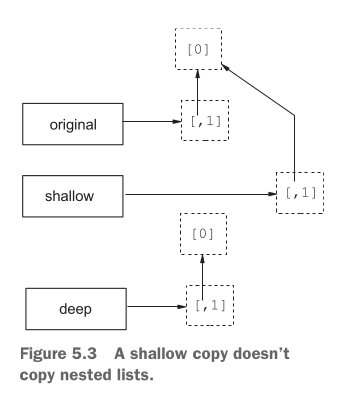

# 简介

<!--more-->

# 开发环境

## 安装

[Python](https://www.python.org/)有两个主流的发行版本：一个是官方的发行版本，另一个是[Anaconda](https://www.anaconda.com/)发行版本。后者在科学计算和数据科学中很受欢迎。任选一个发行版本安装即可。

### IDE

- [PyCharm](http://www.jetbrains.com/pycharm/)
- [VSCode](https://code.visualstudio.com/)
- [JupeterLab](https://jupyter.org/)

## 交互模式

安装完Python后，执行命令`python`将进入交互式环境。如果同时安装了版本2和3的Python，则命令`python`通常是指Python 3，另外还有命令`python2`和`python3`。

```bash
$ python
>>> print("Hello, world!")
```

退出交互式环境使用函数`quit()`或快捷键`Ctrl-D`。

另外，官网上也提供了一个在线的交互式环境：https://www.python.org/shell/

### 获取帮助

如果你需要有关 Python 中任何函数或语句的快速信息，那么你可以使用内置的 `help()` 函数。

```python
>>> help('return')
```

> 提示：按下 `q` 退出帮助。

### dir函数

`dir`函数不带参数时，可以列出当前作用域中的所有名字。

如果`dir`函数接收的一个对象，且该对象提供了`__dir__`方法，则返回该方法的返回值。否则，如果`dir`函数接收一个模块对象，则返回该模块的成员名列表；如果`dir`函数接收一个类对象，则返回该类及其祖先类的成员名列表；如果`dir`函数接收一个实例对象，则返回该实例对象的成员，及其所属类及祖先类的成员名列表 。

`dir`函数的返回值是字符串列表。

## 解释模式

### 直接运行脚本

```bash
$ python hello.py
```

还可以给运行的脚本传递参数：

```bash
$ python foo.py arg1 arg2
```

> 在脚本`foo.py`中，可以通过`sys.argv[N]`来获取命令行传递进来的参数。`sys.argv`的值 是`['foo.py', 'arg1', 'arg2']`。

### shebang方式运行脚本

首先，要在`hello.py`的第一行添加`#!/usr/bin/env python`。

然后，赋予脚本可执行的权限：`chmod a+x hello.py`。

```bash
$ ./hello.py
```

### 直接运行代码

```bash
$ python -c "import sys; print('hello'); print(sys.argv)" 123
hello
['-c', '123']
```

## 编译模式

## 调试模式

# 程序结构

## 第一个程序

hello.py：

```python
print("Hello world!")
```

## 源文件

Python程序的源代码保存在扩展名是`.py`的源文件中。

## 编码

Python 2默认采用US-ASCII字符集，Python 3默认采用UTF-8字符集。

如果源文件要使用其他编码，可使用特殊的注释来指定：

```python
# -*- coding: latin-1 -*-
```

Python的名称是区分大小写的。

### 转义序列

基本转义序列：`\'`、`\"`、`\\`、`\a`、`\b`、`\f`、`\n`、`\r`、`\t`、`\v`、`\行结束符`（忽略反斜杠与换行符）

数字转义序列：`\ooo`（八进制）、`\xhh`（十六进制）

Unicode转义序列：`\N{name}`（Unicode名称）、`\uhhhh`（16位）、`\Uhhhhhhhh`（32位）

数字转义序列在字节串中表示一个字节，在字符串中表示一个Unicode字符。

Unicode转义序列只能用于字符串字面量。

## 保留字

## 注释

| 注释  | 说明               |
| ----- | ------------------ |
| `# …` | 单行注释。可嵌套。 |

### 文档字符串

Python的字符串可以出现在`def`语句之后、模块和类的开头，这时它相当于注释，称为文档字符串（Docstring）。Python实际上是没有块注释的，但可通过长字符串的文档字符串来实现块注释的效果。

```python
def square(x):
  'Calculates the square of the number x.'
  return x * x
```

可以象下面这样访问文档字符串：

```python
>>> square.__doc__
'Calculates the square of the number x.'
```

另外，使用`help`函数获取帮助时，也包含了函数的文档字符串：

```python
>>> help(square)
Help on function square in module __main__:
  
square(x)
Calculates the square of the number x.
```

## 程序入口

## 编码规范

参见：[PEP8（Python Enhancement Proposal 8）](https://www.python.org/dev/peps/pep-0008/)

# 基本类型

## 数值类型

### 整数类型

```python
81    #十进制整数
0xAF  #十六进制整数
0o17  #八进制整数
0b1011 #二进制整数
```

Python的整数类型是：`int`。

整数没有大小限制，仅受限于可用内存的大小。

### 浮点类型

Python的浮点类型是：`float`。例如：3.0、-6e-4。

浮点数的精度由底层硬件决定，但通常相当于C中的`double`类型。

### 复数类型

Python本身提供了对复数的支持，复数类型是`complex`。

虚数都以`j`或`J`结尾。

Python没有专门的虚数类型，虚数可视为实部为0的复数。

```python
>>> x = (1 + 3j) * (9 + 4j)
>>> x
(-3 + 31j)
>>> x.real
-3.0
>>> x.imag
31.0
```

复数的实部和虚部总是以浮点数返回。

复数永远不会被自动转换为等价的实数或整数。因此，`1j * 1j`结果虽然是`-1+0j`（即`-1`），但结果仍然是复数类型。

### 数值处理库

除了内置函数外，Python还提供了许多处理数值的库：

- math库提供了整数、浮点数和布尔类型的高级处理函数。

- cmath库提供了复数的处理函数。

- 如果要执行密集型数值计算，则需要使用Python的扩展NumPy。

```python
>>> import cmath
>>> cmath.sqrt(-1)    #注意：math.sqrt()不能用于负数
1j
```

## 字符类型

Python没有专门用于表示字符的类型，一个字符就是只包含一个元素的字符串。

获取字符的码点：

```python
>>> ord('π')
960
```

根据码点得到相应字符：

```python
>>> chr(960)
'π'
```

## 布尔类型

布尔类型`bool`它有两个值：`True`和`False`。

在Python中，下列值将被视为假：

`False`、`None`、`0`、`0.0`、`0+0j`、`""`、`()`、`[]`、`{}`

除此之外的值都将被视为真。

布尔类型实际上也是一种数值类型：1（True）和0（False）。

```python
>>> True * 2
2
```

## 空类型

类`NoneType`表示空类型，它只有一个值`None`，表示什么都没有。

整个Python系统中，只有1个`None`实例，所有对`None`的引用都是指向同一个对象。

## 获取类型信息

```python
>>> type(3.14)
<class 'float'>
```

## 类型转换

`int()`：将参数转换为整数。采取**向零取整**策略（即截断小数部分）。

```python
>>> int('33')
33
>>> int(3.14)   #整数不能带有小数点
Traceback (innermost last):
…
>>> int('ff', 16)  #将101视为十六进制
255
```

`float()`：将参数转换为浮点数。

# 变量和常量

## 变量

Python的变量是指向对象的引用，多个变量可以指向同一个对象，当对象发生变化时，这些指向它的变量都会反映出这些变化来。

通常，Python变量不需要声明，首次给变量赋值，就相当于是声明。

Python变量实际上是没有类型的，而对象是有类型，变量可以被设为任何对象：

```python
>>> a = 1
>>> a = 'ok'
```

在函数内部给变量赋值时，该变量默认为局部变量，除非你明确地（通过`global`语句）告诉Python它是全局变量：

```python
>>> x = 1
>>> def change_global():
...   global x
...   x = x + 1
...
>>> change_global()
>>> x
2
```

同样道理，内嵌函数如果要修改外围函数中的变量，也需要使用`nonlocal`语句来标记它。否则，将当成是内嵌函数作用域中的变量：

```python
def makeinc():
  count = 1
  def inc():
    nonlocal count
    count += 1  #这个count是在makeinc中声明的count
  return inc
```

## 常量

# 字符串

字符串也是不可修改的序列（`bytearray`例外）。

字符串的类型是`str`。

## 字符串字面量

### 常规字符串

Python的常规字符串使用单引号或双引号括起来，不能跨越多行。

```python
"Let's go!"
'"Hello world!" she said'
```

### 长字符串

`''' … '''` 或 `""" … """`：Python中的长字符串。

长字符串可以跨越多行，并且可以包含单引号和双引号，而无需转义：

```python
''''Hello world!'
she said'''
或者
""""Hello world"
she said"""
```

> 其实常规字符串也可以跨多行，只要在行尾加上反斜杠，这样反斜杠和换行符将被转义，即被忽略：
>
> ```python
> "Hello, \
> world!"
> ```

### 原始字符串

原始字符串以`r`为前缀，它不处理转义序列：

```python
r'C:\nowhere\foo\bar'
r"C:\nowhere\foo\bar"

r'''C:\nowhere
\foo\bar'''

r"""C:\nowhere
\foo\bar"""
```

一个例外是，原始字符串中的引号需要转义，并且执行转义的反斜杠也将包含在最终的字符串中：

```python
>>> print(r'Let\'s go!')
Let\'s go!
```

另外，原始字符串的最后一个字符不能是反斜杠，除非对其进行转义。如果确实需要以反斜杠结尾，建议将反斜杠单独作为一个字符串：

```python
>>> print(r'C:\Program Files\foo\bar' '\\')
C:\Program Files\foo\bar\
```

## 构造字符串

类`str`和函数`repr`可以构造常规字符串：

```python
>>> repr("Hello, \nworld!")
"'Hello, \\nworld'"
>>> str("Hello, \nworld")
'Hello, \nworld'
>>> str(b"Hello world!", encoding="utf-8")
'Hello world!'
```

构造`bytes`：

```python
>>> bytes("Hello world!", encoding="utf-8")
b'Hello world!'
```

## 使用字符串

### 拼接

```python
>>> s1 = "Hello " + "world!"
>>> s1
'Hello world!'
```

另外，任何由空白字符分隔的字符串字面量，都会自动拼接成一个字符串：

```python
>>> s2 = "Hello "     'world!'
>>> s2
'Hello world!'
```

### 格式化

Python字符串格式设置方法主要有：格式字符串、模板字符串、format方法。

#### 格式字符串（将废弃）

```python
>>> format = 'Hello, %s. %s enough for ya?'
>>> values = ('world', 'Hot')
>>> format % values
'Hello, world. Hot enough for ya?'

#右操作数也可以是字典。用字典的好处：位置无关、可多次引用
>>> "%(pi).2f - %(pi).4f - %(e).2f" % {'e': 2.718, 'pi': 3.14159}
3.14 - 3.1416 - 2.72
```

格式字符串中的`%s`称为转换说明符，类似C语言的`printf`函数。

`%`运算符是字符串格式设置运算符，它的左操作数是格式字符串，右操作数是要设置格式的值。

#### 模板字符串

```python
>>> from string import Template
>>> tmpl = Template("Hello, $who! $what enough for ya?")
>>> tmpl.substitute(who="Mars", what="Dusty")
'Hello, Mars! Dusty enough for ya?'
```

#### format方法

`format`方法可以将字符串中的插值（Interpolation）替换成方法的参数。

插值用花括号括起来。如果要在最终结果中包含花括号字符，则使用两个花括号进行转义（即`{{`和`}}`）。

插值由三部分组成，其中每个部分都是可选的：

- 字段名：索引或标识符。

- 转换标志：以`!`开头，后跟`r`（表示repr）、`s`（表示str）或`a`（表示ascii）。例如：

  ```python
  >>> print("{pi!s} {pi!r} {pi!a}".format(pi='π'))
  π 'π' '\u03c0'
  ```

- 格式说明符：以`:`开头的表达式，用于详细设置最终的格式。

  格式说明符的一般形式：

  ```
  格式说明符：
  	填充字符? 对齐说明符? (符号说明符 | '0')? '#'? 宽度? ','? 精度? 类型说明符? 
  ```
  
  这里的0表示前导0，即用0填充数值的左侧。

  | 类型说明符 | 含义                                                         |
  | ---------- | ------------------------------------------------------------ |
  | b          | 将整数表示为二进制数。                                       |
  | c          | 将整数解读为Unicode码点。                                    |
  | d          | 将整数表示为十进制数。（整数默认格式说明符）                 |
  | o          | 将整数表示为八进制数。                                       |
  | x          | 将整数表示为十六进制数，并使用小写字母。                     |
  | X          | 与x相同，但使用大写字母。                                    |
  | e          | 使用科学表示法来表示小数（用`e`来表示指数）。                |
  | E          | 与e相同，但使用`E`来表示指数。                               |
  | f          | 将小数表示为定点数。                                         |
  | F          | 与f相同，但对于特殊值（`nan`和`inf`），使用大写表示。        |
  | g          | 自动在科学表示法和定点表示法之间做出选择，且默认至少有1位小数。（小数默认格式说明符） |
  | G          | 与g相同，但使用大写来表示指数和特殊值。                      |
  | n          | 与g相同，但插入随区域而异的数字分隔符。                      |
  | %          | 将数表示为百分比值。                                         |
  | s          | 保持字符串的格式不变。（字符串默认格式说明符）               |

按顺序配对：

```python
>>> '{}, {} and {}'.format('first', 'second', 'third')
'first, second and third'
```

按索引配对：

```python
>>> '{2}, {0} and {1}'.format('first', 'second', 'third')
'third, first and second'
```

按名字配对：

```python
>>> from math import pi
>>> '{name} is approximately {value:.2f}.'.format(value=pi, name='π')
'π is approximately 3.14'
```

f字符串：

```python
>>> from math import e
>>> "Euler's constant is roughly {e}.".format(e=e)
#上面变量名与字段名相同时，可以使用f字符串进行简写：
>>> f"Euler's constant is roughly {e}."
'Euler's constant is roughly 2.718281828459045.'
```

可以混合使用按顺序配对和按名字配对，也可以混合使用按索引配对和按名字配对，但不能混合使用按顺序配对和按索引配对：（虽然可以混合使用，但形如“x=y”的参数只能使用按名字配对；而形如“x”的参数只能使用按顺序或按索引配对）

```python
>>> "{foo} {} {bar} {}".format(1, 2, bar=4, foo=3)
'3 1 4 2'
>>> "{foo} {1} {bar} {0}".format(1, 2, bar=4, foo=3)
'3 2 4 1'
```

复合类型字段：

```python
>>> fullname = ['Alfred', 'Smoketoomuch']
>>> 'Mr {name[1]}'.format(name=fullname)
'Mr Smoketoomuch'
>>> import math
>>> tmpl = "The {mod.__name__} module defines the value {mod.pi} for π"
>>> tmpl.format(mod=math)
'The math module defines the value 3.141592653589793 for π'
```

类型：

```python
>>> '{:b}'.format(89)
'1011001'
```

宽度：

```python
>>> '{num:10}'.format(num=3)
'         3'
>>> '{name:10}'.format(name='Bob')
'Bob       '
```

缺省宽度时，则宽度默认为值的实际宽度。

当宽度大于值实际宽度的时，多出的部分使用设定的字符（默认是空格）填充；当宽度小于值实际宽度时，宽度自动取值实际宽度。

```python
>>> '{:3}'.format(12345)
'12345'
```

宽度包含了符号、小数点和小数位数等。

对齐方式：

```python
>>> print('{0:<10.2f}\n{0:^10.2f}\n{0:>10.2f}'.format(3.14159))
3.14      
   3.14   
      3.14
```

`<`：左对齐，`>`：右对齐，`^`：居中。

数值默认是右对齐，字符串默认是左对齐。

精度：

```python
>>> '{pi:.2f}'.format(pi=3.14159)
'3.14'
```

精度指定保留的小数位数，它是以`.`开头，后接表示小数位数的整数。

精度默认值是6。

实际上，非数值也可以指定精度：

```python
>>> '{:.5}'.format('Guido van Rossum')
'Guido'
```

填充：

```python
>>> '{:010.2f}'.format(3.1415926)   #前导0，只适用于数值。
'0000003.14'
>>> '{:0>10}'.format('abc')    #用0填充，适用于任何值（0后紧跟对齐说明符）
'0000000abc'
>>> '{:$<10.2f}'.format(3.1415926)  #用任意字符填充
'3.14$$$$$$'
>>> '{:$=10.2f}'.format(-3.1415926) #等号表示在符号与数值之间填充字符
'-$$$$$3.14'
>>> '{:=10.2f}'.format(-3.1415926)
'-     3.14'
```

缺省填充说明符，则默认以空格填充。

符号：

```python
>>> '{:+.2f}'.format(-3.1415926)
'-3.14'
>>> '{:+.2f}'.format(3.1415926)  #给正数加上符号
'+3.14'
>>> '{:-.2f}'.format(3.1415926)
'3.14'
>>> '{:-.2f}'.format(-3.1415926)
'-3.14'
>>> '{: .2f}'.format(3.1415926)  #将正号用空格代替
' 3.14'
>>> '{: .2f}'.format(-3.1415926)
'-3.14'
```

符号说明符可以是：`-`、`+`和空格。缺省符号说明符是`-`。

千位分隔符：

```python
>>> '{:,.5f}'.format(3.14**20)  #使用逗号作为千位分隔符
'8,681,463,855.99366'
```

如果要使用随区域而异的千位分隔符，应使用类型说明符`n`。

`#`：

对于二进制、八进制和十六进制数，将在它们前面加上进行前缀：

```python
>>> '{:b}'.format(42)
'101010'
>>> '{:#b}'.format(42)
'0b101010'
```

对于十进制数，以小数形式显示时，会保留小数点后的0：

```python
>>> '{:g}'.format(42)
'42'
>>> '{:#g}'.format(42)
'42.0000'
>>> '{:#f}'.format(42)
'42.000000'
>>> '{:#d}'.format(42)
'42'
```

插值可以内嵌插值：

```python
>>> '{1:{0}}'.format(3,4)
'  4'
```


#### format_map方法

`format_map`方法与`format`方法类似，除了`format_map`方法的参数是一个字典对象。

```python
>>> template = '''<html>
<head><title>{title}</title></head>
<body>
<h1>{title}</h1>
<p>{text}</p>
</body>'''
>>> data = {'title': 'My Home Page', 'text': 'Welcome to my home page!'}
>>> print(template.format_map(data))
<html>
<head><title>My Home Page</title></head>
<body>
<h1>My Home Page</h1>
<p>Welcome to my home page!</p>
</body>
```

### 查找

方法`find`在字符串中查找子串，如果找到，就返回首次找到的子串的第一个字符的索引，否则返回-1：

```python
>>> subject = '$$$ Get rich now!!! $$$'
>>> subject.find('$$$')
0
>>> subject.find('$$$', 1)  #指定搜索的起点
20
>>> subject.find('!!!', 0, 16)  #同时指定搜索的起点（包含）和终点（不包含）
-1
```

方法`rfind`的用法与`find`几乎完全相同，但它从末尾开始搜索，返回的是子串在字符串中最后一次出现时的首字符位置：

```python
>>> 'Mississippi'.rfind('ss')
5
```

方法`index`、`rindex`与`find`、`rfind`不同之处是，它们在找不到子串时，不是返回 -1，而是引发`ValueError`异常。

检查前缀和后缀：

```python
>>> x = 'Mississippi'
>>> x.startswith('Miss')
True
>>> x.endswith('p')
False
>>> x.endswith(('i', 'u')) #x只要以i或u字符串为后缀就返回True。这里参数必须是元组，括号不能省略
True
```


### 出现次数

```python
>>> 'ssssss'.count('ss')
3
```


### 连结

方法`join`用当前字符串将作为参数的**字符串序列**中的每个元素连结起来，形成一个新的字符串：

```python
>>> dirs = '', 'usr', 'bin', 'env'
>>> '/'.join(dirs)
'/usr/bin/env'
>>> seq = ['1', '2', '3', '4', '5']
>>> '+'.join(seq)
'1+2+3+4+5'
```

### 拆分

方法`split`将当前字符串，根据参数指定的分隔符，拆分成字符串列表：

```python
>>> '/usr/bin/env'.split('/')
['', 'usr', 'bin', 'env']
>>> 'Using the default'.split()
['Using', 'the', 'default']
```

如果没有指定分隔符，则默认为一个或多个连续的空白字符（空格、制表符、换行符等）。

可以为`split`方法指定第二个可选参数，用于指定要拆分的次数：

```python
>>> 'a b c d'.split(' ', 2)
['a', 'b', 'c d']
```

如果既要用到第二个参数，又想要按照默认的空白字符进行拆分，请将第一个参数设为`None`。

### 替换

方法`replace`将指定子串全部替换为另一个字符串，并返回替换后的结果（新字符串）：

```python
>>> 'This is a test'.replace('is', 'eez')
'Theez eez a test'
```

### 转换

方法`translate`通过一个转换表（由`maketrans`方法生成），将字符串中的指定字符转换为另一些字符，并返回转换后的结果（新字符串）：

```python
>>> table = str.maketrans('cs', 'kz')  #字符c将转换为字符k，s将转换为z
>>> table
{115: 122, 99: 107}
>>> 'this is an incredible test'.translate(table)
'thiz iz an inkredible tezt'
```

调用方法`maketrans`时，还可提供可选的第三个参数，指定要将哪些字符删除：

```python
>>> table = str.maketrans('cs', 'kz', ' ')
>>> 'this is an incredible test'.translate(table)
'thizizaninkredibletezt'
```

### 裁剪

方法`strip`将字符串开头和末尾的指定字符（默认是空白）删除，并返回删除后的结果（新字符串）：

```python
>>> '    internal whitespace is kept  '.strip()
'internal whitespace is kept'
>>> '*** SPAM * for * everyone!!! ***'.strip(' *!') #删除字符串开头和末尾的空格、*、!字符
'SPAM * for * everyone'
```

类似的方法还有：`lstrip`（裁剪开头字符）、`rstrip`（裁剪末尾字符）。

### 利用列表修改字符串

如果希望像列表那样来修改字符串，可以先使用`list`函数将字符串转换为列表，处理完成后再使用`join`方法将字符列表结果转换回字符串。

### 将对象转换为字符串

`repr`函数用于返回对象的字符串表示。

```python
>>> repr([1, 2, 3])
'[1, 2, 3]'
>>> repr(len)
'<built-in function len>'
```

由`repr`返回的Python对象的字符串形式，可以重建原来的Python对象。而`str`返回的字符串旨在生成可打印的字符串形式，目的是供人类阅读，而不是供Python代码读取。

### 重复

```python
>>> x = "ab"
>>> x * 3
'ababab'
>>> 2 * x
'abab'
```

# 字节串

## bytes

`bytes`是一个不可变的字节串：

```python
b'Hello world!'
b"Hello world!"

b'''Hello
world!'''

b"""Hello
world!"""
```

将字符串编码为`bytes`：

```python
>>> "Hello, world!".encode()     #默认使用UTF-8编码
b'Hello, world!'
>>> "Hello, world!".encode("UTF-32")
b'xff\xfe\x00\x00H'\x00\x00\x00e\x00\x00\x00l\x00\x00\x00l\x00\x00\x00o\x00\x00\x00,\x00\x00\x00 \x00\x00\x00w\x00\x00\x00o\x00\x00\x00r\x00\x00\x00l\x00\x00\x00d\x00\x00\x00!\x00\x00\x00'
```

将`bytes`转换为字符串：

```python
>>> x = b'\xc3\xa1'
>>> x.decode()
'á'
```

注意：`bytes`不能与字符串对象拼接。

## bytearray

`bytearray`是`bytes`的可变版本。

```python
>>> x = bytearray(b"Hello!")
>>> x[1] = ord(b"u")    #必须使用要插入的字符的序数值（0~255）
>>> x
bytearray(b'Hullo!')
```


# 枚举类型

# 表达式

## 算术表达式

乘方的优先级高于正负号：

```python
-3 ** 2  #-9
(-3) ** 2  #9
```

### 除法

浮点除`/`：

```python
1 / 2  #0.5
```

整除`//`：

```python
10 // 3  #3
10 // -3  #-4
-10 // 3  #-4
-10 // -3 #3
5.0 // 2.4  #2.0
```

Python中整除采取**向下取整**的策略。

> Python 2中，浮点除的效果与整除是一样的，要获取Python 3中的浮点除功能，只要在程序开头添加如下语句：
>
> ```python
> from __future__ import division
> ```

`math.ceil(数值)`：以浮点数的方式返回向上取整的结果。

`math.floor(数值)`：以浮点数的方式返回向下取整的结果。

`round(数值[, 保留小数位数])`：四舍五入为指定的精度，正好为5时舍入到偶数。（实际上是对二进制数进行舍入）

```python
>>> import math
>>> math.floor(32.9)
32
>>> math.floor(-32.3)
-33
>>> math.ceil(32.3)
33
>>> math.ceil(-32.9)
-32
>>> round(3.14)
3
>>> round(3.14159, 2)
3.14
>>> round(3.15, 1)
3.1
>>> round(3.225, 2)
3.23
>>> round(3.5)
4
>>> round(4.5)
4
```


### 求模

```python
10 % 3  #1
10 % -3 #-2
-10 % 3 #2
-10 % -3 #-1
```

`x % y`等价于`x - ((x // y) * y)`。

## 关系表达式

| 表达式     | 描述                 |
| ---------- | -------------------- |
| x == y     | x等于y（值相等）     |
| x < y      | x小于y               |
| x > y      | x大于y               |
| x <= y     | x小于或等于y         |
| x >= y     | x大于或等于y         |
| x != y     | x不等于y（值不相等） |
| x is y     | x和y是同一个对象     |
| x is not y | x和y是不同的对象     |
| x in y     | x是集合y的成员       |
| x not in y | x不是集合y的成员     |

### 字符串的比较

字符串是根据字符的码点顺序进行比较的：

```python
>>> 'alpha' < 'beta'
True
>>> 'user' > 'use'
True
```

### 序列的比较

序列是根据每个元素的值来进行比较的：

```python
>>> [1, 2] > [2, 1]
False
>>> [2, [1, 4]] < [2, [1, 5]]
True
```

### 链式比较

```python
1 <= number <= 10
等价于：
1 <= number and number <= 10
```

## 逻辑表达式

`and`、`or`和`not`。

### “短路”行为

逻辑运算符`and`和`or`都有“短路”行为：

```python
>>> name = input('Please enter your name: ') or '<unknown>'
Please enter your name: 
>>> name
'<unknown>'
```

## 条件表达式

```python
status = 'friend' if name.endswith('Gumby') else 'stranger'
```

# 语句

## 赋值语句

虽然Python的变量不需要声明，但它没有默认值，在使用之前必须先给它赋值。

```python
x = 3
```

### 序列解包

序列解包（或可迭代对象解包）是将一个序列（或任何可迭代对象）解包，并将得到的值存储到一系列变量中。

```python
>>> x, y, z = 1, 2, 3
>>> x
1
>>> x, y = y, x  #交换值
>>> print(x, y, z)
2 1 3

>>> [a, b] = [1, 2]
>>> a
1
>>> b
2
```

要解包的序列包含的元素个数必须与等号左边列出的变量个数相同，否则会报错。

可以使用`*`运算符来把多余的元素接收为**列表**。如果没有多余元素，则带星号的元素会收到空列表：

```python
>>> a, b, *rest = [1, 2, 3, 4]
>>> rest
[3, 4]
```

还可将带星号的变量放在其他位置：

```python
>>> names = 'Albus Percival Wulfric Brian Dumbledore'
>>> first, *middle, last = names.split()
>>> middle
['Percival', 'Wulfric', 'Brian']
```

这种赋值语句的右边可以是任何类型的序列，但带星号的变量总是一个列表，即使只包含一个值：

```python
>>> a, *b, c = 'abc'
>>> a, b, c
('a', ['b'], 'c')

>>> a, b, *rest = (1, 2, 3, 4)
>>> rest
[3, 4]  #总是接收为列表

>>> a, b, *rest = (1, 2)
>>> rest
[]
```

> 这种收集方式也可用于函数参数列表中。

### 链式赋值

```python
x = y = somefunction()
#等价于：
y = somefunction()
x = y
#不等价于：
x = somefunction()
y = somefunction()
```

### 复合赋值（增强赋值）

`+=`、`-=`、`*=`、`/=`、`//=`、`%=`、`**=`、`<<=`、`>>=`、`&=`、`|=`、`^=`。

## 代码块

代码块是一组语句。

Python的代码块是通过缩进（使用空格或制表符）的代码来创建的。使用换行符分隔语句。

> 在缩进时，尽量避免将空格和制表符混合使用。Python会将制表符映射为8个空格，混合使用可能会引起缩进不一致。

在同一个代码块中，缩进多少没有限制，但各行代码的缩进量必须相同（即同一缩进级别）。

如果要把多条语句放在同一行，则语句之间要用分号分隔：

```python
x = 1; y = 0; z = 0
```

只包含单行语句的代码块，可以紧挨着复合语句中的冒号，放在同一行中：

```python
if x > 0: y = 1; z = 10
else: y = -1
```

## 条件语句

条件语句的一般形式：

```
if 条件: 语句  #当语句只有一条时，可以放在同一行

if 条件:
	分支
	
if 条件:
	分支1
else:
	分支2
	
if 条件1:
	分支1
elif 条件2
	分支2
…
else:
	分支
```

> Python没有提供case或switch语句，大多数情况它用串联if语句应对。极少数情况可以使用函数字典来解决，参见“将函数赋给变量”一节的例子。

## 循环语句

### while循环

while循环的一般形式：

```
while 条件:
	体1
else:
	体2
```

当条件为`True`时，重复执行体1；当条件为`False`时，执行体2，然后停止执行。

else部分是可选的。

当体1中遇到`break`语句时，退出整个while循环（包括体2）。

### for-in循环

for-in循环的一般形式：

```python
for 变量 in 可迭代对象:
	体1
else:
   体2
```

else部分是可选的。

例如：

```python
words = ['this', 'is', 'an', 'ex', 'parrot']
for word in words:
  print(word)
```

当体1中遇到`break`语句时，退出整个for循环（包括体2）。

```python
from math import sqrt
for n in range(99, 81, -1):
  root = sqrt(n)
  if root == int(root):
    print(n)
    break
else:
  print("Didn't find it!')
```

#### 范围

Python提供了一个创建范围的内置函数`range`：

```python
>>> r = range(0, 10)
>>> r
range(0, 10)
>>> list(r)
[0, 1, 2, 3, 4, 5, 6, 7, 8, 9]
```

范围类似切片，包含起始位置（这里是0），但不包含结束位置（这里是10）。起始位置可以省略，默认为0：

```python
>>> range(10)
range(0, 10)
```

`range`函数还可以用第三个参数来指定步长，默认步长是1。（参见前面for循环的例子）

#### 迭代字典

```python
>>> d = {'x': 1, 'y': 2, 'z': 3}
>>> for key in d:
...   print(key, 'corresponds to', d[key])    #这里要注意缩进
... 
x corresponds to 1
y corresponds to 2
z corresponds to 3

>>> for key, value in d.items():
...   print(key, 'corresponds to', value)
... 
x corresponds to 1
y corresponds to 2
z corresponds to 3
```

#### 并行迭代

内置函数`zip`将两个或以上的可迭代对象“缝合”起来，返回一个由元组组成的可迭代对象，直至长度最短的那个可迭代对象读取完毕。这样，就可以在for-in循环同时迭代两个序列：（实际上是元组拆包）

```python
>>> names = ['anne', 'beth', 'george', 'damon']
>>> ages = [12, 45, 32, 102]
>>> list(zip(names, ages))
[('anne', 12), ('beth', 45), ('george', 32), ('damon', 102)]
>>> for name, age in zip(names, ages):
...   print(name, 'is', age, 'years old'
```

#### 迭代时获取索引

```python
names = ['anne', 'beth', 'george', 'damon']
for index, name in enumerate(names):
  if 'beth' in name:
    name[index] = 'tom'
```

函数`enumerate`返回的是`(索引, 数据项)`元组。

### 迭代器

可迭代对象是实现了`__iter__`方法的对象，它可以使用for-in循环来迭代。

`__iter__`方法返回一个迭代器，迭代器是一个包含`__next__`方法的对象。当调用`__next__`方法时，迭代器应返回其下一个值。如果迭代器没有可供返回的值，应引发`StopIteration`异常。

```python
class Fibs:
  def __init__(self):
    self.a = 0
    self.b = 1
  def __next__(self):
    self.a, self.b = self.b, self.a + self.b
    return self.a
  def __iter__(self):
    return self
------------------------------------------------------
>>> fibs = Fibs()
>>> for f in fibs:
...   if f > 1000:
...     print(f)
...     break
...
1597
```

另外，通过对可迭代对象调用内置函数`iter`，可获得一个迭代器。内置函数`next(iter)`与`iter.__next__()`等效。

```python
>>> it = iter([1, 2, 3])
>>> next(it)
1
>>> next(it)
2
```

迭代器可以通过构造函数`list`转化为序列：`list(it)`。

## 跳转语句

### break语句

```python
while True:
  word = input('Please enter a word: ')
  if not word: break
  print('The word was ', word)
```

### continue语句

## pass语句

pass语句什么都不做，通常用作占位符。

Python中没有空语句，使用pass语句代替。

## del语句

del语句用于删除对象的引用或变量。在Python中，对象只能由垃圾回收器自动回收。

如果在删除变量之后，设法访问该变量的内容，就会引发错误（`NameError`）。

## 将语句拆成多行

可以显式地用反斜杠将一行代码拆成多行：

```python
x = 100 + 200 \
+ 300  #可以任意缩进
```

在`()`、`[]`或`{}`之内，可以隐式地随意拆分成多行：

```python
v = [100, 200,
300]

y = (100 + 200
+ 300)

max(1000, 300,
800)
```

在字符串内部使用`\`拆分时，缩进的制表符或空格都将成为字符串的部分。

```python
>>> s1 = 'this string broken by a backslash will end up \
			with the indentation tabs in it'
>>> s1
'this string broken by a backslash will end up \t\t\twith the indentation tabs in it'

>>> s2 = 'this can be easily avoided by splitting the ' \
			'string in this way'
>>> s2
'this can be easily avoided by splitting the string in this way'
```


# 子程序

## 函数

### 内置函数

Python提供了许多内置函数，我们在代码中可以直接使用。

### 定义函数

```python
def fibs(num):
  result = [0, 1]
  for i in range(num - 2):
    result.append(result[-2] + result[-1])
  return result
```

### 返回值

在Python中，即使没有显式使用`return`语句返回的函数也有返回值——`None`。因此，Python的函数均有返回值。

### 参数

Python函数的实参传递的是对象的引用。

#### 位置参数和关键字参数

```python
>>> def hello(greeting, name):
...   print('{}, {}!'.format(greeting, name))
... 
>>> hello(name='world', greeting='Hello')  #关键字参数，而且参数调用顺序可任意
Hello, world!
>>> hello('Hello', 'world')  #位置参数
Hello, world!
>>> hello('Hello', name='Jo')  #混合使用：先按位置传递实参，然后才是关键字实参
Hello, Jo!
>>> hello('Jo', greeting='Hello')
Traceback (most recent call last):
  File "<stdin>", line 1, in <module>
TypeError: hello() got multiple values for argument 'greeting'

```

#### 参数默认值

```python
>>> def hello(greeting='Hello', name='world'):
...   print('{}, {}!'.format(greeting, name))
... 
>>> hello()
Hello, world!
>>> hello('Hi')
Hi, world!
>>> hello('Hi', 'Jo')
Hi, Jo!
>>> hello(name='Jo')
Hello, Jo!
```

带默认值的形参必须位于形参列表的末尾。

#### 可变数量参数

可变数量参数可以接收任意多个（包括0个）参数，以星号开头的形参是可变数量参数。

##### 可变数量的位置参数

当函数的最后一个形参名称带有一个`*`前缀时，在一个函数调用中所有多出来的非关键字实参将会合并为一个**元组**赋给该形参。

> 注意：在“序列解包”中，赋值时带星号的变量也会收集多余的值，只不过是列表而不是元组。

```python
>>> def print_params(title, *params):
...   print(title)
...   print(params)
...
>>> print_params('Params:', 1, 2, 3)
Params:
(1, 2, 3)
>>> print_params('Nothing:')
Nothing:
()
```

当可变数量位置参数不放在最末尾时，在它之后的参数只能接收关键字参数。

```python
>>> def in_the_middle(x, *y, z):
...   print(x, y, z)
... 
>>> in_the_middle(1, 2, 3, 4, 5, 7)
Traceback (most recent call last):
  File "<stdin>", line 1, in <module>
TypeError: in_the_middle() missing 1 required keyword-only argument: 'z'
>>> in_the_middle(1, 2, 3, 4, 5, z=7)
1 (2, 3, 4, 5) 7
```

##### 可变数量的关键字参数

如果函数的最后一个形参以两个`*`为前缀，则所有多余的关键字实参将会被收入一个字典对象中。字典的键为多余实参的关键字，字典的值为实参本身。

```python
>>> print_params('Params:', foo=4)
Traceback (most recent call last):
  File "<stdin>", line 1, in <module>
TypeError: print_params() got an unexpected keyword argument 'foo'
  
>>> def print_params2(**params):
...   print(params)
...
>>> print_params2(x=1, y=2, z=3)
{'z': 3, 'x': 1, 'y': 2}
```

#### 分配参数

分配参数是通过在**调用函数**（而不是定义函数）时使用运算符`*`和`**`实现的。

```python
>>> def add(x, y):
...   return x + y
...
>>> params = (1, 2)
>>> add(*params)

>>> def hello(greeting='Hello', name='world'):
...   print('{}, {}!'.format(greeting, name))
... 
>>> params2 = {'name': 'Sir Robin', 'greeting': 'Well met'}
>>> hello(**params2)
Well met, Sir Robin

>>> def foo(x, y, z, m=0, n=0):
...   print(x, y, z, m, n)
...
>>> def call_foo(*args, **kwds):
...   print('Calling foo!')
...   foo(*args, **kwds)
... 
```

分配参数作用于参数列表的一部分，并且分配参数只能位于参数列表的末尾。

可以将分配参数传递给可变数量参数，效果与将元组或字典传递给普通参数一样。

#### 多种参数传递方式的混用

先按位置传递实参，接着是关键字实参，然后是带单个`*`的数量不定的位置传递实参，最后是带`**`的数量不定的关键字传递实参。

### 函数嵌套

Python函数可以嵌套：

```python
>>> def multiplier(factor):
...  def multiplyByFactor(number):
...    return number * factor
...  return multiplyByFactor
...
>>> double = multiplier(2)
>>> double(5)
10
>>> multiplier(5)(4)
20
```

像`multiplyByFactor`这样存储其所在作用域的函数称为**闭包**。

### 递归

二分查找：

```python
def search(seq, number, lower, upper):
  if lower == upper:
    assert number == seq[upper]
    return upper
  else:
    middle = (lower + upper) // 2
    if number > seq[middle]:
      return search(seq, number, middle + 1, upper)
    else:
      return search(seq, number, lower, middle)
```

### 将函数赋给变量

```python
>>> def c_to_kelvin(degrees_c):
...     return 273.15 + degrees_c
...
>>> abs_temperature = c_to_kelvin
>>> abs_temperature(0)
273.15
```

引用函数的变量，用起来与函数完全相同。

函数可以被放入列表、元组或字典中：

```python
>>> def f_to_kelvin(degrees_f):
...     return 273.15 + (degrees_f - 32) * 5 / 9
...
>>> t = {'FtoK': f_to_kelvin, 'CtoK': c_to_kelvin}
>>> t['FtoK'](32)
273.15
>>> t['CtoK'](0)
273.15
```

这种用法经常用来代替C语言中的switch结构。

### lambda表达式

lambda表达式是匿名的小型函数，可以快速地在行内完成定义。

```python
>>> t = {'FtoK': lambda deg_f: 273.15 + (deg_f - 32) * 5 / 9,
...      'CtoK': lambda deg_c: 273.15 + deg_c}
>>> t['FtoK'](32)
273.15
```

lambda表达式没有`return`语句，因为表达式的值将自动返回。

## 生成器

生成器是包含`yield`语句的函数，但它被调用时**不会执行函数体内的代码**，而是返回一个迭代器。每次请求值时（例如调用`next`函数），都将执行生成器的代码，直到遇到`yield`或`return`。`yield`在生成一个值（即`yield`的参数）后，生成器都将被挂起，下次再调用时，从上次挂起处开始继续执行。而`return`语句停止执行生成器（即不再生成值）。

由于生成器返回迭代器，因此可以像使用其他迭代器一样使用它。

```python
def flatten(nested):
  try:
    #不迭代类似于字符串的对象，因为字符串的第一个元素是一个长度为1的字符串，而长度为1的字符串的第一个元素仍是字符串。这会导致无穷递归。
    try: nested + ''
    except TypeError: pass  #nested不是字符串
    else: raise TypeError   #nested是字符串
    for sublist in nested:
      for element in flatten(sublist):
        yield element
  except TypeError:
    yield nested  #原样生成字符串
-----------------------------------------------
>>> nested = ['foo', ['bar', ['baz']]]
>>> for s in flatten(nested):
...   print(s)
...
foo
bar
baz
>>> list(flatten(nested))
['foo', 'bar', 'baz']
```

`yield`生成的值将通过`next`函数或它的迭代器的`__next__`方法来开始执行生成器代码，并在遇到`yield`时返回该生成的值。而`yield`表达式本身也有值，默认是`None`，可通过迭代器的`send`方法显式设置它的值。因此，只有当生成器挂起后（即`yield`生成一个值后），才能使用`send`方法（除非使用`send(None)`）。`send`方法在设置完成上一个`yield`表达式的值后，从挂起处继续执行生成器代码，直到遇到下一个`yield`，才返回该`yield`生成的值，并挂起生成器。

```python
>>> def repeater(value):
...   while True:
...     new = (yield value)
...     print('new is ', new)
...     if new is not None: value = new
... 
>>> r = repeater(42)
>>> next(r)
42
>>> next(r)
new is None
42
>>> r.send('Hello')
new is Hello
'Hello'
```

`send`方法通常用作外部与生成器之间的通信渠道。

生成器还有另外两个方法：

- `throw`方法：该方法被调用时，将在生成器上次挂起处引发异常。之后会继续执行生成器对象中后面的语句，直至遇到下一个`yield`。如果在生成器对象方法执行完毕后，依然没有遇到`yield`，抛出`StopIteration`异常。

- `close`方法：用于停止生成器。它将在生成器上次挂起处引发`GeneratorExit`异常。
  如果要在生成器中提供一些清理代码，可将`yield`放在try-finally语句中。
  对生成器调用`close`后，再试图从它那里获取值将导致`RuntimeError`异常。

  如果愿意，也可捕获`GeneratorExit`异常，但随后必须：

  - 重新抛出它（可能在清理后）；
  - 或者引发其他异常；
  - 或者直接返回。

```python
>>> def echo(value=None):
...     print("Execution starts when 'next()' is called for the first time.")
...     try:
...         while True:
...             try:
...                 value = (yield value)
...             except Exception as e:
...                 value = e
...     finally:
...         print("Don't forget to clean up when 'close()' is called.")
...
>>> generator = echo(1)
>>> print(next(generator))
Execution starts when 'next()' is called for the first time.
1
>>> print(next(generator))
None
>>> print(generator.send(2))
2
>>> generator.throw(TypeError, "spam")
TypeError('spam',)
>>> generator.close()
Don't forget to clean up when 'close()' is called.
```

### yield from

从Python 3.3开始，新增了`yield from`关键字。`yield from`的执行方式与`yield`相同，但是会将当前生成器委托给子生成器。

```python
>>> def subgen(x):
...     for i in range(x)
...         yield i
...
>>> def gen(y):
...     yield from subgen(y)
...
>>> for q in gen(6):
...     print(q)
...
0
1
2
3
4
5
```

`yield from`使得将生成器函数串联在一起成为可能。

### 生成器推导

生成器推导与列表推导类似，但不是立即创建一个列表，而是返回一个生成器。并且，生成器推导使用圆括号，而不是花括号。

```python
>>> g = ((i + 2) ** 2 for i in range(2, 27))
>>> next(g)
16

>>> sum(i ** 2 for i in range(10))
285
```

使用生成器推导的优点是：不会在内存中生成整个列表，因此可生成任意大小的值序列，内存开销也很小。

## 装饰器

装饰器可将一个函数封装到另一个函数中。

```python
>>> def mydecorate(func):
...     print('in decorate function, decorating', func.__name__)
...     def wrapper_func(*args):
...         print('Executing', func.__name__)
...         return func(*args)
...     return wrapper_func
...
>>> @mydecorate
... def myfunction(parameter):
...     print(parameter)
...
in decorate function, decorating myfunction
>>> myfunction('hello')
Executing myfunction
hello
```

等价于：

```python
>>> def mydecorate(func):
...     print('in decorate function, decorating', func.__name__)
...     def wrapper_func(*args):
...         print('Executing', func.__name__)
...         return func(*args)
...     return wrapper_func
...
>>> def myfunction(parameter):
...     print(parameter)
...
>>> myfunction = mydecorate(myfunction)
in decorate function, decorating myfunction
>>> myfunction('hello')
Executing myfunction
hello
```


# 面向对象编程

类和对象是面向对象编程的两个主要概念。一个类创造了一种新的类型 ，而对象就是类的实例。

属于对象或者类的变量被称作字段，属于对象或者类的函数被称作方法。

字段有两种类型：他们可以属于每一个类的实例（也就是对象），也可以属于类本身。他们被分别称作实例变量和类的变量。

> Python 3开始不区分类和类型。

## 定义类

```python
>>> class Person:
...   def set_name(self, name):
...     self.name = name
...   def get_name(self):
...     return self.name
...   def greet(self):
...     print("Hello, world! I'm {}.".format(self.name))
... 
>>> foo = Person()  #类实例化
>>> foo.set_name('Joy')
>>> foo.greet()
Hello, world! Im Joy.
>>> foo.name
'Joy'
```

> Python 3之前创建的是旧式类，要创建新式类，要在脚本或模块开头放置赋值语句`__metaclass__ = type`，或者显式地直接或间接地继承内置类`object`。

Python的类体实际上是一个代码块，在类体中可以包含各种语句。定义类其实就是在执行这个代码块：

```python
>>> class C:
...   print('Class C being defined ...')
...
Class C being defined ...
```

Python中一切皆对象，类定义完成后，会创建一个**类对象**，并在当前作用域中定义一个怀类同名的名字指向该类对象。

相应地，类实例化而得到的对象称为**实例对象**。

Python作为动态语言，类或实例的成员绑定可发生在两个地方：

- 类定义时；
- 运行时任意阶段。

类对象和实例对象都可以在运行时任意添加或删除成员。例如：`objname.attr = value`，若属性`attr`已经存在，则给它赋新值`value`；否则 ，为该对象添加新的属性。

## 成员

### 字段

字段分为类字段和实例字段：

```python
>>> class MemberCounter:
...   members = 0  #类字段
... 
>>> m1 = MemberCounter()
>>> m1.members  #引用类字段
0
>>> MemberCounter.members  #引用类字段
0
>>> m2 = MemberCounter()
>>> m2.members  #引用类字段
0

>>> MemberCounter.members = 1
>>> m1.members
1
>>> m2.members
1

>>> m2.members = 2  #m2.members的重新赋值，将创建了一个实例字段members
>>> m1.members  #引用类字段
1
>>> MemberCounter.members
1
>>> m2.members  #引用自己的实例字段
2

>>> MemberCounter.members = 3
>>> m1.members
3
>>> m2.members
2
```

### 方法

方法与函数相比只有一个区别——方法必须至少有一个形式参数，而且方法的第一个参数总是接收对象本身。当你调用这个方法的时候，不需要为第一个形参赋予任何一个值，Python 会自动将它置为该方法所属的实例本身。通常约定第一个形参的名字为 `self` ，尽管你可以给这个参数起任何一个名字，但是这里 *强烈推荐* 使用 `self`。

假设你有一个类叫做 `MyClass` 以及这个类的一个对象叫做 `myobject` 。当你需要这样调用这个对象的方法的时候：`myobject.method(arg1, arg2)` ，这个语句会被 Python 自动的转换成 `MyClass.method(myobject, arg1, arg2)` 这样的形式。但后者的多态性更低。

可以将字段或方法重新关联到一个普通函数，这时就没有特殊的`self`参数了，也就不可能访问当前对象了：

```python
>>> class Bird:
...   song = 'Squaawk!'
...   def sing(self):
...     print(self.song)
... 
>>> def function():
...   print("我没办法访问当前对象")
... 
>>> bird = Bird()
>>> bird.sing()
Squaawk!
>>> birdsong = bird.sing
>>> birdsong()
Squaawk!
>>> bird.sing = function
>>> bird.sing()
我没办法访问当前对
```

#### `__str__`方法

`__str__`方法类似于Java中的`toString`方法。当用`print`函数打印对象时，实际上打印的是`__str__`方法的返回值。

### 构造函数

Python的构造函数是`__init__`，它将在创建对象自动被调用。

```python
>>> class FooBar:
...   def __init__(self):
...     self.somevar = 42
...
>>> f = FooBar()
>>> f.somevar
42
```

构造函数还可以带除了`self`外的其他参数：

```python
>>> class FooBar:
...   def __init__(self, value = 42):
...     self.somevar = value
...
>>> f = FooBar('This is a constructor argument')
>>> f.somevar
'This is a constructor argument'
```

### 析构函数

Python的析构函数是`__del__`，它将在对象被销毁（作为垃圾被回收）前被自动调用。

### property

`property`类允许为字段提供获取方法（getter）和设置方法（setter），而且使用起来仍像个字段。

```python
class Rectangle:
  def __init__(self):
    self.width = 0
    self.height = 0
  def set_size(self, size):
    self.width, self.height = size
  def get_size(self):
    return self.width, self.height
  size = property(get_size, set_size)
-------------------------------------------
>>> r = Rectangle()
>>> r.width = 10
>>> r.height = 5
>>> r.size
(10, 5)
>>> r.size = 150, 100
>>> r.width
150
```

`property`构造函数可带0到4个参数。

- 不带参数则这个property既不可读也不可写。
- 带一个参数则这个property只可读。
- 第一个参数是getter，第二个参数是setter，第三个参数是用于删除property的方法，第四个参数指定一个文档字符串。

在旧式类中，可通过下面四个魔法方法中的后三个方法来实现property功能：

- `__getattribute__(self, name)`：在property被访问时自动调用（只适用于新式类）；
- `__getattr__(self, name)`：在property被访问而对象没有这样的property时自动调用；
- `__setattr__(self, name, value)`：试图给property赋值时自动调用；
- `__delattr__(self, name)`：试图删除property时自动调用。

### 静态方法和类方法

静态方法没有参数`self`，可直接通过类来调用。类方法有`cls`参数，它指向类对象本身，类方法可通过类或实例来调用。

有两种方式来定义静态方法和类方法：

1. 通过类`staticmethod`和`classmethod`来包装；

   ```python
   class MyClass:
     def smeth():
       print('This is a static method')
     smeth = staticmethod(smeth)
     def cmeth(cls):
       print('This is a class method of ', cls)
     cmeth = classmethod(cmeth)
   ```

2. 通过装饰器`@staticmethod`和`@classmethod`为标记。

   ```python
   class MyClass:
     @staticmethod
     def smeth():
       print('This is a static method')
     @classmethod
     def cmeth(cls):
       print('This is a class method of ', cls)
   ```

定义这些方法后，无需实例化类就可以使用它们：

```python
>>> MyClass.smeth()
This is a static method
>>> MyClass.cmeth()
This is a class method of <class '__main__.MyClass'>
```

## 封装

Python没有为可访问性提供直接支持，然而，通过玩点小花招，可以获得类似于私有成员的效果。

要让方法和字段成为私有的，只需要让其名称以两个下划线开头即可。

```python
class Secretive:
  def __inaccessible(self):
    print("Bet you can't see me ...")
  def accessible(self):
    print("The secret message is:")
    self.__inaccessible()
```

现在从外部不能访问`__inaccessible`方法，但在类中依然可以使用它，这样的方法类似于其他语言中的私有方法。之所以有效是因为，Python对所有以两个下划线开头的名称都进行转换，即在开头加上一个下划线和类名作为前缀：

```python
>>> s = Secretive()
>>> s.__inaccessible()
Traceback (most recent call last):
  File "<stdin>", line 1, in <module>
AttributeError: Secretive instance has no attribute '__inaccessible'
>>> Secretive._Secretive__inaccessible()
Bet you can't see me ...
```

只知道这种幕后处理手法，就能从类外部访问私有方法，然而不应该这样做。

另外，`from ... import *`语句不会导入以一个下划线开头的名称，而且Python也不会对以一个下划线开头的名称进行转换。也就是说，以一个下划线开头的名称可以在类外部访问，但不能通过`from ... import *`语句导入到其他模块。从某种程序上说，以一个或两个下划线开头相当于两种不同的私有程度。

## 继承

Python 3中所有类都隐式地继承`object`类。

### 多重继承

```python
class Calculator:
  def calculate(self, expression):
    self.value = eval(expression)
    
class Talker:
  def talk(self):
    print('Hi, my value is ', self.value)
    
class TalkingCalculator(Calculator, Talker):
  pass
```

如果多个超类以不同方式实现了同一个方法，必须在`class`语句中小心排列这些超类。因为位于前面的类的方法将覆盖位于后面的类的方法。

## 重写

### 重写普通方法

```python
>>> class Filter:
...   def init(self):
...     self.blocked = []
...   def filter(self, seq):
...     return [x for x in seq if x not in self.blocked]
...
>>> class SPAMFilter(Filter):
...   def init(self):  #重写超类Filter的方法init
...     self.blocked = ['SPAM']
...
>>> f = Filter()
>>> f.init()
>>> f.filter([1, 2, 3])
[1, 2, 3]
>>> s = SPAMFilter()
>>> s.init()
>>> s.filter(['SPAM', 'SPAM', 'SPAM', 'SPAM', 'eggs', 'bacon', 'SPAM'])
['eggs', 'bacon']
```

### 重写构造函数

在Python中，构造函数也是可以重写的。

在重写构造函数时，必须调用超类的构造函数，否则可能无法正确地初始化对象。

```python
class Bird:
  def __init__(self):
    self.hungry = True
  def eat(self):
    if self.hungry:
      print('Aaaah ...')
      self.hungry = False
    else:
      print('No, thanks!')
      
class SongBird:
  def __init__(self):
    super().__init__()  #也可以写成：super(SongBird, self).__init__()
    self.sound = 'Squawk!'
  def sing(self):
    print(self.sound)
```

`super`函数是Python 3才有的，在这之前，通常使用下列代码来调用超类构造函数：

```python
Bird.__init__(self)
```

尽量使用`super`函数来调用超类构造函数，因为即便有多个超类，也只需要调用函数`super`一次（条件是所有超类的构造函数也使用`super`函数）。另外，`super`函数还会自动处理两个超类从同一个类派生而来的问题。

## 多态

## 抽象类

Python通过引入`abc`模块，对抽象类提供了支持。

抽象类的最重要特性是不能实例化。

### 定义抽象类

```python
from abc import ABC, abstractmethod

class Talker(ABC):
  @abstractmethod
  def talk(self):
    pass
```

装饰器`@abstractmethod`用于将方法标记为抽象的——在子类中必须实现的方法。

继承抽象类的类，如果没有重写所有抽象方法，则该类仍然是抽象类。

## 类注册

Python允许将没有继承关系的两个类，注册为好像有继承关系：

```python
>>> class Herring:
...   def talk(self):
...     print('Blub.')
...

>>> h = Herring()
>>> isinstance(h, Talker)
False

>>> Talker.register(Herring)
<class '__main__.Herring'>
>>> isinstance(h, Talker)
True
>>> issubclass(Herring, Talker)
True
```

注意：上例的`Herring`类即使没有提供`talk`方法，仍然能注册成为`Talker`，只不过在调用`talk`方法将出错。

# 数据结构

## 序列

序列（Sequence）中的每个元素都有编号（或索引），其中第一个元素的索引为 0。

Python中的序列有：列表、元组和字符串。

### 通用操作

#### 索引

```python
>>> 'Hello'[0]
'H'

>>> 'Hello'[100]    #访问不存在的索引将报错
Traceback (most recent call last):
  File "<stdin>", line 1, in <module>
IndexError: string index out of range

>>> fourth = input('Year: ')[3]
Year: 2005
>>> fourth
'5'
```

负数索引表示从最后一个元素开始往左数，即 -1 表示最后一个元素。

```python
>>> 'Hello'[-1]
'o'
```

嵌套列表：

```python
>>> m = [[0, 1, 2], [10, 11, 12], [20, 21, 22]]
>>> m[0]
[0, 1, 2]
>>> m[0][1]
1
```

#### 切片

切片（Slicing）可用来访问序列中特定范围内的元素。修改切片不会修改原序列，切片返回的是全新序列。

```python
>>> numbers = [1, 2, 3, 4, 5, 6, 7, 8, 9, 10]
>>> numbers[3:6]
[4, 5, 6]
```

冒号左边索引指定的元素包含在切片内，但冒号右边索引指定的元素不包含在切片内。

冒号右边索引可以超出序列索引的范围，例如：取出从第八个元素开始到序列结尾的所有元素：

```python
>>> numbers[7:12]
[8, 9, 10]
```

取出最后三个元素：

```python
>>> numbers[-3:]
[8, 9, 10]
>>> numbers[-3:-1]
[8, 9]
```

如果第二个索引给出一个第一个索引之前的位置，则返回空列表：

```python
>>> numbers[-3:0]
[]
```

取出前三个元素：

```python
>>> numbers[:3]
[1, 2, 3]
```

**复制**整个序列：

```python
>>> numbers[:]
[1, 2, 3, 4, 5, 6, 7, 8, 9, 10]
```

> `[:]`、`+`、`*`等都可以得到列表的副本，但它们实际上得到的是浅副本（shallow copy）。要得到深副本（deep copy），可以使用`copy`模块的`deepcopy`函数：（`deepcopy`函数可应用于任何对象）
>
> ```python
> >>> original = [[0], 1]
> >>> shallow = original[:]
> >>> import copy
> >>> deep = copy.deepcopy(original)
> ```
>
> 

取出从第三个元素到倒数第三个元素的切片：

```python
>>> numbers[2:-2]
[3, 4, 5, 6, 7, 8]
```

指定步长：

```python
>>> numbers[:10:2]
[1, 3, 5, 7, 9]
>>> numbers[::-2]    #步长不能为0，但可以为负数，即从右向左提取元素
[10, 8, 6, 4, 2]
>>> numbers[8:3:-1]
[9, 8, 7, 6, 5]
>>> numbers[5::-2]
[6, 4, 2]
```

#### 拼接

```python
>>> [1, 2, 3] + [4, 5]
[1, 2, 3, 4, 5]
```

注意：`+`的两个操作数都必须是序列且返回一个全新列表，而不是直接修改原列表，这是拼接与`append()`或`extend()`不同的地方。

#### 重复

```python
>>> '#' * 5
'#####'
>>> 3 * [0]
[0, 0, 0]
```

通常使用`*`操作符来生成指定大小的列表，并且列表初始化为给定值。

#### in

`in`运算符能检查指定一个元素是否属于某个序列。

```python
>>> users = ['mlh', 'foo', 'bar']
>>> input("Enter your user name: ") in users
Enter your user name: mlh
True
```

`in`运算符还能检查指定一个序列是否属于某个序列：

```python
db = [['tom', '123'], ['kate', '2323']]
username = input('User name: ')
pin = input("PIN code: ")
if [username, pin] in db: print('Access granted')
```

对于字符串，还可以检查字符串是否包含指定子串：

```python
>>> 'P' in 'Python'
True
>>> 'foo' in 'abcfoobar'
True
```

还可以使用`not in`操作符来做反向判断：

```python
>>> 3 not in ["one", "two", "three"]
True
```

#### 元素个数

```python
>>> len([1, 3, "five", 7, -2, 3])
6
```

#### 最大元素和最小元素

```python
>>> max([3, 7, 0, -1, 10])
10
>>> min([3, 7, 0, -1, 10])
-1
>>> min(9, 3, 2, 5) #可以直接带任意参数
2
```

#### 合计

`sum`函数可对**可迭代对象**计算合计值。

```python
>>>sum([0,1,2])  
3 
```

`sum`函数还有一个可选参数，通过它可以指定相加的参数。如果没有设置这个值，默认为0。

```python
>>> sum([0,1,2,3,4], 2)      # 列表计算总和后再加 2
12
```

### 列表

列表是可以修改的序列，它的元素类型不要求是一致的，可以是多种类型的混搭。

列表类型是`list`。

#### 列表字面量

```python
[1, 2, 'ok']
[]
[[0, 1], [2, 3, 4], 5]
```

#### 构造列表

```python
>>> list('Hello')
['H', 'e', 'l', 'l', 'o']
```

> 要将字符序列转换为字符串，可使用`.join()`方法。

#### 使用列表

##### 给元素赋值

```python
>>> names = ['Alice', 'Beth', 'Tom', 'Mary', 'Rose']
>>> names[1] = 'Kate'
>>> names
['Alice', 'Kate', 'Tom', 'Mary', 'Rose']
```

> 注意：不能给不存在的元素赋值，例如，`names[100]='Eric'`

##### 移除元素

```python
>>> names = ['Alice', 'Kate', 'Tom', 'Mary', 'Rose']

#删除指定索引处的元素
>>> del names[2]
>>> names
['Alice', 'Kate', 'Mary', 'Rose']
>>> del names[:2] #通常，del lst[n]相当于lst[n:n+1] = []，del lst[m:n]相当于lst[m:n] = []
>>> names
['Mary', 'Rose']

#弹出元素并返回这个非None元素
>>> a = [1, 2, 3]
>>> a.pop()  #弹出末尾元素
3
>>> a
[1, 2]
>>> a.pop(0) #弹出指定索引处的元素
1
>>> a
[2]

#删除列表中第一个为指定值的元素,如果列表中不存在指定值则引发异常。为了避免异常发生，通常在调用remove方法之前，先用in对列表进行测试
>>> x = ['to', 'be', 'or', 'not', 'to', 'be']
>>> x.remove('be')
>>> x
['to', 'or', 'not', 'to', 'be']

#清空列表
>>> lst = [1, 2, 3]
>>> lst.clear()
>>> lst
[]
```

##### 替换切片

```python
#给切片赋值
>>> name = list('Perl')
>>> name
['P', 'e', 'r', 'l']
>>> name[1:] = list('ython')  #可将切片替换为长度与其不同的序列。
>>> name
['P', 'y', 't', 'h', 'o', 'n']
# 使用切片赋值还可在不替换原有元素的情况下插入新元素：
>>> numbers = [1, 5]
>>> numbers[1:1] = [2, 3, 4] #替换了一个空切片，相当于插入
>>> numbers
[1, 2, 3, 4, 5]
>>> numbers[1:4] = []  #给切片赋空序列，相当于删除切片，即：del numbers[1:4]
>>> numbers
[1, 5]
>>> numbers[len(numbers):] = [6, 7] #在列表末尾追加列表
>>> numbers
[1, 5, 6, 7]
```

##### 添加元素

```python
#将一个对象附加到列表末尾
>>> lst = [1, 2, 3]
>>> lst.append(4)  #直接修改原列表
>>> lst
[1, 2, 3, 4]
>>> lst.append([5, 6])
>>> lst
[1, 2, 3, 4, [5, 6]]

#扩展列表
>>> a = [1, 2, 3]
>>> b = [4, 5, 6]
>>> a.extend(b)   #相当于：a[len(a):] = b
>>> a  #扩展会直接修改被扩展的列表，而拼接则是返回一个全新列表
[1, 2, 3, 4, 5, 6]

#在指定索引的元素之前插入新元素
>>> a = [1, 2, 3]
>>> a.insert(2, 'four')  #相当于：a[2:2] = ['four']
>>> a
[1, 2, 'four', 3]
>>> a.insert(-1, 'hello')
>>> a
[1, 2, 'four', 'hello', 3]
```

##### 复制列表

```python
#复制列表
>>> a = [1, 2, 3]
>>> b = a.copy()  #也可以使用：b = a[:] 或 b = list(a)
>>> b[1] =4
>>> a
[1, 2, 3]
#只是将a赋值给b，并不是复制，这时a和b指向同一个列表：
>>> a = [1, 2, 3]
>>> b = a
>>> b[1] =4
>>> a
[1, 4, 3]
```

##### 统计次数

统计元素在列表中出现的次数：

```python
>>> ['to', 'be', 'or', 'not', 'to', 'be'].count('to')
2
>>> x = [[1, 2], 1, 1, [2, 1, [1, 2]]]
>>> x.count(1)
2
>>> x.count([1, 2])
1
```

##### 查找

查找指定值在列表中第一次出现的索引：

```python
>>> x = [1, 3, "five", 7, -2, 3]
>>> x.index(3)
1
```

如果在列表中没有找到指定值，将引发异常。为了避免异常发生，通常在调用`index`方法之前，先用`in`对列表进行测试。

##### 反转列表

`reverse`方法将原列表原地反转，它直接修改原列表。

```python
>>> a = [1, 7, 3]
>>> a.reverse() #仅反转而不会重新排序
>>> a
[3, 7, 1]
#如果希望按相反顺序迭代列表，则使用reversed函数。它返回一个迭代器，因此，不会修改原列表。
>>> b = [1, 2, 3]
>>> list(reversed(b))  #list可以将迭代器转换成列表
>>> b
[3, 2, 1]
```

另外，方法`reverse`只能用于列表，而函数`reversed`可用于任何可迭代对象。

##### 排序

`sort`是原地排序，即会修改原列表。而`sorted`返回一个新的已排序列表，不会修改原列表。

```python
>>> x = [4, 6, 2, 1, 7, 9]
>>> x.sort()  #按升序排序
>>> x
[1, 2, 4, 6, 7, 9]
#sort可以对列表的列表进行排序
>>> ls = [[3,5], [2,9], [2,3]]
>>> ls.sort()
>>> x
[[2,3], [2,9], [3,5]]
```

不修改原列表，而是返回一个新的已排序列表，使用内置函数`sorted`：

```python
>>> x = [4, 6, 2, 1, 7, 9]
>>> y = sorted(x)
>>> x
[4, 6, 2, 1, 7, 9]
>>> y
[1, 2, 4, 6, 7, 9]
```

另外，方法`sort`只能用于列表，而函数`sorted`可用于任何可迭代对象（例如字典的键）。

> 注意：`sorted`返回的是一个列表，而`reversed`返回一个可迭代对象。

`sort`方法默认采用词典顺序排序，可以通过为它的`key`参数指定一个排序函数，来实现自定义排序。`key`参数是一个函数，用它来为每个元素生成一个键，再根据这些键对元素进行排序：

```python
>>> s = ['aardvade', 'abdlef', 'acme', 'add', 'aegie']
>>> s.sort(key=len)
>>> s
['add', 'acme', 'aegie', 'abdlef', 'aardvade']
```

`sort`方法的另一个可选参数`reverse`是一个布尔值，指示是否对列表进行倒序排列：

```python
>>> x = [4, 6, 2, 1, 7, 9]
>>> x.sort(reverse=True)
>>> x
[9, 7, 6, 4, 2, 1]
```

> `sort`方法和`sorted`函数都可以接受两个可选参数：`key`和`reverse`。
>
> ```python
> >>> x = (4, 3, 1, 2)
> >>> y = sorted(x, reverse=True)
> >>> y
> (4, 3, 2, 1)
> ```

##### 列表推导

```python
>>> [x * x for x in range(10)]
[0, 1, 4, 9, 16, 25, 36, 49, 64, 81]
```

可以给列表推导加一个“Guard”，使得只有满足条件的元素才会出现在生成的列表中：

```python
>>> [x * x for x in range(10) if x % 3 == 0]
[0, 9, 36, 81]
```

列表推导中可以出现多个for部分：

```python
>>> [(x, y) for x in range(3) for y in range(3) if x == y]
[(0, 0), (1, 1), (2, 2)]
```

#### 列表转换元组

```python
>>> x = [1, 2, 3, 4]
>>> tuple(x)
(1, 2, 3, 4)
```

### 元组

元组是不可以修改的序列，它的元素类型不要求是一致的，可以是多种类型的混搭。

元组类型是`tuple`。

#### 元组字面量

```python
>>> 1, 2, 3  #圆括号是可选的
(1, 2, 3)
>>> ()  #空元组
()
>>> 42,  #单个元素的元组，逗号不能省略
(42,)
```

#### 构造元组

```python
>>> tuple([1, 2, 3])
(1, 2, 3)
>>> tuple('abc')
('a', 'b', 'c')
```

#### 使用元组

```python
>>> x = 1, 2, 3
>>> x[0:2]
(1, 2)
```

元组的切片也是元组，就像列表的切片也是列表一样。

元组可以作为映射中的键，而列表不行。因为，映射的键必须是不可修改的。

虽然元组本身是不能被修改的，但假如它包含了可变对象（例如列表或字典），而且这些对象被各自赋值了变量，就可以对可变对象实现修改。

包含可变对象的元组是不允许作为字典的键使用的。

#### 元组转换列表

```python
>>> x = (1, 2, 3, 4)
>>> list(x)
[1, 2, 3, 4]
```

## 映射

### 字典

字典是Python中唯一的内置映射类型，采用散列表（hash table）机制。

Python 3.6 开始，`keys`方法返回的视图中的键将维持它创建时的顺序，而在3.6 之前则是无序的。

字典类型是`dict`。

#### 字典字面量

字典由若干个键-值对组成，这种键-值对称为项（Item）。

每个键与其值之间都用冒号分隔，项之间用逗号分隔，而整个字典放在花括号内。

```python
{'age': 42, 'name': 'Gumby'}
```

字典的键可以是数、字符串或元组，即任何**不可变的类型且是可散列的**，且键必须是独一无二的，而字典中的值无此限制。

`{}`表示空字典。

#### 构造字典

```python
>>> items = [('name', 'Gumby'), ('age', 42)]
>>> d = dict(items)
>>> d
{'age': 42, 'name': 'Gumby'}
```

通过`fromkeys`方法，可以从一个键列表中构造字典，且每个键对应的值默认是`None`：

```python
>>> {}.fromkeys(['name', 'age'])
{'age': None, 'name': None}
>>> dict.fromkeys(['name', 'age'])  #也可以直接在类dict上调用fromkey方法
{'age': None, 'name': None}
```

如果不想使用默认值`None` ，可提供特定的值：

```python
>>> dict.fromkeys(['name', 'age'], '(unknown)')
{'age': '(unknown)', 'name': '(unknown)'}
```

#### 使用字典

##### 基本操作

- `len(d)`返回字典d包含的项的数目。
- `d[k]`返回与键k相关联的值。用这种方式试图访问字典中没有的项，将引发异常（`KeyError`）。如果不想引发异常可使用`get`方法。
- `d[k] = v`将值v关联到键k。如果给字典中没有的键赋值，则会创建一个新项，这一点与列表不同。
- `del d[k]`删除键为k的项。
- `k in d`检查字典d中是否包含键k的项。

##### clear方法——清空字典

```python
>>> d = {}
>>> d['name'] = 'Gumby'
>>> d['age'] = 42
>>> d
{'age': 42, 'name': 'Gumby'}
>>> returned_value = d.clear()
>>> d
{}
>>> print(returned_value)  #在交互式环境中，直接执行None，将不会输出任何东西，所以需要一个print函数来输出None
None
```

##### copy方法——复制字典

浅复制：

```python
>>> x = {'username': 'admin', 'machines': ['foo', 'bar', 'baz']}
>>> y = x.copy()
>>> y['username'] = 'mlh'
>>> y['machines'].remove('bar')
>>> y
{'username': 'mlh', 'machines': ['foo', 'baz']}
>>> x
{'username': 'admin', 'machines': ['foo', 'baz']}
```

浅复制时，当替换副本中的值时，原件不受影响；而当修改副本中的可修改值时，原件中对应的值也将发生变化。

深复制：

```python
>>> from copy import deepcopy
>>> d = {}
>>> d['names'] = ['Alfred', 'Bretrand']
>>> c = d.copy()
>>> dc = deepcopy(d)
>>> d['names'].append('Clive')
>>> c
{'names': ['Alfred', 'Bretrand', 'Clive']}
>>> dc
{'names': ['Alfred', 'Bretrand']}
```

##### get方法

`get`方法与`d[k]`类似，但`get`方法访问字典中没有的项时，不会引发异常，默认将返回`None`。

可以通过`get`方法的第二个参数来显式指定当访问字典中没有的项时的返回值：

```python
>>> d = {}
>>> print(d.get('name'))
None
>>> d.get('name', 'N/A')
'N/A'
```

统计每个单词在文件中出现的次数：

```python
>>> sample_string = "To be or not to be"
>>> occurrences = {}
>>> for word in sample_string.split():
...     occurrences[word] = occurences.get(word, 0) + 1
>>> for word in occurences:
...     print("The word", word, "occurs", occurences[word], "times in the string")
The word To occurs 1 times in the string
The word be occurs 2 times in the string
The word or occurs 1 times in the string
The word not occurs 1 times in the string
The word to occurs 1 times in the string
```


##### setdefault方法

`setdefault`方法类似于`get`方法，但`setdefault`方法会在指定键不存在时创建该键，关联的值默认为`None`，也可通过可选的第二参数自己指定。

```python
>>> d = {}
>>> print(d.setdefault('name'))  #没有显式指定默认值时，则值为None
None
>>> d
{'name': None}
>>> d.setdefault('age', 18)
18
>>> d
{'name': None, 'age': 18}
```

> 如果希望有用于整个字典的全局默认值，请参阅模块`collections`中的`defaultdict`类。

##### pop方法

`pop`方法用于获取与指定键相关联的值，并将该字典项从字典中删除：

```python
>>> d = {'x': 1, 'y': 2}
>>> d.pop('x')
1
>>> d
{'y': 2}
```

##### popitem方法

方法`popitem`随机地（因为字典是无序的）获取一个字典项，并将该字典项从字典中删除：

```python
>>> d = {'title': 'Python Web Site', 'url': 'http://www.python.org', 'spam': 0}
>>> d.popitem()
('url', 'http://www.python.org')
>>> d
{'spam': 0, 'title': 'Python Web Site'}
```

> 如果希望方法`popitem`以可预测的顺序弹出字典项，请参阅模块`collections`中的`OrderedDict`类。

##### items方法——将字典转化为项的列表

方法`items`返回一个包含字典所有项的**字典视图**，它的每个元素都为`(key, value)`的形式，对字典的修改将直接反映到视图上。

```python
>>> d = {'title': 'Python Web Site', 'url': 'http://www.python.org', 'spam': 0}
>>> it = d.items()
>>> it
dict_items([('url', 'http://www.python.org'), ('spam', 0), ('title', 'Python Web Site')])
>>> d['spam'] = 1
>>> ('spam', 0) in it
False
>>> ('spam', 1) in it
True
```

> `items`、`keys`和`values`方法返回结果都不是列表，而是视图（view）。视图的表现与序列类似，但在字典内容变化时会动态更新。

如果要将字典项复制到列表，则可以：

```python
>>> list(d.items())
[('spam', 0), ('title', 'Python Web Site'), ('url', 'http://www.python.org')]
```

##### keys方法

`keys`方法返回一个字典中的键组成的字典视图。

```python
>>> d = {'title': 'Python Web Site', 'url': 'http://www.python.org', 'spam': 0}
>>> d.keys()
dict_keys(['title', 'url', 'spam'])
```

##### values方法

`values`方法返回一个字典中的值组成的字典视图。返回的字典视图可能包含重复的值。

##### update方法

`update`方法使用一个字典中的项来更新另一个字典：

```python
>>> d = {
  'title': 'Python Web Site', 
  'url': 'http://www.python.org',
  'changed': 'Mar 14 22:09:15 MET 2016'
}
>>> x = {'title': 'Python Language Website', 'spam': 0}
>>> d.update(x)
>>> d
{'title': 'Python Language Website', 'url': 'http://www.python.org', 'changed': 'Mar 14 22:09:15 MET 2016', 'spam': 0}
```

字典x中的所有项都将添加到字典d中，如果两个字典存在相同的键，则用字典x中的项替换字典d中的项。

##### 字典推导

```python
>>> squares = {i: '{} squared is {}'.format(i, i**2) for i in range(10)}
>>> squares[8]
'8 squared is 64'
```

在列表推导中，for前面只有一个表达式，而在字典推导中，for前面有两个用冒号分隔的表达式，这两个表达式分别为键及其对应的值。

#### 稀疏矩阵

有些矩阵除少量元素之外，其他元素都是0。为了节省内存，往往会采用某种形式，实际只存储其中的非0元素。这种矩阵被称为稀疏矩阵。

用字典和元组可以实现稀疏矩阵，其中，元组存储着非0元素的行号和列号。
$$
\begin{bmatrix}
3 & 0 & -2 & 11 \\
0 & 9 & 0 & 0 \\
0 & 7 & 0 & 0 \\
0 & 0 & 0 & -5 
\end{bmatrix}
$$
上面的矩阵可以表示为如下稀疏矩阵：

```python
>>> matrix = {(0,0): 3, (0,2): -2, (0,3): 11, (1,1): 9, (2,1): 7, (3,3): -5}
>>> element = matrix.get((1,3), 0)
0
```

> 如果要完成大量的矩阵操作，可以使用`NumPy`数值计算包。

#### 将字典用作缓存

将耗时且经常被调用的函数的实参及其结果缓存起来。

```python
sole_cache = {}
def sole(m, n, t):
   if (m, n, t) in sole_cache:
      return sole_cache[(m, n, t)]
   else:
      #执行较为耗时的计算任务
      …
      sole_cache[(m, n, t)] = result
      return result
```


## 集合

早期Python的集合是由模块`sets`中的`Set`类实现的，现在集合是由内置类`set`实现的。

集合的行为就像是没有关联值的字典键集，它的元素是没有顺序且不存在重复元素。

集合是可变的，因此不能用作字典的键。另外，集合中只能包含不可变的值，因此集合中不能包含其他集合、字典、列表。

### 集合字面量

```python
{0, 1, 2}
```

注意：`{}`是空字典，而不是空集。空集表示为`set()`。

集合将忽略重复的元素：

```python
>>> {0, 1, 2, 3, 0, 1, 2, 3, 4, 5}
{0, 1, 2, 3, 4, 5}
```

与字典一样，集合中元素的排列顺序是不确定的。 

### 构造集合

```python
>>> set(range(10))
{0, 1, 2, 3, 4, 5, 6, 7, 8, 9}
>>> set([1, 2, 3, 1, 3, 5])
{1, 2, 3, 5}  #重复的成员将会被移除
```

### 使用集合

#### 集合操作

```python
#并集
>>> {1, 2, 3}.union({2, 3, 4})
{1, 2, 3, 4}
>>> {1, 2, 3} | {2, 3, 4}
{1, 2, 3, 4}

#交集
>>> {1, 2, 3}.intersection({2, 3, 4})
{2, 3}
>>> {1, 2, 3} & {2, 3, 4}
{2, 3}

#包含于
>>> {1, 2, 3}.issubset({1, 2, 3})
True
>>> {1, 2, 3} <= {1, 2, 3}
True

#真包含于
>>> {1, 2} < {1, 2, 3}
True

#包含
>>> {1, 2, 3}.issuperset({1, 2})
True
>>> {1, 2, 3} >= {1, 2}
True

#真包含
>>> {1, 2, 3} > {1, 2}
True

#差集
>>> {1, 2, 3}.difference({2, 3, 4})
{1}
>>> {1, 2, 3} - {2, 3, 4}
{1}
>>> {1, 2} - {1, 2, 3}
set()

#对称差，指属于其中一个但不同时属于两个集合的元素
>>> {1, 2, 3}.symmetric_difference({2, 3, 4}))
{1, 4}
>>> {1, 2, 3} ^ {2, 3, 4})
{1, 4}
```

#### 复制

```python
#浅复制
>>> {1, 2, 3}.copy()
{1, 2, 3}
>>> {1, 2, 3}.copy() is {1, 2, 3}
False
```

### 不可变集合

如果要使用不可变的集合，要使用`frozenset`类型。它可作为其他集合的成员。

```python
>>> {1, 2, frozenset({2, 3})}
{1, 2, frozenset({2, 3})}
```


## 堆

Python中实际上没有堆类型，而只有一个包含一些堆操作函数的模块`heapq`，堆对象使用列表来表示。

## 实现自己的集合类型

要实现自己的自己的集合类型，最简单的作法是继承`list`、`dict`、`str`等类，或者继承`collections`模块提供的类。

另外，由于鸭子类型的缘故，也可以不继承任何集合类型，而是在自己的集合类中定义如下4个魔法方法：

- `__len__(self)`：这个方法应返回集合包含的项数，对序列来说为元素个数 ，对映射来说为键-值对个数。如果`__len__`返回0，且没有重写`__nonzero__`方法，则对象在布尔上下文中将被视为假（就像空的列表、元组、字符串和字典一样）。另外，如果没有实现`__len__`方法，则集合的长度是无穷的。
- `__getitem__(self, key)`：这个方法应返回与指定键相关联的值，它在使用语法`集合对象[key]`访问集合元素时被调用。对序列来说，键应该是`-n`到`n-1`之间的整数，其中`n`为序列的长度。对映射来说，键可以是任何类型。
- `__setitem__(self, key, value)`：这个方法应以与键相关联的方式存储值。仅当对象可变时才需要实现这个方法。
- `__delitem__(self, key)`：这个方法在对对象的组成部分使用`del`语句时被调用。仅当对象可变时才需要实现这个方法。

对于这些方法，还有一些额外的要求：

- 对于序列，如果键为负整数，应从末尾往前数。
- 如果键的类型不合适，可能引发`TypeError`异常。
- 对于序列，如果索引的类型是正确的，但不在允许的范围内，应引发`IndexError`异常。

```python
def check_index(key):
  if not isinstance(key, int): raise TypeError
  if key < 0: raise IndexError

class ArithmeticSequence:
  def __init__(self, start=0, step=1):
    self.start = start
    self.step = step
    #未被修改的元素使用公式self.start+key*self.step来计算，已被修改的元素则保存在字典changed中
    self.changed = {}
  def __getitem__(self, key):
    check_index(key)
    try: return self.changed[key]
    except KeyError:
      return self.start + key * self.step
  def __setitem(self, key, value):
    check_index(key)
    self.changed[key] = value
```

下面示例演示了如何使用这个类：

```python
>>> s = ArithmeticSequence(1, 2)
>>> s[4]
9
>>> s[4] = 2
>>> s[4]
2
```

# 作用域

## 作用域函数

### globals函数

以字典类型返回当前位置的全部**全局变量**及其值。

```python
>>> def combine(parameter):
...   print(parameter + globals()['parameter'])
...
>>> parameter = 'berry'
>>> combine('Shrub')
Shrubberry
```

### locals函数

以字典类型返回当前位置的全部**局部变量**及其值。

### vars函数

不带参数时，等价于`locals()`；带参数时，等价于参数的`__dict__`值。

```python
>>> x = 1
>>> scope = vars()
>>> scope['x']
1
>>> scope['x'] += 1
>>> x
2
```

# 输入和输出

## 标准输出

Python 2使用`print`语句进行标准输出：

```python
print "Hello"
```

Python 3使用`print()`函数进行标准输出：

```python
print(2 * 2)
```

在用`print`输出时，对象会被自动转换为字符串形式。

`print()`函数输出时，会自动在结尾跟上一个换行符`\n`。如果希望去掉这个换行符，或者以其他字符结尾，则需要使用`end`参数：

```python
>>> print('a', end=''); print('b')
ab
```

`print`函数可以将任意多个参数打印成一个空格分隔的字符串：

```python
>>> print('Age:', 42)
Age: 42
```

还可以使用参数`sep`自定义分隔符：

```python
>>> print('I', 'wish', 'to', 'register', 'a', 'complaint', sep='_')
I_wish_to_register_a_complaint
```

## 标准输入

```python
x = input("x: ")  #提示并获取用户输入
```

`input`函数的返回值是一个字符串。

## 重定向

```bash
$ python foo.py arg1 arg2 < infile > outfile
$ python foo.py arg1 arg2 < infile >> outfile
```

上例中，将foo.py中所有`input`或`sys.stdin`的操作都 定向为`infile`，将所有`print`或`sys.stdout`的操作都 定向为`outfile`。

`>`表示覆盖，`>>`表示追加到末尾。

## 管道

管道可以将一条命令的输出作为另一条命令的输入：

```bash
$ python replace.py 0 zero < infile | python replace.py 1 one > outfile
```

# 文件处理


# 系统环境

## 命令行参数

Python中，可以通过`sys`模块的`argv`变量来获取命令行参数。

示例参见：“直接运行脚本”、“直接运行代码”和“把模块当作脚本执行”章节。

另外，可以使用`argparse`模块来解析参数。

## 退出当前程序

执行`sys`模块的`exit`函数将退出当前程序，并将参数返回给操作系统。可以向`exit`函数提供一个整数参数，指出程序是否成功。参数缺省时，将向操作系统返回0。它也可以接收一个字符串参数，这时，当程序退出时将显示指定的错误消息以及一个表示失败的编码。

> 在try-finally中调用`exit`函数时，finally子句依然会执行。

## 平台标识符

`sys`模块的`platform`变量是一个字符串，它是运行解释器的平台名称，可能是操作系统名称，也可能是其他平台类型（如Java虚拟机）名称。

## 环境变量

模块`os`的`environ`变量是一个包含环境变量的映射。例如，要访问环境变量`PYTHONPATH`，可使用表达式`os.environ['PYTHONPATH']`。这个映射也可用于修改环境变量，但并非所有的平台都支持这样做。

## 运行操作系统命令

模块`os`的`system`函数用于运行外部程序。

例如，打开firefox：

```python
import os
os.system('/usr/bin/firefox')
```

要Windows中，使用`os.system`启动外部程序后，当前Python程序将继续运行；而在UNIX中，当前Python程序将等待`os.system`命令结束。

> 打开网页的更好解决方案是使用模块`webbrowser`中的函数`open`：
>
> ```python
> import webbrowser
> webbrowser.open('http://www.python.org')
> ```

# 异常处理

## 异常类型

异常类必须是`Exception`的子类。

### 内置异常类

| 类名              | 描述                                                       |
| ----------------- | ---------------------------------------------------------- |
| Exception         | 异常类的基类。                                             |
| AttributeError    | 引用属性或给它赋值失败时引发。                             |
| OSError           | 操作系统不能执行指定任务时引发。                           |
| IndexError        | 使用序列中不存在的索引时引发。                             |
| KeyError          | 使用映射中不存在的键时引发。                               |
| NameError         | 找不到名称（变量）时引发。                                 |
| SyntaxError       | 代码不正确时引发。                                         |
| TypeError         | 将内置操作或函数用于类型不正确的对象时引发。               |
| ValueError        | 将内置操作或函数用于类型正确但包含的值不合适的对象时引发。 |
| ZeroDivisionError | 在除法或求模运算的第二个参数为零时引发。                   |

### 自定义异常

```python
class SomeCustomException(Exception): pass
```

## 引发异常

要引发异常，可使用`raise`语句，并将一个异常类或实例作为参数。将异常类作为参数时，将自动创建一个实例：

```python
>>> raise Exception('hyperdrive overload')
Traceback (most recent call last):
  File "<stdin>", line 1, in ?
Exception: hyperdrive overload
```


## 捕获异常

```python
try:
  x = int(input('Enter the first number: '))
  y = int(input('Enter the second number: '))
  print(x / y)
except ZeroDivisionError:
  print("The second number can't be zero!")
except TypeError:
  print("That wasn't a number, was it?")
```

`except`子句可以是一个或任意多个。

也可以使用一条`except`子句处理多个异常：

```python
try:
  x = int(input('Enter the first number: '))
  y = int(input('Enter the second number: '))
  print(x / y)
except (ZeroDivisionError, TypeError, NameError):
  print('Your numbers were bogus ...')
```

还可以使用一条`except`子句捕获所有异常，只需在`except`子句中不指定任何异常类。

```python
try:
  x = int(input('Enter the first number: '))
  y = int(input('Enter the second number: '))
  print(x / y)
except:
  print('Something wrong happened ...')
```

### 访问异常对象

要访问捕获到的异常对象，需要使用`except ... as ...`语句：

```python
try:
  x = int(input('Enter the first number: '))
  y = int(input('Enter the second number: '))
  print(x / y)
except (ZeroDivisionError, TypeError, NameError) as e:
  print(e)
```

## 重新抛出异常

捕获到异常后，可以重新抛出原异常，也可以抛出新的异常。如果是重新抛出原异常，`raise`子句可以不提供任何参数：

```python
class MuffledCalculator:
  muffled = False
  def calc(self, expr):
    try:
      return eval(expr)
    except ZeroDivisionError:
      if self.muffled:
        print('Division by zero is illegal')
      else:
        raise  #重新抛出原异常
```

如果是抛出新异常，则默认情况下原异常将作为**异常上下文**存储起来，并且最终出现的错误消息中，将包含这两个异常信息：

```python
>>> try:
...   1/0
... except ZeroDivisionError:
...   raise ValueError
... 
Traceback (most recent call last):
  File "<stdin>", line 2, in <module>
ZeroDivisionError: division by zero

During handling of the above exception, another exception occurred:

Traceback (most recent call last):
  File "<stdin>", line 4, in <module>
ValueError
```

可以使用`raise ... from ...`语句来提供自己的异常上下文，也可以使用`None`来禁用异常上下文：

```python
>>> try:
...   1/0
... except ZeroDivisionError:
...   raise ValueError from None
... 
Traceback (most recent call last):
  File "<stdin>", line 4, in <module>
ValueError
```

## 异常传播

如果不处理（或捕获）函数中引发的异常，它将向上传播到调用函数的地方。如果在那里也未得到处理，异常将继续传播，直至到达主程序（全局作用域）。如果在主程序中仍没有处理，则程序将终止并显示栈跟踪消息（Traceback）。

## else子句

else子句可在没有出现异常时执行，而出现异常时将不会被执行：

```python
while True:
  try:
    x = int(input('Enter the first number: '))
    y = int(input('Enter the second number: '))
    value = x / y
    print('x / y is', value)
  except:
    print('Invalid input. Please try again.')
  else:
    break
```

else子句是可选的，它主要目的是方便知道代码有没有出现异常。

## finally子句

不管`try`子句是否发生什么异常，都将执行`finally`子句。

```python
x = None
try:
  x = 1 / 0
finally:
  print('Cleaning up ...')
  del x
```

finally子句是可选的。

在`except`和`try`子句中遇到`return`时，在计算完`return`的值后，仍会跳转到`finally`中。如果`finally`中没有`return`语句，则`finally`执行完毕之后仍返回原return的值，即`finally`中的动作不影响返回值；如果`finally`中有`return`语句，则返回`finally`中的`return`的值。

## 用`with`控制上下文

```python
with open("myfile.txt", "r") as f:
   for line in f:
      print(line)
```

上述代码等价于：

```python
try:
   f = open("myfile.txt", "r")
   for line in f:
      print(line)
except Exception as e:
   raise e
finally:
   f.close()
```


# 断言

```python
>>> age = 10
>>> assert 0 < age < 100

>>> age = -1
>>> assert 0 < age < 100, 'The age must be realistic!'
Traceback (most recent call last):
  File "<stdin>", line 1, in ?
AssertionError: The age must be realistic!
```

# 正则表达式

`re`模块提供了正则表达式的处理功能。

# 图形用户界面

# 数据库支持

# 网络编程

# 日期和时间

# 元编程

## exec函数

`exec`函数将字符串作为代码执行，并且不返回任何东西。

直接在当前命名空间下执行：（很容易污染当前命名空间）

```python
>>> from math import sqrt
>>> exec('sqrt = 1')
>>> sqrt(4)
Traceback (most recent call last):
  File "<stdin>", line 1, in <module>
TypeError: 'int' object is not callable
```

在显式指定的全局空间下执行：（全局命名空间必须是字典）

```python
>>> from math import sqrt
>>> scope = {}  #在全局环境定义一个命名空间
>>> exec('sqrt = 1', scope)
>>> sqrt(4)
2.0
>>> scope['sqrt']
1
```

在显式指定的局部空间下执行：（局部命名空间可以是任何映射）

## eval函数

`eval`函数计算用字符串表示的Python表达式的值，并返回结果。

```python
>>> eval(input("Enter an arithmetic expression: "))
Enter an arithmetic expression: 6 + 18 * 2
42

>>> scope = {}  #在全局环境定义一个命名空间
>>> scope['x'] = 2  #给全局命名空间添加一些值
>>> exec('y = 3', scope)
>>> eval('x * y', scope)
6
```

与`exec`一样，也可向`eval`显式提供两个可选的命名空间（全局和局部）。

## 反射

要确定一个类是否是另一个类的子类，可使用内置函数`issubclass`：

```python
>>> issubclass(TalkingCalculator, Calculator)
True
```

访问类的特殊属性`__bases__`可以获得它的基类对象：

```python
>>> TalkingCalculator.__bases__
(<class '__main__.Calculator')
```

要确定对象是否是特定类的实例，可使用`isinstance`函数：

```python
>>> tc = TalkingCalculator()
>>> isinstance(tc, TalkingCalculator)
True
>>> isinstance(tc, Calculator)
True
```

`isinstance`函数也可用于类型：

```python
>>> isinstance(tc, str)
False
```

通过特殊属性`__class__`或函数`type`，可以获取对象所属于的类对象：

```python
>>> tc.__class__
(<class '__main__.TalkingCalculator')
>>> type(tc)
(<class '__main__.TalkingCalculator')
```

可以使用内置函数`hasattr`来判断对象是否具有指定成员：

```python
>>> hasattr(m1, 'members')
True
```

可以使用内置函数`callable`来检查成员是否是可调用的：

```python
>>> callable(getattr(bird, 'sing', None))  #第三个参数是当指定成员不存在时，返回的默认值
True
```

内置函数`getattr`和`setattr`分别用来获取和设置成员：

```python
>>> setattr(m1, 'members', '10')
>>> m1.members
10
```

要查看对象中存储的所有值，可以使用`__dict__`字段。如果要确定对象是由什么组成的，应研究模块`inspect`。

# 模块

## 模块就是程序

任何Python程序（脚本）都可以作为模块，模块名就是脚本的文件名（不包括扩展名`.py`）。

## 让模块可用

要让模块可用，还需要告诉解释器到哪里查找模块。

### 模块默认搜索位置

模块的默认搜索位置保存在模块`sys`的`path`变量中，它是一个目录（表示为字符串）列表，可通过如下代码查看：

```python
>>> import sys, pprint
>>> pprint.pprint(sys.path)
['',
 '/usr/lib/python37.zip',
 '/usr/lib/python3.7',
 '/usr/lib/python3.7/lib-dynload',
 '/usr/lib/python3.7/site-packages']
```

> 函数`pprint`常用于打印一行容纳不下的大数据结构。
>
> 空串表示当前目录。

只要将模块放到上面列出的任何一个位置中，解释器就能够找到它，就可以像内置库模块一样用`import`导入该模块。

### 自定义搜索位置

#### 使用环境变量`PYTHONPATH`指定

例如：

```bash
$ export PYTHONPATH=$PYTHONPATH:~/mypython
```

或者将上述语句写到`~/.bashrc`中。

#### 直接附加到`sys.path`

可以将自定义的模块搜索位置附加到`sys.path`中：

```python
>>> import sys
>>> sys.path.append('/home/yourusername/mypython')
```

> 在UNIX中，不能直接将字符串`'~/mypython'`附加到`sys.path`末尾，而必须使用完整的路径`'/home/yourusername/mypython'`。

直接附加到`sys.path`的方式只适合于在交互式环境或代码中，当退出交互式环境或程序时，附加的内容将丢失。

#### 使用路径配置文件指定

路径配置文件的扩展名为`pth`，位于一些特殊目录中。只要把自定义的模块搜索位置添加到这些文件中，解释器就可搜索到。详见模块`site`的标准库文档。

## 导入模块

```python
>>> import math
>>> math.floor(32.9)
```

> 当你导入模块时，可能发现其所在目录中除源代码文件外，还新建了一个名为`__pycache__`的子目录（在较旧的Python版本中，是扩展名为`.pyc`的文件）。这个目录包含处理后的文件，Python能够更高效地处理它们。以后再导入这个模块时，如果`.py`文件未发生变化，Python将导入处理后的文件，否则将重新生成处理后的文件。删除`__pycache__`目录不会有任何害处，因为必要时会重新创建它。

如果不想每次调用模块中的函数都要指定模块名前缀，则可以使用`import`的变种：

```python
>>> from math import sqrt
>>> sqrt(9)
```

如果存在命名冲突，则不能使用这种变种进行导入。

可以一次导入一个模块中的多个函数：

```python
>>> from somemodule import somefunction, anotherfunction, …
>>> from somemodule import *
```

可以为导入模块或函数起别名：

```python
>>> import math as foo
>>> foo.sqrt(4)
2.0
>>> from math import sqrt as bar
>>> bar(4)
2.0
```

导入一个模块时，会执行其中的代码，而且只会执行一次。因此，导入模块多次和导入一次的效果相同。

在同一个交互式会话中，如果模块所在的文件发生了改动，`import`是不会自动加载改动内容的。这时，可使用模块`importlib`或`imp`中的函数`reload`，它接受一个参数（要重新加载的模块），并返回重新加载的模块。重新加载模块，会再次执行模块中的代码。

```python
>>> import importlib, foo
…
>>> foo = importlib.reload(foo)
…
```

重新加载模块，并不会重新创建原有对象，变量引用的对象仍然是重新加载前的对象，除非重新创建它们。

## 把模块当作脚本执行

虽然多次导入一个模块只会执行一次，但我们可在命令行下，通过`python -m 模块名 可选的参数列表`的方式来将模块当作普通脚本执行。

```bash
$ python -m SimpleHTTPServer 8080
```

> 在代码中可通过`sys.argv[N]`来获取命令行传递进来的参数。`sys.argv`的值 是`['…/SimpleHTTPServer.py', '8080']`。

这与直接执行脚本不一样：

- 直接执行脚本时，要指定脚本的具体路径和扩展名。例如：`python ~/python/foo.py`。而把模块当作脚本执行，不需要指定脚本具体路径，只需要将模块放到指定的模块搜索位置中，而且模块也是没有扩展名的。
- 把模块当作脚本执行时，可以在任意位置执行。

一个模块用于导入时，它的`__name__`变量值是该模块名，而用于当作脚本执行时，`__name__`变量值是`'__main__'`。

例如，有一模块test：

```python
import sys

print("Args is ", sys.argv)
print("__name__ is ", __name__)
```

则

```bash
$ python -m test arg1
Args is ['/home/i/Documents/python/test.py', 'arg1']
__name__ is __main__

$ python -c "import test" arg1
Args is ['-c', 'arg1']
__name__ is test
```

## `__future__`模块

`__future__`是一个特殊模块，它用于存放当前Python不支持，但未来将成为标准组成部分的功能。

## 包

Python使用包（Package）来组织模块。

包是一个目录，并且目录中必须包含文件`__init__.py`。

除了组织模块外，包也可以当作普通模块使用。这时，导入包实际上就是导入`__init__.py`文件的内容。

要将模块加入包中，只需要将模块文件放在包目录中即可。你还可以在包中嵌套其他包。

示例：

```
~/python               （PYTHONPATH中的目录）
└── drawing            （包目录）
    ├── __init__.py    （包代码，即模块drawing的内容）
    ├── colors.py      （模块colors）
    └── shapes.py      （模块shapes）
```

则下面的语句是合法的：

```python
import drawing                #导入模块drawing
import drawing.colors         #导入drawing包中的模块colors
from drawing import shapes    #导入模块shapes
```

`import drawing`只会导入模块`drawing`，而不会自动导入`drawing`包下的`drawing.colors`和`drawing.shapes`。同理，`import drawing.colors`也不会自动导入`drawing`包。即模块导入是互相独立的。

通过`import drawing.colors`语句导入了`colors`模块后，必须使用全限定名`drawing.colors`来访问`colors`模块的成员。而使用`from drawing import colors`语句导入，则可以使用简单名`colors`来访问`colors`模块的成员。

## 探索模块

可以使用`dir`函数列出模块包含的所有成员（包含以下划线开头的成员）：

```python
>>> import copy
>>> dir(copy)
['Error', '__all__', '__builtins__', '__cached__', '__doc__', '__file__', '__loader__', '__name__', '__package__', '__spec__', '_copy_dispatch', '_copy_immutable', '_deepcopy_atomic', '_deepcopy_dict', '_deepcopy_dispatch', '_deepcopy_list', '_deepcopy_method', '_deepcopy_tuple', '_keep_alive', '_reconstruct', 'copy', 'deepcopy', 'dispatch_table', 'error']
```

通过模块的`__all__`属性可以列出模块希望公开的接口：

```python
>>> copy.__all__
['Error', 'copy', 'deepcopy']
```

它也是`from copy import *`导入的成员。

要看一个模块的源代码存入在什么地方，可以访问模块的`__file__`属性：

```python
>>> copy.__file__
'/usr/lib/python3.7/copy.py'
```

另外，也可以使用`help`函数来获取模块的帮助信息，`copy.__doc__`可以查看`copy`模块的文档字符串。

`sys`模块的`modules`变量是一个已加载模块的字典。

# 构建