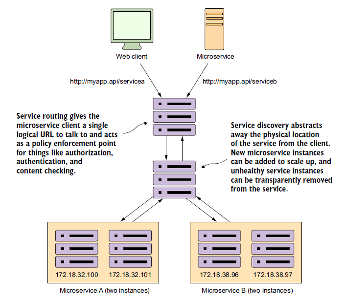
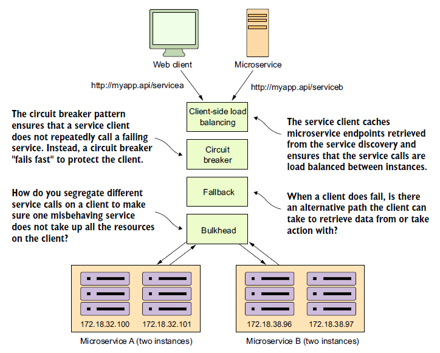
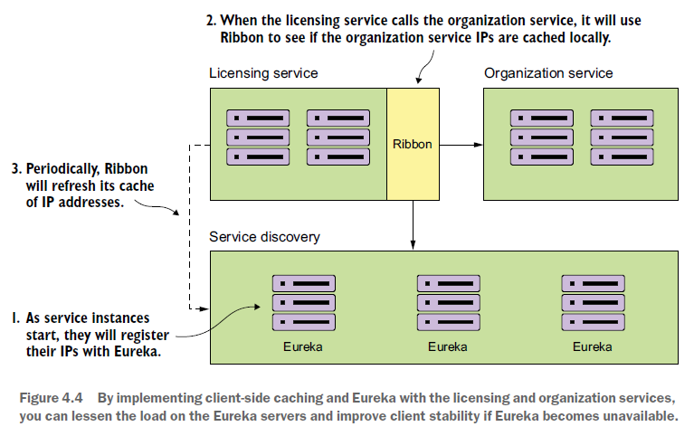
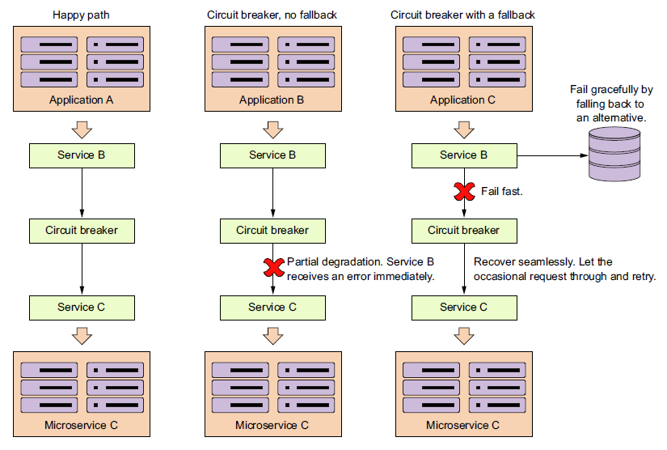
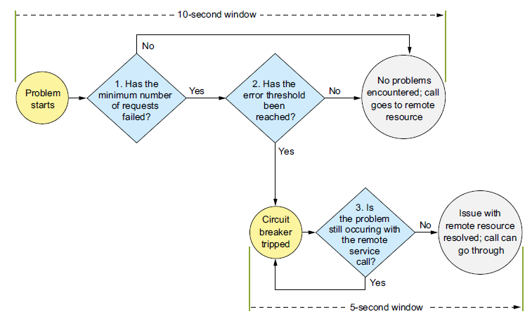

# 简介

Spring Cloud是建立在Spring Boot基础之上，并添加了一些系统中所有组件都会使用或偶尔需要的功能。 

> 如果由于“非法密钥大小”而导致异常，并且您使用Sun的JDK，则需要安装Java加密扩展（JCE）无限制强制管辖权策略文件。有关更多信息，请参阅以下链接：
>
> [Java 6 JCE](http://www.oracle.com/technetwork/java/javase/downloads/jce-6-download-429243.html)
>
> [Java 7 JCE](http://www.oracle.com/technetwork/java/javase/downloads/jce-7-download-432124.html)
>
> [Java 8 JCE](http://www.oracle.com/technetwork/java/javase/downloads/jce8-download-2133166.html)
>
> 将文件解压缩到您使用的JRE / JDK x64 / x86版本的`JDK_HOME/jre/lib/security`文件夹中。 

<!--more-->

# 微服务

微服务就是一些协同工作的小而自治的服务。

- 很小，专注于做好一件事。
  单一职责原则：把因相同原因而变化的东西聚合到一起，而把因不同原因而变化的东西分离开来。
- 自治性。一个微服务就是一个独立的实体，可以独立地部署。
  服务之间均通过网络调用进行通信，从而加强了服务之间的隔离性，避免紧耦合。

微服务好处：

- 技术异构性
- 弹性
- 扩展：可以只对需要扩展的服务进行扩展。
- 简化部署
- 与组织结构相匹配
- 可组合性
- 对可替代性的优化

共享库的缺点：无法选择异构的技术；添加耦合点。

## 架构师的演化视角

架构师必须改变那种从一开始就要设计出完美产品的相当，相反我们应该设计出一个合理的框架，在这个框架下可以慢慢演化出正确的系统。

未来的变化很难预见，所以与其对所有变化的可能性进行预测，不如做一个允许变化的计划。

架构师要专注在大方向上，只在很有限的情况下参与到非常具体的细节实现中来。他们需要保证系统不但能够满足当前的需求，还能够应对将来的变化 。而且他们还应该保证在这个系统上工作的开发人员要和使用这个系统的用户一样开心。

## 集成

同步或异步

请求/响应（RPC、REST）、基于事件（消息代理、ATOM）。

编排（orchestration）或协同（choreography）

在微服务内部要遵守代码重用原则，但在跨服务的情况下可以适当违反代码重用原则。

如果你想要使用客户端库，一定要保证其中只包含处理底层传输协议的代码，千万不要把与目标服务相关的逻辑放到客户端库中。最后，确保由客户端来负责何时进行客户端库的升级。

## 微服务模式

### 核心微服务开发模式：Spring Boot


服务粒度

通信协议

接口设计：

配置管理：Spring Cloud Config

事件处理：Spring Cloud Stream

### 微服务路由模式



服务发现：Spring Cloud Netflix Eureka

服务路由：Spring Cloud Netflix Zuul

### 微服务客户端弹性模式



客户端负载均衡：Spring Cloud Netflix Ribbon。Ribbon会将从注册中心发现的服务位置缓存起来，这样调用服务时就不需要每次从注册中心查找服务。Ribbon还会将表现不佳或有问题的服务实例从缓存中移除，从而防止继续调用该服务实例。

断路器模式：Spring Cloud Netflix Hystrix。

后备模式：Spring Cloud Netflix Hystrix。当远程服务调用失败后的替代方案。

舱壁模式：Spring Cloud Netflix Hystrix。每个远程资源的调用都是隔离的，并分配到不同的线程池中。从而降低一个缓慢的远程资源调用拖垮整个应用程序的风险。

### 微服务安全模式


验证：Spring Cloud Security/OAuth2

授权：Spring Cloud Security/OAuth2

凭据管理和传播：Spring Cloud Security/OAuth2/JWT

### 微服务日志记录和跟踪模式


日志关联：Spring Cloud Sleuth

日志聚合：Spring Cloud Sleuth（与Papertrail）

微服务跟踪：Spring Cloud Sleuth/Zipkin

### 微服务构建和部署模式


构建和部署管道：如何创建一个可重复的构建和部署过程，只需要一键即可构建和部署到组织中的任何环境。Travis CI

基础设施即代码：如何将服务的基础设施作为可在源代码管理下执行和管理的代码去对待。Docker

不可变服务器：一旦创建了微服务镜像，如何确保它在部署之后永远不会更改。Docker

凤凰服务器（Phoenix Server）：服务器运行的时间越长，就越容易发生配置漂移。如何确保运行微服务的服务器定期被拆卸，并重新创建一个不可变的镜像。Travis CI/Docker

# 应用上下文服务：Spring Cloud Context

Spring Cloud Context为Spring云应用程序的`ApplicationContext`提供实用程序和特殊服务（bootstrap上下文、加密、刷新范围和环境端点）。 

Spring Cloud应用程序通过创建“bootstrap”上下文来运行，该上下文是主应用程序的父上下文。 它负责从外部源加载配置属性，并负责解密本地外部配置文件中的属性。 

默认情况下，引导属性（不是`bootstrap.properties`，而是在引导阶段加载的属性）以高优先级添加，因此它们不能被本地配置覆盖。 

通过引导上下文添加到应用程序的属性源通常是“远程的”（例如，来自Spring Cloud Config Server）。默认情况下，它们不能在本地覆盖。 如果您想覆盖这些远程属性，则远程属性源必须通过设置`spring.cloud.config.allowOverride = true`来授予其权限（无法在本地进行设置） 。一旦设置了该标志，两个更细粒度的设置将控制远程属性相对于系统属性和应用程序的本地配置的位置： 

- `spring.cloud.config.overrideNone=true`  ：从任何本地属性源均可覆盖 。
- `spring.cloud.config.overrideSystemProperties=false` ：只有系统属性、命令行参数和环境变量（但不是本地配置文件）可以覆盖远程设置。 

引导上下文的配置文件默认是`bootstrap.properties`或`bootstrap.yml`，而不是使用`application.yml`或`application.properties`，后者是主应用的配置文件。

例如：bootstrap.yml

```yaml
spring:
  application:
    name: foo
  cloud:
    config:
      uri: ${SPRING_CONFIG_URI:http://localhost:8888}
```

如果您的应用程序需要来自服务器的任何特定于应用程序的配置，那么设置`spring.application.name`（在bootstrap.yml或application.yml中）是一个不错的主意。 

引导上下文配置文件名可以通过 `spring.cloud.bootstrap.name` 来定制（默认是`bootstrap`）。引导上下文配置文件的位置可以通过`spring.cloud.bootstrap.location`  来定制（默认是空）。这些属性的行为与具有相同名称的`spring.config.*`变体类似。 

引导上下文配置文件也可以有Profiles，例如：`bootstrap-dev.properties`用于`dev` Profile。

您可以通过设置`spring.cloud.bootstrap.enabled = false`（例如，在系统属性中）完全禁用引导过程。 

## 应用上下文的层次结构

如果您从`SpringApplication`或`SpringApplicationBuilder`构建应用程序上下文，那么Bootstrap上下文将作为该上下文的父项添加。 Bootstrap上下文是您自己能够创建的最高级应用上下文的父级。 

Spring的一个特性是子级上下文继承了父级的属性源和配置文件，因此与没有使用Spring Cloud Config构建的相同上下文相比，“主”应用程序上下文包含了额外属性源。 额外的属性源：

- “bootstrap”：如果在Bootstrap上下文中找到任何`PropertySourceLocators`，并且它们具有非空属性，则可选的`CompositePropertySource`将呈现高优先级。 
- “applicationConfig”：`classpath:bootstrap.yml。`此外，如果Spring Profiles处于活动状态，则还包括相关文件。 `bootstrap.yml` （或`.properties`）用于配置Bootstrap上下文，它的优先级低于`application.yml `（或`.properties`），以及作为创建Spring Boot应用程序过程的常规部分添加到子项的任何其他属性源。 

> 注意：引导属性具有高优先级，但 `bootstrap.yml` （或`.properties`）中的属性优先级很低，常用于设置默认值。

您可以通过设置您创建的任何`ApplicationContext`的父上下文来扩展上下文层次结构。例如，通过使用它拥有的接口或`SpringApplicationBuilder`便捷方法（`parent()`、`child()`和`sibling()`）。

层次结构中的每个上下文都有自己的“bootstrap”属性源（可能是空的），以避免无意中将值从父级推到他们的后代。  

如果有配置服务器，则层次结构中的每个上下文也可以（原则上）具有不同的`spring.application.name`，并因此具有不同的远程属性源。 

正常情况下，Spring应用上下文行为规则应用于属性解析：来自子上下文的属性覆盖父类中的同名属性（基于名称和属性源名称）。 

# 公共抽象：Spring Cloud Commons

Spring Cloud Commons是一组用于不同Spring Cloud实现（如Spring Cloud Netflix和Spring Cloud Consul）的抽象和常用类。 

# 分布式配置中心：Spring Cloud Config

Spring Cloud Config允许将Spring Boot项目的配置保存到远程服务器上。Spring Boot微服务实例启动后，向Spring Cloud Config服务器请求配置。Spring Cloud Config服务器根据Spring Boot微服务实例发送过来的spring profile来向配置服务存储库请求相应的配置，并返回给Spring Boot微服务实例。

## 创建Spring Cloud Config服务器

1. 创建一个普通的Spring Boot项目作为Spring Cloud Config服务器。

2. 在项目的pom.xml中添加相应依赖（参见官方文档）。

3. 在引导类上加上`@EnableConfigServer`标注，以指示将Spring Cloud Config服务器嵌入到该项目。

```java
@EnableConfigServer
@SpringBootApplication
public class ConfigServiceApplication {
  public static void main(String[] args) {
    SpringApplication.run(ConfigServiceApplication.class, args);
  }
}
```

## 创建配置服务存储库

配置服务存储库可以是文件系统、Git存储库（本地或远程）、Etcd、Eureka、Consul、Zookeeper等。

### 基于文件系统的配置服务存储库

假设我们有一个微服务叫foo，文件系统任意位置创建`config/foo`目录，并在`foo`目录下创建微服务foo需要的配置文件，配置文件名称格式：应用程序名-profile名.yml（扩展名也可以是.property）。例如：

```
foo.yml   (可以通过“Spring Cloud Config配置服务URL/foo/default”来访问)
foo-dev.yml  (可以通过“Spring Cloud Config配置服务URL/foo/dev”来访问)
```

然后，在Spring Cloud Config项目的application.property中配置如下：

```properties
server.port: 8888     #Spring Cloud配置服务器要监听的端口
spring.profiles.active: native   #表示使用文件系统来作为配置服务的存储库
spring.cloud.config.server.native.searchLocations: file:///…/config/foo,…,file:///…/config/bar    #指定配置文件的存储位置，每个应用程序的配置存储位置用逗号分隔
```

在上面的配置中，没有位于`config`目录下名为`application.yml`或`application-PROFILE.yml`的配置是全局的，这一点与基于Git配置服务存储库不同。而在`config`下的子目录中的配置则只适用于对应的微服务。

### 基于Git的配置服务存储库

首先，可以在本地或远程创建一个Git存储库，并按照基于文件系统的配置服务存储库中例子一样的结构创建应用程序的配置文件。

然后，在Spring Cloud Config项目的application.property中配置如下：

```properties
server.port: 8888
spring.cloud.config.server.git.uri=Git存储库的URL #如果是本地的Git存储库，则以“file://”或“file:///”（Windows）开头。
spring.cloud.config.server.git.searchPaths=foo, bar  #可选
spring.cloud.config.server.git.username=...   #可选
spring.cloud.config.server.git.password=...   #可选
```

在上面的配置中，位于`config`目录下名为`application.yml`或`application-PROFILE.yml`的配置是全局的，适用于所有微服务。而在`config`下的子目录中的配置则只适用于对应的微服务。

> 其他更复杂的配置参见官方文档，例如配置多个存储库。

## 配置Spring Boot项目连接Spring Cloud Config服务器

1. 在Spring Boot项目的pom.xml添加相应依赖。

2. 在Spring Boot项目的bootstrap.property（推荐）或application.property中配置如下：

```properties
spring.application.name: foo   #指定应用名称，将用于向Spring Cloud配置服务器请求配置
spring.profiles.active: default  #指定缺省情况下，向Spring Cloud配置服务器发送的profile
spring.cloud.config.uri: Spring Cloud配置服务器的地址
```

当没有显式指定profile时，应用程序将向Spring Cloud配置服务器请求默认配置，即：`http://Spring Cloud配置服务器的地址/foo/default`。

如果需要显式指定profile，则需要将项目构建成JAR，然后用`-Dspring.profiles.active`系统属性来指定profile：

```bash
$ java -Dspring.profiles.active=dev -jar target/foo-0.0.1-SNAPSHOT.jar
```

则应用程序foo将请求`http://Spring Cloud配置服务器的地址/foo/dev`来获取配置。

从远程服务器上获取的配置将覆盖本地相同的配置，而本地独有的配置仍然可用。

这些配置信息，可以通过`@Value`等标注，在代码中读取到。

## 刷新配置

当配置服务存储库发生变更时，Spring Cloud 配置服务器总是读取最新配置。但是，Spring Boot应用，则只会在启动时向Spring Cloud 配置服务器请求一次配置。为了使Spring Boot应用能够在启动后刷新最新配置，需要在Spring Boot项目的引导类上加上`@RefreshScope`标注：

```java
@RefreshScope
@SpringBootApplication
public class FooApplication {
  public static void main(String[] args) {
    SpringApplication.run(FooApplication.class, args);
  }
}
```

然后，在需要刷新配置时，通过访问：`http://Spring Boot应用地址/refresh`来执行刷新。或者，通过重启Spring Boot项目也可以刷新配置。

## 保护敏感的配置信息

# 服务治理：Spring Cloud Eureka

Spring Cloud Eureka是基于Netflix Eureka做了二次封装，主要负责完成微服务架构中的服务治理功能（即微服务实例的自动化注册和发现）。


服务注册：每个服务单元（Eureka客户端）向注册中心登记自己提供的服务，并周期性地发送心跳来更新它有服务租约，未及时更新服务租约的服务被认为是不可用的，将从服务清单中剔除，从而达到排除故障服务的效果。

服务注册中心会维护类似下面的一个服务清单：

| 服务名 | 位置                                                       |
| ------ | ---------------------------------------------------------- |
| 服务A  | 192.168.0.100:8000, 192.168.0.101:8000                     |
| 服务B  | 192.168.0.100:9000, 192.168.0.101:9000, 192.168.0.102:9000 |

Eureka服务器没有后端存储，但注册表中的服务实例必须发送心跳信号以保持其注册是最新的（所以这可以在内存中完成）。客户端还有一个Eureka注册的内存缓存（因此他们不必每次请求注册服务都去注册中心）。 

服务发现：服务间的调用不再通过指定具体的实例地址来实现，而是通过服务名向注册中心查询服务的信息（并把它们缓存到本地并周期性地刷新服务状态），据此向服务的某个实例发起请求。

> 在非云的世界中，服务位置解析通常由DNS和网络负载均衡器的组合来解决。这种模型对基于云的微服务不适用的原因是：
>
> - 单点故障：虽然负载均衡器可以实现高可用，但它往往是应用程序基础设施中的集中式阻塞点，是整个基础设施的单点故障。
> - 有限的水平可伸缩性：大多数负载均衡器是通过使用热插拔实现冗余，但只能使用单个服务器来处理负载，辅助负载均衡器仅在主负载均衡器中断的情况下才能进行故障切换。此外，商业负载均衡器还受到有限数量的许可证限制。
> - 静态管理：大多数负载均衡器使用集中式的数据库来存储路由规则，添加新路由的唯一方法通常是通过供应商的专有API。开发人员通常要手动定义和部署服务的映射规则。

## 搭建服务注册中心（Eureka服务端）

### 引入依赖

pom.xml：

```xml
<dependencyManagement>
  <dependencies>
    <dependency>
      <groupId>org.springframework.cloud</groupId>
      <artifactId>spring-cloud-dependencies</artifactId>
      <version>Finchley.RELEASE</version>
      <type>pom</type>
      <scope>import</scope>
    </dependency>
  </dependencies>
</dependencyManagement>
<dependencies>
  <dependency>
    <groupId>org.springframework.cloud</groupId>
    <artifactId>spring-cloud-starter-netflix-eureka-server</artifactId>
  </dependency>
</dependencies>
```

### 配置注册中心

#### 独立模式

独立模式是指只有一个Eureka注册中心提供服务发现和注册。默认情况下，Eureka是采用对等模式，因此要通过配置禁止注册中心注册自己。

```properties
server:
  port: 8761

eureka:
  instance:
    hostname: localhost
  client:
    registerWithEureka: false     #不向注册中心注册自己
    fetchRegistry: false          #不需要向注册中心查询服务
    serviceUrl:
      defaultZone: http://${eureka.instance.hostname}:${server.port}/eureka/
```

> 注意：在独立模式下，`serviceUrl`指向与本地实例相同的主机。 

#### 对等模式

对等模式是指通过运行多个Eureka注册中心实例并要求它们相互注册，从而实现高可用。一个Eureka实例，既提供服务注册和发现服务，同时，它也是一个客户端，并将它注册到其他Eureka实例中。您可以将多个对等端添加到系统，并且只要它们两两至少通过一个边相互连接，就可以在它们之间同步注册。如下例所示：

application.yml：

```yaml
---
spring:
  profiles: peer1
server:
	port: 1111
eureka:
  instance:
    hostname: peer1
  client:
    serviceUrl:
      defaultZone: http://peer2/eureka/

---
spring:
  profiles: peer2
server:
	port: 1112
eureka:
  instance:
    hostname: peer2
  client:
    serviceUrl:
      defaultZone: http://peer1/eureka/
```

如果您在知道自己的主机名的机器上运行（默认情况下，它使用`java.net.InetAddress`查找），则不需要`eureka.instance.hostname`。 

### 启用服务注册中心

通过标注`@EnableEurekaServer`来启用服务注册中心：

```java
@SpringBootApplication
@EnableEurekaServer
public class Application {
  public static void main(String[] args) {
    new SpringApplicationBuilder(Application.class).web(true).run(args);
  }
}
```

### 启动注册中心

以Spring Boot方式启动该注册中心。

访问Eureka注册中心主页： http://localhost:8761/、http://peer1、http://peer2

Eureka提供的HTTP端点在 `/eureka/*` 下。

## Eureka客户端

Eureka客户端使得Spring Boot应用可以向注册中心发布自己提供的服务（服务提供者），并且从注册中心发现并消费服务（服务消费者）。

Eureka客户端可以同时既是服务消费者又是服务提供者。

### 引入依赖

pom.xml：

```xml
<dependencyManagement>
  <dependencies>
    <dependency>
      <groupId>org.springframework.cloud</groupId>
      <artifactId>spring-cloud-dependencies</artifactId>
      <version>Finchley.RELEASE</version>
      <type>pom</type>
      <scope>import</scope>
    </dependency>
  </dependencies>
</dependencyManagement>
<dependencies>
  <dependency>
    <groupId>org.springframework.cloud</groupId>
    <artifactId>spring-cloud-starter-netflix-eureka-client</artifactId>
  </dependency>
</dependencies>
```

只要在类路径中包含了`spring-cloud-starter-netflix-eureka-client`，Spring Boot应用程序将自动向Eureka服务器注册。 

> `spring-cloud-starter-netflix-eureka-client`和`spring-cloud-starter-netflix-eureka-server`实际上已经包含了`spring-cloud-starter-netflix-ribbon`依赖。

### 配置Eureka客户端

application.properties：

```properties
spring.application.name=hello-app
eureka.client.serviceUrl.defaultZone=http://localhost:8761/eureka/
```

在对等模式下，`defaultZone`可以设置为逗号分隔的多个注册中心地址：

```properties
eureka.client.serviceUrl.defaultZone=http://peer1/eureka/,http://peer2/eureka/
```

实际上，Eureka客户端只需要注册到一个注册中心，注册信息会被自动同步到相连的其他注册中心。这样，Eureka客户端的注册信息就可以通过这些注册中心中的任一台获得。但设置多个注册中心的好处是不会出现单点故障。

如果注册中心需要安全认证，则可以写成：

```properties
eureka.client.serviceUrl.defaultZone=http://用户名:密码@localhost:8761/eureka/
```

默认情况下，使用主机名来向注册中心注册。如果Java无法确定主机名，则使用IP地址来注册。也可以显式设置使用IP地址来注册，只要设置`eureka.instance.preferIpAddress=true`（默认是`false`）。在采用Docker的情况下，建议使用IP地址来注册，因为容器的主机名通常是随机生成的，并且容器没有DNS记录。

### 发现服务

Application.java：

```java
@SpringBootApplication
@EnableDiscoveryClient
public class Application {
	public static void main(String[] args) {
		SpringApplication.run(Application.class, args);
	}
}
```

> `@EnableDiscoveryClient`不是必需的。只要在类路径上存在`DiscoveryClient`实现，Spring Boot应用程序就会向注册中心注册实例、服务续约、取消租约和查询服务功能。

然后，就可以用下列代码来查找服务实例：

```java
@Autowired
private DiscoveryClient discoveryClient;  //注入服务发现客户端
…
List<ServiceInstance> instances = discoveryClient.getInstances("服务名");  //从注册中心中获取指定服务实例
```

> 注意，当使用带有Ribbon功能的Spring RestTemplate或Netflix Feign客户端来调用服务时，已经自动使用DiscoveryClient来查找服务了，不需要自已手动写这些代码。

### 服务消费

服务消费者主要完成两个目标：发现服务和消费服务（即调用服务）。其中发现服务由Eureka客户端（即`DiscoveryClient`）完成，而服务消费则由下列三种方式完成。

- 标准的Spring RestTemplate类来调用服务，需要开发人员自己负责负载均衡；
- 使用带有Ribbon功能的Spring RestTemplate来调用服务；
- 使用Netflix Feign客户端来调用服务。

后两者都集成了Ribbon，都具有客户端负载均衡能力。

#### Ribbon+RestTemplate

在应用主类中注册一个`RestTemplate` Bean，并通过`@LoadBalanced` 标注开启客户端负载均衡。

Application.java：

```java
@SpringBootApplication
@EnableDiscoveryClient
public class Application {
  @Bean
  @LoadBalanced //这个Bean将带有客户端负载均衡功能
  RestTemplate restTemplate() { 
    return new RestTemplate();
  }
  
	public static void main(String[] args) {
		SpringApplication.run(Application.class, args);
	}
}
```

ConsumerController.java：

```java
@RestController
public class ConsumerController {
  @Autowired
  private RestTemplate restTemplate;
  
  @RequestMapping(value="/ribbon-consumer", method=RequestMethod.GET)
  public String helloConsumer() {
    // 这里URL中是一个服务名，而不是具体的地址。它自动从注册中心发现服务，不需要显式手动使用DiscoveryClient来查找服务。
    return restTemplate.getForEntity("http://hello-app/hello", String.class).getBody();
  }
}
```

> 服务名不区分大小写，因此`hello-app`和`HELLO-APP`都是可以的。

#### Feign

1. 引入feign依赖：

```xml
<dependency>
  <groupId>org.springframework.cloud</groupId>
  <artifactId>spring-cloud-starter-openfeign</artifactId>
</dependency>
```

2. 启用Feign：

Application.java：

```java
@SpringBootApplication
@EnableDiscoveryClient
@EnableFeignClients
public class Application {
    public static void main(String[] args) {
        SpringApplication.run(ServiceFeignApplication.class, args);
    }
}
```

3. 定义一个feign接口，通过`@FeignClient（"服务名"）`，来绑定某个服务提供者。 然后，再使用Spring MVC的标注（例如`@GetMappint`）来将该服务提供者提供的REST接口绑定到指定方法上。这样，后续只要调用该方法，就相当向该服务提供者提供的REST接口发起了请求。

HelloFeignClient.java：

```java
@FeignClient("hello-app")
public interface HelloFeignClient {
    @GetMapping("/hello")
    String sayHello();
}
```

在Web层的控制器，对外暴露一个”/hi”的API接口，通过上面定义的Feign客户端HelloFeignClient来消费服务。 

HiController.java：

```java
@RestController
public class HiController {
  @Autowired
  HelloFeignClient helloFeignClient;
  
  @GetMapping("/hi")
  public String sayHi(){
    return helloFeignClient.sayHello();
  }
}
```

### 启动应用

按正常方式启动这个Spring Boot应用。

在浏览器中访问：http://localhost:8080/hi （假设该服务提供者提供了一个`/hi`服务）

### 服务下线

当服务实例进行正常的关闭操作时，它会触发一个服务下线的REST请求给Eureka服务注册中心，告诉服务注册中心：”我要下线了“。服务注册中心在接收到下线请求后，将该服务的状态置为”下线“（DOWN），并把该下线事件传播出去。

## 配置详解

### 注册中心配置

参见`org.springframework.cloud.netflix.eureka.server.EurekaServerConfigBean`。

| 配置参数                               | 默认值 | 说明                                                         |
| -------------------------------------- | ------ | ------------------------------------------------------------ |
| eureka.server.enable-self-preservation | false  | 是否启用注册中心的保护机制。值为`true`时，Eureka 会统计15分钟之内心跳失败的比例如果低于85%将会触发保护机制，这时将不会剔除服务提供者。值为`false`时，服务注册中心会将不可用的实例正确剔除。 |

### 服务实例配置

参见：`org.springframework.cloud.netflix.eureka.EurekaInstanceConfigBean`。

| 配置参数                                             | 默认值  | 说明                                                         |
| ---------------------------------------------------- | ------- | ------------------------------------------------------------ |
| eureka.instance.prefer-ip-address                    | false   | 不使用主机名来定义注册中心的地址，而使用IP地址的形式，如果设置了eureka.instance.ip-address 属性，则使用该属性配置的IP，否则自动获取除环路IP外的第一个IP地址 |
| eureka.instance.ip-address                           |         | IP地址                                                       |
| eureka.instance.hostname                             |         | 设置当前实例的主机名称。                                     |
| eureka.instance.appname                              |         | 服务名，默认取 spring.application.name 配置值，如果没有则为 unknown。同一服务有多个实例时，服务名是相同的。 |
| eureka.instance.lease-renewal-interval-in-seconds    | 30      | 定义服务续约任务（心跳）的调用间隔，单位：秒                 |
| eureka.instance.lease-expiration-duration-in-seconds | 90      | 定义服务失效的时间，单位：秒                                 |
| eureka.instance.status-page-url-path                 | /info   | 状态页面的URL，相对路径，默认使用 HTTP 访问，如果需要使用 HTTPS则需要使用绝对路径配置 |
| eureka.instance.status-page-url                      |         | 状态页面的URL，绝对路径                                      |
| eureka.instance.health-check-url-path                | /health | 健康检查页面的URL，相对路径，默认使用 HTTP 访问，如果需要使用 HTTPS则需要使用绝对路径配置 |
| eureka.instance.health-check-url                     |         | 健康检查页面的URL，绝对路径                                  |

### 服务注册配置

参见：`org.springframework.cloud.netflix.eureka.EurekaClientConfigBean`。

| 配置参数                                                    | 默认值                                     | 说明                                           |
| ----------------------------------------------------------- | ------------------------------------------ | ---------------------------------------------- |
| eureka.client.serviceUrl                                    | defalutZone: http://localhost:8761/eureka/ | 指定注册中心。配置值是一个`HashMap`类型。      |
| eureka.client.enabled                                       | true                                       | 启用Eureka客户端。                             |
| eureka.client.registryFetchIntervalSeconds                  | 30                                         | 从注册中心获取注册信息的时间间隔。单位为秒。   |
| eureka.client.instanceInfoReplicationIntervalSeconds        | 30                                         | 更新实例信息到注册中心的时间间隔。单位为秒。   |
| eureka.client.initialInstanceInfoReplicationIntervalSeconds | 40                                         |                                                |
| eureka.client.eurekaServiceUrlPollIntervalSeconds           | 300                                        | 轮询Eureka服务端地址更改的时间间隔。单位为秒。 |
| eureka.client.eurekaServerReadTimeoutSeconds                | 8                                          | 读取Eureka服务器信息的超时时间。单位为秒。     |
| eureka.client.eurekaServerConnectTimeoutSeconds             | 5                                          | 连接Eureka服务器的超时时间。单位为秒。         |
| eureka.client.eurekaServerTotalConnections                  | 200                                        | 所有Eureka服务端的连接总数。                   |
| eureka.client.eurekaServerTotalConnectionsPerHost           | 50                                         | 每个Eureka服务端的连接总数。                   |
| eureka.client.eurekaConnectionIdleTimeoutSeconds            | 30                                         | 连接闲置时间。单位为秒。                       |
| eureka.client.heartbeatExecutorThreadPoolSize               | 2                                          | 心跳连接池的初始化线程数。                     |
| eureka.client.heartbeatExecutorExponentialBackOffBound      | 10                                         | 心跳超时重试延迟时间的最大乘数值。             |
| eureka.client.cacheRefreshExecutorThreadPoolSize            | 2                                          | 缓存刷新线程池的初始化线程数。                 |
| eureka.client.cacheRefreshExecutorExponentialBackOffBound   | 10                                         | 缓存刷新重试延迟时间的最大乘数值。             |
| eureka.client.useDnsForFetchingServiceUrls                  | false                                      | 使用DNS来获取Eureka服务端的serviceUrl。        |
| eureka.client.registerWithEureka                            | true                                       | 是否要将自身的实例信息注册到Eureka服务端。     |
| eureka.client.preferSameZoneEureka                          | true                                       | 是否偏好使用处于相同Zone的Eureka服务端。       |
| eureka.client.filterOnlyUpInstances                         | true                                       | 获取实例时是否过滤，仅保留UP状态的实例。       |
| eureka.client.fetchRegistry                                 | true                                       | 是否从Eureka服务端获取注册信息。               |

# 客户端负载均衡：Spring Cloud Ribbon



# 断路器：Spring Cloud Hystrix





## 引入依赖

## 启用断路器

```java
@SpringBootApplication
@EnableCircuitBreaker
public class Application {
  public static void main(String[] args) {
    new SpringApplicationBuilder(Application.class).web(true).run(args);
  }
}
```

## 用断路器包装远程资源调用

通过在Java方法上标记`@HystrixCommand`标注来将该方法交由断路器进行管理。

```java
@HystrixCommand
public List<License> getLicensesByOrg(String orgId) {
  return licenseRepository.findByOrgId(orgId);
}
```

## 配置断路器

### 配置的级别

- 应用程序级
- 类级别：通过`@DefaultProperties`标注。
- 在类中定义的线程池级别。

### 配置调用超时

### 后备处理

### 实现舱壁模式


# 声明式服务调用：Spring Cloud Feign

# API网关：Spring Cloud Zuul

## 建立Zuul网关服务器

### 创建Spring Boot项目并添加相关依赖

### 启用Zuul服务

```java
@SpringBootApplication
@EnableZuulProxy
public class Application {
  public static void main(String[] args) {
    new SpringApplicationBuilder(Application.class).web(true).run(args);
  }
}
```

> 另外，还有一个`@EnableZuulServer`标注，它也启用Zuul服务，但不会加载任何Zuul反向代理过滤器，也不会使用Eureka进行服务发现。也就是说，当开发人员不想使用Zuul默认预置的功能时 ，例如需要使用Eureka之外的其他服务发现引擎时，才会使用该标注。

### 配置Zuul

Zuul默认自动使用Eureka来通过服务ID查找服务，然后使用Ribbon对来自Zuul的请求进行客户端负载均衡。

## 路由

### 通过服务发现自动映射路由

### 使用服务发现手动映射路由

### 使用静态URL手动映射路由

将路由配置放到Spring Cloud配置服务器以实现动态加载路由配置。

## 过滤器

# 保护微服务：Spring Cloud Security

## 创建授权服务器

### 创建一个Spring Boot项目

### 添加相应依赖

### 启用授权服务器

```java
@SpringBootApplication
@EnableAuthorizationServer
public class Application {
  public static void main(String[] args) {
    new SpringApplicationBuilder(Application.class).web(true).run(args);
  }
}
```

### 配置授权服务器

### 注册客户端应用程序

### 配置授权服务器的端点

## 用户认证

## 创建受保护资源

### 创建一个Spring Boot项目

### 添加相应依赖

### 启用资源服务器

```java
@SpringBootApplication
@EnableResourceServer
public class Application {
  public static void main(String[] args) {
    new SpringApplicationBuilder(Application.class).web(true).run(args);
  }
}
```

### 配置资源服务器

### 定义访问控制规则

## 访问受保护的资源

### 通过Feign访问受保护资源

## 在OAuth2中使用JWT

# 消息总线：Spring Cloud Bus

# 消息驱动：Spring Cloud Stream


## 消息生产者

## 消息消费者

# 分布式服务跟踪：Spring Cloud Sleuth