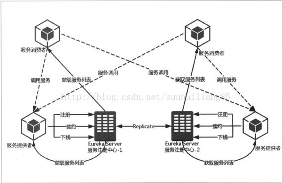

# 简介

Spring Cloud是建立在Spring Boot基础之上，并添加了一些系统中所有组件都会使用或偶尔需要的功能。 

> 如果由于“非法密钥大小”而导致异常，并且您使用Sun的JDK，则需要安装Java加密扩展（JCE）无限制强制管辖权策略文件。有关更多信息，请参阅以下链接：
>
> [Java 6 JCE](http://www.oracle.com/technetwork/java/javase/downloads/jce-6-download-429243.html)
>
> [Java 7 JCE](http://www.oracle.com/technetwork/java/javase/downloads/jce-7-download-432124.html)
>
> [Java 8 JCE](http://www.oracle.com/technetwork/java/javase/downloads/jce8-download-2133166.html)
>
> 将文件解压缩到您使用的JRE / JDK x64 / x86版本的`JDK_HOME/jre/lib/security`文件夹中。 

# 应用上下文服务：Spring Cloud Context

Spring Cloud Context为Spring云应用程序的`ApplicationContext`提供实用程序和特殊服务（bootstrap上下文、加密、刷新范围和环境端点）。 

Spring Cloud应用程序通过创建“bootstrap”上下文来运行，该上下文是主应用程序的父上下文。 它负责从外部源加载配置属性，并负责解密本地外部配置文件中的属性。 

默认情况下，引导属性（不是`bootstrap.properties`，而是在引导阶段加载的属性）以高优先级添加，因此它们不能被本地配置覆盖。 

通过引导上下文添加到应用程序的属性源通常是“远程的”（例如，来自Spring Cloud Config Server）。默认情况下，它们不能在本地覆盖。 如果您想覆盖这些远程属性，则远程属性源必须通过设置`spring.cloud.config.allowOverride = true`来授予其权限（无法在本地进行设置） 。一旦设置了该标志，两个更细粒度的设置将控制远程属性相对于系统属性和应用程序的本地配置的位置： 

- `spring.cloud.config.overrideNone=true`  ：从任何本地属性源均可覆盖 。
- `spring.cloud.config.overrideSystemProperties=false` ：只有系统属性、命令行参数和环境变量（但不是本地配置文件）可以覆盖远程设置。 

引导上下文的配置文件默认是`bootstrap.properties`或`bootstrap.yml`，而不是使用`application.yml`或`application.properties`，后者是主应用的配置文件。

例如：bootstrap.yml

```yaml
spring:
  application:
    name: foo
  cloud:
    config:
      uri: ${SPRING_CONFIG_URI:http://localhost:8888}
```

如果您的应用程序需要来自服务器的任何特定于应用程序的配置，那么设置`spring.application.name`（在bootstrap.yml或application.yml中）是一个不错的主意。 

引导上下文配置文件名可以通过 `spring.cloud.bootstrap.name` 来定制（默认是`bootstrap`）。引导上下文配置文件的位置可以通过`spring.cloud.bootstrap.location`  来定制（默认是空）。这些属性的行为与具有相同名称的`spring.config.*`变体类似。 

引导上下文配置文件也可以有Profiles，例如：`bootstrap-dev.properties`用于`dev` Profile。

您可以通过设置`spring.cloud.bootstrap.enabled = false`（例如，在系统属性中）完全禁用引导过程。 

## 应用上下文的层次结构

如果您从`SpringApplication`或`SpringApplicationBuilder`构建应用程序上下文，那么Bootstrap上下文将作为该上下文的父项添加。 Bootstrap上下文是您自己能够创建的最高级应用上下文的父级。 

Spring的一个特性是子级上下文继承了父级的属性源和配置文件，因此与没有使用Spring Cloud Config构建的相同上下文相比，“主”应用程序上下文包含了额外属性源。 额外的属性源：

- “bootstrap”：如果在Bootstrap上下文中找到任何`PropertySourceLocators`，并且它们具有非空属性，则可选的`CompositePropertySource`将呈现高优先级。 
- “applicationConfig”：`classpath:bootstrap.yml。`此外，如果Spring Profiles处于活动状态，则还包括相关文件。 `bootstrap.yml` （或`.properties`）用于配置Bootstrap上下文，它的优先级低于`application.yml `（或`.properties`），以及作为创建Spring Boot应用程序过程的常规部分添加到子项的任何其他属性源。 

> 注意：引导属性具有高优先级，但 `bootstrap.yml` （或`.properties`）中的属性优先级很低，常用于设置默认值。

您可以通过设置您创建的任何`ApplicationContext`的父上下文来扩展上下文层次结构。例如，通过使用它拥有的接口或`SpringApplicationBuilder`便捷方法（`parent()`、`child()`和`sibling()`）。

层次结构中的每个上下文都有自己的“bootstrap”属性源（可能是空的），以避免无意中将值从父级推到他们的后代。  

如果有配置服务器，则层次结构中的每个上下文也可以（原则上）具有不同的`spring.application.name`，并因此具有不同的远程属性源。 

正常情况下，Spring应用上下文行为规则应用于属性解析：来自子上下文的属性覆盖父类中的同名属性（基于名称和属性源名称）。 

# 公共抽象：Spring Cloud Commons

Spring Cloud Commons是一组用于不同Spring Cloud实现（如Spring Cloud Netflix和Spring Cloud Consul）的抽象和常用类。 

# 分布式配置中心：Spring Cloud Config

# 服务治理：Spring Cloud Eureka

Spring Cloud Eureka是基于Netflix Eureka做了二次封装，主要负责完成微服务架构中的服务治理功能（即微服务实例的自动化注册和发现）。



服务注册：每个服务单元（Eureka客户端）向注册中心登记自己提供的服务，并周期性地发送心跳来更新它有服务租约，未及时更新服务租约的服务被认为是不可用的，将从服务清单中剔除，从而达到排除故障服务的效果。

服务注册中心会维护类似下面的一个服务清单：

| 服务名 | 位置                                                       |
| ------ | ---------------------------------------------------------- |
| 服务A  | 192.168.0.100:8000, 192.168.0.101:8000                     |
| 服务B  | 192.168.0.100:9000, 192.168.0.101:9000, 192.168.0.102:9000 |

Eureka服务器没有后端存储，但注册表中的服务实例必须发送心跳信号以保持其注册是最新的（所以这可以在内存中完成）。客户端还有一个Eureka注册的内存缓存（因此他们不必每次请求注册服务都去注册中心）。 

服务发现：服务间的调用不再通过指定具体的实例地址来实现，而是通过服务名向注册中心查询服务的信息（并把它们缓存到本地并周期性地刷新服务状态），据此向服务的某个实例发起请求。

## 搭建服务注册中心（Eureka服务端）

### 引入依赖

pom.xml：

```xml
<dependencyManagement>
  <dependencies>
    <dependency>
      <groupId>org.springframework.cloud</groupId>
      <artifactId>spring-cloud-dependencies</artifactId>
      <version>Finchley.RELEASE</version>
      <type>pom</type>
      <scope>import</scope>
    </dependency>
  </dependencies>
</dependencyManagement>
<dependencies>
  <dependency>
    <groupId>org.springframework.cloud</groupId>
    <artifactId>spring-cloud-starter-netflix-eureka-server</artifactId>
  </dependency>
</dependencies>
```

### 配置注册中心

#### 独立模式

默认情况下，每个Eureka服务器也是Eureka客户端，并且需要（至少一个）服务URL来定位对等端。如果您没有提供该服务，该服务将运行并工作，但它会填满您的日志，并带来很多关于无法向对等端注册的噪音。 

因此，在独立模式下要禁止它将自己作为客户端注册，只需要配置如下应用属性：

```properties
server:
  port: 8761

eureka:
  instance:
    hostname: localhost
  client:
    registerWithEureka: false     #不向注册中心注册自己
    fetchRegistry: false          #不需要向注册中心查询服务
    serviceUrl:
      defaultZone: http://${eureka.instance.hostname}:${server.port}/eureka/
```

> 注意：在独立模式下，`serviceUrl`指向与本地实例相同的主机。 

#### 对等模式

通过运行多个Eureka注册中心实例并要求它们相互注册，Eureka可以变得更加灵活和可用。实际上，这是默认行为，所以您只需将一个有效的`serviceUrl`添加到对等体即可，如下例所示：

application.yml：

```yaml
---
spring:
  profiles: peer1
server:
	port: 1111
eureka:
  instance:
    hostname: peer1
  client:
    serviceUrl:
      defaultZone: http://peer2/eureka/

---
spring:
  profiles: peer2
server:
	port: 1112
eureka:
  instance:
    hostname: peer2
  client:
    serviceUrl:
      defaultZone: http://peer1/eureka/
```

如果您在知道自己的主机名的机器上运行（默认情况下，它使用`java.net.InetAddress`查找），则不需要`eureka.instance.hostname`。 

您可以将多个对等端添加到系统，并且只要它们两两至少通过一个边相互连接，就可以在它们之间同步注册。

### 启用服务注册中心

通过标注`@EnableEurekaServer`来启用服务注册中心：

```java
@SpringBootApplication
@EnableEurekaServer
public class Application {
  public static void main(String[] args) {
    new SpringApplicationBuilder(Application.class).web(true).run(args);
  }
}
```

### 启动注册中心

以Spring Boot方式启动该注册中心。

访问Eureka注册中心主页： http://localhost:8761/、http://peer1、http://peer2

Eureka提供的HTTP端点在 `/eureka/*` 下。

## Eureka客户端

Eureka客户端使得Spring Boot应用可以向注册中心发布自己提供的服务（服务提供者），并且从注册中心发现并消费服务（服务消费者）。

Eureka客户端可以同时既是服务消费者又是服务提供者。

### 引入依赖

pom.xml：

```xml
<dependencyManagement>
  <dependencies>
    <dependency>
      <groupId>org.springframework.cloud</groupId>
      <artifactId>spring-cloud-dependencies</artifactId>
      <version>Finchley.RELEASE</version>
      <type>pom</type>
      <scope>import</scope>
    </dependency>
  </dependencies>
</dependencyManagement>
<dependencies>
  <dependency>
    <groupId>org.springframework.cloud</groupId>
    <artifactId>spring-cloud-starter-netflix-eureka-client</artifactId>
  </dependency>
</dependencies>
```

只要在类路径中包含了`spring-cloud-starter-netflix-eureka-client`，Spring Boot应用程序将自动向Eureka服务器注册。 

> `spring-cloud-starter-netflix-eureka-client`和`spring-cloud-starter-netflix-eureka-server`实际上已经包含了`spring-cloud-starter-netflix-ribbon`依赖。

### 配置Eureka客户端

application.properties：

```properties
spring.application.name=hello-app
eureka.client.serviceUrl.defaultZone=http://localhost:8761/eureka/
```

在对等模式下，defaultZone可以设置为：`eureka.client.serviceUrl.defaultZone=http://peer1/eureka/,http://peer2/eureka/`

实际上，Eureka客户端只需要注册到一个注册中心，注册信息会被自动同步到相连的其他注册中心。这样，Eureka客户端的注册信息就可以通过这些注册中心中的任一台获得。

默认情况下，使用主机名来向注册中心注册。如果Java无法确定主机名，则使用IP地址来注册。也可以显式设置使用IP地址来注册，只要设置`eureka.instance.preferIpAddress=true`（默认是`false`）。

### 启用Eureka客户端（可选）

Application.java：

```java
@SpringBootApplication
@EnableDiscoveryClient
public class Application {
	public static void main(String[] args) {
		SpringApplication.run(Application.class, args);
	}
}
```

> `@EnableDiscoveryClient`不是必需的。只要在类路径上存在`DiscoveryClient`实现，Spring Boot应用程序就会向注册中心注册实例、服务续约、取消租约和查询服务功能。

### 启动服务

按正常方式启动这个Spring Boot应用。

在浏览器中访问：http://localhost:8080/hello （假设该服务提供者提供了一个`/hello`服务）

### 服务下线

当服务实例进行正常的关闭操作时，它会触发一个服务下线的REST请求给Eureka服务注册中心，告诉服务注册中心：”我要下线了“。服务注册中心在接收到下线请求后，将该服务的状态置为”下线“（DOWN），并把该下线事件传播出去。

### 服务消费

服务消费者主要完成两个目标：发现服务和消费服务。其中发现服务由Eureka客户端完成，而服务消费则由Ribbon完成。

Spring cloud有两种服务调用方式，一种是ribbon+restTemplate，另一种是feign（默认集成了Ribbon）。

#### ribbon+restTemplate

接下来在应用主类中注册一个`RestTemplate` Bean，并通过`@LoadBalanced` 标注开启客户端负载均衡。

Application.java：

```java
@SpringBootApplication
@EnableDiscoveryClient
public class Application {
  @Bean
  @LoadBalanced
  RestTemplate restTemplate() {
    return new RestTemplate();
  }
  
	public static void main(String[] args) {
		SpringApplication.run(Application.class, args);
	}
}
```

ConsumerController.java：

```java
@RestController
public class ConsumerController {
  @Autowired
  private RestTemplate restTemplate;
  
  @RequestMapping(value="/ribbon-consumer", method=RequestMethod.GET)
  public String helloConsumer() {
    // 这里访问的是一个服务名，而不是具体的地址。
    return restTemplate.getForEntity("http://hello-app/hello", String.class).getBody();
  }
}
```

> 服务名不区分大小写，因此`hello-app`和`HELLO-APP`都是可以的。

#### feign

引入feign依赖：

```xml
<dependency>
  <groupId>org.springframework.cloud</groupId>
  <artifactId>spring-cloud-starter-openfeign</artifactId>
</dependency>
```

启用Feign：

Application.java：

```java
@SpringBootApplication
@EnableDiscoveryClient
@EnableFeignClients
public class Application {
    public static void main(String[] args) {
        SpringApplication.run(ServiceFeignApplication.class, args);
    }
}
```

定义一个feign接口，通过@ FeignClient（“服务名”），来绑定某个服务提供者。 

HelloService.java：

```java
@FeignClient("hello-app")
public interface HelloService {
    @GetMapping("/hello")
    String sayHello();
}
```

在Web层的控制器，对外暴露一个”/hi”的API接口，通过上面定义的Feign客户端HelloService来消费服务。 

HiController.java：

```java
@RestController
public class HiController {
  @Autowired
  HelloService helloService;
  
  @GetMapping("/hi")
  public String sayHi(){
    return helloService.sayHello();
  }
}
```


## 配置详解

### 注册中心配置

| 配置参数                               | 默认值 | 说明                                                         |
| -------------------------------------- | ------ | ------------------------------------------------------------ |
| eureka.server.enable-self-preservation | false  | 值为`true`时，Eureka 会统计15分钟之内心跳失败的比例如果低于85%将会触发保护机制，这时将不会剔除服务提供者。值为`false`时，服务注册中心会将不可用的实例正确剔除。 |

### 服务实例配置

| 配置参数                                             | 默认值  | 说明                                                         |
| ---------------------------------------------------- | ------- | ------------------------------------------------------------ |
| eureka.instance.prefer-ip-address                    | false   | 不使用主机名来定义注册中心的地址，而使用IP地址的形式，如果设置了eureka.instance.ip-address 属性，则使用该属性配置的IP，否则自动获取除环路IP外的第一个IP地址 |
| eureka.instance.ip-address                           |         | IP地址                                                       |
| eureka.instance.hostname                             |         | 设置当前实例的主机名称。                                     |
| eureka.instance.appname                              |         | 服务名，默认取 spring.application.name 配置值，如果没有则为 unknown。同一服务有多个实例时，服务名是相同的。 |
| eureka.instance.lease-renewal-interval-in-seconds    | 30      | 定义服务续约任务（心跳）的调用间隔，单位：秒                 |
| eureka.instance.lease-expiration-duration-in-seconds | 90      | 定义服务失效的时间，单位：秒                                 |
| eureka.instance.status-page-url-path                 | /info   | 状态页面的URL，相对路径，默认使用 HTTP 访问，如果需要使用 HTTPS则需要使用绝对路径配置 |
| eureka.instance.status-page-url                      |         | 状态页面的URL，绝对路径                                      |
| eureka.instance.health-check-url-path                | /health | 健康检查页面的URL，相对路径，默认使用 HTTP 访问，如果需要使用 HTTPS则需要使用绝对路径配置 |
| eureka.instance.health-check-url                     |         | 健康检查页面的URL，绝对路径                                  |

### 服务注册配置

# 客户端负载均衡：Spring Cloud Ribbon

# 服务容错保护：Spring Cloud Hystrix

# 声明式服务调用：Spring Cloud Feign

# API网关：Spring Cloud Zuul

# 消息总线：Spring Cloud Bus

# 消息驱动：Spring Cloud Stream

# 分布式服务跟踪：Spring Cloud Sleuth