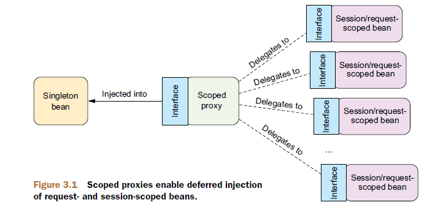
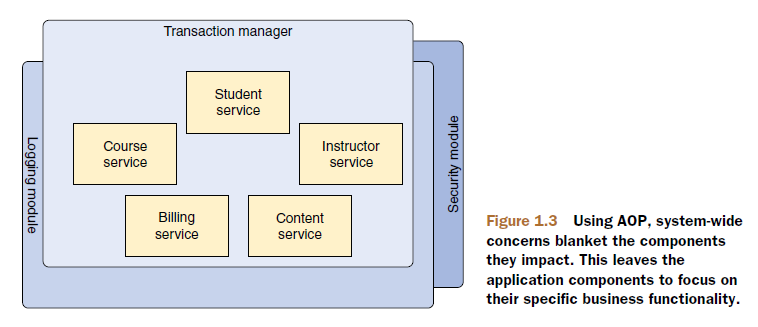
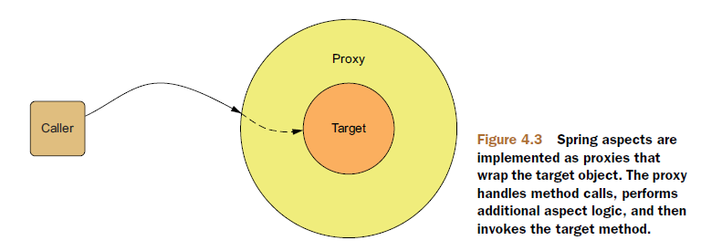
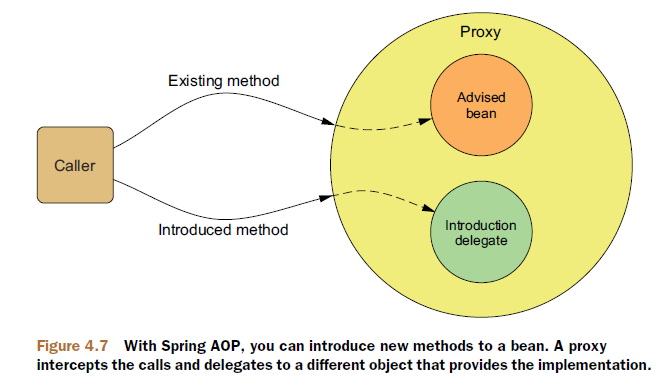

# Spring架构


# IoC

IoC（Inversion of Control，控制反转）也称为DI（依赖注入）。DI能够让相互协作的软件组件保持**松耦合**。

IoC容器是Spring框架的核心，它使用DI管理构成应用的组件。Spring IoC容器可分成两种不同类型：

- `org.springframework.beans.factory.BeanFactory`：最简单的IoC容器。
- `org.springframework.context.ApplicationContext`：应用上下文，基于`BeanFactory`构建，并提供应用框架级别的服务。

在Spring中，构成应用程序主干并由Spring IoC容器管理的对象称为bean。 bean是一个由Spring IoC容器实例化，装配（Wiring）和管理的对象。除此之外，bean只是应用程序中众多对象之一。 Bean及其之间的依赖关系反映在容器使用的配置元数据中。


## Bean的生命周期


1. Spring 对 Bean进行实例化；
2. Spring将值和Bean的引用注入到Bean对应的属性中；
3. 如果Bean实现了`BeanNameAware`接口，Spring将Bean的ID传递给`setBeanName`方法；
4. 如果Bean实现了`BeanFactoryAware`接口，Spring将调用`setBeanFactory`方法，将`BeanFactory`容器实例传入；
5. 如果Bean实现了`ApplicationContextAware`接口，Spring将调用`setApplicationContext`方法，将Bean所在的应用上下文的引用传入进来；
6. 如果Bean实现了`BeanPostProcessor`接口，Spring将调用它们的`postProcessBeforeInitialization`方法；
7. 如果Bean实现了`InitializingBean`接口，Spring将调用它们的`afterPropertiesSet`方法；
8. 如果Bean使用`init-method`声明了自定义的初始化方法，该方法也会被调用；
9. 如果Bean实现了`BeanPostProcessor`接口，Spring将调用它们的`postProcessAfterInitialization`方法；
10. 此时，Bean已经准备就绪，可以被应用程序使用了，它们将一直驻留在应用上下文中，直到该应用上下文被销毁；
11. 如果Bean实现了`DisposableBean`接口，Spring将调用它的`destroy`方法；
12. 如果Bean使用`destroy-method`声明了自定义的销毁方法，该方法会被调用。

## 装配Bean

Spring 能过配置元数据（Configuration Metadata）来装配Bean。

### 装配方式

Spring提供了三种装配Bean的方法：

- 在XML中进行显式装配；
- 在Java中进行显式装配；
- 隐式的Bean发现机制和自动装配。

这些装配方式可以任意互相搭配，比如：可以选择使用XML装配一些Bean，使用基于Java的配置来装配另一些Bean，而将剩余的Bean让Spring去自动发现。

XML和基于Java的装配方式更集中，且不会对代码造成侵入。自动装配和基于Java的配置具有类型安全等好处。

通常建议尽可能地使用自动装配机制，当必须要显式装配Bean的时候（比如，有些源码不是由你来维护的，而当你需要为这些代码装配Bean时），推荐使用类型安全并且比XML更加强大的基于Java的装配。最后，只有当你想要使用便利的XML命名空间，并且在基于Java的配置中没有同样的实现时，才应该使用XML的配置。

### 自动化装配

#### 创建可被发现的Bean

首先，创建Bean的接口：

```java
package soundsystem;
public interface CompactDisc {
  void play();
}
```

然后，创建Bean的实现类：

```java
package soundsystem;
import org.springframework.stereotype.Component;

@Component
public class SgtPeppers implements CompactDisc {
  private String title = "Sgt. Pepper's Lonely Hearts Club Band";  
  private String artist = "The Beatles";
  
  public void play() {
    System.out.println("Playing " + title + " by " + artist);
  }
}
```

实现类上要带有`@Component`等标注，这样Spring才会发现并为该类创建Bean。

另外，`@Repository`、`@ Service`和`@Controller`是`@Component`的特殊化，用于更具体的用例（分别在持久性，服务和表示层中）。

#### 启用组件扫描

为了自动装配带有`@Component`等标注的Bean，需要启用组件扫描（默认是不启用的）。可以使用基于Java的配置或基于XML的配置来启用组件扫描。

基于Java的配置：

```java
package soundsystem;
import org.springframework.context.annotation.ComponentScan;
import org.springframework.context.annotation.Configuration;

@Configuration
@ComponentScan
public class CDPlayerConfig { 
}
```

`@ComponentScan`标注默认指定的基础包是被`@ComponentScan`标注的配置类所在的包，即它会扫描该基础包以及其下的任意层次的子包，查找带有`@Component`标注的类。

如果要扫描不同的包（例如配置类放在单独的包中），或要扫描多个基础包，则需要显式指定要扫描的基础包。

最简单指定基础包的方式是通过`@ComponentScan`的`value`属性：

```java
@ComponentScan("foo.bar")
```

另外，还可以使用`basePackages`或`basePackageClasses`属性来指定基础包。前者以字符串形式指定基础包，后者通过类或接口的class对象来指定，class对象所在的包即为基础包。而且，两者都可指定多个基础包：

```java
@ComponentScan(basePackages={"pkg1", "pkg2"})

@ComponentScan(basePackageClasses={Foo.class, Bar.class})
```

基于XML的配置：（src/resources/META-INF/spring/soundsystem.xml）

```xml
<?xml version="1.0" encoding="UTF-8"?>
<beans xmlns="http://www.springframework.org/schema/beans"
  xmlns:xsi="http://www.w3.org/2001/XMLSchema-instance"
  xmlns:context="http://www.springframework.org/schema/context"
  xmlns:c="http://www.springframework.org/schema/c"
  xmlns:p="http://www.springframework.org/schema/p"
  xsi:schemaLocation="
    http://www.springframework.org/schema/beans
    http://www.springframework.org/schema/beans/spring-beans.xsd
		http://www.springframework.org/schema/context
    http://www.springframework.org/schema/context/spring-context.xsd">

  <context:component-scan base-package="soundsystem" />

</beans>
```

#### 自动装配

在自动装配中，要将Bean与它的依赖装配在一起，需要借助标注`@Autowired`或`@Inject`（Java依赖注入规范）。

```java
package soundsystem;
import org.springframework.beans.factory.annotation.Autowired;
import org.springframework.stereotype.Component;

@Component
public class CDPlayer implements MediaPlayer {
  private CompactDisc cd;

  @Autowired
  public CDPlayer(CompactDisc cd) {
    this.cd = cd;
  }

  public void play() {
    cd.play();
  }
}
```

`@Autowired`标注不仅能够用在构造器上，还能用在类的任何方法上（通常是属性的setter方法上）：

```java
@Autowired
public void setCompactDisc(CompactDisc cd) {
  this.cd = cd;
}

@Autowired
public void insertDisc(CompactDisc cd) {
  this.cd = cd;
}
```

`@Autowired`标注的`required`属性设置为`false`时，Spring会尝试执行自动装配，但是如果没有匹配的Bean，Spring将会让这个Bean处于未装配的状态。这时，如果在代码中没有进行null检查的话，这个处于未装配状态的属性有可能会出现`NullPointerException`异常。`required`属性的默认值是`true`，即如果没有匹配的Bean，那么在应用上下文创建的时候，Spring会抛出一个异常。

`@Autowired`标注和`@Inject`标注都是按类型进行装配的。而`@Resource`标注是属于Java EE标准的，它默认按照Bean的ID进行装配，ID可以通过`name`属性进行指定。如果没有指定`name`属性，当标注写在字段上时，就默认取字段名进行查找；如果标注写在setter方法上，就默认取属性名进行装配。当找不到与ID匹配的bean时，才按照类型进行装配。但需要注意的是，`name`一旦指定，就只会按照ID进行装配。例如：

```java
@Resource(name="userRepository")
private UserRepository userRepository;
```

### 基于Java的装配

#### 编写方法创建Bean

要在配置类中编写一个方法，该方法会创建所需类型的Bean，然后给这个方法加上`@Bean`标注：

```java
package soundsystem;
import org.springframework.context.annotation.Bean;
import org.springframework.context.annotation.Configuration;

@Configuration
public class CDPlayerConfig {  
  @Bean
  public CompactDisc randomBeatlesCD() {
    int choice = (int) Math.floor(Math.random() * 4);
    if (choice == 0) {
      return new SgtPeppers();
    } else if (choice == 1) {
      return new WhiteAlbum();
    } else if (choice == 2) {
      return new HardDaysNight();
    } else {
      return new Revolver();
    }
  }
}
```

> 这里，配置类上不需要加上`@ComponentScan`标注。

标注`@Bean`的方法只会在首次请求时执行一次，以后每次请求都将被Spring拦截，并从应用上下文中返回相同的Bean。也就是说，默认情况下，Spring中的Bean都是**单例的**。

#### 编程装配

```java
package soundsystem;
import org.springframework.context.annotation.Bean;
import org.springframework.context.annotation.Configuration;

@Configuration
public class CDPlayerConfig {
  @Bean
  public CompactDisc compactDisc() {
    return new SgtPeppers();
  }
  
  @Bean
  public CDPlayer cdPlayer(CompactDisc compactDisc) {
    return new CDPlayer(compactDisc);
  }
}
```

在这里，`cdPlayer`方法请求一个`CompactDisc`Bean作为参数。当Spring调用`cdPlayer`方法创建`CDPlayter`Bean时，它会自动装配一个`CompactDisc`到配置方法之中。这种方式不需要将`CompactDisc`声明到同一个配置类中，你可以将配置分散到多个配置类中。甚至不要求`CompactDisc`必须要在配置类中声明，也可是通过组件扫描自动发现或通过XML来配置。

下面还有一种方式也可以实现相同的装配效果：

```java
package soundsystem;
import org.springframework.context.annotation.Bean;
import org.springframework.context.annotation.Configuration;

@Configuration
public class CDPlayerConfig {
  @Bean
  public CompactDisc compactDisc() {
    return new SgtPeppers();
  }
  
  @Bean
  public CDPlayer cdPlayer() {
    return new CDPlayer(compactDisc());
  }
}
```

这种方式通过“调用”`@Bean`方法的方式来装配Bean（实际上每次调用`@Bean`方法都将被Spring拦截，只在首次调用时真正执行方法，后面将从IoC容器中直接返回相同的Bean）。

这种方式要求Bean与它的依赖Bean必须在同一个配置类中声明。

### 基于XML的装配

#### 配置Bean

daos.xml：

```xml
<?xml version="1.0" encoding="UTF-8"?>
<beans xmlns="http://www.springframework.org/schema/beans"
    xmlns:xsi="http://www.w3.org/2001/XMLSchema-instance"
    xsi:schemaLocation="http://www.springframework.org/schema/beans
        http://www.springframework.org/schema/beans/spring-beans.xsd">

    <bean id="accountDao"
        class="org.springframework.samples.jpetstore.dao.jpa.JpaAccountDao">
        <!-- additional collaborators and configuration for this bean go here -->
    </bean>

    <bean id="itemDao" class="org.springframework.samples.jpetstore.dao.jpa.JpaItemDao" />

    <!-- more bean definitions for data access objects go here -->

</beans>
```

在基于XML的配置中，你不再需要直接手动创建Bean。当Spring发现`<bean>`元素时，它将会根据Bean配置的实例化方式来自动实例化Bean。

#### 实例化Bean

##### 通过默认构造器实例化Bean

```xml
<bean id="exampleBean" class="examples.ExampleBean"/>
```

##### 通过静态工厂方法实例化Bean

```xml
<bean id="clientService"
      class="examples.ClientService"
      factory-method="createInstance"/>
```

`class`属性指定包含静态工厂方法的类。`factory-method`属性指定实例化Bean的静态工厂方法名。

```java
public class ClientService {
  private static ClientService clientService = new ClientService();
  private ClientService() {}

  public static ClientService createInstance() {
    return clientService;
  }
}
```

##### 通过实例工厂方法实例化Bean

```xml
<bean id="serviceLocator" class="examples.DefaultServiceLocator">
  <!-- inject any dependencies required by this locator bean -->
</bean>

<bean id="clientService"
      factory-bean="serviceLocator"
      factory-method="createClientServiceInstance"/>

<bean id="accountService"
      factory-bean="serviceLocator"
      factory-method="createAccountServiceInstance"/>
```

`factory-bean`属性指定包含实例工厂方法的Bean名。

```java
public class DefaultServiceLocator {
  private static ClientService clientService = new ClientServiceImpl();
  private static AccountService accountService = new AccountServiceImpl();

  public ClientService createClientServiceInstance() {
    return clientService;
  }

  public AccountService createAccountServiceInstance() {
    return accountService;
  }
}
```

#### 依赖注入

##### 构造器注入

使用XML来配置构造器注入，可以使用`<constructor-arg>`元素或Spring 3.0引入的c-命名空间来配置。

使用`<constructor-arg>`元素配置：

```xml
<?xml version="1.0" encoding="UTF-8"?>
<beans xmlns="http://www.springframework.org/schema/beans"
  xmlns:xsi="http://www.w3.org/2001/XMLSchema-instance"
  xsi:schemaLocation="http://www.springframework.org/schema/beans http://www.springframework.org/schema/beans/spring-beans.xsd">

  <bean id="compactDisc" class="soundsystem.collections.BlankDisc">
    <constructor-arg value="Sgt. Pepper's Lonely Hearts Club Band" />
    <constructor-arg value="The Beatles" />
    <constructor-arg>
      <list>
        <value>Sgt. Pepper's Lonely Hearts Club Band</value>
        <value>With a Little Help from My Friends</value>
        <value>Lucy in the Sky with Diamonds</value>
        <value>Getting Better</value>
        <value>Fixing a Hole</value>
        <value>She's Leaving Home</value>
        <value>Being for the Benefit of Mr. Kite!</value>
        <value>Within You Without You</value>
        <value>When I'm Sixty-Four</value>
        <value>Lovely Rita</value>
        <value>Good Morning Good Morning</value>
        <value>Sgt. Pepper's Lonely Hearts Club Band (Reprise)</value>
        <value>A Day in the Life</value>
      </list>
    </constructor-arg>
  </bean>
        
  <bean id="cdPlayer" class="soundsystem.CDPlayer">
    <constructor-arg ref="compactDisc" />
  </bean>

</beans>
```

可以使用`type`属性显式指定构造函数参数的类型：

```xml
<bean id="exampleBean" class="examples.ExampleBean">
  <constructor-arg type="int" value="7500000"/>
  <constructor-arg type="java.lang.String" value="42"/>
</bean>
```

可以使用`index`属性显式指定构造函数参数的索引：

```xml
<bean id="exampleBean" class="examples.ExampleBean">
  <constructor-arg index="0" value="7500000"/>
  <constructor-arg index="1" value="42"/>
</bean>
```

还可以使用`name`属性显式指定构造函数参数名称：

```xml
<bean id="exampleBean" class="examples.ExampleBean">
  <constructor-arg name="years" value="7500000"/>
  <constructor-arg name="ultimateAnswer" value="42"/>
</bean>
```

为了使这项工作开箱即用，必须在启用调试标志的情况下编译代码，以便Spring可以从构造函数中查找参数名称。如果您不能或不想使用debug标志编译代码，则可以使用`@ConstructorProperties` JDK批注显式命名构造函数参数。

```java
package examples;

public class ExampleBean {
  // Fields omitted
  @ConstructorProperties({"years", "ultimateAnswer"})
  public ExampleBean(int years, String ultimateAnswer) {
    this.years = years;
    this.ultimateAnswer = ultimateAnswer;
  }
}
```


使用c-命名空间来配置：

```xml
<?xml version="1.0" encoding="UTF-8"?>
<beans xmlns="http://www.springframework.org/schema/beans"
  xmlns:xsi="http://www.w3.org/2001/XMLSchema-instance"
  xmlns:c="http://www.springframework.org/schema/c"
  xsi:schemaLocation="http://www.springframework.org/schema/beans http://www.springframework.org/schema/beans/spring-beans.xsd">

  <bean id="compactDisc" class="soundsystem.BlankDisc"
        c:_0="Sgt. Pepper's Lonely Hearts Club Band" 
        c:_1="The Beatles" />
        
  <bean id="cdPlayer" class="soundsystem.CDPlayer"
        c:_-ref="compactDisc" />

</beans>
```

使用c-命名空间来声明构造器参数有两种方式：

- 通过构造器参数名：
  - `c:构造器参数名="字面量"`：例如，`c:foo="value"`。
  - `c:构造器参数名-ref="要注入的Bean的ID"`：例如，`c:bar-ref="beanID"`。
- 通过构造器参数的位置索引：
  - `c:_索引="字面量"`：例如，`c:_0="value"`。
  - `c:_索引-ref="要注入的Bean的ID"`：例如，`c:_1-ref="beanID"`。
  - 如果构造器只有一个参数，则索引可以省略。例如：`c:_="value"`。

> 注意：通过构造器参数名方式，需要在编译代码的时候，将调试符号（debug symbol）保存在类代码中。如果你优化构建过程，将调试符号移除掉，那么这种方式可能就无法正常执行了。

##### 属性注入

对于强依赖建议使用构造器注入，而对于可选性的依赖则建议使用属性注入。

```xml
<?xml version="1.0" encoding="UTF-8"?>
<beans xmlns="http://www.springframework.org/schema/beans"
	xmlns:xsi="http://www.w3.org/2001/XMLSchema-instance"
	xmlns:p="http://www.springframework.org/schema/p"
	xsi:schemaLocation="http://www.springframework.org/schema/beans http://www.springframework.org/schema/beans/spring-beans.xsd">

  <bean id="compactDisc"
        class="soundsystem.properties.BlankDisc">
    <property name="title" value="Sgt. Pepper's Lonely Hearts Club Band" />
    <property name="artist" value="The Beatles" />
    <property name="tracks">
      <list>
        <value>Sgt. Pepper's Lonely Hearts Club Band</value>
        <value>With a Little Help from My Friends</value>
        <value>Lucy in the Sky with Diamonds</value>
        <value>Getting Better</value>
        <value>Fixing a Hole</value>
        <value>She's Leaving Home</value>
        <value>Being for the Benefit of Mr. Kite!</value>
        <value>Within You Without You</value>
        <value>When I'm Sixty-Four</value>
        <value>Lovely Rita</value>
        <value>Good Morning Good Morning</value>
        <value>Sgt. Pepper's Lonely Hearts Club Band (Reprise)</value>
        <value>A Day in the Life</value>
      </list>
    </property>
  </bean>

  <bean id="cdPlayer"
        class="soundsystem.properties.CDPlayer"
        p:compactDisc-ref="compactDisc" />

</beans>
```

Spring提供了简洁的p-命名空间，作为`<property>`元素的替代方案。

p-命名空间的命名约定与c-命名空间的类似。

#### 装配集合

如果装配的是集合，则只能使用`<constructor-arg>`元素和`<property>`元素来配置，而不能使用c-命名空间和p-命名空间来配置。

##### 列表

```xml
<constructor-arg>
	<list>
    <value>a list element followed by a reference</value>
  	<ref bean="myDataSource" />
    …
  </list>
</constructor-arg>
```

##### 集合

```xml
<property name="someSet">
  <set>
    <value>just some string</value>
    <ref bean="myDataSource" />
  </set>
</property>
```

##### 映射

```xml
<property name="someMap">
  <map>
    <entry key="an entry" value="just some string"/>
    <entry key ="a ref" value-ref="myDataSource"/>
  </map>
</property>
```

> 映射的键和值、集合的值都可以是下列元素：
>
> bean、ref、idref、list、set、map、props、value、null

##### java.util.Properties 

```xml
<!-- typed as a java.util.Properties -->
<property name="properties">
  <value>
    jdbc.driver.className=com.mysql.jdbc.Driver
    jdbc.url=jdbc:mysql://localhost:3306/mydb
  </value>
</property>
```

或者

```xml
<!-- results in a setAdminEmails(java.util.Properties) call -->
<property name="adminEmails">
  <props>
    <prop key="administrator">administrator@example.org</prop>
    <prop key="support">support@example.org</prop>
    <prop key="development">development@example.org</prop>
  </props>
</property>
```

#### 使用util-命名空间

| 元素                  | 描述                                                 |
| --------------------- | ---------------------------------------------------- |
| `<util:constant>`     | 引用某个类型的`public static`域，并将其暴露为Bean。  |
| `<util:list>`         | 创建一个`java.util.List`类型的Bean。                 |
| `<util:map>`          | 创建一个`java.util.Map`类型的Bean。                  |
| `<util:properties>`   | 创建一个`java.util.Properties`类型的Bean。           |
| `util:property-path>` | 引用一个Bean的属性（或内嵌属性），并将其暴露为Bean。 |
| `<util:set>`          | 创建一个`java.util.Set`类型的Bean。                  |

例如：

```xml
<?xml version="1.0" encoding="UTF-8"?>
<beans xmlns="http://www.springframework.org/schema/beans"
  xmlns:xsi="http://www.w3.org/2001/XMLSchema-instance"
  xmlns:p="http://www.springframework.org/schema/p"
  xmlns:util="http://www.springframework.org/schema/util"
  xsi:schemaLocation="http://www.springframework.org/schema/beans 
    http://www.springframework.org/schema/beans/spring-beans.xsd
    http://www.springframework.org/schema/util 
    http://www.springframework.org/schema/util/spring-util.xsd">

  <bean id="compactDisc"
        class="soundsystem.properties.BlankDisc"
        p:title="Sgt. Pepper's Lonely Hearts Club Band"
        p:artist="The Beatles"
        p:tracks-ref="trackList" />

  <util:list id="trackList">  
    <value>Sgt. Pepper's Lonely Hearts Club Band</value>
    <value>With a Little Help from My Friends</value>
    <value>Lucy in the Sky with Diamonds</value>
    <value>Getting Better</value>
    <value>Fixing a Hole</value>
    <value>She's Leaving Home</value>
    <value>Being for the Benefit of Mr. Kite!</value>
    <value>Within You Without You</value>
    <value>When I'm Sixty-Four</value>
    <value>Lovely Rita</value>
    <value>Good Morning Good Morning</value>
    <value>Sgt. Pepper's Lonely Hearts Club Band (Reprise)</value>
    <value>A Day in the Life</value>
  </util:list>

</beans>
```


#### 装配内嵌Bean

```xml
<bean id="outer" class="...">
  <!-- instead of using a reference to a target bean, simply define the target bean inline -->
  <property name="target">
    <bean class="com.example.Person"> <!-- this is the inner bean -->
      <property name="name" value="Fiona Apple"/>
      <property name="age" value="25"/>
    </bean>
  </property>
</bean>
```

#### 装配复合属性

```xml
<bean id="something" class="things.ThingOne">
  <property name="fred.bob.sammy" value="123" />
</bean>
```

`something`Bean有一个`fred`属性，`fred`有一个`bob`属性，`bob`有一个`sammy`属性，最后的`sammy`属性被设置为`123`。为了使它们工作，`fred`属性和它的`bob`属性不能为`null`。否则，抛出`NullPointerException`。

#### 装配空值和空串

空值：

```xml
<constructor-arg><null/></constructor-arg>

<property name="email"><null/></property>
```

空串：

```xml
<constructor-arg value="" />

<property name="email" value="" />
```

#### `<idref>`元素

```xml
<bean id="theTargetBean" class="..."/>

<bean id="theClientBean" class="...">
    <property name="targetName">
        <idref bean="theTargetBean"/>
    </property>
</bean>
```

等价于：

```xml
<bean id="theTargetBean" class="..." />

<bean id="client" class="...">
    <property name="targetName" value="theTargetBean"/>
</bean>
```

#### 使用`depends-on`属性

如果bean是另一个bean的依赖项，那通常意味着将一个bean设置为另一个bean的属性。通常，您可以使用基于XML的配置元数据中的`<ref />`元素来完成此操作。但是，有时bean之间的依赖关系不那么直接。例如，需要触发类中的静态初始化程序。

```xml
<bean id="beanOne" class="ExampleBean" depends-on="manager,accountDao">
  <property name="manager" ref="manager" />
</bean>

<bean id="manager" class="ManagerBean" />
<bean id="accountDao" class="x.y.jdbc.JdbcAccountDao" />
```

`depends-on`属性既指定初始化时间依赖关系，也指定销毁时间依赖关系。在给定的bean本身被销毁之前，首先销毁它依赖的bean。因此，依赖也可以控制关闭顺序。

#### 延迟初始化Bean

默认情况下，`ApplicationContext`实现会立即地创建和配置所有单例bean。如果不希望出现这种情况，可以通过`lazy-init`属性将bean定义为延迟初始化来阻止单例bean的预实例化。延迟初始化的bean告诉IoC容器在第一次请求时创建bean实例，而不是在启动时创建。

```xml
<bean id="lazy" class="com.something.ExpensiveToCreateBean" lazy-init="true"/>
```

当一个延迟初始化的bean是一个非延迟初始化的单例bean的依赖项时，`ApplicationContext`会在启动时创建立即创建延迟初始化的bean，因为它必须满足单例的依赖关系。

还可以使用`<beans />`元素上的`default-lazy-init`属性在容器级别控制延迟初始化：

```xml
<beans default-lazy-init="true">
  <!-- no beans will be pre-instantiated... -->
</beans>
```


### 配置导入

可以使用`@Import`标注将多个配置类组合在一起，还可以使用`@ImportResource`标注将XML配置文件导入配置类：

```java
@Configuration
@Import(abc.FooConfig.class)
@ImportResource("classpath:bar-config.xml")
public class MyConfig {
  
}
```

`@Import`标注和`@ImportResource`标注都可以接受多个参数：

```java
@Import({abc.FooConfig.class, xyz.BarConfig.class})
```

也可以将多个XML配置文件通过`<import>`组合到一个XML配置文件中：（app.xml）

```xml
<beans>
  <import resource="services.xml"/>
  <import resource="resources/messageSource.xml"/>
  <import resource="/resources/themeSource.xml"/>

  <bean id="bean1" class="..."/>
  <bean id="bean2" class="..."/>
</beans>
```

上面三个导入的配置文件都是相对路径（即使以`/`开头），它相对于当前执行导入的配置文件（`app.xml`）的位置。要使用绝对路径，要写成：`file:C:/config/services.xml` 或 `classpath:/config/services.xml`。

注意：`<import>`元素只能导入其他的XML配置文件，并不能导入配置类。但可以使用`<bean>`元素来将配置类导入XML配置文件中：

```xml
<bean class="abc.FooConfig" />
```

通过导入将多个配置类或XML配置文件组合在一起，在实例化应用上下文时，只需要传入最高层次的那一个配置类或XML配置文件即可。例如：

```java
ApplicationContext context = new ClassPathXmlApplicationContext("app.xml");
```

否则，就需要列出所有的配置类或XML配置文件：

```java
ApplicationContext context = new AnnotationConfigApplicationContext(abc.FooConfig.class, xyz.BarConfig.class);
```

### Bean的命名

每个Bean可以有一个或多个标识符，这些标识符在托管bean的容器中必须是唯一的。

在自动化装配中，通过将Bean标识符传递给标注`@Component`来为Bean显式命名：

```java
@Component("foo")
```

自动化装配中，默认的命名是首字母小写的类名。例如，类名为`FooBar`，则Bean的默认名为`fooBar`。

另外，也可以使用Java依赖注入规范中的`@Named`标注来代替`@Component`：

```java
@Named("foo")
```

在基于Java的配置中，通过标注`@Bean`的`name`属性为Bean显式命名：

```java
@Bean(name="foo")
```

在基于Java的配置中，Bean的默认ID是`@Bean`标注的方法名。例如，方法名为`fooBar`，则Bean的默认名为`fooBar`。

在基于XML的配置元数据中，使用`id`属性、`name`属性或两者来指定Bean标识符。`id`属性只能指定一个标识符，而`name`属性可以指定多个别名。别名之间使用逗号、分号或空白字符分隔。

在基于XML的配置中，Bean的默认ID是Bean的完全限定类名加`#计数`组成。例如：`abc.FooBar#0`。

### Spring Profile

Spring Profile能够在**运行时**根据环境决定该创建哪个Bean和不创建哪个Bean。因此，同一个部署单元（可能会是WAR文件）能够适用于所有的环境，并且不需要重新构建。

#### 配置Profile

##### 在Java中配置Profile

在Java配置中，使用`@Profile`标注来指定某个Bean属于哪一个Profile。`@Profile`可以标注在类级别，也可以标注在方法级别。

标注在类级别：

```java
@Configuration
@Profile("qa")
public class QAProfileConfig {
  @Bean(destroyMethod="close")
  public DataSource dataSource() {
    BasicDataSource dataSource = new BasicDataSource();
    dataSource.setUrl("jdbc:h2:tcp://dbserver/~/test");
    dataSource.setDriverClassName("org.h2.Driver");
    dataSource.setUsername("sa");
    dataSource.setPassword("password");
    dataSource.setInitialSize(20);
    dataSource.setMaxActive(30);
    return dataSource;
  }
}
```

标注在方法上：

```java
@Configuration
public class DataSourceConfig {
  @Bean(destroyMethod = "shutdown")
  @Profile("dev")
  public DataSource embeddedDataSource() {
    return new EmbeddedDatabaseBuilder()
        .setType(EmbeddedDatabaseType.H2)
        .addScript("classpath:schema.sql")
        .addScript("classpath:test-data.sql")
        .build();
  }

  @Bean
  @Profile("prod")
  public DataSource jndiDataSource() {
    JndiObjectFactoryBean jndiObjectFactoryBean = new JndiObjectFactoryBean();
    jndiObjectFactoryBean.setJndiName("jdbc/myDS");
    jndiObjectFactoryBean.setResourceRef(true);
    jndiObjectFactoryBean.setProxyInterface(javax.sql.DataSource.class);
    return (DataSource) jndiObjectFactoryBean.getObject();
  }
}
```

另外，`@Profile`可以同时指定多个Profile：

```java
@Profile({"dev", "test"})
```

`@Profile`还可以通过`!`来表示取反。例如：`@Profile("!test") `。

##### 在XML中配置Profile

在XML中通过`<beans>`元素的`profile`属性来配置Profile。

```xml
<?xml version="1.0" encoding="UTF-8"?>
<beans xmlns="http://www.springframework.org/schema/beans"
       xmlns:xsi="http://www.w3.org/2001/XMLSchema-instance"
       xmlns:jdbc="http://www.springframework.org/schema/jdbc"
       xsi:schemaLocation="
         http://www.springframework.org/schema/jdbc
         http://www.springframework.org/schema/jdbc/spring-jdbc.xsd
         http://www.springframework.org/schema/beans
         http://www.springframework.org/schema/beans/spring-beans.xsd"
       profile="dev">

  <jdbc:embedded-database id="dataSource" type="H2">
    <jdbc:script location="classpath:schema.sql" />
    <jdbc:script location="classpath:test-data.sql" />
  </jdbc:embedded-database>
  
</beans>
```

还可以在根`<beans>`元素中嵌套定义`<beans>`元素，而不是为每个环境都创建一个Profile XML文件。这能够将所有的Profile Bean定义放到同一个XML文件中：

```xml
<?xml version="1.0" encoding="UTF-8"?>
<beans xmlns="http://www.springframework.org/schema/beans"
       xmlns:xsi="http://www.w3.org/2001/XMLSchema-instance"
       xmlns:jdbc="http://www.springframework.org/schema/jdbc"
       xmlns:jee="http://www.springframework.org/schema/jee"
       xmlns:p="http://www.springframework.org/schema/p"
       xsi:schemaLocation="
         http://www.springframework.org/schema/jee
         http://www.springframework.org/schema/jee/spring-jee.xsd
         http://www.springframework.org/schema/jdbc
         http://www.springframework.org/schema/jdbc/spring-jdbc.xsd
         http://www.springframework.org/schema/beans
         http://www.springframework.org/schema/beans/spring-beans.xsd">

  <beans profile="dev">
    <jdbc:embedded-database id="dataSource" type="H2">
      <jdbc:script location="classpath:schema.sql" />
      <jdbc:script location="classpath:test-data.sql" />
    </jdbc:embedded-database>
  </beans>
  
  <beans profile="qa">
  	<bean id="dataSource"
          class="org.apache.commons.dbcp.BasicDataSource"
          destroy-method="close"
          p:url="jdbc:h2:tcp://dbserver/~/test"
          p:driverClassName="org.h2.Driver"
          p:username="sa"
          p:password="password"
          p:initialSize="20"
          p:maxActive="30" />
  </beans>
  
  <beans profile="prod">
    <jee:jndi-lookup id="dataSource"
      lazy-init="true"
      jndi-name="jdbc/myDatabase"
      resource-ref="true"
      proxy-interface="javax.sql.DataSource" />
  </beans>
</beans>
```

#### 激活Profile

已经配置了Profile的Bean，只有当指定的Profile激活时，相应的Bean才会被创建。而没有指定任何Profile的Bean，总是会被创建，与激活哪个Profile没有关系。

Spring通过两个属性来确定哪个Profile处于激活状态：

- `spring.profiles.active`
- `spring.profiles.default`

如果设置了`spring.profiles.active`属性，则它的值就是被激活的Profile。否则，Spring会继续查找`spring.profiles.default`属性的值。如果两个属性均未设置，那就没有激活的Profile，因此只会创建那些没有定义在Profile中的Bean。

这两个属性都可以同时指定多个Profile，使用逗号分隔。

有多种方式来设置这两个属性：

- 作为`DispatcherServlet`的初始化参数：（web.xml）

  ```xml
  <servlet>
  	<servlet-name>appServlet</servlet-name>
    <servlet-class>org.springframework.web.servlet.DispatcherServlet</servlet-class>
    <init-param>
    	<param-name>spring.profiles.default</param-name>
      <param-value>dev</param-value>
    </init-param>
    <load-on-startup>1</load-on-startup>
  </servlet>
  ```

- 作为Web应用的上下文参数：（web.xml）

  ```xml
  <context-param>
  	<param-name>spring.profiles.default</param-name>
    <param-value>qa,demo</param-value>
  </context-param>
  ```

- 作为JNDI条目；

- 作为环境变量；

- 作为JVM的系统属性：

  ```bash
  -Dspring.profiles.active="profile1,profile2"
  ```

- 在集成测试类上，使用`@ActiveProfiles`标注设置。

  ```java
  public class DataSourceConfigTest {
    @RunWith(SpringJUnit4ClassRunner.class)
    @ContextConfiguration(classes=DataSourceConfig.class)
    @ActiveProfiles("dev")
    public static class DevDataSourceTest {
      @Autowired
      private DataSource dataSource;
      
      @Test
      public void shouldBeEmbeddedDatasource() {
        assertNotNull(dataSource);
        JdbcTemplate jdbc = new JdbcTemplate(dataSource);
        List<String> results = jdbc.query("select id, name from Things", new RowMapper<String>() {
          @Override
          public String mapRow(ResultSet rs, int rowNum) throws SQLException {
            return rs.getLong("id") + ":" + rs.getString("name");
          }
        });
        
        assertEquals(1, results.size());
        assertEquals("1:A", results.get(0));
      }
    }
  
    @RunWith(SpringJUnit4ClassRunner.class)
    @ContextConfiguration(classes=DataSourceConfig.class)
    @ActiveProfiles("prod")
    public static class ProductionDataSourceTest {
      @Autowired
      private DataSource dataSource;
      
      @Test
      public void shouldBeEmbeddedDatasource() {
        // should be null, because there isn't a datasource configured in JNDI
        assertNull(dataSource);
      }
    }
    
    @RunWith(SpringJUnit4ClassRunner.class)
    @ContextConfiguration("classpath:datasource-config.xml")
    @ActiveProfiles("dev")
    public static class DevDataSourceTest_XMLConfig {
      @Autowired
      private DataSource dataSource;
      
      @Test
      public void shouldBeEmbeddedDatasource() {
        assertNotNull(dataSource);
        JdbcTemplate jdbc = new JdbcTemplate(dataSource);
        List<String> results = jdbc.query("select id, name from Things", new RowMapper<String>() {
          @Override
          public String mapRow(ResultSet rs, int rowNum) throws SQLException {
            return rs.getLong("id") + ":" + rs.getString("name");
          }
        });
        
        assertEquals(1, results.size());
        assertEquals("1:A", results.get(0));
      }
    }
  
    @RunWith(SpringJUnit4ClassRunner.class)
    @ContextConfiguration("classpath:datasource-config.xml")
    @ActiveProfiles("prod")
    public static class ProductionDataSourceTest_XMLConfig {
      @Autowired(required=false)
      private DataSource dataSource;
      
      @Test
      public void shouldBeEmbeddedDatasource() {
        // should be null, because there isn't a datasource configured in JNDI
        assertNull(dataSource);
      }
    }
  }
  ```

另外，还可以通过硬编码方式激活Profile：

```java
AnnotationConfigApplicationContext ctx = new AnnotationConfigApplicationContext();
ctx.getEnvironment().setActiveProfiles("development");
ctx.register(SomeConfig.class, StandaloneDataConfig.class, JndiDataConfig.class);
ctx.refresh();
```

#### 获取Profile的状态

`Environment`提供了一些方法来检查哪些Profile处于激活状态：

- `String[] getActiveProfiles()`：返回激活Profile名称的数组；
- `String[] getDefaultProfiles()`：返回默认Profile名称的数组；
- `boolean acceptsProfiles(String ... profiles)`：如果`Environment`支持给定Profile，则返回`true`。

### 条件化的Bean

Spring 4.0引入了条件化的Bean机制，它可以自行设定条件来控制Bean的创建。它是比Profile机制更通用的机制。

例如，假设有一个名为`MagicBean`的类，我们希望只有设置了`magic`环境属性时，Spring才会实例化这个类。

首先，创建自定义条件：

```java
public class MagicExistsCondition implements Condition {
  @Override
  public boolean matches(ConditionContext context, AnnotatedTypeMetadata metadata) {
    Environment env = context.getEnvironment();
    return env.containsProperty("magic");
  }
}
```

然后，条件化配置Bean：

```java
@Configuration
public class MagicConfig {
  @Bean
  @Conditional(MagicExistsCondition.class)
  public MagicBean magicBean() {
    return new MagicBean();
  }
}
```

当条件的`matches`方法返回`true`时才会创建`MagicBean`的实例。

### 处理自动装配的歧义性

在自动装配时，如果同时有多个Bean能够匹配，这时Spring就会抛出`NoUniqueBeanDefinitionException`异常。

Spring提供了两种方案来解决自动装配中的歧义性问题：你可以将可选的Bean中的某一个设置为首选（Primary），或者使用限定符（Qualifier）来帮助Spring将可选的Bean范围缩小到只有一个Bean。

#### 设置首选Bean

在Java配置中：

```java
@Component
@Primary
public class IceCream implements Dessert {…}
```

或者：

```java
@Bean
@Primary
public Dessert iceCream() {
  return new IceCream();
}
```

在XML配置中：

```xml
<bean id="iceCream"
      class="com.desserteater.IceCream"
      primary="true" />
```

为了使首选Bean有效，同一类型的Bean中，最多只能有一个Bean被设置为首选。但是，`@Primary`并不能限制设置多个首选Bean发生，它只是标示一个优先的可选方案，这也是设置首选Bean方案的局限性。

当遇到歧义性时，Spring将会使用首选的Bean。

#### 使用限定符

##### 为Bean设置限定符

所有的Bean，如果没有显式设置限定符，都会给定一个默认的限定符，它与Bean的ID相同。

可以使用`@Qualifier`标注为Bean显式设置限定符：

```java
@Component
@Qualifier("cold")
public class IceCream implements Dessert {…}
```

或者

```java
@Bean
@Qualifier("cold")
public Dessert iceCream() {
  return new IceCream();
}
```

使用为Bean显式设置限定符的好处是，可以减少与Bean的ID的耦合度。

为Bean设置限定符的最佳实践是为Bean选择特征性或描述性的术语作为限定符。

##### 使用限定符注入

```java
@Autowired
@Qualifier("cold")
public void setDessert(Dessert dessert) {
  this.dessert = dessert;
}
```

这样，就只会将带有`cold`限定符的Bean注入。

##### 自定义限定符标注

当多个Bean设置了相同的限定符时，就需要设置更多的限定符来区分它们。但是，很遗憾在Java中不允许同一条目上重复出现相同类型的多个标注。我们可以通过创建自定义的限定符标注来解决这个问题。

创建自定义限定符标注：

```java
@Target({ElementType.CONSTRUCTOR, ElementType.FIELD, ElementType.METHOD, ElementType.TYPE})
@Retention(RetentionPolicy.RUNTIME)
@Qualifier
public @interface Cold {}

@Target({ElementType.CONSTRUCTOR, ElementType.FIELD, ElementType.METHOD, ElementType.TYPE})
@Retention(RetentionPolicy.RUNTIME)
@Qualifier
public @interface Creamy {}

@Target({ElementType.CONSTRUCTOR, ElementType.FIELD, ElementType.METHOD, ElementType.TYPE})
@Retention(RetentionPolicy.RUNTIME)
@Qualifier
public @interface Fruity {}
```

使用自定义限定符标注：

```java
@Component
@Cold
@Creamy
public class IceCream implements Dessert {…}

@Component
@Cold
@Fruity
public class Popsicle implements Dessert {…}
```

则在注入点，可以使用下面方式将范围缩小到`IceCream`：

```java
@Autowired
@Cold
@Creamy
public void setDessert(Dessert dessert) {
  this.dessert = dessert;
}
```

### Bean的作用域

Spring Bean有多种作用域：

- 单例（`singleton`）：在整个应用中，只创建Bean的一个实例。
- 原型（`prototype`）：每次注入或者通过Spring应用上下文获取的时候，都会创建一个新的Bean实例。
- 会话（`session`）：在Web应用中，为每个会话创建一个Bean实例。
- 全局会话（`globalSession`）：类似于会话作用域，但仅在Portlet的Web应用中使用。
- 请求（`request`）：在Web应用中，为每个请求创建一个Bean实例。

在默认情况下，Spring应用上下文中所有Bean都是单例的。可以通过`@Scope`标注为Bean显式选择其他的作用域：

```java
@Component
@Scope(ConfigurableBeanFactory.SCOPE_PROTOTYPE)
public class Notepad {…}
```

或者

```java
@Bean
@Scope(ConfigurableBeanFactory.SCOPE_PROTOTYPE)
public Notepad notepad() {
  return new Notepad();
}
```

在XML配置文件中，可以使用`<bean>`元素的`scope`属性来设置：

```xml
<bean id="notepad"
      class="com.myapp.Notepad"
      scope="prototype" />
```

会话和请求作用域只能在Web应用中使用，并且要在web.xml中做如下设置：

```xml
<listener>
	<listener-class>
  	org.springframework.web.context.request.RequestContextListener
  </listener-class>
</listener>
```


#### 作用域代理

在使用会话或请求作用域时，会遇到将会话或请求作用域的Bean注入到单例Bean中的问题。因为，单例Bean是在Spring应用上下文加载的时候创建的，而这时要注入的会话或请求作用域的Bean还不存在。而且，系统中将会有多个会话或请求作用域的Bean，而单例Bean只有一个。

Spring通过注入作用域代理，而不是直接注入会话或请求作用域Bean来解决这个问题。作用域代理会暴露与它代理的会话或请求作用域Bean相同的方法，并将调用委托给**当前会话或请求**所对应的那一个会话或请求作用域Bean。



作用域代理有两种实现模式：

- 基于接口的JDK代理（目标Bean是个接口）；
- 基于具体类的CGLib代理（目标Bean是个具体类）。

作用域代理的实现模式用`@Scope`标注的`proxyMode`属性来设置：

- `proxyMode=ScopedProxyMode.INTERFACES`：基于接口的JDK代理；
- `proxyMode=ScopedProxyMode.TARGET_CLASS`：基于具体类的CGLib代理。

```java
@Bean
@Scope(value=WebApplicationContext.SCOPE_SESSION, 
       proxyMode=ScopedProxyMode.INTERFACES)
public ShoppingCart cart() {…}
```

`proxyMode`属性的默认值是`ScopedProxyMode.DEFAULT`，即不创建作用域代理。

在XML配置中，可以配置为：

```xml
<?xml version="1.0" encoding="UTF-8"?>
<beans xmlns="http://www.springframework.org/schema/beans"
	     xmlns:xsi="http://www.w3.org/2001/XMLSchema-instance"
       xmlns:aop="http://www.springframework.org/schema/aop"
       xsi:schemaLocation="
         http://www.springframework.org/schema/aop
         http://www.springframework.org/schema/aop/spring-aop.xsd
         http://www.springframework.org/schema/beans
         http://www.springframework.org/schema/beans/spring-beans.xsd">
  <bean id="cart"
        class="com.myapp.ShoppingCart"
        scope="session" />
  <aop:scoped-proxy proxy-target-class="false" />
  </bean>
</beans>
```

`<aop:scoped-proxy>`的作用与`proxyMode`属性相同。

默认情况下，`proxy-target-class`的值是`true`，即使用CGLib创建目标类的代理。

## 应用上下文

Spring通过应用上下文（Application Context）装载bean的定义并把它们组装起来。Spring应用上下文全权负责对象的创建和组装。

常见的应用上下文实现：

- `AnnotationConfigApplicationContext`：从一个或多个基于Java的配置类中加载Spring应用上下文。
- `AnnotationConfigWebApplicationContext`：从一个或多个基于Java的配置类中加载Spring Web应用上下文。
- `ClassPathXmlApplicationContext`：从类路径下的一个或多个XML配置文件中加载上下文定义。
- `FileSystemXmlApplicationContext`：从文件系统下的一个或多个XML配置文件中加载上下文定义。
- `XmlWebApplicationContext`：从Web应用下的一个或多个XML配置文件中加载上下文定义。

### 应用上下文实例化

编程方式实例化：

```java
public static void main(String[] args) throws Exception {
	ApplicationContext context = new ClassPathXmlApplicationContext("services.xml", "daos.xml");
  //或者 ApplicationContext context = new AnnotationConfigApplicationContext(AppConfig.class);
  // 获取Bean
  PetStoreService petStoreService = context.getBean("petStore", PetStoreService.class);
  // 使用petStoreService
List<String> userList = petStoreService.getUsernameList();
  context.close();
}
```

在Web应用中，可在`web.xml`中添加如下配置来自动实例化应用上下文：

```xml
<context-param>
    <param-name>contextConfigLocation</param-name>
    <param-value>/WEB-INF/daoContext.xml /WEB-INF/applicationContext.xml</param-value>
</context-param>

<listener>
    <listener-class>org.springframework.web.context.ContextLoaderListener</listener-class>
</listener>
```

上下文参数`contextConfigLocation`的默认值是`/WEB-INF/applicationContext.xml`。

上下文参数`contextConfigLocation`的值可以是逗号、分号或空白字符分隔的多个文件。还支持Ant样式的路径模式。例如：

- `/WEB-INF/*Context.xml`：匹配所有名称以`Context.xml`结尾且位于`WEB-INF`目录中的文件；
- `/WEB-INF/**/*Context.xml`：匹配`WEB-INF`的任何子目录中名称以`Context.xml`结尾的文件。

### 应用上下文事件


# 资源

## 使用外部属性文件

### 声明属性源

Spring 使用`@PropertySource`标注来将外部属性文件声明为属性源，并在运行时加载到`Environment`中。

```java
@Configuration
@PropertySource("classpath:/com/soundsystem/app.properties")
public class ExpressiveConfig {
  …
}
```

app.properties：

```properties
disc.title=Sgt. Peppers Lonely Hearts Club Band
disc.artist=The Beatles
```

### 获取外部属性

#### 直接通过`Environment`对象获取

```java
@Configuration
@PropertySource("classpath:/com/soundsystem/app.properties")
public class ExpressiveConfig {
  @Autowired
  Environment env;
  
  @Bean
  public BlankDisc disc() {
    return new BlankDisc(env.getProperty("disc.title"),
                         env.getProperty("disc.artist"));
  }
}
```

当指定的属性不存在时，`getProperty`方法返回`null`。可以通过可选的第二个参数显式地给不存在的属性指定一个默认值：

```java
env.getProperty("disc.title", "Rattle and Hum")
```

如果希望在指定属性不存在时，抛出异常，而不是返回`null`，则可以使用`getRequiredProperty`方法。

`getProperty`方法除了可以返回`String`类型的属性值外，也可以返回指定的类类型：

```java
int connectionCount = env.getProperty("db.connection.count", Integer.class, 30);
```

要检查某个属性是否存在，可以使用`containsProperty`方法：

```java
boolean titleExists = env.containsProperty("disc.title");
```

可以使用方法`getPropertyAsClass`将属性值解析为类：

```java
Class<CompactDisc> cdClass = env.getPropertyAsClass("disc.class", CompactDisc.class);
```

#### 使用属性占位符获取外部属性

Sprng的属性占位符是使用`${…}`形式包装的属性名称。

为了使用属性占位符，要配置一个`PropertyPlaceholderConfigurer` Bean或`PropertySourcesPlaceholderConfigurer` Bean（推荐）。例如：

```java
@Bean
public static PropertySourcesPlaceholderConfigurer placeholderConfigurer() {
  return new PropertySourcesPlaceholderConfigurer();
}
```

或者：

```xml
<?xml version="1.0" encoding="UTF-8"?>
<beans xmlns="http://www.springframework.org/schema/beans"
       xmlns:xsi="http://www.w3.org/2001/XMLSchema-instance"
       xmlns:context="http://www.springframework.org/schema/context"
       xsi:schemaLocation="
         http://www.springframework.org/schema/beans
         http://www.springframework.org/schema/beans/spring-beans.xsd
         http://www.springframework.org/schema/context
         http://www.springframework.org/schema/context/spring-context.xsd">
  <context:property-placeholder />
</beans>
```

在基于Java的配置中，可以使用`@Value`标注使用属性占位符来将外部属性注入到Bean中：

```java
@Component
public class BlankDisc {
  public BlankDisc(
  	@Value("${disc.title}") String title,
    @Value("${disc.artist}") String artist) {
    this.title = title;
    this.artist = artist;
  }
  …
}
```

在基于XML配置中，则：

```xml
<bean id="sgtPeppers"
      class="soundsystem.BlankDisc"
      c:title="${disc.title}"
      c:artist="${disc.artist}" />
```


## 国际化

### JDK的国际化支持

#### 格式化类

JDK的`java.util`包中提供了几个支持国际化的格式化类，如`NumberFormat`、`DateFormat`和`MessageFormat`。

`NumberFormat`的示例：

```java
Locale locale = new Locale("zh", "CN");
NumberFormat currFmt = NumberFormat.getCurrencyInstance(locale);
double amount = 123456.78;
System.out.println(currFmt.format(amount));
```

`DateFormat`的示例：

```java
Locale locale = new Locale("zh", "CN");
DateFormat df = DateFormat.getDateInstance(DateFormat.MEDIUM, locale);
Date date = new Date();
System.out.println(df.format(date));
```

`MessageFormat`的示例：

```java
//格式化消息串
String pattern1 = "{0}，你好！你于{1}在工商银行存入{2}元。";
String pattern2 = "At {1,time,short} On {1,date,long}, {0} paid {2,number,currency}.";

//用于动态替换占位符的参数
Object[] params = {"John", new GregorianCalendar().getTime(), 1.0E3};

//使用默认的本地化对象格式化消息
String msg1 = MessageFormat.format(pattern1, params);

//使用指定的本地化对象格式化消息
MessageFormat mf = new MessageFormat(pattern2, Locale.US);
String msg2 = mf.format(params);
System.out.println(msg1);
System.out.println(msg2);
```

#### ResourceBundle

仅使用格式化类也可以提供国际化支持，但太笨拙了。JDK为此提供了方便加载及访问国际化资源文件的类`java.util.ResourceBundle`。

首先，为每个要支持的语言、地区创建如下命名的国际化资源文件：

```
资源名_可选的语言代码_可选的国家或地区代码.properties
```

例如：

```
resource_en_US.properties
resource_en.properties
resource.properties
```

资源名相同，但语言代码、国家或地区代码不同的一组国际化资源文件应该放在同一个目录下，它们包含的属性名是相同的，但属性值各不相同。

其中`资源名.properties`为默认资源文件，即某个语言或地区在系统中找不到对应的资源文件时，就采用这个默认资源文件。

假设上面的`resource`资源文件都放在类路径根的`i18n`目录下，则：

```java
ResourceBundle rb = ResourceBundle.getBundle("i18n/resource", Locale.CHINA);
String msg = rb.getString("greeting.common");
```

如果消息中包含占位符，则可以使用`MessageFormat`来填充占位符：

```java
Object[] params = {"John", new GregorianCalendar().getTime(), 1.0E3};
String msgFmt = new MessageFormat(rb.getString("greeting.common"), Locale.CHINA).format(params);
```

### Spring的国际化支持

Spring提供了`MessageSource`接口，进一步简化了国际化的使用。这些接口提供了如下易用的方法：

- `String getMessage(String code, Object[] args, String default, Locale loc)`：`code`是国际化消息中的属性名；`args`是用于传递给格式化串占位符的运行期参数；`default`是当在`MessageSource`中找不到对应属性名时，返回的默认值；`locale`是区域对象。
- `String getMessage(String code, Object[] args, Locale loc)`：与上面的方法类似，只是没有提供默认值。如果找不到该消息，则抛出`NoSuchMessageException`。
- `String getMessage(MessageSourceResolvable resolvable, Locale locale)`：`resolvable`封装了属性名、参数数组和默认消息。如果找不到该消息，则抛出`NoSuchMessageException`。

`MessageSource`的接口分别被`HierarchicalMessageSource`接口和`ApplicationContext`接口扩展，前者提供了分层次地解析消息的能力。

#### ResourceBundleMessageSource

`ResourceBundleMessageSource`是`HierarchicalMessageSource`接口的一个实现类，它允许通过`beanName`属性指定一个国际化资源，或者通过`beanNames`指定一组国际化资源。底层还是使用`ResourceBundle`对象解析消息。

beans.xml：

```xml
<beans>
  <bean id="messageSource"
        class="org.springframework.context.support.ResourceBundleMessageSource">
    <property name="basenames">
      <list>
        <value>format</value>
        <value>exceptions</value>
        <value>windows</value>
      </list>
    </property>
  </bean>
</beans>
```

format.properties：

```properties
message=Alligators rock!
```

exceptions.properties：

```properties
argument.required=The {0} argument is required.
```

可以将上面的`messageSource`Bean注入其他Bean中，以使得其他Bean能访问国际化资源。但是，由于`ApplicationContext`也实现了`MessageSource`接口，从而可以直接在容器级别上使用国际化资源。

在加载`ApplicationContext`时，它会自动搜索上下文中定义的`MessageSource` Bean，且Bean必须具有名称`messageSource`。如果找到这样的Bean，则对`ApplicationContext`的`getMessage`方法的所有调用都被委托给`messageSource`Bean。如果未找到任何`messageSource`Bean，`ApplicationContext`将尝试在父级容器中查找`messageSource`Bean。如果找到，它将该bean用作`MessageSource`。如果`ApplicationContext`找不到任何消息源，则会实例化一个空的`DelegatingMessageSource`，以便能够接受对上面定义的方法的调用。

```java
public static void main(String[] args) {
  MessageSource resources = new ClassPathXmlApplicationContext("beans.xml");
  String message = resources.getMessage("message", null, "Default", null);
  System.out.println(message);
}
```

#### ReloadableResourceBundleMessageSource

## 其他资源

### Resource接口

# 校验

# 数据绑定

# 类型转换


# SpEL

Spring 3引入了Spring表达式语言（Spring Expression Language，SpEL），它能够以一种强大和简洁的方式将值装配到Bean属性和构造器参数中。另外，SpEL还可用在依赖注入以外的地方。例如，Spring MVC中使用的Thymeleaf模板可以使用SpEL引用模型数据。

SpEL将在运行时计算它的值。

SpEL要放在`#{…}`中，而属性占位符是放在`${…}`中。

在Bean装配中，SpEL的使用方式与属性占位符基本相似。例如：

```java
@Component
public class BlankDisc {
  public BlankDisc(
  	@Value("#{systemProperties['disc.title']}") String title,
    @Value("#{systemProperties['disc.artist']}") String artist) {
    this.title = title;
    this.artist = artist;
  }
  …
}
```

## 表示字面量

```java
#{3.14}
#{9.87E4}
#{'Hello'}
#{false}
```

## 引用Bean

通过Bean ID引用其他Bean及它的成员：

```java
#{sgtPeppers.artist}
#{artistSelector.selectArtist()}
#{artistSelector.selectArtist()?.toUpperCase()}
```

`?.`运算符确保只有在`selectArtist()`的返回值不是`null`时，SpEL才会调用`toUpperCase`方法。

## 引用系统属性

可以通过`systemProperties`对象引用系统属性：

```java
#{systemProperties['disc.title']}
```

## 使用类型

如果要在SpEL中访问类的静态方法和常量，可以使用`T()`运算符，它接收一个类为参数，返回一个`Class`对象。

```java
#{T(java.lang.Math).random()}
```

## SpEL运算符

| 运算符类型 | 运算符                                          |
| ---------- | ----------------------------------------------- |
| 算术运算   | +（加）、+（字符串连接）、-、*、/、%、^（乘方） |
| 比较运算   | <、>、==、<=、>=、lt、gt、eq、le、ge            |
| 逻辑运算   | and、or、not、\|                                |
| 条件运算   | ?:（ternary）、?:（Elvis）                      |
| 正则表达式 | matches                                         |

示例：

```java
#{2 * T(java.lang.Math).PI * circle.radius}
#{disc.title + ' by ' + disc.artist}
#{counter.total eq 100}
#{scoreboard.score > 1000 ? "Winner!" : "Loser"}
```

Elvis运算符的左操作数如果为`null`，则表达式的值为右操作数的值。否则，表达式的值就是左操作数的值：

```java
#{disc.title ?: 'Rattle and Hum'}
```

## 使用正则表达式

SpEL通过`matches`运算符支持表达式中的模式匹配。如果与正则表达式相匹配，则返回`true`，否则返回`false`。

```java
#{admin.email matches '[a-zA-Z0-9._%+-]+@[a-zA-Z0-9.-]+\\.com'}
```

## 计算集合和数组

### 访问集合或数组元素

```java
#{jukebox.songs[T(java.lang.Math).random() * jukebox.songs.size()].title}
#{'This is a test'[3]}
```

### 过滤

#### `.?[]`

获取`jukebox`中`artist`属性为`'Aerosmith'`的所有歌曲：

```java
#{jukebox.songs.?[artist eq 'Aerosmith']}
```

#### `.^[]`和`.$[]`

`.^[]`和`.$[]`分别用来在集合中查询第一个匹配项和最后一个匹配项。

```java
#{jukebox.songs.^[artist eq 'Aerosmith']}
```

#### `.![]`

投影运算符`.![]`会从集合的每个元素中选择特定属性放到另一个集合中。

例如：获取Aerosmith的所有歌曲名称的集合，而不是歌曲对象的集合：

```java
#{jukebox.songs.?[artist eq 'Aerosmith'].![title]}
```

# AOP

DI能够让相互协作的软件组件保持松散耦合，而面向切面编程（aspect-oriented programming，AOP）允许你把遍布应用各处的功能分离出来形成**可重用**的组件。

> 虽然Spring的一个关键组件是AOP框架，但是Spring IoC容器不依赖于AOP（意味着如果您不想使用AOP，则不需要使用AOP），AOP补充了Spring IoC，以提供非常强大的中间件解决方案。

**切面**（Aspect）实现了跨越多种类型和对象的关注点（例如事务管理）的模块化。

可以把切面想象为覆盖在很多组件之上的一个外壳。应用是由那些实现各自业务功能的模块组成的。借助AOP，可以使用各种功能层去包裹核心业务层。这些层以声明的方式灵活地应用到系统中，你的核心应用甚至根本不知道它们的存在。



## AOP术语

### 通知（Advice）

在AOP术语中，切面在特定时候要完成的工作被称为**通知**。

Spring切面可以有5种类型的通知：

- 前置通知（Before）：在接入点（即调用目标方法）之前执行通知功能。
- 后置通知（After）：在接入点之后，无论接入点是正常返回或异常退出，都要执行的通知。
- 返回通知（After-returning）：在接入点成功执行之后调用通知。
- 异常通知（After-throwing）：在接入点抛出异常后调用通知。
- 环绕通知（Around）：环绕接入点的通知，可以在接入点之前和之后执行自定义的行为。它还负责选择是继续执行接入点，还是通过返回自己的返回值或抛出异常来绕过接入点。

### 接入点（Join Point）

接入点是在应用执行过程中能够插入切面的时机点。这个点可以是调用方法时、抛出异常时，甚至修改一个字段时。切面代码可以利用这些点插入到应用的正常流程之中，并添加新的行为。

### 切点（Pointcut）

切点用于定义通知被织入的具体位置（即一个或多个接入点）。

### 切面（Aspect）

切面是通知和切点的结合。通知和切点共同定义了切面的全部内容——它是什么，在何时（通知）和何处（切点）完成其功能。

### 引入（Introduction）

引入允许我们动态地向现有类添加新方法或属性。

### 目标对象（Target Object）

目标对象是被一个或多个切面通知的对象。

> 在Spring AOP中，切面本身不能成为其他切面通知的目标。类上的`@Aspect`标注将其标记为切面，从而也将其从自动代理中排除。

### AOP代理（AOP Proxy）

AOP代理是由AOP框架创建的对象，用于实现切面契约（通知方法执行等）。在Spring Framework中，AOP代理是JDK动态代理或CGLIB代理。

在默认情况下，如果目标对象有实现接口，则Spring AOP代理使用标准JDK动态代理。否则，目标对象没有实现接口，则使用CGLIB代理。

### 织入（Weaving）

织入是把切面应用到目标对象的指定接入点上，并创建新的代理对象的过程。

根据不同的实现技术，AOP有三种织入方式：

- 编译期织入：切面在目标类编译时被织入。这种方式需要特殊的编译器，AspectJ的织入编译器就是以这种方式织入切面的。
- 类加载期织入：切面在目标类加载到JVM时被织入。这种方式需要特殊的类加载器（ClassLoader），它可以在目标类被引入应用之前增强该目标类的字节码。AspectJ 5的加载时织入（load-time weaving，LTW）就支持以这种方式织入切面。
- 运行期织入：切面在应用运行的某个时刻被织入。一般情况下，在织入切面时，AOP容器会为目标对象动态地创建一个代理对象。代理对象封装目标Bean，并拦截目标Bean方法的调用。在将调用转发给真正的目标Bean方法之前，会执行切面逻辑。Spring AOP就是以这种方式织入切面的。这种方式比较适合在Servlet容器或应用服务器上使用。
  

## Spring对AOP的支持

Spring提供了4种类型的AOP支持：

- 基于代理的经典Spring AOP（不推荐）；
- 纯POJO切面；（使用XML配置，借助`aop`命名空间）
- @AspectJ 风格声明的切面。；（使用标注配置。注：@AspectJ并不是一个标注，它只是一个风格的名称）
- 注入式AspectJ切面。（基于AspectJ）

前三种类型本质上都是Spring基于代理的AOP，它们只支持方法级别的接入点。第三种类型中，@AspectJ 风格（即使用AspectJ的标注将常规Java类声明为切面）虽然来自AspectJ框架，但Spring只是借用它的标注和相应的解析库，而Spring AOP运行时仍然是基于动态代理的，没有对AspectJ的编译器和织入器的依赖。

而第四种类型实际上是Spring对AspectJ框架的集成，它除了支持方法接入点外，还支持字段和构造器接入点。

我们通常讲的Spring AOP是指前三种类型AOP支持。

## 创建目标

目标就是一些普通的Java接口或类。

```java
package concert;
public interface Performance {
	public void perform();
}
```

## 使用标注创建切面

### 启用@AspectJ支持

首先，要确保AspectJ的 `aspectjweaver.jar`库在项目的类路径上。

```java
@Configuration
@EnableAspectJAutoProxy
public class AppConfig {

}
```

### 声明切面

首先，使用`@Aspect`标注将一个类声明为切面：

```java
package concert;

import org.aspectj.lang.annotation.Aspect;

@Aspect
public class Audience {
  …
}
```

切面类可以包含方法和字段，与任何其他类相同。它们还可以包含切点、通知和引入声明。

然后，将该切面注册为Bean。例如：

```java
@Configuration
@EnableAspectJAutoProxy
public class AppConfig {
	@Bean
  public Audience audience() {
    return new Audience();
  }
}
```

如果使用自动装配，则：

配置类：

```java
@Configuration
@EnableAspectJAutoProxy
@ComponentScan
public class AppConfig {

}
```

切面Bean：

```java
@Component
@Aspect
public class Audience {
  …
}
```

### 声明通知

通知方法声明在切面类中，Spring使用AspectJ标注来声明通知方法：

| 标注            | 说明     |
| --------------- | -------- |
| @After          | 后置通知 |
| @AfterReturning | 返回通知 |
| @AfterThrowing  | 异常通知 |
| @Around         | 环绕通知 |
| @Before         | 前置通知 |

示例：

```java
package concert;

import org.aspectj.lang.annotation.AfterReturning;
import org.aspectj.lang.annotation.AfterThrowing;
import org.aspectj.lang.annotation.Aspect;
import org.aspectj.lang.annotation.Before;

@Aspect
public class Audience {
	@Before("execution(** concert.Performance.perform(..))")
  public void silenceCellPhones() {
    System.out.println("Silencing cell phones");
  }
  
  @Before("execution(** concert.Performance.perform(..))")
  public void takeSeats() {
  	System.out.println("Taking seats");
  }
  
  @AfterReturning("execution(** concert.Performance.perform(..))")
  public void applause() {
  	System.out.println("CLAP CLAP CLAP!!!");
  }
  
  @AfterThrowing("execution(** concert.Performance.perform(..))")
  public void demandRefund() {
  	System.out.println("Demanding a refund");
  }
}
```

#### 在返回通知中访问返回值

```java
import org.aspectj.lang.annotation.Aspect;
import org.aspectj.lang.annotation.AfterReturning;

@Aspect
public class AfterReturningExample {
  @AfterReturning(
    pointcut="com.xyz.myapp.SystemArchitecture.dataAccessOperation()",
    returning="retVal")
  public void doAccessCheck(Object retVal) {
    // ...
  }
}
```

`returning`属性中使用的名称必须与通知方法中的参数名称相对应。当接入点方法返回时，返回值作为相应的参数值传递给通知方法。`returning`子句还将仅限于匹配那些返回指定类型值的方法调用（在本例中为`Object`，它匹配任何返回值）。

#### 在异常通知中访问抛出的异常

```java
@Aspect
public class AfterThrowingExample {
  @AfterThrowing(
    pointcut="com.xyz.myapp.SystemArchitecture.dataAccessOperation()",
    throwing="ex")
  public void doRecoveryActions(DataAccessException ex) {
    // ...
  }
}
```

`throwing`属性中使用的名称必须与通知方法中的参数名称相对应。当通过抛出异常退出接入点时，异常将作为相应的参数值传递给通知方法。 `throwing`子句还将仅限于匹配那些抛出指定类型异常的方法调用（在本例中为`DataAccessException`）。

#### 创建环绕通知

环绕通知使用`@Around`标注声明。环绕通知方法的第一个参数必须是`ProceedingJoinPoint`类型。

在通知方法体内，调用`ProceedingJoinPoint`的`proceed`方法会导致执行接入点。

```java
package concert;

import org.aspectj.lang.ProceedingJoinPoint;
import org.aspectj.lang.annotation.Around;
import org.aspectj.lang.annotation.Aspect;
import org.aspectj.lang.annotation.Pointcut;

@Aspect
public class Audience {
  @Pointcut("execution(** concert.Performance.perform(..))")
  public void performance() {}
  
  @Around("performance()")
  public void watchPerformance(ProceedingJoinPoint jp) {
    try {
      System.out.println("Silencing cell phones");
      System.out.println("Taking seats");
      jp.proceed();
    	System.out.println("CLAP CLAP CLAP!!!");
    } catch (Throwable e) {
    	System.out.println("Demanding a refund");
    }
  }
}
```

 `proceed`方法可以不带参数，也可以传入`Object []`参数。数组中的值将传递给接入点方法的参数。另外，`proceed`方法的返回值就是接入点方法的返回值。

```java
@Around("execution(List<Account> find*(..)) && " +
        "com.xyz.myapp.SystemArchitecture.inDataAccessLayer() && " +
        "args(accountHolderNamePattern)")
public Object preProcessQueryPattern(
    ProceedingJoinPoint pjp,
    String accountHolderNamePattern) throws Throwable {
  String newPattern = preProcess(accountHolderNamePattern);
  return pjp.proceed(new Object[] {newPattern});
}
```

#### 通知执行顺序

当多个通知都想在同一个接入点执行时，优先级高的前置通知先执行，优先级高的后置通知、返回通知和异常通知后执行。

不同切面的通知的优先级由切面优先级决定，切面可以通过实现`org.springframework.core.Ordered` 接口或使用`@Order`标注标记来定义优先级。`Ordered.getValue()` 返回的值或标注的值越小，优先级越高。

```java
@Aspect
public class ConcurrentOperationExecutor implements Ordered {
  private static final int DEFAULT_MAX_RETRIES = 2;

  private int maxRetries = DEFAULT_MAX_RETRIES;
  private int order = 1;

  public void setMaxRetries(int maxRetries) {
    this.maxRetries = maxRetries;
  }

  public int getOrder() {
    return this.order;
  }

  public void setOrder(int order) {
    this.order = order;
  }

  @Around("com.xyz.myapp.SystemArchitecture.businessService()")
  public Object doConcurrentOperation(ProceedingJoinPoint pjp) throws Throwable {
    int numAttempts = 0;
    PessimisticLockingFailureException lockFailureException;
    do {
      numAttempts++;
      try {
        return pjp.proceed();
      }
      catch(PessimisticLockingFailureException ex) {
        lockFailureException = ex;
      }
    } while(numAttempts <= this.maxRetries);
    throw lockFailureException;
  }
}
```

或者：

```xml
<aop:aspectj-autoproxy/>

<bean id="concurrentOperationExecutor"
      class="com.xyz.myapp.service.impl.ConcurrentOperationExecutor">
  <property name="maxRetries" value="3"/>
  <property name="order" value="100"/>
</bean>
```

在Spring AOP中同一切面中的通知无法确定优先级，因此，它们同时应用到同一接入点的执行顺序是不确定的。

### 声明切点

有两种方法声明切点：

- 在声明通知时，将切点表达式作为AspectJ通知标注的参数即可（参见前面`Audience`切面的声明）。
- 声明命名切点。

#### 命名切点

但如果相同的切点表达式要在多个地方重用，则使用单独声明的命名切点会比较方便。

命名切点由两部分组成：由`@Pointcut`标注的切点表达式和切点签名（即返回类型为`void`的方法）。

```java
package concert;

import org.aspectj.lang.annotation.AfterReturning;
import org.aspectj.lang.annotation.AfterThrowing;
import org.aspectj.lang.annotation.Aspect;
import org.aspectj.lang.annotation.Before;
import org.aspectj.lang.annotation.Pointcut;

@Aspect
public class Audience {
  @Pointcut("execution(** concert.Performance.perform(..))")  // the pointcut expression
  public void performance() {}  // the pointcut signature
  
  @Before("performance()")
  public void silenceCellPhones() {
  	System.out.println("Silencing cell phones");
  }
  
  @Before("performance()")
  public void takeSeats() {
  	System.out.println("Taking seats");
  }
  
  @AfterReturning("performance()")
  public void applause() {
  	System.out.println("CLAP CLAP CLAP!!!");
  }
  
  @AfterThrowing("performance()")
  public void demandRefund() {
  	System.out.println("Demanding a refund");
  }
}
```

命名切点的声明与引用它的通知可以分属在不同的类中：

声明切点的类：

```java
package com.xyz.someapp;

import org.aspectj.lang.annotation.Aspect;
import org.aspectj.lang.annotation.Pointcut;

@Aspect
public class SystemArchitecture {
    /**
     * A join point is in the web layer if the method is defined
     * in a type in the com.xyz.someapp.web package or any sub-package
     * under that.
     */
    @Pointcut("within(com.xyz.someapp.web..*)")
    public void inWebLayer() {}

    /**
     * A join point is in the service layer if the method is defined
     * in a type in the com.xyz.someapp.service package or any sub-package
     * under that.
     */
    @Pointcut("within(com.xyz.someapp.service..*)")
    public void inServiceLayer() {}

    /**
     * A join point is in the data access layer if the method is defined
     * in a type in the com.xyz.someapp.dao package or any sub-package
     * under that.
     */
    @Pointcut("within(com.xyz.someapp.dao..*)")
    public void inDataAccessLayer() {}

    /**
     * A business service is the execution of any method defined on a service
     * interface. This definition assumes that interfaces are placed in the
     * "service" package, and that implementation types are in sub-packages.
     *
     * If you group service interfaces by functional area (for example,
     * in packages com.xyz.someapp.abc.service and com.xyz.someapp.def.service) then
     * the pointcut expression "execution(* com.xyz.someapp..service.*.*(..))"
     * could be used instead.
     *
     * Alternatively, you can write the expression using the 'bean'
     * PCD, like so "bean(*Service)". (This assumes that you have
     * named your Spring service beans in a consistent fashion.)
     */
    @Pointcut("execution(* com.xyz.someapp..service.*.*(..))")
    public void businessService() {}

    /**
     * A data access operation is the execution of any method defined on a
     * dao interface. This definition assumes that interfaces are placed in the
     * "dao" package, and that implementation types are in sub-packages.
     */
    @Pointcut("execution(* com.xyz.someapp.dao.*.*(..))")
    public void dataAccessOperation() {}
}
```

引用切点的通知：

```java
@Aspect
public class AroundExample {
    @Around("com.xyz.myapp.SystemArchitecture.businessService()")
    public Object doBasicProfiling(ProceedingJoinPoint pjp) throws Throwable {
        // start stopwatch
        Object retVal = pjp.proceed();
        // stop stopwatch
        return retVal;
    }
}
```

命名切点的可见性取决于切点签名的可见性。

### 通知参数

通过返回通知可获取接入点方法的返回值，通过异常通知可获取接入点方法抛出的异常。通过`args()`指示符的绑定形式（即接受参数名而不是参数类型），则可以将接入点方法的参数传递给通知方法。

> 其实，通过通知方法的`JoinPoint`类型参数，也可以获取接入点方法参数。

例如：获取接入点方法的第一个参数，且该参数是`Account`类型，并将它传递给通知方法的`account`参数。

```java
@Before("com.xyz.myapp.SystemArchitecture.dataAccessOperation() && args(account,..)")
public void validateAccount(Account account) {
    // ...
}
```

或者：

```java
@Pointcut("com.xyz.myapp.SystemArchitecture.dataAccessOperation() && args(account,..)")
private void accountDataAccessOperation(Account account) {}

@Before("accountDataAccessOperation(account)")
public void validateAccount(Account account) {
    // ...
}
```

#### 处理泛型参数

Spring AOP还可以处理泛型参数：

目标接口：

```java
public interface Sample<T> {
  void sampleGenericMethod(T param);
  void sampleGenericCollectionMethod(Collection<T> param);
}
```

将要拦截的接入点方法的泛型参数限制为`MyType`，并将`param`参数传递给通知方法的对应参数：

```java
@Before("execution(* ..Sample+.sampleGenericMethod(*)) && args(param)")
public void beforeSampleMethod(MyType param) {
  // Advice implementation
}
```

此方法不适用于泛型集合。因此，您无法按如下方式定义切入点：

```java
@Before("execution(* ..Sample+.sampleGenericCollectionMethod(*)) && args(param)")
public void beforeSampleMethod(Collection<MyType> param) {
  // Advice implementation
}
```

只能将通知方法参数设置成`Collection<?> param`，并手动检查元素的类型。

#### 确定参数名

由于通过Java反射机制是无法获取方法的参数名的，为此，Spring AOP使用如下策略来确定切点表达式中参数名与通知方法参数名的对应：

1. 如果用户已显式指定参数名称，则使用指定的参数名称。通知和切点标注都有一个可选的`argNames`属性，您可以使用该属性显式指定方法的参数名称，这些参数名称在运行时可用。

   ```java
   @Before(value="com.xyz.lib.Pointcuts.anyPublicMethod() && target(bean) && @annotation(auditable)",
           argNames="bean,auditable")
   public void audit(JoinPoint jp, Object bean, Auditable auditable) {
       AuditCode code = auditable.value();
       // ... use code, bean, and jp
   }
   ```

   注意：如果通知方法的第一个参数是`JoinPoint`、`ProceedingJoinPoint`或`JoinPoint.StaticPart`类型，`argNames`属性将不包含该参数名。

2. 如果没有指定`argNames`属性，Spring AOP会查看该类的调试信息，并尝试从局部变量表中确定参数名称。

   > 如果@Aspect切面被AspectJ编译器编译过，则不需要设置`argNames`属性。因为，AspectJ编译器会保留必要的信息。

3. 如果代码编译时没有保留调试信息，则Spring AOP会尝试推断绑定变量与参数的配对（例如，如果只有一个变量绑定在切入点表达式中，并且通知方法只接受一个参数，那么配对很明显）。如果给定可用信息仍不足以确定变量的绑定，则抛出`AmbiguousBindingException`。
4. 如果上述所有策略都失败，则抛出`IllegalArgumentException`。

### 访问当前接入点

在环绕通知中，通知方法第一个参数必须声明为`ProceedingJoinPoint`类型。其实任何通知，都可以将它的第一个参数声明为`org.aspectj.lang.JoinPoint`类型，它是`ProceedingJoinPoint`父类，提供了许多方法来访问当前接入点信息，包括接入点方法参数。

- `getArgs()`：返回接入点方法的参数。
- `getThis()`：返回代理对象。
- `getTarget()`：返回目标对象。
- `getSignature()`：返回接入点的方法签名。

### 引入

在Spring中，切面只是与它所包装的目标Bean实现了相同接口的代理。如果除了实现目标Bean的接口外，代理还暴露了新接口，这就是AOP中的引入。引入相当于为目标Bean动态添加了新的接口。

引入有点类似其他语言中的扩展类。



当代理中目标Bean接口的方法被调用时，代理将调用委托给目标Bean实例；而当代理中新暴露接口的方法被调用时，它将调用委托给实现了这个新接口的某个其他对象。实际上，代理对象的实现被拆分到多个类中。

假设，希望为所有实现了`Performance`的类型动态实现`Encoreable`接口。

Encoreable接口：

```java
package concert;
public interface Encoreable {
	void performEncore();
}
```

声明引入：

```java
package concert;

import org.aspectj.lang.annotation.Aspect;
import org.aspectj.lang.annotation.DeclareParents;

@Aspect
public class EncoreableIntroducer {
  @DeclareParents(value="concert.Performance+", defaultImpl=DefaultEncoreable.class)
  public static Encoreable encoreable;
}
```

`@DeclareParents`标注由三部分组成：

- `value`属性指定了哪种类型的Bean要引入（动态实现）新接口。
- `defaultImpl`属性指定了引入的新接口的实现类。
- `@DeclareParents`标记的静态属性指明了要引入的新接口。这里是`Encoreable`接口。

最后，与其他切面一样，也要将该引入注册为Bean：

```xml
<bean class="concert.EncoreableIntroducer" />
```

这样，所有实现了`Performance`的类型也动态实现`Encoreable`接口：

```java
Encoreable encoreable = (Encoreable) context.getBean("myPerformance");
```


## 在XML中声明切面

### 启用@AspectJ支持

首先，要确保AspectJ的 `aspectjweaver.jar`库在项目的类路径上。

```xml
<?xml version="1.0" encoding="UTF-8"?>
<beans xmlns="http://www.springframework.org/schema/beans"
	     xmlns:xsi="http://www.w3.org/2001/XMLSchema-instance"
       xmlns:context="http://www.springframework.org/schema/context"
       xmlns:aop="http://www.springframework.org/schema/aop"
       xsi:schemaLocation="http://www.springframework.org/schema/aop
         http://www.springframework.org/schema/aop/spring-aop.xsd
         http://www.springframework.org/schema/beans
         http://www.springframework.org/schema/beans/spring-beans.xsd
         http://www.springframework.org/schema/context
         http://www.springframework.org/schema/context/spring-context.xsd">

  <aop:aspectj-autoproxy />

</beans>
```

### 声明切面

```xml
<aop:config>
  <aop:aspect id="audienceAspect" ref="audience">
    …
  </aop:aspect>
</aop:config>

<bean id="audience" class="concert.Audience">
  …
</bean>
```

### 声明通知

```xml
<aop:config>
  <aop:aspect ref="audience">
    <aop:before
      pointcut="execution(** concert.Performance.perform(..))"
      method="silenceCellPhones"/>
    <aop:before
      pointcut="execution(** concert.Performance.perform(..))"
      method="takeSeats"/>
    <aop:after-returning
      pointcut="execution(** concert.Performance.perform(..))"
      method="applause"/>
    <aop:after-throwing
      pointcut="execution(** concert.Performance.perform(..))"
      method="demandRefund"/>
  </aop:aspect>
</aop:config>
```

此外，后置通知使用`<aop:after>`元素。

#### 在返回通知中访问返回值

```xml
<aop:aspect id="afterReturningExample" ref="aBean">
  <aop:after-returning
    pointcut-ref="dataAccessOperation"
    returning="retVal"
    method="doAccessCheck"/>
  ...
</aop:aspect>
```

`doAccessCheck`方法必须声明一个名为`retVal`的参数。此参数的类型以与`@AfterReturning`所述相同的方式约束匹配。例如：

```java
public void doAccessCheck(Object retVal) {…}
```

#### 在异常通知中访问抛出的异常

```xml
<aop:aspect id="afterThrowingExample" ref="aBean">
  <aop:after-throwing
    pointcut-ref="dataAccessOperation"
    throwing="dataAccessEx"
    method="doRecoveryActions"/>
  ...
</aop:aspect>
```

`doRecoveryActions`方法必须声明一个名为`dataAccessEx`的参数。此参数的类型以与`@AfterThrowing`相同的方式约束匹配。例如：

```java
public void doRecoveryActions(DataAccessException dataAccessEx) {…}
```

#### 创建环绕通知

```xml
<aop:config>
  <aop:aspect ref="audience">
    <aop:pointcut
      id="performance"
      expression="execution(** concert.Performance.perform(..))" />
    <aop:around
      pointcut-ref="performance"
      method="watchPerformance"/>
  </aop:aspect>
</aop:config>
```


### 声明切点

#### 命名切点

```xml
<aop:config>
  <aop:aspect ref="audience">
    <aop:pointcut
      id="performance"
      expression="execution(** concert.Performance.perform(..))" />
    <aop:before
      pointcut-ref="performance"
      method="silenceCellPhones"/>
    <aop:before
      pointcut-ref="performance"
      method="takeSeats"/>
    <aop:after-returning
      pointcut-ref="performance"
      method="applause"/>
    <aop:after-throwing
      pointcut-ref="performance"
      method="demandRefund"/>
  </aop:aspect>
</aop:config>
```

`<aop:pointcut>`放在`<aop:aspect>`元素内时，这个命名切点只能为所有切面的所有通知所共享。如果将`<aop:pointcut>`放在`<aop:config>`元素内时，则该命名切点可以为所有切面所共享。

### 通知参数

#### 确定参数名

```xml
<aop:before
  pointcut="com.xyz.lib.Pointcuts.anyPublicMethod() and @annotation(auditable)"
  method="audit"
  arg-names="auditable"/>
```

### 引入

```xml
<aop:config>
  <aop:aspect ref="audience">
    <aop:declare-parents
      types-matching="concert.Performance+"
      implement-interface="concert.Encoreable"
      default-impl="concert.DefaultEncoreable" />
  </aop:aspect>
  …
</aop:config>
…
<bean id="audience" class="concert.Audience">
  …
</bean>
```

除了使用`default-impl`属性以完全限定名形式设定`Encoreable`接口的实现类外，还可以使用`delegate-ref`属性来引用实现类的Bean：

```xml
<aop:config>
  <aop:aspect ref="audience">
    <aop:declare-parents
      types-matching="concert.Performance+"
      implement-interface="concert.Encoreable"
      delegate-ref="encoreableDelegate" />
  </aop:aspect>
  …
</aop:config>
…
<bean id="encoreableDelegate"
	class="concert.DefaultEncoreable" />
<bean id="audience" class="concert.Audience">
  …
</bean>
```

### Advisor

Advisor的概念来自Spring AOP，在AspectJ中没有直接的等价物。

Advisor可看成是只包含一个切点和一个通知的切面，并且通知表示为一个Bean，且要实现相应的[通知接口](https://docs.spring.io/spring/docs/5.1.1.RELEASE/spring-framework-reference/core.html#aop-api-advice-types)。

Advisor最常见的是与事务性通知一起使用：

```xml
<aop:config>
  <aop:pointcut id="businessService"
                expression="execution(* com.xyz.myapp.service.*.*(..))"/>
  <aop:advisor
               pointcut-ref="businessService"
               advice-ref="tx-advice"/>
</aop:config>

<tx:advice id="tx-advice">
  <tx:attributes>
    <tx:method name="*" propagation="REQUIRED"/>
  </tx:attributes>
</tx:advice>
```

## AspectJ切面

当Spring AOP不能满足需求时，我们必须转向更为强大的AspectJ。

### 声明AspectJ切面

```
package concert;
public aspect CriticAspect {
  public CriticAspect() {}
  pointcut performance(): execution(* perform(..));
  afterReturning(): performance() {
    System.out.println(criticismEngine.getCriticism());
  }
  private CriticismEngine criticismEngine;
  public void setCriticismEngine(CriticismEngine criticismEngine) {
    this.criticismEngine = criticismEngine;
  }
}
```

### 注入AspectJ切面

使用AspectJ切面时，根本不需要Spring就可以织入到我们的应用中。但如果想使用Spring的依赖注入为AspectJ切面注入协作者，那就还需要在Spring配置中把AspectJ切面声明为一个Spring Bean。

```xml
<bean class="com.springinaction.springidol.CriticAspect" factory-method="aspectOf">
	<property name="criticismEngine" ref="criticismEngine" />
</bean>
```

注意：AspectJ切面是由AspectJ在运行期创建的，而不是由Spring容器初始化的，因此要使用`factory-method`指定的工厂方法来获得切面的引用。

## 切点表达式语言

在Spring AOP中，使用AspectJ的切点表达式语言来定义切点。

> Spring AOP仅支持AspectJ切点表达式语言的一个子集，要获得完整AspectJ切点表达式语言支持，请使用注入式AspectJ切面。

### AspectJ切点指示符

Spring AOP支持的AspectJ切点指示符有：

| AspectJ指示符 | 说明                                                         |
| ------------- | ------------------------------------------------------------ |
| args()        | 限制接入点必须具有指定类型参数。                             |
| @args()       | 限制接入点的方法参数的类必须由指定的标注标记。               |
| execution()   | 用于匹配接入点的执行方法。                                   |
| this()        | 限制AOP代理对象本身必须是指定类的实例（包含了子类的实例）。  |
| target()      | 限制目标对象必须是指定类的实例（包含了子类的实例）。         |
| @target()     | 限制目标对象必须是由指定的标注标记的类的实例（包含了子类的实例）。 |
| within()      | 限制接入点必须定义在指定的类中。                             |
| @within()     | 限制接入点必须定义在由指定的标注标记的类中。                 |
| @annotation() | 限制接入点必须带有指定标注。                                 |

> 只有`execution()`指示符是实际执行匹配的，其他指示符都是用来限制匹配的。
>
> AspectJ框架中，`this()`和`target()`都引用相同的对象——目标对象。 Spring AOP是一个基于代理的系统，它区分代理对象本身（绑定到`this()`）和代理后面的目标对象（绑定到`target()`）。
>
> 由于Spring的AOP框架基于代理的本质，根据定义，目标对象内的调用不会被截获。对于JDK代理，只能拦截代理上的公共接口方法调用。使用CGLIB，代理上的公共和受保护方法调用被截获（如果需要，甚至是包可见的方法）。但是，通过代理进行的常见交互应始终通过公共签名进行设计。

#### `execution()`指示符

一般形式：

```
execution(modifiers-pattern? ret-type-pattern 
          declaring-type-pattern?name-pattern(param-pattern)
          throws-pattern?)
```

示例：

- `execution(public * *(..))`：匹配任何公有方法的执行。
- `execution(* set*(..))`：匹配名称以set开头的任何方法的执行。
- `execution(* com.xyz.service.AccountService.*(..))`：匹配`com.xyz.service.AccountService` 接口定义的任何方法的执行。其中`com.xyz.service.AccountService.`部分就是`declaring-type-pattern`。
- `execution(* com.xyz.service.*.*(..))`：匹配`com.xyz.service`包中定义的任何方法的执行。
- `execution(* com.xyz.service..*.*(..))`：匹配`com.xyz.service`包及其任意层次子包中定义的任何方法的执行。
- `execution(* com.xyz..AccountService.*())`：匹配`com.xyz`包及其任意层次子包中的`AccountService`接口定义的任何无参方法的执行。
- `execution(* com.xyz.service.AccountService+.*(*))`：匹配`com.xyz.service.AccountService` 接口及其子类型定义的任何只有一个参数的方法的执行。
- `execution(public * *(*, String))`：匹配任何带两个参数的公有方法的执行，并且方法的第一个参数是任意类型，第二个参数是`String`类型。
- `execution(* (!com.xyz.service.AccountService+).*(..))`：匹配除了`com.xyz.service.AccountService` 接口及其子类型之外定义的任何方法的执行。
- `execution(public * *(java.util.Date))`：匹配任何带有一个`java.util.Date`参数的公有方法的执行。
- `execution(* *(..) throws IllegalArgumentException, ArrayIndexOutOfBoundsException)`：匹配任何抛出`IllegalArgumentException`或`ArrayIndexOutOfBoundsException`异常的方法的执行。
- `execution(* (com.xyz.service.AccountService+ && java.io.Serializable+).*(..))`：匹配实现了`com.xyz.service.AccountService` 接口及其子类型，以及`java.io.Serializable`接口及其子类型的类型中定义的任何方法的执行。

#### `within()`指示符

示例：

- `within(com.xyz.service.*)`：在`com.xyz.service`包中的任何接入点。
- `within(com.xyz.service..*)`：在`com.xyz.service`包及其任意层次子包中的任何接入点。

#### `@within()`指示符

示例：

- `@within(org.springframework.transaction.annotation.Transactional)`：目标对象的声明类型具有`@Transactional`标注的任何接入点。

#### `this()`指示符

示例：

- `this(com.xyz.service.AccountService)`：代理对象实现`AccountService`接口的任何接入点。

绑定形式的`this()`例子：

```java
@Aspect
public class UsageTracking {
    @DeclareParents(value="com.xzy.myapp.service.*+", defaultImpl=DefaultUsageTracked.class)
    public static UsageTracked mixin;

    @Before("com.xyz.myapp.SystemArchitecture.businessService() && this(usageTracked)")
    public void recordUsage(UsageTracked usageTracked) {
        usageTracked.incrementUseCount();
    }
}
```

#### `target()`指示符

示例：

- `target(com.xyz.service.AccountService)`：目标对象实现`AccountService`接口的任何接入点。

#### `@target()`指示符

示例：

- `@target(org.springframework.transaction.annotation.Transactional)`：目标对象的任何接入点，且目标对象是具有`@Transactional`标注的类的实例。

#### `args()`指示符

示例：

- `args(java.io.Serializable)`：采用单个参数的任何接入点，以及在**运行时**传递的参数是`Serializable`。注：`execution(* *(java.io.Serializable))`是在执行时匹配，即匹配方法签名。

#### `@args()`指示符

示例：

- `@args(com.xyz.security.Classified)`：采用单个参数的任何接入点，并且传递的参数的运行时类型具有`@Classified`标注

#### `@annotation()`指示符

示例：

- `@annotation(org.springframework.transaction.annotation.Transactional)`：具有`@Transactional`标注的任何接入点。

#### `bean()`指示符

此外，Spring AOP还支持一个专有的切点指示符`bean()`。此切点指示符允许您将接入点的匹配限制为特定命名的一个或一组Spring Bean（使用通配符`*`）。切点指示符`bean()`具有以下形式：

```
bean(idOrNameOfBean)
```

示例：

- `bean(*Service)`：名称与通配符表达式`* Service`匹配的Spring Bean上的任何接入点。

#### 指示符的绑定形式

`args()`、`this()`、`target()`、`@target()`、`@within()`、`@annotation()`、`@args()`等指示符还可以使用绑定形式。（也参见“通知参数”）

通过绑定形式可以将匹配的对象传递给通知方法的相应参数。

例如：

接入点的标注：

```java
@Retention(RetentionPolicy.RUNTIME)
@Target(ElementType.METHOD)
public @interface Auditable {
  AuditCode value();
}
```

通知：

```java
@Before("com.xyz.lib.Pointcuts.anyPublicMethod() && @annotation(auditable)")
public void audit(Auditable auditable) {
  AuditCode code = auditable.value();
  // ...
}
```


### 切点运算符

可以使用`&&`（或`and`）、`||`（或`or`）和`!`（或`not`）运算符来组合切入点表达式。

示例：

- `execution(* concert.Performance.perform()) and !bean('woodstock')`：匹配Bean ID不为`woodstock`的`Performance` Bean的`perform()`方法执行。