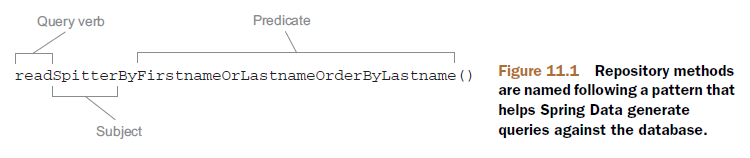
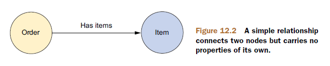
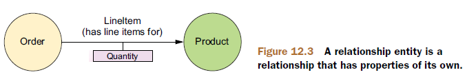

# JDBC

## 配置数据源

### 使用JNDI数据源

通过JNDI获取数据源的好处在于数据源完全可以在应用程序之外进行管理。另外，在应用服务器中管理的数据源通常以池的方式组织，具备更好的性能，并且还支持系统管理员对其进行热切换。

```java
@Bean
public JndiObjectFactoryBean dataSource() {
  JndiObjectFactoryBean jndiObjectFB = new JndiObjectFactoryBean();
  jndiObjectFB.setJndiName("jdbc/SpittrDS");
  jndiObjectFB.setResourceRef(true);
  jndiObjectFB.setProxyInterface(javax.sql.DataSource.class);
  return jndiObjectFB;
}
```

或者：

```xml
<jee:jndi-lookup id="dataSource"
                 jndi-name="/jdbc/SpitterDS"
                 resource-ref="true" />
```

> 如果应用程序运行在Java应用服务器中，你需要将`resource-ref`属性设置为`true`，这样给定的`jndi-name`将会自动添加`java:comp/env/`前缀。

### 使用数据源连接池

使用数据源连接池也是配置数据源的不错选择。

Spring支持多种开源的连接池实现：

- BoneCP
- Apache Commons DBCP
- c3p0

#### DBCP

```java
@Bean
public BasicDataSource dataSource() {
  BasicDataSource ds = new BasicDataSource();
  ds.setDriverClassName("org.h2.Driver");
  ds.setUrl("jdbc:h2:tcp://localhost/~/spitter");
  ds.setUsername("sa");
  ds.setPassword("");
  ds.setInitialSize(5);
  ds.setMaxActive(10);
  return ds;
}
```

或者：

```xml
<bean id="dataSource" 
      class="org.apache.commons.dbcp.BasicDataSource"
      p:driverClassName="org.h2.Driver"
      p:url="jdbc:h2:tcp://localhost/~/spitter"
      p:username="sa"
      p:password=""
      p:initialSize="5"
      p:maxActive="10" />
```

`BasicDataSource`的池配置属性：

| 池配置属性                 | 说明                                                         |
| -------------------------- | ------------------------------------------------------------ |
| initialSize                | 池启动时创建的初始连接数量。                                 |
| maxActive                  | 同一时间可从池中分配的最多连接数。如果设置为0，则表示无限制。 |
| maxIdle                    | 池里不会被释放的最多空闲连接数。如果设置为0，则表示无限制。  |
| maxOpenPreparedStatements  | 在同一时间能够从语句池中分配的预处理语句的最大数量。如果设置为0，则表示无限制。 |
| maxWait                    | 在抛出异常之前，池等待连接回收的最大时间（当没有可用连接时）。如果设置为-1，则表示无限等待。 |
| minEvictableIdleTimeMillis | 连接在池中保持空闲而不被回收的最大时间。                     |
| minIdle                    | 在不创建新连接的情况下，池中保持空闲的最小连接数。           |
| poolPreparedStatements     | 是否对预处理语句进行池管理。（布尔值）                       |

### 使用JDBC驱动的数据源

在Spring中，通过JDBC驱动定义数据源是最简单的配置方式。Spring提供了三个这样的数据源类：

- DriverManagerDataSource：在每个连接请求时都会返回一个新建的连接。
- SimpleDriverDataSource：类似`DriverManagerDataSource`。
- SingleConnectionDataSource：在每个连接请求时都会返回同一个连接。

```java
@Bean
public DataSource dataSource() {
  DriverManagerDataSource ds = new DriverManagerDataSource();
  ds.setDriverClassName("org.h2.Driver");
  ds.setUrl("jdbc:h2:tcp://localhost/~/spitter");
  ds.setUsername("sa");
  ds.setPassword("");
  return ds;
}
```

或者：

```xml
<bean id="dataSource"
      class="org.springframework.jdbc.datasource.DriverManagerDataSource"
      p:driverClassName="org.h2.Driver"
      p:url="jdbc:h2:tcp://localhost/~/spitter"
      p:username="sa"
      p:password="" />
```

使用JDBC驱动的数据源都没有提供连接池功能，通常适合小应用或开发环境。

### 使用嵌入式数据源

```java
@Bean
public DataSource dataSource() {
  return new EmbeddedDatabaseBuilder()
    .setType(EmbeddedDatabaseType.H2)
    .addScript("classpath:schema.sql")
    .addScript("classpath:test-data.sql")
    .build();
}
```

或者：

```xml
<?xml version="1.0" encoding="UTF-8"?> 
<beans xmlns="http://www.springframework.org/schema/beans"
       xmlns:xsi="http://www.w3.org/2001/XMLSchema-instance"
       xmlns:jdbc="http://www.springframework.org/schema/jdbc"
       xmlns:c="http://www.springframework.org/schema/c"
       xsi:schemaLocation="http://www.springframework.org/schema/jdbc
                           http://www.springframework.org/schema/jdbc/spring-jdbc-3.1.xsd
                           http://www.springframework.org/schema/beans
                           http://www.springframework.org/schema/beans/spring-beans.xsd">
  ...
  <jdbc:embeddeddatabase id="dataSource" type="H2"> 
    <jdbc:script location="com/habuma/spitter/db/jdbc/schema.sql"/> 
    <jdbc:script location="com/habuma/spitter/db/jdbc/test-data.sql"/> 
  </jdbc:embedded-database>
  ...
</beans>
```

嵌入式的数据源适合于开发或测试环境。

### 使用profile选择数据源

参见《SpringCore》的“Spring Profile”。

## 使用JDBC模板

Spring将数据访问的样板代码抽象到模板类中。Spring为JDBC提供了三个模板类：

- `JdbcTemplate`
- `NamedParameterJdbcTemplate`：是对`JdbcTemplate`的包装，以提供命名参数而不是传统的JDBC `?` 占位符。
- `SimpleJdbcTemplate`（已废弃）

### 注册JDBC模板

```java
@Bean
public JdbcTemplate jdbcTemplate(DataSource dataSource) {
	return new JdbcTemplate(dataSource);
}
```

在内部，`JdbcTemplate`将会捕获所有可能抛出的`SQLException`，并将通用的`SQLException`转换为独立于持久化方案的Spring数据访问异常，然后将其重新抛出。并且Spring的数据访问异常都继承自`DataAccessException`异常，都是运行时异常。因而，没有必要捕获Spring所抛出的数据访问异常。

### 插入数据

```java
@Repository
public class JdbcSpitterRepository implements SpitterRepository {
  private static final String INSERT_SPITTER = "insert into Spitter (username, password, fullname, email, updateByEmail) values (?, ?, ?, ?, ?)";
  
  private JdbcOperations jdbcOperations;
  
  @Inject
  public JdbcSpitterRepository(JdbcOperations jdbcOperations) {
  	this.jdbcOperations = jdbcOperations;
  }
  
  public void addSpitter(Spitter spitter) {
    jdbcOperations.update(
      INSERT_SPITTER,
      spitter.getUsername(),
      spitter.getPassword(),
      spitter.getFullName(),
      spitter.getEmail(),
      spitter.isUpdateByEmail());
  }
  ...
}
```

注意：`JdbcTemplate`实现了`JdbcOperations`接口。

标注`@Repository`使得该类被注册成为一个数据访问Bean。

### 读取数据

```java
@Repository
public class JdbcSpitterRepository implements SpitterRepository {
  private static final String SELECT_SPITTER_BY_ID = "select id, username, password, fullname, email, updateByEmail from Spitter where id=?";

  private JdbcOperations jdbcOperations;
  
  @Inject
  public JdbcSpitterRepository(JdbcOperations jdbcOperations) {
  	this.jdbcOperations = jdbcOperations;
  }
  
  public Spitter findOne(long id) {
    return jdbcOperations.queryForObject(
      SELECT_SPITTER_BY_ID, 
      new SpitterRowMapper(), 
      id);
  }
  
  private static final class SpitterRowMapper implements RowMapper<Spitter> {
    public Spitter mapRow(ResultSet rs, int rowNum) throws SQLException {
      return new Spitter(
        rs.getLong("id"),
        rs.getString("username"),
        rs.getString("password"),
        rs.getString("fullName"),
        rs.getString("email"),
        rs.getBoolean("updateByEmail"));
    }
  }
  ...
}
```

### 使用Lambda表达式

```java
public Spitter findOne(long id) {
  return jdbcOperations.queryForObject (
    SELECT_SPITTER_BY_ID,
    (rs, rowNum) -> {
      return new Spitter(
        rs.getLong("id"),
        rs.getString("username"),
        rs.getString("password"),
        rs.getString("fullName"),
        rs.getString("email"),
        rs.getBoolean("updateByEmail"));
    },
    id);
}
```

另外，我们还可以使用Java 8的方法引用，在单独的方法中定义映射逻辑：

```java
public Spitter findOne(long id) {
  return jdbcOperations.queryForObject(
    SELECT_SPITTER_BY_ID, 
    this::mapSpitter, 
    id);
}

private Spitter mapSpitter(ResultSet rs, int row) throws SQLException {
  return new Spitter(
    rs.getLong("id"),
    rs.getString("username"),
    rs.getString("password"),
    rs.getString("fullName"),
    rs.getString("email"),
    rs.getBoolean("updateByEmail"));
}
```

### 使用命名参数

注册`NamedParameterJdbcTemplate`  Bean：

```java
@Bean
public NamedParameterJdbcTemplate jdbcTemplate(DataSource dataSource) {
	return new NamedParameterJdbcTemplate(dataSource);
}
```

Repository：

```java
private static final String INSERT_SPITTER = "insert into Spitter (username, password, fullname, email, updateByEmail) values (:username, :password, :fullname, :email, :updateByEmail)";
public void addSpitter(Spitter spitter) {
  Map<String, Object> paramMap = new HashMap<String, Object>();
  paramMap.put("username", spitter.getUsername());
  paramMap.put("password", spitter.getPassword());
  paramMap.put("fullname", spitter.getFullName());
  paramMap.put("email", spitter.getEmail());
  paramMap.put("updateByEmail", spitter.isUpdateByEmail());
  jdbcOperations.update(INSERT_SPITTER, paramMap);
}
```

## 使用`SimpleJdbcInsert` 与`SimpleJdbcCall` 

## 使用RDBMS 对象

# ORM

## Hibernate

### 注册Session工厂Bean

Hibernate主要是通过`org.hibernate.Session`接口提供数据访问功能。

获取Hibernate Session对象的标准方式是借助于Hibernate的`SessionFactory`接口的实现类，它主要负责Hibernate Session的打开、关闭及管理。

Spring提供了`org.springframework.orm.hibernate5.LocalSessionFactoryBean`来获取Hibernate SessionFactory。

```java
@Bean
public LocalSessionFactoryBean sessionFactory(DataSource dataSource) {
  LocalSessionFactoryBean sfb = new LocalSessionFactoryBean();
  sfb.setDataSource(dataSource);
  sfb.setPackagesToScan(new String[] { "com.habuma.spittr.domain" });
  Properties props = new Properties();
  props.setProperty("dialect", "org.hibernate.dialect.H2Dialect");
  sfb.setHibernateProperties(props);
  return sfb;
}
```

### 创建Repository

```java
@Repository
public class HibernateSpitterRepository implements SpitterRepository {
  private SessionFactory sessionFactory;

  @Inject
  public HibernateSpitterRepository(SessionFactory sessionFactory) {
    this.sessionFactory = sessionFactory;
  }

  private Session currentSession() {
    return sessionFactory.getCurrentSession();
  }

  public long count() {
    return findAll().size();
  }

  public Spitter save(Spitter spitter) {
    Serializable id = currentSession().save(spitter);
    return new Spitter((Long) id, 
                       spitter.getUsername(), 
                       spitter.getPassword(), 
                       spitter.getFullName(), 
                       spitter.getEmail(), 
                       spitter.isUpdateByEmail());
  }

  public Spitter findOne(long id) {
    return (Spitter) currentSession().get(Spitter.class, id); 
  }

  public Spitter findByUsername(String username) {		
    return (Spitter) currentSession() 
      .createCriteria(Spitter.class) 
      .add(Restrictions.eq("username", username))
      .list().get(0);
  }

  public List<Spitter> findAll() {
    return (List<Spitter>) currentSession().createCriteria(Spitter.class).list(); 
  }
}
```

#### 注册`PersistenceExceptionTranslationPostProcessor`

当我们直接使用Hibernate上下文的`Session`，而不是`HibernateTemplate`（不推荐）时，为了给不使用模板的Hibernate Repository添加异常转换功能，只需要在Spring应用上下文中添加一个`PersistenceExceptionTranslationPostProcessor` Bean：

```java
@Bean
public BeanPostProcessor persistenceTranslation() {
	return new PersistenceExceptionTranslationPostProcessor();
}
```

`PersistenceExceptionTranslationPostProcessor`是一个Bean后置处理器，它会在所有拥有`@Repository`标注的类上添加一个通知器（Advisor），这样就会捕获任何平台相关的异常，并以Spring的数据访问异常重新抛出。

## JPA

### 配置实体管理器工厂

#### 使用LocalEntityManagerFactoryBean

只能在简单的部署环境中使用此选项，例如单体应用程序和集成测试。

`LocalEntityManagerFactoryBean`生成应用程序管理的实体管理器，不能引用现有的JDBC DataSource bean定义，也不存在对全局事务的支持。此外，持久化类的编织（字节码转换）是特定于提供者的，通常需要在启动时指定特定的JVM代理。

```java
@Bean
public LocalEntityManagerFactoryBean entityManagerFactoryBean() {
  LocalEntityManagerFactoryBean emfb = new LocalEntityManagerFactoryBean();
  emfb.setPersistenceUnitName("spitterPU");
  return emfb;
}
```

持久化单元的信息是配置在一个名为`persistence.xml`文件中的，该文件必须位于类路径下的`META-INF`目录中。

persistence.xml：

```xml
<persistence xmlns="http://java.sun.com/xml/ns/persistence" version="1.0">
  <persistence-unit name="spitterPU">
    <class>com.habuma.spittr.domain.Spitter</class>
    <class>com.habuma.spittr.domain.Spittle</class>
    <properties>
      <property name="toplink.jdbc.driver"
                value="org.hsqldb.jdbcDriver" />
      <property name="toplink.jdbc.url" 
                value= "jdbc:hsqldb:hsql://localhost/spitter/spitter" />
      <property name="toplink.jdbc.user"
                value="sa" />
      <property name="toplink.jdbc.password"
                value="" />
    </properties>
  </persistence-unit>
</persistence>
```

#### 使用LocalContainerEntityManagerFactoryBean

`LocalContainerEntityManagerFactoryBean`生成容器管理的实体管理器，提供了完整的JPA功能。

```java
@Bean
public LocalContainerEntityManagerFactoryBean entityManagerFactory(
  	DataSource dataSource, JpaVendorAdapter jpaVendorAdapter) {
  LocalContainerEntityManagerFactoryBean emfb =
    new LocalContainerEntityManagerFactoryBean();
  emfb.setDataSource(dataSource);
  emfb.setJpaVendorAdapter(jpaVendorAdapter);
  emfb.setPackagesToScan("com.habuma.spittr.domain");
  return emfb;
}

@Bean
public JpaVendorAdapter jpaVendorAdapter() {
  HibernateJpaVendorAdapter adapter = new HibernateJpaVendorAdapter();
  adapter.setDatabase("HSQL");
  adapter.setShowSql(true);
  adapter.setGenerateDdl(false);
  adapter.setDatabasePlatform("org.hibernate.dialect.HSQLDialect");
  return adapter;
}

@Bean
public BasicDataSource dataSource() {
  …
}
```

数据源信息既可以配置在Spring应用上下文中，也可以配置在`persistence.xml`文件中，而且前者优先级更高。

jpaVendorAdapter属性用于指明所使用的是哪一个厂商的JPA实现。Spring提供了多个JPA厂商适配器：

- EclipseLinkJpaVendorAdapter
- HibernateJpaVendorAdapter
- OpenJpaVendorAdapter
- TopLinkJpaVendorAdapter（已废弃）

packagesToScan属性指定了自动扫描的包名，在该包中带有`@Entity`标注类将被当作实体类。

#### 从JNDI中获取实体管理器工厂

部署到Java EE服务器时，可以使用此选项。

```java
@Bean
public JndiObjectFactoryBean entityManagerFactory() {}
  JndiObjectFactoryBean jndiObjectFB = new JndiObjectFactoryBean();
  jndiObjectFB.setJndiName("jdbc/SpittrDS");
  return jndiObjectFB;
}
```

或者：

```xml
<jee:jndi-lookup id="emf" jndi-name="persistence/spitterPU" />
```

### 创建基于JPA的Repository

#### 注入EntityManagerFactory

```java
@Repository
@Transactional
public class JpaSpitterRepository implements SpitterRepository {
  @PersistenceUnit
  private EntityManagerFactory emf;
  public void addSpitter(Spitter spitter) {
    emf.createEntityManager().persist(spitter);
  }
  public Spitter getSpitterById(long id) {
    return emf.createEntityManager().find(Spitter.class, id);
  }
  public void saveSpitter(Spitter spitter) {
    emf.createEntityManager().merge(spitter);
  }
  ...
}
```

#### 直接注入EntityManager

```java
@Repository
@Transactional
public class JpaSpitterRepository implements SpitterRepository {
  @PersistenceContext
  private EntityManager em;
  public void addSpitter(Spitter spitter) {
    em.persist(spitter);
  }
  public Spitter getSpitterById(long id) {
    return em.find(Spitter.class, id);
  }
  public void saveSpitter(Spitter spitter) {
    em.merge(spitter);
  }
  ...
}
```

`EntityManager`并不是线程安全的，一般来讲并不适合注入到像Repository这样的单例bean中。但是，`@PersistenceContext`标注并不会真正注入`EntityManager`，而是注入一个`EntityManager`代理。真正的`EntityManager`是与当前事务相关联的那一个，如果不存在这样的`EntityManager`，就会创建一个新的。这样，我们就能始终以线程安全的方式使用实体管理器。

#### 注册PersistenceAnnotationBeanPostProcessor

由于`@PersistenceUnit`和`@PersistenceContext`并不是Spring的标注，而是JPA规范的。为了让Spring理解这个标注，并注入`EntityManagerFactory`或`EntityManager`，我们必须要注册`PersistenceAnnotationBeanPostProcessor`：

```java
@Bean
public PersistenceAnnotationBeanPostProcessor paPostProcessor() {
	return new PersistenceAnnotationBeanPostProcessor();
}
```

但是，如果你已经使用了`<context:annotation-config>`或`<context:component-scan>`，则不需要显式注册`PersistenceAnnotationBeanPostProcessor`。因为，这些配置会自动注册`PersistenceAnnotationBeanPostProcessor` Bean。

#### 注册PersistenceExceptionTranslationPostProcessor

由于没有使用模板类（已废弃）来处理异常，所以我们需要为Repository添加`@Repository`标注。因而，需要注册一个`PersistenceExceptionTranslationPostProcessor` Bean。

```java
@Bean
public BeanPostProcessor persistenceTranslation() {
	return new PersistenceExceptionTranslationPostProcessor();
}
```

> 不管对于JPA，还是Hibernate，异常转换都不是强制要求的。如果你希望在Repository中抛出特定的JPA或Hibernate异常，只需要不注册`PersistenceExceptionTranslationPostProcessor` Bean即可。但是使用Spring的数据访问异常，以后切换持久化机制会更容易。

# Spring Data

Spring Data能够让我们只编写Repository接口，而不需要实现类。

## Spring Data JDBC

## Spring Data JPA

### 启用Spring Data JPA

```java
@Configuration
@EnableJpaRepositories(basePackages="com.habuma.spittr.db")
  public class JpaConfiguration {
  ...
}
```

或者：

```xml
<?xml version="1.0" encoding="UTF-8"?>
<beans xmlns="http://www.springframework.org/schema/beans"
       xmlns:xsi="http://www.w3.org/2001/XMLSchema-instance"
       xmlns:jpa="http://www.springframework.org/schema/data/jpa"
       xsi:schemaLocation="http://www.springframework.org/schema/data/jpa
                           http://www.springframework.org/schema/data/jpa/spring-jpa-1.0.xsd">
  <jpa:repositories base-package="com.habuma.spittr.db" />
  ...
</beans>
```

Spring Data会扫描`basePackages`指定的包下所有扩展自`Repository`接口的所有接口。如果发现了扩展自`Repository`的接口，它会自动生成（在应用启动的时候）这个接口的实现。

### 创建Repository接口

自己创建的Repository接口必须扩展自`Repository`接口，通常扩展`JpaRepository`接口。

```java
public interface SpitterRepository
		extends JpaRepository<Spitter, Long> {
  …
}
```

`JpaRepository`接口本身提供了18个常用的持久化方法，而无需你编写任何实现代码。除了这些预先提供的方法外，我们还可以使用多种方式为Spring Data JPA编写自定义的查询方法。

#### 根据方法签名定义查询方法

Spring Data为Repository方法的签名定义了一组小型的邻域特定语言（DSL）。具体地说，Repository方法是由一个动词、一个可选的主题（Subject）、关键词`By`以及一个断言组成。

在创建Repository实现的时候，Spring Data会根据方法的签名自动实现这些方法。

Spring Data允许的动词有：`get`、`read`、`find`和`count`。其中，`get`、`read`、`find`是同义的，都用于查询数据并返回对象。而`count`则会返回匹配对象的数量，而不是对象本身。

```java
public interface SpitterRepository
  	extends JpaRepository<Spitter, Long> {
	Spitter findByUsername(String username);  //可以只返回一个对象
  List<Spitter> readSpittersByFirstnameOrLastname(String first, String last);
  …
}
```



Repository方法的主题是可选的，并且可以随便命名。例如`readSpittersByFirstnameOrLastname`、`readByFirstnameOrLastname`、`readThoseThingsWeWantByFirstnameOrLastname`都是没有区别的。要查询的对象类型是通过参数化的`JpaRepository`接口确定的，而不是方法名称中的主题。

在省略主题的时候，有一种例外：如果主题的名称以`Distinct`开头的话，那么在生成查询的时候会确保所返回结果集中不包含重复记录。

断言指定了一个或多个限制结果的条件，每个条件必须引用一个属性（方法参数），并且还可以指定一种比较操作。如果省略比较操作符，则默认是相等比较操作。

比较操作（同一行的比较操作是同义的）：

- IsAfter、After、IsGreaterThan、GreaterThan

- IsGreaterThanEqual、GreaterThanEqual

- IsBefore、Before、IsLessThan、LessThan

- IsLessThanEqual、LessThanEqual

- IsBetween、Between

  ```java
  List<Order> findByShippingDateBetween(Date start, Date end);
  ```

- IsNull、Null

- IsNotNull、NotNull

- IsIn、In

  ```java
  List<Pet> findPetsByBreedIn(List<String> breed);
  ```

- IsNotIn、NotIn

- IsStartingWith、StartingWith、StartsWith

- IsEndingWith、EndingWith、EndsWith

- IsContaining、Containing、Contains

- IsLike、Like

- IsNotLike、NotLike

- IsTrue、True

- IsFalse、False

- Is、Equals

- IsNot、Not

条件之间是通过`And`或`Or`连接的。

在处理`String`类型的属性时，条件中可以包含`IgnoringCase`或`IgnoresCase`（两者是同义的），这样在执行对比时就不会考虑字符的大小写。例如：

```java
List<Spitter> readByFirstnameIgnoringCaseOrLastnameIgnoresCase(String first, String last);
```

如果所有`String`类型的属性都要忽略大小写，则只需在所有条件的后面添加`AllIgnoringCase`或`AllIgnoresCase`：

```java
List<Spitter> readByFirstnameOrLastnameAllIgnoresCase(String first, String last);
```

注意：属性名是无关紧要的，但是它们的顺序必须与方法参数相匹配。

最后，我们还可以在方法名称的结尾处添加`OrderBy…Asc`（升序）或`OrderBy…Desc`（降序），实现对结果集的排序：

```java
List<Spitter> readByFirstnameOrLastnameOrderByLastnameAsc(String first, String last);

List<Spitter> readByFirstnameOrLastnameOrderByFirstnameDesc(String first, String last);
```

如果要根据多个属性排序，只需将其依序添加到`OrderBy`之后即可：

```java
List<Spitter> readByFirstnameOrLastnameOrderByLastnameAscFirstnameDesc(String first, String last);
```

#### 使用`@Query`标注声明自定义查询

`@Query`仅限于单个JPA查询。

如果所需的数据无法通过方法名称进行恰当地描述，那么我们可以使用`@Query`标注，为Spring Data提供要执行的查询：

```java
@Query("select s from Spitter s where s.email like '%gmail.com'")
List<Spitter> findAllGmailSpitters();
```

我们依然不需要编写`findAllGmailSpitters`方法的实现，只需提供查询即可。

带参数的查询：

```java
@Query("select u from User u where u.emailAddress = ?1")
User findByEmailAddress(String emailAddress);
```

`?1`表明`u.emailAddress`将映射到查询方法的第一个参数。

#### 混合自定义查询

如果我们需要Repository所提供的功能是无法用Spring Data的方法命名约定来描述的，甚至无法用`@Query`标注设置查询来实现的。这时，Spring Data允许我们自己实现该功能，并且仍然保留Spring Data的其他便利。

当Spring Data JPA为Repository接口生成实现的时候，它还会查找名字与接口相同，并且添加了`Impl`后缀（默认）的一个类。如果这个类存在的话，Spring Data JPA将会把它的方法与Spring Data JPA所生成的方法合并在一起。对于`SpitterRepository`接口而言，要查找的类名为`SpitterRepositoryImpl`。

```java
public class SpitterRepositoryImpl implements SpitterSweeper {
  @PersistenceContext
  private EntityManager em;
  
  public int eliteSweep() {
    String update =
      "UPDATE Spitter spitter " +
      "SET spitter.status = 'Elite' " +
      "WHERE spitter.status = 'Newbie' " +
      "AND spitter.id IN (" +
      "SELECT s FROM Spitter s WHERE (" +
      " SELECT COUNT(spittles) FROM s.spittles spittles) > 10000 )";
    return em.createQuery(update).executeUpdate();
  }
}

public interface SpitterSweeper{
	int eliteSweep();
}
```

注意：`SpitterRepositoryImpl`并不需要实现`SpitterRepository`接口，将它与Spring Data 的 Repository关联起来的是它的名字。但是，要确保`eliteSweep`方法也被声明在`SpitterRepository`接口中。要实现这点，同时避免代码重复的最简单方式是修改`SpitterRepository`接口，让它扩展`SpitterSweeper`接口：

```java
public interface SpitterRepository
    extends JpaRepository<Spitter, Long>,
            SpitterSweeper {
  ...
}
```

另外，`Impl`后缀只是默认的做法，可以通过`@EnableJpaRepository`的`repositoryImplementationPostfix`属性来自定义：

```java
@EnableJpaRepositories(
  basePackages="com.habuma.spittr.db",
  repositoryImplementationPostfix="Helper")
```

或者：

```xml
<jpa:repositories base-package="com.habuma.spittr.db"
                  repository-impl-postfix="Helper" />
```

这样，Spring Data JPA将会查找名为`SpitterRepositoryHelper`的类，用它来匹配`SpitterRepository`接口。

## Spring Data MongoDB

### 配置MongoDB

为了使用Spring Data MongoDB，我们要在Spring配置中添加如下配置：

- 启用Spring Data MongoDB的自动化Repository生成功能；
- 注册`MongoClient`，以便访问MongoDB数据库；
- 注册`MongoTemplate` Bean，实现基于模板的数据库访问。

配置方法一：

```java
@Configuration
@EnableMongoRepositories(basePackages="orders.db")  //Enable MongoDB repositories
public class MongoConfig {
  @Bean  //MongoClient bean
  public MongoFactoryBean mongo() {
    MongoFactoryBean mongo = new MongoFactoryBean();
    mongo.setHost("localhost");
    return mongo;
  }

  @Bean  //MongoTemplate bean
  public MongoOperations mongoTemplate(Mongo mongo) {
    return new MongoTemplate(mongo, "OrdersDB");
  }
}
```

配置方法二：让配置类扩展`AbstractMongoConfiguration`

```java
@Configuration
@EnableMongoRepositories("orders.db")
public class MongoConfig extends AbstractMongoConfiguration {
  @Override
  protected String getDatabaseName() {
    return "OrdersDB";  //指定数据库名
  }
  
  @Override
  public Mongo mongo() throws Exception {
    return new MongoClient();  //创建Mongo客户端（Mongo运行在本地的27017端口）
  }
}
```

如果MongoDB运行在其他机器上时，那么在创建`MongoClient`的时候进行指定：

```java
public Mongo mongo() throws Exception {
	return new MongoClient("mongodbserver");
  //return new MongoClient("mongodbserver", 37017); //使用37017端口
}
```

如果MongoDB运行在生产配置上，可能启用了认证功能，这时还需要提供应用的凭证：

```java
@Autowired
private Environment env;
@Override
public Mongo mongo() throws Exception {
  MongoCredential credential = MongoCredential.createMongoCRCredential(
    env.getProperty("mongo.username"), 
    "OrdersDB",
    env.getProperty("mongo.password").toCharArray());
  return new MongoClient(
    new ServerAddress("localhost", 37017),
    Arrays.asList(credential));
}
```

配置方法三：基于XML

```xml
<?xml version="1.0" encoding="UTF-8"?>
<beans xmlns="http://www.springframework.org/schema/beans"
       xmlns:xsi="http://www.w3.org/2001/XMLSchema-instance"
       xmlns:mongo="http://www.springframework.org/schema/data/mongo"
       xsi:schemaLocation="
                           http://www.springframework.org/schema/data/mongo
                           http://www.springframework.org/schema/data/mongo/spring-mongo.xsd
                           http://www.springframework.org/schema/beans
                           http://www.springframework.org/schema/beans/spring-beans.xsd">
  <mongo:repositories base-package="orders.db" /><!--启用Repository生成功能-->
  <mongo:mongo /><!--声明Mongo Client-->
  <!--创建MongoTemplate Bean-->
  <bean id="mongoTemplate"
        class="org.springframework.data.mongodb.core.MongoTemplate">
    <constructor-arg ref="mongo" />
    <constructor-arg value="OrdersDB" />
  </bean>
</beans>
```

### 对象-文档映射

Spring Data MongoDB提供的对象-文档映射标注：

| 标注      | 说明                                                         |
| --------- | ------------------------------------------------------------ |
| @Document | 将领域对象映射到Mongo文档，类似于JPA的`@Entity`。            |
| @Id       | 标示ID域。                                                   |
| @DbRef    | 标示某个域要引用其他的文档，这个文档有可能位于另外一个数据库中。 |
| @Field    | 为文档域指定自定义的元数据。                                 |
| @Version  | 标示版本域。                                                 |

```java
@Document
public class Order {
  @Id
  private String id;
  @Field("client")  //现在属性customer将会映射到client文档域，而不是默认的customer文档域
  private String customer;
  private String type;
  private Collection<Item> items = new LinkedHashSet<Item>();
  
  public String getCustomer() {
    return customer;
  }
  public void setCustomer(String customer) {
    this.customer = customer;
  }
  
  public String getType() {
    return type;
  }
  public void setType(String type) {
    this.type = type;
  }
  
  public Collection<Item> getItems() {
    return items;
  }
  public void setItems(Collection<Item> items) {
    this.items = items;
  }
  
  public String getId() {
    return id;
  }
}

public class Item {
  private Long id;
  private Order order;
  private String product;
  private double price;
  private int quantity;
  public Order getOrder() {
    return order;
  }
  public String getProduct() {
    return product;
  }
  public void setProduct(String product) {
    this.product = product;
  }
  public double getPrice() {
    return price;
  }
  public void setPrice(double price) {
    this.price = price;
  }
  public int getQuantity() {
    return quantity;
  }
  public void setQuantity(int quantity) {
    this.quantity = quantity;
  }
  public Long getId() {
    return id;
  }
}
```

其他的属性并没有添加标注，除非将属性设置为瞬时态（transient）的，否则Java对象中所有的域都会持久化为文档的域。并且如果我们不使用`@Field`标注进行设置的话，那么文档域中的名字将会与对应的Java属性名相同。

与关系型数据库不同，`items`属性是直接内嵌到`Order`文档中的。我们没必要为`Item`类添加`@Document`标注，也没有必要为它的域指定`@Id`。因为我们不会单独将`Item`持久化为文档。当然，可以使用`@Field`为`Item`的属性自定义元数据。

### 创建Repository接口

自己创建的MongoDB Repository接口必须扩展自`Repository`接口，通常扩展`MongoRepository`接口。

```java
public interface OrderRepository
		extends MongoRepository<Order, String> {
  …
}
```

`MongoRepository`接口的第一个参数是带有`@Document`标注的对象类型，也就是该Repository要处理的类型；第二个参数是带有`@Id`标注的属性类型。

#### 根据方法签名定义查询方法

Spring Data JPA支持的方法签名约定也适用于Spring Data MongoDB。

```java
public interface OrderRepository
  	extends MongoRepository<Order, String> {
  List<Order> findByCustomer(String c);
  List<Order> findByCustomerLike(String c);
  List<Order> findByCustomerAndType(String c, String t);
  List<Order> findByCustomerLikeAndType(String c, String t);
}
```

#### 使用`@Query`标注声明自定义查询

`@Query`标注也可以用在MongoDB上，唯一的区别是：MongoDB的`@Query`标注接受的是一个JSON查询，而不是JPA查询。

例如：查询`customer`的名称为`'Chuck Wagon'`的指定类型订单：

```java
@Query("{'customer': 'Chuck Wagon', 'type' : ?0}")  //???到底是?0还是?1
List<Order> findChucksOrders(String t);
```

#### 混合自定义查询 

```java
public interface OrderOperations {
	List<Order> findOrdersByType(String t);
}

public class OrderRepositoryImpl implements OrderOperations {
  @Autowired
  private MongoOperations mongo;  //注入MongoTemplate
  public List<Order> findOrdersByType(String t) {
    String type = t.equals("NET") ? "WEB" : t;
    Criteria where = Criteria.where("type").is(t);
    Query query = Query.query(where);
    return mongo.find(query, Order.class);
  }
}

public interface OrderRepository
  	extends MongoRepository<Order, String>, OrderOperations {
  ...
}
```

## Spring Data Neo4j

文档型数据库会将数据存储到粗粒度的文档中，而图数据库会将数据存储到多个细粒度的节点中，这些节点之间通过关系建立关联。图数据库中的一个节点通常会对应数据库中的一个概念（Concept），它会具备描述节点状态的属性。连接两个节点的关联关系可能也会带有属性。

图数据库比文档数据库更加通用，可能会成为关系型数据库的无模式（Schemaless）替代方案。

### 配置Neo4j

#### 基于Java的配置

```java
@Configuration
@EnableNeo4jRepositories(basePackages="orders.db")
public class Neo4jConfig extends Neo4jConfiguration {
  public Neo4jConfig() {
    setBasePackage("orders");
  }
  @Bean(destroyMethod="shutdown")
  public GraphDatabaseService graphDatabaseService() {
    return new GraphDatabaseFactory()
      .newEmbeddedDatabase("/tmp/graphdb");
  }
}
```

`@EnableNeo4jRepositories`标注能够让Spring Data Neo4j自动生成Neo4j Repository实现，它的`basePackages`属性设置为`orders.db`包，这样它就会扫描这个包来查找扩展`Repository`接口的接口。

`setBasePackage`方法告诉Spring Data Neo4j要在`orders`包中查找**模型类**。

上面`graphDatabaseService`方法创建了嵌入式的Neo4j数据库。在Neo4j中，嵌入式数据库不要与内存数据库相混淆。这里的“嵌入式”是指数据库引擎与应用运行在同一个JVM中，作为应用的一部分，而不是独立的服务器。数据依然会持久化到文件系统中（在本例中，也就是`/tmp/graghdb`中）。

如果要连接远程Neo4j数据库，我们需要`spring-data-neo4j-rest`库在类路径下。这样，我们就可以配置`SpringRestGraphDatabase`来通过RESTful API来访问远程的Neo4j数据库：

```java
@Bean(destroyMethod="shutdown")
public GraphDatabaseService graphDatabaseService() {
  return new SpringRestGraphDatabase(
    "http://graphdbserver:7474/db/data/");
}
```

如果远程数据库需要认证，则还要提供应用的凭证：

```java
@Bean(destroyMethod="shutdown")
public GraphDatabaseService graphDatabaseService(Environment env) {
  return new SpringRestGraphDatabase(
    "http://graphdbserver:7474/db/data/",
    env.getProperty("db.username"), env.getProperty("db.password"));
}
```

#### 基于XML的配置

嵌入式数据库配置：

```xml
<?xml version="1.0" encoding="UTF-8"?>
<beans xmlns="http://www.springframework.org/schema/beans"
       xmlns:xsi="http://www.w3.org/2001/XMLSchema-instance"
       xmlns:neo4j="http://www.springframework.org/schema/data/neo4j"
       xsi:schemaLocation="
                           http://www.springframework.org/schema/beans
                           http://www.springframework.org/schema/beans/spring-beans.xsd
                           http://www.springframework.org/schema/data/neo4j
                           http://www.springframework.org/schema/data/neo4j/spring-neo4j.xsd">
  <neo4j:config
                storeDirectory="/tmp/graphdb" <!--数据存储的位置-->
                base-package="orders" /><!--模型类的基础包-->
  <neo4j:repositories base-package="orders.db" /><!--启用Repository生成功能，并指定扫描Repository的基础包-->
</beans>
```

远程Neo4j数据库配置：

```xml
<neo4j:config base-package="orders"
              graphDatabaseService="graphDatabaseService" />
<bean id="graphDatabaseService" class=
      "org.springframework.data.neo4j.rest.SpringRestGraphDatabase">
  <constructor-arg value="http://graphdbserver:7474/db/data/" />
  <constructor-arg value="db.username" />
  <constructor-arg value="db.password" />
</bean>
```

### 对象-实体映射

Neo4j定义了两种类型的实体：

- 节点（Node）：反映了应用中的事物。
- 关联关系（Relationship）：定义了这些事物是如何联系在一起的。

Spring Data Neo4j的标注：

| 标注                | 说明                                                         |
| ------------------- | ------------------------------------------------------------ |
| @NodeEntity         | 将Java类型声明为节点实体。                                   |
| @RelationshipEntity | 将Java类型声明为关联关系实体。                               |
| @StartNode          | 将某个属性声明为关联关系实体的开始节点。                     |
| @EndNode            | 将某个属性声明为关联关系实体的结束节点。                     |
| @Fetch              | 将实体的属性声明为立即加载。                                 |
| @GraphId            | 将某个属性设置为实体的ID域（类型必须是`Long`）。Neo4j上所有实体（不管是节点实体，还是关联关系实体）必需要有一个图ID。 |
| @GraphProperty      | 显式声明某个属性。                                           |
| @GraphTraversal     | 声明某个属性会自动提供一个`iterable`元素，这个元素是图遍历所构建的。 |
| @Indexed            | 声明某个属性应该被索引。                                     |
| @Labels             | 为`@NodeEntity`声明标签。                                    |
| @Query              | 声明某个属性会自动提供一个`iterable`元素，这个元素是执行给定的Cypher查询所构建的。 |
| @QueryResult        | 声明某个Java或接口能够持有查询的结果。                       |
| @RelatedTo          | 通过某个属性，声明当前的`@NodeEntity`与另外一个`@NodeEntity`之间的关联关系。 |
| @RelatedToVia       | 在`@NodeEntity`上声明某个属性，指定其引用该节点所属的某一个`@RelationshipEntity`。 |
| @RelationshipType   | 将某个域声明为关联实体类型。                                 |
| @ResultColumn       | 在带有`@QueryResult`标注的类型上，将某个属性声明为获取查询结果集中的某个特定列。 |

#### 简单关联关系示例



```java
@NodeEntity
public class Order {
  @GraphId
  private Long id;
  private String customer;
  private String type;
  @RelatedTo(type="HAS_ITEMS")
  private Set<Item> items = new LinkedHashSet<Item>();
  ...
}

@NodeEntity
public class Item {
  @GraphId
  private Long id;
  private String product;
  private double price;
  private int quantity;
  ...
}
```

实体中没有带任何标注的属性（例如：`customer`等），只要它们不是瞬态的，都会成为数据库中节点的属性。

`Order`和`Item`之间的关联关系很简单，关系本身并不包含任何的数据。因此，`@RelatedTo`标注就足以定义关联关系。

#### 关联关系实体示例



```java
@RelationshipEntity(type="HAS_LINE_ITEM_FOR")
public class LineItem {
  @GraphId
  private Long id;
  @StartNode
  private Order order;  //开始节点
  @EndNode
  private Product product;  //结束节点
  private int quantity;
  ...
}
```

### 创建Repository接口

自己创建的Neo4j Repository接口必须扩展自`Repository`接口，通常扩展`GraphRepository`接口。

```java
public interface OrderRepository extends GraphRepository<Order> {
  …
}
```

#### 根据方法签名定义查询方法

Spring Data JPA支持的方法签名约定也适用于Spring Data Neo4j。

```java
public interface OrderRepository extends GraphRepository<Order> {
  List<Order> findByCustomer(String customer);
  List<Order> findByCustomerAndType(String customer, String type);
}
```

#### 使用`@Query`标注声明自定义查询

在Spring Data Neo4j中，`@Query`标注使用的是Cypher查询。

```java
@Query("match (o:Order)-[:HAS_ITEMS]->(i:Item) " +
       "where i.product='Spring in Action' return o")
List<Order> findSiAOrders();
```

#### 混合自定义查询

```java
public interface OrderOperations {
  List<Order> findSiAOrders();
}

public interface OrderRepository
  extends GraphRepository<Order>, OrderOperations {
  ...
}

public class OrderRepositoryImpl implements OrderOperations {
  private final Neo4jOperations neo4j;
  @Autowired
  public OrderRepositoryImpl(Neo4jOperations neo4j) { //注入Neo4jTemplate
    this.neo4j = neo4j;
  }
  public List<Order> findSiAOrders() {
    Result<Map<String, Object>> result = neo4j.query(
      "match (o:Order)-[:HAS_ITEMS]->(i:Item) " +
      "where i.product='Spring in Action' return o",
      EndResult<Order> endResult = result.to(Order.class);
      return IteratorUtil.asList(endResult);
      }
      }
```

## Spring Data Redis

Redis是一种key-value存储的数据库，它可看作是持久化的哈希Map。

Spring Data的自动生成Repository功能并没有应用到Redis上。Spring Data Redis主要是通过模板来访问数据库。

### 配置Redis的连接工厂

Redis连接工厂会生成到Redis数据库服务器的连接。Spring Data Redis为四种Redis客户端实现提供了连接工厂：

- JedisConnectionFactory
- JredisConnectionFactory
- LettuceConnectionFactory
- SrpConnectionFactory