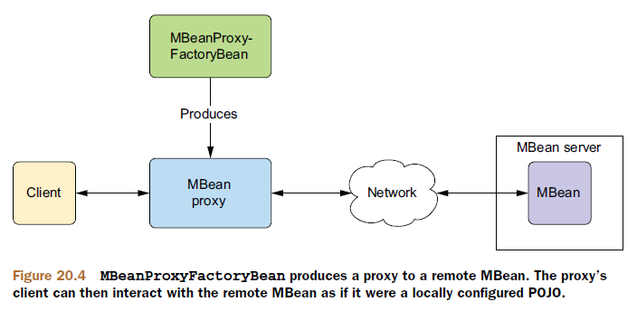
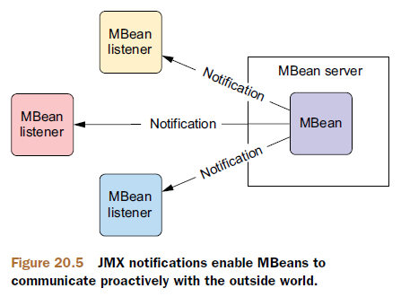

JMX能够让我们管理、监视和配置应用——甚至在应用的运行期间。

JMX管理应用的核心组件是MBean（Managed Bean）。所谓的MBean就是暴露特定方法的JavaBean，这些方法定义了管理接口。JMX规范定义了如下4种类型的MBean：

- 标准MBean：标准MBean的管理接口是通过在固定的接口上执行反射确定的，Bean类会实现这个接口；
- 动态MBean：动态MBean的管理接口是在运行时通过调用`DynamicMBean`接口的方法来确定的。因为管理接口不是通过静态接口定义的，因此可以在运行时改变；
- 开发MBean：开发MBean是一种特殊的动态MBean，其属性和方法只限定于原始类型、原始类型的包装类以及可以分解为原始类型或原始类型包装类的任意类型；
- 模型MBean：模型MBean也是一种特殊的动态MBean，用于充当管理接口与受管资源的中介。模型MBean并不像它们所声明的那样来编写。它们通常通过工厂生成，工厂会使用元信息来组装管理接口。

# 将Spring Bean导出为MBean

Spring的`MBeanExporter`可以把一个或多个Spring Bean导出为MBean服务器（MBean Server）内的模型MBean。MBean服务器（也称为MBean代理）是MBean生存的容器，对MBean的访问，是通过MBean服务器来实现的。


将Spring Bean导出为JMX MBean之后，可以使用基于JMX的管理工具（例如JConsole或VisualVM）查看正在运行的应用程序，显示Bean的属性并调用Bean的方法。

下面注册了一个`MBeanExporter`，它会将`spittleController` Bean导出为一个模型MBean：

```java
@Bean
public MBeanExporter mbeanExporter(SpittleController spittleController) {
  MBeanExporter exporter = new MBeanExporter();
  Map<String, Object> beans = new HashMap<String, Object>();
  beans.put("spitter:name=SpittleController", spittleController);
  exporter.setBeans(beans);
  return exporter;
}
```

每个`Map`条目的key就是MBean的名称（由管理域名字和一个key-value对组成）。

> 根据以上配置，`MBeanExporter`会假设它正在一个且只有一个应用服务器（例如Tomcat）或提供MBean服务器的其他上下文中运行。但是，如果Spring应用程序是独立的应用或运行的容器没有提供MBean服务器，我们就需要在Spring上下文中配置一个MBean服务器。
>
> 在XML配置中，`<context:mbean-server>`元素可以为我们实现该功能。如果使用Java配置的话，就是直接配置类型为`MBeanServerFactoryBean`的Bean。
>
> `MBeanServerFactoryBean`会创建一个MBean服务器，并将其作为Spring应用上下文中的Bean。默认情况下，这个Bean的ID是`mbeanServer`。了解到这一点，我们就可以将它装配到`MBeanExporter`的`server`属性中用来指定MBean要暴露到哪个MBean服务器中。
>
> ```xml
> <beans>
>   <bean id="mbeanServer" 
>         class="org.springframework.jmx.support.MBeanServerFactoryBean"/>
> 
>   <!--
>     this bean needs to be eagerly pre-instantiated in order for the exporting to occur;
>     this means that it must not be marked as lazily initialized
>     -->
>   <bean id="exporter" class="org.springframework.jmx.export.MBeanExporter">
>     <property name="beans">
>       <map>
>         <entry key="bean:name=testBean1" value-ref="testBean"/>
>       </map>
>     </property>
>     <property name="server" ref="mbeanServer"/>
>   </bean>
> 
>   <bean id="testBean" class="org.springframework.jmx.JmxTestBean">
>     <property name="name" value="TEST"/>
>     <property name="age" value="100"/>
>   </bean>
> </beans>
> ```

SpittleController.java：

```java
@Controller
@RequestMapping("/spittles")
public class SpittleController {
  public static final int DEFAULT_SPITTLES_PER_PAGE = 25;
  private int spittlesPerPage = DEFAULT_SPITTLES_PER_PAGE;
  private SpittleRepository spittleRepository;
  
  public void setSpittlesPerPage(int spittlesPerPage) {
    this.spittlesPerPage = spittlesPerPage;
  }
  public int getSpittlesPerPage() {
    return spittlesPerPage;
  }
  
  @Autowired
  public SpittleController(SpittleRepository spittleRepository) {
    this.spittleRepository = spittleRepository;
  }
  
  @RequestMapping(method=RequestMethod.GET)
  public String spittles(Model model) {
    model.addAttribute(spittleRepository.findSpittles(Long.MAX_VALUE, 20));
    return "spittles";
  }
}
```

默认情况下，`SpittleController`所有的public成员都将被导出为MBean的操作或属性。为了对MBean的属性和操作获得更细粒度的控制，Spring提供了几种选择：

- 通过名称来声明需要暴露或忽略的Bean方法；
- 通过为Bean增加接口来选择要暴露的方法；
- 通过标注来标识托管的属性和方法。

> 要暴露属性，只需要暴露它的存取器方法

## 通过名称暴露方法

`MethodNameBasedMBeanInfoAssembler` MBean信息装配器有一个`managedMethods`属性可以接受一个方法名称列表，用于指定哪些方法将暴露为MBean的操作。

```java
@Bean
public MethodNameBasedMBeanInfoAssembler assembler() {
  MethodNameBasedMBeanInfoAssembler assembler =
    new MethodNameBasedMBeanInfoAssembler();
  assembler.setManagedMethods(new String[] {
    "getSpittlesPerPage", "setSpittlesPerPage"
  });
  return assembler;
}
```

本示例所暴露的是`spittlesPerPage`属性的存取器方法，也就是将`spittlesPerPage`属性暴露为MBean的托管属性。而`spittles`方法则不会暴露为MBean的操作。

这个装配器只是告诉哪些方法要暴露为MBean的操作，但没有具体指定是哪些Bean的方法。因此，我们还需要将它装配进`MBeanExporter`中：

```java
@Bean
public MBeanExporter mbeanExporter(SpittleController spittleController,
                                   MBeanInfoAssembler assembler) {
  MBeanExporter exporter = new MBeanExporter();
  Map<String, Object> beans = new HashMap<String, Object>();
  beans.put("spitter:name=SpittleController", spittleController);
  exporter.setBeans(beans);
  exporter.setAssembler(assembler);
  return exporter;
}
```

另一个基于方法名称的装配器是`MethodExclusionMBeanInfoAssembler`，它是`MethodNameBasedMBeanInfoAssembler`的反操作，它指定不需要暴露为MBean托管操作的方法名称列表：

```java
@Bean
public MethodExclusionMBeanInfoAssembler assembler() {
  MethodExclusionMBeanInfoAssembler assembler =
    new MethodExclusionMBeanInfoAssembler();
  assembler.setIgnoredMethods(new String[] {
    "spittles"
  });
  return assembler;
}
```

## 使用接口定义MBean的操作和属性

基于方法名称的装配器虽然简单、直接，但如果需要把多个Spring Bean导出为MBean，则为装配器所配置的方法名称列表将会变得非常庞大；而且，如果希望暴露一个Bean的某个方法，但不希望暴露另一个Bean的同名方法，基于方法名称的方式将不能很好满足需要。这时，使用`InterfaceBasedMBeanInfoAssembler`，通过使用接口来选择Bean的哪些方法需要暴露为MBean的操作和属性将更合适。

假设我们定义了如下接口：

```java
public interface SpittleControllerManagedOperations {
  int getSpittlesPerPage();
  void setSpittlesPerPage(int spittlesPerPage);
}
```

这里我们选择暴露`getSpittlesPerPage`方法和`setSpittlesPerPage`方法。

然后，使用如下的装配器替换之前基于方法名称的装配器：

```java
@Bean
public InterfaceBasedMBeanInfoAssembler assembler() {
  InterfaceBasedMBeanInfoAssembler assembler =
    new InterfaceBasedMBeanInfoAssembler();
  assembler.setManagedInterfaces(
    new Class<?>[] { SpittleControllerManagedOperations.class }
  );
  return assembler;
}
```

需要注意的是：`SpittleController`并不需要显式实现`SpittleControllerManagedOperations`接口。这个接口只是为了标识导出的内容，我们并不需要在代码中直接实现该接口。但是，为了MBean与实现类之间有一个一致的协议，建议实现这个接口。

## 使用标注驱动的MBean

`MetadataMBeanInfoAssembler`装配器可以使用标注标识哪些Bean的方法需要暴露为MBean的托管操作和属性。但是，直接使用这种装配器手工装配非常繁杂。相反，我们应该使用Spring Context配置命名空间中的`<context:mbean-export>`元素，它装配了MBean导出器以及为了在Spring启用标注驱动的MBean所需要的装配器。我们要做的就是使用它来替换之前所使用的`MBeanExporter` Bean：

```xml
<context:mbean-export server="mbeanServer" />
```

现在，要把任意Spring Bean转变为MBean，只需要使用`@ManagedResource`标注Bean，并使用`@ManagedOperation`或`@ManagedAttribute`标注需要暴露为MBean操作的Bean方法：

```java
@Controller
@ManagedResource(objectName="spitter:name=SpittleController") //将SpittleController导出为MBean
public class SpittleController {
  ...
  @ManagedAttribute //将spittlesPerPage暴露为托管属性
  public void setSpittlesPerPage(int spittlesPerPage) {
    this.spittlesPerPage = spittlesPerPage;
  }
  @ManagedAttribute //将spittlesPerPage暴露为托管属性
  public int getSpittlesPerPage() {
    return spittlesPerPage;
  }
}
```

`objectName`属性标识了域（`spitter`）和MBean的名称（`SpittleController`）。

如果托管属性是只读或只写的，只需要标注两个存取器方法中的一个。

我们还可以使用`@ManagedOperation`标注替换`@ManagedAttribute`标注来标注存取器方法：

```java
@ManagedOperation
public void setSpittlesPerPage(int spittlesPerPage) {
	this.spittlesPerPage = spittlesPerPage;
}
@ManagedOperation
public int getSpittlesPerPage() {
	return spittlesPerPage;
}
```

这会将方法暴露为MBean的托管操作，但是并不会把`spittlesPerPage`属性暴露为MBean的托管属性。

## 处理MBean冲突

MBean指定的对象名称是由管理域名和key-value对组成的，如果MBean服务器中不存在与我们MBean名字相同的已注册MBean，则我们的MBean注册时就不会有问题。但是如果名字冲突，默认情况下，`MBeanExporter`将抛出`InstanceAlreadyExistsException`异常。

我们可以通过`MBeanExporter`的`registrationBehaviorName`属性或者`<context:mbean-export>`的`registration`属性指定冲突处理机制来改变默认行为。

Spring提供了3种处理MBean名字冲突的机制：

- `FAIL_ON_EXISTING`：如果已存在同名的MBean，则失败（默认行为）；
- `IGNORE_EXISTING`：忽略冲突，同时也不注册新的MBean；
- `REPLACTING_EXISTING`：用新的MBean覆盖已存在的MBean。

```java
@Bean
public MBeanExporter mbeanExporter(SpittleController spittleController,
                                   MBeanInfoAssembler assembler) {
  MBeanExporter exporter = new MBeanExporter();
  Map<String, Object> beans = new HashMap<String, Object>();
  beans.put("spitter:name=SpittleController", spittleController);
  exporter.setBeans(beans);
  exporter.setAssembler(assembler);
  exporter.setRegistrationPolicy(RegistrationPolicy.IGNORE_EXISTING);
  return exporter;
}
```

# 远程MBean

现在我们已使用`MBeanExporter`注册了我们的MBean，我们还需要一种方式来访问它们并进行管理。正如之前所看到的，我们可以使用诸如JConsole之类的工具来访问本地的MBean服务器，进而显示和操纵MBean，但是像JConsole之类的工具并不适合在程序中对MBean进行管理。幸运的是，还存在另一种方式可以把MBean作为远程对象进行访问。

## 暴露远程MBean

使MBean成为远程对象的最简单方式是配置Spring的`ConnectorServerFactoryBean`：

```java
@Bean
public ConnectorServerFactoryBean connectorServerFactoryBean() {
	return new ConnectorServerFactoryBean();
}
```

`ConnectorServerFactoryBean`会创建和启动JSR-160 `JMSConnectorServer`。默认情况下，服务器使用JMXMP协议并监听9875端口号，即它将绑定`service:jmx:jmxmp://localhost:9875`。

除了JMXMP协议外，根据不同JMX实现，我们有多种远程访问协议可供选择，包括RMI、SOAP、Hessian/Burlap、IIOP等。为MBean绑定不同的远程访问协议，我们仅需要设置`ConnectorServerFactoryBean`的`serviceUrl`属性。例如，使用RMI远程访问MBean：

```java
@Bean
public ConnectorServerFactoryBean connectorServerFactoryBean() {
  ConnectorServerFactoryBean csfb = new ConnectorServerFactoryBean();
  csfb.setServiceUrl("service:jmx:rmi://localhost/jndi/rmi://localhost:1099/spitter");
  return csfb;
}
```

在这里，我们将`ConnectorServerFactoryBean`绑定到一个RMI注册表，该注册表监听本机的1099端口。这意味着我们需要一个RMI注册表运行时，并监听该端口。在本示例中我们不使用`RmiServiceExporter`，而是通过在Spring中声明`RmiRegistryFactoryBean`来启动一个RMI注册表：

```java
@Bean
public RmiRegistryFactoryBean rmiRegistryFB() {
  RmiRegistryFactoryBean rmiRegistryFB = new RmiRegistryFactoryBean();
  rmiRegistryFB.setPort(1099);
  return rmiRegistryFB;
}
```

## 访问远程MBean

要想访问远程MBean服务器，我们需要在Spring上下文中配置`MBeanServerConnectionFactoryBean`：

```java
@Bean
public MBeanServerConnectionFactoryBean connectionFactoryBean() {
  MBeanServerConnectionFactoryBean mbscfb = new MBeanServerConnectionFactoryBean();
  mbscfb.setServiceUrl("service:jmx:rmi://localhost/jndi/rmi://localhost:1099/spitter");
  return mbscfb;
}
```

由`MBeanServerConnectionFactoryBean`所生成的`MBeanServerConnection`实际上是作为远程MBean服务器的本地代理，它能够以`MBeanServerConnection`形式注入到其他Bean的属性中：

```java
@Bean
public JmxClient jmxClient(MBeanServerConnection connection) {
  JmxClient jmxClient = new JmxClient();
  jmxClient.setMbeanServerConnection(connection);
  return jmxClient;
}
```

获取远程MBean服务器中已注册的MBean数量：

```java
int mbeanCount = mbeanServerConnection.getMBeanCount();
```

查询远程MBean服务器中所有MBean的名称：

```java
java.util.Set mbeanNames = mbeanServerConnection.queryNames(null, null);
```

获取MBean属性的值：

```java
String cronExpression = mbeanServerConnection.getAttribute(
  new ObjectName("spitter:name=SpittleController"), "spittlesPerPage");
```

改变MBean属性的值：

```java
mbeanServerConnection.setAttribute(
  new ObjectName("spitter:name=SpittleController"),
  new Attribute("spittlesPerPage", 10));
```

调用MBean的操作：

```java
mbeanServerConnection.invoke(
  new ObjectName("spitter:name=SpittleController"),
  "setSpittlesPerPage",
  new Object[] { 100 },
  new String[] {"int"});
```

## 代理MBean

直接使用`MBeanServerConnection`访问远程的MBean是一种很笨拙的方法。为了更直接地调用远程MBean的方法，我们需要代理远程MBean。

Spring的`MBeanProxyFactoryBean`是一个代理工厂Bean，它可以让我们直接访问远程的MBean，就如同配置在本地的其他Bean一样。



```java
@Bean
public MBeanProxyFactoryBean remoteSpittleControllerMBean(
  	MBeanServerConnection mbeanServerClient) {
  MBeanProxyFactoryBean proxy = new MBeanProxyFactoryBean();
  proxy.setObjectName("spitter:name=SpittleController"); //指定远程MBean的对象名称
  proxy.setServer(mbeanServerClient);
  proxy.setProxyInterface(SpittleControllerManagedOperations.class); //指定了代理需要实现的接口
  return proxy;
}
```

现在，类型为`SpittleControllerManagedOperations`的任意Bean属性，都可以用`remoteSpittleControllerMBean` Bean来注入，它将代理远程的MBean。使用起来就像是本地配置的Bean。

# JMX通知

JMX通知（Notification）是MBean与外部世界**主动**通信的一种方法，而不是等待外部应用对MBean进行查询以获得信息。



## 发布通知

Spring通过`NotificationPublisherAware`接口提供了发送JMX通知的支持。任何希望发送通知的MBean都必须实现这个接口。

例如，我们希望每发布一百万Spittle时，发布一个JMX通知：

```java
@Component
@ManagedResource("spitter:name=SpitterNotifier")
@ManagedNotification(notificationTypes="SpittleNotifier.OneMillionSpittles",
                     name="TODO")
public class SpittleNotifierImpl
  	implements NotificationPublisherAware, SpittleNotifier {
  private NotificationPublisher notificationPublisher;
  public void setNotificationPublisher(
    	NotificationPublisher notificationPublisher) { //注入notificationPublisher
    this.notificationPublisher = notificationPublisher;
  }
  public void millionthSpittlePosted() {
    notificationPublisher.sendNotification( //发送JMX通知
      new Notification(SpittleNotifier.OneMillionSpittles", this, 0));
  }
}
```

这样，只要到达一百万Spittle时，调用`millionthSpittlePosted`方法，就会发布一个JMX通知。

## 监听通知

接收MBean通知的标准方法是使用`MBeanExporter`注册一个实现`javax.management.NotificationListener`接口的监听器。

首先，实现监听器：

```java
public class PagingNotificationListener implements NotificationListener {
  public void handleNotification(Notification notification, Object handback) {
    // ...
  }
}
```

当接收到JMX通知时，将会调用`handleNotification`方法处理通知。

然后，使用`MBeanExporter`注册`PagingNotificationListener`：

```java
@Bean
public MBeanExporter mbeanExporter() {
  MBeanExporter exporter = new MBeanExporter();
  Map<?, NotificationListener> mappings = new HashMap<?, NotificationListener>();
  mappings.put("Spitter:name=PagingNotificationListener",
               new PagingNotificationListener());
  exporter.setNotificationListenerMappings(mappings);
  return exporter;
}
```

`MBeanExporter`的`setNotificationListenerMappings`属性用于在监听器和监听器所希望监听的MBean之间建立映射。