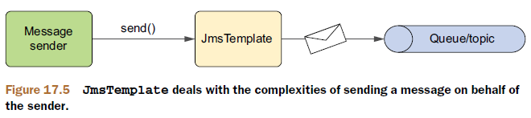
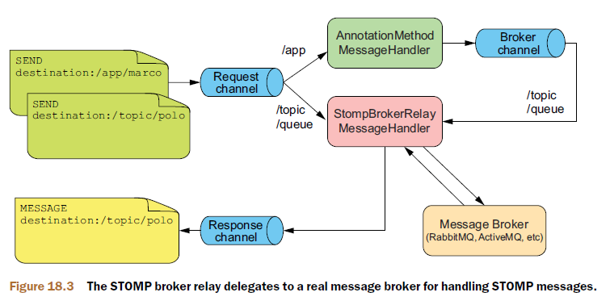

像RMI、HTTP invoker等远程调用机制，以及Web服务、RESTful都是同步通信，而消息则属于异步通信。

在异步消息中有两个主要概念：消息代理（message broker）和目的地（destination）。

当一个应用发送信息时，会将消息交给一个消息代理（相当于邮局）。消息代理可以确保消息被投递到指定的目的地，同时解放发送者，使其能够继续进行其他的业务。

有两种通用的目的地：队列（queue）和主题（topic）。它们分别对应两种消息模型：点对点模型和发布/订阅模型。

# 消息模型

## 点对点模型

在点对点模型中，每一条消息都有一个发送者，并且都只会被一个接收者接收。


尽管消息队列中中的每条消息只会被一个接收者取走，但是并不意味着只能使用一个接收者从队列中获取消息。事实上，通常会有多个接收者来处理队列中的消息。类似于银行排队办理业务一样，银行柜员类似于接收者。

在点对点模型中，如果有多个接收者监听队列，我们是无法知道某条特定消息会由哪一个接收者处理。

## 发布/订阅模型

在发布/订阅模型中，消息会发送给一个主题。与队列类似，多个接收者都可以监听一个主题。但是，与队列不同的是，消息不再是只投递给一个接收者，而是主题的所有订阅者都会接收到此消息的副本。类似于杂志发行商与杂志订阅者。


# JMS

JMS（Java Message Service）是一个Java标准，定义了使用消息代理的通用API。

## 安装消息代理

ActiveMQ是使用JMS进行异步消息传递的最佳选择。

首先，下载并解压发行包；

然后，在`解压目录/bin/指定操作系统子目录/`下，运行`activemq start`来启动ActiveMQ。

另外，要将解压目录下的`activemq-core-x.x.x.jar`添加到应用程序的类路径中，这样在应用程序中就可以使用ActiveMQ的API了。

## 创建连接工厂

应用程序需要借助JMS连接工厂通过消息代理发送消息，所以我们还要配置JMS连接工厂，让它知道如何连接到ActiveMQ。

```xml
<bean id="connectionFactory"
      class="org.apache.activemq.spring.ActiveMQConnectionFactory"
      p:brokerURL="tcp://localhost:60000"/>
```

如果省略`brokerURL`属性，则ActiveMQ代理默认监听`localhost`的61616端口。

另外，也可以使用ActiveMQ自己的Spring配置命名空间来声明连接工厂：

```xml
<?xml version="1.0" encoding="UTF-8"?>
<beans xmlns="http://www.springframework.org/schema/beans"
       xmlns:xsi="http://www.w3.org/2001/XMLSchema-instance"
       xmlns:jms="http://www.springframework.org/schema/jms"
       xmlns:amq="http://activemq.apache.org/schema/core"
       xsi:schemaLocation="http://activemq.apache.org/schema/core
                           http://activemq.apache.org/schema/core/activemq-core.xsd
                           http://www.springframework.org/schema/jms
                           http://www.springframework.org/schema/jms/spring-jms.xsd
                           http://www.springframework.org/schema/beans
                           http://www.springframework.org/schema/beans/spring-beans.xsd">
  <amq:connectionFactory id="connectionFactory"
                         brokerURL="tcp://localhost:61616"/>
  ...
</beans>
```

## 声明消息目的地

消息目的地可以是一个队列，也可以是一个主题，这取决于应用的需求。

### 声明队列

```xml
<bean id="spittleQueue"
      class="org.apache.activemq.command.ActiveMQQueue"
      c:_="spitter.queue" />
```

或者：

```xml
<amq:queue id="spittleQueue" physicalName="spittle.queue" />
```

### 声明主题

```xml
<bean id="spittleTopic"
      class="org.apache.activemq.command.ActiveMQTopic"
      c:_="spitter.topic" />
```

或者：

```xml
<amq:topic id="spittleTopic" physicalName="spittle.topic" />
```

## 使用传统的JMS

### 发送消息

```java
ConnectionFactory cf = new ActiveMQConnectionFactory("tcp://localhost:61616");
Connection conn = null;
Session session = null;
try {
  conn = cf.createConnection();
  session = conn.createSession(false, Session.AUTO_ACKNOWLEDGE);
  Destination destination = new ActiveMQQueue("spitter.queue");
  MessageProducer producer = session.createProducer(destination);
  TextMessage message = session.createTextMessage();
  message.setText("Hello world!");
  producer.send(message);
} catch (JMSException e) {
  // handle exception?
} finally {
  try {
    if (session != null) {
      session.close();
    }
    if (conn != null) {
      conn.close();
    }
  } catch (JMSException ex) {
  }
}
```

### 接收消息

```java
ConnectionFactory cf = new ActiveMQConnectionFactory("tcp://localhost:61616");
Connection conn = null;
Session session = null;
try {
  conn = cf.createConnection();
  conn.start();
  session = conn.createSession(false, Session.AUTO_ACKNOWLEDGE);
  Destination destination = new ActiveMQQueue("spitter.queue");
  MessageConsumer consumer = session.createConsumer(destination);
  Message message = consumer.receive();
  TextMessage textMessage = (TextMessage) message;
  System.out.println("GOT A MESSAGE: " + textMessage.getText());
  conn.start();
} catch (JMSException e) {
  // handle exception?
} finally {
  try {
    if (session != null) {
      session.close();
    }
    if (conn != null) {
      conn.close();
    }
  } catch (JMSException ex) {
  }
}
```

## 使用JmsTemplate

### 注册JmsTemplate Bean

```xml
<bean id="jmsTemplate"
      class="org.springframework.jms.core.JmsTemplate"
      c:_-ref="connectionFactory" />
```

#### 设置默认目的地

如果总是将消息发送给或接收自相同的目的地，则可以为`JmsTempate`装配一个默认的目的地。这样，每次发送或接收消息时就不需要指定一个目的地了：

```xml
<bean id="jmsTemplate"
      class="org.springframework.jms.core.JmsTemplate"
      c:_-ref="connectionFactory"
      p:defaultDestinationName="spittle.queue" />
```

`defaultDestinationName`属性只是指定了一个目的地的名称，它没有说明目的地是什么类型。如果已经存在该名称的队列或主题，就会使用已有的。否则，将会创建一个新的目的地（通常会是队列）。

如果想指定要创建的目的地类型，则需要使用`defaultDestination-ref`属性将之前创建的队列或主题的目的地Bean装配进来：

```xml
<bean id="jmsTemplate"
      class="org.springframework.jms.core.JmsTemplate"
      c:_-ref="connectionFactory"
      p:defaultDestination-ref="spittleTopic" />
```

现在调用`JmsTempate`的`send`方法时，我们可以省略目的地参数：

```java
jmsOperations.send(
  new MessageCreator() {
    ...
  }
);
```

### 发送消息

```java
public interface AlertService {
	void sendSpittleAlert(Spittle spittle);
}

public class AlertServiceImpl implements AlertService {
  private JmsOperations jmsOperations;
  @Autowired
  public AlertServiceImpl(JmsOperations jmsOperatons) {
    this.jmsOperations = jmsOperations;
  }
  public void sendSpittleAlert(final Spittle spittle) {
    jmsOperations.send(
      "spittle.queue",  //指定目的地
      new MessageCreator() {
        public Message createMessage(Session session) throws JMSException {
          return session.createObjectMessage(spittle); //创建消息
        }
      }
    );
  }
}
```

`JmsOperation`是`JmsTemplate`所实现的接口。



#### 对消息进行转换

除了`send`方法外，`JmsTemplate`还提供了`convertAndSend`方法，它不需要`MessageCreator`作为参数，而是使用内置的消息转换器为我们创建消息，然后发送消息。

```java
public void sendSpittleAlert(Spittle spittle) {
  jmsOperations.convertAndSend(spittle);
}
```

Spring提供的消息转换器：

| 消息转换器                      | 功能                                                         |
| ------------------------------- | ------------------------------------------------------------ |
| MappingJacksonMessageConverter  | 使用Jackson JSON库实现消息与JSON格式之间的相互转换。         |
| MappingJackson2MessageConverter | 使用Jackson 2 JSON库实现消息与JSON格式之间的相互转换。       |
| MarshallingMessageConverter     | 使用JAXB库实现消息与XML格式之间的相互转换。                  |
| SimpleMessageConverter          | 实现`String`与`TextMessage`之间，字节数组与`BytesMessage`，`Map`与`MapMessage`之间，`Serializable`对象与`ObjectMessage`之间的相互转换。 |

默认情况下，`JmsTemplate`在`convertAndSend`方法中使用`SimpleMessageConverter`。如果要自己指定消息转换器，则首先声明一个消息转换器Bean，例如：

```xml
<bean id="messageConverter"
  class="org.springframework.jms.support.converter.MappingJacksonMessageConverter" />
```

> 各个消息转换器可能会需要配置一些额外的属性。

然后，将其注入到`JmsTemplate` Bean中：

```xml
<bean id="jmsTemplate"
      class="org.springframework.jms.core.JmsTemplate"
      c:_-ref="connectionFactory"
      p:defaultDestinationName="spittle.alert.queue"
      p:messageConverter-ref="messageConverter" />
```

如果内置的消息转换器满足不了需求，则可以自己实现消息转换器，然后将其注入到`JmsTemplate` Bean中。自定义的消息转换器要实现`MessageConverter`接口。

### 接收消息

#### 同步接收

```java
public Spittle receiveSpittleAlert() {
  try {
    ObjectMessage receivedMessage =
      (ObjectMessage) jmsOperations.receive(); //从默认目的地接收消息
    return (Spittle) receivedMessage.getObject();
  } catch (JMSException jmsException) { //由gerObject()抛出
    throw JmsUtils.convertJmsAccessException(jmsException); //抛出转换后的非检查型异常
  }
}
```


`receive`方法会尝试从消息代理中获取一条消息，如果没有可用的消息，它会一直等待，直到获得消息（或超时）为止。

`JmsTemplate`只能处理自己方法抛出的`JMSException`异常，它无法处理`ObjectMessage`的`getObject`方法所抛出的`JMSException`异常。因此，我们要么捕获`JMSException`异常，要么声明抛出`JMSException`异常。这里，使用Spring中JmsUtils的`convertJmsAccessException`方法把检查型异常`JMSException`转换为非检查型异常`JmsException`。

同步接收消息也可以使用消息转换器，也就是使用`JmsTemplate`的`receiveAndConvert`方法。

```java
public Spittle retrieveSpittleAlert() {
	return (Spittle) jmsOperations.receiveAndConvert();
}
```

现在没有必要将`Message`转换为`ObjectMessage`，也没有必要通过调用`getObject`方法来获取`Spittle`，更无需担心检查型异常`JMSException`。

使用`JmsTemplate`接收消息的最大缺点在于`receive`方法和`receiveAndConvert`方法都是同步的，它们会一直阻塞，直到有可用消息（或者直到超时）。

## 使用消息驱动POJO：异步接收

### 创建消息监听器

Spring的消息监听器类就是一个POJO：

```java
public class SpittleAlertHandler {
  public void handleSpittleAlert(Spittle spittle) { //处理方法
    // ... implementation goes here...
  }
}
```

### 配置消息监听器

首先，将上面创建的消息监听器类配置成Bean：

```xml
<bean id="spittleHandler"
      class="com.habuma.spittr.alerts.SpittleAlertHandler" />
```

然后，把这个Bean注册为消息监听器：

```xml
<jms:listener-container connection-factory="connectionFactory">
  <jms:listener destination="spitter.queue"
                ref="spittleHandler" method="handleSpittleAlert" />
</jms:listener-container>
```

消息监听器容器是一个特殊Bean，它可以监控JMS目的地并等待消息到达。一旦有消息到达，它取出消息，然后把消息传给任意一个对此消息感兴趣的消息监听器。


`connection-factory`属性配置了对`connectionFactory`的引用，容器中每个消息监听器都使用这个连接工厂进行消息监听。在本例中，`connection-factory`属性可以移除，因为该属性的默认值就是`connectionFactory`。

另外，如果`ref`引用的Bean实现了`MessageListener`接口，则`method`属性也可移除，这时默认就是`onMessage`方法。

## 使用基于消息的RPC

现在我们将了解一下如何使用JMS作为传输通道来进行远程调用。

为了支持基于消息的RPC，Spring提供了`JmsInvokerServiceExporter`，它可以把Bean导出为基于消息的服务；为客户端提供了`JmsInvokerProxyFactoryBean`来使用这些服务。

### 导出基于JMS的服务

要导出的服务：

```java
public interface AlertService {
	void sendSpittleAlert(Spittle spittle);
}

@Component("alertService")
public class AlertServiceImpl implements AlertService {
  private JavaMailSender mailSender;
  private String alertEmailAddress;
  public AlertServiceImpl(JavaMailSender mailSender,
                          String alertEmailAddress) {
    this.mailSender = mailSender;
    this.alertEmailAddress = alertEmailAddress;
  }
  public void sendSpittleAlert(final Spittle spittle) {
    SimpleMailMessage message = new SimpleMailMessage();
    String spitterName = spittle.getSpitter().getFullName();
    message.setFrom("noreply@spitter.com");
    message.setTo(alertEmailAddress);
    message.setSubject("New spittle from " + spitterName);
    message.setText(spitterName + " says: " + spittle.getText());
    mailSender.send(message);
  }
}
```

配置`JmsInvokerServiceExporter`：

```xml
<bean id="alertServiceExporter"
      class="org.springframework.jms.remoting.JmsInvokerServiceExporter"
      p:service-ref="alertService"
      p:serviceInterface="com.habuma.spittr.alerts.AlertService" />
```

`JmsInvokerServiceExporter`可以充当JMS监听器，因此，我们使用`<jms:listener-container>`配置它：

```xml
<jms:listener-container connection-factory="connectionFactory">
  <jms:listener destination="spitter.queue"
                ref="alertServiceExporter" />
</jms:listener-container>
```

这样，基于JMS的服务就准备好了，它将等待`spitter.queue`队列中RPC消息的到达。

### 使用基于JMS的服务

在客户端配置`JmsInvokerProxyFactoryBean`代理来访问JMS服务：

```xml
<bean id="alertService"
      class="org.springframework.jms.remoting.JmsInvokerProxyFactoryBean"
      p:connectionFactory-ref="connectionFactory"
      p:queueName="spittle.queue"
      propp:serviceInterface="com.habuma.spittr.alerts.AlertService" />
```

# AMQP

与JMS不同，AMQP的生产者并不会直接将消息发布到队列中，AMQP在消息的生产者和传递信息的队列之间引入了一种间接的机制：Exchange。消息生产者将信息发布到一个Exchange，Exchange会绑定到一个或多个队列上，它负责将信息路由到队列上。


AMQP定义了四种不同类型的Exchange：

- Direct：如果消息的routing key与binding的routing key直接匹配的话，消息将会路由到该队列上；
- Topic：如果消息的routing key与binding的routing key符合通配符匹配，则消息将会路由到该队列上；
- Headers：如果消息参数表中的头信息和值都与binding参数表中相匹配，则消息将会路由到该队列上；
- Fanout：不管消息的routing key和参数表中的头信息/值是什么，消息将会路由到所有队列上。

另外，Exchange可以绑定到另一个Exchange上。

## 创建连接工厂

```xml
<?xml version="1.0" encoding="UTF-8"?>
<beans:beans xmlns="http://www.springframework.org/schema/rabbit"
             xmlns:beans="http://www.springframework.org/schema/beans"
             xmlns:xsi="http://www.w3.org/2001/XMLSchema-instance"
             xsi:schemaLocation="http://www.springframework.org/schema/rabbit
                                 http://www.springframework.org/schema/rabbit/spring-rabbit-1.0.xsd
                                 http://www.springframework.org/schema/beans
                                 http://www.springframework.org/schema/beans/spring-beans.xsd">
  <connection-factory id="connectionFactory"
                      host="${rabbitmq.host}"
                      port="${rabbitmq.port}"
                      username="${rabbitmq.username}"
                      password="${rabbitmq.password}" />
  ...
</beans:beans>
```

`host`、`port`、`username`和`password`都是可选，如果省略，则RabbitMQ默认监听`localhost`的5672端口，并且用户名和密码均为`guest`。

## 声明队列、Exchange以及binding

在JMS中，队列和主题的路由行为都是通过规范建立的，而AMQP则不同，它的路由方式可通过队列、Exchange以及binding的各种组合实现。

例如：点对点模型

```xml
<admin connection-factory="connectionFactory" />
<queue id="spittleAlertQueue" name="spittle.alerts" />
```

这里会有一个默认的没有名称的Direct Exchange，所有队列都会绑定到这个Exchange上，并且routing key与队列的名称相同。

更复杂的例子：

```xml
<admin connection-factory="connectionFactory" />
<queue name="spittle.alert.queue.1" />
<queue name="spittle.alert.queue.2" />
<queue name="spittle.alert.queue.3" />
<fanoutexchange name="spittle.fanout">
  <bindings>
    <binding queue="spittle.alert.queue.1" />
    <binding queue="spittle.alert.queue.2" />
    <binding queue="spittle.alert.queue.3" />
  </bindings>
</fanoutexchange>
```

## 发送消息

### 注册RabbitTemplate

```xml
<template id="rabbitTemplate" connection-factory="connectionFactory" />
```

### 使用convertAndSend方法发送消息

```java
public class AlertServiceImpl implements AlertService {
  private RabbitTemplate rabbit;
  @Autowired
  public AlertServiceImpl(RabbitTemplate rabbit) {
    this.rabbit = rabbit;
  }
  public void sendSpittleAlert(Spittle spittle) {
    rabbit.convertAndSend("spittle.alert.exchange", //Exchange名称
                          "spittle.alerts",  //routing key
                          spittle);  //发送的对象
  }
}
```

另外，如果在`<template`上使用`exchange`和`routing-key`属性配置默认的Exchange名称和routint key，则在调用`convertAndSend`方法时，可以省略前两个参数：

```xml
<template id="rabbitTemplate"
          connection-factory="connectionFactory"
          exchange="spittle.alert.exchange"
          routing-key="spittle.alerts" />
```

则：

```java
rabbit.convertAndSend(spittle);
```

最后，如果在`<template>`和`convertAndSend`方法中均未指定Exchange名称和routing key，则Exchange名称和routing key均默认为空。

通过`convertAndSend`方法指定的Exchange名称和routing key，将覆盖`<template>`的相应配置。

`convertAndSend`方法会自动将对象转换为`Message`对象。它需要借助一个消息转换器来完成该转换，默认的消息转换器是`SimpleMessageConverter`，它适用于`String`、`Serializable`实例以及字节数组。

### 使用send方法发送消息

我们还可以使用较低级的`send`方法来直接发送`org.springframework.amqp.core.Message`对象：

```java
Message helloMessage =
  new Message("Hello World!".getBytes(), new MessageProperties());
rabbit.send("hello.exchange", "hello.routing", helloMessage);
```

## 接收消息

### 使用RabbitTemplate来同步接收消息

#### 注册RabbitTemplate

```xml
<template id="rabbitTemplate"
          connection-factory="connectionFactory"
          exchange="spittle.alert.exchange"
          routing-key="spittle.alerts"
          queue="spittle.alert.queue" />
```

#### 使用receive方法接收消息

```java
Message message = rabbit.receive();
```

`receive`方法的其他重载版本可以显式指定Exchange名称和routing key来覆盖`<tempate>`中的配置。

```java
Message message = rabbit.receive("spittle.alert.queue2");
```

#### 使用receiveAndConvert方法接收消息

`receiveAndConvert`方法会使用与`sendAndConvert`方法相同的消息转换器，来将`Message`对象转换为原始的类型。

```java
Spittle spittle = (Spittle) rabbit.receiveAndConvert();
```

#### 管理轮询

调用`receive`和`receiveAndConvert`方法都会立即返回。如果队列中没有等待的消息时，将会得到`null`。这就需要我们来管理轮询（polling）以及必要的线程，实现队列的监控。

### 使用消息驱动的POJO来异步接收消息

我们并非必须同步轮询并等待消息到达，Spring AMQP还提供了消息驱动POJO的支持。

#### 创建消息监听器POJO类

我们可以完全重用JMS的消息监听器POJO类——`SpittleAlertHandler`，因为它丝毫没有依赖于JMS或AMQP。

```java
public class SpittleAlertHandler {
  public void handleSpittleAlert(Spittle spittle) {
    // ... implementation goes here ...
  }
}
```

#### 配置消息监听器

首先，将上面创建的消息监听器类配置成Bean（与配置JMS消息监听器完全相同）：

```xml
<bean id="spittleListener"
      class="com.habuma.spittr.alert.SpittleAlertHandler" />
```

然后，把这个Bean注册为消息监听器：

```xml
<rabbit:listener-container connection-factory="connectionFactory">
  <rabbit:listener ref="spittleListener"
                   method="handleSpittleAlert"
                   queue-names="spittle.alert.queue" />
</rabbit:listener-container>
```

`queue-names`可以设置多个队列的名称，用逗号分割。

另外，还可以使用`queues`属性来引用一个或多个（用逗号分割）使用`<queue>`元素声明要监听的队列Bean。

```xml
<listener-container connection-factory="connectionFactory">
  <listener ref="spittleListener"
            method="handleSpittleAlert"
            queues="spittleAlertQueue" />
</listener-container>

<queue id="spittleAlertQueue" name="spittle.alert.queue" />
```

# WebSocket

JMS和AMQP是用于应用程序之间的通讯，而如果某个应用是运行在Web浏览器中，则就需要使用WebSocket。

WebSocket协议提供了通过一个套接字实现全双工通信（服务器和浏览器可以互相发送消息）的功能，位于WebSocket一端的应用发送消息，另一端处理消息。因为它是全双工的，所以每一端都可以发送和处理消息。


WebSocket通信可以应用于任何类型的应用中，但是它最常见的应用场景是实现Web浏览器和服务器之间的异步通信。浏览器中的JavaScript客户端开启一个到服务器的连接，服务器通过这个连接发送更新给浏览器。相比历史上轮询服务端以查找更新的方案，这种技术更加高效和自然。

## 使用Spring的低层级WebSocket API

### 创建消息处理器

WebSocket消息处理器是一个实现了`WebSocketHandler`接口的类。

`WebSocketHandler`接口：

```java
public interface WebSocketHandler {
  void afterConnectionEstablished(WebSocketSession session) 
    throws Exception;
  void handleMessage(WebSocketSession session, WebSocketMessage<?> message) 
    throws Exception;
  void handleTransportError(WebSocketSession session, Throwable exception) 
    throws Exception;
  void afterConnectionClosed(WebSocketSession session, CloseStatus closeStatus) 
    throws Exception;
  boolean supportsPartialMessages();
}
```

通常，创建消息处理器更简便的方法是扩展`AbstractWebSocketHandler`抽象类：

```java
public class MarcoHandler extends AbstractWebSocketHandler {
  private static final Logger logger = LoggerFactory.getLogger(MarcoHandler.class);
  protected void handleTextMessage(WebSocketSession session, TextMessage message) 
    	throws Exception {
    logger.info("Received message: " + message.getPayload());
    Thread.sleep(2000); //模拟延时
    session.sendMessage(new TextMessage("Polo!")); //发送文本消息
  }
}
```

`AbstractWebSocketHandler`额外定义了三个方法：

- handleBinaryMessage()
- handlePongMessage()
- handleTextMessage()

这三个方法只是`handleMessage()`的具体化，每个方法对应于某一种特定类型的消息。

如果只是处理文本消息，则可扩展`TextWebSocketHandler`类。

### 启用WebSocket

启用WebSocket并注册消息处理器：

```java
@EnableWebSocket
public class WebSocketConfig implements WebSocketConfigurer {
  @Override
  public void registerWebSocketHandlers(WebSocketHandlerRegistry registry) {
    registry.addHandler(marcoHandler(), "/marco"); //将MarcoHandler映射到“/marco”
  }
  @Bean
  public MarcoHandler marcoHandler() {
    return new MarcoHandler();
  }
}
```

或者：

```xml
<?xml version="1.0" encoding="UTF-8"?>
<beans xmlns="http://www.springframework.org/schema/beans"
       xmlns:xsi="http://www.w3.org/2001/XMLSchema-instance"
       xmlns:websocket="http://www.springframework.org/schema/websocket"
       xsi:schemaLocation="
         http://www.springframework.org/schema/websocket
         http://www.springframework.org/schema/websocket/spring-websocket.xsd
         http://www.springframework.org/schema/beans
         http://www.springframework.org/schema/beans/spring-beans.xsd">
  <websocket:handlers>
    <websocket:mapping handler="marcoHandler" path="/marco" />
  </websocket:handlers>
  <bean id="marcoHandler"
        class="marcopolo.MarcoHandler" />
</beans>
```

### JavaScript客户端

```javascript
var url = 'ws://' + window.location.host + '/websocket/marco';
var sock = new WebSocket(url); //打开WebSocket
sock.onopen = function() { //处理连接开启事件
  console.log('Opening');
  sayMarco();
};
sock.onmessage = function(e) { //处理消息
  console.log('Received message: ', e.data);
  setTimeout(function(){sayMarco()}, 2000);
};
sock.onclose = function() { //处理连接关闭事件
  console.log('Closing');
};
function sayMarco() {
  console.log('Sending Marco!');
  sock.send("Marco!"); //发送消息
}
```

URL使用了`ws://`前缀，表明这是一个基本的WebSocket连接。如果是安全WebSocket，则使用`wss://`前缀。

### 关闭WebSocket连接

下列三种场景均可关闭WebSocket连接：

- 客户端调用`sock.close()`；
- 服务器端调用`session.close()`；
- 浏览器转向其他页面。

## 应对不支持WebSocket的场景——SockJS

当前不支持WebSocket场景主要由下列三种原因造成：

- 某些浏览器不支持WebSocket；
- 某些应用服务器不支持WebSocket；
- 防火墙限制了WebSocket通信。

SockJS是WebSocket技术的一种模拟，在表面上，它尽可能对应WebSocket API，但是在底层它非常智能。SockJS会优先选用WebSocket，但是如果WebSocket不可用，则它会从如下方案中挑选最优的可行方案：

- XHR流
- XDR流
- iFrame事件源
- iFrame HTML文件
- XHR轮询
- XDR轮询
- iFrame XHR轮询
- JSONP轮询

### 在服务端启用SockJS

```java
@Override
public void registerWebSocketHandlers(WebSocketHandlerRegistry registry) {
	registry.addHandler(marcoHandler(), "/marco").withSockJS();
}
```

通过简单地调用`withSockJS`方法，就能声明我们想要使用的SockJS功能，如果WebSocket不可用，则SockJS的备用方案就会发挥作用。

或者使用XML来配置：

```xml
<websocket:handlers>
  <websocket:mapping handler="marcoHandler" path="/marco" />
  <websocket:sockjs />
</websocket:handlers>
```

### 在客户端启用SockJS

#### 加载SockJS客户端库

```html
<script src="http://cdn.sockjs.org/sockjs-0.3.min.js"></script>
```

#### 编写客户端代码

只需要在原来基于WebSocket API的代码上修改两行代码就可以使用SockJS：

```javascript
var url = 'marco';
var sock = new SockJS(url);
```

第一个修改就是URL。SockJS所处理的URL是`http://`或`https://`模式，而不是`ws://`或`wss://`。而且可以使用相对URL，如果包含JavaScript的页面位于http://localhost:8080/websocket ，则本例给定的相对路径`marco`将对应于http://localhost:8080/websocket/marco。

第二个修改是创建SockJS实例代替WebSocket。

## 使用STOMP消息

直接使用WebSocket（或SockJS）就类似于使用TCP套接字来编写Web应用，显得过于低级。因为没有高层级的线路协议（wire protocol），因此就需要我们定义应用之间所发送消息的语义，还需要确保连接的两端都能遵循这些语义。

STOMP在WebSocket之上提供了一个基于帧的线路格式（frame-based wire format）层，用来定义消息的语义。

相比于使用原始的WebSocket，使用STOMP能够带来以下好处：

- 无需发明自定义消息传递协议和消息格式。
- 有可用的STOMP客户端，包括Spring Framework中的Java客户端。
- 您可以（可选）使用现成的消息代理（例如RabbitMQ，ActiveMQ等）来管理订阅和广播消息。
- 可以在任意数量的`@Controller`实例中组织应用程序逻辑，并且可以基于STOMP `destination`头将消息路由到它们，而无须使用给定连接的单个`WebSocketHandler`来处理原始WebSocket消息。
- 您可以使用Spring Security根据STOMP`destination`和消息类型来保护消息。

STOMP帧在HTTP上建模，由命令、一个或多个头信息以及负载（payloads）所组成，非常类似于HTTP请求结构：

```
COMMAND
header1:value1
header2:value2

Body^@
```

例如：客户端发送消息的STOMP帧

```
SEND
destination:/app/marco
content-length:20

{\"message\":\"Marco!\"}^@
```

客户端订阅消息的STOMP帧：

```
SUBSCRIBE
id:sub-1
destination:/topic/price.stock.*

^@
```

STOMP服务器广播消息的STOMP帧：（STOMP服务器可以使用MESSAGE命令向所有订阅客户端广播消息）

```
MESSAGE
message-id:nxahklf6-1
subscription:sub-1
destination:/topic/price.stock.MMM

{"ticker":"MMM","price":129.45}^@
```

> 服务器无法发送未经请求的消息给客户端。也就是说，所有来自服务器的消息都必须响应特定的客户端订阅，并且服务器消息的subscription头必须与客户端订阅的id头匹配。

尽管STOMP是一种面向文本的协议，但消息负载可以是文本或二进制。

Spring为STOMP消息提供了基于Spring MVC的编程模型，在Spring MVC控制器中处理STOMP消息与处理HTTP请求并没有太大的差别。

### 启用STOMP消息功能

spring-messaging和spring-websocket模块提供WebSocket之上的STOMP 支持。一旦有了这些依赖项，就可以通过[SockJS Fallback](https://docs.spring.io/spring/docs/5.1.3.RELEASE/spring-framework-reference/web.html#websocket-fallback)在WebSocket上公开STOMP端点。

```java
@Configuration
@EnableWebSocketMessageBroker
public class WebSocketStompConfig extends AbstractWebSocketMessageBrokerConfigurer {
  @Override
  public void registerStompEndpoints(StompEndpointRegistry registry) {
    //将“/marcopolo”注册为STOMP端点，客户端在订阅或发布消息到目的地路径前，要连接该端点。
    registry.addEndpoint("/marcopolo").withSockJS();
  }
  @Override
  public void configureMessageBroker(MessageBrokerRegistry registry) {
    //使用内置消息代理进行订阅和广播，并将destination头以“/topic”或“/queue”开头的消息路由到代理。
    registry.enableSimpleBroker("/queue", "/topic");
    //destination头以“/app”为前缀的STOMP消息将路由到@Controller类中的@MessageMapping方法。
    registry.setApplicationDestinationPrefixes("/app");
  }
}
```

> 如果没有重写`configureMessageBroker`方法，则会自动配置一个简单的内存消息代理，用它来处理以`/topic`前缀的消息。只有需要显式配置一个消息代理时，才需要重写这个方法。

或者：

```xml
<beans xmlns="http://www.springframework.org/schema/beans"
       xmlns:xsi="http://www.w3.org/2001/XMLSchema-instance"
       xmlns:websocket="http://www.springframework.org/schema/websocket"
       xsi:schemaLocation="
         http://www.springframework.org/schema/beans
         http://www.springframework.org/schema/beans/spring-beans.xsd
         http://www.springframework.org/schema/websocket
         http://www.springframework.org/schema/websocket/spring-websocket.xsd">
  <websocket:message-broker application-destination-prefix="/app">
    <websocket:stomp-endpoint path="/marcopolo">
      <websocket:sockjs/>
    </websocket:stomp-endpoint>
    <websocket:simple-broker prefix="/queue, /topic"/>
  </websocket:message-broker>
</beans>
```


> 图中的三个消息通道如下：
>
> - clientInboundChannel：用于传递从WebSocket客户端接收到的消息。
> - clientOutboundChannel：用于将服务器消息发送到WebSocket客户端。
> - brokerChannel：用于从服务器端应用程序代码中向消息代理发送消息。
>
> 注意：向clientInboundChannel发送请求消息的客户端，与从clientOutboundChannel订阅响应消息的客户端并不一定是同一个客户端。而且，订阅响应消息的客户端有可能有多个。

#### 启用STOMP代理中继

简单的代理是基于内存的，尽管它模拟了STOMP消息代理，但是它只支持STOMP命令的子集，并且它不适合集群环境。在生产环境中，我们会使用真正支持STOMP的代理（例如RabbitMQ或ActiveMQ）来支撑WebSocket消息。



首先，根据相关文档搭建STOMP代理。（略）

然后，按如下方式重载`configureMessageBroker`方法：

```java
@Override
public void configureMessageBroker(MessageBrokerRegistry registry) {
  registry.enableStompBrokerRelay("/topic", "/queue");
  registry.setApplicationDestinationPrefixes("/app");
}
```

这里，`destination`头以“/topic”或“/queue”开头的消息都会发送到STOMP代理中。根据所选择的STOMP代理不同，`destination`头的可选前缀也会有所限制。例如，RabbitMQ只允许`destination`头以`/temp-queue`、`/exchange`、`/topic`、`/queue`、`/amq/queue`和`/reply-queue`。

默认情况下，STOMP代理中继会假设代理监听`localhost`的61613端口，并且客户端的`username`和`password`均为`guest`。如果需要自己指定这些信息，则：

```java
@Override
public void configureMessageBroker(MessageBrokerRegistry registry) {
  registry.enableStompBrokerRelay("/topic", "/queue")
    .setRelayHost("rabbit.someotherserver")
    .setRelayPort(62623)
    .setClientLogin("marcopolo")
    .setClientPasscode("letmein01");
  registry.setApplicationDestinationPrefixes("/app", "/foo");
}
```

### 编写JavaScript客户端

要从浏览器连接，对于SockJS，您可以使用[sockjs-client](https://github.com/sockjs/sockjs-client)。对于STOMP，许多应用程序使用了[jmesnil/stomp-websocket](jmesnil/stomp-websocket)库（也称为stomp.js），它是功能完备的，已经在生产中使用多年但不再维护。目前，[JSteunou/webstomp-client](JSteunou/webstomp-client)是该库中最积极维护和不断发展的继任者。

下面的示例代码基于webstomp-client：

```javascript
var url = '/' + window.location.host + '/stomp/marcopolo'; //这里“/stomp”是应用上下文路径
var socket = new SockJS(url); //创建SockJS连接
var stompClient = webstomp.over(socket); //创建STOMP客户端

stompClient.connect({}, function(frame) { //连接STOMP端点
  …
}
```

或者，如果通过WebSocket连接（没有SockJS），则可以使用以下代码：

```javascript
var url = '/' + window.location.host + '/stomp/marcopolo';
var socket = new WebSocket(url);
var stompClient = Stomp.over(socket);

stompClient.connect({}, function(frame) {
  …
}
```

#### 发送消息

可以使用`stompClient.send`方法来向服务端发送STOMP消息（`SEND`帧）。

##### 发往控制器方法

在我们的例子中，`destination`头以`/app`为前缀的`SEND`帧将被路由到`@MessageMapping`方法或`@SubscribeMapping`方法进行处理。

```javascript
var payload = JSON.stringify({'message': 'Marco!'});
stompClient.send("/app/marco", payload);
```

##### 发往代理

在我们的例子中，`destination`头以“/topic”或“/queue”开头的消息都会发送到STOMP代理中存储。

```javascript
stompClient.send("/topic/marco", payload);
```

#### 订阅消息

### 处理来自客户端的STOMP消息

当从WebSocket连接接收客户端发来的STOMP消息时，它们被解码为STOMP帧，然后转换成Spring的 `Message`对象，并发送到clientInboundChannel以进行进一步处理。例如，destination 头以`/app`开头的STOMP消息可以路由到控制器中的`@MessageMapping`方法或`@SubscribeMapping`方法，而以`/topic`和`/queue`开头的消息可以直接路由到消息代理。

带有`@Controller`标注的控制器可以用来处理来自客户端的destination 头以`/app`开头的STOMP消息（`SEND`帧）。并且，如果控制器处理方法有返回值，还会通过brokerChannel向代理发送消息。随后，代理通过clientOutboundChannel将消息广播给匹配的订户。

#### `@MessageMapping`方法

`@MessageMapping`可用在方法级别或类型级别。在类型级别，`@MessageMapping`用于表示控制器中所有方法的共享映射。

`@MessageMapping`支持的路径模式与`@RequestMapping`相同。

```java
@Controller
public class MarcoController {
  private static final Logger logger =
    LoggerFactory.getLogger(MarcoController.class);
  @MessageMapping("/marco")
  public void handleShout(Shout incoming) {
    logger.info("Received message: " + incoming.getMessage());
  }
}
```

上面处理器将接收destination 头为`/app/marco`的STOMP消息（“/app”前缀是隐含的，因为我们将其配置为应用的目的地前缀——`registry.setApplicationDestinationPrefixes("/app")`。）

这里处理器方法接收一个`Shout`参数，所以Spring会使用消息转换器将STOMP消息的负载转换为`Shout`对象。

```java
public class Shout {
  private String message;
  public String getMessage() {
    return message;
  }
  public void setMessage(String message) {
    this.message = message;
  }
}
```

#### `@SubscribeMapping`方法

`@SubscribeMapping`类似于`@MessageMapping`也是处理`destination` 头以`/app`开头的STOMP消息（`SEND`帧）。

`@SubscribeMapping`只能用在方法级别上，但是，它可以与用在类型级别的`@MessageMapping`结合使用。

`@SubscribeMapping`与`@MessageMapping`区别在于：`@SubscribeMapping`方法的返回值，默认情况下，将作为消息**直接发送回连接的客户端**，而不通过代理。而`@MessageMapping`方法如果有返回值，则是将返回值作为消息通过代理广播给订阅者。

```java
@SubscribeMapping({"/marco"})
public Shout handleSubscription() {
  Shout outgoing = new Shout();
  outgoing.setMessage("Polo!");
  return outgoing;
}
```

`@SubscribeMapping`的主要应用场景是实现“请求-响应”模式，并且它是异步的，这不同于HTTP GET的同步式的“请求-响应”模式。

#### 消息负载转换器

因为我们现在处理的不是HTTP，所以无法使用Spring的`HttpMessageConverter`实现将负载转换为`Shout`对象。Spring 4.0提供了几个消息转换器用于将消息负载转换为Java对象：

| 消息转换器                      | 说明                                                         |
| ------------------------------- | ------------------------------------------------------------ |
| ByteArrayMessageConverter       | 实现MIME类型`application/octet-stream`的消息与`byte[]`之间的相互转换。 |
| MappingJackson2MessageConverter | 实现MIME类型`application/json`的消息与Java对象之间的相互转换。 |
| StringMessageConverter          | 实现MIME类型`text/plain`的消息与`String`之间的相互转换。     |

### 向客户端发送消息

#### 在处理消息之后发送消息

`@SubscribeMapping`方法与`@MessageMapping`方法如果没有返回值（即`void`），则它们的任务只是处理消息，并不需要给客户端回应。如果想要在接收消息的时候，同时在响应中发送一条消息，则只需要将响应内容通过返回值返回。

`@MessageMapping`方法：

```java
@MessageMapping("/marco")
public Shout handleShout(Shout incoming) {
  logger.info("Received message: " + incoming.getMessage());
  Shout outgoing = new Shout();
  outgoing.setMessage("Polo!");
  return outgoing;
}
```

`@SubscribeMapping`方法：

```java
@SubscribeMapping("/marco")
public Shout handleSubscription() {
  Shout outgoing = new Shout();
  outgoing.setMessage("Polo!");
  return outgoing;
}
```

`handleShout`方法接收`destination` 头为`/app/marco`的消息，然后将返回的对象转换为STOMP帧通过brokerChannel发往目的地`/topic/marco`。

`handleSubscription`方法也接收`destination` 头为`/app/marco`的消息，但由于它标有`@SubscribeMapping`，因此，它将返回对象进行转换并直接发送回客户端，而不通过消息代理。

##### 重载目的地

`@SubscribeMapping`方法与`@MessageMapping`方法都可以通过`@SendTo`标注重载通过返回值响应的消息的目的地：

```java
@MessageMapping("/marco")
@SendTo("/topic/shout")
public Shout handleShout(Shout incoming) {
  logger.info("Received message: " + incoming.getMessage());
  Shout outgoing = new Shout();
  outgoing.setMessage("Polo!");
  return outgoing;
}
```

`handleShout`方法通过`@SendTo`标注将消息目的地重载为`/topic/shout`（默认是`/topic/marco`）。

通过`@SendTo`标注重载目的地后，`@SubscribeMapping`方法也将返回的对象转换为STOMP帧通过brokerChannel发往目的地`/topic/marco`，而不是直接发送回客户端。

#### 在应用的任意地方发送消息

Spring的`SimpMessagingTemplate`能够在应用的任何地方通过消息代理（经过clientInboundChannel，而不是brokerChannel）发送消息给客户端，甚至不必以首先接收一条消息作为前提。

例如，为了在Spittr首页提供实时的Spittle feed功能，可以在首页订阅一个STOMP主题，当`Spittle`创建时，该主题能够收到`Spittle`更新的实时feed。

在首页添加如下JavaScript代码：

```javascript
<script>
var sock = new SockJS('spittr');
var stomp = webstomp.over(sock);
stomp.connect('guest', 'guest', function(frame) {
  console.log('Connected');
  stomp.subscribe("/topic/spittlefeed", handleSpittle);
});
function handleSpittle(incoming) {
  var spittle = JSON.parse(incoming.body);
  console.log('Received: ', spittle);
  var source = $("#spittle-template").html();
  var template = Handlebars.compile(source);
  var spittleHtml = template(spittle);
  $('.spittleList').prepend(spittleHtml);
}
</script>
```

Handlebars模板定义在另一个单独的`<script>`中：

```html
<script id="spittle-template" type="text/x-handlebars-template">
  <li id="preexist">
    <div class="spittleMessage">{{message}}</div>
    <div>
      <span class="spittleTime">{{time}}</span>
      <span class="spittleLocation">({{latitude}}, {{longitude}})</span>
    </div>
  </li>
</script>
```

在服务端，我们可以使用`SimpMessagingTemplate`将所有新创建的`Spittle`以消息的形式发布到`/topic/spittlefeed`主题上：

```java
@Service
public class SpittleFeedServiceImpl implements SpittleFeedService {
  private SimpMessageSendingOperations messaging;
  @Autowired
  public SpittleFeedServiceImpl(SimpMessageSendingOperations messaging) {
    this.messaging = messaging;
  }
  public void broadcastSpittle(Spittle spittle) {
    messaging.convertAndSend("/topic/spittlefeed", spittle);
  }
}
```

> 注意：配置Spring支持STOMP时，会自动在Spring应用上下文中包含`SimpMessagingTemplate` Bean，不需要再创建一个新的实例。

不管是通过什么方式向客户端发送消息，只要发送的消息是通过消息代理进行广播的，客户端都可以通过订阅来获取该消息。

### 为目标用户发送消息

### 处理消息异常

# Email