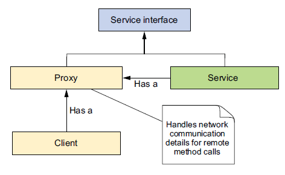
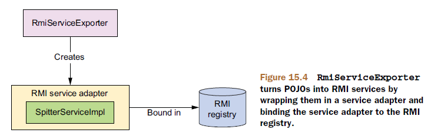
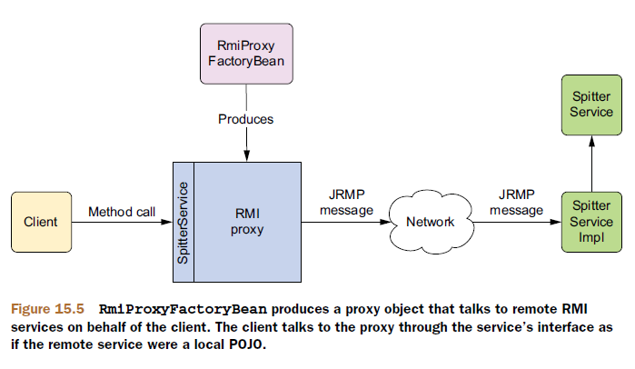

# 远程调用模型

Spring通过多种远程调用技术支持RPC：

| RPC模型             | 适用场景                                                     |
| ------------------- | ------------------------------------------------------------ |
| 远程方法调用（RMI） | 不考虑网络限制（例如防火墙），访问/发布基于Java的服务。      |
| Hessian或Burlap     | 考虑网络限制，通过HTTP访问/发布基于Java的服务。Hessian是二进制协议，而Burlap是基于XML的。 |
| HTTP invoker        | 考虑网络限制，并希望使用基于XML或专有的序列化机制实现Java序列化时，访问/发布基于Spring的服务。 |
| JAX-RPC和JAX-WS     | 访问/发布平台独立的、基于SOAP的Web服务。                     |

在Spring中，远程服务被代理，所以它们能够像其他Spring Bean一样被装配到客户端代码中。代理代表客户端与远程服务进行通信，由它负责处理连接的细节并向远程服务发起调用。



在服务端，Spring通过远程导出器（remote exporter）将Bean发布为远程服务。


任何传递给远程调用的Bean或从远程调用返回的Bean需要实现`java.io.Serializable`接口。

# RMI

## 导出RMI服务

通常创建一个RMI服务需要涉及好多步骤：

1. 编写一个服务实现类，类中的方法必须抛出`java.rmi.RemoteException`异常；
2. 创建一个继承于`java.rmi.Remote`的服务接口；
3. 运行RMI编译器（rmic），创建客户端stub类和服务端skeleton类；
4. 启动一个RMI注册表，以便持有这些服务；
5. 在RMI注册表中注册服务。

幸运的是，Spring提供了更简单的方式来发布RMI服务，不用再编写那些需要抛出`RemoteException`异常的特定RMI类，只需要简单地编写实现服务功能的POJO就可以了，Spring会处理剩余的其他事项。

```java
public interface SpitterService {
  List<Spittle> getRecentSpittles(int count);
  void saveSpittle(Spittle spittle);
  void saveSpitter(Spitter spitter);
  Spitter getSpitter(long id);
  void startFollowing(Spitter follower, Spitter followee);
  List<Spittle> getSpittlesForSpitter(Spitter spitter);
  List<Spittle> getSpittlesForSpitter(String username);
  Spitter getSpitter(String username);
  Spittle getSpittleById(long id);
  void deleteSpittle(long id);
  List<Spitter> getAllSpitters();
}
```

如果我们使用传统的RMI来发布此服务，`SpitterService`和`SpitterServiceImpl`中的所有方法都需要抛出`java.rmi.RemoteException`。但是如果我们使用Spring的`RmiServiceExporter`把该类转变为RMI服务，那现有的实现不需要做任何改变。

`RmiServiceExporter`可以把任意Spring的Bean发布为RMI服务：



使用`RmiServiceExporter`将`SpitterServiceImpl`发布为RMI服务是在Spring中使用如下的`@Bean`方法进行配置：

```java

```

默认情况下，`RmiServiceExporter`会尝试绑定到本地机器1099端口上的RMI注册表。如果在这个端口上没有发现RMI注册表，则会启动一个。也可以想上面例子一样，自己指定RMI注册表所在的主机和端口。

## 装配RMI服务

传统的RMI客户端必须使用RMI API的`Naming`类从RMI注册表中查找服务。例如：

```java
try {
  String serviceUrl = "rmi:/spitter/SpitterService";
  SpitterService spitterService = (SpitterService) Naming.lookup(serviceUrl);
  ...
}
catch (RemoteException e) { ... }
catch (NotBoundException e) { ... }
catch (MalformedURLException e) { ... }
```

Spring的`RmiProxyFactoryBean`可以为RMI服务创建代理，从而可以将RMI服务注入其他Bean中，而不需要Bean自己去RMI注册表查找服务。



```java
@Bean
public RmiProxyFactoryBean spitterService() {
  RmiProxyFactoryBean rmiProxy = new RmiProxyFactoryBean();
  rmiProxy.setServiceUrl("rmi://localhost/SpitterService");
  rmiProxy.setServiceInterface(SpitterService.class);
  return rmiProxy;
}
```

现在已经把RMI服务注册为Spring Bean，我们就可以把它作为依赖装配进另一个Bean中，就像任意非远程的Bean那样。

```java
@Autowired
SpitterService spitterService;

public List<Spittle> getSpittles(String userName) {
	Spitter spitter = spitterService.getSpitter(userName);
  return spitterService.getSpittlesForSpitter(spitter);
}
```

以这种方式访问RMI服务，客户端代码甚至不需要知道所处理的是一个RMI服务。此外，代理捕获了这个RMI服务所有可能抛出的`RemoteException`异常，并把它包装为运行期异常重新抛出。

尽管客户端代码不需要关心`SpitterService`是否是一个远程服务，但在设计时要注意远程调用都会受网络延迟的影响，进而会影响到客户端的性能。

## RMI的局限

RMI很难穿越防火墙，这是因为RMI使用任意端口来交互——这是防火墙通常不允许的。

RMI是基于Java的，这意味着客户端和服务端必须都是用Java开发的，它使用了Java的序列化机制，因此通过网络传输的对象类型必须要保证在调用两端的Java运行时中是完全相同的版本。

# Hessian和Burlap

Hessian和Burlap是Caucho提供的两种基于HTTP的轻量级远程服务解决方案。

Hessian像RMI一样，使用二进制消息进行客户端和服务端的交互。但它的二进制消息可以移植到其他非Java语言中。

Burlap是一种基于XML的远程调用技术，这使得它可以很自然地移植到任何能够解析XML的语言上。但是它与其他基于XML的远程技术（例如SOAP或XML-RPC）不同，Burlap的消息结构尽可能简单，不需要额外的外部定义语言（例如WSDL或IDL）。

Hessian在带宽上更具优势，而Bulap则可读性更高。

## 导出Hessian服务

# Spring的HttpInvoker

# Web服务