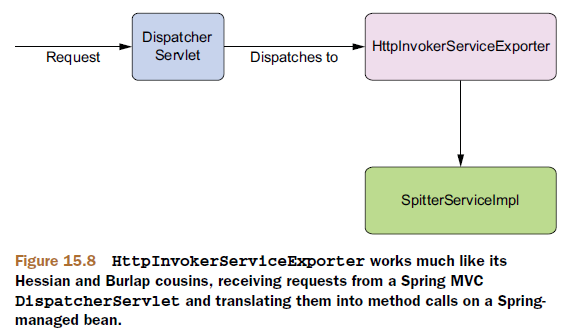
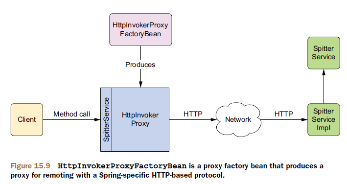

# 远程调用模型

Spring通过多种远程调用技术支持RPC：

| RPC模型             | 适用场景                                                     |
| ------------------- | ------------------------------------------------------------ |
| 远程方法调用（RMI） | 不考虑网络限制（例如防火墙），访问/发布基于Java的服务。      |
| Hessian或Burlap     | 考虑网络限制，通过HTTP访问/发布基于Java的服务。Hessian是二进制协议，而Burlap是基于XML的。 |
| HTTP invoker        | 考虑网络限制，并希望使用基于XML或专有的序列化机制实现Java序列化时，访问/发布基于Spring的服务。 |
| JAX-RPC和JAX-WS     | 访问/发布平台独立的、基于SOAP的Web服务。                     |

在Spring中，远程服务被代理，所以它们能够像其他Spring Bean一样被装配到客户端代码中。代理代表客户端与远程服务进行通信，由它负责处理连接的细节并向远程服务发起调用。


在服务端，Spring通过远程导出器（remote exporter）将Bean发布为远程服务。


任何传递给远程调用的Bean或从远程调用返回的Bean需要实现`java.io.Serializable`接口。

# RMI

## 导出RMI服务

通常创建一个RMI服务需要涉及好多步骤：

1. 编写一个服务实现类，类中的方法必须抛出`java.rmi.RemoteException`异常；
2. 创建一个继承于`java.rmi.Remote`的服务接口；
3. 运行RMI编译器（rmic），创建客户端stub类和服务端skeleton类；
4. 启动一个RMI注册表，以便持有这些服务；
5. 在RMI注册表中注册服务。

幸运的是，Spring提供了更简单的方式来发布RMI服务，不用再编写那些需要抛出`RemoteException`异常的特定RMI类，只需要简单地编写实现服务功能的POJO就可以了，Spring会处理剩余的其他事项。

```java
public interface SpitterService {
  List<Spittle> getRecentSpittles(int count);
  void saveSpittle(Spittle spittle);
  void saveSpitter(Spitter spitter);
  Spitter getSpitter(long id);
  void startFollowing(Spitter follower, Spitter followee);
  List<Spittle> getSpittlesForSpitter(Spitter spitter);
  List<Spittle> getSpittlesForSpitter(String username);
  Spitter getSpitter(String username);
  Spittle getSpittleById(long id);
  void deleteSpittle(long id);
  List<Spitter> getAllSpitters();
}
```

如果我们使用传统的RMI来发布此服务，`SpitterService`和`SpitterServiceImpl`中的所有方法都需要抛出`java.rmi.RemoteException`。但是如果我们使用Spring的`RmiServiceExporter`把该类转变为RMI服务，那现有的实现不需要做任何改变。

`RmiServiceExporter`可以把任意Spring的Bean发布为RMI服务：


使用`RmiServiceExporter`将`SpitterServiceImpl`发布为RMI服务是在Spring中使用如下的`@Bean`方法进行配置：

```java

```

默认情况下，`RmiServiceExporter`会尝试绑定到本地机器1099端口上的RMI注册表。如果在这个端口上没有发现RMI注册表，则会启动一个。也可以想上面例子一样，自己指定RMI注册表所在的主机和端口。

## 装配RMI服务

传统的RMI客户端必须使用RMI API的`Naming`类从RMI注册表中查找服务。例如：

```java
try {
  String serviceUrl = "rmi:/spitter/SpitterService";
  SpitterService spitterService = (SpitterService) Naming.lookup(serviceUrl);
  ...
}
catch (RemoteException e) { ... }
catch (NotBoundException e) { ... }
catch (MalformedURLException e) { ... }
```

Spring的`RmiProxyFactoryBean`可以为RMI服务创建代理，从而可以将RMI服务注入其他Bean中，而不需要Bean自己去RMI注册表查找服务。


```java
@Bean
public RmiProxyFactoryBean spitterService() {
  RmiProxyFactoryBean rmiProxy = new RmiProxyFactoryBean();
  rmiProxy.setServiceUrl("rmi://localhost/SpitterService");
  rmiProxy.setServiceInterface(SpitterService.class);
  return rmiProxy;
}
```

现在已经把RMI服务注册为Spring Bean，我们就可以把它作为依赖装配进另一个Bean中，就像任意非远程的Bean那样。

```java
@Autowired
SpitterService spitterService;

public List<Spittle> getSpittles(String userName) {
	Spitter spitter = spitterService.getSpitter(userName);
  return spitterService.getSpittlesForSpitter(spitter);
}
```

以这种方式访问RMI服务，客户端代码甚至不需要知道所处理的是一个RMI服务。此外，代理捕获了这个RMI服务所有可能抛出的`RemoteException`异常，并把它包装为运行期异常重新抛出。

尽管客户端代码不需要关心`SpitterService`是否是一个远程服务，但在设计时要注意远程调用都会受网络延迟的影响，进而会影响到客户端的性能。

## RMI的局限

RMI很难穿越防火墙，这是因为RMI使用任意端口来交互——这是防火墙通常不允许的。

RMI是基于Java的，这意味着客户端和服务端必须都是用Java开发的，它使用了Java的序列化机制，因此通过网络传输的对象类型必须要保证在调用两端的Java运行时中是完全相同的版本。

# Hessian和Burlap

Hessian和Burlap是Caucho提供的两种基于HTTP的轻量级远程服务解决方案。

Hessian像RMI一样，使用二进制消息进行客户端和服务端的交互。但它的二进制消息可以移植到其他非Java语言中。

Burlap是一种基于XML的远程调用技术，这使得它可以很自然地移植到任何能够解析XML的语言上。但是它与其他基于XML的远程技术（例如SOAP或XML-RPC）不同，Burlap的消息结构尽可能简单，不需要额外的外部定义语言（例如WSDL或IDL）。

Hessian在带宽上更具优势，而Bulap则可读性更高。

## 配置Hessian

### 导出Hessian服务

即使没有Spring，编写一个Hessian服务也是相当容易的，只需要编写一个继承`com.caucho.hessian.server.HessianServlet`的类，并确保所有的服务方法是`public`的（在Hessian里，所有`public`方法被视为服务方法）。

Spring并没有做更多简化Hessian模型的工作，不过，为了把Spring Bean发布为Hessian服务，我们需要注册一个`HessianServiceExporter` Bean：

```java
@Bean
public HessianServiceExporter hessianExportedSpitterService(SpitterService service) {
  HessianServiceExporter exporter = new HessianServiceExporter();
  exporter.setService(service);
  exporter.setServiceInterface(SpitterService.class);
  return exporter;
}

@Bean
public SpitterService spitterService() {
  return new SpitterServiceImpl();
}
```

与`RmiServiceExporter`不同，我们不需要设置`serviceName`属性。在RMI中，`serviceName`属性用来在RMI注册表中注册一个服务。而Hessian没有注册表，因此也就没有必要为Hessian服务进行命名。


### 配置Hessian控制器

Hessian是基于HTTP的，所以`HessianServiceExporter`实现为一个Spring MVC控制器。这意味着为了使用导出的Hessian服务，我们需要执行两个额外的配置步骤：

- 配置`DispatcherServlet`，并把我们的应用部署为Web应用；
- 在Spring的配置文件中配置一个URL处理器，把Hessian服务的URL分发给对应的Hessian服务Bean。

#### 配置DispatcherServlet

在web.xml中配置：

```xml
<servlet>
  <servlet-name>spitter</servlet-name>
  <servlet-class>org.springframework.web.servlet.DispatcherServlet</servlet-class>
  <load-on-startup>1</load-on-startup>
</servlet>

<servlet-mapping>
  <servlet-name>spitter</servlet-name>
  <url-pattern>*.service</url-pattern>
</servlet-mapping>
```

或者，通过`WebApplicationInitializer`来配置：

```java
ServletRegistration.Dynamic dispatcher = container.addServlet(
  "appServlet", new DispatcherServlet(dispatcherServletContext));
dispatcher.setLoadOnStartup(1);
dispatcher.addMapping("/");
dispatcher.addMapping("*.service");
```

如果通过`AbstractAnnotationConfigDispatcherServletInitializer`配置，则在重写`getServletMappings`方法时，需要包含该映射：

```java
@Override
protected String[] getServletMappings() {
	return new String[] { "/", "*.service" };
}
```

#### 配置URL处理器映射

我们需要配置一个URL处理器映射来确保`DispatcherServlet`把请求转发给`hessianExportedSpitterService`：

```java
@Bean
public HandlerMapping hessianMapping() {
  SimpleUrlHandlerMapping mapping = new SimpleUrlHandlerMapping();
  Properties mappings = new Properties();
  mappings.setProperty("/spitter.service",
                       "hessianExportedSpitterService");
  mapping.setMappings(mappings);
  return mapping;
}
```

## 配置Burlap

### 导出Burlap服务

```java
@Bean
public BurlapServiceExporter burlapExportedSpitterService(SpitterService service) {
  BurlapServiceExporter exporter = new BurlapServiceExporter();
  exporter.setService(service);
  exporter.setServiceInterface(SpitterService.class);
  return exporter;
}
```

### 配置Burlap控制器

与配置Hessian控制器类似，也需要配置一个`DispatcherServlet`和URL处理器映射。

## 装配Hessian/Burlap服务

装配Hessian/Burlap服务与装配RMI服务的唯一差别，就是使用的代理工厂Bean不同。

Hessian使用`HessianProxyFactoryBean`：

```java
@Bean
public HessianProxyFactoryBean spitterService() {
  HessianProxyFactoryBean proxy = new HessianProxyFactoryBean();
  proxy.setServiceUrl("http://localhost:8080/Spitter/spitter.service");
  proxy.setServiceInterface(SpitterService.class);
  return proxy;
}
```


Burlap使用`BurlapProxyFactoryBean`：

```java
@Bean
public BurlapProxyFactoryBean spitterService() {
  BurlapProxyFactoryBean proxy = new BurlapProxyFactoryBean();
  proxy.setServiceUrl("http://localhost:8080/Spitter/spitter.service");
  proxy.setServiceInterface(SpitterService.class);
  return proxy;
}
```

# Spring的HttpInvoker

RMI使用Java标准的对象序列化机制，但很难穿透防火墙；而Hessian和Burlap能很好穿透防火墙，但是使用私有的对象序列化机制。

Spring的HTTP invoker是一个新的远程调用模型，它基于HTTP（让防火墙不为难），并使用Java的序列化机制。

## 导出HTTP invoker服务

```java
@Bean
public HttpInvokerServiceExporter httpExportedSpitterService(SpitterService service) {
  HttpInvokerServiceExporter exporter = new HttpInvokerServiceExporter();
  exporter.setService(service);
  exporter.setServiceInterface(SpitterService.class);
  return exporter;
}
```



## 配置DispatcherServlet

## 配置URL处理器映射

```java
@Bean
public HandlerMapping httpInvokerMapping() {
  SimpleUrlHandlerMapping mapping = new SimpleUrlHandlerMapping();
  Properties mappings = new Properties();
  mappings.setProperty("/spitter.service",
                       "httpExportedSpitterService");
  mapping.setMappings(mappings);
  return mapping;
}
```

## 装配HTTP invoker服务

```java
@Bean
public HttpInvokerProxyFactoryBean spitterService() {
  HttpInvokerProxyFactoryBean proxy = new HttpInvokerProxyFactoryBean();
  proxy.setServiceUrl("http://localhost:8080/Spitter/spitter.service");
  proxy.setServiceInterface(SpitterService.class);
  return proxy;
}
```



## HTTP invoker的限制

它只是一个Spring框架所提供的远程调用解决方案，这意味客户端和服务端必须都是Spring应用。并且，它们必须是基于Java。另外，因为使用了Java的序列化机制，客户端和服务端必须使用相同版本的类。

# Web服务

## 创建基于Spring的JAX-WS端点

### 发布基于Servlet的JAX-WS端点

```java
@WebService(serviceName="SpitterService")
public class SpitterServiceEndpoint extends SpringBeanAutowiringSupport {
  @Autowired
  SpitterService spitterService;
  @WebMethod
  public void addSpittle(Spittle spittle) {
    spitterService.saveSpittle(spittle);
  }
  @WebMethod
  public void deleteSpittle(long spittleId) {
    spitterService.deleteSpittle(spittleId);
  }
  @WebMethod
  public List<Spittle> getRecentSpittles(int spittleCount) {
    return spitterService.getRecentSpittles(spittleCount);
  }
  @WebMethod
  public List<Spittle> getSpittlesForSpitter(Spitter spitter) {
    return spitterService.getSpittlesForSpitter(spitter);
  }
}
```

JAX-WS使用`@WebService`标注的类被认为Web服务的端点，而使用`@WebMethod`标注的方法被认为是操作。

另外，通过继承`SpringBeanAutowiringSupport`，我们可以使用`@Autowired`来标注端点的属性，依赖就会自动注入。

这种方式端点的生命周期由JAX-WS运行时来管理，而不是Spring。

### 发布独立的JAX-WS端点

Spring提供了一个`SimpleJaxWsServiceExporter`，它可以将使用JAX-WS标注的所有Bean发布为JAX-WS服务。

首先，注册一个`SimpleJaxWsServiceExporter`：

```java
@Bean
public SimpleJaxWsServiceExporter jaxWsExporter() {
  SimpleJaxWsServiceExporter exporter = new SimpleJaxWsServiceExporter();
  exporter.setBaseAddress("http://localhost:8888/services/");
}
```

> 如果没有显式设置`setBaseAddress`，则默认为`http://localhost:8080/`。
>
> 注意：`SimpleJaxWsServiceExporter`不需要为它指定一个被导出Bean的引用，它会搜索Spring应用上下文中所有使用`@WebService`标注的Bean，并将这些Bean发布为JAX-WS端点。

然后，创建一个普通Spring Bean作为JAX-WS端点：

```java
@Component
@WebService(serviceName="SpitterService")
public class SpitterServiceEndpoint {
  @Autowired
  SpitterService spitterService;
  @WebMethod
  public void addSpittle(Spittle spittle) {
    spitterService.saveSpittle(spittle);
  }
  @WebMethod
  public void deleteSpittle(long spittleId) {
    spitterService.deleteSpittle(spittleId);
  }
  @WebMethod
  public List<Spittle> getRecentSpittles(int spittleCount) {
    return spitterService.getRecentSpittles(spittleCount);
  }
  @WebMethod
  public List<Spittle> getSpittlesForSpitter(Spitter spitter) {
    return spitterService.getSpittlesForSpitter(spitter);
  }
}
```

这里`SpitterServiceEndpoint`不再需要继承`SpringBeanAutowiringSupport`就可以实现自动装配，它完全就是一个Spring Bean（带有`@Component`标注）。

需要注意：只有在支持将端点发布到指定地址的JAX-WS运行时（例如JDK自带的JAX-WS运行时）中，才能使用这种方案。否则（例如JAX-WS 2.1的参考实现），不能使用`SimpleJaxWsServiceExporter`。

## 通过代理访问JAX-WS服务

借助Spring使用Web服务所涉及的客户端代理的工作方式与基于Spring的客户端使用其他远程调用技术是相同的。

使用`JaxWsProxyFactoryBean`，我们可以在Spring中装配Spitter Web服务。


```java
@Bean
public JaxWsPortProxyFactoryBean spitterService() {
  JaxWsPortProxyFactoryBean proxy = new JaxWsPortProxyFactoryBean();
  proxy.setWsdlDocument("http://localhost:8080/services/SpitterService?wsdl");
  proxy.setServiceName("spitterService");
  proxy.setPortName("spitterServiceHttpPort");
  proxy.setServiceInterface(SpitterService.class);
  proxy.setNamespaceUri("http://spitter.com");
  return proxy;
}
```

`setWsdlDocument`用于指定远程Web服务定义文件的位置。

WSDL文件：

```xml
<wsdl:definitions targetNamespace="http://spitter.com">
  ...
  <wsdl:service name="spitterService">
    <wsdl:port name="spitterServiceHttpPort"
               binding="tns:spitterServiceHttpBinding">
      ...
    </wsdl:port>
  </wsdl:service>
</wsdl:definitions>
```

# Spring Web服务（Spring-WS）

