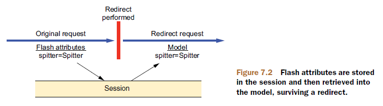
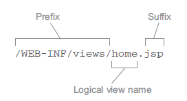

# Spring MVC

Spring Web MVC是构建在Servlet API上的Web框架。

## Spring MVC架构


1. 客户端（如浏览器）发出一个HTTP请求，Web应用服务器接收到这个请求。如果匹配Spring MVC的前端控制器`DispatcherServlet`的URL映射模式，则Web容器将该请求转交给`DispatcherServlet`处理。

2. `DispatcherServlet`接收到这个请求后，将根据请求的信息（包括URL、HTTP方法、请求报文头、请求参数、Cookie等）及处理器映射（HandlerMapping，可看作路由控制器）的配置找到处理请求的处理器（Handler）。

   > 注意：在Spring MVC中并没有定义一个Handler接口，实际上，任何一个类都可以成为请求处理器。

3. 当`DispatcherServlet`找到对应当前请求的处理器后，通过`HandlerAdapter`对处理器进行封装，再以统一的适配器接口调用处理器。

4. 处理器完成业务逻辑的处理后（实际上，设计良好的控制器本身只处理很少甚至不处理工作，而是将业务逻辑委托给一个或多个服务对象进行处理），将返回一个`ModelAndView`给`DispatcherServlet`。`ModelAndView`包含了逻辑视图名和模型数据信息。

5. `DispatcherServlet`借由视图解析器（ViewResolver）来将逻辑视图名匹配为一个特定的视图实现（如JSP）。

6. `DispatcherServlet`将模型数据交付给上一步得到的视图，并由该视图进行渲染。

7. 渲染输出（如HTML、JSON、图片等）最终通过响应对象传递给客户端。

## 搭建Spring MVC

### 配置DispatcherServlet

传统配置DispatcherServlet的方式是在web.xml文件中进行配置。借助于Servlet 3规范和Spring 3.1的功能增强，现在更推荐在Java中配置DispatcherServlet。

#### 传统的web.xml配置

web.xml：

```xml
<web-app>
  <!-- 加载后端的中间层和数据层组件的应用上下文（根应用上下文） -->
  <listener>
    <listener-class>org.springframework.web.context.ContextLoaderListener</listener-class>
  </listener>

  <context-param><!-- ContextLoaderListener加载的Spring配置文件 -->
    <param-name>contextConfigLocation</param-name>
    <param-value>/WEB-INF/app-context.xml</param-value>
  </context-param>

  <!-- 加载Web组件的应用上下文 -->
  <servlet>
    <servlet-name>app</servlet-name>
    <servlet-class>org.springframework.web.servlet.DispatcherServlet</servlet-class>
    <!-- 如果缺省init-param元素，则默认加载 /WEB-INF/Servlet名称-servlet.xml （这里是 /WEB-INF/app-servlet.xml）的Spring配置文件。这里将contextConfigLocation显式设置为空，表示不加载Web组件的应用上下文 -->
    <init-param>
      <param-name>contextConfigLocation</param-name>
      <param-value></param-value>
    </init-param>
    <load-on-startup>1</load-on-startup>
  </servlet>

  <servlet-mapping>
    <servlet-name>app</servlet-name>
    <url-pattern>/app/*</url-pattern>
  </servlet-mapping>
</web-app>
```

一个web.xml可以配置多个`DispatcherServlet`，通过不同的`<servlet-mapping>`配置，让每个`DispatcherServlet`处理不同的请求。

另外，还可以在web.xml中配置使用基于Java的配置，只需要告诉`ContextLoaderListener`和`DispatcherServlet`使用`AnnotationConfigWebApplicationContext`，它是`WebApplicationContext`的实现类，它会加载Java配置类，而不是使用XML配置。要实现这种配置，可以设置`contextClass`参数：

```xml
<web-app>
  <!-- 加载后端的中间层和数据层组件的应用上下文（根应用上下文） -->
  <listener>
    <listener-class>org.springframework.web.context.ContextLoaderListener</listener-class>
  </listener>

  <context-param><!-- 指定根配置类 -->
    <param-name>contextConfigLocation</param-name>
    <param-value>foo.bar.RootConfig</param-value>
  </context-param>
  <context-param><!-- 使用Java配置类 -->
  	<param-name>contextClass</param-name>
    <param-value>org.springframework.web.context.support.AnnotationConfigWebApplicationContext</param-value>
  </context-param>

  <!-- 加载Web组件的应用上下文 -->
  <servlet>
    <servlet-name>app</servlet-name>
    <servlet-class>org.springframework.web.servlet.DispatcherServlet</servlet-class>
    <init-param><!-- 指定DispatcherServlet配置类 -->
      <param-name>contextConfigLocation</param-name>
      <param-value>foo.bar.WebConfig</param-value>
    </init-param>
    <init-param><!-- 使用Java配置类 -->
    	<param-name>contextClass</param-name>
    	<param-value>org.springframework.web.context.support.AnnotationConfigWebApplicationContext</param-value>
    </init-param>
    <load-on-startup>1</load-on-startup>
  </servlet>

  <servlet-mapping>
    <servlet-name>app</servlet-name>
    <url-pattern>/app/*</url-pattern>
  </servlet-mapping>
</web-app>
```


#### 使用Java配置

在Servlet 3环境中，容器会在类路径中查找实现了`javax.servlet.ServletContainerInitializer`接口的类，如果能发现的话，就会用它来配置Servlet容器上下文。

Spring提供了这个接口的实现——`SpringServletContainerInitializer`，这个类会查找实现`WebApplicationInitializer`接口的类，并将配置的任务交给它们来完成。因此，可通过实现`WebApplicationInitializer`接口来配置`DispatcherServlet`和Spring应用上下文。当部署到Servlet 3.0容器中时，容器会自动发现它，并用它来配置Servlet上下文。Spring应用上下文会位于应用程序的Servlet上下文之中：

```java
public class MyWebApplicationInitializer implements WebApplicationInitializer {
  @Override
  public void onStartup(ServletContext servletCxt) {
    // Load Spring web application configuration
    AnnotationConfigWebApplicationContext ac = new AnnotationConfigWebApplicationContext();
    ac.register(AppConfig.class);
    ac.refresh();

    // Create and register the DispatcherServlet
    DispatcherServlet servlet = new DispatcherServlet(ac);
    ServletRegistration.Dynamic registration = servletCxt.addServlet("app", servlet);
    registration.setLoadOnStartup(1);
    registration.addMapping("/app/*");
  }
}
```

Spring 3.2引入了一个便利的`WebApplicationInitializer`基础实现，也就是`AbstractAnnotationConfigDispatcherServletInitializer` ，也可以扩展这个类来配置`DispatcherServlet`和Spring应用上下文：

```java
public class MyWebAppInitializer extends AbstractAnnotationConfigDispatcherServletInitializer {
  @Override
  protected Class<?>[] getRootConfigClasses() {
    return new Class<?>[] { AppConfig.class };
  }

  @Override
  protected Class<?>[] getServletConfigClasses() {
    return null;
  }

  @Override
  protected String[] getServletMappings() {
    return new String[] { "/app/*" };
  }
}
```

##### 自定义DispatcherServlet配置

可以通过重写`customizeRegistration`方法（属于`AbstractDispatcherServletInitializer`类），利用它的参数`ServletRegistration.Dynamic`的方法来自定义`DispatcherServlet`配置。

例如，调用`setLoadOnStartup`方法设置`load-on-startup`优先级；调用`setInitParameter`方法设置初始化参数等。

### 上下文的层次结构

对于许多应用程序，拥有单个`WebApplicationContext`就足够。但Spring应用上下文之间可以设置为父子级关系，以实现更好的解耦。子上下文可以访问父上下文中的Bean，反之则不行。

在Spring MVC中，通常包含两个应用上下文，并且`DispatcherServlet`加载的Web层应用上下文，将作为`ContextLoaderListener`加载的后端应用上下文的子上下文。


下面的示例配置了这种WebApplicationContext层次结构：

```java
public class MyWebAppInitializer extends AbstractAnnotationConfigDispatcherServletInitializer {
  @Override
  protected Class<?>[] getRootConfigClasses() {
    return new Class<?>[] { RootConfig.class };
  }

  @Override
  protected Class<?>[] getServletConfigClasses() {
    return new Class<?>[] { WebConfig.class };
  }

  @Override
  protected String[] getServletMappings() {
    return new String[] { "/app/*" };
  }
}
```

或者：

```java
public class MyWebAppInitializer implements WebApplicationInitializer {
  @Override
  public void onStartup(ServletContext container) {
    // Create the 'root' Spring application context
    AnnotationConfigWebApplicationContext rootContext =
      new AnnotationConfigWebApplicationContext();
    rootContext.register(RootConfig.class);

    // Manage the lifecycle of the root application context
    container.addListener(new ContextLoaderListener(rootContext));

    // Create the dispatcher servlet's Spring application context
    AnnotationConfigWebApplicationContext dispatcherContext =
      new AnnotationConfigWebApplicationContext();
    dispatcherContext.register(WebConfig.class);

    // Register and map the dispatcher servlet
    ServletRegistration.Dynamic dispatcher =
      container.addServlet("dispatcher", new DispatcherServlet(dispatcherContext));
    dispatcher.setLoadOnStartup(1);
    dispatcher.addMapping("/");
  }
 }
```

或者：

```xml
<web-app>
  <listener>
    <listener-class>org.springframework.web.context.ContextLoaderListener</listener-class>
  </listener>

  <context-param>
    <param-name>contextConfigLocation</param-name>
    <param-value>/WEB-INF/root-context.xml</param-value>
  </context-param>

  <servlet>
    <servlet-name>app</servlet-name>
    <servlet-class>org.springframework.web.servlet.DispatcherServlet</servlet-class>
    <init-param>
      <param-name>contextConfigLocation</param-name>
      <param-value>/WEB-INF/web-context.xml</param-value>
    </init-param>
    <load-on-startup>1</load-on-startup>
  </servlet>

  <servlet-mapping>
    <servlet-name>app</servlet-name>
    <url-pattern>/app/*</url-pattern>
  </servlet-mapping>
</web-app>
```

### MVC配置

#### 启用Spring MVC

在基于Java的配置中，可以在Servlet的应用上下文配置类中通过`@EnableWebMvc`标注来启用Spring MVC：

```java
@Configuration
@EnableWebMvc
public class WebConfig {
  …
}
```

在基于XML的配置中，可以使用下面配置启用标注驱动的Spring MVC：

```xml
<?xml version="1.0" encoding="UTF-8"?>
<beans xmlns="http://www.springframework.org/schema/beans"
    xmlns:mvc="http://www.springframework.org/schema/mvc"
    xmlns:xsi="http://www.w3.org/2001/XMLSchema-instance"
    xsi:schemaLocation="
        http://www.springframework.org/schema/beans
        http://www.springframework.org/schema/beans/spring-beans.xsd
        http://www.springframework.org/schema/mvc
        http://www.springframework.org/schema/mvc/spring-mvc.xsd">

  <mvc:annotation-driven/>

</beans>
```

#### 启用组件扫描

```java
@Configuration
@EnableWebMvc
@ComponentScan("spitter.web")
public class WebConfig {
  …
}
```

#### AOP代理

在某些情况下，您需要在运行时使用AOP代理装饰控制器。例如，如果您选择在控制器上直接使用`@Transactional`注释。在这种情况下，对于控制器而言，我们建议使用基于类的代理。这通常是控制器的默认选择。但是，如果控制器必须实现不是Spring Context回调的接口（例如`InitializingBean`，`*Aware`等），则可能需要显式配置基于类的代理。例如，使用`<tx：annotation-driven />`，您可以更改为`<tx：annotation-driven proxy-target-class =“true”/>`。

### 根上下文配置

```java
package spittr.config;

…

@Configuration
@ComponentScan(
  basePackages={"spitter"},
  excludeFilters={
    @Filter(type=FilterType.ANNOTATION, value=EnableWebMvc.class)
  })
public class RootConfig {
  …
}
```

组件扫描时，过滤掉以`@EnableWebMvc`标注的类。

## 控制器

### 声明

Spring MVC的控制器不需要继承任何类或接口，只需要在控制器的方法上标注上`@RequestMapping`即可。`@RequestMapping`将HTTP请求映射到指定的方法。而`@Controller`标注主要是在自动装配时辅助组件扫描的。

`@RequestMapping`既可只作用在方法上，也可以同时作用在方法和类上：

```java
@Controller
@RequestMapping("/foo")
public class FooController {
  @RequestMapping("/bar")
  public String bar(Model model) {
    model.addAttribute("name", "Mary");
    return "/bar.ftl";
  }
}
```

上面代码对`/foo/bar`的请求，将交由`FooController.bar`方法处理。

控制器方法返回值默认是视图的名称，`DispatcherServlet`会要求视图解析器将这个逻辑视图名称解析为实际的视图。

如果希望返回内容本身，而不是视图名称，则需要在方法上加上`@ResponseBody`。`@ResponseBody`用于将控制器的方法返回值，通过相应的`HttpMessageConverter`转换为指定格式后，写入`Response`对象的body。默认情况下，如果返回值是字符串类型，则直接返回这个字符串；否则，默认使用Jackson将返回值序列化为JSON字符串后输出。

如果需要的是一个RESTful风格的控制器，则需要使用`@RestController`标注，它相当于`@Controller`+`@ResponseBody`，用于返回JSON格式数据。

### 请求映射

`@RequestMapping`的属性：

- value：请求的URL路径，支持URL模板、正则表达式。`value`属性能够接受一个`String`类型的数组：

  ```java
  @Controller
  @RequestMapping({"/", "/home"})
  public class HomeController {
    …
  }
  ```

- method：HTTP请求方法，有GET、POST等；

- consumes：接受的媒体类型。对应HTTP的`Content-Type`；

- produces：响应的媒体类型。对应HTTP的`Accept`；

- params：请求参数；

- headers：请求的HTTP头。

#### 指定HTTP方法

请求的HTTP方法可以通过`@RequestMapping`标注的`method`属性来指定，也可以使用如下便捷的标注来指定：

- `@GetMapping`
- `@PostMapping`
- `@PutMapping`
- `@DeleteMapping`
- `@PatchMapping`

```java
@RestController
@RequestMapping("/persons")
class PersonController {
  @GetMapping("/{id}")
  public Person getPerson(@PathVariable Long id) {
    // ...
  }

  @PostMapping
  @ResponseStatus(HttpStatus.CREATED)
  public void add(@RequestBody Person person) {
    // ...
  }
}
```

#### URL模式

##### 路径参数

```java
@RequestMapping(value="/get/{id}.json")
public @ResponseBody User getById(@PathVariable("id") Long id) {
  …
}
```

则访问路径是`/get/1.json`，时将调用`getById`方法，并且参数`id`的值为`1`。

> 标注中如果只设置一个`value`参数时，可以省略`value=`部分。例如：`@RequestMapping("/get/{id}.json")`。

同一个处理器方法允许有任意多个参数带有`@PathVariable`标注，并且可以在类和方法级别声明URI变量：

```java
@Controller
@RequestMapping("/owners/{ownerId}")
public class OwnerController {
  @GetMapping("/pets/{petId}")
  public Pet findPet(@PathVariable Long ownerId, @PathVariable Long petId) {
    // ...
  }
}
```

如果URI变量名称与方法参数相同，并且您的代码使用调试信息或Java 8上的`-parameters`编译器标志进行编译，则`@PathVariable`可以省略`value`属性。（其他诸如`@RequestParam`等标注也类似）

URI变量自动转换为适当的类型，如果转换失败将引发`TypeMismatchException`。默认情况下支持简单类型（int，long，Date等），您可以注册对任何其他数据类型的支持。请参见“类型转换”和“数据绑定”。

##### Ant路径表达式

`*`匹配任意多个字符（除了路径分隔符”/“），`**`匹配任意多个字符（包括路径分隔符），`?`匹配单个字符。

```java
@RequestMapping("/user/*.html")  //匹配：/user/1.html、/user/abc.html，但不匹配：/user/add/1.html
@RequestMapping("/**/1.html")  //匹配：/1.html、/user/1.html、/user/add/1.html
@RequestMapping("/user/?.html")  //匹配：/user/1.html，但不匹配：/user/abc.html
```

如果一个请求有多个`@RequestMapping`能够匹配，则更具体的匹配优先。另外，有通配符的优先级低于无通配符的，有`**`的低于有`*`的。默认映射模式（`/**`）总是具有最低优先级。

##### 正则表达式

语法`{varName：regex}`声明一个URI变量，它的值必须匹配正则表达式`regex`：

```java
@GetMapping("/{name:[a-z-]+}-{version:\\d\\.\\d\\.\\d}{ext:\\.[a-z]+}")
public void handle(@PathVariable String version, @PathVariable String ext) {
  // ...
}
```

上面的正则表达式可以匹配类似于`/spring-web-3.0.5 .jar`的URL。

##### 占位符

URI路径模式还可以嵌入`$ {…}`占位符，这些占位符在启动时通过`PropertyPlaceHolderConfigurer`来解析本地、系统、环境和其他属性源。例如，您可以使用它来根据某些外部配置参数化基本URL：

```java
@RequestMapping("/${query.all}.json")
```

### 接受请求的输入

Spring MVC提供了下面几种方式将客户端的数据传送到控制器的处理器方法中：

- 查询参数（Query Parameter）：面向操作（控制）。
- 表单参数（Form Parameter）：面向数据。
- 路径变量（Path Variable）：面向资源，详见“路径参数”。
- Matrix 变量。

#### 查询参数

下面的处理器方法将匹配：`GET: /spittles?max=238900&count=50`

```java
@Controller
@RequestMapping("/spittles")
public class SpittleController {
  private static final String MAX_LONG_AS_STRING = "9223372036854775807";
  …
  @RequestMapping(method=RequestMethod.GET)
  public List<Spittle> spittles(
      @RequestParam(value="max", defaultValue=MAX_LONG_AS_STRING) long max,
      @RequestParam(value="count", defaultValue="20") int count) {
    return spittleRepository.findSpittles(max, count);
  }
  …
}
```

注意：`@RequestParam`的`value`和`defaultValue`属性都是`String`类型，但是当绑定到方法的参数时，会自动转换为相应类型。

假设控制器中`names`是一个字符串数组，则：

```
GET: /foo?names=ab,bc,cd
结果：names数组的值为 ["ab", "bc", "cd"]
GET: /foo?names=ab&names=cd
结果：names数组的值为 ["ab", "cd"]
GET: /foo?names=ab,bc,cd&names=kk
结果：names数组的值为 ["ab,bc,cd", "kk"]
```

假设控制器中`ids`是一个整数数组（其他非字符串数组也类似）：则：

```
GET: /foo?ids=1,3,4
结果：ids数组的值为 [1, 3, 4]
GET: /foo?ids=1&ids=5
结果：ids数组的值为 [1, 5]
GET: /foo?ids=1,3,4&ids=6
结果：报错
```


#### 表单参数

控制器代码：

```java
@Controller
@RequestMapping("/spitter")
public class SpitterController {
  private SpitterRepository spitterRepository;

  @Autowired
  public SpitterController(SpitterRepository spitterRepository) {
    this.spitterRepository = spitterRepository;
  }
  
  //显示注册表单
  @RequestMapping(value="/register", method=GET)
  public String showRegistrationForm() {
    return "registerForm";
  }
  
  //处理注册表单
  @RequestMapping(value="/register", method=POST)
  public String processRegistration(Spitter spitter) {
    spitterRepository.save(spitter);
    return "redirect:/spitter/" + spitter.getUsername();
  }
  
  //显示个人信息
  @RequestMapping(value="/{username}", method=GET)
  public String showSpitterProfile(@PathVariable String username, Model model) {
    Spitter spitter = spitterRepository.findByUsername(username);
    model.addAttribute(spitter);
    return "profile";
  }
}
```

> `processRegistration`方法的`spitter`参数的属性将会使用POST请求中同名的参数进行填充。
>
> 在处理POST类型的请求时，在请求处理完成后，最好进行一下重定向，这样浏览器的刷新就不会重复提交表单了。
>
> 本例假定使用`InternalResourceViewResolver`视图解析器，它会将以`redirect:`为前缀的视图格式解析为重定向到指定视图。
>
> `InternalResourceViewResolver`视图解析器还会识别`forward:`前缀的视图格式，它将解析为将请求转发到指定视图。

registerForm.jsp：

```jsp
<%@ taglib uri="http://java.sun.com/jsp/jstl/core" prefix="c" %>
<%@ page session="false" %>
<html>
  <head>
    <title>Spitter</title>
    <link rel="stylesheet" type="text/css" 
          href="<c:url value="/resources/style.css" />" >
  </head>
  <body>
    <h1>Register</h1>

    <form method="POST">
      First Name: <input type="text" name="firstName" /><br/>
      Last Name: <input type="text" name="lastName" /><br/>
      Email: <input type="email" name="email" /><br/>
      Username: <input type="text" name="username" /><br/>
      Password: <input type="password" name="password" /><br/>
      <input type="submit" value="Register" />
    </form>
  </body>
</html>
```

这里`<form>`元素中并没有设置`action`属性。在这种情况下，当表单提交时，它会提交到与展现当前视图时相同的URL路径上，本例中就是`/spitter/register`。

profile.jsp：

```jsp
<%@ taglib uri="http://java.sun.com/jsp/jstl/core" prefix="c" %>
<%@ page session="false" %>
<html>
  <head>
    <title>Spitter</title>
    <link rel="stylesheet" type="text/css" href="<c:url value="/resources/style.css" />" >
  </head>
  <body>
    <h1>Your Profile</h1>
    <c:out value="${spitter.username}" /><br/>
    <c:out value="${spitter.firstName}" /> <c:out value="${spitter.lastName}" /><br/>
    <c:out value="${spitter.email}" />
  </body>
</html>
```

##### 校验表单

从Spring 3.0开始，Spring MVC提供了对Java Validation API的支持。在Spring MVC中使用Java Validation API，并不需要什么额外的配置，只要保证在类路径下包含Java Validation API的实现（例如Hibernate Validator）。

Spitter.java：

```java
public class Spitter {
  private Long id;
  
  @NotNull
  @Size(min=5, max=16)
  private String username;

  @NotNull
  @Size(min=5, max=25)
  private String password;
  
  @NotNull
  @Size(min=2, max=30)
  private String firstName;

  @NotNull
  @Size(min=2, max=30)
  private String lastName;
  
  @NotNull
  @Email
  private String email;
  
  …
}
```

我们已经为`Spitter`添加了校验标注，接下来需要修改`processRegistration`方法来应用校验功能：

```java
@RequestMapping(value="/register", method=POST)
public String processRegistration(
  @Valid Spitter spitter, 
  Errors errors) {
  if (errors.hasErrors()) {
    return "registerForm";
  }

  spitterRepository.save(spitter);
  return "redirect:/spitter/" + spitter.getUsername();
}
```

`spitter`参数添加了`@Valid`标注，这会告知Spring，需要确保这个对象满足校验限制。

在`Spitter`类的属性上添加校验限制并不能阻止表单提交，不管校验有没有通过，`processRegistration`方法都会被调用。因此，我们要在`processRegistration`方法中处理校验的错误。

如果有校验出现错误，那么这些错误可以通过`Errors`对象进行访问。注意，`Errors`参数必须紧跟在带有`@Valid`标注的参数之后。

> 校验的更详细用法，请参见“SpringCore”的“校验”。

#### Matrix 变量

### 数据绑定

### 控制器通知

Spring 3.2引入了控制器通知，它能将控制器类的特定切面运用到整个应用程序的所有控制器中。

控制器通知是任意带有`@ControllerAdvice`标注的类，这个类会包含一个或多个如下类型的方法：

- 带`@ExceptionHandler`标注的方法：用于处理异常；
- 带`@InitBinder`标注的方法；
- 带`@ModelAttribute`标注的方法。

以上这些方法会应用到整个应用程序所有控制器中带有`@RequestMapping`标注的方法（即处理器方法）。

`@ControllerAdvice`标注本身已经使用了`@Component`标注，因此`@ControllerAdvice`标注的类会自动被组件扫描获取到。

`@ControllerAdvice`标注最为实用的一个场景是将所有的`@ExceptionHandler`方法收集到一个类中，这样所有控制器的异常就能在一个地方进行一致处理。

```java
@ControllerAdvice
public class AppWideExceptionHandler {
  @ExceptionHandler(DuplicateSpittleException.class)
  public String duplicateSpittleHandler() {
  	return "error/duplicate";
  }
}
```

这样，任意控制器类的处理器方法抛出`DuplicateSpittleException`异常，都将调用`duplicateSpittleHandler`方法来处理异常。

## 模型

### 传递模型数据到视图中

Spring提供了多种方式将模型数据传递到视图中。

#### 通过Model参数

```java
@RequestMapping(method=RequestMethod.GET)
public String spittles(Model model) {
  model.addAttribute("spittleList", spittleRepository.findSpittles(Long.MAX_VALUE, 20));
  return "spittles";
}
```

这样，在视图中就可以通过`${spittles.属性名}`方式访问这些模型数据。

> 当视图是JSP时，模型数据实际上会作为请求属性放在请求（request）之中。
>
> `Model`参数的位置可任意。

#### 通过Map参数

如果你希望使用非Spring类型的话，可以用`java.util.Map`来代替`Model`：

```java
@RequestMapping(method=RequestMethod.GET)
public String spittles(Map model) {
  model.put("spittleList", spittleRepository.findSpittles(Long.MAX_VALUE, 20));
  return "spittles";
}
```

> `Map`参数的位置可任意。

#### 通过返回值

当处理器方法的返回值是除了`String`类型之外的对象时，该返回值将不会被当作是视图的逻辑名称，而是会被放到模型中：

```java
@Controller
@RequestMapping("/spittles")
public class SpittleController {
  …
  @RequestMapping(method=RequestMethod.GET)
  public List<Spittle> spittles() {
    return spittleRepository.findSpittles(Long.MAX_VALUE, 20);
  }
}
```

这里返回值是一个`List`对象，将被放到模型中，并且它在模型中的键名会根据其类型推断得出，本例中就是`spittleList`。而逻辑视图的名称将会根据请求路径推断得出，本例中就是`spittles`

### 跨重定向请求传递数据

通常，在执行重定向后，原始的请求就结束了，并且会发起一个新的GET请求。原始请求中所带有的模型数据也就随着请求一起消亡了，在新的请求属性中，没有任何模型数据。

但是，Spring MVC能够从发起重定向的方法传递数据给处理重定向方法中。

#### 通过URL模板以路径变量和/或查询参数的形式传递数据

```java
@RequestMapping(value="/register", method=POST)
public String processRegistration(Spitter spitter, Model model) {
	spitterRepository.save(spitter);
  model.addAttribute("username", spitter.getUsername());
	return "redirect:/spitter/{username}";
}
```

> `username`作为占位符填充到URL模板（即带占位符的字符串）中，而不是如下面代码中直接使用字符串拼接。
>
> ```java
> return "redirect:/spitter/" + spitter.getUsername();
> ```
>
> 主要原因是由于使用URL模板更安全，占位符中所有不安全字符都会进行转义。

此外，`Model`中没有与占位符匹配的属性将会自动作为URL中的查询参数：

```java
@RequestMapping(value="/register", method=POST)
public String processRegistration(Spitter spitter, Model model) {
  spitterRepository.save(spitter);
  model.addAttribute("username", spitter.getUsername());
  model.addAttribute("spitterId", spitter.getId());
  return "redirect:/spitter/{username}";
}
```

假设`username`的值是`habuma`，`spitterId`的值是`42`，则重定向的URL将会是：`/spitter/habuma?spitterId=42`。

通过路径变量和查询参数的形式跨重定向传递数据，只能用来发送简单的值（例如字符串和数值）。在URL中，并没有办法发送复杂的值。要发送复杂的值可通过flash属性。

#### 通过flash属性传递复杂数据

假如要将`Spitter`对象传递给重定向后的处理器方法，但`Spitter`对象是一个复杂的对象，不能通过路径变量和查询参数发送。

一种可行的方法是只传递`Spitter`对象的ID，但这样重定向后的处理器方法还要从数据库中再查询一次`Spitter`对象。

另一种可行的方法是将`Spitter`对象放到会话（session）中，但这要我们负责会话的清理。

Spring通过`RedirectAttributes`接口（Spring 3.1引入的`Model`的一个子接口）将数据添加到flash属性，而flash属性会一直携带这些数据直到下一次请求才会消失。从而既实现了跨重定向传递复杂数据，又不需要手动清理。

```java
@RequestMapping(value="/register", method=POST)
public String processRegistration(Spitter spitter, RedirectAttributes model) {
  spitterRepository.save(spitter);
  model.addAttribute("username", spitter.getUsername());
  model.addFlashAttribute("spitter", spitter);
  return "redirect:/spitter/{username}";
}
```

> `addFlashAttribute`方法的第一参数用来设置flash属性的key，可以省略。如果缺省，则key将根据值的类型进行推断得出：
>
> ```java
> model.addFlashAttribute(spitter);
> ```
>
> 因为我们传递了一个`Spitter`对象，所以推断得到的key将会是`spitter`。

可以多次调用`addFlashAttribute`方法来设置多个flash属性。在重定向执行之前，所有的flash属性都会被复制到会话中。在重定向后，存在会话中的flash属性会被取出，并从会话转移到模型之中。这样，处理重定向的方法就能从模型中访问`Spitter`对象了，就像获取其他的模型对象一样。



处理重定向的方法：

```java
@RequestMapping(value="/{username}", method=GET)
public String showSpitterProfile(@PathVariable String username, Model model) {
  if (!model.containsAttribute("spitter")) {
    model.addAttribute(spitterRepository.findByUsername(username));
  }
  return "profile";
}
```

## 视图

### 视图控制器

### 视图解析器

控制器只提供了逻辑视图名，而Spring视图解析器则负责根据逻辑视图名来确定使用哪一个视图实现来渲染模型。

Spring MVC定义了一个名为`ViewResolver`的接口，它大致如下：

```java
public interface ViewResolver {
  View resolveViewName(String viewName, Locale locale) throw Exception;
}
```

当给`resolveViewName`方法传递一个视图名和语言环境对象时，它会返回一个`View`实例。`View`也是一个接口：

```java
public interface View {
  String getContentType();
  void render(Map<String, ?>model, HttpServletRequest request, HttpServletResponse response) throw Exception;
}
```

`View`接口的任务就是接受模型以及Servlet的请求和响应对象，并将输出结果渲染到响应对象中。

当需要与具体视图技术整合时，我们实际上只需要实现上述两个接口。但是，Spring MVC已经为我们提供了许多内置的实现：

| 视图解析器                     | 说明                                                         |
| ------------------------------ | ------------------------------------------------------------ |
| BeanNameViewResolver           | 将视图解析为Spring应用上下文中的Bean，其中Bean的ID与视图名字相同。 |
| ContentNegotiatingViewResolver | 根据内容类型来解析视图，委托给另一个能够产生对应内容类型的视图解析器。 |
| FreeMarkerViewResolver         | 将视图解析为FreeMarker模板。                                 |
| InternalResourceViewResolver   | 将视图解析为Web应用的内部资源（一般为JSP）。                 |
| JasperReportsViewResolver      | 将视图解析为JasperReports定义。                              |
| ResourceBundleViewResolver     | 将视图解析为资源Bundle（一般为属性文件）。                   |
| TilesViewResolver              | 将视图解析为Apache Tile定义，其中tile ID与视图名相同。       |
| UrlBasedViewResolver           | 直接根据视图的名称解析视图，视图的名称会匹配一个物理视图的定义。 |
| VelocityLayoutViewResolver     | 将视图解析为Velocity布局，从不同的Velocity模板中组合页面。   |
| VelocityViewResolver           | 将视图解析为Velocity模板。                                   |
| XmlViewResolver                | 将视图解析为特定XML文件中的bean定义。类似于BeanNameViewResolver。 |
| XsltViewResolver               | 将视图解析为XSLT转换后的结果。                               |

### 视图技术

#### JSP

只有将应用构建为WAR文件并部署到传统的Servlet容器中时，才能选择JSP。

##### 配置视图解析器

基于Java的配置：

```java
@Configuration
@EnableWebMvc
@ComponentScan("spittr.web")
public class WebConfig extends WebMvcConfigurerAdapter {
  @Bean
  public ViewResolver viewResolver() {
    InternalResourceViewResolver resolver = new InternalResourceViewResolver();
    resolver.setPrefix("/WEB-INF/views/");
    resolver.setSuffix(".jsp");
    return resolver;
  }
  …
}
```

或者基于XML的配置：

```xml
<bean id="viewResolver"
      class="org.springframework.web.servlet.view.InternalResourceViewResolver"
      p:prefix="/WEB-INF/views/"
      p:suffix=".jsp" />
```

解析示例：

- 逻辑视图`home`将会解析为`/WEB-INF/views/home.jsp`。
  
- 逻辑视图`productList`将会解析为`/WEB-INF/views/productList.jsp`。
- 逻辑视图`books/detail`将会解析为`/WEB-INF/views/books/detail.jsp`。

上面的配置最终会将逻辑视图名解析为`InternalResourceView`实例，这个实例会引用JSP文件。但是如果这些JSP使用JSTL标签来处理格式化和信息的话，那么我们会希望`InternalResourceViewResolver`将视图解析为`JstlView`。要让`InternalResourceViewResolver`将视图解析为`JstlView`，而不是`InternalResourceView`，只需要多设置个`viewClass`属性：

```java
@Bean
public ViewResolver viewResolver() {
  InternalResourceViewResolver resolver = new InternalResourceViewResolver();
  resolver.setPrefix("/WEB-INF/views/");
  resolver.setSuffix(".jsp");
  resolver.setViewClass(org.springframework.web.servlet.view.JstlView.class);
  return resolver;
}
```

或者：

```xml
<bean id="viewResolver"
      class="org.springframework.web.servlet.view.InternalResourceViewResolver"
      p:prefix="/WEB-INF/views/"
      p:suffix=".jsp"
      p:viewClass="org.springframework.web.servlet.view.JstlView" />
```

#### Thymeleaf

JSP作为视图技术是有很大缺点的：

- 缺乏良好的格式：JSP模板虽然采用HTML的形式，但又掺杂上了各种JSP标签库的标签，使其变得很混乱，在浏览器上展示的效果很难接近模板最终所渲染出来的效果。
- JSP规范与Servlet规范紧密耦合，只能在基于Servlet的Web应用之中使用。

Thymeleaf模板是原生的，不依赖于标签库。它通过自定义的命名空间，为标准的HTML标签集合添加Thymeleaf属性，从而能在接受原始HTML的地方进行编辑和渲染。它也没有与Servlet规范耦合，因此可以进入JSP无法涉足的领域。

使用Thymeleaf需要添加如下依赖：

```xml
<dependency>
	<groupId>org.springframework.boot</groupId>
  <artifactId>spring-boot-starter-thymeleaf</artifactId>
</dependency>
```


##### 配置

为了在Spring中使用Thymeleaf，需要配置三个Bean：

- ThymeleafViewResolver：将逻辑视图名称解析为Thymeleaf模板；（Thymeleaf视图解析器不是Spring内置的）
- SpringTemplateEngine：处理模板并渲染结果；
- TemplateResolver：加载Thymeleaf模板。

```java
@Configuration
@EnableWebMvc
@ComponentScan("spittr.web")
public class WebConfig extends WebMvcConfigurerAdapter {
  @Bean
  public ViewResolver viewResolver(SpringTemplateEngine templateEngine) {
    ThymeleafViewResolver viewResolver = new ThymeleafViewResolver();
    viewResolver.setTemplateEngine(templateEngine);
    return viewResolver;
  }
  @Bean
  public SpringTemplateEngine templateEngine(TemplateResolver templateResolver) {
    SpringTemplateEngine templateEngine = new SpringTemplateEngine();
    templateEngine.setTemplateResolver(templateResolver);
    return templateEngine;
  }

  @Bean
  public TemplateResolver templateResolver() {
    TemplateResolver templateResolver = new ServletContextTemplateResolver();
    templateResolver.setPrefix("/WEB-INF/templates/");
    templateResolver.setSuffix(".html");
    templateResolver.setTemplateMode("HTML5");
    return templateResolver;
  }
    
  …
}
```

或者：

```xml
<bean id="viewResolver"
      class="org.thymeleaf.spring3.view.ThymeleafViewResolver"
      p:templateEngine-ref="templateEngine" />
<bean id="templateEngine"
      class="org.thymeleaf.spring3.SpringTemplateEngine"
      p:templateResolver-ref="templateResolver" />
<bean id="templateResolver"
      class="org.thymeleaf.templateresolver.ServletContextTemplateResolver"
      p:prefix="/WEB-INF/templates"
      p:suffix=".html"
      p:templateMode="HTML5" />
```


### 静态资源

### 主题

## *内容类型

默认情况下，Spring MVC执行`.*`后缀模式匹配，以便映射到`/person`的控制器也隐式映射到`/person.*`。这种机制主要是为了可以使用文件扩展名来指明响应的请求内容类型（而不是`Accept`头）。但是，使用文件扩展名来指定请求内容类型已经证明存在多种问题，可能会导致歧义。因此，使用`Accept`头应该是首选。

要完全禁用文件扩展名，必须同时设置以下两项：

- useSuffixPatternMatching(false)

- favorPathExtension(false)

基于Java的配置：

```java
@Configuration
@EnableWebMvc
public class WebConfig implements WebMvcConfigurer {
  @Override
  public void configurePathMatch(PathMatchConfigurer configurer) {
    configurer.setUseSuffixPatternMatch(false);
    …
  }

  @Bean
  public UrlPathHelper urlPathHelper() {
    //...
  }

  @Bean
  public PathMatcher antPathMatcher() {
    //...
  }
}
```

基于XML配置：

```xml
<mvc:annotation-driven>
  <mvc:path-matching
    suffix-pattern="false"
    …/>
</mvc:annotation-driven>

<bean id="pathHelper" class="org.example.app.MyPathHelper"/>
<bean id="pathMatcher" class="org.example.app.MyPathMatcher"/>
```

基于URL的内容协商（content negotiation）仍然有用（例如，在浏览器中键入URL时）。为此，我们建议使用基于查询参数的策略来避免文件扩展名带来的大多数问题。或者，如果必须使用文件扩展名，请考虑通过`ContentNegotiationConfigurer`的`mediaTypes`属性将它们限制为显式注册的扩展名列表。

## 注册其他Servlet、Filter和Listener

### 基于Java的配置

基于Java的初始化器（Initializer）的一个好处是我们可以定义任意数量的初始化器类。因此，我们如果想往Web容器中注册其他组件，只需要创建一个新的初始化器就可以了。最简单的方式是就是实现Spring的`WebApplicationInitializer`接口。

注册Servlet：

```java
public class MyServletInitializer implements WebApplicationInitializer {
  @Override
  public void onStartup(ServletContext servletContext) throws ServletException {
    ServletRegistration.Dynamic myServlet = servletContext.addServlet("myServlet", MyServlet.class);
    myServlet.addMapping("/custom/**");
  }
}
```

注册Filter：

```java
@Override
public void onStartup(ServletContext servletContext) throws ServletException {
  FilterRegistration.Dynamic filter = servletContext.addFilter("myFilter", MyFilter.class);
  filter.addMappingForUrlPatterns(null, false, "/custom/**");
}
```

注册Filter并将其映射到`DispatcherServlet`，有一个快捷方式，就是重写`AbstractAnnotationConfigDispatcherServletInitializer`类的`getServletFilter`方法：

```java
@Override
protected Filter[] getServletFilters() {
  return new Filter[] {new MyFilter()};
}
```

`getServletFilter`方法返回的所有Filter都会映射到`DispatcherServlet`上。

### 基于web.xml的配置

参见“传统的web.xml配置。

## Multipart请求

### 通过Spring解析器处理

#### 配置multipart解析器

`DispatcherServlet`并没有实现任何解析multipart请求数据的功能，它将该任务委托给了Spring中的`MultipartResolver`策略接口的实现。从Spring 3.1开始，Spring内置了两个`MultipartResolver`实现供我们选择：

- `CommonsMultipartResolver`：使用Jakarta Commons FileUpload解析multipart请求。
- `StandardServletMultipartResolver`：依赖于Servlet 3对multipart请求的支持（始于Spring 3.1）。

##### 使用Servlet 3.0解析multipart请求

首先，配置一个`StandardServletMultipartResolver` Bean：

```java
@Bean
public MultipartResolver multipartResolver() throws IOException {
  return new StandardServletMultipartResolver();
}
```

然后，有关multipart的配置（例如上传文件大小限制、临时写入目录的位置等）则在`DispatcherServlet`中配置。

如果初始化器实现了`WebApplicationInitializer`，则：

```java
public class MyWebApplicationInitializer implements WebApplicationInitializer {
  @Override
  public void onStartup(ServletContext servletCxt) {
    …
    DispatcherServlet ds = new DispatcherServlet();
    ServletRegistration.Dynamic registration = servletCxt.addServlet("app", ds);
    registration.setLoadOnStartup(1);
    registration.addMapping("/app/*");
    //设置临时写入路径
		registration.setMultipartConfig(new MultipartConfigElement("/tmp/uploads"));
  }
}
```

如果初始化器继承了`AnnotationConfigDispatcherServletInitializer`，则：

```java
@Override
protected void customizeRegistration(Dynamic registration) {
  registration.setMultipartConfig(new MultipartConfigElement("/tmp/uploads"));
}
```

`MultipartConfigElement`还有一个构造器，能接受如下参数：

- 临时写入目录；
- 上传文件的最大容量（以字节为单位），默认是没有限制的。
- 整个multipart请求的最大容量（以字节为单位），默认是没有限制的。（对part的个数，以及每个part的大小则不关心）。
- 在上传过程中，如果文件大小达到一个指定最大容量（以字节为单位）时，将会写入到临时文件路径中。默认值为0，即所有上传的文件都会写入到磁盘中。

```java
@Override
protected void customizeRegistration(Dynamic registration) {
  registration.setMultipartConfig(new MultipartConfigElement("/tmp/uploads", 2097152, 4194304, 0));
}
```

另外，也可以在web.xml中配置：

```xml
<servlet>
  <servlet-name>app</servlet-name>
  <servlet-class>org.springframework.web.servlet.DispatcherServlet</servlet-class>
  <load-on-startup>1</load-on-startup>
  <multipart-config>
  	<location>/tmp/uploads</location><!-- 必配选项 -->
    <max-file-size>2097152</max-file-size>
    <max-request-size>4194304</max-request-size>
  </multipart-config>
</servlet>
```

##### 配置Jakarta Commons FileUpload multipart解析器

通常来讲，`StandardServletMultipartResolver` 会是最佳的选择，但是如果我们需要将应用部署到非Servlet 3.0的容器中，那么就需要使用替代方案——`CommonsMultipartResolver`。

`CommonsMultipartResolver`的最简单配置：

```java
@Bean
public MultipartResolver multipartResolver() {
  return new CommonsMultipartResolver();
}
```

与`StandardServletMultipartResolver` 有所不同，`CommonsMultipartResolver`不会强制要求设置临时文件路径。默认情况下，这个路径就是Servlet容器的临时目录。另外，有关multipart的配置是通过`CommonsMultipartResolver`的方法来设置的，而不是在`DispatcherServlet`中设置：

```java
@Bean
public MultipartResolver multipartResolver() throws IOException {
  CommonsMultipartResolver multipartResolver = new CommonsMultipartResolver();
  multipartResolver.setUploadTempDir(new FileSystemResource("/tmp/uploads"));
  multipartResolver.setMaxUploadSize(2097152); //上传文件的最大容量
  multipartResolver.setMaxInMemorySize(0);//相当于MultipartConfigElement第四个参数
  return multipartResolver;
}
```

`CommonsMultipartResolver`无法设置整个multipart请求的最大容量。

#### 创建Multipart表单

表单视图：

```html
<form method="POST" th:object="${spitter}" enctype="multipart/form-data">
  …
  <label>Profile Picture</label>:
  <input type="file" name="profilePicture" accept="image/jpeg;image/png,image/gif"></input><br/>
	<input type="submit"></input>
</form>
```

`<form>`表单将`enctype`设置为`multipart/form-data`，会告诉浏览器以multipart数据的形式提交表单，而不是以表单数据形式提交。在multipart中，每个输入域都会对应一个part。

表单数据示例：

```
firstName=Charles&lastName=Xavier&email=professorx%40xmen.org
&username=professorx&password=letmein01
```

multipart请求体示例：

```
------WebKitFormBoundaryqgkaBn8IHJCuNmiW
Content-Disposition: form-data; name="firstName"
Charles
------WebKitFormBoundaryqgkaBn8IHJCuNmiW
Content-Disposition: form-data; name="lastName"
Xavier
------WebKitFormBoundaryqgkaBn8IHJCuNmiW
Content-Disposition: form-data; name="email"
charles@xmen.com
------WebKitFormBoundaryqgkaBn8IHJCuNmiW
Content-Disposition: form-data; name="username"
professorx
------WebKitFormBoundaryqgkaBn8IHJCuNmiW
Content-Disposition: form-data; name="password"
letmein01
------WebKitFormBoundaryqgkaBn8IHJCuNmiW
Content-Disposition: form-data; name="profilePicture"; filename="me.jpg"
Content-Type: image/jpeg
[[ Binary image data goes here ]]
------WebKitFormBoundaryqgkaBn8IHJCuNmiW--
```

文件域的`accept`属性用来将文件类型限制为JPEG、PNG和GIF图片。

`multipart/form-data`表单除了可以包含文件域外，也可以包含其他表单元素。

#### 处理Multipart请求

Spring提供了多种方式来接收上传的文件，但都需要在接收上传文件的处理器方法参数上标上`@RequestPart`标注。

##### 接收为byte[]

```java
@RequestMapping(value="/register", method=POST)
public String processRegistration(
    @RequestPart("profilePicture") byte[] profilePicture,
    @Valid Spitter spitter,
    Errors errors) {
	...
}
```

这种方式只能获取上传文件的数据和大小，而无法获取上传文件的原来文件名、文件类型。

如果提交表单时，没有选择文件，则`profilePicture`为空数组，而不是`null`。

> `@RequestPart`和`@RequestParam`都可用在multipart请求中，主要区别在于，当方法参数不是`String`或原始`MultipartFile` / `Part`时，`@ RequestParam`依赖于通过已注册的`Converter`或`PropertyEditor`进行类型转换，而`RequestPart`依赖于`HttpMessageConverters`，同时考虑到请求部分的“Content-Type”标头。 `RequestParam`可能与“名称 - 值”表单字段一起使用，而`RequestPart`可能与包含更复杂内容的部分一起使用，例如JSON，XML）。

##### 接收为MultipartFile

```java
@RequestMapping(value="/register", method=POST)
public String processRegistration(
    @RequestPart("profilePicture") MultipartFile profilePicture,
    @Valid Spitter spitter,
    Errors errors) {
	if (!profilePicture.isEmpty()) {
    byte[] bytes = profilePicture.getBytes();
    // store the bytes somewhere
    return "redirect:uploadSuccess";
  }
  return "redirect:uploadFailure";
}
```

`MultipartFile`接口为处理multipart数据提供了内容更为丰富的对象：

```java
public interface MultipartFile {
  String getName();
  String getOriginalFilename();
  String getContentType();
  boolean isEmpty();
  long getSize();
  byte[] getBytes() throws IOException;
  InputStream getInputStream() throws IOException;
  void transferTo(File dest) throws IOException; //将上传文件写入dest文件中
}
```

当表单中，文件域允许多选时，可以将处理器参数声明为`List<MultipartFile>`类型。

当表单中存在多个文件域时，可以将一个处理器参数声明为`Map<String, MultipartFile>` 或 `MultiValueMap<String, MultipartFile>`类型。这时`@RequestPart`或`@RequestParam` 标注不需要设置`name`或`value`属性值，文件域的`name`属性自动成为`Map`或`MultiValueMap`的键。

### 通过Part形式处理

当使用Servlet 3.0容器时，Spring MVC也能接受`javax.servlet.http.Part`作为处理器接收上传文件的参数。

```java
@RequestMapping(value="/register", method=POST)
public String processRegistration(
    @RequestPart("profilePicture") Part profilePicture,
    @Valid Spitter spitter,
    Errors errors) {
	...
}
```

`Part`接口与`MultipartFile`接口并没有太大的差别：

```java
public interface Part {
  public InputStream getInputStream() throws IOException;
  public String getContentType();
  public String getName();
  public String getSubmittedFileName();  //对应于getOriginalFilename()
  public long getSize();
  public void write(String fileName) throws IOException; //对应于transferTo
  public void delete() throws IOException;
  public String getHeader(String name);
  public Collection<String> getHeaders(String name);
  public Collection<String> getHeaderNames();
}
```

如果使用`Part`代替`MultipartFile`接收上传文件，就没有必须配置`MultipartResolver`了。

## 处理异常

### 自动将异常映射为HTTP状态码

在默认情况下，Spring会将自身的一些异常自动转换为合适的状态码：

| Spring异常                              | HTTP状态码                   |
| --------------------------------------- | ---------------------------- |
| BindException                           | 400 - Bad Request            |
| ConversionNotSupportedException         | 500 - Internal Server Error  |
| HttpMediaTypeNotAcceptableException     | 406 - Not Acceptable         |
| HttpMediaTypeNotSupportedException      | 415 - Unsupported Media Type |
| HttpMessageNotReadableException         | 400 - Bad Request            |
| HttpMessageNotWritableException         | 500 - Internal Server Error  |
| HttpRequestMethodNotSupportedException  | 405 - Method Not Allowed     |
| MethodArgumentNotValidException         | 400 - Bad Request            |
| MissingServletRequestParameterException | 400 - Bad Request            |
| MissingServletRequestPartException      | 400 - Bad Request            |
| NoSuchRequestHandlingMethodException    | 404 - Not Found              |
| TypeMismatchException                   | 400 - Bad Request            |

### 使用`@ResponseStatus`标注映射HTTP状态码

除了上节中Spring自动映射的异常外，其他任何异常如果没有显式映射，响应都会带有500状态码。我们可以使用`@ResponseStatus`标注，将自己定义的异常显式映射为指定HTTP状态码：

```java
@ResponseStatus(value=HttpStatus.NOT_FOUND,
                reason="Spittle Not Found")
public class SpittleNotFoundException extends RuntimeException {
}
```

在使用`@ResponseStatus`标注之后，如果控制器方法抛出`SpittleNotFoundException`异常，响应将会具有404状态码。

### 编写异常处理的方法

在很多场景下，将异常映射为状态码就够了。但如果我们要处理这个异常，则传统的方式是使用try-catch语句来处理。例如：

```java
@RequestMapping(method=RequestMethod.POST)
public String saveSpittle(SpittleForm form, Model model) {
  try {
    spittleRepository.save(
    	new Spittle(null, form.getMessage(), new Date(),
    		form.getLongitude(), form.getLatitude()));
  	return "redirect:/spittles";
  } catch (DuplicateSpittleException e) {
  	return "error/duplicate";
  }
}
```

Spring允许我们将异常处理的代码从正常代码中剥离出来，让另外一个方法专门处理异常。

只处理正常逻辑的控制器方法：

```java
@RequestMapping(method=RequestMethod.POST)
public String saveSpittle(SpittleForm form, Model model) {
  spittleRepository.save(
  	new Spittle(null, form.getMessage(), new Date(),
  		form.getLongitude(), form.getLatitude()));
  return "redirect:/spittles";
}
```

在**同一个**控制器类中添加一个处理异常的方法：

```java
@ExceptionHandler(DuplicateSpittleException.class)
public String handleDuplicateSpittle() {
	return "error/duplicate";
}
```

这样，不仅`saveSpittle`方法抛出`DuplicateSpittleException`异常时，会委托`handleDuplicateSpittle`方法处理，而且只要是与`handleDuplicateSpittle`方法在同一个控制器类中的所有处理器方法抛出`DuplicateSpittleException`异常，都会委托`handleDuplicateSpittle`方法处理。

`@ExceptionHandler`只能处理同一个控制器类下的处理器方法抛出的异常。而如果要能够处理所有控制器中处理器方法抛出的异常，则需要将处理异常代码定义到控制器通知类中。（参见“控制器通知”）

## 语言环境

## 拦截器

## CORS


## 异步请求

## HTTP缓存

# Spring WebFlux

# Spring REST

REST就是将资源的状态以最适合客户端或服务端的表现形式（Representational）从服务器端转移（Transfer）到客户端（或者反过来）。

RPC是面向服务的，并关注于行为和动作；而REST是面向资源的，强调描述应用程序的事物和名词。

REST资源是通过URL进行识别和定位的。

REST中会有行为，它们是通过HTTP方法来定义的：

- POST：创建（非幂等性）
- GET：获取
- PUT：更新
- PATCH：部分更新
- DELETE：删除

## REST端点

在Spring MVC中，REST端点实际上就是Spring MVC的控制器。之前编写的Spring MVC控制器可以看作是响应以HTML为表现形式的REST端点。

### 内容协商

Spring提供了两种方法将资源的Java表现形式转换为发送给客户端的表现形式：

- 内容协商（Content Negotiation）：选择一个视图，它能够将模型渲染为呈现给客户端的表现形式；
- 消息转换器（Message Convention）：通过一个消息转换器将控制器所返回的对象转换为呈现给客户端的表现形式。（推荐）

#### 配置内容协商视图解析器

```java
@Bean
public ViewResolver cnViewResolver() {
	return new ContentNegotiatingViewResolver();
}
```

首先，如果在URL结尾处有文件扩展名，则`ContentNegotiatingViewResolver`将会基于该扩展名确定所需的类型。例如，扩展名`.json`对应的内容类型是`application/json`。

如果根据文件扩展名不能得到任何媒体类型的话，则就会考虑请求中的`Accept`头部信息中指定的内容类型。

如果没有`Accept`头部信息，并且扩展名也无法提供帮助，则`ContentNegotiatingViewResolver`将会使用`/`作为默认的内容类型，即客户端必须要接收服务器发送的任何形式的表现形式。

一旦内容类型确定之后，`ContentNegotiatingViewResolver`将会委托其他的视图解析器将逻辑视图名解析为社图。解析得到的每个视图都会放到一个列表中，这个列表装配完成之后，`ContentNegotiatingViewResolver` 会循环客户端请求的所有媒体类型，在候选的视图中查找能够产生对应内容类型的视图，第一个匹配的视图会用来渲染模型。

#### 控制媒体类型的选择

通过`ContentNegotiationManager`我们能够改变上面使用的确定请求媒体类型的默认策略。具体说，它能够：

- 指定默认的内容类型，如果根据请求无法得到内容类型的话，将会使用默认值；
- 通过请求参数指定内容类型；
- 忽视请求的`Accept`头部信息；
- 将请求的扩展名映射为特定的媒体类型；
- 将JAF（Java Activation Framework）作为根据扩展名查找媒体类型的备用方案。

有三种配置`ContentNegotiationManager`的方法：

- 直接声明一个`ContentNegotiationManager`类型的Bean（比较复杂）；
- 通过`ContentNegotiationManagerFactoryBean`间接创建Bean；
- 重写`WebMvcConfigurerAdapter`的`configureContentNegotiation`方法。

例如：将`application/json`作为默认的内容类型

```xml
<bean id="contentNegotiationManager"
      class="org.springframework.http.ContentNegotiationManagerFactoryBean"
      p:defaultContentType="application/json">
```

或者：

```java
@Override
public void configureContentNegotiation(ContentNegotiationConfigurer configurer) {
  configurer.defaultContentType(MediaType.APPLICATION_JSON);
}
```

有了`ContentNegotiationManager` Bean后，接下来就需要将它注入到`ContentNegotiatingViewResolver`的`contentNegotiationManager`属性中：

```java
@Bean
public ViewResolver cnViewResolver(ContentNegotiationManager cnm) {
  ContentNegotiatingViewResolver cnvr = new ContentNegotiatingViewResolver();
  cnvr.setContentNegotiationManager(cnm);
  return cnvr;
}
```

#### ContentNegotiatingViewResolver 的优势和限制

`ContentNegotiatingViewResolver`最大优势在于，它在Spring MVC之上构建了REST资源表现层，控制器代码无需修改。

`ContentNegotiatingViewResolver`作为ViewResolver的实现，它只能决定资源该如何渲染到客户端，并没有涉及到客户端要发送什么样的表现形式给控制器使用。

`ContentNegotiatingViewResolver`所选中的`View`会渲染**模型**给客户端，而不是资源。例如当客户端请求JSON格式的`Spittle`对象列表时，客户端希望得到的响应是：

```json
[
  {
    "id": 42,
    "latitude": 28.419489,
    "longitude": -81.581184,
    "message": "Hello World!",
    "time": 1400389200000
  },
  {
    "id": 43,
    "latitude": 28.419136,
    "longitude": -81.577225,
    "message": "Blast off!",
    "time": 1400475600000
  }
]
```

而模型是键值对组成的`Map`，实际的响应可能是：

```json
{
  "spittleList": [
    {
      "id": 42,
      "latitude": 28.419489,
      "longitude": -81.581184,
      "message": "Hello World!",
      "time": 1400389200000
    },
    {
      "id": 43,
      "latitude": 28.419136,
      "longitude": -81.577225,
      "message": "Blast off!",
      "time": 1400475600000
    }
  ]
}
```

### HTTP信息转换器

消息转换器提供了一种更为直接的方式，它能够将控制器产生的数据转换为服务于客户端的表现形式。`DispatcherServlet`不再需要那么麻烦地将模型数据传到视图中。实际上，这里根本就没有模型，也没有视图，只有控制器产生的数据，以及消息转换器转换数据之后所产生的资源表现形式。

Spring提供了多个HTTP信息转换器，用于实现资源表现与各种Java类型之间的互相转换：

| 信息转换器                           | 说明                                                         |
| ------------------------------------ | ------------------------------------------------------------ |
| AtomFeedHttpMessageConverter         | Rome Feed对象和Atom feed（`application/atom+xml`）之间的互相转换。*如果Rome包在类路径下将会自动进行注册*。 |
| BufferedImageHttpMessageConverter    | BufferedImages与图片二进制数据之间互相转换。默认注册。       |
| ByteArrayHttpMessageConverter        | 读取/写入字节数组。从任意媒体类型（`*/*`）中读取，并以`application/octet-stream`格式写入。默认注册。 |
| FormHttpMessageConverter             | 将`application/x-www-form-urlencoded`内容读入到`MultiValueMap<String, String>`中，也会将`MultiValueMap<String, String>`写入到`application/x-www-form-urlencoded`中，或将`MultiValueMap<String, Object>`写入到`multipart/form-data`中。默认注册。 |
| Jaxb2RootElementHttpMessageConverter | 在XML（`text/xml`或`application/xml`）和使用JAXB2标注的对象间互相转换。*如果JAXB v2包在类路径下将会自动进行注册*。 |
| MappingJacksonHttpMessageConverter   | 在JSON和类型化的对象或非类型化的HashMap间互相转换。*如果Jackson JSON包在类路径下将会自动进行注册*。 |
| MappingJackson2HttpMessageConverter  | 在JSON和类型化的对象或非类型化的HashMap间互相转换。*如果Jackson 2 JSON包在类路径下将会自动进行注册*。 |
| MarshallingHttpMessageConverter      | 使用注入的编排器（marshaller）和解排器（unmarshaller）来读取和写入XML。支持的编排器和解排器包括Castor、JAXB2、JIBX、XMLBeans以及Xstream。默认注册。 |
| ResourceHttpMessageConverter         | 读取或写入Resource。默认注册。                               |
| RssChannelHttpMessageConverter       | 在RSS feed和Rome Channel对象间互相转换。*如果Rome包在类路径下将会自动进行注册*。 |
| SourceHttpMessageConverter           | 在XML和`javax.xml.transform.Source`对象间互相转换。默认注册。 |
| StringHttpMessageConverter           | 将任意媒体类型（`*/*`）读取为`String`。将`String`写入为`text/plain`。默认注册。 |
| XmlAwareFormHttpMessageConverter     | `FormHttpMessageConverter`的扩展，使用`SourceHttpMessageConverter`来支持基于XML的部分。默认注册。 |

#### 在响应体中返回资源状态

正常情况下，当处理器方法返回Java对象（除了String或`View`实现以外）时，这个对象会放在模型中并在视图中渲染使用。但是，如果使用了消息转换功能，我们需要告诉Spring跳过正常的模型/视图流程，并使用消息转换器。最简单的做法是为控制器方法添加`@ResponseBody`标注，它会告知Spring，我们要将返回的对象作为资源发送给客户端，并将其转换为客户端可接受的表现形式。更具体地讲，`DispatcherServlet`将会考虑到请求中`Accept`头部信息，并查找能够为客户端提供所需要表现形式的消息转换器。

```java
@RequestMapping(method=RequestMethod.GET, produces="application/json")
public @ResponseBody List<Spittle> spittles(
    @RequestParam(value="max", defaultValue=MAX_LONG_AS_STRING) long max,
    @RequestParam(value="count", defaultValue="20") int count) {
  return spittleRepository.findSpittles(max, count);
}
```

`produces`属性表明这个方法只处理预期输出为JSON的请求，即只会处理`Accept`头部信息包含`application/json`的请求。

#### 在请求体中接收资源状态

`@ResponseBody`能够告诉Spring在把数据发送给客户端时，要使用某个消息转换器。与之类似，`@RequestBody`也能告诉Spring查找一个消息转换器，将来自客户端的资源表现转换为对象。具体地说，`@RequestBody`会查看请求中的`Content-Type`头部信息，并查找能够将请求体转换为对象的消息转换器。

```java
@RequestMapping(method=RequestMethod.POST, consumes="application/json")
public @ResponseBody Spittle saveSpittle(@RequestBody Spittle spittle) {
	return spittleRepository.save(spittle);
}
```

`consumes`属性表示这个方法只处理`Content-Type`头部信息包含`application/json`的请求。

> `@RequestBody`是针对请求体中的数据，而`@RequestParam`是针对请求头中的参数。

#### 为控制器设置默认消息转换

Spring 4.0引入了`@RestController`标注，如果在控制器类上使用`@RestController`来代替`@Controller`，Spring将会为该控制器的所有处理器方法应用消息转换功能，而不必为每个方法添加`@ResponseBody`标注。

```java
@RestController
@RequestMapping("/spittles")
public class SpittleController {
  private static final String MAX_LONG_AS_STRING="9223372036854775807";
  private SpittleRepository spittleRepository;
  @Autowired
  public SpittleController(SpittleRepository spittleRepository) {
    this.spittleRepository = spittleRepository;
  }
  @RequestMapping(method=RequestMethod.GET)
  public List<Spittle> spittles(
      @RequestParam(value="max",
                    defaultValue=MAX_LONG_AS_STRING) long max,
      @RequestParam(value="count", defaultValue="20") int count) {
    return spittleRepository.findSpittles(max, count);
  }
  @RequestMapping(
    method=RequestMethod.POST
    consumes="application/json")
  public Spittle saveSpittle(@RequestBody Spittle spittle) {
    return spittleRepository.save(spittle);
  }
}
```

### 发送错误信息到客户端

前面Spring MVC中我们已经学会了使用`@ResponseStatus`标注来将错误映射到HTTP状态码，也学会了如何使用异常处理器来处理异常。

在Spring REST中，作为`@ResponseBody`的替代方案，控制器方法可以返回一个`ResponseEntity`对象，它可以包含响应相关的元数据（如头部信息和状态码）以及要转换成资源表现的对象。

```java
@RequestMapping(value="/{id}", method=RequestMethod.GET)
public ResponseEntity<?> spittleById(@PathVariable long id) {
  Spittle spittle = spittleRepository.findOne(id);
  if (spittle == null) {
    Error error = new Error(4, "Spittle [" + id + "] not found");
    return new ResponseEntity<Error>(error, HttpStatus.NOT_FOUND);
  }
  return new ResponseEntity<Spittle>(spittle, HttpStatus.OK);
}
```

错误对象：

```java
public class Error {
  private int code;
  private String message;
  public Error(int code, String message) {
    this.code = code;
    this.message = message;
  }
  public int getCode() {
    return code;
  }
  public String getMessage() {
    return message;
  }
}
```

> 控制器方法如果返回`ResponseEntity`对象，就没必要在方法上使用`@ResponseBody`标注了。

#### 分离异常处理

前面的代码将异常处理与正常逻辑混杂在一起，并且方法返回`ResponseEntity<?>`泛型，增加了复杂性。下面我们使用异常处理器将异常处理部分从正常逻辑中分离出来。

控制器方法：

```java
@RequestMapping(value="/{id}", method=RequestMethod.GET)
public Spittle spittleById(@PathVariable long id) {
  Spittle spittle = spittleRepository.findOne(id);
  if (spittle == null) { throw new SpittleNotFoundException(id); }
  return spittle;
}
```

由于我们知道`spittleById`将会返回`Spittle`并且HTTP状态码始终会是200，因此就可以不使用`ResponseEntity`，而是将其替换为`@ResponseBody`。另外，假设这里控制器类使用了`@RestController`标注，则`@ResponseBody`也省略了。

异常处理器：

```java
@ExceptionHandler(SpittleNotFoundException.class)
@ResponseStatus(HttpStatus.NOT_FOUND)
public @ResponseBody Error spittleNotFound(SpittleNotFoundException e) {
  long spittleId = e.getSpittleId();
  return new Error(4, "Spittle [" + spittleId + "] not found");
}
```

同样，如果控制器类使用了`@RestController`标注，则`@ResponseBody`也可以省略掉。

异常：

```java
public class SpittleNotFoundException extends RuntimeException {
  private long spittleId;
  public SpittleNotFoundException(long spittleId) {
    this.spittleId = spittleId;
  }
  public long getSpittleId() {
    return spittleId;
  }
}
```

### 在响应中设置头部信息

前面提到的`ResponseEntity`更主要的用途是为响应设置头部信息。

假设我们希望在新建Spittle资源后，将新建资源的URL放在响应的`Location`头部信息中。

```java
@RequestMapping(method=RequestMethod.POST, consumes="application/json")
public ResponseEntity<Spittle> saveSpittle(@RequestBody Spittle spittle, 
                                           UriComponentsBuilder ucb) {
  Spittle spittle = spittleRepository.save(spittle);
  HttpHeaders headers = new HttpHeaders();
  URI locationUri =
    ucb.path("/spittles/")
       .path(String.valueOf(spittle.getId())) //每次调用path()都会基于上次调用的结果。
       .build() //构建UriComponents对象
       .toUri(); //转换为URI对象
  headers.setLocation(locationUri);
  ResponseEntity<Spittle> responseEntity =
    new ResponseEntity<Spittle>(spittle, headers, HttpStatus.CREATED)
  return responseEntity;
}
```

`UriComponentsBuilder`用于帮助构建URL，它会从请求中获取host、端口号等信息，从而构建出一个完整的URL。

## REST客户端

### 使用Apache HTTP Client

```java
public Profile fetchFacebookProfile(String id) {
  try {
    //创建客户端
    HttpClient client = HttpClients.createDefault();
    //创建请求
    HttpGet request = new HttpGet("http://graph.facebook.com/" + id);
    request.setHeader("Accept", "application/json");
    //执行请求
    HttpResponse response = client.execute(request);
    
    HttpEntity entity = response.getEntity();
    //将响应映射为对象
    ObjectMapper mapper = new ObjectMapper();
    return mapper.readValue(entity.getContent(), Profile.class);
  } catch (IOException e) {
    throw new RuntimeException(e);
  }
}
```

### 使用RestTemplate

#### GET资源

`RestTemplate`提供了两种执行GET请求的方法：`getForObject`方法和`getForEntity`方法。

这两个方法将使用消息转换器来将响应体转换为对象的。

##### getForObject方法

`getForObject`方法请求一个资源并按照所选择的Java类型接收该资源。

```java
public Profile fetchFacebookProfile(String id) {
  RestTemplate rest = new RestTemplate();
  return rest.getForObject("http://graph.facebook.com/{spitter}", Profile.class, id);
}
```

`getForObject`方法有好几个重载版本，这个版本的最后一个参数是大小可变的参数列表，每个参数都会按出现顺序插入到第一个参数表示的URL的占位符中。例如本例中，`id`参数将插入到占位符`{spitter}`中。

`getForObject`方法的另一个重载版本中，将参数放到`Map`中，这样占位符就可以根据key来引用参数，而不是基于参数的顺序：

```java
public Spittle[] fetchFacebookProfile(String id) {
  Map<String, String> urlVariables = new HashMap<String, String();
  urlVariables.put("id", id);
  RestTemplate rest = new RestTemplate();
  return rest.getForObject("http://graph.facebook.com/{id}", Profile.class, urlVariables);
}
```

`getForObject`方法抛出的异常都是非检查型异常——`RestClientException`异常及其子类。

##### getForEntity方法

`getForEntity`与`getForObject`的区别是，前者返回`ResponseEntity`对象，可以携带有关于响应的元数据。

```java
public Spittle fetchSpittle(long id) {
  RestTemplate rest = new RestTemplate();
  ResponseEntity<Spittle> response = rest.getForEntity(
    "http://localhost:8080/spittr-api/spittles/{id}",
    Spittle.class, id);
  if(response.getStatusCode() == HttpStatus.NOT_MODIFIED) {
    throw new NotModifiedException();
  }
  return response.getBody();
}
```

#### PUT资源

```java
public void updateSpittle(Spittle spittle) throws SpitterException {
  RestTemplate rest = new RestTemplate();
  Map<String, String> params = new HashMap<String, String>();
  params.put("id", spittle.getId());
  rest.put("http://localhost:8080/spittr-api/spittles/{id}",
           spittle, params);
}
```

`put`方法将使用消息转换器将对象转换成客户端需要的表现形式，并在请求体中将其发送给服务端。

对象将被转换成什么样的内容类型很大程序上取决于传递给`put`方法的类型。如果给定一个`String`值，则将会使用`StringHttpMessageConverter`，内容类型为`text/plain`；如果给定一个`MultiValueMap`值，则会使用`FormHttpMessageConverter`，内容类型为`application/x-www-form-urlencoded`；如果给定的是一个复杂对象，并且类路径下有Jackson 2库，则可能使用`MappingJackson2HttpMessageConverter`，内容类型为`application/json`。

#### DELETE资源

```java
public void deleteSpittle(long id) {
	RestTemplate rest = new RestTemplate();
	rest.delete("http://localhost:8080/spittr-api/spittles/{id}", id));
}
```

#### POST资源

`RestTemplate`提供了三种方法来发送POST请求：

- postForEntity()：POST数据到一个URL，返回包含新创建资源的`ResponseEntity`对象；
- postForLocation()：POST数据到一个URL，返回新创建资源的URL；
- postForObject()：POST数据到一个URL，返回新创建资源的对象。

##### postForObject方法

```java
public Spitter postSpitterForObject(Spitter spitter) {
  RestTemplate rest = new RestTemplate();
  return rest.postForObject("http://localhost:8080/spittr-api/spitters",
                            spitter, Spitter.class);
}
```

##### postForEntity方法

```java
RestTemplate rest = new RestTemplate();
ResponseEntity<Spitter> response = rest.postForEntity(
  "http://localhost:8080/spittr-api/spitters",
  spitter, Spitter.class);
Spitter spitter = response.getBody(); //获取包含的资源对象
URI url = response.getHeaders().getLocation();
```

##### postForLocation方法

```java
public String postSpitter(Spitter spitter) {
  RestTemplate rest = new RestTemplate();
  return rest.postForLocation("http://localhost:8080/spittr-api/spitters", spitter)
    	       .toString();
}
```

#### HEAD资源

可以使用`RestTemplate`的`headForHeaders`方法来发送HTTP HEAD请求，它返回包含特定资源URL的HTTP头。

#### OPTIONS资源

可以使用`RestTemplate`的`optionsForAllow`方法来发送HTTP OPTIONS请求，并返回对特定URL的Allow头信息。

#### 通用操作

##### exchange方法

`exchange`方法在指定URL上执行特定的HTTP方法，返回包含对象的`ResponseEntity`。

如果你想在发送给服务端的请求中设置头信息，就需要使用`exchange`方法。

```java
MultiValueMap<String, String> headers = new LinkedMultiValueMap<String, String>();
headers.add("Accept", "application/json");
HttpEntity<Object> requestEntity = new HttpEntity<Object>(headers);
ResponseEntity<Spitter> response = rest.exchange(
  "http://localhost:8080/spittr-api/spitters/{spitter}",
  HttpMethod.GET, requestEntity, Spitter.class, spitterId);
Spitter spitter = response.getBody();
```

头部信息：

```
GET /Spitter/spitters/habuma HTTP/1.1
Accept: application/json
Content-Length: 0
User-Agent: Java/1.6.0_20
Host: localhost:8080
Connection: keep-alive
```

##### execute方法

`execute`方法在指定URL上执行特定的HTTP方法，返回资源对象。

## Spring HATEOAS

## Spring REST Docs

# Spring Web Flow

Spring Web Flow是Spring MVC的扩展，它支持开发基于流程的应用程序。它将流程定义与实现流程行为的类和视图分离开来。

## 配置Web Flow

基于Java的配置类：（从Spring Web Flow 2.4开始）

```java
import org.springframework.context.annotation.Configuration;
import org.springframework.webflow.config.AbstractFlowConfiguration;

@Configuration
public class WebFlowConfig extends AbstractFlowConfiguration {

}
```

基于XML配置：

```xml
<beans xmlns="http://www.springframework.org/schema/beans"
       xmlns:xsi="http://www.w3.org/2001/XMLSchema-instance"
       xmlns:webflow="http://www.springframework.org/schema/webflow-config"
       xsi:schemaLocation="
           http://www.springframework.org/schema/beans
           http://www.springframework.org/schema/beans/spring-beans.xsd
           http://www.springframework.org/schema/webflow-config
           http://www.springframework.org/schema/webflow-config/spring-webflow-config.xsd">

  <!-- Setup Web Flow here -->

</beans>
```

### 配置流程注册表

流程注册表用于加载流程定义并让流程执行器能够使用它们。

```java
@Bean
public FlowDefinitionRegistry flowRegistry() {
  return getFlowDefinitionRegistryBuilder()
    .addFlowLocation("/WEB-INF/flows/booking/booking.xml")
    .build();
}
```

或者：

```xml
<webflow:flow-registry id="flowRegistry">
  <webflow:flow-location path="/WEB-INF/flows/booking/booking.xml" />
</webflow:flow-registry>
```

#### 显式指定流程ID

上面每个`addFlowLocation`方法或`<webflow:flow-location>`元素加载一个流程定义文件，流程的ID默认就是流程定义文件名（不含扩展名），这里就是`booking`。也可以为流程显式指定ID：

```java
return getFlowDefinitionRegistryBuilder()
  .addFlowLocation("/WEB-INF/flows/booking/booking.xml", "bookHotel")
  .build();
```

或者：

```xml
<webflow:flow-location path="/WEB-INF/flows/booking/booking.xml" id="bookHotel" />
```

#### 使用位置模式注册流程

除了具体指定每个流程定义文件路径外，也可以使用位置模式来匹配一组流程定义文件：

```java
return getFlowDefinitionRegistryBuilder()
  .addFlowLocationPattern("/WEB-INF/flows/**/*-flow.xml")
  .build();
```

或者：

```xml
<webflow:flow-location-pattern value="/WEB-INF/flows/**/*-flow.xml" />
```

#### 设置流程位置基准路径

使用`base-path`属性为应用程序中的所有流程定义基准位置。然后，所有流程位置都相对于基准路径。基准路径可以是资源路径，例如`/WEB-INF`，也可以是类路径上的位置，如`classpath:org/springframework/webflow/samples`。

```java
return getFlowDefinitionRegistryBuilder()
  .setBasePath("/WEB-INF")
  .addFlowLocation("/hotels/booking/booking.xml")
  .build();
```

或者：

```xml
<webflow:flow-registry id="flowRegistry" base-path="/WEB-INF">
  <webflow:flow-location path="/hotels/booking/booking.xml" />
</webflow:flow-registry>
```

当设置了基准位置后，流程默认的ID，将变成流程位置的完整路径中，扣除基准位置和流程定义文件名部分。在本例中就是`/hotels/booking`。

基准位置更经常是与位置模式一起使用：

```java
return getFlowDefinitionRegistryBuilder()
  .setBasePath("/WEB-INF")
  .addFlowLocationPattern("/**/*-flow.xml")
  .build();
```

或者：

```xml
<webflow:flow-registry id="flowRegistry" base-path="/WEB-INF">
  <webflow:flow-location-pattern value="/**/*-flow.xml" />
</webflow:flow-registry>
```

### 装配流程执行器

流程执行器驱动流程的执行。当用户进入一个流程时，流程执行器会为用户创建并启动一个流程执行实例。当流程暂停的时候（如为用户展示视图时），流程执行器会在用户执行操作后恢复流程。

```java
@Bean
public FlowExecutor flowExecutor() {
  return getFlowExecutorBuilder(flowRegistry()).build();
}
```

或者：

```xml
<webflow:flow-executor id="flowExecutor" />
```

### 与Spring MVC整合

#### 定义流程映射

`DispatcherServlet`一般将请求分发给控制器，但是对于流程而言，我们需要一个`FlowHandlerMapping`来帮助`DispatcherServlet`将流程请求分发给Spring Web Flow。

```xml
<!-- Maps request paths to flows in the flowRegistry;
	e.g. a path of /hotels/booking looks for a flow with id "hotels/booking" -->
<bean class="org.springframework.webflow.mvc.servlet.FlowHandlerMapping">
	<property name="flowRegistry" ref="flowRegistry"/>
	<property name="order" value="0"/>
</bean>
```

#### 注册FlowHandlerAdapter

`FlowHandlerMapping`仅仅是将流程请求定向到Spring Web Flow，响应请求的是`FlowHandlerAdapter`。

`FlowHandlerAdapter`等同于Spring MVC的控制器，它会响应发送的流程请求并对其进行处理。

```xml
<!-- Enables FlowHandler URL mapping -->
<bean class="org.springframework.webflow.mvc.servlet.FlowHandlerAdapter">
	<property name="flowExecutor" ref="flowExecutor" />
</bean>
```

## 流程

### 定义流程

流程由基于XML的流程定义语言编写：

```xml
<?xml version="1.0" encoding="UTF-8"?>
<flow xmlns="http://www.springframework.org/schema/webflow"
      xmlns:xsi="http://www.w3.org/2001/XMLSchema-instance"
      xsi:schemaLocation="http://www.springframework.org/schema/webflow
                          http://www.springframework.org/schema/webflow/spring-webflow.xsd">
  <input name="hotelId" />

  <on-start>
    <evaluate expression="bookingService.createBooking(hotelId, currentUser.name)"
              result="flowScope.booking" />
  </on-start>

  <view-state id="enterBookingDetails">
    <transition on="submit" to="reviewBooking" />
  </view-state>

  <view-state id="reviewBooking">
    <transition on="confirm" to="bookingConfirmed" />
    <transition on="revise" to="enterBookingDetails" />
    <transition on="cancel" to="bookingCancelled" />
  </view-state>

  <end-state id="bookingConfirmed" />

  <end-state id="bookingCancelled" />
</flow>
```

### 状态

状态（State）就是流程中事件发生的地点。

#### 起始状态

#### 视图状态

视图状态用于为用户展现信息，并使用户参与到流程中来。

```xml
<view-state id="welcome" view="greeting">
  …
</view-state>
```

`view`属性指定了流程到达这个状态时要展现的逻辑视图名。如果流程定义文件放在`/WEB-INF/flows/pizza/`下，则视图将是`/WEB-INF/flows/pizza/greeting.jsp`（假设使用JSP）。

`view`属性可以省略，则默认与`id`属性取相的值。

##### 绑定模型

可通过`model`属性为视图绑定一个模型对象：

```xml
<view-state id="takePayment" model="flowScope.paymentDetails">
  …
</view-state>
```

这里指定`takePayment`视图中的表单将绑定流程作用域内的`paymentDetails`对象。

#### 行为状态

行为状态用于在流程中执行一些任务。

```xml
<action-state id="saveOrder">
  <evaluate expression="pizzaFlowActions.saveOrder(order)" />
  <transition to="thankYou" />
</action-state>
```

行为状态通过`<evaluate>`元素来指定要执行的操作，它的`expression`属性的值支持表达式语言。这里是`pizzaFlowActions` Bean的`saveOrder`方法，并且传给该方法一个`order`对象。

行为状态还可以基于表达式执行的结果来决定接下来的状态转换：

```xml
<action-state id="moreAnswersNeeded">
	<evaluate expression="interview.moreAnswersNeeded()" />
	<transition on="yes" to="answerQuestions" />
	<transition on="no" to="finish" />
</action-state>
```

事件ID与表达式结果的映射关系：

| 表达式结果类型    | 对应的事件ID                         |
| ----------------- | ------------------------------------ |
| java.lang.String  | 该字符串的值。                       |
| java.lang.Boolean | `yes`（或`true`）、`no`（或`false`） |
| java.lang.Enum    | 枚举量的名称                         |
| 其他类型          | `success`                            |

#### 决策状态

决策状态将计算一个Boolean类型的表达式，然后在两个状态转换中选择一个。

```xml
<decision-state id="checkDeliveryArea">
  <if test="pizzaFlowActions.checkDeliveryArea(order.customer.zipCode)" 
      then="addCustomer" 
      else="deliveryWarning"/>
</decision-state>
```

#### 子流程状态

子流程状态会在当前正在执行的流程上下文中启动另一个流程。父流程将等待子流程返回，然后响应子流程结果。

```xml
<subflow-state id="order" subflow="pizza/order">
  <input name="order" value="order"/>
  <transition on="orderCreated" to="payment" />
</subflow-state>
```

`<input>`元素用于传递订单对象给子流程作为输入。

如果子流程结束的结束状态ID为`orderCreated`，则流程将会转换到名为`payment`的状态。

#### 结束状态

当流程转换到结束状态时，它会终止并返回结果。

```xml
<end-state id="customerReady" />
```

一个流程可能会有不止一个结束状态。

子流程的结束状态ID确定了激活的事件。

### 转换

在流程中，通过转换（Transaction）从一个状态到另一个状态。

流程中除了结束状态之外的每个状态，都至少需要一个转换。

转换通过`<transaction>`元素定义，它是状态元素的子元素。

#### 事件触发的转换

```xml
<transition on="phoneEntered" to="lookupCustomer" />
```

当触发了`phoneEntered`事件，流程将会进入`lookupCustomer`状态。

#### 异常触发的转换

```xml
<transition to="registrationForm" 
            on-exception="com.springinaction.pizza.service.CustomerNotFoundException" />
```

#### 默认转换

缺省`on`或`on-exception`属性的转换称为默认转换。

默认转换通常位于所有转换之后。当没有其他可用转换时，就会执行默认转换。

```xml
<action-state id="lookupCustomer">
  <evaluate result="order.customer" 
            expression="pizzaFlowActions.lookupCustomer(requestParameters.phoneNumber)" />
  <transition to="registrationForm" 
              on-exception="com.springinaction.pizza.service.CustomerNotFoundException" />
  <transition to="customerReady" />
</action-state>
```

#### 全局转换

所有状态都具有的转换，可以定义为全局转换：

```xml
<global-transitions>
  <transition on="cancel" to="endState" />
</global-transitions>
```

### 行为

#### 定义行为

行为使用表达式语言进行定义，Spring Web Flow默认使用Unified EL。

#### 执行行为

通过`<evaluate>` 元素，可以对一个表达式进行计算。表达式中可以访问Spring Bean（如下例中的`entityManager`）和任何流程变量（如下例 中的`booking`）。

```xml
<evaluate expression="entityManager.persist(booking)" />
```

如果表达式有返回值，则可以将表达式的值保存在`result`属性声明的变量中：

```xml
<evaluate expression="bookingService.findHotels(searchCriteria)" 
          result="flowScope.hotels" />
```

如果表达式的值需要显式类型转换，可以使用`result-type`属性指定所需的类型：

```xml
<evaluate expression="bookingService.findHotels(searchCriteria)" 
          result="flowScope.hotels"
          result-type="dataModel"/>
```

##### 命名行为

```xml
<action-state id="doTwoThings">
	<evaluate expression="service.thingOne()">
		<attribute name="name" value="thingOne" />
	</evaluate>
	<evaluate expression="service.thingTwo()">
		<attribute name="name" value="thingTwo" />
	</evaluate>
	<transition on="thingTwo.success" to="showResults" />
</action-state>
```

每个行为的名字成为了行为结果事件的限定符。

#### 执行点

##### 在行为状态中执行行为

参见“行为状态”。

##### 在决策状态中执行行为

参见“决策状态”。

##### 在流程的开始执行行为

```xml
<flow xmlns="http://www.springframework.org/schema/webflow"
      xmlns:xsi="http://www.w3.org/2001/XMLSchema-instance"
      xsi:schemaLocation="http://www.springframework.org/schema/webflow
                          http://www.springframework.org/schema/webflow/spring-webflow.xsd">
  <input name="hotelId" />

  <on-start>
    <evaluate expression="bookingService.createBooking(hotelId, currentUser.name)"
              result="flowScope.booking" />
  </on-start>
</flow>
```

##### 在状态的入口执行行为

```xml
<view-state id="changeSearchCriteria" view="enterSearchCriteria.xhtml" popup="true">
	<on-entry>
		<render fragments="hotelSearchForm" />
	</on-entry>
</view-state>
```

##### 在视图渲染之前执行行为

```xml
<view-state id="reviewHotels">
  <on-render>
    <evaluate expression="bookingService.findHotels(searchCriteria)"
              result="viewScope.hotels" result-type="dataModel" />
  </on-render>
  <transition on="select" to="reviewHotel">
    <set name="flowScope.hotel" value="hotels.selectedRow" />
  </transition>
</view-state>
```

##### 在转换执行时执行行为

```xml
<subflow-state id="addGuest" subflow="createGuest">
	<transition on="guestCreated" to="reviewBooking">
		<evaluate expression="booking.guestList.add(currentEvent.attributes.newGuest)" />
	</transition>
</subfow-state>
```

##### 在状态的出口执行行为

```xml
<view-state id="editOrder">
  <on-entry>
    <evaluate expression="orderService.selectForUpdate(orderId, currentUser)"
              result="viewScope.order" />
  </on-entry>
  <transition on="save" to="finish">
    <evaluate expression="orderService.update(order, currentUser)" />
  </transition>
  <on-exit>
    <evaluate expression="orderService.releaseLock(order, currentUser)" />
  </on-exit>
</view-state>
```

##### 在流程的结束执行行为

```xml
<flow xmlns="http://www.springframework.org/schema/webflow"
      xmlns:xsi="http://www.w3.org/2001/XMLSchema-instance"
      xsi:schemaLocation="http://www.springframework.org/schema/webflow
                          http://www.springframework.org/schema/webflow/spring-webflow.xsd">
  <input name="orderId" />

  <on-start>
    <evaluate expression="orderService.selectForUpdate(orderId, currentUser)"
              result="flowScope.order" />
  </on-start>

  <view-state id="editOrder">
    <transition on="save" to="finish">
      <evaluate expression="orderService.update(order, currentUser)" />
    </transition>
  </view-state>

  <on-end>
    <evaluate expression="orderService.releaseLock(order, currentUser)" />
  </on-end>
</flow>
```


#### 行为的实现

##### POJO行为

```xml
<evaluate expression="pojoAction.method(flowRequestContext)" />
```

```java
public class PojoAction {
	public String method(RequestContext context) {
		...
	}
}
```

##### 基于`Action`接口的行为

```xml
<evaluate expression="customAction" />
```

```java
public class CustomAction implements Action {
	public Event execute(RequestContext context) {
		...
	}
}
```

##### 基于`MultiAction`的行为

`MultiAction`是`Action`的一个实现类。

```xml
<evaluate expression="multiAction.actionMethod1" />
```

```java
public class CustomMultiAction extends MultiAction {
	public Event actionMethod1(RequestContext context) {
		...
	}

	public Event actionMethod2(RequestContext context) {
		...
	}

	...
}

```

所有的行为方法的返回值必须是`Event`类，参数必须是`RequestContext`类。

#### 处理异常

##### 在POJO行为中处理异常

下面示例在POJO行为中处理业务异常，将错误信息添加到上下文，并返回结果事件ID。

```xml
<evaluate expression="bookingAction.makeBooking(booking, flowRequestContext)" />
```

```java
public class BookingAction {
  public String makeBooking(Booking booking, RequestContext context) {
    try {
      BookingConfirmation confirmation = bookingService.make(booking);
      context.getFlowScope().put("confirmation", confirmation);
      return "success";
    } catch (RoomNotAvailableException e) {
      context.addMessage(new MessageBuilder().error().defaultText("No room is available at this hotel").build());
      return "error";
    }
  }
}
```

##### 在MultiAction行为中处理异常

```xml
<evaluate expression="bookingAction.makeBooking" />
```

```java
public class BookingAction extends MultiAction {
  public Event makeBooking(RequestContext context) {
    try {
      Booking booking = (Booking) context.getFlowScope().get("booking");
      BookingConfirmation confirmation = bookingService.make(booking);
      context.getFlowScope().put("confirmation", confirmation);
      return success();
    } catch (RoomNotAvailableException e) {
      context.getMessageContext().addMessage(new MessageBuilder().error().defaultText("No room is available at this hotel").build());
      return error();
    }
  }
}
```

##### 使用`<exception-handler>`元素

#### 处理文件上传

视图：

```jsp
<form:form modelAttribute="fileUploadHandler" enctype="multipart/form-data">
	Select file: <input type="file" name="file"/>
	<input type="submit" name="_eventId_upload" value="Upload" />
</form:form>
```

后端对象：

```java
import org.springframework.web.multipart.MultipartFile;

public class FileUploadHandler {
	private transient MultipartFile file;

	public void processFile() {
		//Do something with the MultipartFile here
	}

	public void setFile(MultipartFile file) {
		this.file = file;
	}
}
```

流程定义：

```xml
<view-state id="uploadFile" model="uploadFileHandler">
	<var name="fileUploadHandler" 
       class="org.springframework.webflow.samples.booking.FileUploadHandler" />
	<transition on="upload" to="finish" >
		<evaluate expression="fileUploadHandler.processFile()"/>
	</transition>
	<transition on="cancel" to="finish" bind="false"/>
</view-state>
```

### 输入输出

流程可以在开始时通过`<input>`元素接收输入属性，在结束时通过`<output>`返回输出属性。

```xml
<flow xmlns="http://www.springframework.org/schema/webflow"
      xmlns:xsi="http://www.w3.org/2001/XMLSchema-instance"
      xsi:schemaLocation="http://www.springframework.org/schema/webflow
                          http://www.springframework.org/schema/webflow/spring-webflow.xsd">
  <input name="hotelId" />

  <on-start>
    <evaluate expression="bookingService.createBooking(hotelId, currentUser.name)"
              result="flowScope.booking" />
  </on-start>

  <view-state id="enterBookingDetails">
    <transition on="submit" to="reviewBooking" />
  </view-state>

  <view-state id="reviewBooking">
    <transition on="confirm" to="bookingConfirmed" />
    <transition on="revise" to="enterBookingDetails" />
    <transition on="cancel" to="bookingCancelled" />
  </view-state>

  <end-state id="bookingConfirmed" >
    <output name="bookingId" value="booking.id"/>
  </end-state>

  <end-state id="bookingCancelled" />
</flow>
```

可以通过`type`属性为输入属性指定类型，通过`value`属性为输入属性赋予一个值，通过`required`属性强制输入属性是否可空：

```xml
<input name="hotelId" type="long" value="flowScope.hotelId" required="true" />
```

`<output>`通常出现在`<end-state>`中，它指定了流程的结果。可以通过`value`属性为输出属性赋予一个值：

```xml
<output name="confirmationNumber" value="booking.confirmationNumber" />
```

### 流程变量

流程可以声明一个或多个实例变量，这些变量在流程开始时分配。

#### 声明变量

在流程中创建变量的最简单形式是使用`<var>`元素：

```xml
<var name="order" class="com.springinaction.pizza.domain.Order"/>
```

确保变量的类实现`java.io.Serializable`，因为实例状态在流程请求之间保存。

这个变量可以在流程的任意状态进行访问。

`<evaluate>`也可以用来创建或设置变量：

```xml
<evaluate result="viewScope.paymentTypeList" 
          expression="T(com.springinaction.pizza.domain.PaymentType).asList()" />
```

类似地，`<set>`元素也可以创建或设置变量：

```xml
<set name="flowScope.paymentDetails" 
     value="new com.springinaction.pizza.domain.PaymentDetails()" />
```

#### 作用域

使用`<var>`元素声明的变量总是流程作用域的。

当使用`<set>`或`<evaluate>`声明变量时，作用域通过`name`或`result`属性的作用域前缀指定。

##### 流程作用域

流程作用域在流程开始时分配，在流程结束时销毁。只在创建它的流程中是可见的，即不包括子流程。

在默认实现中，存储在流程作用域中的任何对象都需要是`Serializable`。

##### 视图作用域

视图作用域在进入视图状态时分配，在退出视图状态时销毁。

视图作用域仅可在视图状态中引用。

在默认实现中，存储在流程作用域中的任何对象都需要是`Serializable`。

##### 请求作用域

请求作用域在一个请求进入流程时分配，在流程返回时销毁。

##### Flash作用域

流程作用域在流程开始时分配，在每个视图状态渲染后清除，并在流程结束时销毁。只在创建它的流程中是可见的，即不包括子流程。

在默认实现中，存储在流程作用域中的任何对象都需要是`Serializable`。

##### Conversation作用域

Conversation作用域在最高层级的流程开始时分配，在最高层级的流程结束时销毁。被最高层级的流程及其任意层级的子流程所共享。

在默认实现中，Conversation作用域对象存储在HTTP会话中，并且通常应该是`Serializable`以考虑典型的会话复制。

### 子流程

流程可以通过`<subflow-state>`元素调用一个子流程。父流程将等待子流程返回，然后响应子流程结果。

示例：

主流程定义：pizza-flow.xml

```xml
<?xml version="1.0" encoding="UTF-8"?>
<flow xmlns="http://www.springframework.org/schema/webflow"
      xmlns:xsi="http://www.w3.org/2001/XMLSchema-instance"
      xsi:schemaLocation="http://www.springframework.org/schema/webflow 
                          http://www.springframework.org/schema/webflow/spring-webflow-2.0.xsd">
  <var name="order" class="com.springinaction.pizza.domain.Order"/>

  <!-- Customer -->
  <subflow-state id="customer" subflow="pizza/customer">
    <input name="order" value="order"/>
    <transition on="customerReady" to="order" />
  </subflow-state>

  <!-- Order -->
  <subflow-state id="order" subflow="pizza/order">
    <input name="order" value="order"/>
    <transition on="orderCreated" to="payment" />
  </subflow-state>

  <!-- Payment -->
  <subflow-state id="payment" subflow="pizza/payment">
    <input name="order" value="order"/>
    <transition on="paymentTaken" to="saveOrder"/>      
  </subflow-state>

  <action-state id="saveOrder">
    <evaluate expression="pizzaFlowActions.saveOrder(order)" />
    <transition to="thankYou" />
  </action-state>

  <view-state id="thankYou">
    <transition to="endState" />
  </view-state>

  <!-- End state -->
  <end-state id="endState" />

  <global-transitions>
    <transition on="cancel" to="endState" />
  </global-transitions>
</flow>
```

customer-flow.xml：

```xml
<?xml version="1.0" encoding="UTF-8"?>
<flow xmlns="http://www.springframework.org/schema/webflow"
      xmlns:xsi="http://www.w3.org/2001/XMLSchema-instance"
      xsi:schemaLocation="http://www.springframework.org/schema/webflow 
                          http://www.springframework.org/schema/webflow/spring-webflow-2.0.xsd">
  <input name="order" required="true"/>

  <!-- Customer -->
  <view-state id="welcome">
    <transition on="phoneEntered" to="lookupCustomer"/>
    <transition on="cancel" to="cancel"/>
  </view-state>

  <action-state id="lookupCustomer">
    <evaluate result="order.customer" expression=
              "pizzaFlowActions.lookupCustomer(requestParameters.phoneNumber)" />
    <transition to="registrationForm" on-exception=
                "com.springinaction.pizza.service.CustomerNotFoundException" />
    <transition to="customerReady" />
  </action-state>

  <view-state id="registrationForm" model="order" popup="true" >
    <on-entry>
      <evaluate expression=
                "order.customer.phoneNumber = requestParameters.phoneNumber" />
    </on-entry>
    <transition on="submit" to="checkDeliveryArea" />
    <transition on="cancel" to="cancel" />
  </view-state>

  <decision-state id="checkDeliveryArea">
    <if test="pizzaFlowActions.checkDeliveryArea(order.customer.zipCode)" 
        then="addCustomer" 
        else="deliveryWarning"/>
  </decision-state>

  <view-state id="deliveryWarning">
    <transition on="accept" to="addCustomer" />
    <transition on="cancel" to="cancel" />
  </view-state>

  <action-state id="addCustomer">
    <evaluate expression="pizzaFlowActions.addCustomer(order.customer)" />
    <transition to="customerReady" />
  </action-state>

  <!-- End state -->
  <end-state id="cancel" />
  <end-state id="customerReady" />
</flow>
```

order-flow.xml：

```xml
<?xml version="1.0" encoding="UTF-8"?>
<flow xmlns="http://www.springframework.org/schema/webflow"
      xmlns:xsi="http://www.w3.org/2001/XMLSchema-instance"
      xsi:schemaLocation="http://www.springframework.org/schema/webflow 
                          http://www.springframework.org/schema/webflow/spring-webflow-2.0.xsd">
  <input name="order" required="true" />

  <!-- Order -->
  <view-state id="showOrder">
    <transition on="createPizza" to="createPizza" />
    <transition on="checkout" to="orderCreated" />
    <transition on="cancel" to="cancel" />
  </view-state>

  <view-state id="createPizza" model="flowScope.pizza">
    <on-entry>
      <set name="flowScope.pizza" 
           value="new com.springinaction.pizza.domain.Pizza()" />

      <evaluate result="viewScope.toppingsList" 
                expression="T(com.springinaction.pizza.domain.Topping).asList()" />
    </on-entry>
    <transition on="addPizza" to="showOrder">
      <evaluate expression="order.addPizza(flowScope.pizza)" />
    </transition>
    <transition on="cancel" to="showOrder" />
  </view-state>


  <!-- End state -->
  <end-state id="cancel" />
  <end-state id="orderCreated" />
</flow>
```

payment-flow.xml：

```xml
<?xml version="1.0" encoding="UTF-8"?>
<flow xmlns="http://www.springframework.org/schema/webflow"
      xmlns:xsi="http://www.w3.org/2001/XMLSchema-instance"
      xsi:schemaLocation="http://www.springframework.org/schema/webflow 
                          http://www.springframework.org/schema/webflow/spring-webflow-2.0.xsd">
  <input name="order" required="true"/>

  <view-state id="takePayment" model="flowScope.paymentDetails">
    <on-entry>
      <set name="flowScope.paymentDetails" 
           value="new com.springinaction.pizza.domain.PaymentDetails()" />

      <evaluate result="viewScope.paymentTypeList" 
                expression="T(com.springinaction.pizza.domain.PaymentType).asList()" />
    </on-entry>
    <transition on="paymentSubmitted" to="verifyPayment" />
    <transition on="cancel" to="cancel" />
  </view-state>

  <action-state id="verifyPayment">
    <evaluate result="order.payment" expression=
              "pizzaFlowActions.verifyPayment(flowScope.paymentDetails)" />
    <transition to="paymentTaken" />
  </action-state>

  <!-- End state -->
  <end-state id="cancel" />
  <end-state id="paymentTaken" />
</flow>
```

### 流程继承

## 表达式语言

## 流程持久化

## 保护流程

Spring Web Flow中的状态、转换甚至整个流程都可以借助`<secured>`元素实现安全性，该元素会作为这些元素的子元素。例如，为了保护对一个视图状态的访问，你可以这样：

```xml
<view-state id="restricted">
	<secured attributes="ROLE_USER, ROLE_ANONYMOUS" match="any" />
</view-state>
```

这里只授予`ROLE_USER`和`ROLE_ANONYMOUS`访问这个视图状态的权限。

`match`属性可以设置为`any`或`all`。如果设置为`any`，则用户必须至少具有一个`attributes`属性所列的权限。如果设置为`all`，则用户必须具有所列的所有权限。

## 测试流程

