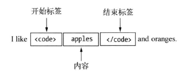
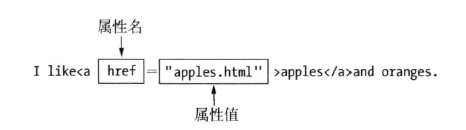

[HTML](https://developer.mozilla.org/en-US/docs/Learn/HTML) 指的是超文本标记语言 (**H**yper **T**ext **M**arkup **L**anguage)，是用于构造网页及其内容的代码。

# HTML文档

HTML 文档*描述网页内容的结构*，它由一系列HTML元素组成，它的扩展名是`.html`。

> 最佳实践：完全以小写字母命名文件夹和文件，不要有空格，并用连字符分隔单词。

Web 浏览器的作用是读取 HTML 文档，并以网页的形式显示出它们。

> 用于处理HTML文档的软件称为用户代理（user agent），浏览器是最主要的用户代理。

一个典型的HTML文档结构：

```html
<!DOCTYPE html>
<html lang="en">
<head>
  <meta charset="UTF-8">
  <meta name="viewport" content="width=device-width, initial-scale=1.0">
  <title>Document</title>
</head>
<body>
    
</body>
</html>
```

# 文档类型

`<!DOCTYPE>`是一个文档类型标记，用于告诉标准通用标记语言（SGML）解析器，它应该使用什么样的文档类型定义（DTD）来解析文档，并且它的根元素是什么。

> 实际上，通过`<!DOCTYPE>`可以在一个文档中混合使用多种标记语言。

HTML5：

```html
<!DOCTYPE html>
```

> 注：HTML5不是基于 SGML，因此不要求引用 DTD。

HTML 4.01：

```html
<!DOCTYPE HTML PUBLIC "-//W3C//DTD HTML 4.01 Transitional//EN"
"http://www.w3.org/TR/html4/loose.dtd">
```

XHTML 1.0：

```html
<!DOCTYPE html PUBLIC "-//W3C//DTD XHTML 1.0 Transitional//EN"
"http://www.w3.org/TR/xhtml1/DTD/xhtml1-transitional.dtd">
```

# 文档语言

```html
<html lang="en-US">
<html lang="zh-Hans"> （简体中文）
```

这在很多方面都很有用。如果设置了语言，搜索引擎将更有效地为您的 HTML 文档编制索引，并且对于使用屏幕阅读器的人更有帮助。

您还可以将文档的子部分设置为被识别为不同的语言。例如：

```html
<p>Japanese example: <span lang="ja">ご飯が熱い。</span>.</p>
```

语言代码由[ISO 639-1](https://en.wikipedia.org/wiki/ISO_639-1)标准定义。您可以在 HTML 和 XML中的[语言标签中](https://www.w3.org/International/articles/language-tags/)找到有关它们的更多信息。

在父层元素声明的语言信息，将被子层元素所继承，除非这些元素显式声明了不同的语言。

# HTML注释

注释以标签`<!--`开头，以`-->`结尾。浏览器会忽略这两个标签之间的一切内容。

# HTML元素

HTML元素是一种用来向浏览器说明文档内容的**结构和含义**的工具。（而CSS则是用于控制内容的**显现形式**）

HTML 元素指的是从开始标签（start tag）到结束标签（end tag）的所有代码。

HTML 标签是由*尖括号*包围的关键词，不区分大小写，比如 `<html>`。HTML 标签通常是*成对出现*的，标签对中的第一个标签是开始标签，第二个标签是结束标签。

开始标签与结束标签之间的内容是**元素的内容**。



## 元素嵌套

大多数 HTML 元素可以互相嵌套，形成父元素、子元素、后代元素、祖先元素、兄弟元素关系。

一个元素能以什么样的元素为父元素或子元素是有限制的，这些限制通过元素类别表现出来。

## 元素类别

在 HTML 中有两个重要的元素类别需要了解：块级元素和内联元素。

- 块级元素在页面上形成一个可见的块。块级元素出现在它前面的内容之后的新行上。块级元素之后的任何内容也会出现在新行上。块级元素通常是页面上的结构元素。块级元素不会嵌套在行内元素内，但它可能嵌套在另一个块级元素内。
- 内联元素包含在块级元素中，并且仅围绕文档内容的一小部分（而不是整个段落或内容分组）。内联元素不会导致文档中出现新行。它通常与文本一起使用。

> **注意**：HTML5 重新定义了元素类别：请参阅[元素内容类别](https://html.spec.whatwg.org/multipage/indices.html#element-content-categories)。虽然这些定义比它们的前辈更准确、更明确，但新定义比*块*和*内联*更难理解*。*本文将保留这两个术语。

## 空元素

某些 HTML 元素没有内容，称为空元素（empty content 或 void element）。

空元素有两种表示法：

1. 只使用开始标签（HTML），例如`<hr>`；
2. `<…/>`（XHTML），例如`<hr/>`。

空元素有：`<area>`、`<base>`、`<br>`、`<col>`、`<colgroup>`、`<command>`、`<embed>`、`<hr>`、``、`<input>`、`<keygen>`、`<link>`、`<meta>`、`<param>`、`<source>`、`<track>`、`<wbr>`。

## 元素属性

元素可以用属性（attribute）进行配置。一个元素可以应用多个属性，属性之间以一个或几个空格分隔。多个属性的顺序未作要求。

属性总是在 HTML 元素的*开始标签*中设置，它总是以名称/值对的形式出现，比如：



属性值既可以使用双引号界定，也可以用单引号界定。

> 不包含 ASCII 空格或任何`"` `'` ``` `=` `<` `>`等字符的简单属性值可以保持不加引号，但建议对任何属性值都加引号

### 布尔属性

布尔属性可以不需要设定一个值，只需将属性名添加到元素中即表示`true`。

为布尔属性指定任意字符串作为其值，效果是一样的：

```html
<input disable>
<input disable="">
<input disable="disable">
```

### 自定义属性

用户可以自定义属性，但自定义属性名必须以`data-`开头。

```html
<input disabled="true" data-creator="adam" data-purpose="collection">
```

自定义属性与CSS和JavaScript结合起来很有用。

### 公共属性

公共属性可用于任何 HTML 元素。

| 属性                                                         | 描述                                                   |
| :----------------------------------------------------------- | :----------------------------------------------------- |
| [accesskey](https://www.w3school.com.cn/tags/att_standard_accesskey.asp) | 规定激活元素的快捷键。                                 |
| [class](https://www.w3school.com.cn/tags/att_standard_class.asp) | 规定元素的一个或多个类名（引用样式表中的类）。         |
| [contenteditable](https://www.w3school.com.cn/tags/att_global_contenteditable.asp) | 规定元素内容是否可编辑。                               |
| [contextmenu](https://www.w3school.com.cn/tags/att_global_contextmenu.asp) | 规定元素的上下文菜单。上下文菜单在用户点击元素时显示。 |
| [data-*](https://www.w3school.com.cn/tags/att_global_data.asp) | 用于存储页面或应用程序的私有定制数据。                 |
| [dir](https://www.w3school.com.cn/tags/att_standard_dir.asp) | 规定元素中内容的文本方向。                             |
| [draggable](https://www.w3school.com.cn/tags/att_global_draggable.asp) | 规定元素是否可拖动。                                   |
| [dropzone](https://www.w3school.com.cn/tags/att_global_dropzone.asp) | 规定在拖动被拖动数据时是否进行复制、移动或链接。       |
| [hidden](https://www.w3school.com.cn/tags/att_global_hidden.asp) | 规定元素仍未或不再相关。                               |
| [id](https://www.w3school.com.cn/tags/att_standard_id.asp)   | 规定元素的唯一 id。                                    |
| [lang](https://www.w3school.com.cn/tags/att_standard_lang.asp) | 规定元素内容的语言。                                   |
| [spellcheck](https://www.w3school.com.cn/tags/att_global_spellcheck.asp) | 规定是否对元素进行拼写和语法检查。                     |
| [style](https://www.w3school.com.cn/tags/att_standard_style.asp) | 规定元素的行内 CSS 样式。                              |
| [tabindex](https://www.w3school.com.cn/tags/att_standard_tabindex.asp) | 规定元素的 tab 键次序。                                |
| [title](https://www.w3school.com.cn/tags/att_standard_title.asp) | 规定有关元素的额外信息。                               |
| [translate](https://www.w3school.com.cn/tags/att_global_translate.asp) | 规定是否应该翻译元素内容。                             |

# HTML实体

在 HTML 中，某些字符是预留的。如果希望正确地显示预留字符，我们必须在 HTML 源代码中使用字符实体（character entities）。

字符实体类似这样：

```html
&entity_name;

或者

&#entity_number;
```

## 常用的字符实体

| 显示结果 | 描述              | 实体名称            | 实体编号  |
| :------- | :---------------- | :------------------ | :-------- |
|          | 空格              | `&nbsp;`            | `&#160;`  |
| <        | 小于号            | `&lt;`              | `&#60;`   |
| >        | 大于号            | `&gt;`              | `&#62;`   |
| &        | 和号              | `&amp;`             | `&#38;`   |
| "        | 引号              | `&quot;`            | `&#34;`   |
| '        | 撇号              | `&apos; `(IE不支持) | `&#39;`   |
| ￠       | 分（cent）        | `&cent;`            | `&#162;`  |
| £        | 镑（pound）       | `&pound;`           | `&#163;`  |
| ¥        | 元（yen）         | `&yen;`             | `&#165;`  |
| €        | 欧元（euro）      | `&euro;`            | `&#8364;` |
| §        | 小节              | `&sect;`            | `&#167;`  |
| ©        | 版权（copyright） | `&copy;`            | `&#169;`  |
| ®        | 注册商标          | `&reg;`             | `&#174;`  |
| ™        | 商标              | `&trade;`           | `&#8482;` |
| ×        | 乘号              | `&times;`           | `&#215;`  |
| ÷        | 除号              | `&divide;`          | `&#247;`  |

> 实体名称对大小写敏感！
>
> 完整的实体符号参考，请访问 [HTML 实体符号参考手册](https://www.w3school.com.cn/tags/html_ref_entities.html)。

# HTML头部

HTML 头部是[`<head>`](https://developer.mozilla.org/en-US/docs/Web/HTML/Element/head)元素的内容——与元素的内容`<body>`（在浏览器中加载时显示在页面上）不同，头部的内容不显示在页面上。相反，头部的工作是包含有关文档的元数据。

## 文档标题

[`<title>`](https://developer.mozilla.org/en-US/docs/Web/HTML/Element/title)元素是表示整个 HTML 文档（而不是文档正文）标题的元数据。

## 元数据

元数据（[`<meta>`](https://developer.mozilla.org/en-US/docs/Web/HTML/Element/meta)元素）可以向浏览器提供文档的一些信息。

### 指定文档的字符编码

目前在大部分浏览器中，直接输出中文会出现中文乱码的情况，这时候我们就需要在头部将字符声明为 UTF-8 或 GBK。

```html
<meta charset="utf-8">
```

### 添加作者和描述

许多`<meta>`元素包括`name`和`content`属性：

- `name`指定元元素的类型；它包含什么类型的信息。
- `content` 指定实际的元内容。

```html
<meta name="author" content="Chris Mills">
<meta name="description" content="The MDN Web Docs Learning Area aims to provide
complete beginners to the Web with all they need to know to get
started with developing web sites and applications.">
```

> **注意**：许多`<meta>`功能不再使用。例如，`<meta name="keywords" content="fill, in, your, keywords, here">`。

## 网站图标

```html
<link rel="icon" href="favicon.ico" type="image/x-icon">
```

网站图标的格式可以是：`.ico`、`.gif`或`.png`，但使用 ICO 格式将确保它可以在 Internet Explorer 6 中使用。

> **注意：**如果您的站点使用内容安全策略 (CSP) 来增强其安全性，则该策略适用于网站图标。如果您遇到网站图标未加载的问题，请确认[`Content-Security-Policy`](https://developer.mozilla.org/en-US/docs/Web/HTTP/Headers/Content-Security-Policy)标头的[`img-src`指令](https://developer.mozilla.org/en-US/docs/Web/HTTP/Headers/Content-Security-Policy/img-src)没有阻止对其进行访问。

## 应用CSS

[`<link>`](https://developer.mozilla.org/en-US/docs/Web/HTML/Element/link)

```html
<link rel="stylesheet" href="my-css-file.css">
```

## 应用JavaScript

[`<script>`](https://developer.mozilla.org/en-US/docs/Web/HTML/Element/script)

```html
<script src="my-js-file.js" defer></script>
```

`defer`指示浏览器在页面完成解析 HTML 后运行 JavaScript。这很有用，因为它可以确保在 JavaScript 运行之前加载所有 HTML（脚本和 HTML 仍是同时加载。脚本将按照它们出现在页面上的顺序加载（确保了脚本之间的依赖顺序），它们在页面内容全部加载后才会运行），这样您就不会因为 JavaScript 尝试访问页面上尚不存在的 HTML 元素而导致错误。

> 这个问题的一个老式解决方案曾经是将您的脚本元素放在正文的底部（例如，就在`</body>`标签之前），这样它就会在所有 HTML 被解析后加载。此解决方案的问题在于，在加载 HTML DOM 之前完全阻塞脚本的加载/解析。在包含大量 JavaScript 的大型网站上，这可能会导致严重的性能问题，从而降低网站速度。

除了延迟运行脚本外，还有一个异步运行脚本——`async`属性。它将在遇到`<script>`时下载脚本而不会阻塞页面。但是，一旦下载完成，脚本就会执行，从而阻塞页面呈现。您无法保证脚本将以任何特定顺序运行。在页面中的脚本彼此独立运行且不依赖于页面上的其他脚本时才适合使用`async`。

以下是不同脚本加载方法的直观表示以及这对您的页面的意义：


> **注意**：该`<script>`元素可能看起来像一个空元素，但它不是，因此需要一个结束标记。

除了指向外部脚本文件之外，您还可以选择将脚本放在`<script>`元素中。

```html
<script>
    document.getElementById('demo').innerHTML = '我的第一段JavaScript';
</script>
```

> 旧的JavaScript例子也许会使用`type`属性，例如`<script type='text/javascript'>`。现在已经不需要了，JavaScript已经是HTML中的默认脚本语言了。

# HTML正文

文档正文包含在[`<body>`](https://developer.mozilla.org/en-US/docs/Web/HTML/Element/body)元素之中。

## HTML中的空格

无论您在 HTML 元素内容中使用多少空格（包括换行符），HTML 解析器在呈现代码时会将每个空格序列缩减为一个空格。

# 文本

## 标题

有六个标题元素：[`<h1>`](https://developer.mozilla.org/en-US/docs/Web/HTML/Element/Heading_Elements)（最好每页使用一个——这是顶级标题）、[`<h2>`](https://developer.mozilla.org/en-US/docs/Web/HTML/Element/Heading_Elements)、[`<h3>`](https://developer.mozilla.org/en-US/docs/Web/HTML/Element/Heading_Elements)、[`<h4>`](https://developer.mozilla.org/en-US/docs/Web/HTML/Element/Heading_Elements)、[`<h5>`](https://developer.mozilla.org/en-US/docs/Web/HTML/Element/Heading_Elements)和[`<h6>`](https://developer.mozilla.org/en-US/docs/Web/HTML/Element/Heading_Elements)。每个元素代表文档中不同级别的内容；`<h1>`表示主标题、`<h2>`表示副标题、`<h3>`表示副副标题等。

```html
<h1>I am the title of the story.</h1>
```

## 段落

[`<p>`](https://developer.mozilla.org/en-US/docs/Web/HTML/Element/p)

```html
<p>I am a paragraph, oh yes I am.</p>
```

## 列表

### 无序列表

无序列表用于标记与条目顺序无关的项目列表。[`<ul>`](https://developer.mozilla.org/en-US/docs/Web/HTML/Element/ul)  [`<li>`](https://developer.mozilla.org/en-US/docs/Web/HTML/Element/li)

```html
<ul>
    <li>milk</li>
    <li>eggs</li>
    <li>bread</li>
    <li>hummus</li>
</ul>
```

### 有序列表

[`<ol>`](https://developer.mozilla.org/en-US/docs/Web/HTML/Element/ol)

```html
<ol>
    <li>Drive to the end of the road</li>
    <li>Turn right</li>
    <li>Go straight across the first two roundabouts</li>
    <li>Turn left at the third roundabout</li>
    <li>The school is on your right, 300 meters up the road</li>
</ol>
```

### 列表嵌套

```html
<ol>
    <li>Remove the skin from the garlic, and chop coarsely.</li>
    <li>Remove all the seeds and stalk from the pepper, and chop coarsely.</li>
    <li>Add all the ingredients into a food processor.</li>
    <li>Process all the ingredients into a paste.
        <ul>
            <li>If you want a coarse "chunky" hummus, process it for a short time.</li>
            <li>If you want a smooth hummus, process it for a longer time.</li>
        </ul>
    </li>
</ol>
```

## 强调

在 HTML 中，我们使用[`<em>`](https://developer.mozilla.org/en-US/docs/Web/HTML/Element/em)元素来表示强调，使用[`<strong>`](https://developer.mozilla.org/en-US/docs/Web/HTML/Element/strong)元素来表示更强的强调。

```html
<p>This liquid is <strong>highly toxic</strong> —
if you drink it, <strong>you may <em>die</em></strong>.</p>
```

默认情况下，浏览器将`<em>`样式设置为斜体，将`<strong>`样式设置为粗体文本，但您不应纯粹使用这些标签来获得斜体或粗体样式。

## 斜体、粗体、下划线

像这样[`<b>`](https://developer.mozilla.org/en-US/docs/Web/HTML/Element/b)（粗体）、[`<i>`](https://developer.mozilla.org/en-US/docs/Web/HTML/Element/i)（斜体）和[`<u>`](https://developer.mozilla.org/en-US/docs/Web/HTML/Element/u)（下划线）只影响表现而不影响语义的元素被称为**表现元素**，不应再使用。因为正如我们之前看到的，语义对可访问性、搜索引擎优化等非常重要。

最佳实践：

- [`<i>`](https://developer.mozilla.org/en-US/docs/Web/HTML/Element/i) ：外来词、分类名称、技术术语、思想...
- [`<b>`](https://developer.mozilla.org/en-US/docs/Web/HTML/Element/b) ：关键词、产品名称、引导句......
- [`<u>`](https://developer.mozilla.org/en-US/docs/Web/HTML/Element/u) ：专有名称、拼写错误......

由于超链接经常使用下划线，因此最好使用 CSS 将`<u>`的默认下划线样式更改为更适合内容的样式。

```html
<!-- scientific names -->
<p>
    The Ruby-throated Hummingbird (<i>Archilochus colubris</i>)
    is the most common hummingbird in Eastern North America.
</p>

<!-- foreign words -->
<p>
    The menu was a sea of exotic words like <i lang="uk-latn">vatrushka</i>,
    <i lang="id">nasi goreng</i> and <i lang="fr">soupe à l'oignon</i>.
</p>

<!-- a known misspelling -->
<p>
    Someday I'll learn how to <u style="text-decoration-line: underline; text-decoration-style: wavy;">spel</u> better.
</p>

<!-- Highlight keywords in a set of instructions -->
<ol>
    <li>
        <b>Slice</b> two pieces of bread off the loaf.
    </li>
    <li>
        <b>Insert</b> a tomato slice and a leaf of
        lettuce between the slices of bread.
    </li>
</ol>
```

# 超链接

# 表单

# 图形

## 画布

## SVG

# HTML媒体

# 地理定位

# 拖放

# Web存储

# 应用缓存

# Web Worker

# Server-Sent 事件