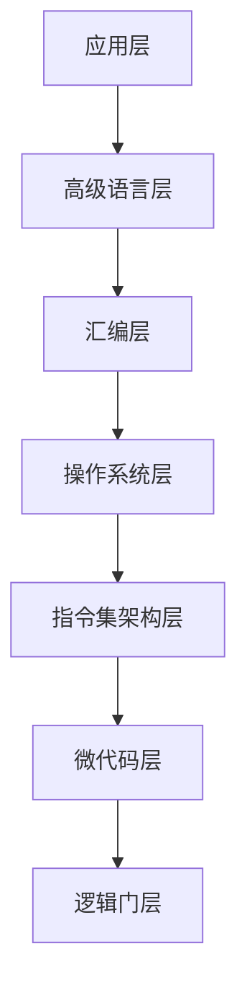

# 概述

一个典型计算机系统的层次结构：



# 应用层

# 高级语言层

# 指令集架构层

## 信息表示

## 计算机体系结构

### 硬件

#### 中央处理单元

#### 主存储器

主存保存四类信息：

- CPU处理的数据
- CPU执行的程序指令（因此，主存中包含了在系统中正在执行的所有应用程序的副本）
- 从外部环境接收数据的输入连接（内存映射输入）
- 向外部环境发送数据的输出连接（内存映射输出）

### 冯·诺依曼机器

冯·诺依曼机器执行一个程序所需步骤称为冯·诺依曼执行周期，它包括五个操作：

- 从`主存[PC]`中取指
- 译码被取指令
- 增加PC
- 执行被取指令
- 重复

> 注意：增加PC操作一定要在执行被取指令操作之前，否则，像跳转指令这类会直接修改PC寄存器值的操作将会被增加PC操作所覆盖，而无法正确工作。

冯·诺依曼周期被固化在CPU中，它伪代码描述如下：

```
（程序已被加载到主存0000处。）
PC = 0000
SP = 主存[FFF4]
do {
	从主存[PC]处获取指令指示符，并放到IR的第一个字节
	PC = PC + 1
	译码被取指令
	if (指令不是一元的) {
		从主存[PC]处获取操作数指示符，并放到IR的第一个字节之后
		PC = PC + 2
	}
	执行被取指令
} while (刚刚执行的指令不是停止指令 && 操作是合法的)
```

冯·诺依曼机器的程序和数据共享主存，这使得写一个用于处理另一个程序的程序成为可能。

> 将程序加载到主存0000处，这是由操作系统的装载器来完成的。
>
> 操作系统的装载器通常是固化到ROM中的。在计算机开机时，PC会被初始化为装载器的起始位置，从而导致装载器被启动执行。装载器启动完成后，就可以开始加载应用程序了。

# 汇编层

## 汇编语言

## 语言翻译原理

# 操作系统层

## 进程管理

## 存储管理

# 逻辑门层

## 组合电路

## 时序电路

# 微代码层