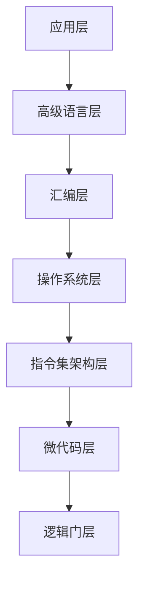

# 概述

一个典型计算机系统的层次结构：

# 应用层

# 高级语言层

# 指令集架构层

## 信息表示

## 计算机体系结构

### 硬件

#### 中央处理单元

#### 主存储器

主存保存四类信息：

- CPU处理的数据
- CPU执行的程序指令（因此，主存中包含了在系统中正在执行的所有应用程序的副本）
- 从外部环境接收数据的输入连接（内存映射输入）
- 向外部环境发送数据的输出连接（内存映射输出）

# 汇编层

## 汇编语言

## 语言翻译原理

# 操作系统层

## 进程管理

## 存储管理

# 逻辑门层

## 组合电路

## 时序电路

# 微代码层